## Keywords

1. [SQL-095 Statistics and Cardinality Estimation](#sql-095-statistics-and-cardinality-estimation)
2. [SQL-096 Join Algorithms - Nested Loop, Hash, Merge](#sql-096-join-algorithms---nested-loop-hash-merge)
3. [SQL-097 Plan Regression and pg_stat_statements](#sql-097-plan-regression-and-pgstatstatements)
4. [SQL-098 Table Partitioning - Range, List, Hash](#sql-098-table-partitioning---range-list-hash)
5. [SQL-099 Partition Pruning and Query Routing](#sql-099-partition-pruning-and-query-routing)
6. [SQL-100 Logical Replication and Physical Replication](#sql-100-logical-replication-and-physical-replication)
7. [SQL-101 Read Replicas - Scaling Reads](#sql-101-read-replicas---scaling-reads)
8. [SQL-102 Connection Pooling - PgBouncer and HikariCP](#sql-102-connection-pooling---pgbouncer-and-hikaricp)
9. [SQL-103 Backup and Point-in-Time Recovery (PITR)](#sql-103-backup-and-point-in-time-recovery-pitr)

---

---

# SQL-095 Statistics and Cardinality Estimation

**TL;DR** - PostgreSQL collects column-level statistics (histograms, most common values, distinct counts) via ANALYZE, and uses them to estimate how many rows each query operation will produce.

### 🔥 Problem Statement

The query planner's plan quality is only as good as its cardinality estimates. If the planner estimates a filter returns 100 rows but it actually returns 100,000, it will pick nested loop join (efficient for small sets) instead of hash join (efficient for large sets), turning a 10 ms query into a 60 second query. Statistics must accurately represent data distribution, correlation between columns, and skew. At production scale with billions of rows and hundreds of columns, maintaining accurate statistics without excessive ANALYZE overhead is a constant operational challenge.

### 📜 Historical Context

System R's original optimizer used uniform distribution assumptions - every value was equally likely. This worked poorly for real data, which is almost always skewed. PostgreSQL stores detailed per-column statistics in `pg_statistic` (exposed via `pg_stats`): most common values and their frequencies, a histogram of value distribution, correlation between physical and logical order, and distinct value count. PostgreSQL 10 introduced extended statistics (`CREATE STATISTICS`) for multi-column dependencies and MCV (most common value) lists, addressing the historical weakness of assuming column independence.

### 🔩 First Principles

**CORE INVARIANTS:**

1. Cardinality estimation is the single most important factor in plan quality - all cost calculations depend on estimated row counts
2. Statistics are samples, not exact counts - they approximate the true data distribution and can be wrong, especially at distribution tails
3. Single-column statistics assume column independence; correlated columns require extended statistics to estimate correctly

**DERIVED DESIGN:**
`ANALYZE` samples a configurable number of rows (`default_statistics_target * 300` pages) and computes: most common values (MCV list, up to `statistics_target` entries), a histogram of remaining values (up to `statistics_target` buckets), null fraction, average width, distinct value count (estimated), and correlation (physical vs logical order). The planner combines these per-column statistics to estimate selectivity of WHERE clauses, JOIN conditions, and GROUP BY cardinality.

**THE TRADE-OFF:**
**Gain:** Accurate cost estimation enables the planner to choose efficient plans for diverse data distributions.
**Cost:** ANALYZE consumes I/O and CPU; statistics occupy catalog storage; inaccurate statistics lead to catastrophically bad plans with no warning.

### 🧠 Mental Model

> Think of statistics as a survey about a city's population before building public transit routes (query plans). A good survey samples enough neighborhoods (data pages) to know that downtown (most common values) is dense, suburbs (histogram) are spread out, and certain areas are correlated (extended statistics). A transit planner using a survey from five years ago routes buses through empty lots (stale statistics).

- "Survey sample" -> ANALYZE sampling pages and rows
- "Neighborhood density" -> most common values and frequencies
- "Outdated survey" -> stale statistics after bulk data changes

**Where this analogy breaks down:** Database statistics are precise mathematical constructs (histograms, MCVs) with formal selectivity estimation formulas, not qualitative surveys.

### 🧩 Components

- **ANALYZE** - command that samples a table and updates pg_statistic
- **pg_statistic / pg_stats** - catalog table/view storing per-column statistics
- **MCV list** - most common values with their frequencies (up to statistics_target entries)
- **Histogram** - equal-depth histogram of non-MCV values
- **Correlation** - statistical correlation between physical tuple order and logical value order (affects index scan cost)
- **n_distinct** - estimated number of distinct values (negative value = fraction of rows)
- **Extended statistics** - multi-column statistics for functional dependencies and MCV combinations

```
  pg_stats for orders.status
  +-------------------+------------------+
  | most_common_vals  | {active,pending, |
  |                   |  shipped,done}   |
  | most_common_freqs | {0.45,0.30,      |
  |                   |  0.15,0.10}      |
  +-------------------+------------------+
  | histogram_bounds  | (remaining vals) |
  | null_frac         | 0.0              |
  | n_distinct        | 4                |
  | correlation       | 0.12             |
  +-------------------+------------------+
```

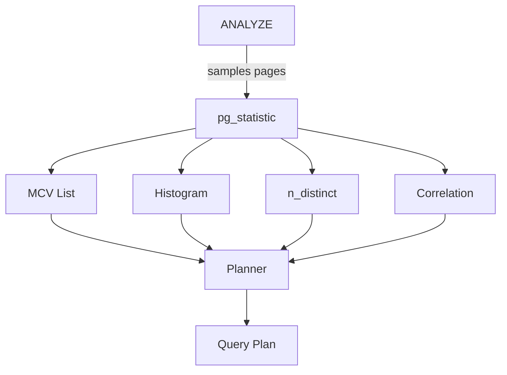
```mermaid
flowchart TD
    AN[ANALYZE] -->|samples pages| PGS[pg_statistic]
    PGS --> MCV[MCV List]
    PGS --> HIST[Histogram]
    PGS --> ND[n_distinct]
    PGS --> CORR[Correlation]
    MCV --> PL[Planner]
    HIST --> PL
    ND --> PL
    CORR --> PL
    PL --> PLAN[Query Plan]
```

### 📶 Gradual Depth

**Level 1 - What it is:**
Statistics tell the query planner about your data: how many distinct values a column has, which values are most common, and how values are distributed. The `ANALYZE` command collects these statistics.

**Level 2 - How to use it:**
Run `ANALYZE tablename;` after bulk loads or significant data changes. Check statistics accuracy with `EXPLAIN ANALYZE` - compare estimated rows to actual rows. Increase `default_statistics_target` (default 100) for columns with skewed distributions.

**Level 3 - How it works:**
`ANALYZE` reads a sample of `statistics_target * 300` pages. From the sample, it computes the most common values (top N values by frequency, where N = `statistics_target`) and builds an equal-depth histogram from the remaining values. Selectivity estimation for `WHERE status = 'active'` checks the MCV list first; if found, returns the stored frequency. If not found, it assumes uniform distribution across histogram buckets.

**Level 4 - Production mastery:**
The planner assumes column independence: the selectivity of `WHERE a = 1 AND b = 2` is estimated as `sel(a=1) * sel(b=2)`. If a and b are correlated (e.g., `country = 'US'` and `currency = 'USD'`), this underestimates or overestimates dramatically. Use `CREATE STATISTICS s1 (dependencies) ON country, currency FROM transactions;` to capture the correlation. Monitor `pg_stats_ext` for extended statistics health. For partitioned tables, per-partition statistics are crucial - the planner must know each partition's data distribution to enable partition pruning.

### ⚙️ How It Works

**Phase 1 - Sampling:** ANALYZE reads a random sample of pages from the table (up to `statistics_target * 300` pages). It collects all tuples from sampled pages.

**Phase 2 - MCV computation:** Sort sampled values by frequency. The top `statistics_target` values become the MCV list with their frequencies.

**Phase 3 - Histogram construction:** Remove MCV values from the sample. Divide remaining values into `statistics_target` equal-depth buckets (each bucket contains the same number of values). Store bucket boundaries.

**Phase 4 - Derived statistics:** Compute null_frac (fraction of NULLs), n_distinct (estimated distinct value count using the Haas-Stokes estimator), correlation (Pearson correlation between physical tuple position and value order), and average column width.

**Phase 5 - Catalog update:** Write all statistics to pg_statistic. The planner reads these on every planning cycle.

```
  Selectivity Estimation
  WHERE status = 'active'
  1. Check MCV: 'active' found, freq=0.45
  2. Return selectivity = 0.45

  WHERE amount > 500
  1. Not in MCV list
  2. Find histogram bucket containing 500
  3. Interpolate within bucket
  4. Return fraction of rows above 500
```

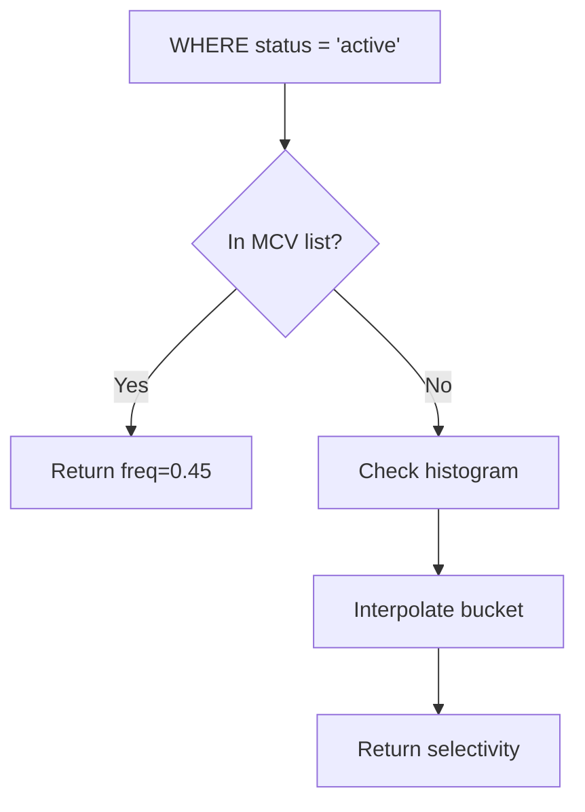
```mermaid
flowchart TD
    Q["WHERE status = 'active'"]
    Q --> MCV{In MCV list?}
    MCV -->|Yes| FREQ["Return freq=0.45"]
    MCV -->|No| HIST[Check histogram]
    HIST --> INTERP[Interpolate bucket]
    INTERP --> SEL[Return selectivity]
```

**BAD:**

```sql
SELECT * FROM orders
WHERE status = 'pending';
-- Planner estimates 20%, actual 0.1%
-- Seq scan instead of index scan
```

**GOOD:**

```sql
ALTER TABLE orders
ALTER COLUMN status
SET STATISTICS 1000;
ANALYZE orders;
-- Accurate distribution now visible
```

### 🚨 Failure Modes

**Failure 1 - Stale statistics after bulk load:**
**Symptom:** Query suddenly slows down after data migration or ETL job. `EXPLAIN ANALYZE` shows estimated rows 10-100x off from actual rows.
**Root cause:** ANALYZE has not run since the data load. Autovacuum's ANALYZE trigger (`autovacuum_analyze_threshold + scale_factor * n_live_tup`) has not been reached.
**Diagnostic:**

```sql
SELECT schemaname, relname,
       last_analyze, last_autoanalyze,
       n_live_tup, n_dead_tup
FROM pg_stat_user_tables
WHERE relname = 'orders';
```

**Fix:** Run `ANALYZE orders;` immediately after bulk loads. Set `autovacuum_analyze_scale_factor = 0.01` for large, frequently changing tables.

**Failure 2 - Correlated column misestimation:**
**Symptom:** Multi-column WHERE clause returns far more or fewer rows than estimated. Planner picks wrong join strategy.
**Root cause:** Planner multiplies individual column selectivities, assuming independence. Correlated columns violate this assumption.
**Diagnostic:**

```sql
-- Estimated vs actual for correlated cols
EXPLAIN ANALYZE
SELECT * FROM transactions
WHERE country = 'US' AND currency = 'USD';
-- If estimated << actual: positive correlation
```

**Fix:** Create extended statistics:

```sql
CREATE STATISTICS txn_country_currency
  (dependencies)
  ON country, currency FROM transactions;
ANALYZE transactions;
```

### 🔬 Production Reality

A typical scenario: an e-commerce platform filters orders by `region` and `warehouse`. These columns are highly correlated (region 'EU-West' always uses warehouse 'AMS-1'). The planner estimates `WHERE region = 'EU-West' AND warehouse = 'AMS-1'` will return 0.1% \* 0.05% = 0.00005% of rows (about 5 rows from 10M). Actual result: 500,000 rows. The planner picks nested loop with index scan, expecting 5 rows. It takes 45 seconds instead of the 200 ms a hash join would take. After `CREATE STATISTICS` on the correlated pair, the estimate becomes accurate, and the planner switches to hash join.

### ⚖️ Trade-offs & Alternatives

| Aspect                         | PostgreSQL ANALYZE          | Oracle DBMS_STATS          | MySQL histograms (8.0+)  |
| ------------------------------ | --------------------------- | -------------------------- | ------------------------ |
| Automation                     | Autovacuum-triggered        | Auto-task or manual        | Manual only              |
| Histogram type                 | Equal-depth                 | Height-balanced or hybrid  | Singleton or equi-height |
| Extended statistics            | Dependencies + MCV (PG 10+) | Column groups, expressions | Not supported            |
| Sampling method                | Block-level random          | Row-level or block-level   | Full or sampled          |
| Statistics staleness detection | autovacuum threshold        | Stale % tracking           | Manual check             |

### ⚡ Decision Snap

**USE WHEN:**

- Diagnosing query plan regressions - check if estimated vs actual rows diverge
- After any bulk data modification - always ANALYZE affected tables
- Correlated columns in WHERE clauses - create extended statistics

**AVOID WHEN:**

- Do not set `default_statistics_target` to 10000 globally - it massively increases ANALYZE time for minimal planner benefit
- Do not rely solely on autovacuum for ANALYZE after large ETL jobs

**PREFER extended statistics WHEN:**

- Multi-column filters consistently produce wrong cardinality estimates
- Functional dependencies between columns are known (e.g., zip code determines city)

### ⚠️ Top Traps

| #   | Misconception                                           | Reality                                                                                                               |
| --- | ------------------------------------------------------- | --------------------------------------------------------------------------------------------------------------------- |
| 1   | ANALYZE reads the entire table                          | ANALYZE samples approximately statistics_target \* 300 pages - it reads a fraction of large tables                    |
| 2   | Higher statistics_target is always better               | Beyond 500-1000, the marginal improvement in estimate accuracy is minimal and ANALYZE time increases significantly    |
| 3   | Statistics are exact counts                             | Statistics are estimates from a sample; they can be wrong, especially for rare values at distribution tails           |
| 4   | Index statistics are separate from table statistics     | ANALYZE on a table updates statistics for all indexed and non-indexed columns; there are no separate index statistics |
| 5   | The planner considers column correlations automatically | By default, the planner assumes column independence; correlated columns require explicit CREATE STATISTICS            |

### 🪜 Learning Ladder

**Prerequisites:**

- SQL-060 Execution Plans Deep Dive - EXPLAIN ANALYZE - know how to compare estimated vs actual rows
- SQL-094 Query Planner and Cost-Based Optimization - understand how the planner uses statistics

**THIS:** SQL-095 Statistics and Cardinality Estimation

**Next steps:**

- SQL-096 Join Algorithms - Nested Loop, Hash, Merge - wrong cardinality estimates lead to wrong join algorithm selection
- SQL-097 Plan Regression and pg_stat_statements - detecting when stale statistics cause plan changes
- SQL-130 Query Optimization Theory - Selinger Optimizer - theoretical foundations of cost-based optimization

**The Surprising Truth:**
The `correlation` statistic - how closely the physical order of tuples on disk matches the logical order of values - is one of the most impactful yet least understood statistics. A correlation of 0.9 for a timestamp column means an index range scan will read pages nearly sequentially (cheap). A correlation of 0.01 means the same range scan will read pages randomly (expensive). The planner uses this to decide between index scan and bitmap index scan, and getting it wrong can change query cost by 10x.

**Further Reading:**

- PostgreSQL Documentation: pg_stats view (postgresql.org/docs/current/view-pg-stats.html)
- PostgreSQL Documentation: CREATE STATISTICS (postgresql.org/docs/current/sql-createstatistics.html)
- Haas, P.J. and Stokes, L. "Estimating the Number of Classes in a Finite Population", JASA, 1998

**Revision Card:**

1. The planner depends entirely on statistics for cardinality estimation - stale statistics are the #1 cause of bad plans
2. Single-column statistics assume independence; use CREATE STATISTICS for correlated columns
3. The correlation statistic determines whether index scans read pages sequentially or randomly - it silently controls I/O cost

---

---

# SQL-096 Join Algorithms - Nested Loop, Hash, Merge

**TL;DR** - PostgreSQL selects among three join algorithms based on estimated data sizes: nested loop for small/indexed joins, hash join for medium-large equi-joins, and merge join for pre-sorted or large sorted joins.

### 🔥 Problem Statement

Joining two tables is the most resource-intensive operation in SQL. A naive approach (compare every row in table A with every row in table B) has O(N\*M) complexity - joining two 1-million-row tables would require 1 trillion comparisons. At production scale, queries join 3-10 tables, each potentially millions of rows. The choice of join algorithm determines whether a query runs in milliseconds or hours. Understanding when and why PostgreSQL selects each algorithm is essential for diagnosing slow joins and guiding the planner through query structure.

### 📜 Historical Context

The three classic join algorithms - nested loop, sort-merge, and hash join - were formalized in the database research of the 1970s-1980s. System R implemented nested loop and sort-merge. Hash join was added later and became dominant for large equi-joins. PostgreSQL implements all three, with hash join available since version 7.1. Parallel hash join was added in PostgreSQL 11. The planner selects the algorithm based on cost estimation - there is no manual hint to force a specific algorithm (though disabling algorithms via `enable_hashjoin = off` is possible for diagnostics).

### 🔩 First Principles

**CORE INVARIANTS:**

1. Nested loop is the only algorithm that works for all join conditions (including inequality and cross joins)
2. Hash join requires an equality condition and sufficient `work_mem` to hold the hash table of the smaller side
3. Merge join requires sorted inputs (either pre-sorted via index or explicitly sorted) and an equality or range condition

**DERIVED DESIGN:**
The planner evaluates all three algorithms for every join and picks the cheapest. Nested loop is preferred when the inner side is small or has a fast index lookup. Hash join is preferred when both sides are large but one fits in `work_mem`. Merge join is preferred when both sides are already sorted (e.g., by indexes) or when the sorted output is needed for later operations.

**THE TRADE-OFF:**
**Gain:** Automatic algorithm selection optimizes for data characteristics without developer intervention.
**Cost:** Wrong cardinality estimates lead to wrong algorithm choice; `work_mem` sizing directly affects hash join efficiency; merge join sort overhead can dominate small joins.

### 🧠 Mental Model

> Three ways to match student exam papers with a grading rubric:

> **Nested Loop:** Pick up each paper, walk to the rubric binder, find the matching rubric. Fast if the rubric binder is organized (indexed inner side). Painfully slow if you must flip through all rubrics for each paper.

> **Hash Join:** Copy all rubric entries onto sticky notes organized by student ID on a wall (build hash table). Then walk through papers, glancing at the wall for each student ID. Fast for large batches.

> **Merge Join:** Sort both stacks by student ID. Walk through both stacks simultaneously, matching as you go. Fast when both are already sorted.

- "Rubric binder lookup" -> index scan on inner table (nested loop)
- "Sticky note wall" -> in-memory hash table (hash join)
- "Sorted stacks" -> pre-sorted inputs (merge join)

**Where this analogy breaks down:** Hash join handles multi-batch scenarios (spilling to disk) when the hash table exceeds memory, which has no clean analog in the paper metaphor.

### 🧩 Components

- **Nested Loop Join** - for each outer row, scan inner side (index or sequential). O(N*M) worst case, O(N*logM) with index.
- **Hash Join** - build hash table from smaller side, probe with larger side. O(N+M) for in-memory case.
- **Merge Join** - sort both sides (if not already sorted), merge. O(N*logN + M*logM) with sort, O(N+M) if pre-sorted.
- **work_mem** - memory available per sort/hash operation. Controls whether hash table fits in memory.
- **Parallel hash join** - build hash table cooperatively across parallel workers. Available since PostgreSQL 11.

```
  Algorithm Comparison
  +--------------+----------+-----------+--------+
  | Algorithm    | Best for | Join type | Memory |
  +--------------+----------+-----------+--------+
  | Nested Loop  | Small    | Any       | Low    |
  |              | inner    |           |        |
  | Hash Join    | Medium+  | Equi only | High   |
  |              | equi     |           |        |
  | Merge Join   | Large    | Equi/range| Medium |
  |              | sorted   |           |        |
  +--------------+----------+-----------+--------+
```

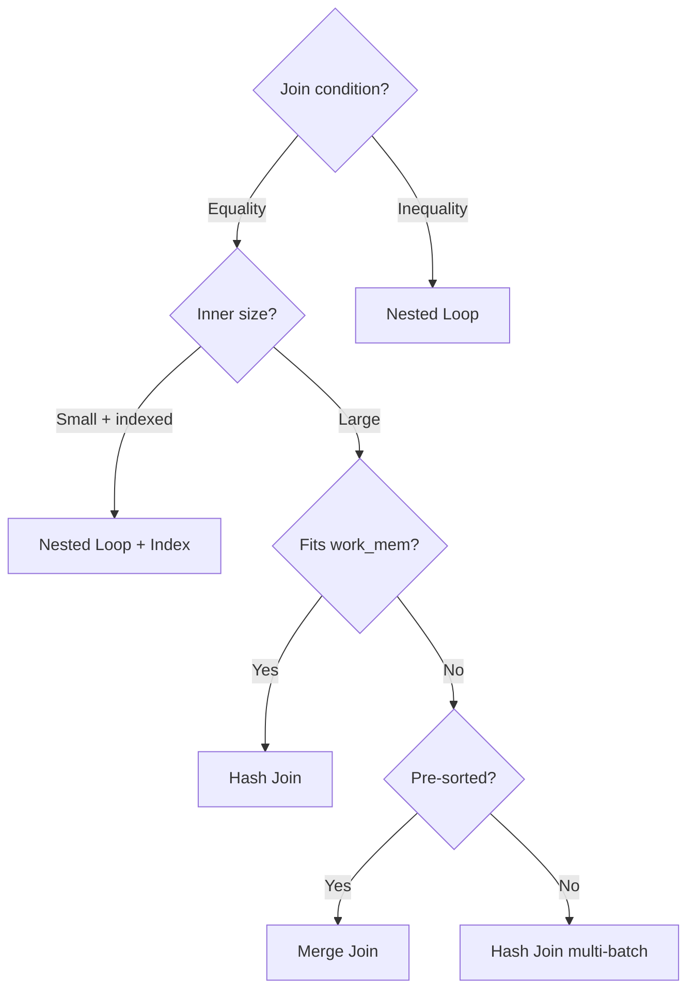
```mermaid
flowchart TD
    JC{Join condition?}
    JC -->|Equality| EQ{Inner size?}
    JC -->|Inequality| NL1[Nested Loop]
    EQ -->|Small + indexed| NL2[Nested Loop + Index]
    EQ -->|Large| MEM{Fits work_mem?}
    MEM -->|Yes| HJ[Hash Join]
    MEM -->|No| PRE{Pre-sorted?}
    PRE -->|Yes| MJ[Merge Join]
    PRE -->|No| HJD[Hash Join multi-batch]
```

### 📶 Gradual Depth

**Level 1 - What it is:**
When joining two tables, PostgreSQL picks one of three algorithms: nested loop (check each pair), hash join (build a lookup table in memory), or merge join (sort both sides and merge). The choice depends on data sizes and available memory.

**Level 2 - How to use it:**
Read `EXPLAIN ANALYZE` output to see which algorithm was selected. If a nested loop join shows millions of "loops," the planner may have underestimated the outer side. Increase `work_mem` if hash joins are spilling to disk (look for "Batches: N" where N > 1 in EXPLAIN).

**Level 3 - How it works:**
Hash join builds a hash table from the "inner" side (typically the smaller table): hash each join key and store the row in a bucket. Then scan the "outer" side and probe the hash table for each join key. If the hash table exceeds `work_mem`, it splits into batches, writing some buckets to temporary files and processing them in multiple passes. Merge join requires both inputs sorted on the join key - it advances through both in lockstep, emitting matches. Pre-sorted inputs (from an index) make merge join very efficient.

**Level 4 - Production mastery:**
The most common join performance problem is a nested loop join on a large result set. The planner estimated the outer side would produce 10 rows (so nested loop with index lookup is cheap at 10 lookups), but it actually produces 100,000 rows (100,000 index lookups is far more expensive than a single hash join). Fix the statistics first. If that does not work, increase `work_mem` to make hash join feasible. For very large joins, parallel hash join (PostgreSQL 11+) distributes the build phase across workers. Monitor `temp_blks_read/written` in `pg_stat_statements` to detect joins spilling to disk.

### ⚙️ How It Works

**Phase 1 - Nested Loop:** For each row from the outer input, scan the inner input for matching rows. With an index on the inner join key, each probe is O(logN). Without an index, each probe is O(N) - effective only when the outer side has very few rows.

**Phase 2 - Hash Join Build:** Scan the inner (build) side. Hash each join key and store the row in a hash bucket in memory. If the hash table exceeds `work_mem`, partition into batches and write overflow batches to temp files.

**Phase 3 - Hash Join Probe:** Scan the outer (probe) side. For each row, hash the join key and look up the matching bucket. For multi-batch joins, process one batch at a time, reading overflow from temp files.

**Phase 4 - Merge Join:** Ensure both inputs are sorted on the join key (via explicit sort or index). Advance through both simultaneously: if keys match, emit the join. If the outer key is less, advance the outer. If the inner key is less, advance the inner.

```
  Hash Join (in-memory)
  Build side: [A=1,B=3,C=2]
  Hash table: {1:[A], 2:[C], 3:[B]}

  Probe side: [X=2, Y=1, Z=4]
  X=2 -> bucket 2 -> match C -> emit
  Y=1 -> bucket 1 -> match A -> emit
  Z=4 -> bucket 4 -> empty   -> skip
```

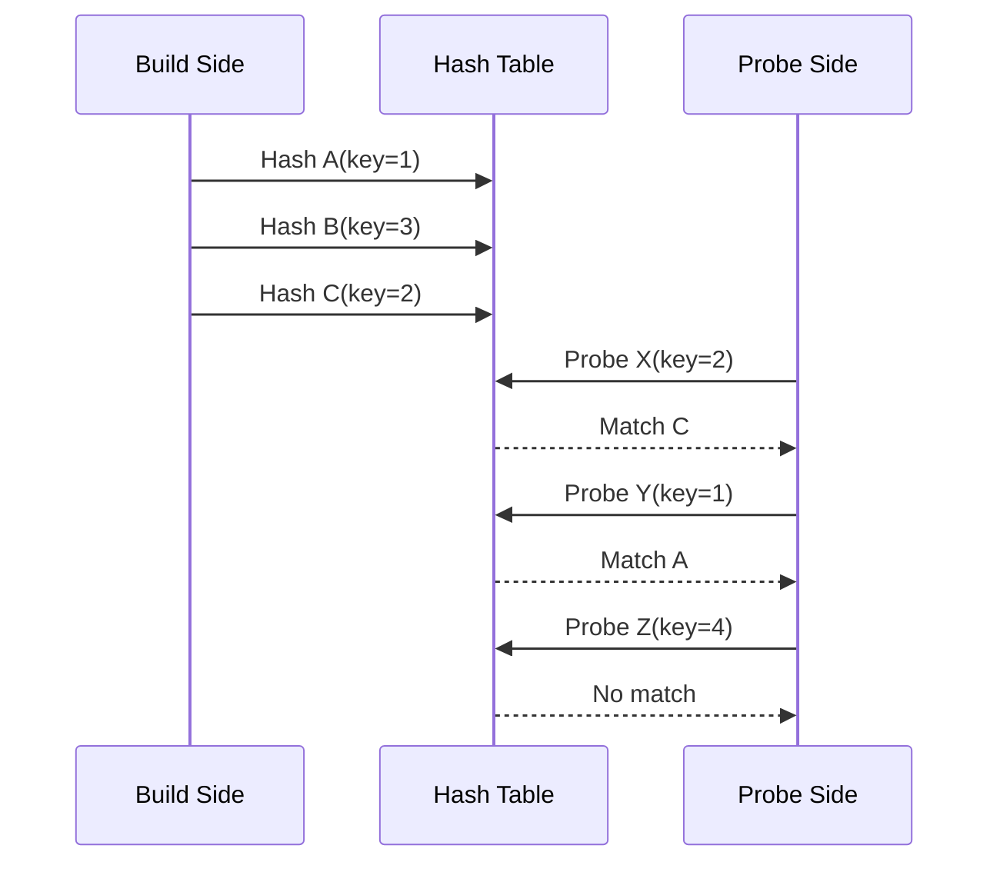
```mermaid
sequenceDiagram
    participant BS as Build Side
    participant HT as Hash Table
    participant PS as Probe Side
    BS->>HT: Hash A(key=1)
    BS->>HT: Hash B(key=3)
    BS->>HT: Hash C(key=2)
    PS->>HT: Probe X(key=2)
    HT-->>PS: Match C
    PS->>HT: Probe Y(key=1)
    HT-->>PS: Match A
    PS->>HT: Probe Z(key=4)
    HT-->>PS: No match
```

**BAD:**

```sql
SET work_mem = '1MB';
SELECT * FROM orders o
JOIN items i ON o.id = i.order_id;
-- Hash spills to disk: 10x slower
```

**GOOD:**

```sql
SET work_mem = '256MB';
SELECT * FROM orders o
JOIN items i ON o.id = i.order_id;
RESET work_mem;
```

### 🚨 Failure Modes

**Failure 1 - Nested loop on large outer set:**
**Symptom:** Query runs for minutes. `EXPLAIN ANALYZE` shows Nested Loop with thousands or millions of "loops" and high actual time per loop.
**Root cause:** Planner estimated the outer side would produce few rows (incorrect cardinality estimate), selecting nested loop instead of hash join.
**Diagnostic:**

```sql
EXPLAIN (ANALYZE, BUFFERS)
SELECT o.*, c.name
FROM orders o
JOIN customers c ON o.customer_id = c.id
WHERE o.created_at > '2025-01-01';
-- Look for: Nested Loop (actual rows=500000)
-- when estimated rows=100
```

**Fix:** Run `ANALYZE orders;` to fix statistics. If the problem persists, increase `work_mem` to enable hash join. As a diagnostic test: `SET enable_nestloop = off;` and compare plans.

**Failure 2 - Hash join disk spill:**
**Symptom:** Query is slower than expected. `EXPLAIN ANALYZE` shows hash join with "Batches: 16" or more. `temp_blks_read/written` is high.
**Root cause:** The build side hash table exceeds `work_mem` and is partitioned into multiple disk-based batches.
**Diagnostic:**

```sql
EXPLAIN (ANALYZE, BUFFERS)
SELECT * FROM big_a
JOIN big_b ON big_a.id = big_b.a_id;
-- Check: Hash (Batches: N) where N > 1
-- Check: temp read/written blocks
```

**Fix:** Increase `work_mem` for this session: `SET work_mem = '256MB';`. Or reduce the build side by adding selective WHERE conditions. For recurring queries, consider `ALTER SYSTEM SET work_mem` carefully (it applies per-sort/hash operation, not per query).

### 🔬 Production Reality

A typical pattern: a reporting query joins `orders` (50M rows) with `order_items` (200M rows) on `order_id`. With `work_mem = 4MB` (default), the hash table for orders exceeds memory and spills to 64 batches. The query takes 45 minutes. Setting `work_mem = '512MB'` for the reporting session allows the hash table to fit in memory. The query drops to 3 minutes. However, increasing `work_mem` globally is dangerous: if 100 concurrent queries each run 4 hash operations, memory usage is 100 _ 4 _ 512MB = 200 GB. The fix: set `work_mem` per-session for heavy queries, or use `pg_stat_statements` to identify queries that spill and tune them individually.

### ⚖️ Trade-offs & Alternatives

| Aspect         | Nested Loop                       | Hash Join                             | Merge Join                        |
| -------------- | --------------------------------- | ------------------------------------- | --------------------------------- |
| Complexity     | O(N*M) or O(N*logM) with index    | O(N+M) in-memory                      | O(NlogN + MlogM) with sort        |
| Memory         | Minimal                           | work_mem for hash table               | work_mem for sort (if needed)     |
| Join condition | Any (equality, inequality, cross) | Equality only                         | Equality or range                 |
| Best scenario  | Small outer, indexed inner        | Large equi-join, one side fits memory | Both sides pre-sorted by join key |
| Worst scenario | Large outer, no inner index       | Both sides huge, insufficient memory  | Neither side sorted, large data   |

### ⚡ Decision Snap

**USE WHEN:**

- Understanding join algorithms helps diagnose slow join queries (always relevant)
- Tuning work_mem for hash-join-heavy workloads
- Designing indexes to enable efficient nested loop or merge join paths

**AVOID WHEN:**

- Do not force join algorithms by disabling others (enable_hashjoin = off) in production
- Do not increase work_mem globally without understanding the per-operation memory impact

**PREFER merge join WHEN:**

- Both join inputs are already sorted (e.g., index scans in order)
- The join output needs to be sorted for ORDER BY or window functions (merge join preserves sort order)

### ⚠️ Top Traps

| #   | Misconception                                           | Reality                                                                                                                   |
| --- | ------------------------------------------------------- | ------------------------------------------------------------------------------------------------------------------------- |
| 1   | Hash join is always the fastest for large tables        | If one side has a selective filter reducing it to a few rows, nested loop with index scan is faster                       |
| 2   | work_mem controls total query memory                    | work_mem is per-sort/hash operation; a single query with 4 joins and 2 sorts can use 6x work_mem                          |
| 3   | Nested loop is always bad for large data                | Nested loop with index scan on the inner side is optimal when the outer side produces few rows                            |
| 4   | The smaller table is always the build side of hash join | The planner may choose the larger table as the build side if it has better selectivity after filtering                    |
| 5   | Merge join requires explicit ORDER BY                   | Merge join can use index-provided sort order without an explicit sort step, making it essentially free when indexes exist |

### 🪜 Learning Ladder

**Prerequisites:**

- SQL-060 Execution Plans Deep Dive - EXPLAIN ANALYZE - know how to read join nodes in plans
- SQL-094 Query Planner and Cost-Based Optimization - understand how the planner selects algorithms
- SQL-095 Statistics and Cardinality Estimation - wrong estimates cause wrong algorithm selection

**THIS:** SQL-096 Join Algorithms - Nested Loop, Hash, Merge

**Next steps:**

- SQL-097 Plan Regression and pg_stat_statements - detect when join algorithm changes degrade performance
- SQL-064 Query Performance Tuning Patterns - apply join understanding to real tuning scenarios
- SQL-130 Query Optimization Theory - Selinger Optimizer - theoretical foundations of join ordering

**The Surprising Truth:**
The default `work_mem = 4MB` in PostgreSQL is deliberately conservative - it assumes many concurrent connections. But for analytical queries joining large tables, 4 MB forces hash joins to spill to disk with dozens of batches, making them 10-100x slower than necessary. A single `SET work_mem = '256MB'` before a reporting query can transform a 30-minute join into a 30-second join, with no schema or index changes required.

**Further Reading:**

- PostgreSQL Documentation: Planner Method Configuration (postgresql.org/docs/current/runtime-config-query.html#RUNTIME-CONFIG-QUERY-ENABLE)
- Shapiro, L.D. "Join Processing in Database Systems with Large Main Memories", ACM TODS, 1986
- PostgreSQL Documentation: EXPLAIN output for joins (postgresql.org/docs/current/using-explain.html)

**Revision Card:**

1. Nested loop: best for small outer + indexed inner. Hash join: best for large equi-joins. Merge join: best when inputs are pre-sorted
2. work_mem controls per-operation memory, not per-query; hash joins spill to disk when the build side exceeds it
3. Wrong cardinality estimates cause wrong algorithm selection - the most common cause of slow joins

---

---

# SQL-097 Plan Regression and pg_stat_statements

**TL;DR** - Plan regression occurs when the planner suddenly chooses a worse execution plan for a previously fast query; pg_stat_statements tracks per-query performance metrics to detect regressions before users notice.

### 🔥 Problem Statement

A query that ran in 5 ms for months suddenly takes 30 seconds. Nothing changed in the application code. The schema is the same. But the data distribution shifted, statistics were refreshed, or PostgreSQL was upgraded - and the planner chose a different (worse) plan. At production scale, plan regressions cascade: the slow query holds connections longer, the connection pool saturates, and the application degrades. Without systematic tracking of per-query performance, regressions are discovered only when users complain - hours or days after the regression occurred.

### 📜 Historical Context

Plan regression has been a known problem since the earliest cost-based optimizers. Oracle introduced SQL Plan Management (SPM) to capture and baseline plans. SQL Server has the Query Store since 2016. PostgreSQL has no built-in plan pinning mechanism but provides `pg_stat_statements` (contrib extension, available since PostgreSQL 8.4) to track execution statistics per normalized query. The extension stores call count, total/mean/min/max time, rows returned, and buffer/I/O statistics. Combined with EXPLAIN analysis, this enables regression detection and root cause analysis.

### 🔩 First Principles

**CORE INVARIANTS:**

1. A plan regression is a cost-model-correct decision that is performance-incorrect - the planner picked the cheapest estimated plan, but the estimate was wrong
2. Detection requires historical comparison - you cannot identify a regression without knowing what "normal" performance looks like
3. The root cause is almost always a change in statistics, data distribution, or cost parameters - not a planner bug

**DERIVED DESIGN:**
pg_stat_statements normalizes queries (replacing literal values with `$1`, `$2`, etc.) and aggregates execution statistics per (userid, dbid, queryid) tuple. By periodically snapshotting these statistics and comparing means/P99s across time windows, you detect regressions: a query whose mean execution time jumped 10x. The queryid links to the specific normalized query for EXPLAIN investigation.

**THE TRADE-OFF:**
**Gain:** Proactive regression detection before user-visible impact; historical query performance baseline.
**Cost:** Extension overhead (minor, typically < 1% CPU); snapshot storage and comparison logic must be built externally; no automatic remediation (PostgreSQL does not pin plans).

### 🧠 Mental Model

> Think of pg_stat_statements as a dashboard camera for your database. It records every trip (query execution) with timing, fuel usage (buffer hits/reads), and distance (rows). When a trip that normally takes 5 minutes suddenly takes 50 minutes, the dashcam footage (statistics) lets you investigate: was there a new road closure (data distribution change), bad GPS data (stale statistics), or a detour (different plan)?

- "Dashcam recording" -> pg_stat_statements accumulating per-query stats
- "Normal trip time" -> baseline mean_exec_time
- "Sudden slow trip" -> plan regression detected by time comparison

**Where this analogy breaks down:** pg_stat_statements does not record the actual plan used - only the performance result. You must use EXPLAIN on the current plan to see what changed.

### 🧩 Components

- **pg_stat_statements** - extension tracking per-query execution statistics
- **queryid** - hash identifying a normalized query (literals replaced with parameters)
- **Counters** - calls, total_exec_time, mean_exec_time, min_exec_time, max_exec_time, rows, shared_blks_hit, shared_blks_read, temp_blks_read, temp_blks_written
- **pg_stat_statements_reset()** - clears accumulated statistics
- **auto_explain** - extension that logs EXPLAIN output for slow queries (complements pg_stat_statements)

```
  Regression Detection Flow
  pg_stat_statements snapshot T1:
    queryid=ABC  mean_time=5ms

  pg_stat_statements snapshot T2:
    queryid=ABC  mean_time=5000ms

  Alert: mean_time increased 1000x
    -> EXPLAIN ANALYZE the query
    -> Compare plan with expected plan
    -> Identify root cause (statistics,
       data distribution, config change)
```

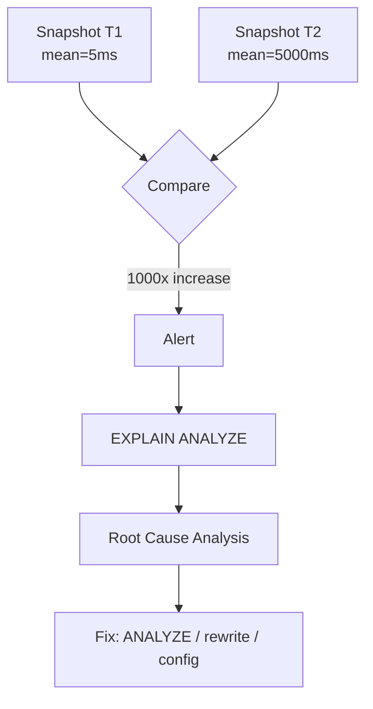
```mermaid
flowchart TD
    T1["Snapshot T1\nmean=5ms"] --> CMP{Compare}
    T2["Snapshot T2\nmean=5000ms"] --> CMP
    CMP -->|1000x increase| ALERT[Alert]
    ALERT --> EA[EXPLAIN ANALYZE]
    EA --> RC[Root Cause Analysis]
    RC --> FIX[Fix: ANALYZE / rewrite / config]
```

### 📶 Gradual Depth

**Level 1 - What it is:**
Plan regression is when a query suddenly becomes slow because the database chose a different execution strategy. pg_stat_statements is a PostgreSQL extension that tracks how fast each query runs over time.

**Level 2 - How to use it:**
Enable: `shared_preload_libraries = 'pg_stat_statements'` in postgresql.conf (requires restart). Create extension: `CREATE EXTENSION pg_stat_statements;`. Query top-N slowest: `SELECT query, calls, mean_exec_time, stddev_exec_time FROM pg_stat_statements ORDER BY mean_exec_time DESC LIMIT 20;`.

**Level 3 - How it works:**
Each query is normalized by replacing constants with parameter placeholders and hashing the result into a `queryid`. For each execution, the extension updates atomic counters for timing, row counts, and buffer statistics. The hash table lives in shared memory (sized by `pg_stat_statements.max`, default 5000 entries). When the table fills, the least-executed queries are evicted. Statistics accumulate until manually reset or server restart.

**Level 4 - Production mastery:**
Build a regression detection pipeline: snapshot `pg_stat_statements` every 5 minutes into a time-series store. Compare current mean_exec_time against the 7-day rolling baseline. Alert when any queryid's mean exceeds 5x the baseline. Combine with `auto_explain` (`auto_explain.log_min_duration = '1s'`) to automatically capture the plan of slow queries. This gives you both the "what changed" (pg_stat_statements) and the "why" (auto_explain plan).

### ⚙️ How It Works

**Phase 1 - Query normalization:** When a query is submitted, the parser normalizes it (replacing literals with `$N` parameters) and computes a queryid hash.

**Phase 2 - Execution tracking:** After execution completes, the extension looks up the queryid in shared memory and atomically updates: calls++, total_exec_time += elapsed, rows += returned_rows, shared_blks_hit += hits, shared_blks_read += reads, etc. Min and max times are updated if the current execution set new extremes.

**Phase 3 - Snapshot and compare:** An external monitoring tool (Prometheus, Datadog, custom script) periodically queries `pg_stat_statements` and stores the results. Comparison logic detects anomalies: queryid X's mean_exec_time was 5ms last week, now 500ms.

**Phase 4 - Investigation:** The DBA uses the normalized query text from pg_stat_statements to run `EXPLAIN ANALYZE` and compare the current plan with the expected plan. Common findings: index scan changed to sequential scan, nested loop replaced hash join, or sort spill to disk.

```
  pg_stat_statements Entry
  queryid | query             | calls | mean
  --------|-------------------|-------|-----
  ABC123  | SELECT ... WHERE  | 50000 | 5ms
          | status = $1       |       |
          | (after regression)|       |
  ABC123  | (same query)      | 50200 | 5000
```

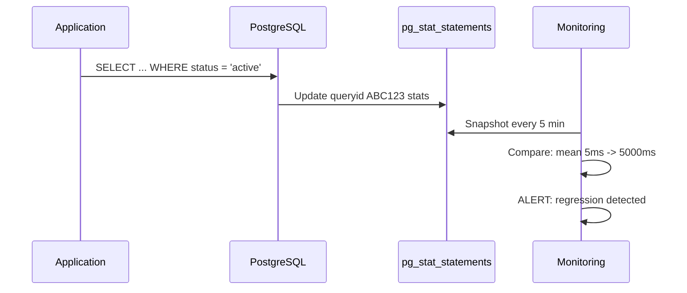
```mermaid
sequenceDiagram
    participant APP as Application
    participant PG as PostgreSQL
    participant PSS as pg_stat_statements
    participant MON as Monitoring
    APP->>PG: SELECT ... WHERE status = 'active'
    PG->>PSS: Update queryid ABC123 stats
    MON->>PSS: Snapshot every 5 min
    MON->>MON: Compare: mean 5ms -> 5000ms
    MON->>MON: ALERT: regression detected
```

**BAD:**

```sql
-- No baseline comparison available
EXPLAIN ANALYZE SELECT ...;
-- Guessing at what changed
```

**GOOD:**

```sql
CREATE EXTENSION pg_stat_statements;
SELECT query, calls,
       mean_exec_time
FROM pg_stat_statements
ORDER BY total_exec_time DESC
LIMIT 10;
```

### 🚨 Failure Modes

**Failure 1 - Regression from statistics refresh:**
**Symptom:** Queries slow down after autovacuum runs ANALYZE on a table. pg_stat_statements shows mean_exec_time jump.
**Root cause:** New statistics changed the planner's cardinality estimates, causing it to switch from index scan to sequential scan (or vice versa).
**Diagnostic:**

```sql
SELECT queryid, query,
       mean_exec_time,
       calls
FROM pg_stat_statements
WHERE mean_exec_time > 1000
ORDER BY mean_exec_time DESC
LIMIT 10;
-- Then EXPLAIN ANALYZE the worst offender
```

**Fix:** Investigate the specific statistics that changed. Create extended statistics if correlated columns are involved. In extreme cases, use `ALTER TABLE SET STATISTICS` to increase or decrease the target for specific columns.

**Failure 2 - Regression from prepared statement generic plans:**
**Symptom:** A parameterized query (via prepared statement) suddenly slows down after the 5th execution. The first 5 executions were fast.
**Root cause:** PostgreSQL creates custom plans (using actual parameter values) for the first 5 executions of a prepared statement. After that, it may switch to a generic plan (parameter-agnostic) if the generic plan is estimated to be cheaper. The generic plan may be suboptimal for specific parameter values.
**Diagnostic:**

```sql
-- Compare custom vs generic plan:
PREPARE my_query(int) AS
  SELECT * FROM orders WHERE status_id = $1;
EXPLAIN ANALYZE EXECUTE my_query(1);
-- Run 5+ times, then:
EXPLAIN ANALYZE EXECUTE my_query(1);
-- Check if plan changed
```

**Fix:** Use `plan_cache_mode = force_custom_plan` for the session if generic plans are consistently worse. Alternatively, restructure the query to provide the planner with better information.

### 🔬 Production Reality

A typical regression scenario: a microservice's database latency doubles overnight. The p99 jumps from 20 ms to 200 ms. pg_stat_statements shows one queryid responsible for 80% of the degradation. The query is `SELECT * FROM orders WHERE customer_id = $1 AND status = $2`. Investigation reveals: autovacuum ran ANALYZE at 3 AM, refreshing statistics. The `status` column's MCV list now shows 'completed' as 60% of rows (previously 30%), causing the planner to estimate `status = 'pending'` returns only 5% (previously 20%). This changes the plan from using the composite index on (customer_id, status) to a bitmap index scan on customer_id alone with a recheck. The fix: `CREATE STATISTICS` on (customer_id, status) to capture the correlation, then `ANALYZE orders`.

### ⚖️ Trade-offs & Alternatives

| Aspect            | pg_stat_statements        | auto_explain                       | Oracle SQL Plan Management     | SQL Server Query Store                    |
| ----------------- | ------------------------- | ---------------------------------- | ------------------------------ | ----------------------------------------- |
| Tracks what       | Execution stats per query | Full EXPLAIN plan for slow queries | Plans + statistics + baselines | Plans + statistics + regression detection |
| Plan pinning      | No                        | No                                 | Yes (plan baselines)           | Yes (forced plans)                        |
| Overhead          | Low (~1% CPU)             | Low-medium (logging)               | Medium                         | Medium                                    |
| Built-in alerting | No (external needed)      | No (log-based)                     | Yes                            | Yes                                       |
| Requires restart  | Yes (shared_preload)      | Yes (shared_preload)               | No                             | No                                        |

### ⚡ Decision Snap

**USE WHEN:**

- Every PostgreSQL production deployment should have pg_stat_statements enabled
- Building a query performance baseline for regression detection
- Identifying the top-N most expensive queries for optimization

**AVOID WHEN:**

- Do not set pg_stat_statements.max too high (> 50,000) without checking shared memory impact
- Do not rely solely on pg_stat_statements for plan analysis - use EXPLAIN ANALYZE for the actual plan

**PREFER auto_explain in addition WHEN:**

- You need the actual execution plan for slow queries, not just timing statistics
- Debugging intermittent regressions where reproducing the slow plan is difficult

### ⚠️ Top Traps

| #   | Misconception                                         | Reality                                                                                                                                   |
| --- | ----------------------------------------------------- | ----------------------------------------------------------------------------------------------------------------------------------------- |
| 1   | pg_stat_statements records execution plans            | It records only timing, row count, and buffer statistics - not the plan. Use auto_explain for plan capture                                |
| 2   | Regression always means the database is broken        | Regression means the planner chose a different plan based on new information; the fix is usually better statistics, not a database change |
| 3   | Resetting pg_stat_statements is harmless              | Resetting loses all historical baseline data; snapshot first, then reset if needed                                                        |
| 4   | mean_exec_time is sufficient for regression detection | Mean hides bimodal distributions; also check stddev_exec_time and min/max to detect intermittent regressions                              |
| 5   | PostgreSQL can pin a known-good plan                  | PostgreSQL has no built-in plan pinning; use pg_hint_plan (third party) or query rewriting as workarounds                                 |

### 🪜 Learning Ladder

**Prerequisites:**

- SQL-060 Execution Plans Deep Dive - EXPLAIN ANALYZE - know how to read and compare plans
- SQL-094 Query Planner and Cost-Based Optimization - understand why the planner changes plans
- SQL-095 Statistics and Cardinality Estimation - stale statistics are the primary cause of regression

**THIS:** SQL-097 Plan Regression and pg_stat_statements

**Next steps:**

- SQL-066 Slow Query Log Analysis - complementary approach to finding problematic queries
- SQL-064 Query Performance Tuning Patterns - fixing the queries that regressed
- SQL-121 Observability for Database Fleets - fleet-wide regression monitoring

**The Surprising Truth:**
The most dangerous plan regression is not the one that makes a query 100x slower - it is the one that makes 50 queries each 2x slower. The individual regressions are below alert thresholds, but collectively they consume enough extra CPU and I/O to push the database into saturation. Only systematic tracking with pg_stat_statements, comparing aggregated query time (total_exec_time) across snapshots, catches this pattern.

**Further Reading:**

- PostgreSQL Documentation: pg_stat_statements (postgresql.org/docs/current/pgstatstatements.html)
- PostgreSQL Documentation: auto_explain (postgresql.org/docs/current/auto-explain.html)
- PostgreSQL Wiki: Monitoring pg_stat_statements (wiki.postgresql.org/wiki/Monitoring)

**Revision Card:**

1. Plan regression = planner chose a different (worse) plan based on changed statistics or data distribution
2. pg_stat_statements tracks per-query timing and I/O stats; snapshot and compare to detect regressions
3. Combine pg_stat_statements (what slowed down) with auto_explain (why the plan changed) for full diagnosis

---

---

# SQL-098 Table Partitioning - Range, List, Hash

**TL;DR** - Table partitioning splits a large table into smaller sub-tables by range, list, or hash, enabling partition pruning, parallel maintenance, and improved query performance.

### 🔥 Problem Statement

A single table with billions of rows creates multiple operational challenges: full-table VACUUM takes hours, index maintenance slows inserts, sequential scans read the entire dataset even when queries target a narrow range, and backup/restore of the table requires processing the entire file. At production scale, monolithic tables become the bottleneck for every operation - from query performance to schema migrations to disaster recovery. Partitioning breaks the table into manageable pieces while presenting a unified logical view to applications.

### 📜 Historical Context

Table partitioning in PostgreSQL was originally implemented via table inheritance and constraint exclusion (PostgreSQL 8.1+), requiring manual trigger/rule maintenance. Declarative partitioning was introduced in PostgreSQL 10 (2017), with hash partitioning and partition pruning improvements in PostgreSQL 11. PostgreSQL 12 added significant performance improvements including default partition and faster partition pruning. PostgreSQL 13+ supports logical replication of partitioned tables. Modern declarative partitioning has made the old inheritance-based approach obsolete.

### 🔩 First Principles

**CORE INVARIANTS:**

1. Each row belongs to exactly one partition, determined by the partition key and strategy (range, list, or hash)
2. The partition key must be part of the primary key and all unique constraints (PostgreSQL requires this for uniqueness enforcement)
3. Partition pruning eliminates partitions from query plans at planning or execution time based on WHERE clause constraints on the partition key

**DERIVED DESIGN:**
The partitioned table is a virtual "parent" with no data storage. Each partition is a real table with a CHECK constraint defining its key range. Inserts route to the correct partition based on the key. Queries include all partitions by default, but the planner prunes partitions that cannot contain matching rows. Indexes, VACUUM, and maintenance operate per-partition independently.

**THE TRADE-OFF:**
**Gain:** Faster scans on partition-key-filtered queries; independent VACUUM and maintenance per partition; easy data lifecycle management (drop old partitions instead of DELETE).
**Cost:** Cross-partition queries without partition key filter scan all partitions; unique constraints must include the partition key; increased planning overhead for many partitions; join performance may degrade if the planner cannot prune.

### 🧠 Mental Model

> Think of a filing cabinet where each drawer holds documents for one year (range partitioning). When someone asks for 2024 documents, you open only the 2024 drawer - ignoring all others. When a year expires, you remove the entire drawer (DROP PARTITION) instead of pulling out individual documents (DELETE).

- "Drawer per year" -> partition per range interval
- "Opening only one drawer" -> partition pruning
- "Removing entire drawer" -> DROP PARTITION (instant, no VACUUM needed)

**Where this analogy breaks down:** Hash partitioning distributes documents across drawers by a hash function - there is no logical grouping by content, just even distribution for load balancing.

### 🧩 Components

- **Partitioned table** - the logical parent table (stores no data)
- **Partition** - physical child table storing a subset of rows
- **Partition key** - column(s) determining which partition receives each row
- **Range partitioning** - partitions defined by value ranges (e.g., date ranges)
- **List partitioning** - partitions defined by explicit value lists (e.g., region codes)
- **Hash partitioning** - partitions defined by hash modulus (even distribution)
- **Default partition** - catches rows that match no other partition
- **Partition pruning** - optimizer feature excluding irrelevant partitions from plans

```
  Range Partitioning by Date
  orders (partitioned)
  +-------------------+
  | orders_2023       | (Jan 1 - Dec 31)
  | orders_2024       | (Jan 1 - Dec 31)
  | orders_2025       | (Jan 1 - Dec 31)
  | orders_default    | (everything else)
  +-------------------+

  Query: WHERE created_at = '2024-06-15'
  -> Prune to: orders_2024 only
```

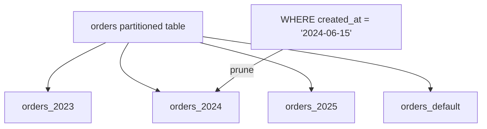
```mermaid
flowchart TD
    PT[orders partitioned table]
    PT --> P1[orders_2023]
    PT --> P2[orders_2024]
    PT --> P3[orders_2025]
    PT --> PD[orders_default]
    Q["WHERE created_at = '2024-06-15'"]
    Q -->|prune| P2
```

### 📶 Gradual Depth

**Level 1 - What it is:**
Partitioning splits a large table into smaller pieces based on a column value. Each piece (partition) stores a subset of the rows. Queries that filter on the partition column only scan the relevant pieces.

**Level 2 - How to use it:**
Create a partitioned table with `PARTITION BY RANGE (created_at)`. Add partitions with `CREATE TABLE orders_2024 PARTITION OF orders FOR VALUES FROM ('2024-01-01') TO ('2025-01-01');`. Queries with `WHERE created_at BETWEEN ...` automatically prune to the relevant partitions.

**Level 3 - How it works:**
The planner examines WHERE clause constraints against partition bounds. If a constraint provably excludes a partition, that partition is removed from the plan. Dynamic pruning (PostgreSQL 11+) handles parameterized queries where the value is not known at plan time. Each partition has its own heap files, indexes, and statistics - VACUUM and ANALYZE run independently per partition.

**Level 4 - Production mastery:**
Common production pattern: partition by month for time-series data. Create partitions ahead of time (automated via pg_partman extension or cron). Drop old partitions for data retention (`DROP TABLE orders_2022` is instant vs `DELETE FROM orders WHERE created_at < '2023-01-01'` which generates massive WAL and dead tuples). Index each partition independently. For global unique constraints: the partition key must be part of the primary key. Monitor `pg_stat_user_tables` per partition to ensure autovacuum processes each one.

### ⚙️ How It Works

**Phase 1 - Table creation:** Define the parent as `PARTITION BY RANGE|LIST|HASH (key)`. Create child partitions with value bounds or modulus/remainder.

**Phase 2 - Insert routing:** For each INSERT, PostgreSQL evaluates the partition key value against partition bounds and routes the row to the matching partition. If no partition matches and no default exists, the insert fails.

**Phase 3 - Query planning with pruning:** The planner compares WHERE clause conditions against partition constraints. Partitions that cannot contain matching rows are excluded. `EXPLAIN` shows only the included partitions.

**Phase 4 - Maintenance independence:** VACUUM, ANALYZE, REINDEX, and ALTER TABLE operations can target individual partitions. Dropping a partition is a metadata-only operation (if no foreign keys reference it) - the files are unlinked immediately.

```
  Insert Routing
  INSERT INTO orders (created_at, ...)
    VALUES ('2024-06-15', ...);
    |
    v
  Check partition bounds:
    2023: [2023-01-01, 2024-01-01) -> no
    2024: [2024-01-01, 2025-01-01) -> YES
    -> route to orders_2024
```

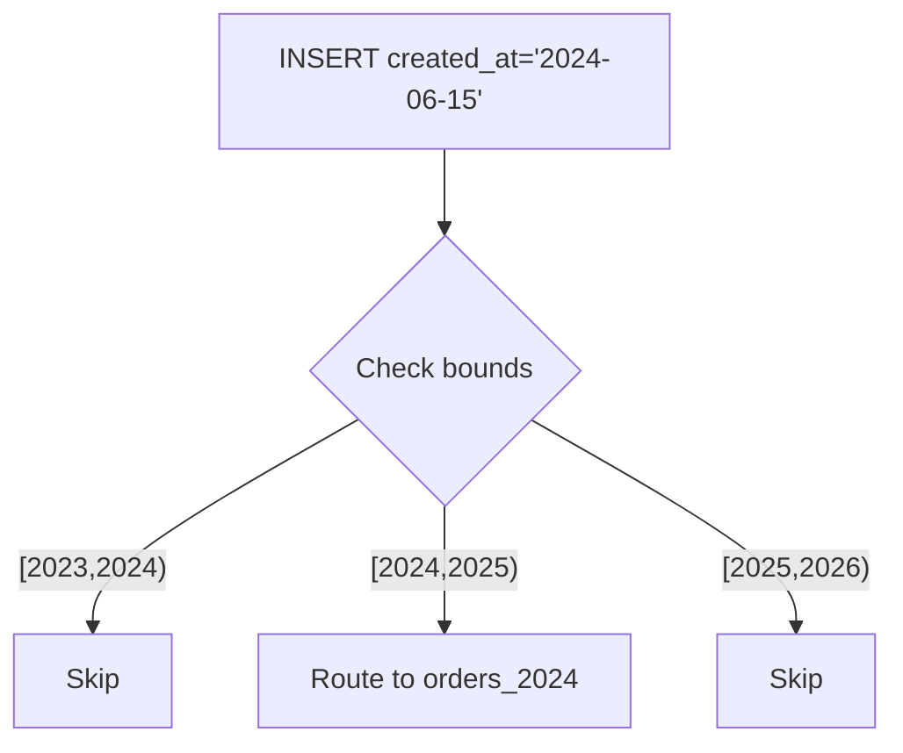
```mermaid
flowchart TD
    INS["INSERT created_at='2024-06-15'"]
    INS --> CK{Check bounds}
    CK -->|"[2023,2024)"| NO1[Skip]
    CK -->|"[2024,2025)"| YES[Route to orders_2024]
    CK -->|"[2025,2026)"| NO2[Skip]
```

**BAD:**

```sql
SELECT * FROM events
WHERE created_at > '2024-01-01';
-- Scans 5 years for 1 month query
```

**GOOD:**

```sql
CREATE TABLE events (
  id BIGSERIAL,
  created_at TIMESTAMPTZ
) PARTITION BY RANGE (created_at);
-- Query touches only 1 partition
```

### 🚨 Failure Modes

**Failure 1 - Missing partition causes insert failure:**
**Symptom:** `ERROR: no partition of relation "orders" found for row`. Application inserts fail for new data outside existing partition ranges.
**Root cause:** New partitions were not created ahead of time. The system has no default partition.
**Diagnostic:**

```sql
SELECT inhrelid::regclass AS partition,
       pg_get_expr(relpartbound,
         inhrelid) AS bounds
FROM pg_inherits
JOIN pg_class ON pg_class.oid = inhrelid
WHERE inhparent = 'orders'::regclass
ORDER BY bounds;
```

**Fix:** Create future partitions proactively (use pg_partman for automation). Add a default partition as a safety net: `CREATE TABLE orders_default PARTITION OF orders DEFAULT;`.

**Failure 2 - No pruning due to type mismatch or function wrapping:**
**Symptom:** Query scans all partitions despite a filter on the partition key. EXPLAIN shows all partitions in the plan.
**Root cause:** The WHERE clause wraps the partition key in a function (`WHERE DATE(created_at) = ...`) or uses a different type, preventing the planner from matching against partition bounds.
**Diagnostic:**

```sql
EXPLAIN SELECT * FROM orders
WHERE DATE(created_at) = '2024-06-15';
-- Check: does it show all partitions?
-- Fix: use range instead of function:
EXPLAIN SELECT * FROM orders
WHERE created_at >= '2024-06-15'
  AND created_at < '2024-06-16';
```

**Fix:** Write WHERE clauses using direct comparison on the partition key column without functions. Use range predicates (`>= AND <`) instead of equality with function-wrapped keys.

### 🔬 Production Reality

A typical production pattern: a 2 TB `events` table receives 100 million rows per month. Without partitioning, VACUUM takes 4 hours, index rebuilds take 6 hours, and deleting expired data generates massive WAL. After partitioning by month: VACUUM processes each 100 GB partition independently (30 minutes each, staggered). Data retention is implemented by dropping the oldest partition (`DROP TABLE events_2022_01` - instant, no WAL, no dead tuples). Query performance for time-range queries improves dramatically because partition pruning eliminates all but the relevant months. The key lesson: partitioning's biggest production benefit is operational - maintenance and data lifecycle management - not just query performance.

### ⚖️ Trade-offs & Alternatives

| Aspect                       | Native partitioning       | pg_partman (extension)            | Application-level sharding      | Timescale hypertables |
| ---------------------------- | ------------------------- | --------------------------------- | ------------------------------- | --------------------- |
| Setup complexity             | Manual DDL                | Automated partition creation/drop | Application routing logic       | Extension install     |
| Automatic partition creation | No (manual or pg_partman) | Yes (time-based)                  | Application controls            | Yes (chunk-based)     |
| Cross-partition queries      | Transparent (union all)   | Same                              | Application must scatter-gather | Transparent           |
| Compression                  | Not built-in              | Not built-in                      | Varies                          | Built-in per-chunk    |
| Best for                     | General purpose           | Time-series retention             | Multi-database distribution     | Time-series at scale  |

### ⚡ Decision Snap

**USE WHEN:**

- Tables exceed 100 GB or 100 million rows
- Data has a natural partition key (date, region, tenant)
- Data retention requires periodic deletion of old data
- VACUUM or index maintenance takes too long on the full table

**AVOID WHEN:**

- Tables are small (< 10 million rows) - partitioning overhead exceeds benefit
- Most queries do not filter on the partition key (no pruning benefit)

**PREFER hash partitioning WHEN:**

- No natural range or list key exists, but even data distribution is needed for parallel maintenance
- Balancing write throughput across partitions to avoid single-partition hot spots

### ⚠️ Top Traps

| #   | Misconception                            | Reality                                                                                                                          |
| --- | ---------------------------------------- | -------------------------------------------------------------------------------------------------------------------------------- |
| 1   | Partitioning always improves query speed | Only queries filtering on the partition key benefit from pruning; cross-partition queries may be slower due to planning overhead |
| 2   | Any column can be the partition key      | The partition key must be included in all unique constraints and the primary key                                                 |
| 3   | Partition indexes are shared             | Each partition has its own independent indexes; creating an index on the parent creates matching indexes on all partitions       |
| 4   | More partitions = better performance     | Too many partitions (>1000) increase planning time; partition granularity should match query patterns                            |
| 5   | DROP PARTITION deletes data immediately  | DROP PARTITION removes the table and reclaims space; but if foreign keys reference it, the drop will fail or cascade             |

### 🪜 Learning Ladder

**Prerequisites:**

- SQL-040 Indexes - What They Are and Why They Matter - understand per-partition index implications
- SQL-060 Execution Plans Deep Dive - EXPLAIN ANALYZE - read partition pruning in plans
- SQL-089 VACUUM and Bloat Management (PostgreSQL) - per-partition vacuum as key benefit

**THIS:** SQL-098 Table Partitioning - Range, List, Hash

**Next steps:**

- SQL-099 Partition Pruning and Query Routing - deeper dive into pruning mechanics
- SQL-109 Online Store DB - Phase 4 (Internals and Tuning) - apply partitioning in practice
- SQL-113 Sharding Strategies - Application vs Proxy - partitioning across multiple databases

**The Surprising Truth:**
The biggest ROI from partitioning is not faster queries - it is `DROP TABLE partition_name` instead of `DELETE FROM table WHERE date < ...`. A DELETE generating 50 GB of WAL, millions of dead tuples, and hours of VACUUM is replaced by an instant metadata-only DROP that reclaims space immediately and generates zero WAL. This operational benefit alone justifies partitioning for any table with data retention requirements.

**Further Reading:**

- PostgreSQL Documentation: Table Partitioning (postgresql.org/docs/current/ddl-partitioning.html)
- PostgreSQL Documentation: Partition Pruning (postgresql.org/docs/current/ddl-partitioning.html#DDL-PARTITION-PRUNING)
- pg_partman documentation (github.com/pgpartman/pg_partman)

**Revision Card:**

1. Partitioning splits a table into physical sub-tables by range, list, or hash of a partition key
2. Partition pruning eliminates irrelevant partitions at plan time - but only when WHERE directly filters on the partition key
3. The killer feature is DROP PARTITION for data retention: instant, zero WAL, zero dead tuples vs massive DELETE

---

---

# SQL-099 Partition Pruning and Query Routing

**TL;DR** - Partition pruning eliminates irrelevant partitions from query plans at planning or execution time, reducing I/O from full-table scans to single-partition scans when queries filter on the partition key.

### 🔥 Problem Statement

A partitioned table with 120 monthly partitions stores 1.2 billion rows. Without pruning, every query scans all 120 partitions - defeating the purpose of partitioning entirely. Pruning must work at plan time (static pruning) for constant WHERE values and at execution time (dynamic pruning) for parameterized queries, prepared statements, and subquery-driven filters. Understanding pruning mechanics is the difference between partitioning being a performance multiplier and an overhead multiplier.

### 📜 Historical Context

PostgreSQL's original inheritance-based partitioning used constraint exclusion - a planner mechanism that checked CHECK constraints against WHERE clauses. This was slow and unreliable, failing for many common patterns. Declarative partitioning (PostgreSQL 10) introduced native partition pruning. PostgreSQL 11 added dynamic (execution-time) pruning, enabling parameterized queries and prepared statements to prune at runtime. PostgreSQL 12 improved pruning speed and reduced planning overhead for tables with many partitions.

### 🔩 First Principles

**CORE INVARIANTS:**

1. Pruning only works when the WHERE clause contains a condition directly on the partition key column
2. Wrapping the partition key in a function (EXTRACT, DATE, CAST) prevents pruning because the planner cannot reason about transformed bounds
3. Dynamic pruning (runtime) handles cases where the partition key value is not known at plan time (parameters, subqueries)

**DERIVED DESIGN:**
The planner compares each WHERE condition against partition bounds. For range partitioning, a condition like `created_at >= '2024-01-01' AND created_at < '2024-02-01'` matches exactly one partition. For list partitioning, `region = 'EU'` matches one partition. For hash partitioning, `id = 42` can be pruned if the hash modulus and remainder are computable. When the value is a parameter (`$1`), dynamic pruning defers the check to execution time.

**THE TRADE-OFF:**
**Gain:** Query I/O reduced proportionally to the number of pruned partitions; a 120-partition table scanning 1 partition does 1/120th the I/O.
**Cost:** Pruning analysis adds planning time (significant with > 500 partitions); incorrect WHERE patterns silently disable pruning with no warning.

### 🧠 Mental Model

> Imagine an apartment building with 120 floors, each storing packages for one month. The elevator (query executor) checks the delivery label (WHERE clause). Static pruning: the label says "Floor 24" - the elevator goes directly there. Dynamic pruning: the label says "same floor as this other package" - the elevator checks the other package at runtime, then goes to the right floor. No pruning: the label is smudged (function-wrapped partition key) - the elevator visits all 120 floors.

- "Delivery label" -> WHERE clause on partition key
- "Going to one floor" -> pruning to one partition
- "Smudged label" -> function wrapping that defeats pruning

**Where this analogy breaks down:** Pruning can leave multiple partitions active (not just one), and partial pruning (eliminating half the partitions) still provides significant benefit.

### 🧩 Components

- **Static pruning** - planner eliminates partitions at plan time using constant values
- **Dynamic pruning** - executor eliminates partitions at runtime using parameter values or subquery results
- **enable_partition_pruning** - GUC (default: on) controlling whether pruning is active
- **Partition bounds metadata** - stored in `pg_partitioned_table` and `pg_class.relpartbound`
- **Append node** - plan node combining results from multiple partitions; pruned partitions are excluded from the Append

```
  Pruning Examples
  Good: WHERE created_at >= '2024-01-01'
        AND created_at < '2024-02-01'
  -> Static prune to orders_2024_01

  Good: WHERE created_at = $1 (prepared)
  -> Dynamic prune at execution time

  BAD:  WHERE EXTRACT(YEAR FROM created_at)
        = 2024
  -> No pruning! Function wraps key.
```

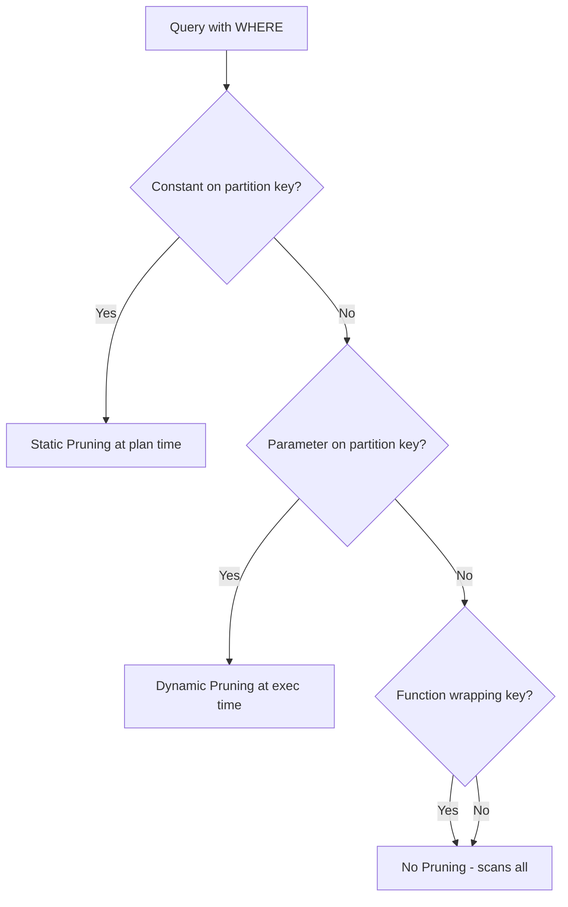
```mermaid
flowchart TD
    Q[Query with WHERE]
    Q --> SC{Constant on partition key?}
    SC -->|Yes| SP[Static Pruning at plan time]
    SC -->|No| DY{Parameter on partition key?}
    DY -->|Yes| DP[Dynamic Pruning at exec time]
    DY -->|No| FN{Function wrapping key?}
    FN -->|Yes| NP[No Pruning - scans all]
    FN -->|No| NP
```

### 📶 Gradual Depth

**Level 1 - What it is:**
Partition pruning automatically skips partitions that cannot contain the data you are looking for. It works when your WHERE clause filters on the column used to partition the table.

**Level 2 - How to use it:**
Write WHERE conditions directly on the partition key: `WHERE created_at >= '2024-01-01' AND created_at < '2024-02-01'`. Check pruning with EXPLAIN - look for "Partitions pruned: N" or observe that only specific partitions appear in the plan.

**Level 3 - How it works:**
The planner extracts conditions on the partition key from the WHERE clause. It compares these against each partition's bounds (stored in catalog). For range partitions, it performs interval intersection. For list partitions, set membership. For hash, modulus computation. Partitions with no possible overlap are removed from the Append plan node. Dynamic pruning adds a runtime filter node that re-evaluates when parameter values become available.

**Level 4 - Production mastery:**
Common pruning failures: using `DATE(timestamp_col)` instead of range comparison; joining with a non-partition-key column then filtering (the join must use the partition key for pruning to cascade); implicit type casts (`WHERE int_key = '42'::text` may not prune). Use `EXPLAIN (ANALYZE, VERBOSE)` and check "Subplans Removed" or "never executed" markers to verify pruning. For prepared statements, test with at least 6 executions (the generic plan must support dynamic pruning).

### ⚙️ How It Works

**Phase 1 - Plan-time extraction:** The planner identifies all WHERE conditions that directly reference the partition key column. These become "pruning steps."

**Phase 2 - Bound comparison:** Each pruning step is evaluated against each partition's bounds. Partitions whose bounds are disjoint from the step's range are marked for exclusion.

**Phase 3 - Plan construction:** The planner builds an Append node containing only the surviving partitions. Excluded partitions do not appear in EXPLAIN output (or appear as "never executed" in EXPLAIN ANALYZE).

**Phase 4 - Runtime pruning (if needed):** If the pruning step contains a parameter (`$1`) or subquery result, the executor evaluates it at runtime when the value becomes available. This allows prepared statements and parameterized queries to benefit from pruning.

```
  EXPLAIN Output with Pruning
  Append
    -> Seq Scan on orders_2024_01
         Filter: (status = 'active')
    -> Seq Scan on orders_2024_02
         (never executed)
  Partitions: 2 selected, 118 pruned
```

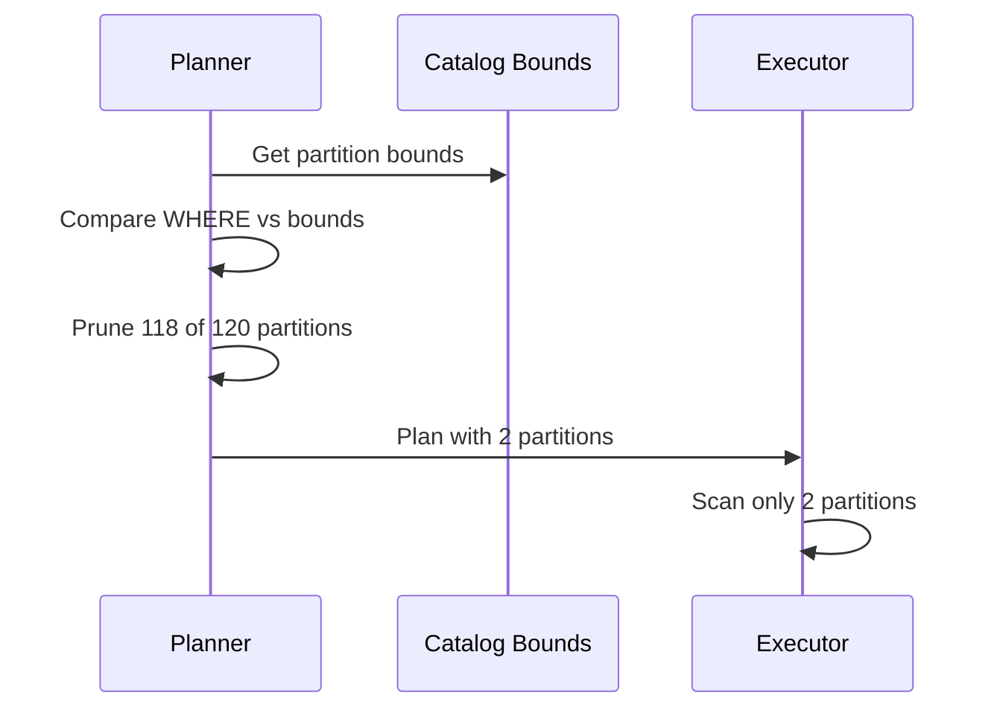
```mermaid
sequenceDiagram
    participant PL as Planner
    participant CAT as Catalog Bounds
    participant EX as Executor
    PL->>CAT: Get partition bounds
    PL->>PL: Compare WHERE vs bounds
    PL->>PL: Prune 118 of 120 partitions
    PL->>EX: Plan with 2 partitions
    EX->>EX: Scan only 2 partitions
```

**BAD:**

```sql
SELECT * FROM events
WHERE user_id = 42;
-- Scans ALL partitions
```

**GOOD:**

```sql
SELECT * FROM events
WHERE created_at >= '2024-06-01'
  AND created_at < '2024-07-01'
  AND user_id = 42;
-- Only one partition scanned
```

### 🚨 Failure Modes

**Failure 1 - Function wrapping defeats pruning:**
**Symptom:** Query on a partitioned table scans all partitions despite filtering on the partition key. EXPLAIN shows all partitions.
**Root cause:** WHERE clause uses a function on the partition key: `WHERE EXTRACT(YEAR FROM created_at) = 2024` instead of `WHERE created_at >= '2024-01-01' AND created_at < '2025-01-01'`.
**Diagnostic:**

```sql
-- BAD: function wrapping
EXPLAIN SELECT * FROM orders
WHERE EXTRACT(YEAR FROM created_at) = 2024;
-- Check: all partitions in plan

-- GOOD: direct range
EXPLAIN SELECT * FROM orders
WHERE created_at >= '2024-01-01'
  AND created_at < '2025-01-01';
-- Check: only 12 partitions
```

**Fix:** Rewrite WHERE to use direct comparison operators on the partition key. Avoid wrapping the key in any function.

**Failure 2 - Join without partition key eliminates pruning:**
**Symptom:** A join query scans all partitions of the partitioned table even though the joined table provides filtering that logically restricts the date range.
**Root cause:** The join condition does not include the partition key, so the planner cannot propagate the filter through the join to enable pruning.
**Diagnostic:**

```sql
-- No pruning:
EXPLAIN SELECT * FROM orders o
JOIN campaigns c ON o.campaign_id = c.id
WHERE c.year = 2024;
-- Pruning (add explicit filter):
EXPLAIN SELECT * FROM orders o
JOIN campaigns c ON o.campaign_id = c.id
WHERE c.year = 2024
  AND o.created_at >= '2024-01-01'
  AND o.created_at < '2025-01-01';
```

**Fix:** Add explicit partition key conditions in the WHERE clause even if they seem redundant with the join logic. The planner needs direct conditions on the partition key to prune.

### 🔬 Production Reality

A reporting dashboard joins `events` (partitioned by month, 120 partitions) with `users` on `user_id`. The dashboard shows data for the current month only, but the join is on `user_id` (not the partition key `event_date`). Result: every dashboard query scans all 120 partitions, taking 30 seconds instead of 250 ms. Adding `AND e.event_date >= date_trunc('month', CURRENT_DATE) AND e.event_date < date_trunc('month', CURRENT_DATE) + INTERVAL '1 month'` enables pruning to a single partition and drops the query to 250 ms. The lesson: the application must explicitly communicate the partition key constraint in every query, even when the join logically implies it.

### ⚖️ Trade-offs & Alternatives

| Aspect         | Partition pruning           | Filtered indexes (partial)      | Materialized views        |
| -------------- | --------------------------- | ------------------------------- | ------------------------- |
| Mechanism      | Eliminate entire sub-tables | Smaller index on subset of rows | Pre-computed query result |
| Applicable to  | Partitioned tables only     | Any table                       | Any query                 |
| Write overhead | None (metadata check)       | Partial index maintenance       | Refresh cost              |
| Flexibility    | Only on partition key       | Any expression                  | Any query                 |
| Maintenance    | Partition creation/drop     | Index rebuild                   | REFRESH command           |

### ⚡ Decision Snap

**USE WHEN:**

- Partitioned tables with queries that always filter on the partition key
- Time-series data where queries naturally restrict by date range
- Multi-tenant systems partitioned by tenant ID

**AVOID WHEN:**

- Queries frequently scan across all partitions without partition key filters
- Partition key is not naturally part of most query predicates

**PREFER partial indexes WHEN:**

- Only a small subset of data is frequently queried (e.g., `WHERE status = 'active'`)
- Partitioning is not justified by table size or maintenance requirements

### ⚠️ Top Traps

| #   | Misconception                                 | Reality                                                                                                                             |
| --- | --------------------------------------------- | ----------------------------------------------------------------------------------------------------------------------------------- |
| 1   | Pruning happens automatically for all queries | Pruning requires a direct condition on the partition key in the WHERE clause - no function wrapping, no indirect filtering          |
| 2   | Prepared statements cannot use pruning        | PostgreSQL 11+ supports dynamic pruning at execution time, which works with prepared statement parameters                           |
| 3   | Pruning works through joins                   | The planner does not propagate partition-key constraints through joins; explicit WHERE conditions on the partition key are required |
| 4   | Hash partitioning cannot be pruned            | Hash partitioning supports pruning for equality conditions (`WHERE id = 42`) since PostgreSQL 11                                    |
| 5   | More partitions = faster queries              | Planning time increases with partition count; beyond ~500-1000 partitions, plan overhead can exceed scan savings                    |

### 🪜 Learning Ladder

**Prerequisites:**

- SQL-098 Table Partitioning - Range, List, Hash - understand how partitions are defined and created
- SQL-060 Execution Plans Deep Dive - EXPLAIN ANALYZE - verify pruning in execution plans

**THIS:** SQL-099 Partition Pruning and Query Routing

**Next steps:**

- SQL-094 Query Planner and Cost-Based Optimization - how the planner evaluates pruned vs unpruned plans
- SQL-109 Online Store DB - Phase 4 (Internals and Tuning) - practical application of partition design
- SQL-116 CQRS and Read/Write Separation Architecture - combine pruning with read/write separation

**The Surprising Truth:**
The most common partition pruning failure in production is not a bug or a PostgreSQL limitation - it is an ORM generating `WHERE DATE(created_at) = ?` instead of `WHERE created_at >= ? AND created_at < ?`. This single function-wrapping pattern silently disables pruning across entire applications, turning carefully designed partitioning into pure overhead.

**Further Reading:**

- PostgreSQL Documentation: Partition Pruning (postgresql.org/docs/current/ddl-partitioning.html#DDL-PARTITION-PRUNING)
- PostgreSQL Documentation: enable_partition_pruning (postgresql.org/docs/current/runtime-config-query.html)
- PostgreSQL 11 Release Notes: Runtime Partition Pruning (postgresql.org/docs/11/release-11.html)

**Revision Card:**

1. Pruning only works with direct conditions on the partition key - function wrapping silently disables it
2. Static pruning handles constants at plan time; dynamic pruning handles parameters at execution time
3. Always add explicit partition key filters in queries, even when joins logically imply the restriction

---

---

# SQL-100 Logical Replication and Physical Replication

**TL;DR** - Physical replication streams WAL bytes for exact block-level copies; logical replication decodes WAL into row-level changes, enabling selective table replication, cross-version replication, and data transformation.

### 🔥 Problem Statement

A single database server has finite read throughput, finite storage, and is a single point of failure. At production scale, you need copies of data for: read scaling (distribute reads across replicas), high availability (failover to a standby on primary failure), and geographic distribution (replicas near users). Physical replication copies the entire cluster byte-for-byte, which is simple but inflexible. Logical replication decodes changes at the row level, enabling selective replication, cross-version upgrades, and pub/sub patterns. Understanding both mechanisms - and when to choose each - is essential for scaling PostgreSQL.

### 📜 Historical Context

PostgreSQL physical replication began with log shipping (copying WAL files, PostgreSQL 8.0), evolved to streaming replication (continuous WAL streaming, PostgreSQL 9.0), and added synchronous replication options (PostgreSQL 9.1). Logical replication was introduced in PostgreSQL 10 (2017), building on the logical decoding infrastructure added in PostgreSQL 9.4. Before native logical replication, tools like Slony and Londiste provided trigger-based replication. The logical decoding approach avoids trigger overhead by reading the WAL directly.

### 🔩 First Principles

**CORE INVARIANTS:**

1. Physical replication produces an exact byte-level copy of the primary - including all databases, users, and system catalogs
2. Logical replication decodes WAL into DML operations (INSERT, UPDATE, DELETE) and applies them as SQL on the subscriber
3. Physical replicas cannot accept writes; logical replication subscribers are independent databases that can have local tables and indexes

**DERIVED DESIGN:**
Physical replication is the simplest HA and read-scaling solution: the standby is a hot copy of the primary, ready for failover. Logical replication is more flexible: replicate specific tables to specific subscribers, replicate between different PostgreSQL major versions, or build materialized data pipelines. The cost of logical replication is higher complexity, potential for replication conflicts (subscriber has independent state), and higher latency.

**THE TRADE-OFF:**
**Gain:** Physical = simple failover, exact copy, low latency. Logical = selective replication, cross-version, independent subscriber.
**Cost:** Physical = all-or-nothing (entire cluster), read-only standby, same major version. Logical = higher complexity, conflict resolution, DDL not replicated.

### 🧠 Mental Model

> **Physical replication** is photocopying an entire document - the copy is identical, byte for byte. You cannot change the copy without it diverging.

> **Logical replication** is dictating the contents of the document to a scribe who writes it in their own handwriting. The scribe can add their own notes (local tables), skip chapters (selective replication), and even write in a newer version of the language (cross-version).

- "Photocopy" -> WAL byte streaming (physical)
- "Scribe dictation" -> WAL logical decoding (logical)
- "Scribe's own notes" -> local tables on subscriber

**Where this analogy breaks down:** Logical replication handles INSERT/UPDATE/DELETE but not DDL (schema changes). The "scribe" must be told about schema changes separately.

### 🧩 Components

- **Primary** - the source database generating WAL
- **Standby (physical)** - byte-level replica consuming WAL stream
- **Publisher (logical)** - primary database publishing changes via publication
- **Subscriber (logical)** - independent database subscribing to publications
- **WAL sender** - primary process streaming WAL to replicas
- **WAL receiver** - standby process receiving and applying WAL
- **Replication slot** - bookmark tracking how far a replica has consumed WAL (prevents recycling)
- **Publication** - logical replication: set of tables whose changes are published
- **Subscription** - logical replication: subscriber's connection to a publication

```
  Physical vs Logical Replication
  Physical:
  Primary -> [WAL bytes] -> Standby
  (exact copy, all DBs, read-only)

  Logical:
  Primary -> [Decoded DML] -> Subscriber
  (table-level, cross-version, writable)
```

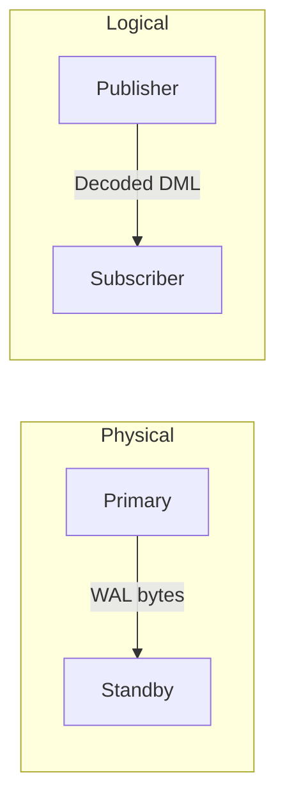
```mermaid
flowchart LR
    subgraph Physical
        P1[Primary] -->|WAL bytes| S1[Standby]
    end
    subgraph Logical
        P2[Publisher] -->|Decoded DML| S2[Subscriber]
    end
```

### 📶 Gradual Depth

**Level 1 - What it is:**
Replication copies data from one database to another. Physical replication copies everything at the byte level. Logical replication copies individual row changes and is more flexible.

**Level 2 - How to use it:**
Physical: Set `wal_level = replica`, configure `primary_conninfo` on the standby, use `pg_basebackup` to create the initial copy. Logical: Set `wal_level = logical`, create a publication (`CREATE PUBLICATION pub FOR TABLE orders;`), create a subscription on the subscriber (`CREATE SUBSCRIPTION sub CONNECTION '...' PUBLICATION pub;`).

**Level 3 - How it works:**
Physical: The WAL sender on the primary streams WAL records to the WAL receiver on the standby. The standby applies WAL records to its data files identically to crash recovery. Logical: The WAL sender decodes WAL records into logical change records (INSERT/UPDATE/DELETE with row data), sends them to the subscriber. The subscriber's logical apply worker executes the equivalent DML on the subscriber's tables.

**Level 4 - Production mastery:**
Replication lag is the primary operational concern. Monitor with `pg_stat_replication` on the primary (shows `sent_lsn`, `write_lsn`, `flush_lsn`, `replay_lsn` per replica). For physical replication, lag is usually disk/network-bound. For logical replication, lag can be caused by long transactions on the subscriber, missing indexes on the subscriber (slow UPDATE/DELETE apply), or table locks on the subscriber. Replication slots prevent WAL recycling - an inactive slot causes unbounded WAL growth. Monitor `pg_replication_slots` and drop inactive slots.

### ⚙️ How It Works

**Phase 1 - WAL generation:** Primary generates WAL records for every data modification (same as normal operations).

**Phase 2 - Physical streaming:** WAL sender reads WAL segments and streams bytes to the standby's WAL receiver. The standby writes WAL to its own pg_wal directory and replays it continuously (hot standby mode).

**Phase 3 - Logical decoding:** For logical replication, the WAL sender uses a logical decoding plugin (pgoutput) to translate WAL records into logical change messages: table name, operation type, old/new row data.

**Phase 4 - Logical apply:** The subscriber's apply worker receives change messages and executes them as DML. INSERTs are applied directly. UPDATEs and DELETEs require a unique identifier (primary key or REPLICA IDENTITY) to locate the target row on the subscriber.

```
  Physical Replication Flow
  Primary             Standby
  +----------+        +----------+
  | WAL      | -----> | WAL      |
  | Sender   | bytes  | Receiver |
  +----------+        +----------+
                       | Startup  |
                       | Process  |
                       | (replay) |
                       +----------+

  Logical Replication Flow
  Publisher            Subscriber
  +----------+        +----------+
  | WAL      | -----> | Logical  |
  | Sender + | DML    | Apply    |
  | Decoder  | msgs   | Worker   |
  +----------+        +----------+
```

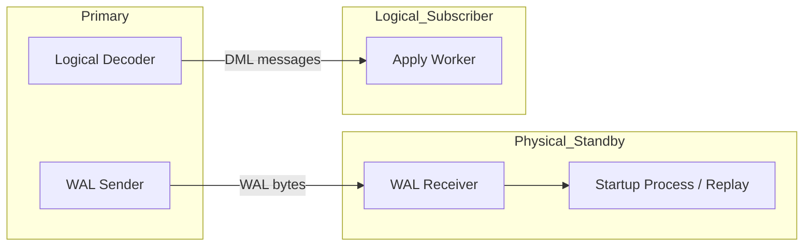
```mermaid
flowchart LR
    subgraph Primary
        WS[WAL Sender]
        LD[Logical Decoder]
    end
    subgraph Physical_Standby
        WR[WAL Receiver]
        SP[Startup Process / Replay]
    end
    subgraph Logical_Subscriber
        AW[Apply Worker]
    end
    WS -->|WAL bytes| WR
    WR --> SP
    LD -->|DML messages| AW
```

**BAD:**

```sql
CREATE TABLE events (data JSONB);
-- No PK: UPDATE/DELETE can't replicate
```

**GOOD:**

```sql
CREATE TABLE events (
  id BIGSERIAL PRIMARY KEY,
  data JSONB
);
ALTER TABLE events
REPLICA IDENTITY DEFAULT;
```

### 🚨 Failure Modes

**Failure 1 - Replication slot bloating WAL:**
**Symptom:** pg_wal directory grows continuously. Disk fills. Primary eventually halts.
**Root cause:** A replication slot (physical or logical) holds WAL segments for a disconnected or lagging replica. WAL cannot be recycled.
**Diagnostic:**

```sql
SELECT slot_name, active,
       pg_size_pretty(
         pg_wal_lsn_diff(
           pg_current_wal_lsn(),
           restart_lsn
         )
       ) AS retained_wal
FROM pg_replication_slots;
```

**Fix:** Drop inactive slots: `SELECT pg_drop_replication_slot('slot_name');`. Set `max_slot_wal_keep_size` (PostgreSQL 13+) to limit WAL retention per slot.

**Failure 2 - Logical replication conflict:**
**Symptom:** Logical replication stops applying changes. Subscriber logs show "ERROR: duplicate key value violates unique constraint."
**Root cause:** The subscriber has local data that conflicts with replicated inserts. Unlike physical replication, logical replication subscribers are independent databases.
**Diagnostic:**

```sql
SELECT * FROM pg_stat_subscription;
-- Check: last_msg_receipt_time stalled
-- Check subscriber logs for conflict
```

**Fix:** Resolve the conflict on the subscriber (DELETE or UPDATE the conflicting row). Set the subscription to skip the conflicting transaction: `ALTER SUBSCRIPTION sub SET (disable_on_error = true);`. Fix the root cause (remove local writes that conflict with replicated data).

### 🔬 Production Reality

A common pattern: a company uses physical replication for HA (automatic failover to a synchronous standby). They also need a copy of the `orders` table in a separate analytics database running a newer PostgreSQL version. Physical replication cannot help (different version, only one table needed). Logical replication provides the solution: `CREATE PUBLICATION orders_pub FOR TABLE orders;` on the primary, `CREATE SUBSCRIPTION orders_sub CONNECTION '...' PUBLICATION orders_pub;` on the analytics database. The analytics team gets near-real-time order data with their own indexes and local tables. The key learning: physical and logical replication serve different purposes and often coexist in the same architecture.

### ⚖️ Trade-offs & Alternatives

| Aspect              | Physical replication    | Logical replication       | pglogical (extension)        |
| ------------------- | ----------------------- | ------------------------- | ---------------------------- |
| Granularity         | Entire cluster          | Per-table                 | Per-table with more features |
| Cross-version       | Same major version only | Cross-version supported   | Cross-version supported      |
| DDL replication     | Automatic (byte-level)  | Not supported             | Partial support              |
| Writable subscriber | No                      | Yes                       | Yes                          |
| Failover support    | Yes (promote standby)   | Not designed for failover | Manual failover              |
| Initial data copy   | pg_basebackup           | Automatic snapshot        | Manual or automatic          |

### ⚡ Decision Snap

**USE WHEN:**

- Physical: HA failover, read replicas for identical workloads, disaster recovery
- Logical: selective table replication, cross-version migration, data integration with different databases

**AVOID WHEN:**

- Physical: when you need partial replication or writable replicas
- Logical: as a primary HA mechanism (no automatic failover, DDL not replicated)

**PREFER physical replication WHEN:**

- Simple HA/DR is the primary goal
- All databases and tables must be replicated
- Lowest possible replication lag is required (byte-level streaming is faster than logical apply)

### ⚠️ Top Traps

| #   | Misconception                                      | Reality                                                                                                                        |
| --- | -------------------------------------------------- | ------------------------------------------------------------------------------------------------------------------------------ |
| 1   | Logical replication replaces physical              | They serve different purposes; most production setups use physical for HA and logical for data integration                     |
| 2   | Logical replication handles DDL                    | Schema changes are not replicated; you must apply DDL on the subscriber manually before it appears on the publisher            |
| 3   | Replication slots are harmless                     | Inactive slots prevent WAL recycling and can fill the primary's disk; always monitor and drop unused slots                     |
| 4   | Physical replicas can accept writes in emergencies | Physical standbys are strictly read-only until promoted; promotion is a one-way operation                                      |
| 5   | Logical replication has zero lag                   | Logical apply is slower than physical replay because it decodes WAL into SQL operations; lag depends on subscriber performance |

### 🪜 Learning Ladder

**Prerequisites:**

- SQL-086 Write-Ahead Log (WAL) - Crash Recovery Mechanism - understand the WAL that both replication types stream
- SQL-039 ACID Properties - What They Actually Mean - replication guarantees depend on synchronous vs async settings

**THIS:** SQL-100 Logical Replication and Physical Replication

**Next steps:**

- SQL-101 Read Replicas - Scaling Reads - using physical replicas for read scaling
- SQL-103 Backup and Point-in-Time Recovery (PITR) - WAL archiving as backup strategy
- SQL-116 CQRS and Read/Write Separation Architecture - architecture patterns using replication

**The Surprising Truth:**
Logical replication's biggest hidden cost is not complexity or lag - it is the requirement for REPLICA IDENTITY on every replicated table. Without a primary key or explicit `ALTER TABLE SET REPLICA IDENTITY FULL`, UPDATE and DELETE operations on the subscriber do a sequential scan to find the matching row, creating severe performance degradation at scale. Many teams discover this only after logical replication lag climbs to hours.

**Further Reading:**

- PostgreSQL Documentation: Logical Replication (postgresql.org/docs/current/logical-replication.html)
- PostgreSQL Documentation: Streaming Replication (postgresql.org/docs/current/warm-standby.html)
- PostgreSQL Documentation: Replication Slots (postgresql.org/docs/current/warm-standby.html#STREAMING-REPLICATION-SLOTS)

**Revision Card:**

1. Physical replication = byte-level WAL copy for HA/DR. Logical replication = row-level DML for selective, cross-version replication
2. Replication slots retain WAL until the replica consumes it - inactive slots cause unbounded disk growth
3. Logical replication does not replicate DDL; schema changes must be applied manually on subscribers

---

---

# SQL-101 Read Replicas - Scaling Reads

**TL;DR** - Read replicas are standby databases receiving streamed WAL from the primary, serving read-only queries to distribute load and reduce primary contention.

### 🔥 Problem Statement

A primary database can handle a finite number of concurrent queries before CPU, I/O, or connection limits saturate. At production scale - thousands of application instances running both OLTP writes and analytical reads - the primary becomes a bottleneck. Heavy reporting queries compete with transactional writes for buffer pool, CPU, and I/O bandwidth. Without read replicas, you must either over-provision the primary or accept that read-heavy workloads degrade write performance. Read replicas offload read traffic to separate servers, scaling read throughput horizontally.

### 📜 Historical Context

PostgreSQL hot standby (read queries on physical replicas) was introduced in PostgreSQL 9.0 (2010). Before that, standbys were warm - they replayed WAL but could not accept connections. Cloud providers popularized read replicas as a managed feature: AWS RDS, Google Cloud SQL, and Azure Database for PostgreSQL all support automated read replica creation. The pattern is now standard in virtually every production PostgreSQL deployment. Synchronous replication options (PostgreSQL 9.1+) provide stronger durability guarantees at the cost of write latency.

### 🔩 First Principles

**CORE INVARIANTS:**

1. Read replicas are physically identical copies of the primary, continuously updated via WAL streaming
2. Replicas serve only read queries - any write attempt returns an error
3. Replication lag means replicas show slightly stale data; applications must tolerate eventual consistency for reads

**DERIVED DESIGN:**
The application's connection logic splits traffic: writes go to the primary, reads go to one or more replicas (via load balancer, DNS, or application-level routing). The replica continuously replays WAL from the primary, staying up to date within milliseconds under normal conditions. Long-running queries on the replica can conflict with WAL replay (the replica must replay a VACUUM that removes tuples the query is reading), requiring configuration to balance query availability against replay lag.

**THE TRADE-OFF:**
**Gain:** Horizontal read scaling; read traffic does not consume primary resources; replicas double as HA failover targets.
**Cost:** Eventual consistency (reads may be stale); application complexity for read/write routing; replica conflicts between queries and WAL replay.

### 🧠 Mental Model

> Think of a primary database as a live news anchor and read replicas as TV sets in different rooms showing the broadcast with a slight delay. Every room (replica) shows the same content, and the anchor (primary) is not slowed down by more TVs being added. But the delay means viewers in different rooms might see slightly different moments of the broadcast.

- "News anchor" -> primary database (single writer)
- "TV sets in different rooms" -> read replicas
- "Broadcast delay" -> replication lag

**Where this analogy breaks down:** Read replicas can experience query cancellation when the broadcast (WAL replay) conflicts with what a viewer is currently watching (long query on a tuple being vacuumed away).

### 🧩 Components

- **Primary** - accepts all writes, generates WAL
- **Read replica** - physical standby accepting read-only connections
- **WAL streaming** - continuous WAL transfer from primary to replica
- **Replication lag** - time/LSN difference between primary's current state and replica's applied state
- **hot_standby** - PostgreSQL parameter enabling queries on standbys
- **max_standby_streaming_delay** - how long the replica delays WAL replay to avoid canceling queries
- **pg_stat_replication** - primary-side view showing replica lag metrics

```
  Read Replica Architecture
  App Writes -> Primary (read-write)
                  |
            WAL Streaming
                  |
         +--------+--------+
         |        |        |
      Replica1  Replica2  Replica3
      (read)    (read)    (read)
         ^        ^        ^
         |        |        |
  App Reads (load balanced)
```

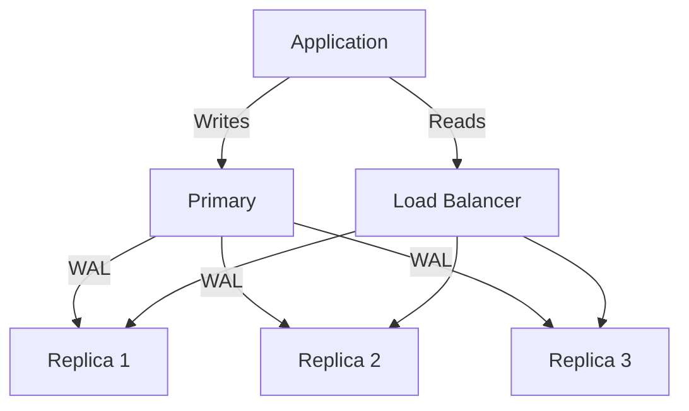
```mermaid
flowchart TD
    APP[Application]
    APP -->|Writes| PRI[Primary]
    PRI -->|WAL| R1[Replica 1]
    PRI -->|WAL| R2[Replica 2]
    PRI -->|WAL| R3[Replica 3]
    APP -->|Reads| LB[Load Balancer]
    LB --> R1
    LB --> R2
    LB --> R3
```

### 📶 Gradual Depth

**Level 1 - What it is:**
A read replica is a copy of your database that automatically stays updated. Applications send read queries to replicas instead of the primary, reducing load on the primary.

**Level 2 - How to use it:**
Create a replica with `pg_basebackup`. Configure the application to route writes to the primary connection string and reads to the replica connection string. In frameworks like Spring Boot, use `@Transactional(readOnly = true)` to route reads to replicas.

**Level 3 - How it works:**
The replica connects to the primary as a replication client. The WAL sender on the primary continuously streams WAL records. The WAL receiver on the replica writes them to disk, and the startup process replays them against the data files. With `hot_standby = on`, the replica accepts read connections during replay. Replay and queries share the same data files, so conflicts can occur when replay needs to remove rows a query is reading.

**Level 4 - Production mastery:**
Replica query conflicts are the most common operational issue. When WAL replay needs to clean up rows that an active query on the replica is reading, PostgreSQL faces a choice: delay replay (increasing lag) or cancel the query. `max_standby_streaming_delay` controls this balance (default 30s). For reporting replicas, set it high (5 minutes) to avoid canceling analytical queries. Monitor `pg_stat_database_conflicts` for conflict counts. For HA, use synchronous replication (`synchronous_standby_names`) to guarantee zero data loss on failover, at the cost of write latency (each commit waits for the replica to acknowledge).

### ⚙️ How It Works

**Phase 1 - Initial copy:** `pg_basebackup` creates a full copy of the primary's data directory on the replica server. This is the starting point.

**Phase 2 - Continuous streaming:** The replica connects to the primary's WAL sender. WAL records are streamed continuously as they are generated. The replica writes WAL to its own pg_wal directory.

**Phase 3 - WAL replay:** The startup process replays WAL records against the replica's data files, keeping them in sync with the primary. Replay lag depends on I/O throughput and conflict resolution.

**Phase 4 - Query serving:** With `hot_standby = on`, the replica accepts read connections. Queries execute against the replica's data files. The replica's snapshot reflects the latest replayed WAL position.

```
  Replica Conflict Resolution
  Query on replica: reading tuple T
  WAL replay: VACUUM removes tuple T
  Conflict!
  Option A: delay replay (increase lag)
  Option B: cancel query (preserve lag)
  Controlled by: max_standby_streaming_delay
```

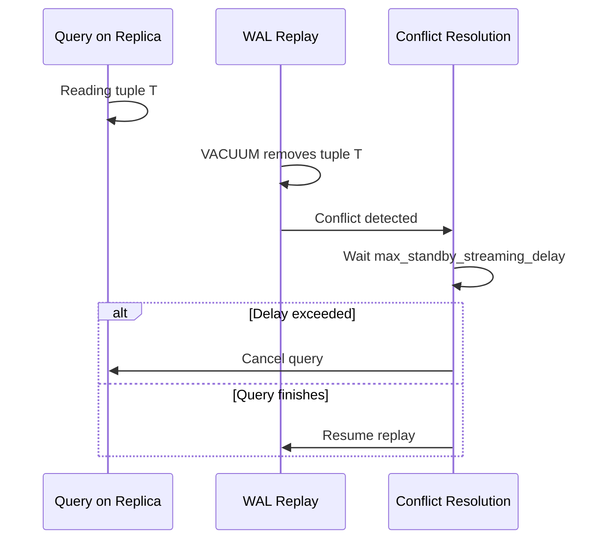
```mermaid
sequenceDiagram
    participant Q as Query on Replica
    participant R as WAL Replay
    participant C as Conflict Resolution
    Q->>Q: Reading tuple T
    R->>R: VACUUM removes tuple T
    R->>C: Conflict detected
    C->>C: Wait max_standby_streaming_delay
    alt Delay exceeded
        C->>Q: Cancel query
    else Query finishes
        C->>R: Resume replay
    end
```

**BAD:**

```sql
INSERT INTO orders VALUES (...);
-- Read from replica immediately:
SELECT * FROM orders WHERE id = ?;
-- NULL due to replication lag
```

**GOOD:**

```sql
INSERT INTO orders VALUES (...);
-- Read-your-write: use PRIMARY
SELECT * FROM orders WHERE id = ?;
-- Catalog browse -> replica OK
```

### 🚨 Failure Modes

**Failure 1 - Replica lag under write-heavy load:**
**Symptom:** pg_stat_replication shows growing lag (replay_lsn far behind sent_lsn). Application reads stale data.
**Root cause:** Replica I/O cannot keep up with primary's write rate. WAL replay is single-threaded (primary limitation until parallel replay is available).
**Diagnostic:**

```sql
-- On primary:
SELECT client_addr,
       pg_wal_lsn_diff(
         sent_lsn, replay_lsn
       ) AS replay_lag_bytes,
       replay_lag
FROM pg_stat_replication;
```

**Fix:** Upgrade replica storage (NVMe SSD). Reduce primary write volume during peak hours. For persistent lag, add more replicas and distribute reads. Consider separating analytical reads to a dedicated replica with higher max_standby_streaming_delay.

**Failure 2 - Query cancellation on replica:**
**Symptom:** Queries on the replica are killed with "ERROR: canceling statement due to conflict with recovery." Application errors spike on read-replica-routed queries.
**Root cause:** WAL replay needs to apply VACUUM or HOT cleanup that conflicts with running queries, and `max_standby_streaming_delay` is exceeded.
**Diagnostic:**

```sql
-- On replica:
SELECT datname, confl_tablespace,
       confl_lock, confl_snapshot,
       confl_bufferpin, confl_deadlock
FROM pg_stat_database_conflicts;
```

**Fix:** Increase `max_standby_streaming_delay` on the replica (e.g., 300s for reporting workloads). Accept higher lag as the trade-off. Alternatively, reduce `vacuum_defer_cleanup_age` on the primary or use `hot_standby_feedback = on` (but this prevents VACUUM on the primary from cleaning tuples visible to replica queries - potentially causing primary bloat).

### 🔬 Production Reality

A common production challenge: an e-commerce platform sends all read traffic to two replicas. During a flash sale, the primary generates WAL at 500 MB/s. Replicas fall 30 seconds behind. The product catalog page shows items as "in stock" that were sold out 30 seconds ago, causing over-selling. The fix is architectural: inventory checks (which require real-time accuracy) must go to the primary. Product catalog browsing (tolerant of staleness) goes to replicas. The lesson: not all reads have the same freshness requirement. Read routing must be semantically aware, not just a simple round-robin split.

### ⚖️ Trade-offs & Alternatives

| Aspect           | Physical read replicas  | Logical replication subscribers | Application-level caching (Redis) |
| ---------------- | ----------------------- | ------------------------------- | --------------------------------- |
| Data freshness   | Near-real-time (ms lag) | Near-real-time (higher lag)     | TTL-based (seconds to minutes)    |
| Query capability | Full SQL (read-only)    | Full SQL (read-write)           | Key-value lookups only            |
| Write capability | No                      | Yes (local tables)              | Yes (cache writes)                |
| Setup complexity | Low                     | Medium                          | High (cache invalidation)         |
| Scaling model    | Add replicas            | Add subscribers                 | Add cache nodes                   |

### ⚡ Decision Snap

**USE WHEN:**

- Read traffic exceeds what the primary can handle alone
- Reporting/analytical queries compete with OLTP on the primary
- HA failover is required (replicas double as failover targets)

**AVOID WHEN:**

- Reads require absolute real-time consistency (read-your-own-writes guarantee)
- The application cannot tolerate replication lag for any reads

**PREFER application caching WHEN:**

- Hot data set is small and fits in cache
- Read patterns are highly repetitive (same keys, same queries)
- Sub-millisecond read latency is required

### ⚠️ Top Traps

| #   | Misconception                        | Reality                                                                                                           |
| --- | ------------------------------------ | ----------------------------------------------------------------------------------------------------------------- |
| 1   | Read replicas are always up-to-date  | Replication lag is always present; under load it can grow to seconds or minutes                                   |
| 2   | All reads can safely go to replicas  | Reads requiring write-your-own-read consistency must go to the primary                                            |
| 3   | More replicas = linear scaling       | Each replica adds WAL streaming load on the primary; cascading replication reduces this                           |
| 4   | hot_standby_feedback has no downside | It prevents the primary from vacuuming tuples visible to replica queries, potentially causing primary table bloat |
| 5   | Replica failover is automatic        | Native PostgreSQL has no automatic failover; use Patroni, pg_auto_failover, or cloud-managed failover             |

### 🪜 Learning Ladder

**Prerequisites:**

- SQL-100 Logical Replication and Physical Replication - understand the replication mechanisms read replicas use
- SQL-086 Write-Ahead Log (WAL) - Crash Recovery Mechanism - WAL is the transport for replication

**THIS:** SQL-101 Read Replicas - Scaling Reads

**Next steps:**

- SQL-102 Connection Pooling - PgBouncer and HikariCP - pool connections to replicas efficiently
- SQL-116 CQRS and Read/Write Separation Architecture - architectural patterns for read/write separation
- SQL-113 Sharding Strategies - Application vs Proxy - scaling beyond what replicas provide

**The Surprising Truth:**
The most common read replica failure is not replication lag - it is query cancellation from WAL replay conflicts. Teams deploy replicas expecting seamless read offloading, only to find that long-running analytical queries are killed every few minutes because VACUUM on the primary generates WAL that conflicts with the replica's query snapshots. The fix - `hot_standby_feedback = on` - solves replica cancellations but can cause primary table bloat, creating a hidden trade-off that most teams discover the hard way.

**Further Reading:**

- PostgreSQL Documentation: Hot Standby (postgresql.org/docs/current/hot-standby.html)
- PostgreSQL Documentation: pg_stat_replication (postgresql.org/docs/current/monitoring-stats.html)
- PostgreSQL Documentation: Standby Server Settings (postgresql.org/docs/current/standby-settings.html)

**Revision Card:**

1. Read replicas stream WAL from the primary and serve read-only queries - scaling reads horizontally
2. Replication lag is always present; route consistency-sensitive reads to the primary
3. Query cancellation from VACUUM replay conflicts is the primary operational challenge - tune max_standby_streaming_delay

---

---

# SQL-102 Connection Pooling - PgBouncer and HikariCP

**TL;DR** - Connection pooling multiplexes many application connections over fewer database connections, reducing PostgreSQL's per-connection memory overhead and avoiding the cost of establishing new connections.

### 🔥 Problem Statement

Each PostgreSQL connection forks a dedicated backend process consuming 5-10 MB of RAM. A microservices architecture with 50 services, each maintaining a pool of 20 connections, needs 1,000 database connections - consuming 5-10 GB of RAM on the database server just for connection overhead. At production scale, connection storms (many services reconnecting simultaneously) overwhelm the `postmaster` fork rate, causing latency spikes and connection failures. Without pooling, the connection count becomes the primary scalability constraint long before CPU or disk I/O are saturated.

### 📜 Historical Context

PgBouncer was created in 2007 by Skype to handle their massive PostgreSQL connection requirements. It remains the dominant external connection pooler for PostgreSQL. On the application side, HikariCP (2013) became the de facto Java connection pool, known for its minimal overhead and correct connection lifecycle management. PostgreSQL has discussed built-in connection pooling for years, and some features (connection reuse improvements in PostgreSQL 17) address parts of the problem. The two layers complement each other: HikariCP pools at the application level, PgBouncer pools at the database level.

### 🔩 First Principles

**CORE INVARIANTS:**

1. Each PostgreSQL backend process is expensive - fork cost, memory allocation, and catalog cache initialization
2. Most application connections are idle most of the time - active query time is typically < 5% of connection hold time
3. Pooling reduces the many-to-one mapping: many application connections share fewer database connections

**DERIVED DESIGN:**
PgBouncer operates as a proxy between applications and PostgreSQL, maintaining a pool of real database connections and assigning them to application requests. In transaction mode (most common), a database connection is assigned when a transaction begins and returned to the pool when it commits. HikariCP manages the application-side pool, ensuring connections are healthy, limiting maximum connections, and providing fast checkout/return.

**THE TRADE-OFF:**
**Gain:** Support thousands of application connections with hundreds (or fewer) database connections; reduced memory and CPU overhead on PostgreSQL; faster "connection" establishment (pool checkout vs OS fork).
**Cost:** Transaction-mode pooling breaks session-level features (prepared statements, advisory locks, SET variables); pool sizing requires careful tuning; additional infrastructure component (PgBouncer).

### 🧠 Mental Model

> Think of a busy restaurant with 20 tables (database connections) serving 200 diners (application connections). Without a host (pooler), each diner claims a table for the entire evening even while waiting for dessert (idle connection). With a host (PgBouncer), diners are seated only when their course arrives (transaction) and give up the table between courses.

- "Restaurant table" -> database connection (backend process)
- "Host managing seating" -> PgBouncer in transaction mode
- "Seated only during courses" -> connection assigned per transaction

**Where this analogy breaks down:** In session mode, the diner keeps the table for the entire evening (like no pooling). The pooler also handles "health checks" - testing if a table is actually usable before seating someone.

### 🧩 Components

- **PgBouncer** - external proxy pooler; sits between application and PostgreSQL
- **HikariCP** - application-side connection pool (Java/JVM)
- **Pool modes** - session (1:1 mapping), transaction (shared per tx), statement (shared per statement)
- **max_connections** - PostgreSQL parameter limiting total backend processes
- **pool_size** - PgBouncer parameter setting how many real database connections to maintain
- **Connection checkout** - application borrows a connection from the pool
- **Connection return** - application returns a connection after use

```
  Two-Layer Pooling
  App instances (200 total connections)
    |  HikariCP (20 per instance)
    v
  PgBouncer (50 pool_size)
    |  transaction mode
    v
  PostgreSQL (max_connections=60)
    |
  50 backend processes (shared)
```

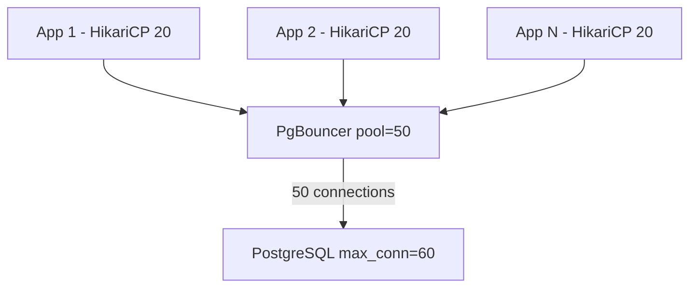
```mermaid
flowchart TD
    A1[App 1 - HikariCP 20] --> PGB[PgBouncer pool=50]
    A2[App 2 - HikariCP 20] --> PGB
    A3[App N - HikariCP 20] --> PGB
    PGB -->|50 connections| PG[PostgreSQL max_conn=60]
```

### 📶 Gradual Depth

**Level 1 - What it is:**
Connection pooling reuses database connections instead of creating new ones for each request. This reduces the overhead of connecting to PostgreSQL and allows more application instances to share fewer database connections.

**Level 2 - How to use it:**
Application side: configure HikariCP with `maximumPoolSize=20`, `minimumIdle=5`, `connectionTimeout=30000`. Database side: install PgBouncer, configure `pool_mode = transaction`, set `default_pool_size = 25`. Point applications at PgBouncer instead of directly at PostgreSQL.

**Level 3 - How it works:**
PgBouncer listens on a port (typically 6432). When an application opens a "connection," PgBouncer creates a lightweight client-side socket. When the application begins a transaction, PgBouncer assigns a real PostgreSQL connection from the pool. When the transaction commits, the PostgreSQL connection is returned to the pool. Session state (SET parameters, prepared statements) is not preserved between transactions in transaction mode.

**Level 4 - Production mastery:**
Pool sizing is the critical tuning challenge. The formula for PgBouncer `default_pool_size` starts with: CPU cores _ 2 + effective_spindle_count. For SSD, this is roughly `cores _ 2 + 1`. Over-sizing the pool (e.g., 500 real connections) defeats the purpose - it just moves the memory problem from application-level to database-level. Under-sizing causes queuing at PgBouncer. Monitor PgBouncer's `SHOW POOLS`and`SHOW STATS`for active/waiting/idle counts. For HikariCP, set`maximumPoolSize` based on expected concurrent transactions, not concurrent users.

### ⚙️ How It Works

**Phase 1 - Client connection:** Application connects to PgBouncer. PgBouncer authenticates the client (using its own auth database or passthrough to PostgreSQL). A lightweight client session is created in PgBouncer's memory.

**Phase 2 - Transaction start:** Application begins a transaction (or issues the first query). PgBouncer assigns a real PostgreSQL connection from the pool. If no connection is available, the client waits in PgBouncer's queue.

**Phase 3 - Query relay:** PgBouncer relays queries from the client to the assigned PostgreSQL connection and returns results. The PostgreSQL backend is fully dedicated to this client for the transaction duration.

**Phase 4 - Transaction end:** Application commits or rolls back. PgBouncer returns the PostgreSQL connection to the pool. The client session remains open but no longer holds a database connection.

```
  Transaction Mode Timeline
  Client A: [connect]...[BEGIN]=====[COMMIT]
  DB conn:            [assigned]====[freed]
  Client B: [connect]........[BEGIN]==[COMMIT]
  DB conn:                   [assigned]==[freed]
  Same DB connection may serve both!
```

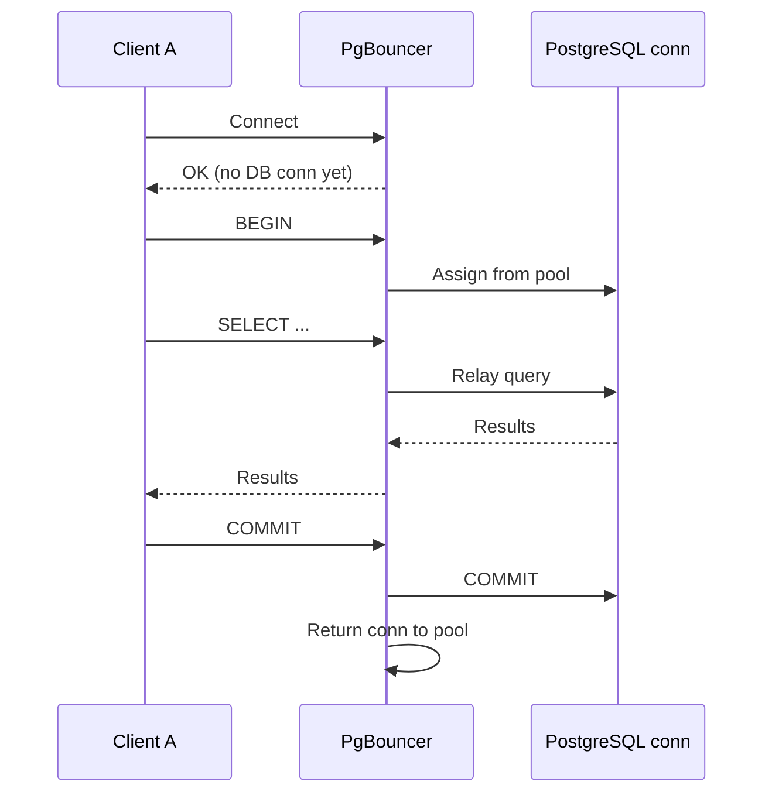
```mermaid
sequenceDiagram
    participant CA as Client A
    participant PGB as PgBouncer
    participant PG as PostgreSQL conn
    CA->>PGB: Connect
    PGB-->>CA: OK (no DB conn yet)
    CA->>PGB: BEGIN
    PGB->>PG: Assign from pool
    CA->>PGB: SELECT ...
    PGB->>PG: Relay query
    PG-->>PGB: Results
    PGB-->>CA: Results
    CA->>PGB: COMMIT
    PGB->>PG: COMMIT
    PGB->>PGB: Return conn to pool
```

**BAD:**

```
-- 500 direct connections
-- max_connections = 500
-- 5-10 MB each = 2.5-5 GB RAM
```

**GOOD:**

```
-- PgBouncer transaction mode
-- 500 app conns -> 50 DB conns
-- pool_mode = transaction
-- ~500 MB total
```

### 🚨 Failure Modes

**Failure 1 - Pool exhaustion:**
**Symptom:** Application connections hang at "acquiring connection from pool." HikariCP logs "Connection is not available, request timed out." PgBouncer shows high "waiting" count.
**Root cause:** Long-running transactions or connection leaks (application code that checks out a connection but never returns it).
**Diagnostic:**

```sql
-- PgBouncer admin console:
SHOW POOLS;
-- Check: cl_active vs cl_waiting
-- sv_active vs sv_idle
SHOW CLIENTS;
-- Look for long-lived active clients
```

**Fix:** Set `connectionTimeout` in HikariCP (e.g., 30 seconds) to fail fast instead of waiting forever. Set `maxLifetime` to rotate connections. Find and fix connection leaks (missing `finally` close blocks). Use `leakDetectionThreshold` in HikariCP to log stack traces of leaked connections.

**Failure 2 - Prepared statement incompatibility in transaction mode:**
**Symptom:** Queries using server-side prepared statements fail with "ERROR: prepared statement does not exist" intermittently.
**Root cause:** In transaction mode, PgBouncer assigns different PostgreSQL connections per transaction. Prepared statements created in one transaction are not visible in the next because it may use a different backend.
**Diagnostic:**

```
Application logs showing intermittent
prepared statement errors. Error
frequency correlates with pool cycling.
```

**Fix:** Use PgBouncer's `prepared_statement` mode (available in PgBouncer 1.21+) or switch to client-side prepared statements in the JDBC driver (`prepareThreshold=0` in PostgreSQL JDBC). Alternatively, use PgBouncer session mode for applications that rely on prepared statements.

### 🔬 Production Reality

A common production scenario: a microservices platform has 100 service instances, each with HikariCP pools of 20 connections, pointing directly at PostgreSQL with `max_connections = 2000`. The database uses 15 GB of RAM just for connection overhead. Adding PgBouncer in transaction mode with `default_pool_size = 50` reduces the real connection count from 2000 to 50 - because at any given moment, fewer than 50 transactions are actually executing simultaneously. PostgreSQL memory drops from 15 GB to under 500 MB for connections. The lesson: connection pooling is not optional in microservices architectures; it is the difference between a database that scales and one that falls over at 100 services.

### ⚖️ Trade-offs & Alternatives

| Aspect           | PgBouncer                 | pgpool-II                      | HikariCP (alone)     | Built-in (max_connections) |
| ---------------- | ------------------------- | ------------------------------ | -------------------- | -------------------------- |
| Pool level       | Database proxy            | Database proxy + query routing | Application          | None (fork per conn)       |
| Transaction mode | Yes                       | Limited                        | N/A (always session) | N/A                        |
| Load balancing   | No                        | Yes (read/write split)         | No                   | No                         |
| Overhead         | Minimal (~2KB per client) | Higher (query parsing)         | Minimal              | 5-10 MB per conn           |
| Session features | Broken in tx mode         | Preserved                      | Preserved            | Full                       |
| Failover support | No                        | Yes                            | No                   | No                         |

### ⚡ Decision Snap

**USE WHEN:**

- Microservices architecture with many application instances (PgBouncer: always)
- Java applications needing efficient connection management (HikariCP: always)
- Total application connection count exceeds 200

**AVOID WHEN:**

- Applications rely heavily on session-level features (prepared statements, SET, advisory locks) and cannot switch to transaction-scoped alternatives
- Single monolithic application with < 50 connections (pooling overhead exceeds benefit)

**PREFER PgBouncer session mode WHEN:**

- Application uses session-level prepared statements extensively
- Advisory locks (session-level) are used for coordination
- Connection count is moderate (< 200 total)

### ⚠️ Top Traps

| #   | Misconception                                         | Reality                                                                                                                 |
| --- | ----------------------------------------------------- | ----------------------------------------------------------------------------------------------------------------------- |
| 1   | More connections = more throughput                    | Beyond CPU cores \* 2-3, additional connections add contention (lock waits, buffer pool pressure) and reduce throughput |
| 2   | PgBouncer transaction mode is transparent             | Session-level features (prepared statements, SET, LISTEN/NOTIFY, temp tables) break in transaction mode                 |
| 3   | HikariCP maximumPoolSize should match max_connections | HikariCP pool size should match expected concurrent transactions, which is far less than total user count               |
| 4   | Connection pooling fixes slow queries                 | Pooling reduces connection overhead; it does not speed up query execution. Slow queries still hold connections longer   |
| 5   | PgBouncer adds significant latency                    | PgBouncer adds sub-millisecond overhead; the network hop is negligible compared to query execution time                 |

### 🪜 Learning Ladder

**Prerequisites:**

- SQL-087 Buffer Pool and Shared Memory Architecture - understand per-connection memory overhead
- SQL-090 Row-Level vs Table-Level Locking - connections holding locks affect pool utilization

**THIS:** SQL-102 Connection Pooling - PgBouncer and HikariCP

**Next steps:**

- SQL-101 Read Replicas - Scaling Reads - route pooled connections to replicas for read scaling
- SQL-119 Connection Routing and Proxy Architecture - advanced routing beyond simple pooling
- SQL-093 Advisory Locks - Application-Level Coordination - advisory lock safety with PgBouncer

**The Surprising Truth:**
The optimal number of database connections is far smaller than most teams expect. PostgreSQL benchmarks consistently show that throughput peaks at roughly `CPU cores * 2` active connections and declines with more. A 16-core database server achieves maximum throughput with about 32 active connections, not 500. PgBouncer's job is not just reducing connection overhead - it is enforcing this optimal concurrency level by queuing excess requests.

**Further Reading:**

- PgBouncer Documentation (pgbouncer.github.io)
- HikariCP GitHub: About Pool Sizing (github.com/brettwooldridge/HikariCP/wiki/About-Pool-Sizing)
- PostgreSQL Wiki: Number Of Database Connections (wiki.postgresql.org/wiki/Number_Of_Database_Connections)

**Revision Card:**

1. PgBouncer multiplexes many application connections over few database connections in transaction mode
2. Optimal database connections approximately equals CPU cores \* 2; more connections decrease throughput
3. Transaction mode breaks session-level features (prepared statements, SET, advisory locks) - use alternatives or session mode

---

---

# SQL-103 Backup and Point-in-Time Recovery (PITR)

**TL;DR** - PITR combines a base backup with archived WAL segments to restore a database to any point in time, enabling recovery from accidental data deletion or corruption.

### 🔥 Problem Statement

Logical backups (`pg_dump`) capture a snapshot at a single point in time. If someone runs `DELETE FROM orders WHERE 1=1` at 3:00 PM and you discover it at 5:00 PM, restoring last night's pg_dump loses the entire day's data. At production scale, the gap between the last backup and the incident (Recovery Point Objective / RPO) can represent millions of dollars in lost transactions. PITR solves this by continuously archiving WAL segments, enabling restoration to any second between the base backup and the present - including the moment just before the destructive operation.

### 📜 Historical Context

PostgreSQL added WAL archiving in version 8.0 (2005) and PITR in version 8.1 (2005). Before PITR, the only recovery option was restoring from the last pg_dump. The introduction of continuous archiving transformed PostgreSQL into an enterprise-grade database for disaster recovery. Tools like pgBackRest (2014) and Barman (2013) built on this foundation, adding incremental backups, compression, parallel backup/restore, and cloud storage integration. Modern PostgreSQL (14+) adds server-side backup manifests for integrity verification.

### 🔩 First Principles

**CORE INVARIANTS:**

1. A base backup is a copy of the data directory at a point in time; WAL segments contain all changes since that point
2. Replaying WAL from a base backup to a target timestamp recreates the exact database state at that moment
3. Continuous WAL archiving is required - any gap in archived WAL segments creates a gap in recovery capability

**DERIVED DESIGN:**
The backup strategy has three components: periodic base backups (e.g., daily), continuous WAL archiving (every completed 16 MB segment), and a recovery configuration specifying the target time. Recovery replays WAL from the base backup's start point to the target, then opens the database. The RPO is determined by the last archived WAL segment - typically seconds to minutes.

**THE TRADE-OFF:**
**Gain:** Recovery to any point in time with second-level granularity; near-zero RPO with continuous archiving.
**Cost:** Storage for base backups and WAL archives; operational complexity of managing archive storage; recovery time proportional to WAL volume between base backup and target.

### 🧠 Mental Model

> Think of PITR as a DVR for your database. The base backup is the recording's starting point. WAL archiving continuously records everything that happens. When disaster strikes, you rewind (replay WAL) to the exact moment before the problem - like rewinding a video to before the bad scene.

- "DVR recording start" -> base backup
- "Continuous recording" -> WAL archiving
- "Rewinding to a specific time" -> PITR recovery target

**Where this analogy breaks down:** Recovery is not instant like rewinding video - replaying hours of WAL can take significant time, proportional to the amount of changes.

### 🧩 Components

- **Base backup** - full copy of the data directory (`pg_basebackup`)
- **WAL archiving** - copying completed WAL segments to archive storage (`archive_command`)
- **Archive storage** - durable location for WAL and base backups (local, NFS, S3, GCS)
- **recovery_target_time** - PostgreSQL parameter specifying the PITR target timestamp
- **pgBackRest** - production-grade backup tool with incremental, parallel, and cloud support
- **Barman** - alternative backup tool by EnterpriseDB

```
  PITR Timeline
  Base Backup         Incident    Target
  (Sun 2AM)           (Wed 3PM)   (Wed 2:59PM)
  |                       |           |
  v                       v           v
  [--WAL archived continuously--]
  |=====recovery replay========|
                               ^
                          recover here
```

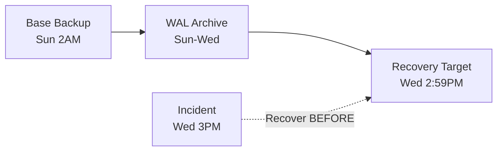
```mermaid
flowchart LR
    BB["Base Backup\nSun 2AM"] --> WAL["WAL Archive\nSun-Wed"]
    WAL --> RT["Recovery Target\nWed 2:59PM"]
    INC["Incident\nWed 3PM"] -.->|"Recover BEFORE"| RT
```

### 📶 Gradual Depth

**Level 1 - What it is:**
PITR lets you restore your database to any moment in the past. You need a starting copy (base backup) and a continuous record of all changes (WAL archive).

**Level 2 - How to use it:**
Set up WAL archiving: `archive_mode = on`, `archive_command = 'pgbackrest --stanza=main archive-push %p'`. Take periodic base backups: `pgbackrest --stanza=main --type=full backup`. To recover: restore the base backup, set `recovery_target_time`, and start PostgreSQL.

**Level 3 - How it works:**
`pg_basebackup` copies the data directory while the database is running (it takes a snapshot using a checkpoint). WAL generated during the backup is included. After the base backup, `archive_command` copies each completed 16 MB WAL segment to archive storage. Recovery: PostgreSQL restores the base backup, then replays WAL segments from the archive in order, stopping at `recovery_target_time`. Uncommitted transactions at the target time are rolled back.

**Level 4 - Production mastery:**
Recovery Time Objective (RTO) depends on: base backup age (more WAL to replay = longer recovery), WAL replay speed (proportional to write volume), and storage I/O. Strategy: take daily full backups and keep incremental backups (pgBackRest supports this). Test recovery regularly - untested backups are not backups. Use `pg_verifybackup` (PostgreSQL 14+) to validate backup integrity. Monitor `archive_command` success: a failing archive command means WAL accumulates locally and eventually fills pg_wal. Set up alerts on `pg_stat_archiver` for failed archive attempts.

### ⚙️ How It Works

**Phase 1 - Base backup:** `pg_basebackup` requests a checkpoint on the primary, then copies all data files. WAL generated during the copy is included in the backup. The backup is labeled with a start and end LSN.

**Phase 2 - Continuous archiving:** As the database operates, WAL segments fill up (16 MB each). When a segment is complete, `archive_command` fires, copying the segment to archive storage. With `archive_timeout`, partially-filled segments are forced to archive after a timeout (reducing RPO).

**Phase 3 - Recovery initiation:** Restore the base backup data directory. Create `recovery.signal` (or set `restore_command` and `recovery_target_time` in postgresql.conf). Start PostgreSQL.

**Phase 4 - WAL replay:** PostgreSQL reads WAL segments from the archive via `restore_command`, replaying each in sequence. When it reaches a segment containing the target time, it replays up to that exact point and stops.

**Phase 5 - Promotion:** PostgreSQL opens the database for connections. The recovery is complete. The database state is exactly as it was at the target time.

```
  Recovery Process
  1. Restore base backup (data dir)
  2. Set recovery_target_time
  3. Start PostgreSQL
  4. PG requests WAL from archive:
     restore_command ->
       pg_wal/00000001000000A
     Replay... replay... replay...
  5. Reached target time -> STOP
  6. Database open for connections
```

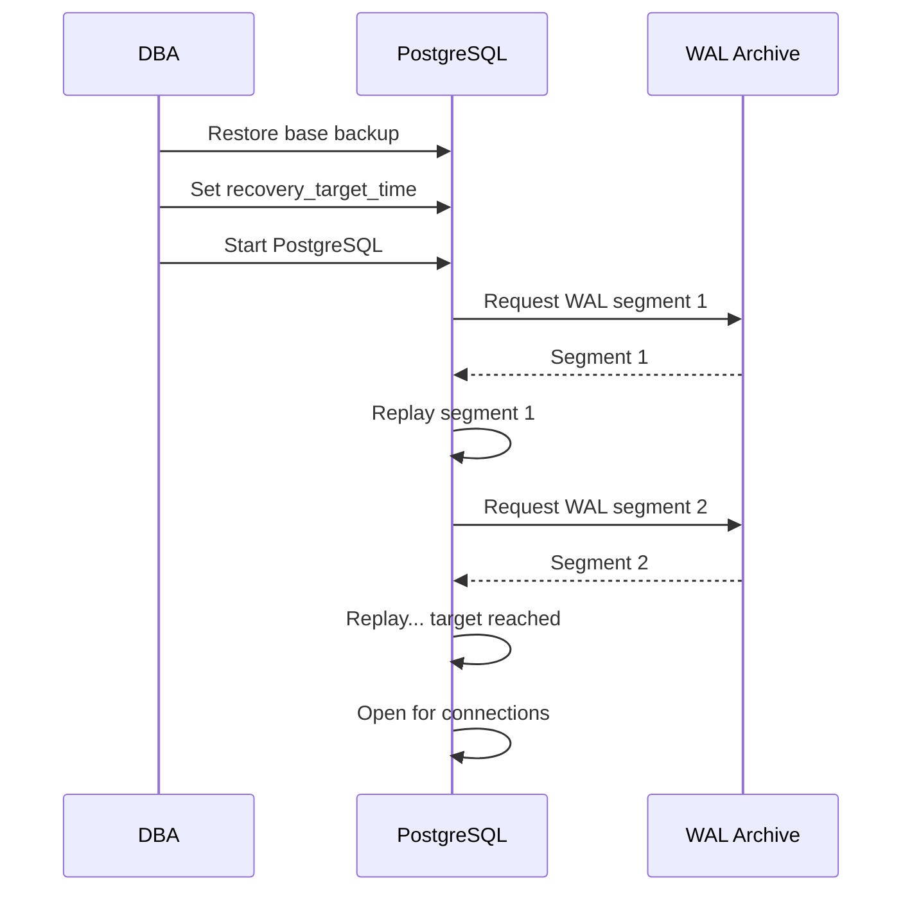
```mermaid
sequenceDiagram
    participant DBA as DBA
    participant PG as PostgreSQL
    participant ARC as WAL Archive
    DBA->>PG: Restore base backup
    DBA->>PG: Set recovery_target_time
    DBA->>PG: Start PostgreSQL
    PG->>ARC: Request WAL segment 1
    ARC-->>PG: Segment 1
    PG->>PG: Replay segment 1
    PG->>ARC: Request WAL segment 2
    ARC-->>PG: Segment 2
    PG->>PG: Replay... target reached
    PG->>PG: Open for connections
```

**BAD:**

```sql
-- pg_dump only, once per night
-- RPO: up to 24 hours of data loss
-- archive_mode = off
```

**GOOD:**

```sql
ALTER SYSTEM
SET archive_mode = on;
ALTER SYSTEM SET archive_command =
  'pgbackrest --stanza=main
   archive-push %p';
-- RPO: seconds
```

### 🚨 Failure Modes

**Failure 1 - WAL archive gap:**
**Symptom:** Recovery fails with "ERROR: could not find WAL segment" or "requested WAL segment has already been removed."
**Root cause:** archive_command failed silently for some segments, or WAL was recycled before being archived (replication slot not used).
**Diagnostic:**

```sql
SELECT * FROM pg_stat_archiver;
-- Check: failed_count > 0
-- Check: last_failed_wal, last_failed_time
```

**Fix:** Monitor `pg_stat_archiver` and alert on any `failed_count` increase. Test `archive_command` in isolation. Use pgBackRest's asynchronous archiving with verification. Ensure `wal_keep_size` or a replication slot retains WAL until archived.

**Failure 2 - Recovery takes too long (RTO exceeded):**
**Symptom:** PITR recovery takes hours instead of the expected 30 minutes. Business impact from extended downtime.
**Root cause:** Base backup is too old, so hundreds of gigabytes of WAL must be replayed. Or recovery storage has slow I/O.
**Diagnostic:**

```
Check: age of most recent base backup
Check: total WAL volume since backup
Check: storage IOPS during recovery
```

**Fix:** Take more frequent base backups (every 6-12 hours for critical databases). Use incremental backups (pgBackRest delta). Ensure recovery storage uses fast SSD. Pre-stage base backups for faster restore.

### 🔬 Production Reality

A well-known pattern: a developer accidentally runs `UPDATE users SET email = NULL;` on production at 2:47 PM. The team discovers it at 4:00 PM. With daily pg_dump (taken at midnight), they would lose 14 hours of data. With PITR: they spin up a recovery instance, set `recovery_target_time = '2024-03-15 14:46:59'`, replay WAL, and extract the correct `users` table. They `pg_dump` just the `users` table from the recovery instance and restore it to production. Total data loss: zero. The key insight: PITR is not just for full-cluster recovery - it can be used to recover individual tables or even individual rows by restoring to a separate instance and extracting the needed data.

### ⚖️ Trade-offs & Alternatives

| Aspect                | PITR (WAL-based)                     | pg_dump (logical)         | pgBackRest (full tool)        | Cloud-managed snapshots      |
| --------------------- | ------------------------------------ | ------------------------- | ----------------------------- | ---------------------------- |
| RPO                   | Seconds (continuous WAL)             | Hours (last dump)         | Seconds (WAL + incremental)   | Minutes (snapshot frequency) |
| RTO                   | Minutes to hours (WAL replay)        | Minutes (logical restore) | Minutes (parallel restore)    | Minutes (volume attach)      |
| Storage efficiency    | WAL compression available            | SQL text (large)          | Incremental + compression     | Block-level dedup            |
| Table-level recovery  | Possible (restore separately)        | Direct (pg_dump -t)       | Possible (restore separately) | Full volume only             |
| Cross-version restore | No (physical format tied to version) | Yes (logical SQL)         | No                            | Provider-specific            |

### ⚡ Decision Snap

**USE WHEN:**

- Any production database where data loss is unacceptable (RPO near zero)
- Protection against accidental data deletion or corruption
- Compliance requirements mandate point-in-time recovery capability

**AVOID WHEN:**

- Ephemeral or easily reconstructable data (development databases, caches)
- Cross-version migration is needed (use pg_dump for logical portability)

**PREFER pgBackRest over manual PITR WHEN:**

- Managing multiple databases or standbys
- Incremental backups are needed to reduce storage and backup time
- Cloud storage (S3/GCS) is the backup target

### ⚠️ Top Traps

| #   | Misconception                                | Reality                                                                                                                                    |
| --- | -------------------------------------------- | ------------------------------------------------------------------------------------------------------------------------------------------ |
| 1   | pg_dump is sufficient for production backups | pg_dump captures a single point in time; any data written between dumps is lost in a disaster                                              |
| 2   | PITR recovery is instant                     | Recovery time is proportional to WAL volume since the base backup; hours of WAL = hours of replay                                          |
| 3   | archive_command failures are harmless        | A failed archive_command means WAL gaps; gaps make PITR impossible for the affected time range                                             |
| 4   | PITR can recover from disk corruption        | PITR replays WAL onto data files; if the base backup or archive storage is corrupted, recovery fails. Maintain backups on separate storage |
| 5   | Testing backups is optional                  | An untested backup is Schrodinger's backup - you do not know if it works until you try to restore. Test monthly                            |

### 🪜 Learning Ladder

**Prerequisites:**

- SQL-086 Write-Ahead Log (WAL) - Crash Recovery Mechanism - understand WAL as the basis for PITR
- SQL-100 Logical Replication and Physical Replication - understand WAL archiving and streaming

**THIS:** SQL-103 Backup and Point-in-Time Recovery (PITR)

**Next steps:**

- SQL-104 Zero-Downtime Schema Migrations - safe migration practices that reduce the need for PITR
- SQL-105 GitLab Database Incident (2017) - real-world case where backup practices failed
- SQL-122 Database Capacity Planning and Growth Modeling - plan storage for backups and WAL archives

**The Surprising Truth:**
The most common PITR failure mode is not a missing WAL segment or corrupted backup - it is that the team never tested recovery until the actual disaster. In a 2023 survey of database incidents, over 30% of teams discovered their backup was unusable only when they tried to restore it in an emergency. Regular recovery testing - monthly at minimum - is the most important backup practice, far more important than the backup tool or storage backend.

**Further Reading:**

- PostgreSQL Documentation: Continuous Archiving and PITR (postgresql.org/docs/current/continuous-archiving.html)
- pgBackRest Documentation (pgbackrest.org)
- PostgreSQL Documentation: pg_basebackup (postgresql.org/docs/current/app-pgbasebackup.html)

**Revision Card:**

1. PITR = base backup + continuous WAL archiving; enables recovery to any point in time with second-level precision
2. RPO depends on WAL archiving continuity; RTO depends on WAL volume since the last base backup
3. Untested backups are not backups - test recovery regularly and monitor pg_stat_archiver for archive failures
