## Keywords

1. [SQL-104 Zero-Downtime Schema Migrations](#sql-104-zero-downtime-schema-migrations)
2. [SQL-105 GitLab Database Incident (2017)](#sql-105-gitlab-database-incident-2017)
3. [SQL-106 GitHub MySQL Failover Incident (2018)](#sql-106-github-mysql-failover-incident-2018)
4. [SQL-107 Unindexed Foreign Key Anti-Pattern](#sql-107-unindexed-foreign-key-anti-pattern)
5. [SQL-108 OFFSET Pagination at Scale Anti-Pattern](#sql-108-offset-pagination-at-scale-anti-pattern)
6. [SQL-109 Online Store DB - Phase 4 (Internals and Tuning)](#sql-109-online-store-db---phase-4-internals-and-tuning)
7. [SQL-110 SQL Expert-Level Mastery Verification](#sql-110-sql-expert-level-mastery-verification)
8. [SQL-111 SQL Deep-Dive Interview Questions](#sql-111-sql-deep-dive-interview-questions)
9. [SQL-112 PCI-DSS and Data-at-Rest Encryption](#sql-112-pci-dss-and-data-at-rest-encryption)

---

---

# SQL-104 Zero-Downtime Schema Migrations

**TL;DR** - Zero-downtime migrations modify database schema without locking out concurrent queries, using patterns like adding nullable columns, backfilling in batches, and swap-based index creation.

### 🔥 Problem Statement

Traditional schema migrations (`ALTER TABLE ADD COLUMN ... DEFAULT ...`, `CREATE INDEX`, `ALTER TABLE ... ADD CONSTRAINT`) acquire locks that block concurrent queries. On a 500 GB table, `CREATE INDEX` takes hours with a full table lock in older PostgreSQL versions. `ALTER TABLE` with a volatile default rewrites the entire table. In production systems serving thousands of requests per second, even a 30-second lock causes connection pool exhaustion, timeout errors, and cascading failures. Zero-downtime migrations restructure the database without any lock that blocks concurrent reads or writes.

### 📜 Historical Context

The problem of online schema change gained prominence as web-scale applications moved to continuous deployment. GitHub developed `gh-ost` (2016) for MySQL online schema migrations using binary log replication. Facebook's `OSC` (Online Schema Change) tool predated it. PostgreSQL addressed the problem differently: adding `CREATE INDEX CONCURRENTLY` (PostgreSQL 8.2), non-locking `ALTER TABLE ADD COLUMN` without default (all versions), and instant `ADD COLUMN WITH DEFAULT` for non-volatile defaults (PostgreSQL 11). Tools like `pg_repack` and libraries like `strong_migrations` (Rails) enforce safe migration patterns.

### 🔩 First Principles

**CORE INVARIANTS:**

1. Any operation requiring AccessExclusiveLock blocks ALL concurrent queries on the table - the lock must be held for the shortest possible time
2. Table rewrites (adding a column with a volatile default, changing column type) are the most dangerous because they hold locks for the duration of the rewrite
3. Safe migrations decompose dangerous operations into multiple small, non-blocking steps

**DERIVED DESIGN:**
The safe migration pattern: (1) Add column with no default or a non-volatile default (instant, brief lock). (2) Backfill data in batches (no lock, concurrent access continues). (3) Add constraint as NOT VALID (brief lock, no data scan). (4) VALIDATE CONSTRAINT separately (ShareUpdateExclusiveLock, concurrent DML continues). (5) Add index concurrently (no lock on reads/writes). Each step holds AccessExclusiveLock for milliseconds, not minutes.

**THE TRADE-OFF:**
**Gain:** Zero application downtime during schema changes; continuous deployment without maintenance windows.
**Cost:** Migration complexity (multiple steps instead of one); longer total migration time; application must handle the transitional state (nullable column, missing constraint).

### 🧠 Mental Model

> Think of renovating a restaurant kitchen while the restaurant stays open. You cannot close the kitchen for a day (downtime migration). Instead: install new counters alongside old ones (add column), gradually move utensils (backfill in batches), then remove old counters during a quiet moment (drop old column). Customers never notice the renovation.

- "Closing the kitchen" -> AccessExclusiveLock (blocks everything)
- "Installing alongside" -> ADD COLUMN (nullable, no default)
- "Moving utensils gradually" -> batch backfill with small transactions

**Where this analogy breaks down:** Database migrations also interact with application code that must handle both old and new schema states during the transition period.

### 🧩 Components

- **AccessExclusiveLock** - the most restrictive lock; blocks all concurrent operations
- **CREATE INDEX CONCURRENTLY** - builds index without blocking writes (acquires ShareUpdateExclusiveLock)
- **ADD COLUMN (no default)** - instant metadata change, brief lock
- **ADD COLUMN ... DEFAULT (non-volatile)** - instant on PostgreSQL 11+ (stored in catalog, not written to every row)
- **NOT VALID constraint** - adds constraint metadata without scanning existing rows
- **VALIDATE CONSTRAINT** - scans data with ShareUpdateExclusiveLock (allows concurrent DML)
- **Batch backfill** - update rows in small batches with commits between batches

```
  Safe Migration Steps
  1. ADD COLUMN name TEXT;  -- instant
  2. Backfill:
     UPDATE t SET name = compute()
     WHERE id BETWEEN 1 AND 10000;
     COMMIT;
     (repeat for next batch)
  3. ALTER TABLE ALTER COLUMN name
     SET NOT NULL;  -- or add CHECK
  4. CREATE INDEX CONCURRENTLY
     idx_name ON t(name);
```

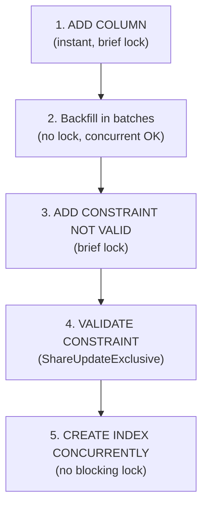

### 📶 Gradual Depth

**Level 1 - What it is:**
Zero-downtime migrations change database schema (adding columns, indexes, constraints) without blocking application queries. They use special PostgreSQL features like `CONCURRENTLY` and multi-step patterns.

**Level 2 - How to use it:**
Never run `ALTER TABLE ... ADD COLUMN ... DEFAULT ... NOT NULL` in one step on a large table. Instead: (1) `ADD COLUMN name TEXT;` (2) Backfill with batched UPDATE. (3) `ALTER TABLE ALTER COLUMN name SET DEFAULT 'value';` (4) `ALTER TABLE ALTER COLUMN name SET NOT NULL;`. Use `CREATE INDEX CONCURRENTLY` instead of `CREATE INDEX`.

**Level 3 - How it works:**
`CREATE INDEX CONCURRENTLY` works in two passes: first, it scans the table and builds the index while allowing concurrent DML; second, it scans for any rows changed during the first pass and adds them. This requires holding a weaker lock (ShareUpdateExclusiveLock) that allows normal DML but blocks DDL and VACUUM FULL. `ADD COLUMN` with a non-volatile default (PostgreSQL 11+) stores the default in `pg_attribute.attmissingval` rather than rewriting every row - existing rows return the default value on read, with no physical storage update.

**Level 4 - Production mastery:**
The most dangerous moment is the brief AccessExclusiveLock at the start of ALTER TABLE. Even though it lasts milliseconds for metadata-only changes, it must wait for all existing transactions to finish first. A long-running query (30-minute report) holds AccessShareLock, which blocks the ALTER, which blocks all subsequent queries behind it. Mitigation: set `lock_timeout = '3s'` on the migration session. If the ALTER cannot acquire the lock within 3 seconds, it fails fast and you retry. This prevents the DDL queue pile-up. Use `strong_migrations` (Rails), `django-safemigrate`, or `flyway` with custom validators to enforce safe patterns.

### ⚙️ How It Works

**Phase 1 - Metadata-only change:** `ALTER TABLE ADD COLUMN name TEXT;` adds a column with no default and no NOT NULL constraint. PostgreSQL modifies only the catalog (pg_attribute). No data pages are touched. AccessExclusiveLock held for milliseconds.

**Phase 2 - Batch backfill:** Application or migration script updates rows in batches:

```sql
UPDATE orders SET name = compute_name()
WHERE id >= 1 AND id < 10001;
COMMIT;
-- repeat for next 10000
```

Each batch holds RowExclusiveLock on updated rows for a short transaction. Concurrent queries continue.

**Phase 3 - Constraint addition:** `ALTER TABLE ADD CONSTRAINT chk_name CHECK (name IS NOT NULL) NOT VALID;` adds the constraint for new rows without scanning existing data. Brief AccessExclusiveLock.

**Phase 4 - Constraint validation:** `ALTER TABLE VALIDATE CONSTRAINT chk_name;` scans all existing rows with ShareUpdateExclusiveLock (concurrent DML allowed). Once validated, the constraint is enforced for both new and existing rows.

**Phase 5 - Index creation:** `CREATE INDEX CONCURRENTLY idx_orders_name ON orders(name);` builds the index without blocking reads or writes.

```
  Lock Duration Comparison
  Unsafe:
  ALTER TABLE ADD COLUMN x INT DEFAULT 0;
  Lock: AccessExclusive for HOURS (rewrite)

  Safe:
  ALTER TABLE ADD COLUMN x INT;  -- ms
  UPDATE ... WHERE id < 10000;   -- no DDL lock
  ALTER TABLE ALTER x SET DEFAULT 0; -- ms
  ALTER TABLE ALTER x SET NOT NULL;  -- ms
```

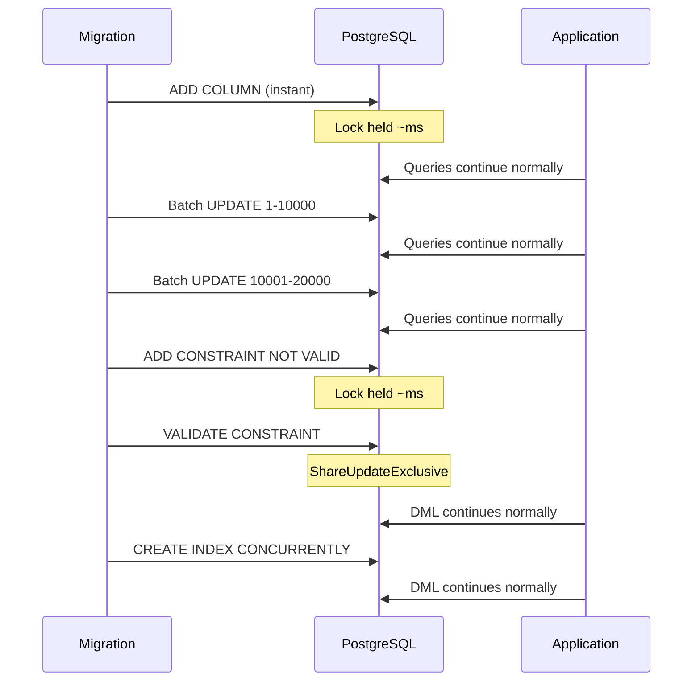

**BAD:**

```sql
ALTER TABLE orders
ADD COLUMN note TEXT NOT NULL
DEFAULT '';
-- AccessExclusiveLock for hours
```

**GOOD:**

```sql
ALTER TABLE orders
ADD COLUMN note TEXT;
UPDATE orders SET note = ''
WHERE id BETWEEN 1 AND 10000;
-- Batch; then NOT VALID + VALIDATE
```

### 🚨 Failure Modes

**Failure 1 - DDL queue pile-up:**
**Symptom:** Migration starts, application queries begin timing out, connection pool exhausts.
**Root cause:** ALTER TABLE waits for AccessExclusiveLock, blocked by a long-running query. All new queries queue behind the ALTER.
**Diagnostic:**

```sql
SELECT pid, query, state,
       wait_event_type, wait_event,
       now() - xact_start AS duration
FROM pg_stat_activity
WHERE wait_event = 'relation'
   OR state = 'active'
ORDER BY xact_start;
```

**Fix:** Set `lock_timeout = '3s'` before running the ALTER. If it times out, retry. Kill long-running queries blocking the ALTER if acceptable.

**Failure 2 - CREATE INDEX CONCURRENTLY fails and leaves invalid index:**
**Symptom:** `CREATE INDEX CONCURRENTLY` fails (e.g., uniqueness violation or cancellation). An invalid index remains in the catalog.
**Root cause:** During the two-pass index build, a concurrent DML operation caused a constraint violation, or the operation was canceled.
**Diagnostic:**

```sql
SELECT indexrelid::regclass,
       indisvalid
FROM pg_index
WHERE NOT indisvalid;
```

**Fix:** Drop the invalid index (`DROP INDEX CONCURRENTLY idx_name;`) and retry the creation after fixing the underlying data issue.

### 🔬 Production Reality

A common production pattern: a team needs to add a NOT NULL column with a default value to a 200 GB table. The naive approach (`ALTER TABLE ADD COLUMN x INT NOT NULL DEFAULT 0`) on PostgreSQL 10 rewrites the entire table while holding AccessExclusiveLock - the table is locked for 45 minutes. On PostgreSQL 11+, the same command is instant because the default is stored in the catalog. But adding NOT NULL requires scanning all existing rows. The safe pattern: add the column (instant), backfill in batches of 10,000 rows (10 minutes total, no lock), then set NOT NULL (instant if all rows are backfilled). Total downtime: zero. Total migration time: 15 minutes. The lesson: the migration strategy depends critically on the PostgreSQL version.

### ⚖️ Trade-offs & Alternatives

| Aspect             | Multi-step safe migration      | pg_repack (online rewrite) | gh-ost (MySQL)       | Direct ALTER (unsafe) |
| ------------------ | ------------------------------ | -------------------------- | -------------------- | --------------------- |
| Lock duration      | Milliseconds per step          | Brief (trigger swap)       | Trigger-based, brief | Minutes to hours      |
| Complexity         | High (multiple steps)          | Low (single command)       | Medium               | Low                   |
| Works for all DDL  | Most operations                | Table rewrite only         | Column add/modify    | All DDL               |
| Risk               | Low per step                   | Medium (trigger overhead)  | Medium               | High (downtime)       |
| PostgreSQL version | All (11+ for instant defaults) | All (extension required)   | MySQL only           | All                   |

### ⚡ Decision Snap

**USE WHEN:**

- Any production system where downtime is unacceptable during deployments
- Tables larger than 1 GB where ALTER TABLE would hold locks for minutes
- Continuous deployment pipelines requiring automated, safe migrations

**AVOID WHEN:**

- Development databases where locking is not a concern
- Small tables (< 100 MB) where ALTER TABLE completes in seconds

**PREFER direct ALTER WHEN:**

- PostgreSQL 11+ and adding a column with a non-volatile default (instant operation)
- Table is small enough that the lock duration is negligible (< 1 second)

### ⚠️ Top Traps

| #   | Misconception                                     | Reality                                                                                                                          |
| --- | ------------------------------------------------- | -------------------------------------------------------------------------------------------------------------------------------- |
| 1   | ADD COLUMN with DEFAULT always rewrites the table | PostgreSQL 11+ stores non-volatile defaults in the catalog without rewriting rows - it is instant                                |
| 2   | CREATE INDEX CONCURRENTLY is safe to run anytime  | It still holds ShareUpdateExclusiveLock and can fail, leaving an invalid index that must be dropped                              |
| 3   | lock_timeout prevents all lock problems           | lock_timeout only applies to the session that sets it; other sessions still queue behind the waiting DDL                         |
| 4   | NOT NULL can be added instantly                   | Adding NOT NULL requires scanning all rows to verify no NULLs exist; use CHECK constraint NOT VALID + VALIDATE as an alternative |
| 5   | Rolling back a failed migration is simple         | Some DDL operations (DROP COLUMN, type changes) cannot be rolled back after COMMIT; use transactional DDL and test migrations    |

### 🪜 Learning Ladder

**Prerequisites:**

- SQL-090 Row-Level vs Table-Level Locking - understand the lock modes DDL operations acquire
- SQL-075 Schema Migration Fundamentals - basic migration concepts and tooling
- SQL-076 Flyway and Liquibase - Migration Tooling - migration tools that can enforce safe patterns

**THIS:** SQL-104 Zero-Downtime Schema Migrations

**Next steps:**

- SQL-105 GitLab Database Incident (2017) - real-world case of migration-related data loss
- SQL-117 Database Version Migration Strategy at Scale - migration strategy for multi-service architectures
- SQL-089 VACUUM and Bloat Management (PostgreSQL) - migrations interact with VACUUM and table bloat

**The Surprising Truth:**
The most dangerous moment in a zero-downtime migration is not the ALTER TABLE itself - it is the brief AccessExclusiveLock acquisition at the start. Even though the lock is held for milliseconds, it must wait in the lock queue for all existing AccessShareLock holders to finish. If a 30-minute reporting query is running, the ALTER waits 30 minutes, and every new query queues behind it for those 30 minutes. The `lock_timeout` setting is the single most important safety mechanism for production DDL.

**Further Reading:**

- PostgreSQL Documentation: ALTER TABLE (postgresql.org/docs/current/sql-altertable.html)
- PostgreSQL Documentation: CREATE INDEX CONCURRENTLY (postgresql.org/docs/current/sql-createindex.html#SQL-CREATEINDEX-CONCURRENTLY)
- strong_migrations gem documentation (github.com/ankane/strong_migrations)

**Revision Card:**

1. Decompose schema changes into small, non-blocking steps: add column, backfill in batches, add constraint NOT VALID, validate
2. Always use CREATE INDEX CONCURRENTLY and set lock_timeout on DDL sessions
3. PostgreSQL 11+ makes ADD COLUMN WITH DEFAULT instant for non-volatile defaults - know your version's capabilities

---

---

# SQL-105 GitLab Database Incident (2017)

**TL;DR** - GitLab lost 6 hours of production data when a database deletion on the wrong server combined with untested backups, exposing how defense-in-depth failures cascade into irrecoverable data loss.

### 🔥 Problem Statement

On January 31, 2017, a GitLab engineer accidentally ran `rm -rf` on a PostgreSQL data directory - on the production primary instead of the intended staging replica. All five backup and recovery mechanisms (regular backups, LVM snapshots, WAL archiving, pg_dump, replication) had independently failed or were misconfigured. The result: 6 hours of production data permanently lost, affecting issues, merge requests, and user accounts. This incident is a canonical case study in why defense-in-depth requires verification of every layer, not just implementation.

### 📜 Historical Context

GitLab's infrastructure in 2017 ran on PostgreSQL 9.6 with a mix of self-managed and partially automated backup systems. The incident occurred during an on-call response to a database replication lag issue. The engineer was removing data from what they believed was a secondary server. The live-streamed recovery effort became one of the most publicly transparent database incident responses in the industry. GitLab published a detailed post-mortem documenting every failure, every recovery attempt, and every lesson learned.

### 🔩 First Principles

**CORE INVARIANTS:**

1. Backups do not exist until they have been restored successfully in a test environment
2. Defense-in-depth requires independent, verified layers - multiple failing backup systems provide zero protection
3. Human error on production systems is inevitable; the defense is automation and guardrails, not procedures

**DERIVED DESIGN:**
The incident revealed that each backup layer had an independent failure: pg_dump was not running (cron misconfigured), WAL archiving was not enabled (configuration oversight), LVM snapshots were not being taken (cloud provider limitation), replication was lagging (the problem being debugged), and the remaining backup was 6 hours old. No single failure was catastrophic - the combination was.

**THE TRADE-OFF:**
**Gain:** GitLab's public post-mortem created industry-wide awareness of backup verification as a critical practice.
**Cost:** 6 hours of production data permanently lost; significant customer trust impact; engineering team spent weeks on recovery and process improvements.

### 🧠 Mental Model

> Think of a building with five fire exits, each independently broken: one locked, one blocked by furniture, one alarm disabled, one leads to a dead end, one has a broken handle. Individually, each would be caught in an annual inspection. Together - in an actual fire - they create a fatal trap. The lesson is not "install more exits" but "test every exit regularly."

- "Five broken exits" -> five backup mechanisms, all independently failing
- "Annual inspection" -> backup restoration testing
- "Actual fire" -> production data deletion

**Where this analogy breaks down:** Database backup failures are silent - they do not produce visible symptoms until recovery is needed. Fire exits at least look visibly broken to anyone who tries them.

### 🧩 Components

- **pg_dump** - scheduled logical backup (was not running due to cron misconfiguration)
- **WAL archiving** - continuous WAL backup (was not enabled)
- **LVM snapshots** - filesystem-level snapshot (not available on the cloud provider)
- **Replication** - streaming replica (was lagging - the original problem being debugged)
- **Azure disk snapshot** - cloud provider snapshot (6 hours old, the only surviving backup)
- **rm -rf** - the accidental deletion command run on the wrong server

```
  Defense-in-Depth Failures
  Layer 1: pg_dump        -> FAILED (cron)
  Layer 2: WAL archiving  -> FAILED (not on)
  Layer 3: LVM snapshots  -> FAILED (no LVM)
  Layer 4: Replication    -> FAILED (lagging)
  Layer 5: Azure snapshot -> PARTIAL (6hr old)
  Result: 6 hours of data lost permanently
```

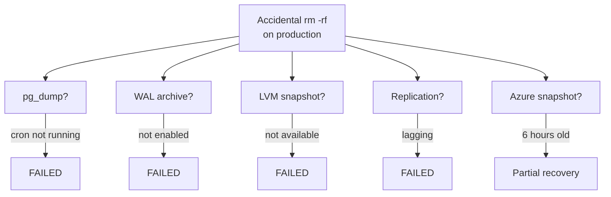

### 📶 Gradual Depth

**Level 1 - What it is:**
GitLab accidentally deleted their production database and discovered that none of their backup systems were working. They lost 6 hours of data because their only surviving backup was 6 hours old.

**Level 2 - How to use it:**
Treat this as a checklist: (1) Are your backups running? Check right now. (2) When did you last test a restore? If the answer is "never," schedule one this week. (3) Can an engineer accidentally run destructive commands on production? Add guardrails.

**Level 3 - How it works:**
The cascade: engineer investigates replication lag by examining the secondary. Due to confusing hostname conventions, the engineer runs `rm -rf /var/opt/gitlab/postgresql/data` on the production primary instead. The team discovers pg_dump has not been running. WAL archiving was never configured. LVM is not available. Replication was the problem being fixed. The Azure disk snapshot from 6 hours earlier is the only recovery option. 6 hours of data is unrecoverable.

**Level 4 - Production mastery:**
The post-mortem lessons are universal: (1) Automate backup verification with daily restore tests to a staging environment. (2) Monitor backup freshness with alerting (if the last successful backup is older than N hours, alert). (3) Use distinct hostname/prompt conventions that make production unmistakable (red prompt, distinct hostname pattern). (4) Implement "break glass" procedures requiring multiple approvals for destructive production operations. (5) Make backup status a first-class dashboard metric, not an afterthought.

### ⚙️ How It Works

**Phase 1 - The trigger:** An engineer responds to replication lag on a PostgreSQL secondary. While debugging, they need to wipe data on the secondary to re-sync from the primary.

**Phase 2 - The mistake:** Due to similar hostnames and multiple terminal windows, the engineer runs the deletion command on the production primary database server instead of the secondary.

**Phase 3 - The discovery:** The team realizes the mistake within minutes. They check each backup mechanism and discover each has independently failed. Panic sets in.

**Phase 4 - The recovery attempt:** The team locates a 6-hour-old Azure disk snapshot. They restore from it, losing all data written in the last 6 hours. The recovery takes multiple hours.

**Phase 5 - The post-mortem:** GitLab publishes a detailed, transparent post-mortem. They implement automated backup verification, monitoring, and production access controls.

```
  Incident Timeline (simplified)
  23:00 - Replication lag alert
  23:30 - Engineer investigates
  00:00 - rm -rf on WRONG server
  00:05 - Realize mistake
  00:10 - Check backups: all failed
  00:30 - Find 6hr-old Azure snapshot
  01:00 - Begin restore from snapshot
  06:00 - Restore complete, 6hr data lost
```

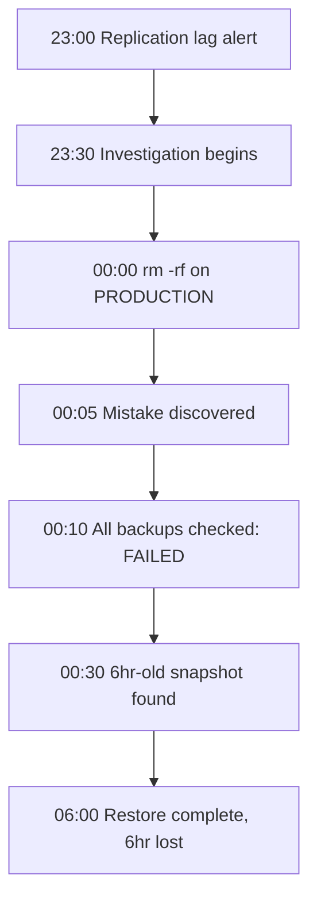

**BAD:**

```bash
ssh db1.internal
rm -rf /var/opt/gitlab/postgresql/data
# Oops - that was production
```

**GOOD:**

```bash
# Distinct prompts + safeguards
ssh prod-db1.gitlab.internal
# Requires peer approval for
# destructive operations
```

### 🚨 Failure Modes

**Failure 1 - Silent backup failure:**
**Symptom:** Backups appear configured but have not produced a valid backup in weeks. No alerts fire because backup monitoring was not implemented.
**Root cause:** Backup systems can fail silently: cron jobs stop, disk space runs out for dump files, archive_command fails without alerting.
**Diagnostic:**

```sql
-- Check last successful backup:
-- For WAL archiving:
SELECT last_archived_wal,
       last_archived_time,
       failed_count,
       last_failed_time
FROM pg_stat_archiver;
-- For pg_dump: check cron log / backup file timestamps
```

**Fix:** Implement backup monitoring that alerts when the last successful backup is older than the RPO target. Test restores automatically and daily.

**Failure 2 - Hostname confusion leading to wrong-server operations:**
**Symptom:** Destructive command run on production instead of staging/secondary.
**Root cause:** Similar hostnames (db1.gitlab.com vs db2.gitlab.com), multiple terminal windows, no visual distinction between production and non-production.
**Diagnostic:**

```
Review: terminal prompt format,
hostname conventions, SSH
configuration, and access controls.
```

**Fix:** Use distinct visual markers: red terminal prompts for production, green for staging. Implement tiered access controls: require MFA + approval for production destructive operations. Use configuration management to enforce prompt settings.

### 🔬 Production Reality

The GitLab incident's most important lesson is not about technology - it is about the gap between "we have backups" and "we have verified, working backups." Every layer of their backup strategy was "implemented" - pg_dump was configured, WAL archiving was planned, replication was set up. But none had been verified end-to-end. The industry pattern this exposed: organizations invest in backup infrastructure but not in backup verification. The fix is cultural: backup restoration testing must be a scheduled, automated, recurring event - not a hope and a prayer.

### ⚖️ Trade-offs & Alternatives

| Aspect              | Manual backup verification | Automated restore testing | Cloud-managed backups   | No verification  |
| ------------------- | -------------------------- | ------------------------- | ----------------------- | ---------------- |
| Confidence level    | Medium (human error)       | High (automated)          | Medium (vendor trust)   | Zero             |
| Cost                | Low (engineer time)        | Medium (infrastructure)   | Included in service     | Zero             |
| Frequency           | Monthly (realistic)        | Daily (automated)         | Per provider SLA        | Never            |
| Detection speed     | Days to weeks              | Hours                     | Per provider monitoring | At disaster time |
| Recovery confidence | Some                       | High                      | Medium                  | Unknown          |

### ⚡ Decision Snap

**USE WHEN:**

- Every production database deployment: verify backups regularly
- Onboarding new team members: use as a case study for production safety
- Designing backup strategies: ensure each layer is independently verified

**AVOID WHEN:**

- Do not dismiss this as "it cannot happen here" - the pattern is universal
- Do not assume cloud-managed backups eliminate the need for verification

**PREFER automated restore testing WHEN:**

- RPO requirements are strict (< 1 hour)
- The team cannot reliably perform manual testing monthly
- Compliance requires demonstrable backup verification

### ⚠️ Top Traps

| #   | Misconception                                    | Reality                                                                                                            |
| --- | ------------------------------------------------ | ------------------------------------------------------------------------------------------------------------------ |
| 1   | Having backup configuration means having backups | Configuration without verification is hope, not a backup strategy                                                  |
| 2   | Multiple backup layers guarantee safety          | Multiple independently failing layers provide zero protection - each must be verified independently                |
| 3   | This level of failure is rare                    | Silent backup failures are common; most teams discover them only during incidents                                  |
| 4   | Cloud providers handle backups automatically     | Cloud-managed backups still require verification of RPO, RTO, and restore procedures                               |
| 5   | The engineer who made the mistake was negligent  | The system allowed a single unverified command to destroy production data; the failure is systemic, not individual |

### 🪜 Learning Ladder

**Prerequisites:**

- SQL-103 Backup and Point-in-Time Recovery (PITR) - understand the backup mechanisms that failed
- SQL-100 Logical Replication and Physical Replication - understand the replication that was lagging

**THIS:** SQL-105 GitLab Database Incident (2017)

**Next steps:**

- SQL-106 GitHub MySQL Failover Incident (2018) - another real-world incident with different failure patterns
- SQL-104 Zero-Downtime Schema Migrations - operational practices that reduce incident risk
- SQL-121 Observability for Database Fleets - monitoring that catches silent failures

**The Surprising Truth:**
GitLab's incident response was live-streamed on YouTube and their post-mortem was published with complete transparency. This radical openness did not damage their reputation - it strengthened it. The industry learned more from GitLab's honest post-mortem than from a hundred "best practices" blog posts. The lesson: transparency about failures builds trust; hiding them destroys it.

**Further Reading:**

- GitLab Post-Mortem: "GitLab.com Database Incident" (about.gitlab.com/blog/2017/02/10/postmortem-of-database-outage-of-january-31/)
- GitLab Blog: Postmortem Methodology (about.gitlab.com/handbook/engineering/infrastructure/incident-management/)
- PostgreSQL Documentation: Continuous Archiving and PITR (postgresql.org/docs/current/continuous-archiving.html)

**Revision Card:**

1. Five backup layers independently failed: pg_dump, WAL archiving, LVM, replication, and snapshots
2. Untested backups are not backups - automate daily restore verification
3. Production safety is systemic: hostname conventions, access controls, and automation prevent human error

---

---

# SQL-106 GitHub MySQL Failover Incident (2018)

**TL;DR** - GitHub's 2018 outage lasted 24+ hours because an automated failover promoted a replica with stale data, and re-synchronizing divergent clusters required manual orchestration that no runbook covered.

### 🔥 Problem Statement

On October 21, 2018, a routine maintenance event triggered a network partition between GitHub's primary MySQL database and its replicas. The automated failover system (Orchestrator) promoted a replica to primary. However, the promoted replica had not received all writes from the old primary, creating a "split-brain" scenario where two clusters contained divergent data. Reconciling the divergent datasets while maintaining data integrity took over 24 hours. The incident demonstrated that automated failover - while essential - introduces data consistency risks that are difficult to resolve without manual intervention.

### 📜 Historical Context

GitHub ran one of the largest MySQL deployments in the world, using MySQL with Orchestrator for automated failover. Orchestrator detects primary failures and promotes the most up-to-date replica. Semi-synchronous replication was in use, providing stronger (but not absolute) durability guarantees. The 2018 incident occurred during a period of network instability between data centers. The challenge was not the failover itself but the aftermath: reconciling writes that existed on the old primary but not on the new primary, across hundreds of database clusters.

### 🔩 First Principles

**CORE INVARIANTS:**

1. Asynchronous (and semi-synchronous) replication can lose committed transactions during failover because replicas may lag behind the primary
2. Split-brain occurs when two nodes accept writes independently after a network partition - reconciling divergent state requires application-specific logic
3. Automated failover optimizes for availability over consistency; recovering consistency after failover is a separate, often manual process

**DERIVED DESIGN:**
GitHub's Orchestrator correctly detected the primary failure and promoted a replica. But the promoted replica was missing some recent writes from the old primary. When the old primary came back online, its extra writes conflicted with new writes on the promoted primary. Reconciliation required: identifying divergent transactions, determining which version was correct, and replaying or discarding transactions - a process that could not be fully automated.

**THE TRADE-OFF:**
**Gain:** Automated failover minimizes downtime during primary failures (minutes vs hours of manual intervention).
**Cost:** Risk of data divergence; reconciliation requires manual effort; the failover system must choose between availability and strict consistency (CAP theorem in practice).

### 🧠 Mental Model

> Two accountants share a ledger book via courier. When the courier service breaks (network partition), both accountants continue recording transactions in their own copies. When the courier resumes, the two ledgers have divergent entries. Merging them requires examining each entry and deciding which version is correct - a process that cannot be automated without understanding the business context.

- "Courier service" -> replication connection between primary and replica
- "Both recording independently" -> split-brain writes on old and new primary
- "Merging ledgers" -> reconciliation of divergent data

**Where this analogy breaks down:** In databases, some divergent writes may be irreconcilable (e.g., two different users assigned the same unique ID), requiring application-level resolution.

### 🧩 Components

- **MySQL primary** - accepts all writes, replicates to secondaries
- **Orchestrator** - automated failover tool detecting primary failure and promoting replicas
- **Semi-synchronous replication** - primary waits for at least one replica to acknowledge WAL before confirming commit
- **Network partition** - loss of connectivity between primary and replicas
- **Split-brain** - condition where two nodes accept writes independently
- **GTID (Global Transaction ID)** - MySQL feature tracking transactions for replication positioning

```
  Failover Sequence
  1. Primary-Replica connected (normal)
  2. Network partition splits them
  3. Orchestrator promotes Replica
  4. Old Primary reconnects
  5. Divergent writes discovered
  6. Manual reconciliation (24+ hours)
```

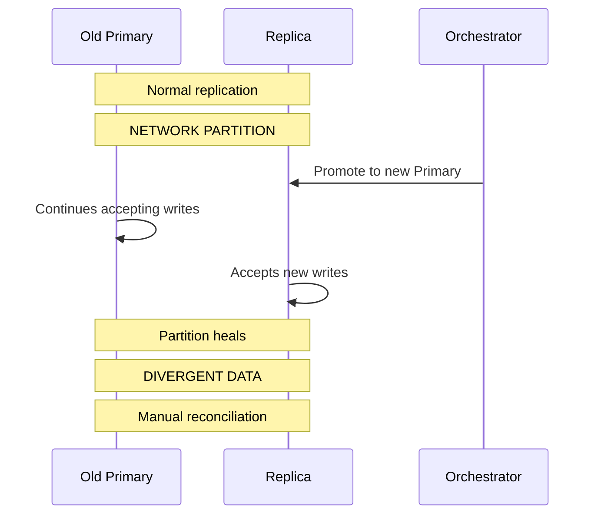

### 📶 Gradual Depth

**Level 1 - What it is:**
GitHub's database automatically switched to a backup when the main server became unreachable. But the backup was slightly behind, and when the main server came back, their data did not match. Fixing this took over 24 hours.

**Level 2 - How to use it:**
Understand that automated failover trades consistency for availability. After any failover, verify data consistency between old and new primaries. Have runbooks for reconciliation - not just for failover.

**Level 3 - How it works:**
Semi-synchronous replication guarantees that at least one replica has received each transaction before the primary acknowledges the commit. But "received" does not mean "applied" - during a network partition, the replica may not have received the last few transactions. When Orchestrator promotes the replica, those transactions are lost. The old primary may have already acknowledged those commits to clients, creating a data integrity issue: clients believe their writes succeeded, but the new primary does not have them.

**Level 4 - Production mastery:**
The key lesson is that failover and recovery are two separate problems. Failover can be automated; recovery (reconciliation of divergent data) often cannot. Production preparedness requires: (1) Monitoring replication lag before and during failover. (2) Capturing the old primary's binary logs for post-failover analysis. (3) Having tooling to compare and reconcile rows between old and new primaries. (4) Deciding in advance whether the business prioritizes availability (accept some data loss) or consistency (delay failover until replica is fully caught up).

### ⚙️ How It Works

**Phase 1 - Normal operation:** GitHub's MySQL primary replicates to multiple secondaries via semi-synchronous replication. Orchestrator monitors heartbeat and replication health.

**Phase 2 - Network partition:** Connectivity between the primary and its replicas is disrupted. The primary cannot reach any replica to confirm semi-synchronous acknowledgment.

**Phase 3 - Automated failover:** Orchestrator detects the primary as unreachable after a timeout. It promotes the most up-to-date replica to become the new primary. Applications are redirected to the new primary.

**Phase 4 - Partition heals:** The old primary becomes reachable again. It has transactions that the new primary does not (committed after the last replicated position). The new primary has transactions the old primary does not (committed after promotion).

**Phase 5 - Reconciliation:** Engineers identify divergent transactions using binary log analysis. For each divergent write, they determine the correct state and apply corrections. This process took over 24 hours due to the volume and complexity of divergent data.

```
  Data Divergence
  Old Primary:  TX 1000, 1001, 1002, 1003
  New Primary:  TX 1000, 1001, [1004, 1005]
  Lost: TX 1002, 1003 (on old, not new)
  New: TX 1004, 1005 (on new, not old)
  Reconcile: replay 1002,1003 if compatible
             with 1004,1005
```

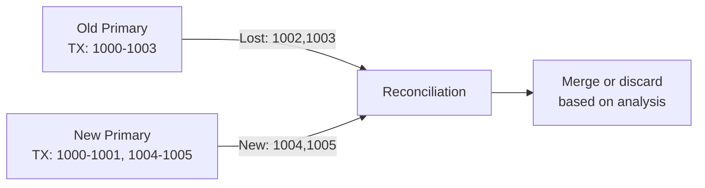

**BAD:**

```
-- Assume failover = zero data loss
-- Semi-sync falls back to async
-- during network partition
-- Lost commits on promote
```

**GOOD:**

```
-- Plan for reconciliation
-- Monitor replication lag always
-- Capture old primary binlogs
-- Test failover + recovery quarterly
```

### 🚨 Failure Modes

**Failure 1 - Promoted replica missing committed transactions:**
**Symptom:** After failover, application data inconsistencies appear. Users report missing recent actions (issues, comments, commits).
**Root cause:** The promoted replica had not received the last N transactions from the old primary before the partition.
**Diagnostic:**

```
Compare GTID sets between old and new
primary's binary logs to identify
divergent transactions.
```

**Fix:** Capture old primary's binary logs. Replay missing transactions onto the new primary after verifying compatibility. For conflicting transactions, apply application-specific resolution.

**Failure 2 - Cascading failures from extended outage:**
**Symptom:** The 24-hour reconciliation caused cascading issues: webhook delivery queues grew, CI/CD pipelines stalled, dependent services degraded.
**Root cause:** The database inconsistency required the team to put some services into read-only mode during reconciliation, causing upstream and downstream service disruptions.
**Diagnostic:**

```
Monitor dependent service health
during recovery. Track queue depths,
error rates, and SLO violations.
```

**Fix:** Design services to tolerate database read-only periods gracefully (queue writes, display degraded-mode UI). Practice failover and reconciliation procedures regularly.

### 🔬 Production Reality

The GitHub incident's deepest lesson: the 43-second network partition was resolved quickly, but the data reconciliation took over 24 hours. The ratio - seconds of trigger to hours of recovery - illustrates that failover automation solves only the easy part of the problem. The hard part - understanding which data is correct when two sources disagree - requires human judgment, application-specific logic, and tooling that most teams have never built or tested. The incident prompted GitHub to invest in improved replication monitoring, faster reconciliation tooling, and regular "game day" exercises simulating failover scenarios.

### ⚖️ Trade-offs & Alternatives

| Aspect                | Automated failover (Orchestrator) | Manual failover       | Synchronous replication | Consensus-based (Raft/Paxos) |
| --------------------- | --------------------------------- | --------------------- | ----------------------- | ---------------------------- |
| RTO                   | Seconds to minutes                | Minutes to hours      | Seconds (no data loss)  | Seconds (no data loss)       |
| Data loss risk        | Possible (async lag)              | Operator-controlled   | None                    | None                         |
| Complexity            | Medium                            | Low                   | High (latency cost)     | Very high                    |
| Split-brain risk      | Yes                               | Low (human validates) | No                      | No                           |
| PostgreSQL equivalent | Patroni                           | Manual pg_ctl promote | synchronous_commit      | N/A (external systems)       |

### ⚡ Decision Snap

**USE WHEN:**

- Studying failover planning and the gap between failover and recovery
- Designing reconciliation tooling for post-failover scenarios
- Evaluating automated vs manual failover trade-offs

**AVOID WHEN:**

- Do not assume automated failover eliminates data loss risk
- Do not implement failover without reconciliation procedures

**PREFER synchronous replication WHEN:**

- Zero data loss is a hard requirement (financial systems, regulatory compliance)
- Write latency increase is acceptable (synchronous commit adds network round-trip)

### ⚠️ Top Traps

| #   | Misconception                                        | Reality                                                                                                                 |
| --- | ---------------------------------------------------- | ----------------------------------------------------------------------------------------------------------------------- |
| 1   | Automated failover means zero data loss              | Async and semi-sync replication can lose committed transactions during failover                                         |
| 2   | Failover is the hard part of HA                      | Failover can be automated in seconds; reconciliation after failover is the hard part and often takes hours              |
| 3   | Semi-synchronous replication guarantees no data loss | Semi-sync guarantees the replica received the transaction; it does not guarantee the replica applied it before failover |
| 4   | Split-brain is a theoretical concern                 | GitHub's incident proved split-brain occurs in production with real consequences                                        |
| 5   | One failover test proves readiness                   | Network partitions vary in duration, timing, and affected components; regular, varied testing is required               |

### 🪜 Learning Ladder

**Prerequisites:**

- SQL-100 Logical Replication and Physical Replication - understand replication mechanisms that underpin failover
- SQL-101 Read Replicas - Scaling Reads - understand replica lag and its implications

**THIS:** SQL-106 GitHub MySQL Failover Incident (2018)

**Next steps:**

- SQL-105 GitLab Database Incident (2017) - complementary incident focused on backup failures
- SQL-113 Sharding Strategies - Application vs Proxy - scaling patterns that introduce more failover complexity
- SQL-114 Multi-Database Topology Design - designing topologies resilient to partition and failover

**The Surprising Truth:**
The GitHub incident demonstrated that semi-synchronous replication - widely considered "good enough" for durability - can still lose committed transactions during a network partition. The "semi" in semi-synchronous means the primary waits for ONE replica to acknowledge receipt, but if no replica is reachable, it can fall back to asynchronous mode. This fallback is the gap through which committed transactions are lost.

**Further Reading:**

- GitHub Engineering Blog: "October 21 post-incident analysis" (github.blog/2018-10-30-oct21-post-incident-analysis/)
- GitHub Engineering Blog: Orchestrator at GitHub (github.blog/engineering/)
- Kleppmann, M. "Designing Data-Intensive Applications" - Chapter 9: Consistency and Consensus (O'Reilly, 2017)

**Revision Card:**

1. Automated failover promotes a replica that may be missing recent commits - failover is fast, reconciliation is slow
2. Semi-synchronous replication can fall back to async under network partitions, creating a data loss window
3. Failover testing must include the reconciliation phase, not just the promotion step

---

---

# SQL-107 Unindexed Foreign Key Anti-Pattern

**TL;DR** - Foreign keys without indexes on the referencing column cause full table scans during parent row updates and deletes, creating severe lock contention and performance degradation at scale.

### 🔥 Problem Statement

When a parent row is updated or deleted, PostgreSQL must verify that no child rows reference it (referential integrity check). Without an index on the foreign key column in the child table, this check requires a sequential scan of the entire child table while holding a lock on the parent row. At production scale - parent table with millions of rows, child table with hundreds of millions of rows - a single parent row update triggers a full scan of the child table, blocking concurrent operations and causing cascading latency. This is one of the most common and most damaging PostgreSQL performance anti-patterns.

### 📜 Historical Context

PostgreSQL does not automatically create indexes on foreign key columns (unlike MySQL/InnoDB, which requires an index on every foreign key). This is a deliberate design choice: not every foreign key needs an index for query performance, and unnecessary indexes waste storage and slow writes. However, this means developers must manually create indexes on foreign key columns when referential integrity checks or join performance require it. The anti-pattern is so common that `pg_stat_user_tables.seq_scan` on large child tables is often the first diagnostic clue.

### 🔩 First Principles

**CORE INVARIANTS:**

1. DELETE or UPDATE on a parent row requires checking all rows in the child table for references to the affected key
2. Without an index on the child's FK column, this check is a sequential scan of the entire child table
3. The referential integrity check holds a lock on the parent row for the duration of the child table scan

**DERIVED DESIGN:**
An index on the foreign key column in the child table converts the referential integrity check from O(N) sequential scan to O(logN) index lookup. This is the difference between scanning 100 million rows (seconds to minutes) and looking up a few index entries (microseconds). The index also benefits JOIN queries using the foreign key.

**THE TRADE-OFF:**
**Gain:** Referential integrity checks become O(logN) instead of O(N); parent updates/deletes are fast; join queries on FK columns benefit.
**Cost:** Index storage space; index maintenance overhead on child table INSERT/UPDATE/DELETE; potential over-indexing if the FK is never queried.

### 🧠 Mental Model

> Imagine a school directory (parent table: classes) and student roster (child table: students, FK: class_id). When a class is canceled (DELETE class), the school must check if any students are enrolled. Without an index (alphabetical roster sorted by class), the school checks every student in every class. With an index (a list sorted by class_id), the school looks up the specific class instantly.

- "Checking every student" -> sequential scan of child table
- "List sorted by class_id" -> index on foreign key column
- "Canceling a class" -> DELETE FROM parent table

**Where this analogy breaks down:** In PostgreSQL, the sequential scan for the FK check also acquires a ShareLock on the child table, blocking concurrent DDL, which the school analogy does not capture.

### 🧩 Components

- **Foreign key constraint** - defined on the child table referencing the parent's primary key
- **Referential integrity check** - triggered by parent UPDATE/DELETE to verify no orphan children
- **RI trigger** - PostgreSQL internal trigger that runs the FK check on parent modification
- **Sequential scan** - full table scan of the child table when no FK index exists
- **Index on FK column** - B-tree index on the child table's FK column enabling fast lookup

```
  Without FK Index           With FK Index
  DELETE FROM parents        DELETE FROM parents
  WHERE id = 42;             WHERE id = 42;
       |                          |
       v                          v
  Check children table:      Check children index:
  Seq Scan 100M rows         Index Scan ~3 rows
  (30 seconds)               (0.1 ms)
```

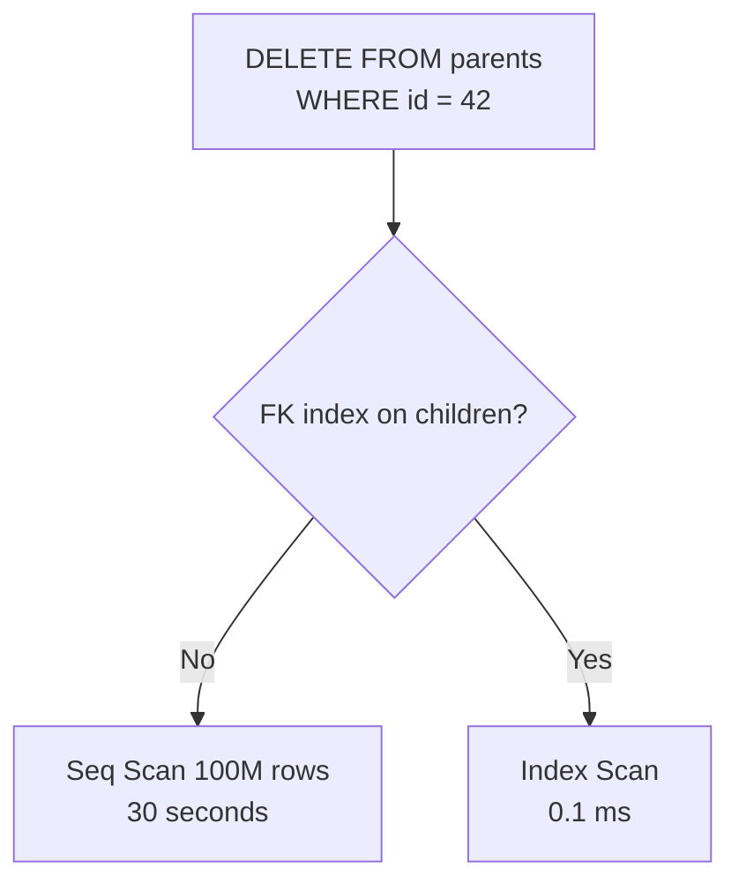

### 📶 Gradual Depth

**Level 1 - What it is:**
When you delete or update a parent row, PostgreSQL checks the child table for references. Without an index on the child's foreign key column, this check scans the entire child table - which can be very slow on large tables.

**Level 2 - How to use it:**
Always create an index on foreign key columns in child tables: `CREATE INDEX idx_orders_customer_id ON orders(customer_id);`. Check for missing FK indexes with a query against pg_constraint and pg_index.

**Level 3 - How it works:**
PostgreSQL implements foreign key constraints via internal triggers (RI triggers). When a parent row is modified, the trigger executes a query against the child table: `SELECT 1 FROM child WHERE fk_col = $1`. Without an index, this is a sequential scan. The trigger holds a row-level lock on the parent row for the duration of the check. If the child table has 100M rows, the sequential scan can take 30+ seconds, during which the parent row is locked.

**Level 4 - Production mastery:**
Detecting unindexed FKs:

```sql
SELECT c.conrelid::regclass AS child,
       c.conname AS constraint,
       a.attname AS fk_column
FROM pg_constraint c
JOIN pg_attribute a
  ON a.attrelid = c.conrelid
  AND a.attnum = ANY(c.conkey)
WHERE c.contype = 'f'
  AND NOT EXISTS (
    SELECT 1 FROM pg_index i
    WHERE i.indrelid = c.conrelid
      AND a.attnum = ANY(i.indkey)
  );
```

This query finds all foreign key columns that lack a supporting index. Run it regularly as a health check.

### ⚙️ How It Works

**Phase 1 - Parent modification:** An application executes `DELETE FROM customers WHERE id = 42;` or `UPDATE customers SET id = 43 WHERE id = 42;`.

**Phase 2 - RI trigger fires:** PostgreSQL's internal RI trigger on the `orders` table (child) fires. It needs to verify no rows in `orders` have `customer_id = 42`.

**Phase 3 - Child table lookup:** Without an index on `orders.customer_id`, the trigger executes a sequential scan: read every row in `orders` checking `customer_id = 42`. With an index, it performs a B-tree lookup.

**Phase 4 - Lock holding:** The parent row (`customers` row with id=42) remains locked until the child table check completes. If the scan takes 30 seconds, all concurrent transactions wanting to modify this parent row wait 30 seconds.

```
  BAD: No index on orders.customer_id
  DELETE FROM customers WHERE id = 42;
  -> RI trigger: Seq Scan on orders
  -> Scans 100,000,000 rows
  -> Lock held for 30 seconds
  -> Concurrent deletes on customers
     blocked for 30 seconds each

  GOOD: Index on orders.customer_id
  DELETE FROM customers WHERE id = 42;
  -> RI trigger: Index Scan on orders
  -> Reads 3 index entries
  -> Lock held for < 1 ms
```

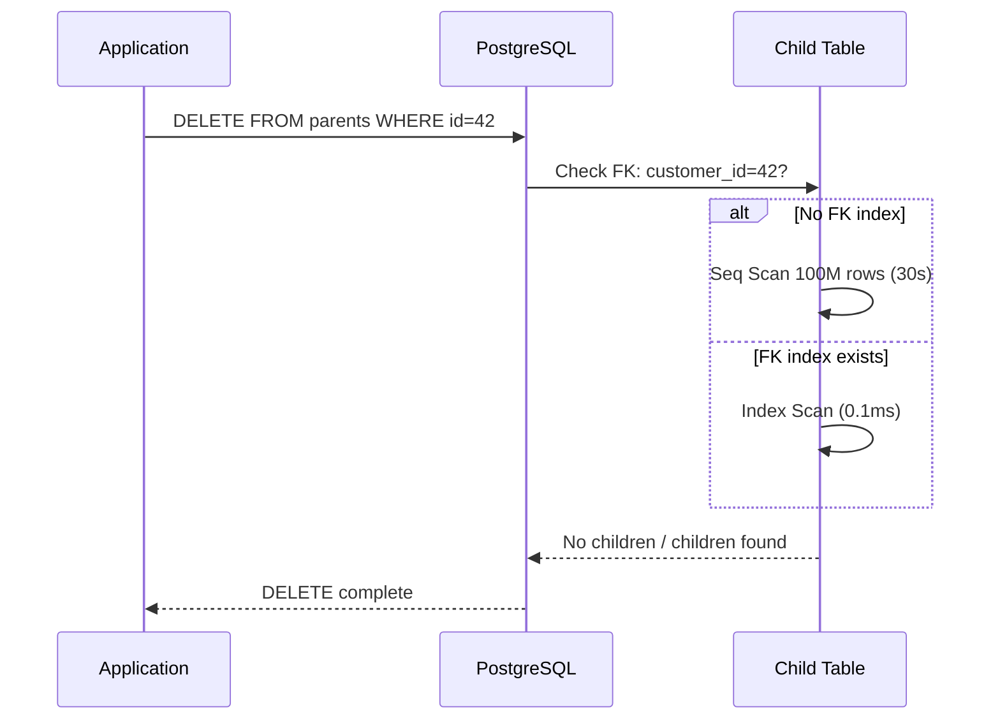

**BAD:**

```sql
CREATE TABLE orders (
  id SERIAL PRIMARY KEY,
  customer_id INT
    REFERENCES customers
);  -- no FK index!
-- DELETE parent: full table scan
```

**GOOD:**

```sql
CREATE TABLE orders (
  id SERIAL PRIMARY KEY,
  customer_id INT
    REFERENCES customers
);
CREATE INDEX idx_orders_cust
  ON orders(customer_id);
```

### 🚨 Failure Modes

**Failure 1 - Cascading lock contention on parent table:**
**Symptom:** Deleting or updating rows in the parent table takes seconds instead of milliseconds. Concurrent operations on the parent table queue up. Connection pool starts to exhaust.
**Root cause:** Each parent row modification triggers a full sequential scan of the child table, holding the parent row lock for the scan duration.
**Diagnostic:**

```sql
-- Find slow FK checks:
SELECT schemaname, relname,
       seq_scan, seq_tup_read,
       idx_scan, idx_tup_fetch
FROM pg_stat_user_tables
WHERE seq_scan > 1000
  AND seq_tup_read / nullif(seq_scan, 0)
      > 100000
ORDER BY seq_tup_read DESC;
```

**Fix:** Create an index on the foreign key column: `CREATE INDEX CONCURRENTLY idx_orders_customer_id ON orders(customer_id);`.

**Failure 2 - Autovacuum blocked by long FK checks:**
**Symptom:** Parent table bloat increases because autovacuum cannot acquire the necessary lock while long FK checks hold locks.
**Root cause:** The sequential scan FK check holds locks that conflict with autovacuum's ShareUpdateExclusiveLock.
**Diagnostic:**

```sql
SELECT relname, n_dead_tup,
       last_autovacuum
FROM pg_stat_user_tables
WHERE relname = 'customers';
```

**Fix:** Add the FK index to eliminate long-running FK checks. The reduced lock duration allows autovacuum to proceed.

### 🔬 Production Reality

A common pattern: a multi-tenant SaaS application with a `tenants` table (10,000 rows) and an `events` table (500 million rows, FK: tenant_id). When a tenant is deactivated (soft delete on `tenants`), the application updates the tenant row. The RI trigger scans 500 million rows in `events` to verify the FK. This 2-minute scan locks the tenant row, blocking all concurrent tenant operations. Adding `CREATE INDEX CONCURRENTLY ON events(tenant_id)` reduces the FK check from 2 minutes to milliseconds. The lesson: FK indexes are not optional on child tables with more than a few thousand rows.

### ⚖️ Trade-offs & Alternatives

| Aspect                 | Index on FK column            | No index (anti-pattern) | DROP FK constraint | MySQL/InnoDB     |
| ---------------------- | ----------------------------- | ----------------------- | ------------------ | ---------------- |
| FK check speed         | O(logN)                       | O(N)                    | N/A (no check)     | O(logN) required |
| Index maintenance cost | INSERT/UPDATE/DELETE overhead | Zero                    | Zero               | Same             |
| Storage                | Index size (~20-30% of table) | Zero                    | Zero               | Mandatory        |
| Data integrity         | Guaranteed                    | Guaranteed (but slow)   | Not enforced       | Guaranteed       |
| PostgreSQL default     | Manual creation needed        | Automatic (no index)    | Manual drop        | Auto-created     |

### ⚡ Decision Snap

**USE WHEN:**

- Always create an index on FK columns when the child table has more than a few thousand rows
- Parent table rows are updated or deleted in normal operations
- JOIN queries use the FK column (the index benefits query performance too)

**AVOID WHEN:**

- Child table is tiny (< 1000 rows) and FK checks are instantaneous
- The FK relationship is append-only (parent rows are never updated or deleted)

**PREFER dropping the FK constraint WHEN:**

- Referential integrity is enforced at the application level and the FK check overhead is unacceptable
- The parent table is never modified (reference data that changes only via migration)

### ⚠️ Top Traps

| #   | Misconception                                 | Reality                                                                                                                     |
| --- | --------------------------------------------- | --------------------------------------------------------------------------------------------------------------------------- |
| 1   | PostgreSQL creates FK indexes automatically   | PostgreSQL does not create indexes on FK columns; MySQL/InnoDB does. This is the most common source of this anti-pattern    |
| 2   | FK indexes only help JOIN queries             | FK indexes also accelerate the referential integrity check triggered by parent UPDATE/DELETE                                |
| 3   | The problem only appears with CASCADE deletes | Any modification to the parent's referenced column triggers the FK check, including plain UPDATE and DELETE without CASCADE |
| 4   | Small parent tables are safe                  | The scan happens on the CHILD table, not the parent. A small parent table with a huge child table has the problem           |
| 5   | Only DELETE triggers FK checks                | UPDATE on the parent's primary key also triggers FK checks on all referencing child tables                                  |

### 🪜 Learning Ladder

**Prerequisites:**

- SQL-017 Foreign Keys and Relationships - understand what FK constraints enforce
- SQL-040 Indexes - What They Are and Why They Matter - understand how indexes accelerate lookups
- SQL-090 Row-Level vs Table-Level Locking - understand the lock implications of long FK checks

**THIS:** SQL-107 Unindexed Foreign Key Anti-Pattern

**Next steps:**

- SQL-064 Query Performance Tuning Patterns - systematic approach to finding and fixing performance issues
- SQL-062 Composite Indexes and Column Order - optimize FK indexes for multi-column foreign keys
- SQL-089 VACUUM and Bloat Management (PostgreSQL) - unindexed FK checks block VACUUM

**The Surprising Truth:**
This anti-pattern is so common that it is likely the single most frequent cause of unexplained PostgreSQL performance degradation in applications with foreign keys. A query to detect unindexed foreign keys (comparing pg_constraint against pg_index) should be part of every PostgreSQL deployment's health check script - it typically finds 2-5 missing indexes in established applications.

**Further Reading:**

- PostgreSQL Documentation: Foreign Keys (postgresql.org/docs/current/ddl-constraints.html#DDL-CONSTRAINTS-FK)
- PostgreSQL Wiki: Performance Optimization, Indexes on Foreign Keys (wiki.postgresql.org/wiki/Performance_Optimization)
- PostgreSQL Documentation: pg_constraint catalog (postgresql.org/docs/current/catalog-pg-constraint.html)

**Revision Card:**

1. PostgreSQL does not auto-create indexes on FK columns; without them, parent UPDATE/DELETE triggers full child table scans
2. The FK check scans the CHILD table, not the parent - a small parent with a huge child is the worst case
3. Run the unindexed FK detection query as a regular health check; it is the most common hidden performance problem

---

---

# SQL-108 OFFSET Pagination at Scale Anti-Pattern

**TL;DR** - OFFSET pagination scans and discards N rows before returning results, making deep pages linearly slower; keyset pagination via WHERE + ORDER BY scales consistently.

### 🔥 Problem Statement

The classic pagination pattern `SELECT * FROM items ORDER BY id LIMIT 20 OFFSET 10000` requires PostgreSQL to sort and scan 10,020 rows, discard the first 10,000, and return 20. For page 500 of 20-item pages, the database scans 10,000 rows. For page 50,000, it scans 1,000,000 rows. At production scale with millions of rows, deep pagination grinds to a halt: response times grow linearly with page depth, buffer pool is polluted with rows that are immediately discarded, and CPU time is wasted on sorting data that is thrown away.

### 📜 Historical Context

OFFSET-based pagination became the default pattern in web applications because SQL standards included OFFSET/LIMIT (or FETCH FIRST N ROWS), and ORMs generated it by default. The performance problem was documented as early as the 2000s, but the simplicity of OFFSET pagination meant it persisted. The alternative - keyset (cursor-based) pagination - was popularized by API design guides from Slack, Stripe, and Twitter in the 2010s. Modern API specifications (JSON:API, GraphQL Connections) explicitly recommend cursor-based pagination.

### 🔩 First Principles

**CORE INVARIANTS:**

1. OFFSET N requires scanning (OFFSET + LIMIT) rows even though only LIMIT rows are returned
2. Keyset pagination uses a WHERE clause on the last-seen value, enabling the database to seek directly to the starting point via index
3. For OFFSET, cost grows linearly with page depth; for keyset, cost is constant regardless of page depth

**DERIVED DESIGN:**
Keyset pagination replaces `OFFSET N` with `WHERE id > last_seen_id ORDER BY id LIMIT 20`. If an index exists on `id`, the database seeks directly to `last_seen_id` in the B-tree and reads the next 20 entries. The cost is identical whether the user is on page 1 or page 50,000. The trade-off is that keyset pagination does not support "jump to page N" - it only supports "next page" and "previous page."

**THE TRADE-OFF:**
**Gain:** Constant-time pagination regardless of depth; efficient index usage; no wasted row scanning.
**Cost:** No "jump to page N" capability; more complex API design (pass cursor, not page number); cursor must be based on a unique, ordered column.

### 🧠 Mental Model

> OFFSET pagination is like reading a book by counting pages from the beginning every time. To read page 500, you flip through 499 pages. To read page 501, you flip through 500 pages. Keyset pagination is using a bookmark: to read the next page, you open the book at the bookmark and read forward. The bookmark approach takes the same time regardless of which page you are on.

- "Counting pages from the start" -> OFFSET scanning rows from the beginning
- "Using a bookmark" -> WHERE id > last_seen_id (keyset)
- "Same time for any page" -> constant-cost keyset pagination

**Where this analogy breaks down:** Keyset pagination requires a "bookmark" (last-seen value) that the client must track and pass back. OFFSET pagination only requires a page number, which is simpler for the client.

### 🧩 Components

- **OFFSET N** - SQL clause skipping the first N rows of the result
- **LIMIT M** - SQL clause returning only M rows
- **Keyset (cursor) pagination** - WHERE clause filtering on the last-seen sort value
- **Covering index** - index containing all columns needed by the query, enabling index-only scans for pagination
- **Deferred join** - technique where OFFSET is applied to a subquery returning only IDs, then joined with the full table

```
  Performance at Different Page Depths
  OFFSET:
  Page 1:    scan 20 rows       ~1ms
  Page 100:  scan 2000 rows     ~10ms
  Page 10K:  scan 200,000 rows  ~500ms
  Page 100K: scan 2,000,000 rows ~5s

  Keyset:
  Page 1:    index seek + 20    ~1ms
  Page 100:  index seek + 20    ~1ms
  Page 10K:  index seek + 20    ~1ms
  Page 100K: index seek + 20    ~1ms
```

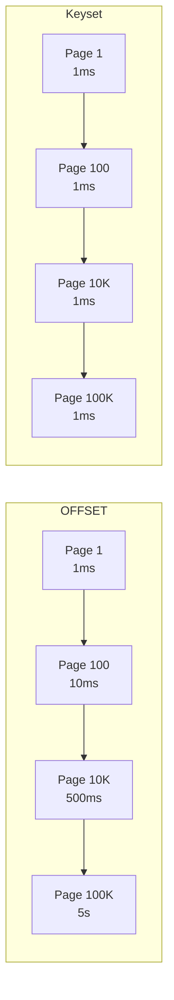

### 📶 Gradual Depth

**Level 1 - What it is:**
OFFSET pagination gets slower as you go deeper into the results because the database counts through all the earlier rows. Keyset pagination is always fast because it jumps directly to where you left off.

**Level 2 - How to use it:**
Replace `SELECT * FROM items ORDER BY id LIMIT 20 OFFSET 200` with `SELECT * FROM items WHERE id > 210 ORDER BY id LIMIT 20` (where 210 is the last ID from the previous page). The client passes the last-seen ID instead of a page number.

**Level 3 - How it works:**
With OFFSET, PostgreSQL executes the full sort, iterates through OFFSET rows (incrementing a counter but discarding each row), then returns the next LIMIT rows. With keyset, the B-tree index on `id` provides direct access: the executor descends the tree to the value > 210, then reads 20 leaf entries sequentially. The scan never touches rows before the cursor position.

**Level 4 - Production mastery:**
Multi-column keyset pagination: when sorting by `(created_at, id)`, the keyset condition is `WHERE (created_at, id) > ($1, $2) ORDER BY created_at, id LIMIT 20`. PostgreSQL supports row-value comparisons for this. Ensure a composite index on `(created_at, id)`. For APIs, encode the cursor as a base64-encoded JSON object containing the sort values, making it opaque to clients. The deferred join pattern can improve OFFSET performance as a middle ground: `SELECT t.* FROM items t JOIN (SELECT id FROM items ORDER BY id LIMIT 20 OFFSET 10000) sub ON t.id = sub.id;` - the subquery uses an index-only scan on `id`, avoiding fetching full rows for the offset portion.

### ⚙️ How It Works

**Phase 1 - OFFSET execution:** Sort all matching rows by the ORDER BY column. Iterate through the first OFFSET rows, discarding each. Return the next LIMIT rows. Total work: OFFSET + LIMIT rows processed.

**Phase 2 - Keyset execution:** Descend the B-tree index to the first entry greater than the cursor value. Read LIMIT entries from the leaf pages. Total work: LIMIT rows processed (plus index descent, O(logN)).

**Phase 3 - Cursor management:** The API response includes the cursor value (last-seen sort key) for the next page. The client sends this cursor with the next request. The server constructs the WHERE clause from the cursor.

```
  BAD: OFFSET pagination
  SELECT * FROM products
  ORDER BY id
  LIMIT 20 OFFSET 100000;
  -- Scans 100,020 rows, returns 20

  GOOD: Keyset pagination
  SELECT * FROM products
  WHERE id > 100000
  ORDER BY id
  LIMIT 20;
  -- Index seek to 100000, reads 20 rows
```

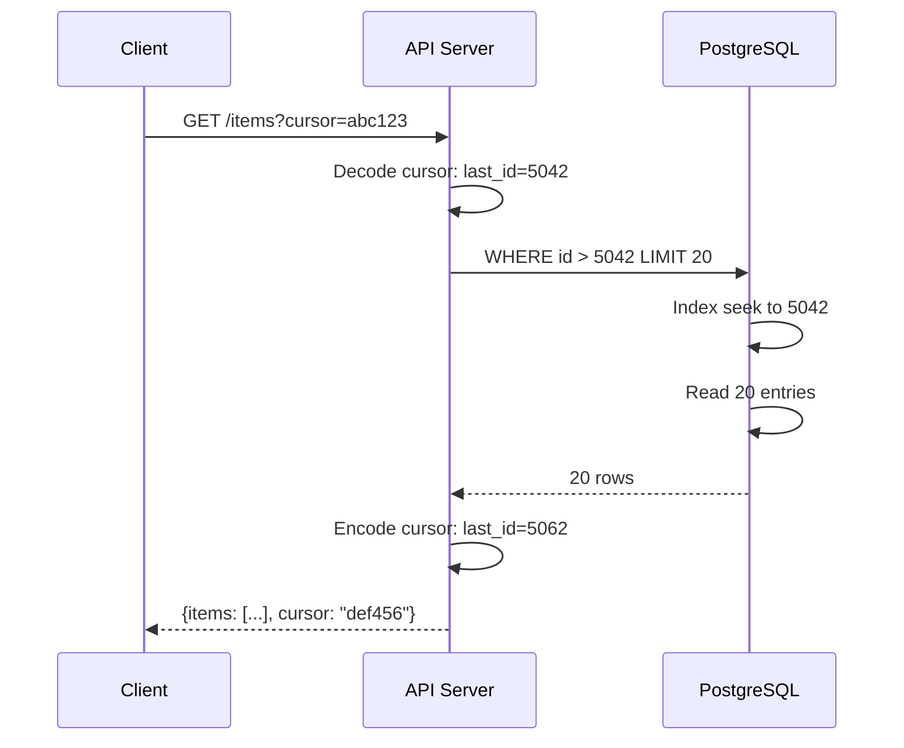

**BAD:**

```sql
SELECT * FROM products
ORDER BY id
LIMIT 20 OFFSET 100000;
-- Scans 100,020 rows, returns 20
```

**GOOD:**

```sql
SELECT * FROM products
WHERE id > 100000
ORDER BY id LIMIT 20;
-- Index seek + 20 rows, any depth
```

### 🚨 Failure Modes

**Failure 1 - Deep page timeout:**
**Symptom:** Users or crawlers requesting high page numbers cause query timeouts. Database load spikes from OFFSET scanning millions of rows.
**Root cause:** OFFSET 5,000,000 LIMIT 20 scans 5 million rows. Each request consumes significant CPU and I/O.
**Diagnostic:**

```sql
SELECT query, calls, mean_exec_time,
       total_exec_time
FROM pg_stat_statements
WHERE query LIKE '%OFFSET%'
ORDER BY mean_exec_time DESC;
```

**Fix:** Replace OFFSET with keyset pagination. If OFFSET must be supported, cap the maximum allowed OFFSET (e.g., 10,000) and return an error for deeper pages.

**Failure 2 - Inconsistent results with OFFSET during concurrent writes:**
**Symptom:** Paginating through a dataset with OFFSET, the same row appears on two consecutive pages, or a row is missing from all pages.
**Root cause:** Between page requests, rows are inserted or deleted, shifting the OFFSET boundary. Row 1001 on page 51 becomes row 1000 on page 51 after a deletion, and the client skips it.
**Diagnostic:**

```
Compare row IDs across consecutive pages.
Duplicate or missing IDs indicate
OFFSET instability during concurrent
modifications.
```

**Fix:** Keyset pagination is immune to this: `WHERE id > last_seen_id` always picks up from the correct position regardless of insertions or deletions before the cursor.

### 🔬 Production Reality

A common pattern: an e-commerce search API uses OFFSET pagination because the frontend needs "page 1 of 500." At launch, maximum result sets are small (a few thousand products). As the catalog grows to 5 million products, search API p99 latency climbs from 50 ms to 5 seconds. Investigation shows that web crawlers are paginating to page 250,000 (OFFSET 5,000,000). Each request scans 5 million rows. The fix: switch the API to cursor-based pagination with a base64-encoded cursor. For the frontend "jump to page N" requirement, limit displayed pages to 100 and cap OFFSET at 2,000 for backward compatibility. The lesson: design for scale from the start; retrofitting pagination patterns is painful.

### ⚖️ Trade-offs & Alternatives

| Aspect                    | OFFSET pagination | Keyset pagination    | Deferred join     | Materialized page table |
| ------------------------- | ----------------- | -------------------- | ----------------- | ----------------------- |
| Page N support            | Yes (O(N))        | No (sequential only) | Yes (faster O(N)) | Yes (O(1))              |
| Deep page cost            | O(N) linear       | O(1) constant        | O(N) but faster   | O(1) with maintenance   |
| Concurrent write safety   | Unstable          | Stable               | Unstable          | Stable (if maintained)  |
| Implementation complexity | Low               | Medium               | Medium            | High                    |
| Client complexity         | Page number only  | Must track cursor    | Page number only  | Page number only        |

### ⚡ Decision Snap

**USE WHEN:**

- Keyset: APIs paginating through large datasets (> 10,000 results)
- Keyset: Mobile/infinite-scroll UIs that naturally load "next page"
- Deferred join: When OFFSET is required but full row fetching is expensive

**AVOID WHEN:**

- Keyset: UI requires "jump to page 247" (keyset does not support random page access)
- OFFSET: Deep pagination on tables with > 100,000 rows

**PREFER capping OFFSET WHEN:**

- Backward compatibility requires OFFSET support
- Displaying a limited number of pages (e.g., "showing pages 1-100 of 5000")

### ⚠️ Top Traps

| #   | Misconception                                   | Reality                                                                                                                             |
| --- | ----------------------------------------------- | ----------------------------------------------------------------------------------------------------------------------------------- |
| 1   | OFFSET is fast because it uses LIMIT            | LIMIT only controls how many rows are returned; the database still scans OFFSET + LIMIT rows                                        |
| 2   | Adding an index fixes OFFSET performance        | An index helps the sort but not the scan-and-discard; the database still iterates through OFFSET entries even with an index         |
| 3   | Keyset pagination requires sequential IDs       | Any unique, ordered column works: timestamps, composite keys, UUIDs (though UUID sort order may not be meaningful)                  |
| 4   | Total count (COUNT(\*)) is free                 | COUNT(\*) on a large table is expensive in PostgreSQL (full table scan); cache the count or use an estimate from pg_class.reltuples |
| 5   | OFFSET instability only affects rare edge cases | On high-write tables, OFFSET pagination regularly produces duplicate or missing rows between pages                                  |

### 🪜 Learning Ladder

**Prerequisites:**

- SQL-015 ORDER BY and LIMIT - understand basic pagination syntax
- SQL-041 B-Tree Index Basics - understand how indexes enable efficient keyset seeks
- SQL-060 Execution Plans Deep Dive - EXPLAIN ANALYZE - see the difference between OFFSET and keyset plans

**THIS:** SQL-108 OFFSET Pagination at Scale Anti-Pattern

**Next steps:**

- SQL-064 Query Performance Tuning Patterns - broader query optimization context
- SQL-063 Covering Indexes (Index-Only Scans) - optimize keyset pagination with covering indexes
- SQL-109 Online Store DB - Phase 4 (Internals and Tuning) - apply pagination patterns in practice

**The Surprising Truth:**
OFFSET pagination is not just slow - it is inconsistent. In a table with concurrent writes, paginating with OFFSET can show the same row on two different pages or skip a row entirely. Keyset pagination is immune to this because it uses a stable cursor (the last-seen value) rather than a positional offset that shifts with every insert or delete. Correctness, not just performance, is the reason to switch.

**Further Reading:**

- Use The Index, Luke: "No Offset" (use-the-index-luke.com/no-offset)
- PostgreSQL Documentation: LIMIT and OFFSET (postgresql.org/docs/current/queries-limit.html)
- Slack Engineering Blog: "Evolving API Pagination at Slack" (discusses cursor-based pagination design)

**Revision Card:**

1. OFFSET scans and discards N rows before returning results - cost grows linearly with page depth
2. Keyset pagination (WHERE id > last_seen ORDER BY id LIMIT N) has constant cost at any depth
3. OFFSET pagination is also inconsistent under concurrent writes - keyset is stable

---

---

# SQL-109 Online Store DB - Phase 4 (Internals and Tuning)

**TL;DR** - Phase 4 applies production internals knowledge to a realistic e-commerce database: VACUUM tuning, index maintenance, query plan analysis, connection pooling configuration, and backup strategy for a growing, write-heavy workload.

### 🔥 Problem Statement

An online store database has grown from Phase 3's design-optimized schema into a production system handling 10,000 orders per day, 50 million order_items rows, and 200 concurrent application connections. Performance has degraded: VACUUM cannot keep up with dead tuple accumulation, sequential scans appear on queries that previously used indexes, connection pool exhaustion occurs during flash sales, and the pg_dump backup takes 4 hours (blocking autovacuum). The team must apply internals knowledge - buffer pool tuning, VACUUM configuration, query plan regression detection, and operational tooling - to restore and maintain performance at scale.

### 📜 Historical Context

This is Phase 4 of a progressive case study. Phase 1 (Foundations) established the schema. Phase 2 (Working Queries) added complex queries. Phase 3 (Design and Optimization) added indexes, normalization, and query optimization. Phase 4 addresses production internals: the operational knowledge required when a well-designed database encounters scale, concurrency, and the realities of long-running production workloads. This phase demonstrates that schema design and query optimization are necessary but insufficient - production databases require ongoing tuning and monitoring.

### 🔩 First Principles

**CORE INVARIANTS:**

1. Production database performance degrades continuously without active maintenance (VACUUM, index maintenance, statistics updates)
2. Configuration tuned for 1x load is wrong at 10x load - connection pooling, memory allocation, and checkpoint frequency must scale with workload
3. Performance diagnosis requires understanding internals (buffer pool, WAL, planner statistics) - surface-level metrics are insufficient

**DERIVED DESIGN:**
The Phase 4 tuning plan addresses four domains: (1) VACUUM and bloat management for the high-write orders/order_items tables. (2) Connection pooling via PgBouncer to support 200+ application connections efficiently. (3) Query plan monitoring to detect and fix regressions after statistics changes. (4) Backup strategy transition from pg_dump to WAL-based PITR.

**THE TRADE-OFF:**
**Gain:** Sustained performance under growing load; reduced operational incidents; proactive problem detection.
**Cost:** Operational complexity; monitoring infrastructure; ongoing tuning effort; team must understand internals, not just SQL.

### 🧠 Mental Model

> Phase 4 is like maintaining a racing car during a multi-day race. Phase 1-3 built and optimized the car (schema, queries, indexes). Phase 4 is the pit crew: changing tires (VACUUM), monitoring engine temperature (pg*stat*\* views), refueling (backup/recovery), and managing pit lane traffic (connection pooling). Without the pit crew, even the best car breaks down mid-race.

- "Pit crew" -> database operations team
- "Changing tires" -> VACUUM maintenance
- "Engine temperature monitoring" -> performance metrics
- "Pit lane traffic" -> connection pool management

**Where this analogy breaks down:** Database tuning is continuous, not periodic pit stops. Autovacuum runs in the background constantly, and configuration changes require careful testing.

### 🧩 Components

- **autovacuum tuning** - adjusting thresholds and scale factors for high-write tables
- **PgBouncer** - connection pooler between application and PostgreSQL
- **pg_stat_statements** - extension tracking query performance metrics
- **pg_stat_user_tables** - statistics on table access patterns (seq scans, idx scans, dead tuples)
- **shared_buffers** - buffer pool size configuration
- **work_mem** - per-operation sort/hash memory allocation
- **pgBackRest** - production backup tool replacing pg_dump

```
  Phase 4 Tuning Domains
  +-------------------------+
  | VACUUM & Bloat          |
  |  autovacuum_scale_factor|
  |  per-table settings     |
  +-------------------------+
  | Connection Pooling      |
  |  PgBouncer tx mode      |
  |  HikariCP sizing        |
  +-------------------------+
  | Query Plan Monitoring   |
  |  pg_stat_statements     |
  |  plan regression alerts |
  +-------------------------+
  | Backup Strategy         |
  |  pgBackRest PITR        |
  |  recovery testing       |
  +-------------------------+
```

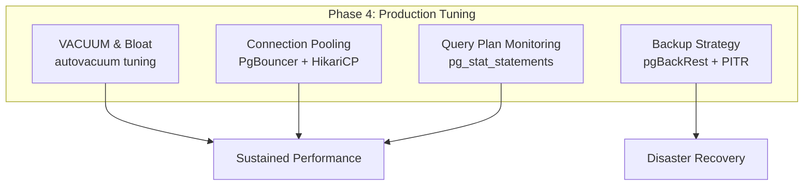

### 📶 Gradual Depth

**Level 1 - What it is:**
Phase 4 applies database internals knowledge to keep a growing e-commerce database performing well. It covers maintenance (VACUUM), connection management, query monitoring, and backups.

**Level 2 - How to use it:**
Start with diagnostics: check `pg_stat_user_tables` for tables with high dead tuple counts. Configure PgBouncer for your connection requirements. Enable `pg_stat_statements` to track query performance. Switch from pg_dump to pgBackRest for backups.

**Level 3 - How it works:**
For the `order_items` table (50M rows, 10K new rows/day, frequent status updates): set `autovacuum_vacuum_scale_factor = 0.01` (VACUUM after 1% dead tuples instead of default 20%). For connection pooling: PgBouncer `default_pool_size = 25` in transaction mode, HikariCP `maximumPoolSize = 10` per service instance. For monitoring: create a dashboard from `pg_stat_statements` showing p50/p95/p99 query times.

**Level 4 - Production mastery:**
Complete Phase 4 implementation:

**VACUUM tuning for order_items:**

```sql
ALTER TABLE order_items SET (
  autovacuum_vacuum_scale_factor = 0.01,
  autovacuum_vacuum_cost_delay = 2,
  autovacuum_vacuum_cost_limit = 1000
);
```

This triggers VACUUM after 500,000 dead tuples (1% of 50M) instead of 10M (20%), and increases the VACUUM I/O budget.

**PgBouncer configuration:**

```
[databases]
store = host=127.0.0.1 dbname=store
[pgbouncer]
pool_mode = transaction
default_pool_size = 25
max_client_conn = 500
```

**Query monitoring baseline:**

```sql
SELECT query,
       calls,
       mean_exec_time,
       stddev_exec_time
FROM pg_stat_statements
ORDER BY total_exec_time DESC
LIMIT 20;
```

### ⚙️ How It Works

**Phase 4a - Diagnose current state:**

```sql
-- Table health check
SELECT relname,
       n_live_tup, n_dead_tup,
       n_dead_tup::float /
         nullif(n_live_tup, 0) AS dead_ratio,
       last_autovacuum,
       last_autoanalyze
FROM pg_stat_user_tables
WHERE relname IN ('orders', 'order_items',
                  'products', 'customers')
ORDER BY n_dead_tup DESC;
```

**Phase 4b - Apply per-table VACUUM settings:**
High-write tables (`orders`, `order_items`) need aggressive VACUUM. Low-write tables (`products`, `categories`) use defaults. The tuning prevents bloat accumulation that degrades sequential scan performance and wastes disk space.

**Phase 4c - Connection pool deployment:**
Deploy PgBouncer between application instances and PostgreSQL. Reduce `max_connections` from 500 to 60 (PgBouncer handles multiplexing). This frees approximately 2 GB of RAM on the database server.

**Phase 4d - Backup migration:**
Replace the 4-hour pg_dump (which blocks autovacuum due to long transaction) with pgBackRest incremental backups + WAL archiving. Incremental backups complete in minutes. PITR provides second-level recovery granularity.

```
  Before Phase 4        After Phase 4
  max_connections: 500  max_connections: 60
  Connection RAM: 3GB   Connection RAM: 400MB
  Backup: pg_dump 4hr   Backup: pgBackRest 5min
  VACUUM: default       VACUUM: per-table tuned
  Monitoring: none      Monitoring: pg_stat_*
```

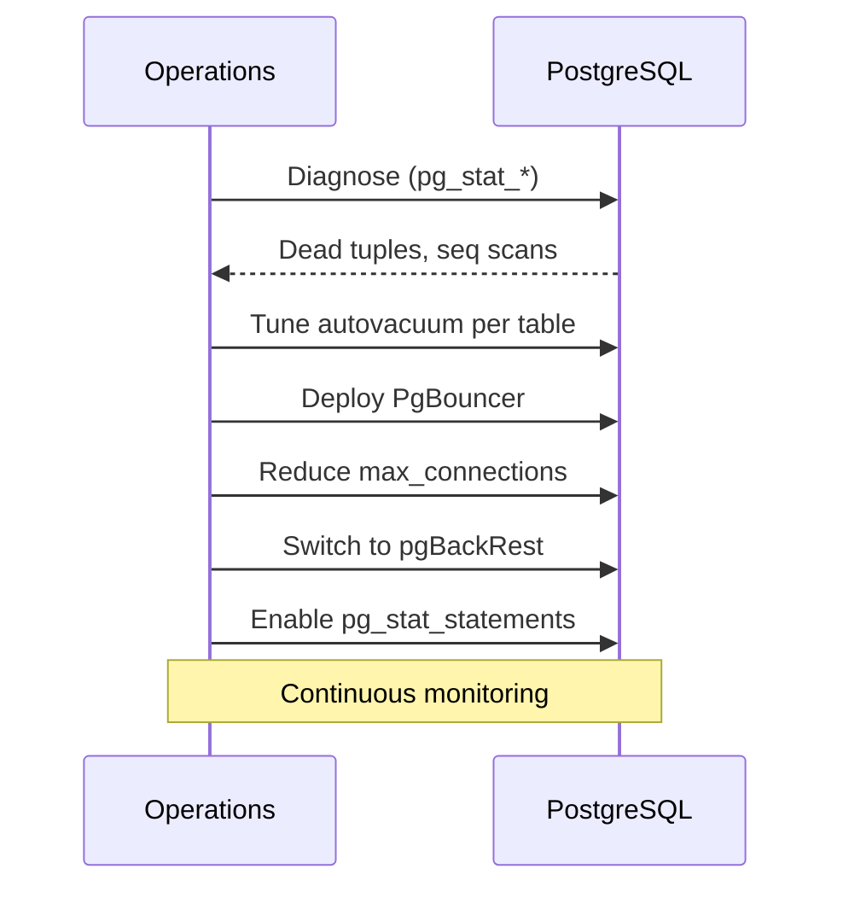

**BAD:**

```sql
-- Default autovacuum on 50M rows
-- scale_factor = 0.2
-- VACUUM after 10M dead tuples
-- Table bloats 2x before cleanup
```

**GOOD:**

```sql
ALTER TABLE order_items SET (
  autovacuum_vacuum_scale_factor
    = 0.01
);  -- after 500K dead tuples
```

### 🚨 Failure Modes

**Failure 1 - Autovacuum cannot keep up with write rate:**
**Symptom:** `n_dead_tup` on `order_items` grows continuously. Table size on disk grows even though live row count is stable. Query performance degrades as sequential scans read dead tuples.
**Root cause:** Default `autovacuum_vacuum_scale_factor = 0.2` means VACUUM triggers after 10M dead tuples on a 50M row table - by then, the table has significant bloat.
**Diagnostic:**

```sql
SELECT relname, n_dead_tup,
       pg_size_pretty(
         pg_total_relation_size(relid)
       ) AS total_size
FROM pg_stat_user_tables
WHERE relname = 'order_items';
```

**Fix:** Reduce `autovacuum_vacuum_scale_factor` to 0.01 or use `autovacuum_vacuum_threshold` (absolute dead tuple count) for large tables.

**Failure 2 - pg_dump blocks autovacuum:**
**Symptom:** During the 4-hour pg_dump window, dead tuples accumulate because VACUUM cannot remove tuples visible to the pg_dump transaction's snapshot.
**Root cause:** pg_dump holds a long-running transaction (REPEATABLE READ) that prevents VACUUM from cleaning tuples created after the transaction started.
**Diagnostic:**

```sql
SELECT pid, xact_start,
       now() - xact_start AS duration,
       query
FROM pg_stat_activity
WHERE state = 'idle in transaction'
  AND now() - xact_start > interval '1h';
```

**Fix:** Replace pg_dump with pgBackRest physical backups, which do not hold long transactions.

### 🔬 Production Reality

The most common Phase 4 discovery: after deploying PgBouncer and reducing `max_connections` from 500 to 60, overall database throughput increases by 30%. The reason is counter-intuitive: fewer connections mean less contention for shared resources (buffer pool, lock manager, WAL writer). The 500-connection configuration was not just wasting memory - it was actively degrading performance through contention. This is the production manifestation of the "optimal connections = CPU cores \* 2" principle: more connections beyond the optimal point reduces throughput.

### ⚖️ Trade-offs & Alternatives

| Aspect                   | Manual tuning (Phase 4)   | Cloud-managed auto-tuning | Default configuration | Over-provisioning hardware |
| ------------------------ | ------------------------- | ------------------------- | --------------------- | -------------------------- |
| Performance              | Optimized for workload    | Generic optimization      | Degrades at scale     | Masks problems             |
| Operational cost         | High (requires expertise) | Low                       | Zero                  | High (hardware cost)       |
| Scaling ceiling          | High                      | Medium                    | Low                   | Medium                     |
| Problem visibility       | High (instrumented)       | Low (black box)           | Zero                  | Low                        |
| Long-term sustainability | Sustainable               | Sustainable               | Unsustainable         | Unsustainable              |

### ⚡ Decision Snap

**USE WHEN:**

- Database workload has grown beyond default configuration capacity
- Performance degradation is observed (slow queries, connection timeouts)
- Moving from development/prototype to production operation

**AVOID WHEN:**

- Database is small (< 1 GB) and default settings are sufficient
- Workload is stable and within default configuration headroom

**PREFER cloud-managed auto-tuning WHEN:**

- Team lacks PostgreSQL internals expertise
- Workload is standard OLTP without extreme characteristics
- Operational simplicity is more valuable than peak optimization

### ⚠️ Top Traps

| #   | Misconception                                                  | Reality                                                                                                        |
| --- | -------------------------------------------------------------- | -------------------------------------------------------------------------------------------------------------- |
| 1   | Default PostgreSQL configuration works at any scale            | Defaults are conservative; they work for small workloads but degrade significantly at scale                    |
| 2   | More connections always means more capacity                    | Beyond the optimal point (cores \* 2), additional connections decrease throughput through contention           |
| 3   | pg_dump is sufficient for production backups                   | pg_dump holds a long transaction that blocks VACUUM and provides poor RPO; use physical backups for production |
| 4   | VACUUM runs automatically and needs no tuning                  | Autovacuum defaults are too conservative for high-write tables; per-table tuning is essential                  |
| 5   | Schema optimization eliminates the need for operational tuning | Even a perfectly designed schema requires ongoing maintenance: VACUUM, statistics updates, index maintenance   |

### 🪜 Learning Ladder

**Prerequisites:**

- SQL-089 VACUUM and Bloat Management (PostgreSQL) - VACUUM internals for Phase 4 tuning
- SQL-102 Connection Pooling - PgBouncer and HikariCP - connection pooling principles
- SQL-094 Query Planner and Cost-Based Optimization - understand plan regression detection
- SQL-103 Backup and Point-in-Time Recovery (PITR) - backup strategy for Phase 4

**THIS:** SQL-109 Online Store DB - Phase 4 (Internals and Tuning)

**Next steps:**

- SQL-110 SQL Expert-Level Mastery Verification - test your production internals knowledge
- SQL-121 Observability for Database Fleets - build comprehensive monitoring
- SQL-122 Database Capacity Planning and Growth Modeling - plan for future growth

**The Surprising Truth:**
The biggest performance gain in Phase 4 is usually not from any clever tuning parameter - it is from removing the pg_dump backup that blocks autovacuum for 4 hours every night. During that window, dead tuples accumulate, table bloat grows, and sequential scans slow down. Switching to physical backups (pgBackRest) that do not hold long transactions often improves average daily performance by 15-20%, simply by letting VACUUM do its job.

**Further Reading:**

- PostgreSQL Documentation: Automatic Vacuuming (postgresql.org/docs/current/routine-vacuuming.html#AUTOVACUUM)
- PostgreSQL Documentation: Resource Consumption (postgresql.org/docs/current/runtime-config-resource.html)
- pgBackRest Documentation (pgbackrest.org)

**Revision Card:**

1. Per-table autovacuum tuning is essential for high-write tables - default scale_factor (0.2) is too conservative for large tables
2. Reducing max_connections via PgBouncer often increases throughput by reducing contention
3. Replace pg_dump with physical backups to stop blocking autovacuum with long-running transactions

---

---

# SQL-110 SQL Expert-Level Mastery Verification

**TL;DR** - A comprehensive assessment verifying deep understanding of SQL production internals: MVCC mechanics, WAL architecture, VACUUM behavior, locking protocols, query planner decisions, and operational diagnostics under realistic failure scenarios.

### 🔥 Problem Statement

Engineers who can write correct SQL queries often lack the internals knowledge needed to diagnose and resolve production database issues. The gap between "can write queries" and "can debug a production outage caused by VACUUM not keeping up, or a query plan regression after a statistics update" is substantial. This assessment verifies mastery across all production-critical internals topics: MVCC transaction isolation, WAL crash recovery, buffer pool behavior, VACUUM mechanics, locking and deadlock resolution, query planner internals, replication, and operational diagnostics.

### 📜 Historical Context

Database internals knowledge was historically the domain of dedicated DBAs. As DevOps and SRE practices distributed database responsibility across engineering teams, the need for broader internals knowledge grew. Modern production incidents often require engineers to understand why a query plan changed (statistics update), why a table is growing (VACUUM lag), or why connections are exhausting (pool misconfiguration) - skills that pure SQL proficiency does not provide.

### 🔩 First Principles

**CORE INVARIANTS:**

1. Production database mastery requires understanding WHY things work, not just HOW to use them
2. Diagnostic capability requires knowing the relationship between internal mechanisms (MVCC, WAL, buffer pool, planner)
3. Real mastery is demonstrated by diagnosing novel failure scenarios, not by reciting configuration parameters

**DERIVED DESIGN:**
The assessment covers seven domains at increasing depth: (1) MVCC and transaction isolation. (2) WAL and crash recovery. (3) Buffer pool and memory. (4) VACUUM and bloat. (5) Locking and concurrency. (6) Query planner and optimization. (7) Operational diagnostics under failure scenarios.

**THE TRADE-OFF:**
**Gain:** Engineers who pass this assessment can independently diagnose and resolve production database issues, reducing incident response time.
**Cost:** Acquiring this knowledge requires significant study time; not all engineers need this depth for their daily work.

### 🧠 Mental Model

> This assessment tests whether you can be the "database doctor" on call at 3 AM when production is down. A doctor does not just prescribe medication (write queries) - they diagnose from symptoms (metrics), understand the body's systems (internals), and know which intervention resolves which condition (operational fixes).

- "Prescribing medication" -> writing SQL queries
- "Diagnosing from symptoms" -> reading pg*stat*\* views and EXPLAIN output
- "Understanding body systems" -> knowing MVCC, WAL, buffer pool, planner internals

**Where this analogy breaks down:** Unlike medicine, database internals are deterministic - given the same inputs and configuration, the behavior is reproducible and debuggable.

### 🧩 Components

- **Domain 1: MVCC** - transaction visibility, snapshot isolation, tuple versioning
- **Domain 2: WAL** - crash recovery, checkpoint, fsync, WAL segment management
- **Domain 3: Buffer Pool** - shared_buffers, page eviction, checkpoint dirty page writes
- **Domain 4: VACUUM** - dead tuple cleanup, bloat, autovacuum tuning, wraparound prevention
- **Domain 5: Locking** - lock modes, deadlock detection, advisory locks, lock queue ordering
- **Domain 6: Query Planner** - cost model, statistics, join algorithm selection, plan regression
- **Domain 7: Diagnostics** - pg_stat_activity, pg_stat_statements, pg_locks, EXPLAIN ANALYZE

```
  Assessment Domains
  +------------------+
  | MVCC             | - Visibility rules
  | WAL              | - Recovery mechanics
  | Buffer Pool      | - Memory management
  | VACUUM           | - Maintenance tuning
  | Locking          | - Concurrency control
  | Query Planner    | - Optimization logic
  | Diagnostics      | - Production debugging
  +------------------+
```

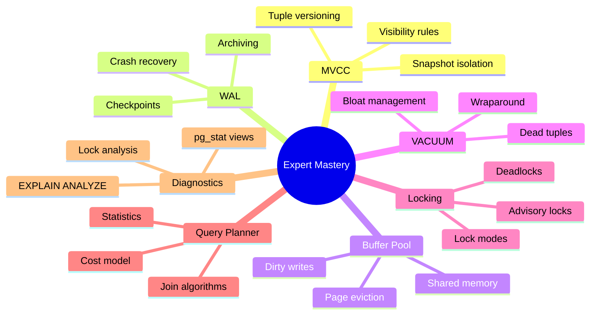

### 📶 Gradual Depth

**Level 1 - What it is:**
A comprehensive test of PostgreSQL production internals knowledge, covering seven domains from MVCC to operational diagnostics.

**Level 2 - How to use it:**
Work through each domain's questions. For each question, write your answer before checking. Focus on the "why" behind each mechanism, not just the "what."

**Level 3 - How it works:**
Each domain progresses from conceptual understanding to diagnostic application. The assessment culminates in scenario-based questions that combine multiple domains - simulating real production incidents.

**Level 4 - Production mastery:**
The final assessment tier presents realistic failure scenarios requiring cross-domain reasoning. Example: "A query that ran in 5ms yesterday now takes 30 seconds. The table was not modified. What changed, and how do you diagnose it?" The answer requires understanding: planner statistics (ANALYZE may have run), plan regression (a new plan was chosen), index visibility (concurrent VACUUM may have changed index statistics), and diagnostic tools (pg_stat_statements comparison, EXPLAIN ANALYZE before/after).

### ⚙️ How It Works

**Assessment Structure:**

**Domain 1 - MVCC Questions:**
Q1: Explain why a long-running transaction can cause table bloat even if it reads no data from the affected table.
Q2: What is the difference between `xmin`, `xmax`, and the `cmin`/`cmax` fields in a tuple header?
Q3: Why does REPEATABLE READ in PostgreSQL use snapshot isolation rather than lock-based repeatable read?

**Domain 2 - WAL Questions:**
Q4: Explain the WAL write sequence during a single INSERT: what is written, when, and in what order relative to the data page write.
Q5: What happens if the server crashes after WAL is flushed but before the data page is written to disk?
Q6: Why does reducing `checkpoint_timeout` increase I/O but improve recovery time?

**Domain 3 - Buffer Pool Questions:**
Q7: How does PostgreSQL decide which page to evict from shared_buffers when the buffer pool is full?
Q8: Why might increasing shared_buffers beyond 25% of RAM decrease performance?

**Domain 4 - VACUUM Questions:**
Q9: Explain the difference between regular VACUUM and VACUUM FULL in terms of locking, disk space recovery, and table rewriting.
Q10: What is transaction ID wraparound, and why does PostgreSQL force aggressive VACUUM to prevent it?

**Domain 5 - Locking Questions:**
Q11: Three transactions deadlock in a cycle (A waits for B, B waits for C, C waits for A). How does PostgreSQL choose which transaction to abort?
Q12: Why does `SELECT ... FOR UPDATE` acquire a different lock than plain `SELECT`?

**Domain 6 - Query Planner Questions:**
Q13: The planner chooses a sequential scan on a 1M-row table when an index exists. Name three valid reasons for this choice.
Q14: What is the effect of `random_page_cost` on the planner's choice between index scan and sequential scan?

**Domain 7 - Diagnostic Scenarios:**
Q15: Production alert: connection count at max_connections. `pg_stat_activity` shows 90% of connections in "idle in transaction" state. Diagnose and fix.
Q16: A table's disk size has doubled in a month, but row count is unchanged. Diagnose.

```
  Diagnostic Scenario Flow
  Symptom -> Metrics -> Hypothesis -> Verify
  Example:
  "Slow query" ->
    pg_stat_statements (mean_exec_time) ->
    "Plan regression after ANALYZE" ->
    EXPLAIN ANALYZE (compare plans)
```

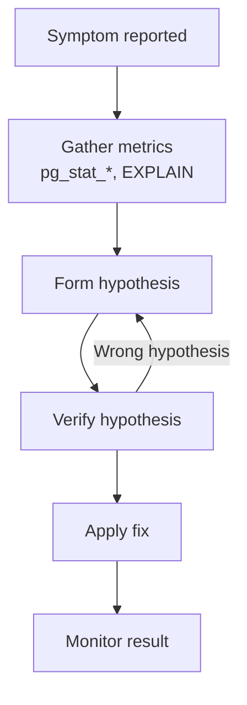

**BAD:**

```sql
ALTER SYSTEM
SET shared_buffers = '32GB';
-- "Blog said 25%"
-- Cannot explain or troubleshoot
```

**GOOD:**

```sql
SELECT * FROM pg_stat_bgwriter;
-- Check checkpoint write ratio
-- Understand OS cache interaction
-- Then tune based on evidence
```

### 🚨 Failure Modes

**Failure 1 - Knowing configuration without understanding mechanism:**
**Symptom:** Engineer sets `shared_buffers = 8GB` because "the docs say 25% of RAM" but cannot explain why 50% would be worse, or what the OS page cache's role is.
**Root cause:** Configuration knowledge without internals understanding leads to cargo-cult tuning.
**Diagnostic:**

```
Ask: "What happens to a data page
when shared_buffers is full and a
new page must be loaded?"
If the answer does not mention clock-sweep
or dirty page writeback, the understanding
is surface-level.
```

**Fix:** Study the buffer pool eviction algorithm (clock-sweep), the relationship between shared_buffers and OS page cache (double-buffering), and checkpoint dirty page write behavior.

**Failure 2 - Diagnosing symptoms without root cause:**
**Symptom:** Engineer sees high CPU and adds more CPU (or adds read replicas) without investigating the actual cause - which is a missing index causing full table scans.
**Root cause:** Lack of diagnostic methodology: jumping to solutions without understanding the problem.
**Diagnostic:**

```
Check: does the engineer use
pg_stat_statements to identify
the slow queries?
Check: does the engineer use
EXPLAIN ANALYZE to understand
why the queries are slow?
```

**Fix:** Establish a diagnostic workflow: symptom -> metrics -> hypothesis -> verify -> fix. Always start with pg_stat_statements and EXPLAIN ANALYZE before making configuration or infrastructure changes.

### 🔬 Production Reality

The difference between a team with internals mastery and one without: when a production database suddenly slows down, the team without mastery opens a support ticket, scales up hardware, or restarts the database. The team with mastery checks `pg_stat_statements` for query regression, runs `EXPLAIN ANALYZE` on the slow queries, discovers a plan change after autovacuum ran ANALYZE on a large table, resets statistics or pins the query plan, and resolves the issue in 15 minutes. The hardware scaling team spends hours and thousands of dollars solving the wrong problem.

### ⚖️ Trade-offs & Alternatives

| Aspect                 | Deep internals mastery | Surface-level SQL proficiency | Managed DBA service | Cloud auto-tuning   |
| ---------------------- | ---------------------- | ----------------------------- | ------------------- | ------------------- |
| Incident response time | Minutes                | Hours to days                 | Depends on SLA      | Automated (limited) |
| Root cause analysis    | Deep                   | Surface                       | Deep (if good DBA)  | N/A                 |
| Cost                   | Training investment    | Low                           | Monthly cost        | Included            |
| Team dependency        | Self-sufficient        | Blocked on incidents          | Vendor dependency   | Platform dependency |
| Novel problem solving  | Strong                 | Weak                          | Variable            | None                |

### ⚡ Decision Snap

**USE WHEN:**

- Preparing engineers for on-call database responsibilities
- Evaluating team readiness for managing production PostgreSQL
- Self-assessment before taking ownership of a critical database

**AVOID WHEN:**

- Engineers work exclusively on application logic with no database operational responsibility
- Fully managed database services handle all operational concerns

**PREFER focused domain study WHEN:**

- Time is limited: prioritize VACUUM (most common issue), then locking (second most common), then query planner

### ⚠️ Top Traps

| #   | Misconception                                        | Reality                                                                                                                                |
| --- | ---------------------------------------------------- | -------------------------------------------------------------------------------------------------------------------------------------- |
| 1   | Knowing SQL syntax equals knowing database internals | SQL is the interface; internals (MVCC, WAL, buffer pool) are the engine. Production issues are engine problems, not interface problems |
| 2   | Configuration tuning replaces understanding          | Setting parameters without understanding mechanisms leads to cargo-cult tuning that breaks under different workloads                   |
| 3   | PostgreSQL documentation covers everything needed    | The documentation covers features; production mastery requires understanding interactions between features under load                  |
| 4   | One-time study is sufficient                         | PostgreSQL releases new features regularly (e.g., parallel query improvements, new index types); ongoing learning is necessary         |
| 5   | All engineers need the same depth                    | Depth should match responsibility: query writers need Level 2, SREs need Level 4, DBAs need all domains                                |

### 🪜 Learning Ladder

**Prerequisites:**

- SQL-085 MVCC - How PostgreSQL Handles Concurrent Access - core concurrency mechanism
- SQL-086 Write-Ahead Log (WAL) - Crash Recovery Mechanism - durability foundation
- SQL-089 VACUUM and Bloat Management (PostgreSQL) - maintenance operations
- SQL-094 Query Planner and Cost-Based Optimization - plan selection internals

**THIS:** SQL-110 SQL Expert-Level Mastery Verification

**Next steps:**

- SQL-111 SQL Deep-Dive Interview Questions - targeted interview preparation
- SQL-109 Online Store DB - Phase 4 (Internals and Tuning) - apply knowledge to a realistic workload
- SQL-121 Observability for Database Fleets - operational monitoring at scale

**The Surprising Truth:**
The most valuable internals knowledge for production is not about exotic edge cases or advanced features - it is about three fundamentals: (1) why is VACUUM not keeping up, (2) why did the query plan change, and (3) why are connections exhausted. These three categories account for the vast majority of production PostgreSQL incidents. Mastering these three areas provides more operational value than knowing every PostgreSQL feature.

**Further Reading:**

- PostgreSQL Documentation: Monitoring Database Activity (postgresql.org/docs/current/monitoring.html)
- "The Internals of PostgreSQL" by Hironobu Suzuki (interdb.jp/pg/)
- PostgreSQL Documentation: Server Configuration (postgresql.org/docs/current/runtime-config.html)

**Revision Card:**

1. Production mastery = understanding WHY (mechanisms) not just WHAT (configuration) - MVCC, WAL, buffer pool, VACUUM, planner
2. Three areas cover most production incidents: VACUUM lag, query plan regression, and connection exhaustion
3. Diagnostic workflow: symptom -> metrics (pg*stat*\*) -> hypothesis -> EXPLAIN ANALYZE -> verify -> fix

---

---

# SQL-111 SQL Deep-Dive Interview Questions

**TL;DR** - An advanced interview framework testing a candidate's ability to reason about database internals under pressure: explain mechanisms from first principles, diagnose realistic failure scenarios, and make architectural trade-off decisions.

### 🔥 Problem Statement

Hiring engineers for roles requiring database expertise (senior backend, SRE, platform engineering) demands interview questions that distinguish surface-level knowledge from genuine understanding. Standard SQL interview questions ("write a query to find the second highest salary") test syntax, not production capability. This framework provides questions that probe understanding of internal mechanisms, diagnostic reasoning, and architectural decision-making - the skills that matter when a production database is down at 3 AM.

### 📜 Historical Context

Database interview questions have traditionally focused on query writing, normalization theory, and basic indexing concepts. As distributed systems and cloud-native architectures increased the operational complexity of database management, interview frameworks evolved to include systems thinking. Companies like Google, Stripe, and Uber developed internal interview frameworks that test candidates' ability to reason about database behavior under failure conditions, replication lag, and performance degradation.

### 🔩 First Principles

**CORE INVARIANTS:**

1. Genuine understanding is revealed by the ability to explain mechanisms from first principles, not by reciting memorized answers
2. Production capability is demonstrated by diagnostic reasoning under ambiguous, incomplete information
3. Architectural maturity is shown by articulating trade-offs rather than advocating for a single solution

**DERIVED DESIGN:**
The interview framework has three phases: (1) Mechanism explanation - "explain X as if I know nothing about databases." (2) Diagnostic scenario - "here are the symptoms; what is wrong and how do you fix it?" (3) Architecture decision - "we need to build X; what are the options and trade-offs?"

**THE TRADE-OFF:**
**Gain:** Interviews that accurately predict production capability; reduced false positives (candidates who sound good but cannot diagnose real issues).
**Cost:** Requires interviewers with internals knowledge; longer interview duration; may exclude excellent engineers who learned differently.

### 🧠 Mental Model

> A database internals interview is like a pilot's simulator check ride. Writing SQL is like knowing the cockpit controls (necessary but insufficient). The interview tests what happens when an engine fails at 30,000 feet: can you diagnose the problem, communicate clearly, and make the right decisions under pressure?

- "Knowing cockpit controls" -> SQL proficiency
- "Engine failure at 30,000 feet" -> production database incident
- "Simulator check ride" -> interview diagnostic scenarios

**Where this analogy breaks down:** Unlike pilots, database engineers can consult documentation during real incidents. The interview tests foundational understanding that enables effective use of documentation under pressure.

### 🧩 Components

- **Phase 1: Mechanism** - explain internal mechanisms from first principles
- **Phase 2: Diagnosis** - diagnose failure scenarios from symptoms
- **Phase 3: Architecture** - evaluate trade-offs and make recommendations
- **Calibration rubric** - scoring framework distinguishing levels (junior/mid/senior/staff)
- **Follow-up probes** - questions that test depth beyond prepared answers

```
  Interview Structure
  Phase 1: Mechanism (15 min)
    "Explain MVCC from first principles"
    Follow-ups probe depth

  Phase 2: Diagnosis (20 min)
    "Production alert: [symptoms]"
    Candidate drives investigation

  Phase 3: Architecture (15 min)
    "Design backup strategy for X"
    Evaluate trade-off reasoning
```

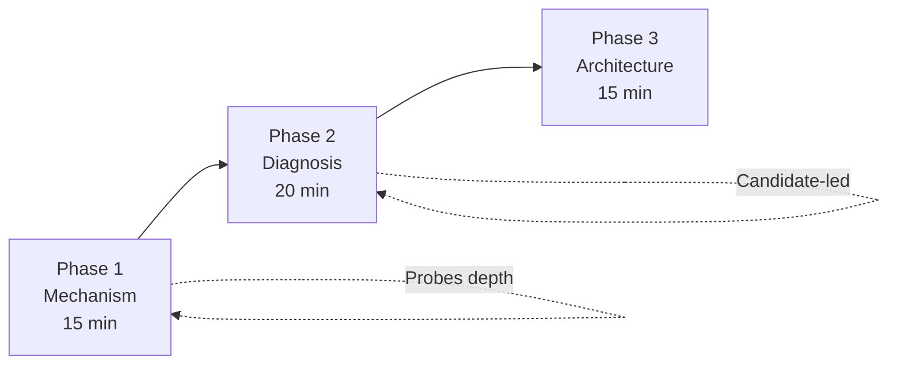

### 📶 Gradual Depth

**Level 1 - What it is:**
An interview framework with three phases: explain a mechanism, diagnose a failure, and evaluate an architectural trade-off. It tests production database capability, not SQL syntax.

**Level 2 - How to use it:**
Select one question from each phase. Allow candidates to think aloud. Score on depth of understanding (can they explain WHY, not just WHAT), diagnostic methodology (do they follow a systematic process), and trade-off articulation (do they consider multiple options).

**Level 3 - How it works:**
Phase 1 reveals whether candidates understand mechanisms or have memorized definitions. The signal: can they answer follow-up questions that were not in their preparation? Phase 2 reveals diagnostic reasoning: do they start with metrics (pg*stat*\*) or jump to solutions? Phase 3 reveals architectural maturity: do they articulate trade-offs or advocate for a single approach?

**Level 4 - Production mastery:**
Calibration across levels:

- **Junior:** Knows concepts exist, can describe at high level, needs guidance on diagnosis.
- **Mid:** Can explain mechanisms correctly, follows diagnostic process with hints, considers 2+ options in architecture.
- **Senior:** Explains from first principles with nuance, leads diagnosis independently, articulates trade-offs with real-world context.
- **Staff:** Identifies edge cases the interviewer did not consider, connects diagnosis to systemic improvements, frames architecture in terms of organizational capability and long-term maintainability.

### ⚙️ How It Works

**Phase 1 - Sample Mechanism Questions:**

Q1: "Explain how PostgreSQL ensures crash recovery. Start from what happens when a transaction commits."

- **Good answer:** WAL write first (sequential), fsync, then data pages written lazily. Recovery replays WAL from last checkpoint. Explains why WAL is sequential (fast) and data pages are random (deferred).
- **Follow-up:** "What happens if fsync fails silently?" (Tests knowledge of the PostgreSQL fsync bug pre-12.)

Q2: "Why does PostgreSQL keep old row versions instead of updating rows in place?"

- **Good answer:** MVCC allows readers and writers to not block each other. Old versions are needed for active snapshots. Trade-off: space overhead from dead tuples, requiring VACUUM.
- **Follow-up:** "How does this differ from MySQL/InnoDB's undo log approach?"

**Phase 2 - Sample Diagnostic Scenarios:**

S1: "Production alert: application p99 latency has doubled in the last hour. No deployments occurred. pg_stat_activity shows normal connection count. What do you do?"

- **Good candidate flow:** Check pg_stat_statements for query regression -> EXPLAIN ANALYZE on slow queries -> compare current plan with expected plan -> check if autovacuum ran ANALYZE recently -> verify statistics accuracy.
- **Red flag:** Immediately suggests "add an index" or "increase CPU" without diagnosis.

S2: "A table was 10 GB last month and is now 30 GB. Row count has not changed. Diagnose."

- **Good answer:** Table bloat from dead tuples. VACUUM is not keeping up, or a long-running transaction is preventing VACUUM cleanup. Check n_dead_tup, last_autovacuum, oldest running transaction.

**Phase 3 - Sample Architecture Questions:**

A1: "Design a backup strategy for a 2 TB PostgreSQL database with RPO < 5 minutes and RTO < 30 minutes."

- **Good answer:** pgBackRest with daily full + hourly incremental backups, continuous WAL archiving. RTO: parallel restore + WAL replay. Test monthly. Discusses trade-offs: storage cost, backup I/O impact, recovery complexity.

```
  Scoring Rubric
  Mechanism: 1-4
    1: Knows concept name only
    2: Describes correctly at high level
    3: Explains from first principles
    4: Identifies edge cases, trade-offs

  Diagnosis: 1-4
    1: Guesses solutions without data
    2: Follows process with hints
    3: Leads investigation independently
    4: Identifies systemic root cause

  Architecture: 1-4
    1: Single solution, no trade-offs
    2: Multiple options, basic comparison
    3: Trade-offs with production context
    4: Frames in organizational terms
```

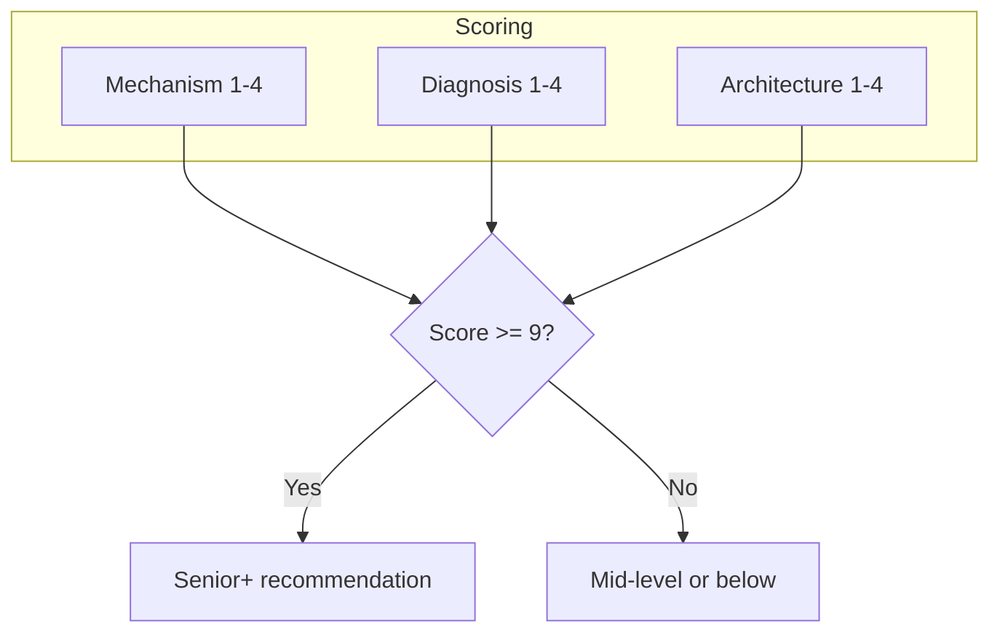

**BAD:**

```sql
-- "How fix slow query?"
-- Candidate: "Add an index."
-- No diagnosis, no EXPLAIN
```

**GOOD:**

```sql
-- "First check pg_stat_statements.
-- Then EXPLAIN ANALYZE the plan.
-- Compare with expected plan.
-- Check if ANALYZE ran recently."
```

### 🚨 Failure Modes

**Failure 1 - Memorized answers without depth:**
**Symptom:** Candidate provides textbook-perfect initial answers but cannot answer follow-up questions or apply the concept to a new scenario.
**Root cause:** Preparation from blog summaries without genuine understanding.
**Diagnostic:**

```
Follow-up test: ask a "what if"
variation that requires reasoning
from the mechanism, not recalling
a memorized answer.
```

**Fix:** Design follow-up questions that require applying the mechanism to a novel scenario. Example: after explaining MVCC, ask "What would happen if PostgreSQL used a different approach for long-running analytical queries?"

**Failure 2 - Solution-first diagnosis:**
**Symptom:** When presented with a diagnostic scenario, the candidate immediately suggests fixes ("add an index," "increase memory") without gathering data or forming hypotheses.
**Root cause:** Pattern matching from incident experience without a diagnostic methodology.
**Diagnostic:**

```
Ask: "Before we fix it, how would
you confirm your hypothesis?"
If the candidate cannot name specific
diagnostic queries or tools, they
are guessing.
```

**Fix:** Evaluate the diagnostic process, not just the answer. A candidate who methodically investigates and arrives at the wrong initial hypothesis (then corrects it) demonstrates better capability than one who guesses correctly.

### 🔬 Production Reality

The best interview signal for production capability: give the candidate a pg_stat_activity output showing 50 connections in "idle in transaction" state, 10 in "active" state, and 40 in "idle" state, with max_connections at 100. Ask them to interpret the situation and recommend actions. A strong candidate identifies: (1) the 50 "idle in transaction" connections are the problem (leaked transactions), (2) they should check `xact_start` to find the oldest transactions, (3) the application likely has a connection leak or missing transaction close, (4) short-term fix is setting `idle_in_transaction_session_timeout`, (5) long-term fix is finding and fixing the application code.

### ⚖️ Trade-offs & Alternatives

| Aspect                       | Internals interview | SQL query interview | Take-home assignment | Pair debugging session |
| ---------------------------- | ------------------- | ------------------- | -------------------- | ---------------------- |
| Tests production capability  | High                | Low                 | Medium               | High                   |
| Preparation time             | High                | Low                 | High                 | Low                    |
| Interviewer expertise needed | High                | Low                 | Medium               | High                   |
| Candidate stress             | Medium              | Low                 | Low                  | Medium                 |
| False positive rate          | Low                 | High                | Medium               | Low                    |

### ⚡ Decision Snap

**USE WHEN:**

- Hiring for roles with production database ownership (SRE, platform, senior backend)
- Evaluating candidates who will be on-call for database incidents
- Assessing existing team members' readiness for database operational responsibilities

**AVOID WHEN:**

- Hiring for roles that primarily consume databases as a service (junior frontend, mobile)
- Fully managed database services handle all operational concerns

**PREFER lighter assessment WHEN:**

- The role requires SQL proficiency but not operational internals knowledge
- Team has dedicated DBAs who handle all internals work

### ⚠️ Top Traps

| #   | Misconception                                            | Reality                                                                                                   |
| --- | -------------------------------------------------------- | --------------------------------------------------------------------------------------------------------- |
| 1   | SQL query challenges test production capability          | SQL syntax tests are necessary but insufficient; they do not test diagnostic or operational skills        |
| 2   | Memorized answers indicate understanding                 | Follow-up questions and novel scenarios distinguish memorization from genuine comprehension               |
| 3   | Only DBAs need internals knowledge                       | Any engineer on-call for a system with a database needs enough internals knowledge to triage incidents    |
| 4   | One correct answer means the candidate is strong         | The diagnostic process and trade-off reasoning are more informative than any single correct answer        |
| 5   | Interview performance perfectly predicts job performance | Interviews are noisy signals; complement with take-home exercises and reference checks for critical roles |

### 🪜 Learning Ladder

**Prerequisites:**

- SQL-110 SQL Expert-Level Mastery Verification - self-assessment before interview preparation
- SQL-085 MVCC - How PostgreSQL Handles Concurrent Access - core mechanism for interview questions
- SQL-094 Query Planner and Cost-Based Optimization - planner knowledge for diagnostic scenarios

**THIS:** SQL-111 SQL Deep-Dive Interview Questions

**Next steps:**

- SQL-109 Online Store DB - Phase 4 (Internals and Tuning) - practical application of internals knowledge
- SQL-112 PCI-DSS and Data-at-Rest Encryption - compliance and security architecture knowledge
- SQL-113 Sharding Strategies - Application vs Proxy - advanced architecture topics for staff-level interviews

**The Surprising Truth:**
The strongest interview signal is not the candidate's answer to any single question - it is how they respond to "I do not know." A candidate who says "I am not sure about the exact mechanism, but I would expect it works by [reasoning from first principles]" demonstrates stronger capability than one who confidently states an incorrect memorized answer. The ability to reason from principles under uncertainty is the skill that matters at 3 AM.

**Further Reading:**

- "The Internals of PostgreSQL" by Hironobu Suzuki (interdb.jp/pg/), comprehensive internals reference for preparation
- PostgreSQL Documentation: Monitoring Database Activity (postgresql.org/docs/current/monitoring.html)
- Kleppmann, M. "Designing Data-Intensive Applications" (O'Reilly, 2017) - architecture trade-off reasoning

**Revision Card:**

1. Three phases: mechanism explanation (can they explain WHY), diagnostic scenario (can they investigate systematically), architecture trade-off (can they reason about options)
2. Follow-up questions are the key signal - they distinguish memorization from understanding
3. Process matters more than answers: systematic diagnosis beats lucky guesses in production

---

---

# SQL-112 PCI-DSS and Data-at-Rest Encryption

**TL;DR** - PCI-DSS requires encryption of stored cardholder data, access controls, audit logging, and key management - implemented in PostgreSQL through TDE, column-level encryption with pgcrypto, and strict role-based access.

### 🔥 Problem Statement

Any system storing, processing, or transmitting payment card data must comply with PCI-DSS (Payment Card Industry Data Security Standard). Non-compliance carries penalties ranging from fines to loss of the ability to process card payments. PCI-DSS Requirement 3 mandates that stored cardholder data (primary account numbers, cardholder names, service codes, expiration dates) must be rendered unreadable using encryption, hashing, truncation, or tokenization. The database engineer must implement encryption that satisfies the standard while maintaining query performance and operational feasibility.

### 📜 Historical Context

PCI-DSS was established in 2004 by the major card brands (Visa, Mastercard, American Express, Discover, JCB) as a unified standard replacing individual brand security programs. The standard has evolved through multiple versions (current: PCI-DSS v4.0, March 2022, with enforcement from March 2025). PostgreSQL added Transparent Data Encryption (TDE) support through third-party extensions and enterprise distributions (e.g., Percona, EDB). The `pgcrypto` extension has been available since PostgreSQL 8.1 for column-level encryption. Cloud providers offer server-side encryption for storage volumes as an alternative or complement.

### 🔩 First Principles

**CORE INVARIANTS:**

1. Encryption at rest protects against physical media theft and unauthorized filesystem access - it does NOT protect against SQL injection or application-level data leaks
2. Key management is the hardest part - the encryption is only as strong as the key storage and rotation practices
3. PCI-DSS is a minimum standard, not a security architecture - compliance does not equal security

**DERIVED DESIGN:**
PCI-DSS Requirement 3 (protect stored cardholder data) maps to database implementation as: (1) Identify all locations where cardholder data is stored. (2) Apply appropriate protection (encryption, tokenization, or truncation). (3) Implement key management with rotation. (4) Restrict access to decrypted data to authorized roles only. (5) Log all access to cardholder data for audit.

**THE TRADE-OFF:**
**Gain:** Regulatory compliance; protection against data theft from physical media or filesystem access; reduced liability.
**Cost:** Performance overhead from encryption/decryption operations; key management complexity; operational procedures for key rotation and recovery; limitations on querying encrypted data.

### 🧠 Mental Model

> Think of data-at-rest encryption as a bank vault. The data is locked in the vault (encrypted on disk). Having a login to the database is like having a key to the building - you can enter, but the vault requires a separate key (decryption key). PCI-DSS is the building code that says "if you store cash (cardholder data), you must have a vault (encryption), and the vault key must be stored separately from the vault (key management)."

- "Building access" -> database authentication
- "Vault" -> data-at-rest encryption
- "Vault key stored separately" -> key management (HSM, KMS, separate key server)
- "Building code" -> PCI-DSS standard

**Where this analogy breaks down:** Encryption at rest does not protect data from authorized users who can decrypt it through normal query execution. It protects against physical media theft or filesystem access by unauthorized persons.

### 🧩 Components

- **PCI-DSS Requirement 3** - protect stored cardholder data (render unreadable)
- **pgcrypto** - PostgreSQL extension for column-level encryption/decryption
- **Transparent Data Encryption (TDE)** - encrypts entire database cluster at the storage level
- **Column-level encryption** - encrypt specific columns containing sensitive data
- **Key Management Service (KMS)** - external service for key storage and rotation (AWS KMS, HashiCorp Vault)
- **Tokenization** - replace sensitive data with non-sensitive tokens; original data stored in a secure token vault
- **Audit logging** - pg_audit extension for PCI-DSS Requirement 10

```
  PCI-DSS Database Architecture
  Application
    |
    v
  PostgreSQL (column-level pgcrypto)
    |   encrypted columns: card_number
    |   clear columns: order_id, amount
    v
  Storage (TDE or volume encryption)
    |
    v
  Key Management (KMS / HSM)
    |   key rotation every 12 months
    v
  Audit Log (pgaudit)
```

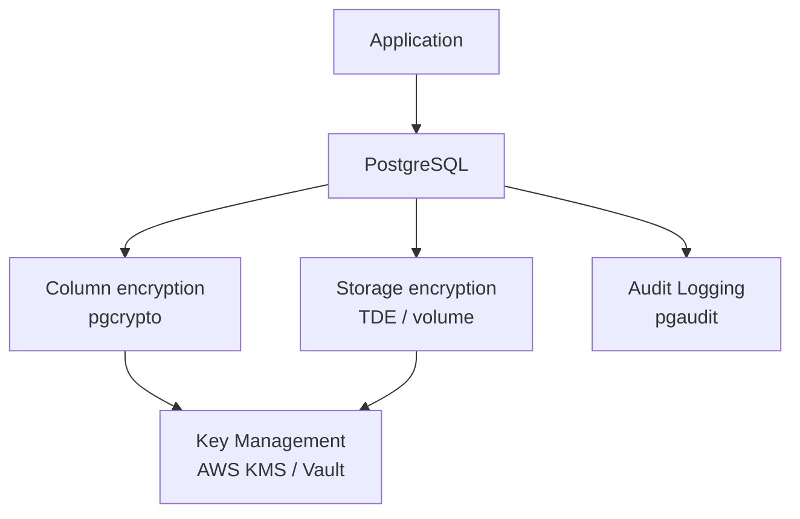

### 📶 Gradual Depth

**Level 1 - What it is:**
PCI-DSS requires that credit card numbers stored in your database must be encrypted or otherwise protected so that stealing the database files does not expose card numbers.

**Level 2 - How to use it:**
Use `pgcrypto` for column-level encryption of the PAN (Primary Account Number):

```sql
-- Encrypt
INSERT INTO payments (card_encrypted)
VALUES (
  pgp_sym_encrypt(
    '4111111111111111',
    current_setting('app.encryption_key')
  )
);
-- Decrypt
SELECT pgp_sym_decrypt(
  card_encrypted,
  current_setting('app.encryption_key')
) FROM payments WHERE id = 1;
```

Store the encryption key in an external KMS, not in the database or application configuration file.

**Level 3 - How it works:**
Column-level encryption: the application encrypts sensitive fields before INSERT and decrypts after SELECT. The database stores ciphertext. TDE (Transparent Data Encryption): the database engine encrypts/decrypts data pages transparently as they are written to / read from disk. The application sees plaintext. Volume encryption (dm-crypt, LUKS, AWS EBS encryption): the storage layer encrypts/decrypts entire disk volumes. The database engine sees plaintext.

Each layer protects against different threats:

- Volume encryption: protects against disk theft
- TDE: protects against filesystem access (OS-level breach)
- Column encryption: protects against database-level access (SQL injection, overprivileged roles)

**Level 4 - Production mastery:**
PCI-DSS v4.0 key requirements for databases:

- **Req 3.4:** Render PAN unreadable wherever stored (encryption, hashing, truncation, tokenization)
- **Req 3.5:** Protect encryption keys from disclosure and misuse
- **Req 3.6:** Key management procedures: generation, distribution, storage, rotation, destruction
- **Req 3.7:** Key rotation at least annually
- **Req 7:** Restrict access to cardholder data by business need-to-know
- **Req 10:** Log and monitor all access to cardholder data

For most applications, the strongest approach is tokenization: replace the PAN with a token before it reaches the database. The actual PAN is stored in a PCI-compliant token vault (e.g., Stripe, Braintree). The database never stores the real card number, dramatically reducing PCI scope.

### ⚙️ How It Works

**Phase 1 - Data discovery:** Identify all database columns storing cardholder data (PAN, cardholder name, service code, expiration date). Query the schema and application code to map every location.

**Phase 2 - Protection method selection:**

- PAN: encrypt with pgcrypto (column-level) or tokenize
- Cardholder name: may be stored in clear if other PCI controls are in place; encrypt if feasible
- Expiration date: may be stored in clear under PCI-DSS if PAN is protected
- CVV/CVC: MUST NOT be stored at all after authorization (PCI-DSS Req 3.3)

**Phase 3 - Implementation:**

```sql
-- Create encrypted column
ALTER TABLE payments
ADD COLUMN card_encrypted BYTEA;

-- Populate from cleartext (migration)
UPDATE payments
SET card_encrypted = pgp_sym_encrypt(
  card_number,
  current_setting('app.encryption_key')
);

-- Drop cleartext column after migration
ALTER TABLE payments
DROP COLUMN card_number;
```

**Phase 4 - Key management:**
Store the encryption key in AWS KMS, HashiCorp Vault, or an HSM. The database retrieves the key at startup via a custom GUC variable (`app.encryption_key`). Rotate the key annually: re-encrypt all rows with the new key, then destroy the old key.

**Phase 5 - Access control and audit:**

```sql
-- Restrict decryption to authorized role
REVOKE ALL ON payments FROM PUBLIC;
GRANT SELECT (id, amount, order_id)
  ON payments TO app_read;
GRANT SELECT ON payments
  TO pci_authorized;

-- Enable audit logging
-- postgresql.conf: pgaudit.log = 'read'
```

```
  Encryption Layers
  +--------------------------------+
  | Column encryption (pgcrypto)   |
  |  Protects: DB-level breach     |
  |  Key: in KMS, not in DB       |
  +--------------------------------+
  | TDE (transparent)              |
  |  Protects: filesystem access   |
  |  Key: in KMS, not on disk     |
  +--------------------------------+
  | Volume encryption (dm-crypt)   |
  |  Protects: physical disk theft |
  |  Key: in TPM or boot-time     |
  +--------------------------------+
```

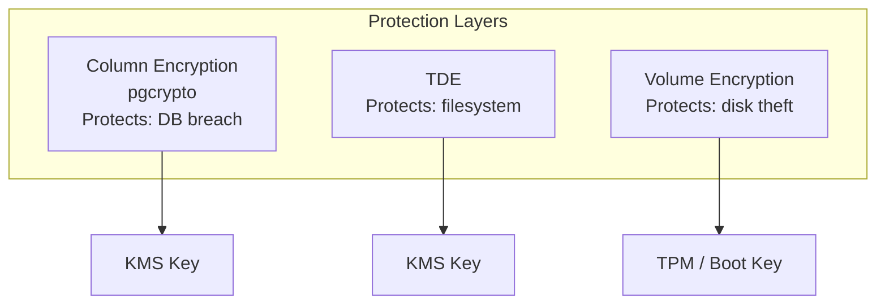

**BAD:**

```sql
CREATE TABLE keys (
  key_name TEXT, key_value TEXT
);
-- Attacker gets data AND key
```

**GOOD:**

```sql
SELECT pgp_sym_encrypt(
  card_number,
  current_setting(
    'app.encryption_key')
) FROM payments;
-- Key from external KMS at startup
```

### 🚨 Failure Modes

**Failure 1 - Encryption key stored alongside encrypted data:**
**Symptom:** Audit reveals the encryption key is stored in the same database, in an application config file on the same server, or hardcoded in application source code.
**Root cause:** Convenience over security; developers used the simplest key storage during development and never migrated to a KMS.
**Diagnostic:**

```
Search: application config files for
encryption key values.
Search: database tables for key
storage columns.
Search: source code for hardcoded keys.
Any match = PCI-DSS violation.
```

**Fix:** Migrate the key to an external KMS (AWS KMS, GCP KMS, HashiCorp Vault, or an HSM). The database/application retrieves the key at runtime via a secure API call. The key never persists on the database server's filesystem.

**Failure 2 - CVV/CVC stored post-authorization:**
**Symptom:** PCI audit discovers a database column storing CVV/CVC values after transaction authorization.
**Root cause:** Application stores the full card submission payload, including CVV, in a logging or transaction history table.
**Diagnostic:**

```sql
-- Search for CVV-like columns:
SELECT table_name, column_name
FROM information_schema.columns
WHERE column_name ILIKE '%cvv%'
   OR column_name ILIKE '%cvc%'
   OR column_name ILIKE '%security_code%';
```

**Fix:** Immediately delete all stored CVV data. Add application-level validation to strip CVV before any database write. Add a database CHECK constraint or trigger to prevent CVV storage.

### 🔬 Production Reality

The most practical approach for most applications: avoid storing cardholder data entirely. Use a payment processor (Stripe, Braintree, Adyen) that tokenizes card data. The application stores only a token (e.g., `tok_abc123`) in its database. The actual card number never touches the application's database. This reduces PCI scope from SAQ D (full assessment, 300+ requirements) to SAQ A (13 requirements). The cost of implementing full database encryption with key management typically exceeds the cost of using a tokenization service. The lesson: the best encryption strategy for cardholder data is to not store it at all.

### ⚖️ Trade-offs & Alternatives

| Aspect             | Column encryption (pgcrypto)     | TDE (full database)        | Volume encryption     | Tokenization (no storage) |
| ------------------ | -------------------------------- | -------------------------- | --------------------- | ------------------------- |
| PCI scope          | SAQ D (full)                     | SAQ D (full)               | SAQ D (full)          | SAQ A (minimal)           |
| Performance impact | High (per-query encrypt/decrypt) | Low (transparent)          | Negligible            | None (no card data)       |
| Query capability   | Cannot query encrypted columns   | Full SQL on decrypted data | Full SQL              | Query by token only       |
| Key management     | Required (per-column key)        | Required (cluster key)     | Required (volume key) | Handled by provider       |
| Protection level   | Application + DB breach          | Filesystem breach          | Physical theft only   | No card data to steal     |

### ⚡ Decision Snap

**USE WHEN:**

- Tokenization: always prefer this if a payment processor supports it (reduces PCI scope dramatically)
- Column encryption: business requirements mandate storing the actual PAN in the application's database
- TDE: compliance requires encryption at rest but queries need plaintext access (no per-query decrypt overhead)

**AVOID WHEN:**

- Never store CVV/CVC post-authorization under any circumstances
- Never implement encryption without a KMS - key storage alongside encrypted data provides no protection

**PREFER tokenization WHEN:**

- The application processes payments but does not need to display or re-use the full card number
- Reducing PCI scope is more valuable than retaining card data locally

### ⚠️ Top Traps

| #   | Misconception                                     | Reality                                                                                                                                                    |
| --- | ------------------------------------------------- | ---------------------------------------------------------------------------------------------------------------------------------------------------------- |
| 1   | Encryption at rest protects against SQL injection | Encryption at rest protects against physical/filesystem theft; SQL injection accesses decrypted data through the application layer                         |
| 2   | TDE satisfies all PCI-DSS encryption requirements | TDE protects against disk-level access but not database-level; PCI assessors may require additional column-level encryption depending on threat model      |
| 3   | PCI-DSS compliance means the system is secure     | PCI-DSS is a minimum standard; compliance does not prevent application-level vulnerabilities, insider threats, or architectural weaknesses                 |
| 4   | Hashing a PAN is sufficient protection            | Simple hashing of a 16-digit number with a known format (Luhn algorithm) can be brute-forced. If hashing, use a strong keyed hash (HMAC) with a secret key |
| 5   | Annual key rotation is automatic                  | Key rotation requires re-encrypting all stored data with the new key - a significant operational task that must be planned and tested                      |

### 🪜 Learning Ladder

**Prerequisites:**

- SQL-008 Data Types and Column Design - understand column types for encrypted data storage
- SQL-074 Database Security Fundamentals - general database security concepts
- SQL-090 Row-Level vs Table-Level Locking - understand access control mechanisms

**THIS:** SQL-112 PCI-DSS and Data-at-Rest Encryption

**Next steps:**

- SQL-120 Regulatory Compliance Architecture (SOC 2, GDPR, HIPAA) - broader compliance landscape
- SQL-121 Observability for Database Fleets - audit logging and monitoring for compliance
- SQL-113 Sharding Strategies - Application vs Proxy - data isolation patterns for compliance

**The Surprising Truth:**
The most common PCI-DSS finding in database audits is not weak encryption - it is card data stored in unexpected locations: log files, error tables, ETL staging tables, developer copies of production data, and backup files. The encryption on the payments table is strong, but the card number was also written to an application log, a debug table, and a data warehouse staging area - all in cleartext. Data discovery (finding every copy of cardholder data) is harder than data encryption.

**Further Reading:**

- PCI Security Standards Council: PCI DSS v4.0 (pcisecuritystandards.org)
- PostgreSQL Documentation: pgcrypto Extension (postgresql.org/docs/current/pgcrypto.html)
- NIST SP 800-57: Recommendation for Key Management (csrc.nist.gov/publications/detail/sp/800-57-part-1/rev-5/final)

**Revision Card:**

1. PCI-DSS Req 3 mandates rendering stored PAN unreadable - encryption, tokenization, truncation, or hashing
2. Tokenization (not storing card data) is the strongest strategy, reducing PCI scope from SAQ D to SAQ A
3. Key management is harder than encryption - keys must be in an external KMS, rotated annually, never stored alongside encrypted data
