## Keywords

1. [SQL-085 MVCC Internals - How Concurrent Reads Work](#sql-085-mvcc-internals---how-concurrent-reads-work)
2. [SQL-086 Write-Ahead Log (WAL) - Crash Recovery Mechanism](#sql-086-write-ahead-log-wal---crash-recovery-mechanism)
3. [SQL-087 Buffer Pool and Shared Memory Architecture](#sql-087-buffer-pool-and-shared-memory-architecture)
4. [SQL-088 Page Structure and Tuple Layout](#sql-088-page-structure-and-tuple-layout)
5. [SQL-089 VACUUM and Bloat Management (PostgreSQL)](#sql-089-vacuum-and-bloat-management-postgresql)
6. [SQL-090 Row-Level vs Table-Level Locking](#sql-090-row-level-vs-table-level-locking)
7. [SQL-091 Lock Escalation and Contention](#sql-091-lock-escalation-and-contention)
8. [SQL-092 Deadlock Detection and Resolution](#sql-092-deadlock-detection-and-resolution)
9. [SQL-093 Advisory Locks - Application-Level Coordination](#sql-093-advisory-locks---application-level-coordination)
10. [SQL-094 Query Planner and Cost-Based Optimization](#sql-094-query-planner-and-cost-based-optimization)
11. [SQL-095 Statistics and Cardinality Estimation](#sql-095-statistics-and-cardinality-estimation)
12. [SQL-096 Join Algorithms - Nested Loop, Hash, Merge](#sql-096-join-algorithms---nested-loop-hash-merge)
13. [SQL-097 Plan Regression and pg_stat_statements](#sql-097-plan-regression-and-pgstatstatements)
14. [SQL-098 Table Partitioning - Range, List, Hash](#sql-098-table-partitioning---range-list-hash)
15. [SQL-099 Partition Pruning and Query Routing](#sql-099-partition-pruning-and-query-routing)
16. [SQL-100 Logical Replication and Physical Replication](#sql-100-logical-replication-and-physical-replication)
17. [SQL-101 Read Replicas - Scaling Reads](#sql-101-read-replicas---scaling-reads)
18. [SQL-102 Connection Pooling - PgBouncer and HikariCP](#sql-102-connection-pooling---pgbouncer-and-hikaricp)
19. [SQL-103 Backup and Point-in-Time Recovery (PITR)](#sql-103-backup-and-point-in-time-recovery-pitr)
20. [SQL-104 Zero-Downtime Schema Migrations](#sql-104-zero-downtime-schema-migrations)
21. [SQL-105 GitLab Database Incident (2017)](#sql-105-gitlab-database-incident-2017)
22. [SQL-106 GitHub MySQL Failover Incident (2018)](#sql-106-github-mysql-failover-incident-2018)
23. [SQL-107 Unindexed Foreign Key Anti-Pattern](#sql-107-unindexed-foreign-key-anti-pattern)
24. [SQL-108 OFFSET Pagination at Scale Anti-Pattern](#sql-108-offset-pagination-at-scale-anti-pattern)
25. [SQL-109 Online Store DB - Phase 4 (Internals and Tuning)](#sql-109-online-store-db---phase-4-internals-and-tuning)
26. [SQL-110 SQL Expert-Level Mastery Verification](#sql-110-sql-expert-level-mastery-verification)
27. [SQL-111 SQL Deep-Dive Interview Questions](#sql-111-sql-deep-dive-interview-questions)
28. [SQL-112 PCI-DSS and Data-at-Rest Encryption](#sql-112-pci-dss-and-data-at-rest-encryption)

---

# SQL-085 MVCC Internals - How Concurrent Reads Work

**TL;DR** - MVCC lets readers see a consistent snapshot without blocking writers by keeping old tuple versions visible until no transaction needs them.

### 🔥 Problem Statement

Without concurrency control, two transactions reading and writing the same row produce corrupted or inconsistent results. Lock-based systems solve this by making readers wait for writers and vice versa, but throughput collapses under mixed read-write workloads. At scale - thousands of concurrent connections running analytical reads alongside OLTP writes - reader-writer contention becomes the dominant bottleneck. Response times spike, connection queues grow, and the database effectively serializes work that should run in parallel. Production systems need a mechanism that lets reads proceed without waiting for writes, while still guaranteeing each transaction sees a consistent view of the data.

### 📜 Historical Context

The concept of multi-version concurrency control traces back to Reed's 1978 MIT dissertation on naming and synchronization in decentralized systems. Bernstein and Goodman formalized MVCC theory in 1983. PostgreSQL adopted MVCC from its Postgres ancestor at UC Berkeley in the mid-1980s, storing old row versions directly in heap pages. Oracle implemented undo-segment-based MVCC starting with version 7 in 1992. The PostgreSQL approach - keeping dead tuples in-place until VACUUM removes them - trades storage bloat for architectural simplicity and avoids the undo-log bottleneck.

### 🔩 First Principles

**CORE INVARIANTS:**

1. Every write creates a new physical tuple version rather than overwriting the old one
2. Every transaction sees only tuples committed before its snapshot was taken
3. Old tuple versions remain accessible until no active transaction can reference them

**DERIVED DESIGN:**
These invariants force the engine to embed visibility metadata into every tuple. PostgreSQL stores `xmin` (creating transaction ID) and `xmax` (deleting transaction ID) in each tuple header. A reader checks these fields against its snapshot to decide visibility - no lock acquisition required. The price is that dead tuples accumulate and must be reclaimed by a background process (VACUUM).

**THE TRADE-OFF:**
**Gain:** Readers never block writers; writers never block readers. Read throughput scales linearly with connections.
**Cost:** Dead tuple accumulation requires background cleanup. Storage grows temporarily. Snapshot-too-old errors can occur with very long transactions.

### 🧠 Mental Model

> Think of a library where every book edit creates a new edition placed on the shelf next to the old one. Each reader gets a catalog card stamped with the date they entered the library, and they can only see editions published before that date. Writers add new editions freely without pulling old ones off the shelf.

- "Catalog card with entry date" -> transaction snapshot (xmin boundary)
- "Old edition staying on shelf" -> dead tuple awaiting VACUUM
- "New edition placed alongside" -> new tuple version with fresh xmin

**Where this analogy breaks down:** Real MVCC does not physically duplicate entire rows for unchanged columns; HOT (Heap-Only Tuple) updates avoid index overhead when indexed columns remain unchanged.

### 🧩 Components

- **Tuple header (xmin/xmax)** - visibility metadata stamped on every row version
- **Transaction snapshot** - the set of in-progress transaction IDs at snapshot time
- **Commit log (CLOG/pg_xact)** - bitmap recording committed vs aborted status per transaction
- **Visibility map** - per-page bitmap tracking pages where all tuples are visible to all transactions
- **VACUUM** - background reclaimer of dead tuples no longer visible to any snapshot

```
  Transaction          Heap Page
  Snapshot          +------------------+
  [xmin=100]        | Tuple v1 xmin=90 | <- visible
  [active={105}] -> | Tuple v2 xmin=105| <- invisible
                    | Tuple v3 xmin=98 | <- visible
                    +------------------+
                           |
                     CLOG lookup
                    (committed? yes/no)
```

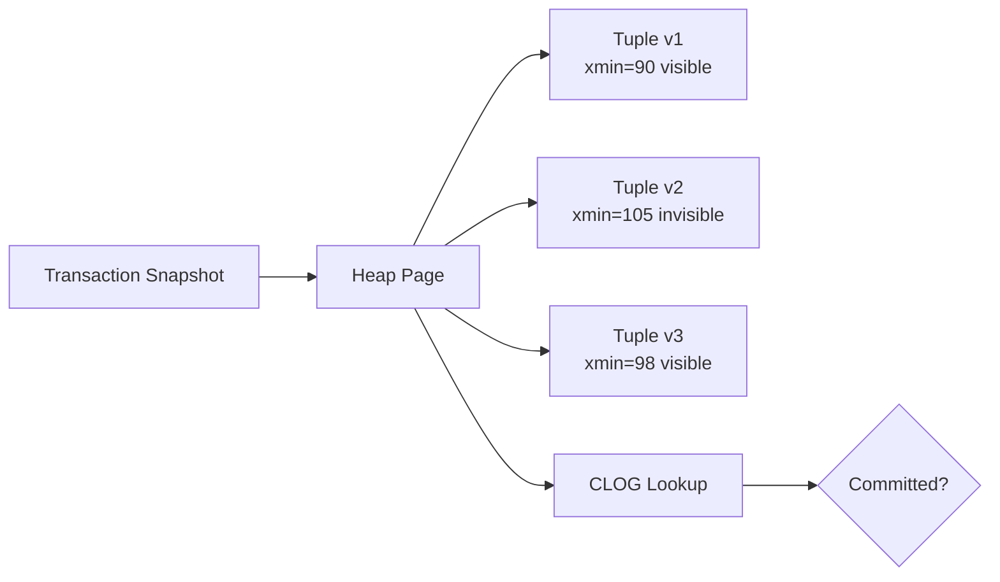
```mermaid
flowchart LR
    TX[Transaction Snapshot] --> HP[Heap Page]
    HP --> T1["Tuple v1\nxmin=90 visible"]
    HP --> T2["Tuple v2\nxmin=105 invisible"]
    HP --> T3["Tuple v3\nxmin=98 visible"]
    HP --> CLOG[CLOG Lookup]
    CLOG --> D{Committed?}
```

### 📶 Gradual Depth

**Level 1 - What it is:**
MVCC is a concurrency control method where the database keeps multiple physical versions of each row so that readers and writers do not block each other.

**Level 2 - How to use it:**
You do not enable MVCC - it is always on in PostgreSQL. Choose an isolation level (READ COMMITTED or REPEATABLE READ) to control when your snapshot refreshes. Use `SELECT ... FOR UPDATE` only when you need to prevent concurrent modifications, not for ordinary reads.

**Level 3 - How it works:**
Each INSERT stamps `xmin` with the current transaction ID. Each DELETE or UPDATE stamps `xmax` on the old version (and INSERT creates the new version with a fresh `xmin`). At read time, the executor checks each tuple: if `xmin` is committed and precedes the snapshot, and `xmax` is either unset, aborted, or from a transaction not yet visible, the tuple is visible. The CLOG provides commit/abort status in two bits per transaction.

**Level 4 - Production mastery:**
Long-running transactions pin old snapshots, preventing VACUUM from reclaiming dead tuples. This causes table bloat, index bloat, and eventually degraded sequential scan performance. Monitor `pg_stat_activity` for `xact_start` age, and set `old_snapshot_threshold` to limit snapshot lifetime. Watch `n_dead_tup` in `pg_stat_user_tables` to detect bloat before it impacts query plans. Autovacuum tuning (scale factor, threshold, cost delay) is the primary production lever.

### ⚙️ How It Works

**Phase 1 - Snapshot acquisition:** When a transaction begins (or, in READ COMMITTED, before each statement), PostgreSQL records the current transaction ID and the set of all in-progress transactions.

**Phase 2 - Tuple visibility check:** For each tuple on a heap page, the executor evaluates: Is `xmin` committed and before my snapshot? Is `xmax` absent, aborted, or invisible to me? Both true = visible.

**Phase 3 - CLOG consultation:** If the commit status of `xmin` or `xmax` is not yet cached in the tuple header hint bits, the executor reads `pg_xact` (CLOG) to determine committed vs aborted.

**Phase 4 - Hint bit setting:** Once resolved, the executor sets hint bits on the tuple to avoid repeated CLOG lookups on future reads.

```
  BEGIN (snapshot xid=200, active={203,207})
    |
    v
  Read page -> Tuple xmin=195, xmax=0
    |  195 < 200 and not in active set
    |  xmax=0 -> not deleted
    v
  VISIBLE -> return row
    |
  Read page -> Tuple xmin=203, xmax=0
    |  203 in active set
    v
  INVISIBLE -> skip row
```

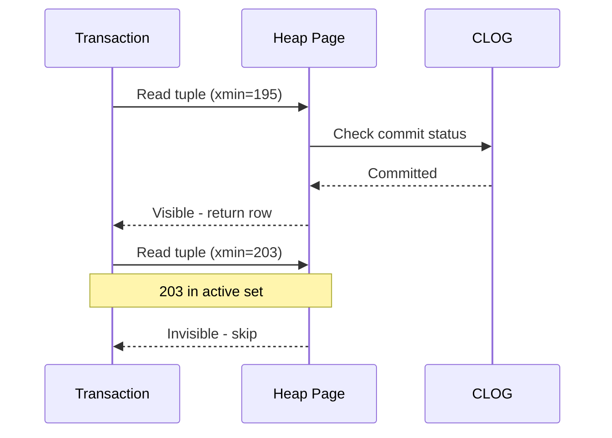
```mermaid
sequenceDiagram
    participant TX as Transaction
    participant HP as Heap Page
    participant CL as CLOG
    TX->>HP: Read tuple (xmin=195)
    HP->>CL: Check commit status
    CL-->>HP: Committed
    HP-->>TX: Visible - return row
    TX->>HP: Read tuple (xmin=203)
    Note over TX,HP: 203 in active set
    HP-->>TX: Invisible - skip
```

**BAD:**

```sql
-- Assuming UPDATE is atomic
UPDATE accounts SET balance = balance - 100
WHERE id = 1;
-- Another session reads stale balance
```

**GOOD:**

```sql
BEGIN ISOLATION LEVEL REPEATABLE READ;
SELECT balance FROM accounts
WHERE id = 1;
UPDATE accounts
SET balance = balance - 100
WHERE id = 1;
COMMIT;
```

### 🚨 Failure Modes

**Failure 1 - Table bloat from long-running transactions:**
**Symptom:** Table size grows continuously; sequential scans slow down; `pg_stat_user_tables.n_dead_tup` climbs.
**Root cause:** An idle-in-transaction session holds an old snapshot, preventing VACUUM from removing dead tuples.
**Diagnostic:**

```sql
SELECT pid, xact_start, state,
       age(backend_xid) AS xid_age
FROM pg_stat_activity
WHERE state = 'idle in transaction'
ORDER BY xact_start;
```

**Fix:** Set `idle_in_transaction_session_timeout` to terminate stale sessions. Set `old_snapshot_threshold` to bound snapshot age.

**Failure 2 - Transaction ID wraparound:**
**Symptom:** PostgreSQL logs warnings about approaching wraparound; eventually the database shuts down refusing writes to prevent data loss.
**Root cause:** Transaction IDs are 32-bit. After ~2 billion transactions without VACUUM freezing old tuples, the counter wraps and old tuples would appear to be in the future.
**Diagnostic:**

```sql
SELECT datname,
       age(datfrozenxid) AS xid_age
FROM pg_database
ORDER BY xid_age DESC;
```

**Fix:** Ensure autovacuum runs regularly. Monitor `age(datfrozenxid)` and alert when it exceeds 500 million. Emergency: run `VACUUM FREEZE` on affected tables.

### 🔬 Production Reality

A common production pattern: a reporting query runs for 30 minutes while OLTP writes churn thousands of rows per second. The reporting transaction holds a snapshot that prevents autovacuum from cleaning any tuples created or deleted after that snapshot. Over time, a 10 GB table balloons to 40 GB. Sequential scan time quadruples. Index scans degrade because the visibility map is stale and index-only scans fall back to heap fetches. The fix is architectural: run long analytical queries on a read replica where they hold a separate snapshot, or use `old_snapshot_threshold` (PostgreSQL 9.6+) to cancel snapshots older than a configured duration. The key insight is that MVCC's "readers don't block" guarantee has a hidden cost - readers can block cleanup.

### ⚖️ Trade-offs & Alternatives

| Aspect                 | PostgreSQL MVCC (heap) | Oracle MVCC (undo)   | MySQL/InnoDB (undo)   |
| ---------------------- | ---------------------- | -------------------- | --------------------- |
| Dead tuple storage     | In-place (heap)        | Undo tablespace      | Undo log              |
| Cleanup mechanism      | VACUUM                 | Automatic undo reuse | Purge thread          |
| Bloat risk             | High without VACUUM    | Low                  | Low                   |
| Read consistency       | Snapshot from CLOG     | Undo reconstruction  | Undo reconstruction   |
| Oldest snapshot impact | Blocks VACUUM          | Fills undo space     | "History list" growth |

### ⚡ Decision Snap

**USE WHEN:**

- Mixed read-write OLTP workloads requiring high concurrency
- Analytical reads must not block or be blocked by writes
- Application tolerates reading slightly stale (but consistent) data

**AVOID WHEN:**

- Single-writer systems where lock overhead is negligible
- Workloads dominated by long-running batch updates that create massive dead tuple volumes

**PREFER undo-based MVCC (Oracle/InnoDB) WHEN:**

- Operational burden of VACUUM tuning is unacceptable
- Dead tuple bloat is difficult to monitor in your environment

### ⚠️ Top Traps

| #   | Misconception                          | Reality                                                                                                                                         |
| --- | -------------------------------------- | ----------------------------------------------------------------------------------------------------------------------------------------------- |
| 1   | MVCC means no locks at all             | Writers still acquire row-level locks against concurrent writers; only reader-writer conflicts are eliminated                                   |
| 2   | REPEATABLE READ prevents all anomalies | PostgreSQL REPEATABLE READ allows serialization anomalies; only SERIALIZABLE uses predicate locking to prevent them                             |
| 3   | VACUUM is optional maintenance         | Without VACUUM, the database will eventually halt on transaction ID wraparound - it is a correctness requirement, not a performance tuning knob |
| 4   | More connections = more throughput     | Each connection holding a snapshot extends the cleanup horizon; beyond a threshold, more connections cause bloat that degrades all queries      |
| 5   | Dead tuples only waste disk space      | Dead tuples waste buffer pool memory, increase I/O for sequential scans, and cause index bloat that degrades random access patterns             |

### 🪜 Learning Ladder

**Prerequisites:**

- SQL-039 ACID Properties - What They Actually Mean - understand isolation guarantees MVCC provides
- SQL-067 Transaction Isolation Levels - know what READ COMMITTED vs REPEATABLE READ means
- SQL-069 Optimistic vs Pessimistic Locking - contrast with lock-based concurrency

**THIS:** SQL-085 MVCC Internals - How Concurrent Reads Work

**Next steps:**

- SQL-088 Page Structure and Tuple Layout - see how xmin/xmax live inside physical tuples
- SQL-089 VACUUM and Bloat Management (PostgreSQL) - understand cleanup of dead tuples MVCC creates
- SQL-092 Deadlock Detection and Resolution - what happens when writer-writer conflicts escalate

**The Surprising Truth:**
PostgreSQL's MVCC design means a simple `SELECT` query that runs for hours can cause more production damage than a burst of heavy writes - because the snapshot it holds prevents dead tuple cleanup across the entire database, not just the tables it reads.

**Further Reading:**

- PostgreSQL Documentation: Chapter 13, Concurrency Control (postgresql.org/docs/current/mvcc.html)
- Reed, D.P. "Naming and Synchronization in a Decentralized Computer System", MIT PhD Dissertation, 1978
- Berenson et al. "A Critique of ANSI SQL Isolation Levels", ACM SIGMOD 1995

**Revision Card:**

1. MVCC keeps old row versions so readers never wait for writers - but dead versions must be cleaned up
2. The trade-off is storage bloat: in-heap dead tuples vs undo-log reconstruction
3. Long-running transactions silently block VACUUM, causing the most common PostgreSQL production incident

---

---

# SQL-086 Write-Ahead Log (WAL) - Crash Recovery Mechanism

**TL;DR** - WAL records every data change to a sequential log before modifying actual pages, enabling crash recovery by replaying committed changes after restart.

### 🔥 Problem Statement

Databases buffer modified pages in memory for performance. If the server crashes before dirty pages are flushed to disk, committed transactions are lost. Flushing every page synchronously after each commit would reduce throughput to disk seek speed - roughly 100-200 transactions per second on spinning disks. At production scale with thousands of commits per second, you need a mechanism that guarantees durability without synchronous page flushes. The write-ahead log solves this by sequentially writing a compact change record before acknowledging the commit, making crash recovery possible by replaying the log.

### 📜 Historical Context

Write-ahead logging originates from the ARIES (Algorithm for Recovery and Isolation Exploiting Semantics) paper by Mohan et al. at IBM Research in 1992. ARIES formalized three principles: write-ahead logging, repeating history during redo, and logging changes during undo. PostgreSQL implemented WAL in version 7.1 (2001), replacing the earlier approach that required clean shutdowns. Every major RDBMS uses some variant of WAL: Oracle's redo logs, SQL Server's transaction log, MySQL/InnoDB's redo log.

### 🔩 First Principles

**CORE INVARIANTS:**

1. No dirty page is flushed to disk until its corresponding WAL record has been flushed (the WAL protocol)
2. WAL writes are sequential and append-only, making them orders of magnitude faster than random page writes
3. The WAL contains sufficient information to reconstruct any committed change from the last checkpoint

**DERIVED DESIGN:**
Because WAL records are sequential, a single disk can sustain high commit throughput even with fsync. The checkpoint process periodically flushes all dirty pages, advancing the recovery start point and allowing old WAL segments to be recycled. This decouples commit latency (WAL flush) from background I/O (page flush).

**THE TRADE-OFF:**
**Gain:** Durability with high commit throughput; crash recovery in seconds to minutes instead of data loss.
**Cost:** Extra I/O for WAL writes; disk space for WAL segments; recovery time proportional to WAL since last checkpoint.

### 🧠 Mental Model

> Think of a cashier who writes every sale in a logbook before putting money in the register drawer. If the drawer jams and spills, the cashier rebuilds the drawer contents by reading the logbook from the last verified count.

- "Logbook entry" -> WAL record
- "Putting money in drawer" -> flushing dirty page to data file
- "Last verified count" -> checkpoint

**Where this analogy breaks down:** WAL records are not human-readable summaries - they contain byte-level diffs of page modifications, and recovery replays them mechanically rather than interpretively.

### 🧩 Components

- **WAL record** - binary entry describing a page modification (LSN, transaction ID, block reference, data diff)
- **WAL buffer** - shared memory region where WAL records accumulate before flush
- **WAL segment files** - 16 MB files (by default) in `pg_wal/` directory, sequentially numbered
- **LSN (Log Sequence Number)** - monotonically increasing byte offset identifying each WAL record's position
- **Checkpoint** - process that flushes all dirty buffers and records a recovery start point
- **WAL writer** - background process that flushes WAL buffers periodically
- **WAL archiver** - copies completed segments to archive storage for PITR

```
  Transaction Commit Flow
  +-----------+    +------------+    +-----------+
  | SQL Write | -> | WAL Buffer | -> | WAL Disk  |
  +-----------+    +------------+    +-----------+
       |                                   |
       v                                   |
  +------------+                     (fsync at
  | Dirty Page |                      commit)
  | in Buffer  |
  |   Pool     | --- checkpoint ---> Data Files
  +------------+
```

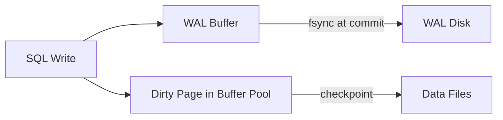
```mermaid
flowchart LR
    SQL[SQL Write] --> WB[WAL Buffer]
    WB -->|fsync at commit| WD[WAL Disk]
    SQL --> DP[Dirty Page in Buffer Pool]
    DP -->|checkpoint| DF[Data Files]
```

### 📶 Gradual Depth

**Level 1 - What it is:**
WAL is a durability mechanism. Every change is written to a log file before the actual data file is updated. If the database crashes, it replays the log to recover committed changes.

**Level 2 - How to use it:**
Configure `wal_level` (minimal, replica, logical) based on replication needs. Set `checkpoint_timeout` and `max_wal_size` to balance recovery time against checkpoint I/O spikes. Use `archive_mode` and `archive_command` to ship WAL for backups.

**Level 3 - How it works:**
When a backend modifies a page, it first constructs a WAL record containing the page diff, appends it to the WAL buffer, and marks the buffer page dirty. At commit, `XLogFlush` forces all WAL up to the commit record's LSN to disk via fsync. The dirty page stays in the buffer pool - it will be written to the data file during a later checkpoint or when evicted by the buffer replacement algorithm.

**Level 4 - Production mastery:**
Checkpoint spikes are the primary WAL-related production issue. A checkpoint flushes potentially gigabytes of dirty pages, causing I/O saturation. Spread checkpoints with `checkpoint_completion_target` (typically 0.9). Monitor `pg_stat_bgwriter` for `checkpoints_req` (forced checkpoints from WAL size) vs `checkpoints_timed`. Place WAL on a separate physical volume to isolate sequential WAL writes from random data file I/O. In replication setups, `wal_keep_size` or replication slots prevent WAL recycling before replicas consume it.

### ⚙️ How It Works

**Phase 1 - WAL record creation:** Backend constructs a binary record with the page block number, offset, and before/after bytes. Full-page images (FPI) are included for the first modification after each checkpoint to protect against torn pages.

**Phase 2 - WAL buffer insertion:** The record is appended to the shared WAL buffer at the current insert position. Multiple backends can insert concurrently using WAL insert locks.

**Phase 3 - Commit flush:** At COMMIT, the backend calls `XLogFlush(commitLSN)`, which ensures all WAL up to that LSN is fsynced to disk. Group commit batches multiple concurrent commits into a single fsync.

**Phase 4 - Checkpoint cycle:** Periodically, the checkpointer flushes all dirty buffers whose oldest modification LSN is older than the checkpoint LSN, writes a checkpoint record, and updates `pg_control`. WAL segments before the checkpoint are eligible for recycling.

**Phase 5 - Crash recovery:** On restart, PostgreSQL reads the last checkpoint from `pg_control`, then replays all WAL records from that checkpoint's redo LSN forward, applying changes to data pages. Uncommitted transactions are rolled back.

```
  Crash Recovery Timeline
  CHECKPOINT          CRASH        RESTART
      |                 |              |
      v                 v              v
  [---WAL segment 1---][---seg 2---]
      ^                              ^
      |-- redo starts here           |
                          replay --->|
                          done -> open for business
```

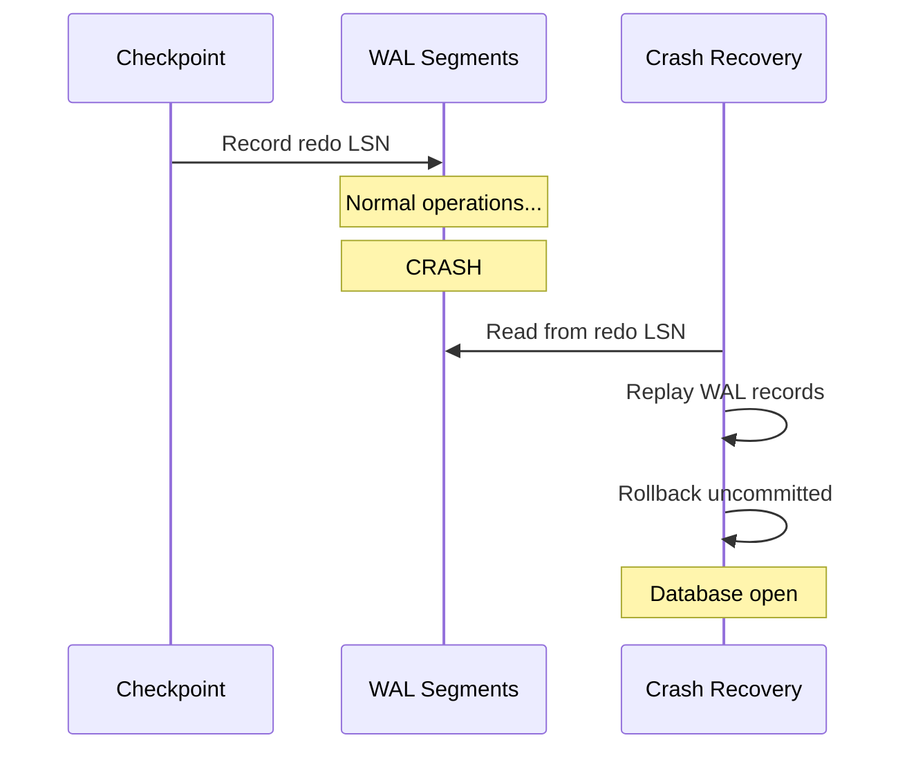
```mermaid
sequenceDiagram
    participant CP as Checkpoint
    participant WAL as WAL Segments
    participant CR as Crash Recovery
    CP->>WAL: Record redo LSN
    Note over WAL: Normal operations...
    Note over WAL: CRASH
    CR->>WAL: Read from redo LSN
    CR->>CR: Replay WAL records
    CR->>CR: Rollback uncommitted
    Note over CR: Database open
```

**BAD:**

```sql
-- Disabling fsync for speed
ALTER SYSTEM SET fsync = off;
-- Crash = unrecoverable data loss
```

**GOOD:**

```sql
ALTER SYSTEM
SET checkpoint_timeout = '10min';
ALTER SYSTEM
SET checkpoint_completion_target = 0.9;
-- Spreads I/O; keeps durability
```

### 🚨 Failure Modes

**Failure 1 - WAL disk full:**
**Symptom:** All transactions block; PostgreSQL logs "No space left on device" for WAL writes. Database effectively halts.
**Root cause:** WAL archiving fell behind, or `max_wal_size` was reached and old segments cannot be recycled because a replication slot holds them.
**Diagnostic:**

```bash
df -h /path/to/pg_wal/
SELECT slot_name, active,
       pg_wal_lsn_diff(
         pg_current_wal_lsn(),
         restart_lsn
       ) AS retained_bytes
FROM pg_replication_slots;
```

**Fix:** Drop inactive replication slots. Increase WAL volume size. Fix the archive command so completed segments are removed after archiving.

**Failure 2 - Checkpoint I/O storm:**
**Symptom:** Periodic latency spikes every `checkpoint_timeout` seconds. `pg_stat_bgwriter.checkpoints_req` grows (forced checkpoints).
**Root cause:** `max_wal_size` is too small, forcing frequent checkpoints, or `checkpoint_completion_target` is too low, causing bursty flushes.
**Diagnostic:**

```sql
SELECT checkpoints_timed,
       checkpoints_req,
       buffers_checkpoint,
       checkpoint_write_time,
       checkpoint_sync_time
FROM pg_stat_bgwriter;
```

**Fix:** Increase `max_wal_size` to reduce checkpoint frequency. Set `checkpoint_completion_target = 0.9` to spread I/O. Move WAL to a dedicated disk.

### 🔬 Production Reality

A typical production incident: a monitoring system shows periodic 2-3 second latency spikes exactly every 5 minutes. Investigation reveals `checkpoint_timeout = 5min` with `checkpoint_completion_target = 0.5`, meaning the checkpointer tries to flush all dirty pages in 2.5 minutes - creating an I/O storm that competes with query I/O. The fix: increase `max_wal_size` from 1 GB to 4-8 GB, set `checkpoint_completion_target = 0.9`, and verify with `pg_stat_bgwriter` that `checkpoints_req` drops to zero (all checkpoints are timed, not forced). The deeper lesson: WAL configuration is not about write throughput - it is about controlling when and how aggressively dirty pages get flushed.

### ⚖️ Trade-offs & Alternatives

| Aspect            | PostgreSQL WAL                  | Oracle Redo Log            | MySQL InnoDB Redo          |
| ----------------- | ------------------------------- | -------------------------- | -------------------------- |
| Segment model     | Rolling files in pg_wal         | Fixed-size redo log groups | Fixed-size redo log files  |
| Full page writes  | After each checkpoint           | Not needed (redo + undo)   | Doublewrite buffer instead |
| Archive mechanism | archive_command / pg_receivewal | RMAN archive               | binlog + redo              |
| Replication basis | Physical or logical WAL         | Redo shipping or LogMiner  | Binlog (logical)           |
| Compression       | wal_compression (LZ4/zstd)      | Not built-in               | Not built-in               |

### ⚡ Decision Snap

**USE WHEN:**

- You need crash-safe durability (always - WAL is not optional in PostgreSQL)
- Setting up replication or point-in-time recovery
- Auditing change history via WAL decoding tools

**AVOID WHEN:**

- Ephemeral/disposable data where durability is unnecessary (use UNLOGGED tables instead)
- Bulk loading where WAL overhead dominates (use COPY with reduced WAL level)

**PREFER UNLOGGED tables WHEN:**

- Data is easily reconstructable (caches, staging tables, ETL intermediates)
- WAL overhead of high-churn tables is unacceptable and crash loss is tolerable

### ⚠️ Top Traps

| #   | Misconception                             | Reality                                                                                                                        |
| --- | ----------------------------------------- | ------------------------------------------------------------------------------------------------------------------------------ |
| 1   | WAL is only for crash recovery            | WAL is also the foundation for streaming replication, PITR, logical decoding, and change data capture                          |
| 2   | Larger max_wal_size means more disk usage | It controls checkpoint frequency; actual WAL disk usage depends on write rate and archiving speed                              |
| 3   | synchronous_commit = off means data loss  | It means up to ~600ms of recent commits may be lost on crash; the database remains consistent, just missing the latest commits |
| 4   | Full page images are wasteful overhead    | FPIs protect against torn pages - without them, a crash mid-page-write corrupts data permanently                               |
| 5   | WAL replay is instant                     | Recovery time is proportional to WAL volume since last checkpoint; a 30 GB WAL backlog can take minutes to replay              |

### 🪜 Learning Ladder

**Prerequisites:**

- SQL-039 ACID Properties - What They Actually Mean - understand the D in ACID that WAL provides
- SQL-041 B-Tree Index Basics - know what data structures WAL protects on disk

**THIS:** SQL-086 Write-Ahead Log (WAL) - Crash Recovery Mechanism

**Next steps:**

- SQL-087 Buffer Pool and Shared Memory Architecture - understand where dirty pages live before WAL flushes
- SQL-103 Backup and Point-in-Time Recovery (PITR) - WAL archiving as the basis for backup
- SQL-100 Logical Replication and Physical Replication - WAL as the replication transport

**The Surprising Truth:**
The biggest WAL-related production problem is not crashes - it is checkpoint storms. Most teams tune WAL for durability but forget that checkpoint behavior controls the I/O pattern of their entire database. A poorly tuned checkpoint creates periodic latency spikes that look like application bugs.

**Further Reading:**

- Mohan et al. "ARIES: A Transaction Recovery Method Supporting Fine-Granularity Locking and Partial Rollbacks" - ACM TODS, 1992
- PostgreSQL Documentation: Chapter 30, Reliability and the Write-Ahead Log (postgresql.org/docs/current/wal.html)
- PostgreSQL Documentation: WAL Configuration (postgresql.org/docs/current/wal-configuration.html)

**Revision Card:**

1. WAL writes change records sequentially before modifying data pages - this is how durability works without synchronous page flushes
2. The trade-off is checkpoint tuning: too frequent = I/O storms, too infrequent = long recovery
3. WAL disk full halts the entire database - monitor pg_wal size and replication slot retention

---

---

# SQL-087 Buffer Pool and Shared Memory Architecture

**TL;DR** - The buffer pool caches data pages in shared memory so queries read from RAM instead of disk, using clock-sweep eviction to balance hot and cold pages.

### 🔥 Problem Statement

Disk I/O is the fundamental bottleneck of database performance. A random 8 KB page read from SSD takes roughly 100 microseconds; from spinning disk, 5-10 milliseconds. A complex query touching thousands of pages cannot afford to read each from disk. At production scale - millions of queries per hour - the database needs a large in-memory cache of frequently accessed pages, with an eviction policy that keeps hot pages resident and replaces cold ones. Without a well-tuned buffer pool, every query degrades to disk speed, connection pools saturate, and the system becomes I/O-bound.

### 📜 Historical Context

Buffer pool management has been central to database design since System R at IBM in the 1970s. Early systems used simple LRU (Least Recently Used) eviction, but LRU performs poorly with sequential scan workloads that flush the entire cache. PostgreSQL uses a clock-sweep algorithm (an approximation of LRU) with a dedicated ring buffer for sequential scans to prevent cache pollution. The `shared_buffers` parameter, typically set to 25% of system RAM, has been the single most important PostgreSQL tuning knob since version 7.x.

### 🔩 First Principles

**CORE INVARIANTS:**

1. Every page access goes through the buffer pool - there is no direct disk I/O path for queries
2. A page in the buffer pool may be clean (matches disk) or dirty (modified, pending flush)
3. Eviction can only remove a page that is not pinned by any active backend and not dirty without WAL-flush protection

**DERIVED DESIGN:**
The buffer pool is a hash table mapping (tablespace, relation, fork, block number) to a buffer slot. Each slot has a pin count (active references), a usage count (clock-sweep weight), and a dirty flag. The clock-sweep algorithm circles through slots, decrementing usage counts until it finds a slot with usage=0 and pin=0 to evict.

**THE TRADE-OFF:**
**Gain:** Orders-of-magnitude reduction in disk I/O; queries operate at memory speed for cached pages.
**Cost:** Shared memory consumption; double-buffering with the OS page cache wastes RAM; checkpoint I/O to flush dirty pages.

### 🧠 Mental Model

> Think of the buffer pool as a hotel with a fixed number of rooms. Each room holds one guest (page). When a new guest arrives and the hotel is full, the concierge (clock-sweep) walks the hallway checking: "Has anyone visited this room recently?" Rooms with no recent visits get reassigned to the new guest.

- "Hotel room" -> buffer pool slot (8 KB page frame)
- "Concierge walk" -> clock-sweep eviction pass
- "Recent visit flag" -> usage count on the buffer descriptor

**Where this analogy breaks down:** The buffer pool also has a "ring buffer" shortcut for large sequential scans - like a separate small hallway that prevents a single large group from evicting all the regular guests.

### 🧩 Components

- **shared_buffers** - total buffer pool size (configured in postgresql.conf)
- **Buffer descriptor** - metadata per slot: tag, pin count, usage count, dirty flag, I/O-in-progress lock
- **Buffer hash table** - maps (relation, block) to buffer slot index
- **Clock-sweep** - eviction algorithm scanning descriptors in circular order
- **Ring buffer** - small private buffer (256 KB) for large sequential scans, bulk writes, and VACUUM
- **Background writer** - proactively flushes dirty pages to maintain a pool of clean evictable pages
- **Checkpointer** - periodically flushes all dirty pages and advances the WAL recovery point

```
  Shared Memory Layout (simplified)
  +-------------------------------------+
  | shared_buffers (e.g. 4 GB)          |
  | +------+------+------+------+       |
  | | Slot | Slot | Slot | Slot | ...   |
  | | 8KB  | 8KB  | 8KB  | 8KB  |      |
  | +------+------+------+------+       |
  | Buffer Hash Table                   |
  | WAL Buffers                         |
  | CLOG / Commit Log Buffers           |
  | Lock Tables                         |
  +-------------------------------------+
        |            |
        v            v
    OS Page       Data Files
     Cache         on Disk
```

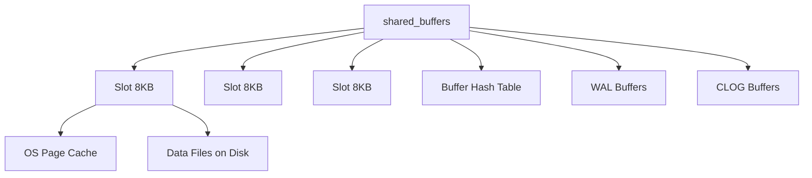
```mermaid
flowchart TD
    SB[shared_buffers] --> S1[Slot 8KB]
    SB --> S2[Slot 8KB]
    SB --> S3[Slot 8KB]
    SB --> BHT[Buffer Hash Table]
    SB --> WB[WAL Buffers]
    SB --> CL[CLOG Buffers]
    S1 --> OS[OS Page Cache]
    S1 --> DF[Data Files on Disk]
```

### 📶 Gradual Depth

**Level 1 - What it is:**
The buffer pool is a chunk of shared memory that caches database pages. When a query needs a page, it checks the buffer pool first. If the page is there (a "hit"), it avoids a disk read entirely.

**Level 2 - How to use it:**
Set `shared_buffers` to approximately 25% of system RAM (the canonical starting point). Monitor the buffer cache hit ratio via `pg_stat_database.blks_hit / (blks_hit + blks_read)`. A ratio below 99% on OLTP workloads typically indicates insufficient buffer pool or a working set larger than memory.

**Level 3 - How it works:**
When a backend needs block N of table T, it hashes (T, N) to find the buffer slot. If present and valid, it pins the slot (incrementing pin count) and increments the usage count. If absent, the clock-sweep finds a victim slot, reads the page from disk (or OS page cache), and inserts it. If the victim was dirty, it must be flushed to disk first. The ring buffer mechanism allocates a small private buffer ring for sequential scans larger than 25% of `shared_buffers`, preventing cache thrashing.

**Level 4 - Production mastery:**
The double-buffering problem: PostgreSQL caches pages in `shared_buffers`, and the OS also caches the same pages in its page cache. Setting `shared_buffers` too high (e.g., 75% of RAM) starves the OS page cache, causing performance degradation. On Linux, use huge pages (`huge_pages = try`) to reduce TLB pressure for large buffer pools. Monitor `pg_buffercache` extension to inspect which relations occupy buffer pool slots. Watch `bgwriter` stats: high `buffers_alloc` with low `buffers_clean` means the background writer is not keeping up, and backends are doing their own eviction writes (bad for latency).

### ⚙️ How It Works

**Phase 1 - Page request:** Backend calls `ReadBuffer(relation, blockNum)`. The buffer manager hashes the block identifier and searches the buffer hash table.

**Phase 2 - Cache hit:** If found, pin the buffer (atomic increment of pin count), increment usage count (capped at 5), and return the buffer pointer. The backend reads or modifies the page in-place.

**Phase 3 - Cache miss:** If not found, the clock-sweep scans buffer descriptors. For each descriptor: if pin count = 0 and usage count = 0, select as victim. Otherwise, decrement usage count and move to the next. If the victim is dirty, flush it to disk first.

**Phase 4 - Page load:** Read the 8 KB page from disk into the victim slot. Insert the new mapping into the buffer hash table. Pin the buffer and return.

```
  Clock-Sweep Eviction
  Slots: [U=3] [U=1] [U=0,P=0] [U=2]
           |      |       ^        |
           v      v       |        v
         U=2    U=0    EVICT!    U=1
          (decrement)  (victim)
```

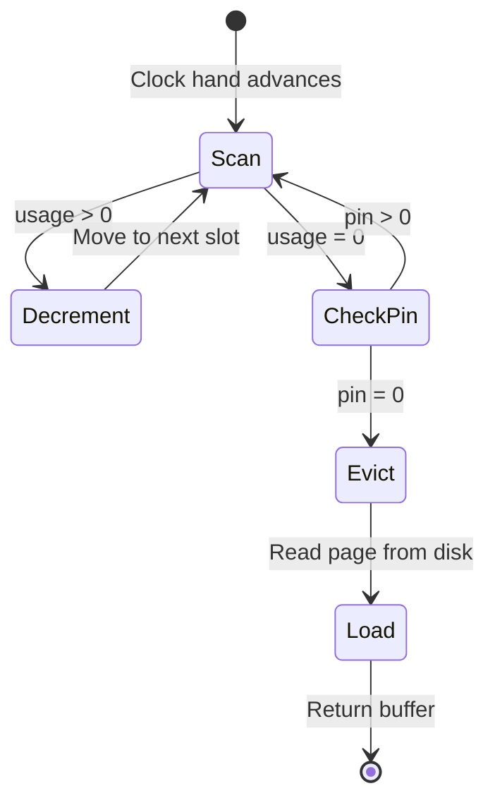
```mermaid
stateDiagram-v2
    [*] --> Scan: Clock hand advances
    Scan --> Decrement: usage > 0
    Decrement --> Scan: Move to next slot
    Scan --> CheckPin: usage = 0
    CheckPin --> Evict: pin = 0
    CheckPin --> Scan: pin > 0
    Evict --> Load: Read page from disk
    Load --> [*]: Return buffer
```

**BAD:**

```sql
-- 80% of RAM to shared_buffers
ALTER SYSTEM
SET shared_buffers = '48GB';
-- Starves OS page cache
```

**GOOD:**

```sql
-- 25% of RAM; OS caches the rest
ALTER SYSTEM
SET shared_buffers = '16GB';
ALTER SYSTEM
SET effective_cache_size = '48GB';
```

### 🚨 Failure Modes

**Failure 1 - Buffer pool thrashing from sequential scans:**
**Symptom:** Buffer cache hit ratio drops sharply during reporting queries. OLTP queries suddenly slow down.
**Root cause:** A large sequential scan without the ring buffer optimization (e.g., on pre-9.3 PostgreSQL or with very small tables that do not trigger the ring buffer) evicts hot OLTP pages.
**Diagnostic:**

```sql
SELECT relname,
       heap_blks_read, heap_blks_hit,
       round(100.0 * heap_blks_hit /
         nullif(heap_blks_hit +
                heap_blks_read, 0), 1)
         AS hit_pct
FROM pg_statio_user_tables
ORDER BY heap_blks_read DESC LIMIT 10;
```

**Fix:** Ensure large scans use partitioned tables or materialized views. Move analytical queries to read replicas. The ring buffer mechanism handles most cases automatically, but verify it is engaging for your scan sizes.

**Failure 2 - Backend writes causing latency spikes:**
**Symptom:** Sporadic high-latency queries. `pg_stat_bgwriter.buffers_backend` is high relative to `buffers_clean`.
**Root cause:** The background writer is not keeping enough clean pages available. Backends performing eviction must write dirty pages synchronously before they can load the needed page.
**Diagnostic:**

```sql
SELECT buffers_checkpoint,
       buffers_clean,
       buffers_backend,
       maxwritten_clean
FROM pg_stat_bgwriter;
```

**Fix:** Increase `bgwriter_lru_maxpages` and reduce `bgwriter_delay` to make the background writer more aggressive. Ensure `shared_buffers` is not oversized relative to workload hot set.

### 🔬 Production Reality

A typical pattern in production: a team sets `shared_buffers = 32 GB` on a 64 GB server, leaving only 32 GB for the OS. With a 200 GB database, most reads go through the OS page cache after missing the buffer pool. The OS page cache is efficient for this, but with 32 GB of `shared_buffers`, the database process uses huge amounts of virtual memory, causing TLB misses on every buffer pool access. Enabling `huge_pages = try` with the OS configured for HugePages cuts TLB miss overhead significantly. The lesson: `shared_buffers` sizing is not "bigger is better" - it is about balancing PostgreSQL's managed cache against the OS's page cache, and using huge pages when the buffer pool exceeds a few gigabytes.

### ⚖️ Trade-offs & Alternatives

| Aspect                     | PostgreSQL shared_buffers | MySQL InnoDB Buffer Pool             | Oracle SGA/Buffer Cache |
| -------------------------- | ------------------------- | ------------------------------------ | ----------------------- |
| Eviction algorithm         | Clock-sweep               | Modified LRU with young/old sublists | Touch-count LRU         |
| Sequential scan protection | Ring buffer               | Midpoint insertion                   | Direct path reads       |
| OS page cache reliance     | High (double buffering)   | Moderate (O_DIRECT option)           | Low (O_DIRECT typical)  |
| Typical sizing             | 25% of RAM                | 70-80% of RAM                        | 60-80% of SGA           |
| Dynamic resize             | Requires restart          | Online resize                        | Online resize           |

### ⚡ Decision Snap

**USE WHEN:**

- Every PostgreSQL deployment uses the buffer pool - it is not optional
- Tuning `shared_buffers` is the first performance optimization for any workload
- Understanding buffer pool behavior is essential for diagnosing I/O-related latency

**AVOID WHEN:**

- Do not set `shared_buffers` above 40% of RAM on Linux without careful benchmarking
- Do not rely solely on buffer pool hit ratio - it hides sequential scan pollution

**PREFER direct I/O (O_DIRECT, not available in PostgreSQL) WHEN:**

- Double-buffering overhead is measurable (Oracle and MySQL support this)
- The database manages its own cache entirely and the OS page cache adds no value

### ⚠️ Top Traps

| #   | Misconception                                        | Reality                                                                                                     |
| --- | ---------------------------------------------------- | ----------------------------------------------------------------------------------------------------------- |
| 1   | Set shared_buffers as large as possible              | Beyond 25-40% of RAM, you starve the OS page cache and performance degrades due to double buffering         |
| 2   | 99% hit ratio means the buffer pool is well-sized    | A 99% hit ratio can mask sequential scan pollution - check per-table hit ratios, not just the global number |
| 3   | The background writer handles all dirty page flushes | If bgwriter falls behind, backends write dirty pages themselves, causing unpredictable latency spikes       |
| 4   | PostgreSQL uses O_DIRECT like Oracle/MySQL           | PostgreSQL relies on the OS page cache for reads that miss shared_buffers; there is no O_DIRECT support     |
| 5   | Buffer pool only caches table data                   | It also caches index pages, TOAST pages, free space map pages, and visibility map pages                     |

### 🪜 Learning Ladder

**Prerequisites:**

- SQL-041 B-Tree Index Basics - understand what page structures are being cached
- SQL-086 Write-Ahead Log (WAL) - Crash Recovery Mechanism - know how dirty pages relate to WAL and checkpoints

**THIS:** SQL-087 Buffer Pool and Shared Memory Architecture

**Next steps:**

- SQL-088 Page Structure and Tuple Layout - see what lives inside each 8 KB cached page
- SQL-094 Query Planner and Cost-Based Optimization - understand how the planner estimates I/O cost based on cache behavior
- SQL-102 Connection Pooling - PgBouncer and HikariCP - manage connection count to control buffer pool pressure

**The Surprising Truth:**
PostgreSQL intentionally under-sizes its buffer pool relative to Oracle or MySQL because it depends on the operating system's page cache as a second-level cache. This "double buffering" design means the OS does useful read-ahead and caching for free, but it also means tuning PostgreSQL memory requires understanding OS memory management - a skill most application engineers never develop.

**Further Reading:**

- PostgreSQL Documentation: Resource Consumption, shared_buffers (postgresql.org/docs/current/runtime-config-resource.html)
- PostgreSQL Documentation: pg_buffercache extension (postgresql.org/docs/current/pgbuffercache.html)
- Comer, D. "The Ubiquitous B-Tree" - ACM Computing Surveys, 1979 (foundational for understanding page-based storage)

**Revision Card:**

1. The buffer pool caches 8 KB pages in shared memory; clock-sweep eviction keeps hot pages resident
2. Set shared_buffers to ~25% of RAM on Linux - bigger is not better due to OS page cache double buffering
3. When buffers_backend is high in pg_stat_bgwriter, backends are doing synchronous eviction writes - tune bgwriter

---

---

# SQL-088 Page Structure and Tuple Layout

**TL;DR** - PostgreSQL stores rows as tuples inside fixed-size 8 KB pages with a header, line pointer array, and heap tuples packed from the page end backward.

### 🔥 Problem Statement

Applications think in rows and columns, but disks think in blocks. The database must map logical rows into fixed-size physical pages that can be read and written atomically. Poor understanding of page layout leads to table bloat, wasted space from alignment padding, oversized rows causing TOAST overhead, and inability to interpret tools like `pageinspect` or `pg_freespacemap`. At production scale, page-level fragmentation from updates creates dead space that inflates table size and degrades scan performance. Understanding page internals is essential for diagnosing storage bloat and tuple-level performance issues.

### 📜 Historical Context

PostgreSQL inherited its page format from the Berkeley Postgres project in the 1980s. The 8 KB default page size was chosen to match common filesystem block sizes and OS page sizes. The tuple header format evolved to support MVCC (xmin/xmax), null bitmaps, and HOT (Heap-Only Tuple) updates added in PostgreSQL 8.3 (2008). The line pointer indirection layer - an array of offsets at the top of each page - enables in-page tuple movement without invalidating index entries, which is the key enabler for HOT updates.

### 🔩 First Principles

**CORE INVARIANTS:**

1. Every heap page is exactly 8192 bytes (configurable at compile time, but virtually always 8 KB)
2. Tuples are addressed by (page number, line pointer offset) - the line pointer provides indirection between index entries and physical tuple position within the page
3. Free space within a page grows from both ends: line pointers grow downward from the top, tuple data grows upward from the bottom

**DERIVED DESIGN:**
The page header (24 bytes) records the page LSN, free space boundaries, and flags. Line pointers (4 bytes each) form an array after the header, each pointing to a tuple's offset and recording its length and status. Tuples are packed from the bottom of the page upward. The gap between the last line pointer and the first tuple is the free space available for new tuples.

**THE TRADE-OFF:**
**Gain:** Line pointer indirection enables HOT updates, VACUUM compaction, and index stability without rewriting index entries.
**Cost:** 4 bytes overhead per tuple for the line pointer; 23+ bytes per tuple for the tuple header; alignment padding wastes space for small columns.

### 🧠 Mental Model

> Think of a page as a numbered parking garage floor. The entrance wall has a directory board (line pointers) listing which parking spot each car (tuple) occupies. Cars park from the far end of the floor toward the entrance. When a car leaves, its directory entry is marked "available" but the spot is not immediately reused until the attendant (VACUUM) compacts the floor.

- "Directory board entry" -> line pointer (4 bytes: offset + length + flags)
- "Parking spot" -> physical tuple data area
- "Empty space between directory and first car" -> page free space

**Where this analogy breaks down:** Unlike a parking garage, tuples have variable sizes, and VACUUM can physically move tuples within a page while updating only the line pointer - something that would require towing cars and rewriting the directory simultaneously.

### 🧩 Components

- **Page header** (24 bytes) - LSN, checksum, flags, free space pointers (pd_lower, pd_upper, pd_special)
- **Line pointer array** - grows downward from byte 24; each entry is 4 bytes (offset:15, flags:2, length:15)
- **Free space** - gap between pd_lower (end of line pointers) and pd_upper (start of tuple data)
- **Tuple data area** - tuples packed from the end of the page backward
- **Tuple header** (23 bytes minimum) - xmin, xmax, cid, ctid, infomask, infomask2, hoff, null bitmap
- **Special space** - at very end of page; used by index pages (B-tree, GiST, etc.), empty for heap pages

```
  8 KB Page Layout
  +----------------------------------+
  | Page Header (24 bytes)           |
  |   LSN, checksum, pd_lower,      |
  |   pd_upper, pd_special          |
  +----------------------------------+
  | Line Pointer 1 -> offset, len   |
  | Line Pointer 2 -> offset, len   |
  | Line Pointer 3 -> (dead)        |
  | ... (pd_lower boundary)         |
  +----------------------------------+
  |                                  |
  |         FREE SPACE               |
  |                                  |
  +----------------------------------+
  |  ... (pd_upper boundary)         |
  | Tuple 2 data [xmin|xmax|data]   |
  | Tuple 1 data [xmin|xmax|data]   |
  +----------------------------------+
  | Special Space (0 for heap)       |
  +----------------------------------+
```

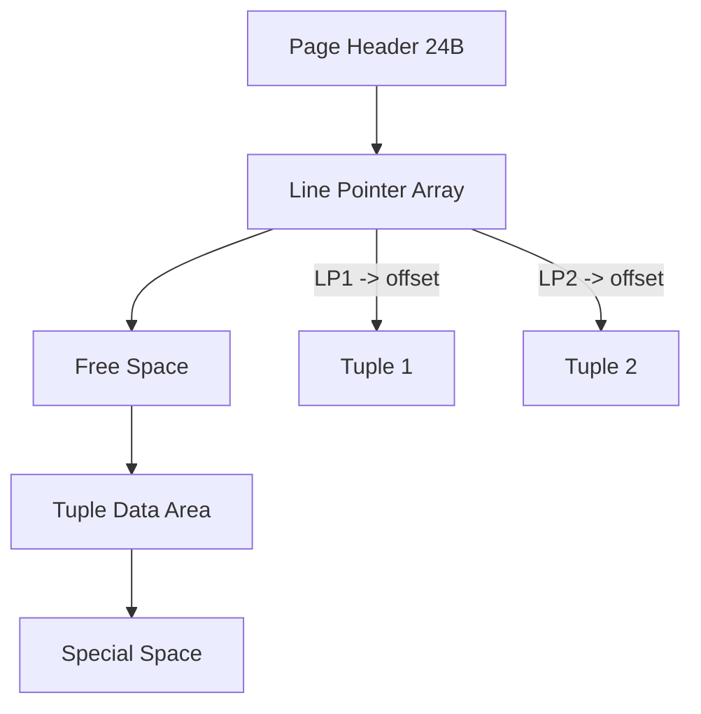
```mermaid
flowchart TD
    PH[Page Header 24B] --> LP[Line Pointer Array]
    LP --> FS[Free Space]
    FS --> TD[Tuple Data Area]
    TD --> SS[Special Space]
    LP -->|"LP1 -> offset"| T1[Tuple 1]
    LP -->|"LP2 -> offset"| T2[Tuple 2]
```

### 📶 Gradual Depth

**Level 1 - What it is:**
A PostgreSQL page is an 8 KB block that holds multiple row versions (tuples). Every table and index is stored as a sequence of these pages on disk.

**Level 2 - How to use it:**
Use `pageinspect` extension to examine page contents. Use `pg_freespacemap` to see free space per page. Column ordering in CREATE TABLE affects alignment padding and can impact row size. Place fixed-width columns before variable-width columns to minimize padding.

**Level 3 - How it works:**
Each tuple has a 23-byte header containing MVCC fields (xmin, xmax), a command ID, a pointer to the next version (ctid for HOT chains), infomask bits encoding null/toast/visibility flags, and the heap tuple offset. After the header comes an optional null bitmap (1 bit per column), followed by the actual column data aligned to type-specific boundaries (int4 to 4 bytes, int8 to 8 bytes, etc.).

**Level 4 - Production mastery:**
Row width directly impacts how many tuples fit per page and therefore how many pages a sequential scan must read. A table with 100-byte rows fits approximately 70 tuples per page. A table with 2000-byte rows fits only 3-4. For UPDATE-heavy workloads, the fill factor (default 100%) controls how much space is reserved per page for HOT updates - setting `fillfactor = 90` reserves 10% for in-page updates that avoid index maintenance. Monitor page-level bloat with `pgstattuple` extension's `free_percent` metric.

### ⚙️ How It Works

**Phase 1 - INSERT:** The executor finds a page with sufficient free space (consulting the free space map). It allocates a new line pointer at pd_lower, writes tuple data at pd_upper (which decreases), and updates both pointers.

**Phase 2 - UPDATE (non-HOT):** A new tuple version is inserted (potentially on a different page). The old tuple's xmax is set to the current transaction ID. The old tuple's ctid is updated to point to the new version. Index entries are added for the new tuple.

**Phase 3 - UPDATE (HOT):** If no indexed column changed and the same page has free space, the new tuple is placed on the same page. The old tuple's ctid points to the new line pointer on the same page. No index entry is needed - index lookups follow the HOT chain from the original line pointer.

**Phase 4 - VACUUM:** Dead tuples (xmax committed, invisible to all snapshots) are removed. Their line pointers are marked "dead" then "unused". Remaining tuples may be compacted (moved toward the end of the page) to consolidate free space. pd_lower and pd_upper are updated.

```
  HOT Update Chain (same page)
  LP1 -> Tuple v1 (xmax=200, ctid=LP2)
  LP2 -> Tuple v2 (xmax=0, current)
  Index -> LP1 -> follows chain -> LP2
```

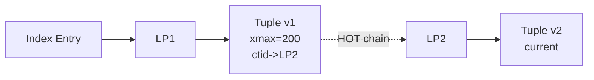
```mermaid
flowchart LR
    IDX[Index Entry] --> LP1[LP1]
    LP1 --> T1["Tuple v1\nxmax=200\nctid->LP2"]
    T1 -.->|HOT chain| LP2[LP2]
    LP2 --> T2["Tuple v2\ncurrent"]
```

**BAD:**

```sql
CREATE TABLE logs (
  id SERIAL,
  msg TEXT,  -- avg 4KB per row
  meta TEXT  -- avg 3KB per row
);  -- ~1 tuple per 8KB page
```

**GOOD:**

```sql
CREATE TABLE logs (
  id SERIAL,
  msg TEXT,  -- auto-TOASTed > ~2KB
  meta JSONB -- compressed in TOAST
);  -- main tuple stays small
```

### 🚨 Failure Modes

**Failure 1 - Table bloat from non-HOT updates:**
**Symptom:** Table size grows far beyond expected row count \* row width. `pgstattuple` shows high `dead_tuple_percent` or `free_percent`.
**Root cause:** Updates modify indexed columns, forcing non-HOT updates that create new tuples on potentially different pages. Old tuples become dead space.
**Diagnostic:**

```sql
CREATE EXTENSION IF NOT EXISTS pgstattuple;
SELECT * FROM pgstattuple('my_table');
-- Check tuple_percent vs free_percent
```

**Fix:** Avoid updating indexed columns when possible. Set `fillfactor = 70-90` on update-heavy tables to enable HOT updates. Run `VACUUM FULL` as a last resort (requires exclusive lock and rewrites the entire table).

**Failure 2 - Row too wide for a page:**
**Symptom:** `ERROR: row is too big: size XXXX, maximum size 8160`. Alternatively, excessive TOAST overhead for wide rows.
**Root cause:** A single row exceeds the maximum tuple size (~8160 bytes after page header and line pointer overhead). Large columns are automatically TOASTed (compressed and stored out-of-line), but many medium-width columns can collectively exceed the limit.
**Diagnostic:**

```sql
SELECT pg_column_size(t.*) AS row_bytes
FROM my_table t
ORDER BY pg_column_size(t.*) DESC
LIMIT 5;
```

**Fix:** Redesign the schema to move large or rarely-accessed columns to a separate table. Use JSONB or TEXT columns that TOAST automatically. Avoid wide rows with many fixed-width columns.

### 🔬 Production Reality

A typical scenario: a team discovers their 50 GB orders table should be 20 GB based on row count and average row width. Investigation with `pgstattuple` reveals 60% free space - pages are only 40% utilized. The cause: a batch job updates the `status` column (indexed) on millions of rows daily, causing non-HOT updates. Each update creates a dead tuple and a new tuple on a different page. VACUUM reclaims the dead tuple but leaves the page fragmented. The fix: drop the index on `status` (it was rarely used by queries), enabling HOT updates. After `VACUUM FULL`, the table dropped to 18 GB, and daily bloat growth decreased by 80%.

### ⚖️ Trade-offs & Alternatives

| Aspect              | PostgreSQL heap (line pointers)  | MySQL/InnoDB (clustered index) | Oracle (ROWID direct)       |
| ------------------- | -------------------------------- | ------------------------------ | --------------------------- |
| Row addressing      | Line pointer indirection         | Primary key B-tree leaf        | Physical ROWID              |
| In-place update     | HOT (same page, no index change) | In-place if fits               | In-place with row migration |
| Page size           | 8 KB (compile-time)              | 16 KB (configurable)           | 8 KB (configurable)         |
| Row version storage | In-heap (dead tuples)            | Undo log (undo tablespace)     | Undo segments               |
| Index stability     | Line pointers absorb moves       | Clustered key is stable        | ROWID changes on migration  |

### ⚡ Decision Snap

**USE WHEN:**

- Diagnosing table bloat or storage growth beyond expected levels
- Tuning fillfactor for update-heavy tables
- Deciding column ordering in CREATE TABLE for alignment efficiency

**AVOID WHEN:**

- Row widths are well within page limits and bloat is not a concern
- Premature micro-optimization of column ordering on low-volume tables

**PREFER InnoDB clustered index model WHEN:**

- Primary key range scans are the dominant access pattern (clustered storage provides locality)
- Update patterns are predominantly in-place (undo log avoids heap dead tuples)

### ⚠️ Top Traps

| #   | Misconception                                 | Reality                                                                                                                             |
| --- | --------------------------------------------- | ----------------------------------------------------------------------------------------------------------------------------------- |
| 1   | Dropping a column reclaims disk space         | DROP COLUMN only marks the column invisible; existing tuples still contain the data until rewritten by VACUUM FULL or table rewrite |
| 2   | All UPDATEs create index maintenance overhead | HOT updates (no indexed column changed, space on same page) skip all index insertions                                               |
| 3   | Smaller rows always perform better            | Excessively narrow rows (e.g., 10 bytes) have poor header-to-data ratio because the 23-byte tuple header dominates                  |
| 4   | Page size is tunable per table                | PostgreSQL page size is set at compile time and applies to all tables and indexes in the cluster                                    |
| 5   | VACUUM FULL is the standard bloat fix         | VACUUM FULL requires an exclusive lock and rewrites the entire table; pg_repack is preferred for online bloat remediation           |

### 🪜 Learning Ladder

**Prerequisites:**

- SQL-008 Tables, Rows, and Columns - understand the logical row/column model that pages implement physically
- SQL-085 MVCC Internals - How Concurrent Reads Work - understand why tuples carry xmin/xmax in their headers

**THIS:** SQL-088 Page Structure and Tuple Layout

**Next steps:**

- SQL-089 VACUUM and Bloat Management (PostgreSQL) - how dead tuples get cleaned from pages
- SQL-087 Buffer Pool and Shared Memory Architecture - how pages are cached in memory
- SQL-061 Index Types - B-Tree, Hash, GIN, GiST, BRIN - index pages have different internal structures

**The Surprising Truth:**
The tuple header (23 bytes minimum) is often larger than the actual user data in narrow tables. A table with a single integer column wastes 85% of each tuple on overhead - the 23-byte header plus 4-byte line pointer dwarfs the 4-byte integer. This is why very narrow, high-volume tables benefit from column packing or composite types.

**Further Reading:**

- PostgreSQL Documentation: Database Page Layout (postgresql.org/docs/current/storage-page-layout.html)
- PostgreSQL Documentation: pageinspect extension (postgresql.org/docs/current/pageinspect.html)
- PostgreSQL Documentation: TOAST, The Oversized-Attribute Storage Technique (postgresql.org/docs/current/storage-toast.html)

**Revision Card:**

1. Each 8 KB page has a header, line pointer array (top-down), free space, and tuple data (bottom-up)
2. HOT updates avoid index maintenance by chaining tuple versions through line pointers on the same page
3. The 23-byte tuple header dominates storage for narrow rows - column ordering and fillfactor are the primary tuning levers

---

---

# SQL-089 VACUUM and Bloat Management (PostgreSQL)

**TL;DR** - VACUUM reclaims space from dead tuples created by MVCC, prevents transaction ID wraparound, and updates visibility maps and statistics for optimal query performance.

### 🔥 Problem Statement

PostgreSQL's MVCC design leaves dead tuples in-place after every UPDATE and DELETE. Without cleanup, tables grow unboundedly: a 10 GB table receiving 100,000 updates per day can balloon to 50 GB within weeks. Dead tuples waste buffer pool memory, increase sequential scan times, inflate backup sizes, and degrade index performance. Worse, without VACUUM freezing old transaction IDs, PostgreSQL will eventually halt with a wraparound shutdown - refusing all writes to prevent data corruption. VACUUM is not optional maintenance; it is a correctness requirement.

### 📜 Historical Context

Early PostgreSQL had no automatic VACUUM - administrators ran it manually during maintenance windows. PostgreSQL 8.1 (2005) introduced autovacuum, a background daemon that triggers VACUUM based on dead tuple thresholds. PostgreSQL 9.6 (2016) added aggressive freeze behavior when approaching wraparound. Each major version has refined autovacuum: parallel index vacuuming (v13), improved dead tuple tracking (v14), and memory-efficient TID storage (v17). Despite 20 years of improvements, autovacuum tuning remains the single most common source of PostgreSQL production issues.

### 🔩 First Principles

**CORE INVARIANTS:**

1. Dead tuples cannot be removed until no active transaction's snapshot can see them
2. Every tuple must eventually be "frozen" (marked as visible to all future transactions) to prevent transaction ID wraparound
3. VACUUM must update the free space map and visibility map to enable efficient space reuse and index-only scans

**DERIVED DESIGN:**
Autovacuum monitors `n_dead_tup` per table and triggers when dead tuples exceed `autovacuum_vacuum_threshold + autovacuum_vacuum_scale_factor * n_live_tup`. VACUUM scans heap pages, removes dead tuples, updates line pointers, and compacts free space. It also freezes tuples older than `vacuum_freeze_min_age` transactions and advances the table's `relfrozenxid`.

**THE TRADE-OFF:**
**Gain:** Reclaimed disk space, prevented wraparound, updated statistics, enabled index-only scans via visibility map.
**Cost:** I/O and CPU consumption during VACUUM; locks on pages being processed; potential autovacuum contention with production queries.

### 🧠 Mental Model

> Think of VACUUM as a janitor in an office building. Workers (transactions) leave trash (dead tuples) at their desks. The janitor cannot empty a trash can if anyone might still need something in it (active snapshots). The janitor also checks smoke detectors (freezing tuples) - if detectors are never checked, the fire marshal (wraparound protection) shuts down the building.

- "Trash collection" -> dead tuple removal
- "Smoke detector check" -> tuple freezing to prevent wraparound
- "Fire marshal shutdown" -> automatic wraparound protection halt

**Where this analogy breaks down:** The janitor also updates a directory (visibility map and free space map) that other workers rely on for efficiency - a janitor in the real world does not optimize the office layout while cleaning.

### 🧩 Components

- **Autovacuum launcher** - daemon that schedules worker processes for tables exceeding dead tuple thresholds
- **Autovacuum worker** - performs VACUUM on a single table, throttled by `autovacuum_vacuum_cost_delay`
- **Dead tuple tracking** - `pg_stat_user_tables.n_dead_tup` counts dead tuples per table
- **Free space map (FSM)** - per-table file tracking available space per page for INSERT reuse
- **Visibility map (VM)** - per-table bitmap marking pages where all tuples are visible to all transactions (enables index-only scans)
- **FREEZE** - marks old tuples as "frozen" (permanently visible), advancing `relfrozenxid`

```
  Autovacuum Decision Flow
  +-------------------+
  | pg_stat_user_tables|
  | n_dead_tup = 50000 |
  +--------+----------+
           |
     threshold check:
     50 + 0.2 * 100000 = 20050
     50000 > 20050 -> trigger
           |
           v
  +-------------------+
  | Autovacuum Worker  |
  | Scan heap pages    |
  | Remove dead tuples |
  | Update FSM + VM    |
  | Freeze old tuples  |
  +-------------------+
```

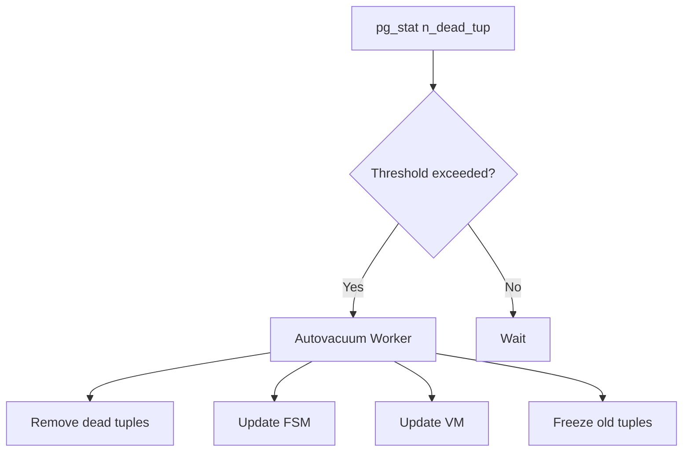
```mermaid
flowchart TD
    ST[pg_stat n_dead_tup] --> TC{Threshold exceeded?}
    TC -->|Yes| AW[Autovacuum Worker]
    TC -->|No| W[Wait]
    AW --> RD[Remove dead tuples]
    AW --> UF[Update FSM]
    AW --> UV[Update VM]
    AW --> FZ[Freeze old tuples]
```

### 📶 Gradual Depth

**Level 1 - What it is:**
VACUUM is a maintenance operation that cleans up dead rows left behind by updates and deletes. PostgreSQL runs it automatically in the background via autovacuum.

**Level 2 - How to use it:**
Monitor `pg_stat_user_tables` for `n_dead_tup` and `last_autovacuum`. If autovacuum is not keeping up, tune per-table settings: `ALTER TABLE SET (autovacuum_vacuum_scale_factor = 0.01)` for high-churn tables. Run manual `VACUUM VERBOSE tablename` to see detailed output.

**Level 3 - How it works:**
VACUUM scans each heap page, checking each tuple's visibility. Dead tuples (xmax committed, invisible to all snapshots) have their line pointers marked "dead." A second pass marks them "unused," compacts live tuples within each page, and updates the FSM with reclaimed space. The VM is updated for pages where all remaining tuples are visible to all transactions. Tuples older than `vacuum_freeze_min_age` are frozen by setting their xmin to `FrozenTransactionId`.

**Level 4 - Production mastery:**
The default autovacuum settings are designed for small databases. For tables with millions of rows, `autovacuum_vacuum_scale_factor = 0.2` means autovacuum waits until 20% of the table is dead - potentially millions of dead tuples. Set scale factor to 0.01 or use a fixed threshold for large tables. Monitor `age(relfrozenxid)` to detect tables approaching wraparound. Watch `autovacuum_max_workers` (default 3) - if all workers are busy on large tables, smaller tables may never get vacuumed. Use `pg_stat_progress_vacuum` to monitor active VACUUM operations.

### ⚙️ How It Works

**Phase 1 - Dead tuple collection:** VACUUM scans heap pages sequentially. For each tuple, it checks visibility against the oldest active snapshot (`OldestXmin`). Tuples with `xmax` committed and visible to no snapshot are marked dead. Dead tuple TIDs are collected in memory (limited by `maintenance_work_mem`).

**Phase 2 - Index cleanup:** For each index on the table, VACUUM scans the entire index, removing entries pointing to dead tuples. This is the most expensive phase for tables with many indexes.

**Phase 3 - Heap cleanup:** VACUUM revisits heap pages containing dead tuples, marks their line pointers as unused, and compacts remaining tuples to consolidate free space.

**Phase 4 - FSM and VM update:** The free space map is updated with reclaimed space per page. Pages where all tuples are now visible to all transactions are marked in the visibility map.

**Phase 5 - Statistics update:** `pg_stat_user_tables` is updated with new `n_dead_tup`, `n_live_tup`, and `last_autovacuum` values.

```
  VACUUM Processing a Page
  Before:
  [LP1->live] [LP2->dead] [LP3->live]
  [Tuple3] [Tuple2(dead)] [Tuple1]

  After:
  [LP1->live] [LP2->unused] [LP3->live]
  [Tuple3]  [free space]   [Tuple1]
  FSM updated: page has N bytes free
```

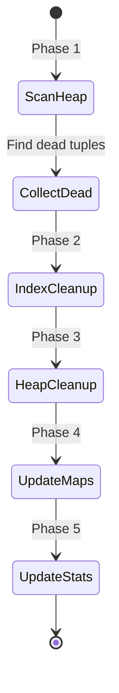
```mermaid
stateDiagram-v2
    [*] --> ScanHeap: Phase 1
    ScanHeap --> CollectDead: Find dead tuples
    CollectDead --> IndexCleanup: Phase 2
    IndexCleanup --> HeapCleanup: Phase 3
    HeapCleanup --> UpdateMaps: Phase 4
    UpdateMaps --> UpdateStats: Phase 5
    UpdateStats --> [*]
```

**BAD:**

```sql
VACUUM FULL large_table;
-- AccessExclusiveLock for hours
-- blocks ALL queries
```

**GOOD:**

```sql
ALTER TABLE large_table SET (
  autovacuum_vacuum_scale_factor
    = 0.01,
  autovacuum_vacuum_cost_delay = 2
);
```

### 🚨 Failure Modes

**Failure 1 - Autovacuum cannot keep up:**
**Symptom:** `n_dead_tup` grows continuously. Table bloat increases daily. Autovacuum runs complete but dead tuples reaccumulate faster than they are cleaned.
**Root cause:** High-churn table with default scale factor (0.2) means autovacuum triggers only after 20% of the table is dead. By the time it finishes, another 20% has accumulated.
**Diagnostic:**

```sql
SELECT schemaname, relname,
       n_dead_tup, n_live_tup,
       last_autovacuum,
       autovacuum_count
FROM pg_stat_user_tables
WHERE n_dead_tup > 10000
ORDER BY n_dead_tup DESC;
```

**Fix:** Per-table tuning: `ALTER TABLE hot_table SET (autovacuum_vacuum_scale_factor = 0.01, autovacuum_vacuum_cost_delay = 2);`. Increase `autovacuum_max_workers` if multiple large tables contend.

**Failure 2 - Transaction ID wraparound emergency:**
**Symptom:** PostgreSQL logs: "WARNING: database X must be vacuumed within N transactions to prevent wraparound." Eventually: "ERROR: database is not accepting commands to avoid wraparound."
**Root cause:** A table's `relfrozenxid` was never advanced because autovacuum could not complete (blocked by long-running transactions, or `autovacuum_freeze_max_age` never reached).
**Diagnostic:**

```sql
SELECT c.oid::regclass AS table_name,
       age(c.relfrozenxid) AS xid_age,
       pg_size_pretty(
         pg_total_relation_size(c.oid)
       ) AS total_size
FROM pg_class c
WHERE c.relkind = 'r'
ORDER BY age(c.relfrozenxid) DESC
LIMIT 10;
```

**Fix:** Kill long-running transactions blocking VACUUM. Run `VACUUM FREEZE` on the affected table. Set `vacuum_freeze_min_age` appropriately. Alert when `age(relfrozenxid)` exceeds 500 million.

### 🔬 Production Reality

A common production pattern: a 500 GB table with 12 indexes receives 50,000 updates per second. Autovacuum triggers and begins scanning. Phase 2 (index cleanup) must scan all 12 indexes, each potentially tens of gigabytes. This single VACUUM operation runs for hours. During that time, dead tuples continue accumulating. The VACUUM finishes, but the table is already overdue for the next run. The table bloats steadily. The fix requires multiple interventions: reduce the number of indexes (drop unused ones), set aggressive per-table vacuum settings, increase `maintenance_work_mem` to hold more dead tuple TIDs per pass (reducing the number of index scan passes), and consider partitioning the table so each partition is vacuumed independently.

### ⚖️ Trade-offs & Alternatives

| Aspect            | VACUUM (standard)                   | VACUUM FULL                         | pg_repack                    | InnoDB purge thread  |
| ----------------- | ----------------------------------- | ----------------------------------- | ---------------------------- | -------------------- |
| Lock level        | ShareUpdateExclusive (non-blocking) | AccessExclusive (blocks all)        | Non-blocking (trigger-based) | No user-facing lock  |
| Space reclamation | Marks space reusable within table   | Rewrites table, returns space to OS | Rewrites table online        | Automatic undo reuse |
| Index handling    | Scans all indexes per pass          | Rebuilds all indexes                | Rebuilds indexes online      | Not applicable       |
| Bloat reduction   | Prevents growth, does not shrink    | Full compaction                     | Full compaction              | Continuous           |
| Production safety | Safe for continuous use             | Requires maintenance window         | Requires monitoring          | Automatic            |

### ⚡ Decision Snap

**USE WHEN:**

- Always - autovacuum should run continuously on every PostgreSQL deployment
- Per-table tuning is needed for tables with > 1M rows or > 10,000 updates/second
- Monitoring `n_dead_tup` and `relfrozenxid` age is part of operational baseline

**AVOID WHEN:**

- Do not run VACUUM FULL during production hours (it holds AccessExclusive lock)
- Do not disable autovacuum globally (it will eventually cause wraparound shutdown)

**PREFER pg_repack WHEN:**

- Table bloat exceeds 50% and space must be reclaimed without downtime
- VACUUM FULL is not feasible due to table size or availability requirements

### ⚠️ Top Traps

| #   | Misconception                                    | Reality                                                                                                                                            |
| --- | ------------------------------------------------ | -------------------------------------------------------------------------------------------------------------------------------------------------- |
| 1   | VACUUM reclaims disk space back to the OS        | Standard VACUUM marks space reusable within the table file; only VACUUM FULL or pg_repack actually shrinks the file                                |
| 2   | Autovacuum handles everything automatically      | Default settings are designed for small tables; large tables need per-table scale_factor and cost_delay tuning                                     |
| 3   | Running VACUUM more often is always better       | Overly aggressive VACUUM wastes I/O; the key is matching frequency to dead tuple accumulation rate                                                 |
| 4   | VACUUM only matters for disk space               | VACUUM also updates the visibility map (enabling index-only scans), freezes tuples (preventing wraparound), and updates FSM (enabling space reuse) |
| 5   | Long-running SELECT queries do not affect VACUUM | Any transaction holding a snapshot prevents VACUUM from cleaning tuples created after that snapshot, regardless of the query type                  |

### 🪜 Learning Ladder

**Prerequisites:**

- SQL-085 MVCC Internals - How Concurrent Reads Work - understand why dead tuples accumulate
- SQL-088 Page Structure and Tuple Layout - know the physical structures VACUUM modifies

**THIS:** SQL-089 VACUUM and Bloat Management (PostgreSQL)

**Next steps:**

- SQL-097 Plan Regression and pg_stat_statements - stale statistics from inadequate VACUUM cause plan changes
- SQL-095 Statistics and Cardinality Estimation - VACUUM updates statistics that the planner depends on
- SQL-104 Zero-Downtime Schema Migrations - schema changes interact with VACUUM and bloat

**The Surprising Truth:**
The most dangerous PostgreSQL configuration is not a missing index or wrong query - it is `autovacuum = off`. A surprising number of production databases have autovacuum disabled "for performance," only to hit transaction ID wraparound weeks or months later, resulting in a complete database shutdown that can only be resolved by emergency VACUUM operations that may take hours on large tables.

**Further Reading:**

- PostgreSQL Documentation: Routine Vacuuming (postgresql.org/docs/current/routine-vacuuming.html)
- PostgreSQL Wiki: Autovacuum Tuning Basics (wiki.postgresql.org/wiki/Tuning_Your_PostgreSQL_Server)
- PostgreSQL Documentation: VACUUM command reference (postgresql.org/docs/current/sql-vacuum.html)

**Revision Card:**

1. VACUUM removes dead tuples, updates FSM/VM, and freezes old tuples to prevent transaction ID wraparound
2. Default autovacuum settings are insufficient for large tables - tune scale_factor per table
3. Standard VACUUM does not shrink files on disk; only VACUUM FULL or pg_repack reclaims OS-level space

---

---

# SQL-090 Row-Level vs Table-Level Locking

**TL;DR** - PostgreSQL uses row-level locks for DML concurrency and table-level locks for DDL protection, with eight lock modes forming a compatibility matrix that determines which operations can run simultaneously.

### 🔥 Problem Statement

Concurrent transactions modifying the same data need coordination to prevent lost updates and corruption. Coarse-grained table locks are simple but destroy concurrency: a single UPDATE locks out all other writers and potentially all readers. Fine-grained row locks maximize concurrency but add overhead per locked row. At production scale, the wrong locking granularity causes either deadlocks and contention (too fine) or throughput collapse (too coarse). Understanding PostgreSQL's multi-level lock system - and its compatibility matrix - is essential for diagnosing lock-related performance problems.

### 📜 Historical Context

Early databases used page-level or table-level locking exclusively. IBM DB2 pioneered row-level locking in the 1980s. PostgreSQL inherited its lock system from the Berkeley Postgres project and refined it through multiple versions. PostgreSQL uses MVCC to avoid read locks entirely - readers never block writers. Write locks operate at the row level (stored in shared memory as a tuple-level lock on the xmax field) and at the table level through eight explicit lock modes ranging from AccessShareLock (SELECT) to AccessExclusiveLock (DDL). This layered approach provides fine-grained concurrency for DML while protecting structural changes.

### 🔩 First Principles

**CORE INVARIANTS:**

1. Two transactions cannot hold conflicting locks simultaneously - the second waits or aborts
2. MVCC eliminates read-write conflicts: only write-write conflicts require locks at the row level
3. Table-level locks protect table structure (schema); row-level locks protect row content

**DERIVED DESIGN:**
PostgreSQL acquires table-level locks implicitly for every DML/DDL statement. SELECT acquires AccessShareLock (compatible with everything except AccessExclusiveLock). UPDATE acquires RowExclusiveLock at the table level and an exclusive lock on the specific rows being modified. DDL operations like ALTER TABLE acquire AccessExclusiveLock, blocking all concurrent access. The lock manager tracks all locks in shared memory (`pg_locks`).

**THE TRADE-OFF:**
**Gain:** Row-level locks maximize write concurrency; multiple transactions update different rows simultaneously without contention.
**Cost:** Lock manager memory overhead scales with the number of locked rows; long-running transactions holding row locks block other writers on those specific rows.

### 🧠 Mental Model

> Think of a shared document in a team workspace. Table-level locks are like permissions on the document itself (who can open, rename, or delete it). Row-level locks are like per-paragraph edit locks - multiple writers can edit different paragraphs simultaneously, but two writers on the same paragraph must take turns.

- "Document permission" -> table-level lock mode
- "Paragraph edit lock" -> row-level lock (xmax-based)
- "Renaming the document" -> AccessExclusiveLock (blocks everything)

**Where this analogy breaks down:** PostgreSQL readers never need any paragraph-level lock because MVCC provides snapshot isolation. In the document analogy, readers would see a frozen copy from the moment they opened the document.

### 🧩 Components

- **Table-level lock modes** - eight modes: AccessShare, RowShare, RowExclusive, ShareUpdateExclusive, Share, ShareRowExclusive, Exclusive, AccessExclusive
- **Row-level locks** - four modes: FOR KEY SHARE, FOR SHARE, FOR NO KEY UPDATE, FOR UPDATE
- **Lock manager** - shared memory structure tracking all active locks and wait queues
- **pg_locks** - system view exposing current lock state for diagnostics
- **Deadlock detector** - background process checking for circular wait dependencies (runs after `deadlock_timeout`)

```
  Table Lock Compatibility (simplified)
  Operation        Lock Mode         Conflicts
  -----------------------------------------------
  SELECT           AccessShare       DDL only
  UPDATE           RowExclusive      DDL, SHARE
  CREATE INDEX     Share             DML writes
  ALTER TABLE      AccessExclusive   Everything
  VACUUM           ShareUpdateExcl.  DDL
```

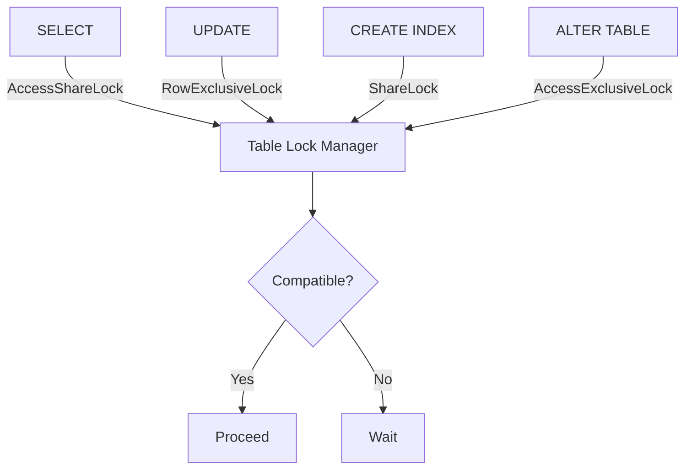
```mermaid
flowchart TD
    S[SELECT] -->|AccessShareLock| TL[Table Lock Manager]
    U[UPDATE] -->|RowExclusiveLock| TL
    CI[CREATE INDEX] -->|ShareLock| TL
    AT[ALTER TABLE] -->|AccessExclusiveLock| TL
    TL --> CM{Compatible?}
    CM -->|Yes| Proceed
    CM -->|No| Wait
```

### 📶 Gradual Depth

**Level 1 - What it is:**
Locks prevent conflicting operations from running at the same time. PostgreSQL locks at two levels: the whole table (to protect its structure) and individual rows (to protect their data).

**Level 2 - How to use it:**
Use `SELECT ... FOR UPDATE` to explicitly lock rows you intend to modify. Use `SELECT ... FOR NO KEY UPDATE` when you do not modify the primary key (allows concurrent foreign key checks). Check active locks with `SELECT * FROM pg_locks WHERE NOT granted;` to find blocked sessions.

**Level 3 - How it works:**
Table-level locks are acquired implicitly by every SQL statement and stored in the lock manager's shared memory hash table. Row-level locks are implemented by writing the locking transaction's XID into the tuple's xmax field with special infomask bits - no separate lock table entry per row is needed, making row locks extremely lightweight. The `MultiXact` mechanism handles cases where multiple transactions hold compatible row locks (e.g., multiple FOR SHARE locks on the same row).

**Level 4 - Production mastery:**
The most common production lock problem is DDL blocked by long-running queries. An `ALTER TABLE` needs AccessExclusiveLock, which conflicts with the AccessShareLock held by every SELECT. If a SELECT runs for 30 minutes, the ALTER waits - and every subsequent SELECT also waits behind the ALTER (lock queue is FIFO). Mitigate with `lock_timeout` on DDL sessions and short maintenance windows. Monitor `pg_stat_activity` joined with `pg_locks` to identify the blocking chain.

### ⚙️ How It Works

**Phase 1 - Lock acquisition:** The executor requests a table-level lock from the lock manager. If compatible with all existing locks on that table, it is granted immediately. If not, the process enters the wait queue.

**Phase 2 - Row-level lock (DML):** For UPDATE/DELETE/SELECT FOR UPDATE, after acquiring the table-level RowExclusiveLock, the executor locks individual rows by writing its transaction ID into the xmax field. If another transaction already holds a conflicting row lock, the executor waits for that transaction to commit or abort.

**Phase 3 - Lock holding:** Locks are held until the transaction ends (COMMIT or ROLLBACK). There is no manual unlock for regular locks (unlike advisory locks).

**Phase 4 - Lock release:** At COMMIT/ROLLBACK, all table-level and row-level locks are released. Waiting transactions are woken up in FIFO order.

```
  Lock Queue Example
  Time -> ALTER TABLE (needs AccessExclusive)
          |
          v
  Queue: [SELECT (AccessShare, running)]
         [ALTER TABLE (waiting)]
         [SELECT #2 (waiting behind ALTER)]
         [SELECT #3 (waiting behind ALTER)]
```

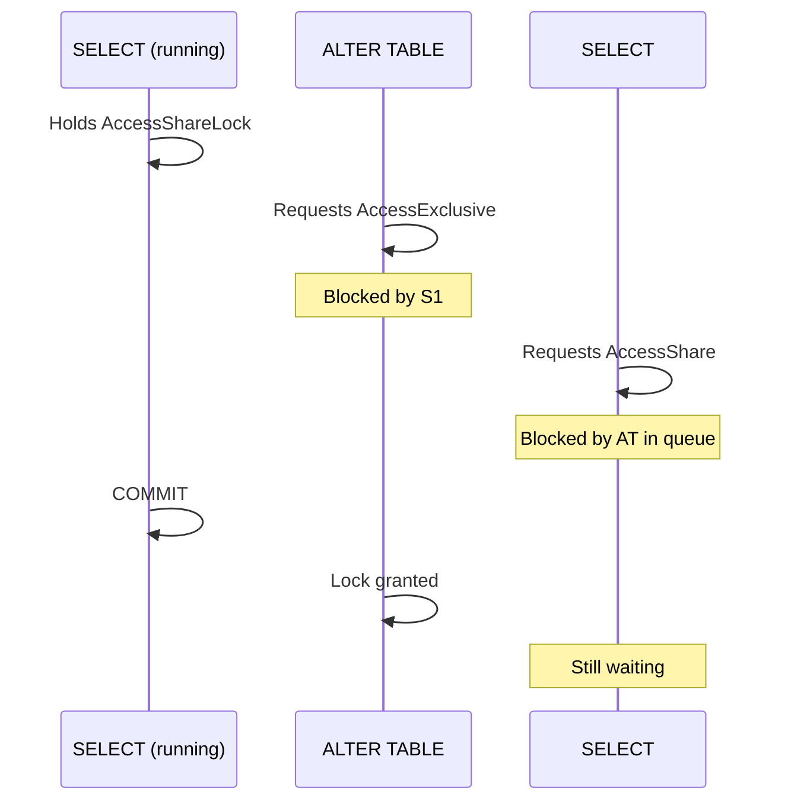
```mermaid
sequenceDiagram
    participant S1 as SELECT (running)
    participant AT as ALTER TABLE
    participant S2 as SELECT #2
    S1->>S1: Holds AccessShareLock
    AT->>AT: Requests AccessExclusive
    Note over AT: Blocked by S1
    S2->>S2: Requests AccessShare
    Note over S2: Blocked by AT in queue
    S1->>S1: COMMIT
    AT->>AT: Lock granted
    Note over S2: Still waiting
```

**BAD:**

```sql
BEGIN;
SELECT * FROM orders
WHERE id = 1 FOR UPDATE;
-- app does HTTP call here
-- Lock held 30 seconds
COMMIT;
```

**GOOD:**

```sql
BEGIN;
UPDATE orders SET status = 'shipped'
WHERE id = 1;
COMMIT;  -- lock held briefly
-- HTTP call OUTSIDE transaction
```

### 🚨 Failure Modes

**Failure 1 - DDL lock queue starvation:**
**Symptom:** A simple ALTER TABLE hangs for minutes. All new queries on the same table also hang. Application timeout errors spike.
**Root cause:** ALTER TABLE requests AccessExclusiveLock but a long-running SELECT holds AccessShareLock. New queries queue behind the ALTER, creating a cascading blockage.
**Diagnostic:**

```sql
SELECT blocked.pid AS blocked_pid,
       blocked.query AS blocked_query,
       blocking.pid AS blocking_pid,
       blocking.query AS blocking_query
FROM pg_stat_activity blocked
JOIN pg_locks bl ON bl.pid = blocked.pid
JOIN pg_locks bk ON bk.relation = bl.relation
  AND bk.granted AND NOT bl.granted
JOIN pg_stat_activity blocking
  ON blocking.pid = bk.pid
WHERE NOT bl.granted;
```

**Fix:** Set `lock_timeout = '3s'` on the DDL session so it fails fast instead of blocking the queue. Retry the DDL when no long queries are running. Alternatively, terminate the blocking query if acceptable.

**Failure 2 - Row lock contention on hot rows:**
**Symptom:** Multiple transactions updating the same row experience high wait times. `pg_stat_activity` shows many sessions in "Lock" wait event.
**Root cause:** A "hot row" pattern where many concurrent transactions update the same counter or status field. Each transaction waits for the previous one to commit.
**Diagnostic:**

```sql
SELECT pid, wait_event_type,
       wait_event, query
FROM pg_stat_activity
WHERE wait_event_type = 'Lock';
```

**Fix:** Redesign the schema to distribute contention: use partitioned counters, batch updates, or advisory locks with application-level coordination instead of row-level contention.

### 🔬 Production Reality

A typical production incident: an engineer runs `ALTER TABLE orders ADD COLUMN tracking_id TEXT;` during business hours. A reporting query has been running for 15 minutes with AccessShareLock. The ALTER blocks, and within seconds, hundreds of new queries queue behind the ALTER. The application's connection pool exhausts, and the service goes down. The fix is cultural and technical: all DDL must use `SET lock_timeout = '3s';` and be wrapped in retry logic. The deeper fix is to run DDL only during low-traffic windows or use tools like `pg_repack` or Postgres 11+ `ALTER TABLE ... ADD COLUMN` with non-volatile defaults (which does not require a table rewrite and acquires the lock briefly).

### ⚖️ Trade-offs & Alternatives

| Aspect                    | PostgreSQL (MVCC + row locks)   | MySQL/InnoDB (row locks + gap locks) | Oracle (row locks + undo)   |
| ------------------------- | ------------------------------- | ------------------------------------ | --------------------------- |
| Reader-writer blocking    | Never (MVCC snapshots)          | Never (MVCC)                         | Never (undo reconstruction) |
| Writer-writer granularity | Row-level                       | Row-level + gap locks                | Row-level                   |
| DDL locking               | AccessExclusiveLock             | Metadata lock (MDL)                  | Online DDL options          |
| Lock visibility           | pg_locks view                   | information_schema.innodb_locks      | v$lock view                 |
| Gap locks                 | No (snapshot isolation instead) | Yes (to prevent phantoms)            | No                          |

### ⚡ Decision Snap

**USE WHEN:**

- Row-level locking is the default and correct choice for OLTP workloads
- Understanding lock modes is essential when diagnosing blocked queries
- Explicit `SELECT ... FOR UPDATE` is needed when read-modify-write cycles must be atomic

**AVOID WHEN:**

- Do not use `LOCK TABLE ... IN ACCESS EXCLUSIVE MODE` unless absolutely necessary
- Do not hold transactions open during user think time (extends lock duration)

**PREFER advisory locks WHEN:**

- Coordination is at the application level (e.g., "only one worker processes this job")
- Row-level locks would require creating artificial "lock rows" in the schema

### ⚠️ Top Traps

| #   | Misconception                                 | Reality                                                                                                                 |
| --- | --------------------------------------------- | ----------------------------------------------------------------------------------------------------------------------- |
| 1   | SELECT queries never cause lock problems      | SELECT holds AccessShareLock, which blocks DDL and creates queue pile-ups behind waiting DDL                            |
| 2   | Row locks are stored in a lock table          | Row locks are stored in the tuple's xmax field, making them nearly free in terms of lock manager memory                 |
| 3   | PostgreSQL escalates row locks to table locks | PostgreSQL never escalates - row locks remain row locks regardless of count. This differs from SQL Server               |
| 4   | FOR UPDATE and FOR NO KEY UPDATE are the same | FOR NO KEY UPDATE allows concurrent foreign key checks, significantly reducing contention in parent-child relationships |
| 5   | Locks are released when a statement finishes  | Locks are held until the transaction ends (COMMIT/ROLLBACK), not until the statement completes                          |

### 🪜 Learning Ladder

**Prerequisites:**

- SQL-067 Transaction Isolation Levels - understand how isolation interacts with locking
- SQL-069 Optimistic vs Pessimistic Locking - contrast application-level vs database-level locking strategies
- SQL-085 MVCC Internals - How Concurrent Reads Work - know why readers do not need locks

**THIS:** SQL-090 Row-Level vs Table-Level Locking

**Next steps:**

- SQL-091 Lock Escalation and Contention - deeper patterns of lock contention and resolution
- SQL-092 Deadlock Detection and Resolution - what happens when lock waits form cycles
- SQL-093 Advisory Locks - Application-Level Coordination - application-level locking beyond row/table

**The Surprising Truth:**
The most devastating lock problem in PostgreSQL is not row contention between writers - it is a queued DDL statement blocking all readers. A single `ALTER TABLE` waiting for one long query can bring down an entire application, because every new query queues behind the ALTER rather than proceeding alongside the existing SELECT.

**Further Reading:**

- PostgreSQL Documentation: Explicit Locking (postgresql.org/docs/current/explicit-locking.html)
- PostgreSQL Documentation: Lock Monitoring (postgresql.org/docs/current/monitoring-locks.html)
- PostgreSQL Documentation: pg_locks view (postgresql.org/docs/current/view-pg-locks.html)

**Revision Card:**

1. PostgreSQL has 8 table-level lock modes and 4 row-level lock modes; MVCC means readers never block writers
2. Row locks are stored in the tuple xmax field, not in a separate lock table - making them extremely lightweight
3. The #1 production lock problem is DDL queue pile-ups: use lock_timeout on all DDL sessions

---

---

# SQL-091 Lock Escalation and Contention

**TL;DR** - PostgreSQL never escalates row locks to table locks, but lock contention still degrades throughput through hot-row serialization, queue pile-ups, and connection pool exhaustion.

### 🔥 Problem Statement

In databases that perform lock escalation (SQL Server, DB2), the engine converts thousands of row-level locks to a single table lock to reduce memory overhead. This simplifies lock management but destroys concurrency for the entire table. PostgreSQL avoids this problem entirely - it never escalates. However, lock contention still manifests differently: hot rows where many transactions compete for the same tuple, long-held locks that create wait chains, and DDL operations that queue behind and block subsequent requests. At production scale, contention patterns cause latency spikes, connection pool saturation, and cascading failures that look like application bugs but originate in the database.

### 📜 Historical Context

Lock escalation was a practical necessity in early database systems where lock manager memory was limited. SQL Server continues to use escalation (row to page to table) when a query acquires more than approximately 5,000 row locks on a single table. DB2 and Informix have similar mechanisms. PostgreSQL's design stores row locks in the tuple header (xmax field) rather than a central lock table, so there is no memory pressure driving escalation. This was a deliberate architectural choice inherited from the Postgres project at Berkeley and has remained unchanged through all PostgreSQL versions.

### 🔩 First Principles

**CORE INVARIANTS:**

1. PostgreSQL never converts row locks to table locks - row lock count has no upper bound
2. Contention occurs when multiple transactions need conflicting locks on overlapping resources
3. Lock wait time compounds: each queued transaction adds its processing time to the total wait of all subsequent waiters

**DERIVED DESIGN:**
Since row locks live in the tuple xmax field, the lock manager does not track individual row locks in shared memory. Only table-level locks and explicit advisory locks consume lock table entries. This means millions of rows can be locked simultaneously without memory pressure. However, logical contention (multiple transactions wanting the same row) still serializes those transactions regardless of the lock implementation.

**THE TRADE-OFF:**
**Gain:** No escalation means predictable concurrency - locking 1 row or 1 million rows has the same table-level impact (RowExclusiveLock).
**Cost:** Without escalation, truly pathological patterns (millions of row locks) never get a "safety valve" to reduce overhead - though in PostgreSQL this is rarely a problem due to the xmax-based design.

### 🧠 Mental Model

> Think of a supermarket with self-checkout lanes. Each item scanned (row lock) does not require asking a manager (lock escalation). In SQL Server, scanning 5,000 items causes the manager to close the lane for "bulk processing" (table lock). PostgreSQL never does this - you can scan unlimited items, but if two shoppers reach for the same item on the shelf (hot row), one must wait for the other to put it in their cart.

- "Self-checkout scanning" -> row-level lock acquisition (xmax-based)
- "Manager closing the lane" -> lock escalation (PostgreSQL: never happens)
- "Two shoppers, same item" -> hot-row contention

**Where this analogy breaks down:** In PostgreSQL, the "shelf item" (tuple) does not disappear when one shopper takes it - MVCC creates a new version, so readers always see a consistent copy. Only writers compete.

### 🧩 Components

- **xmax-based row locks** - stored in the tuple header; no central registry per row
- **MultiXact** - mechanism for multiple transactions holding compatible row locks (e.g., FOR SHARE) on the same tuple
- **Lock wait queue** - FIFO queue per lockable resource; waiters are woken in order
- **pg_stat_activity.wait_event** - shows "Lock" when a session is waiting for a conflicting lock
- **deadlock_timeout** - how long to wait before running the deadlock detector (default 1 second)

```
  Contention vs Escalation
  SQL Server:    PG:
  Row 1  [lock]  Row 1  [xmax lock]
  Row 2  [lock]  Row 2  [xmax lock]
  ...            ...
  Row 5000       Row 5000 [xmax lock]
  -> ESCALATE    -> still row locks
  -> TABLE LOCK  -> no escalation
  -> all blocked -> only same-row
                    writers blocked
```

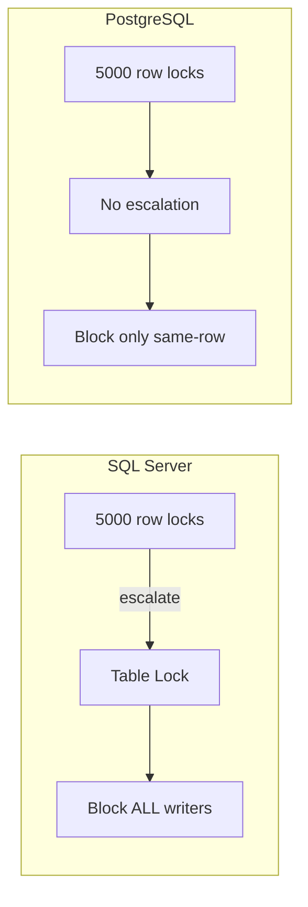
```mermaid
flowchart LR
    subgraph SQLServer[SQL Server]
        R1[5000 row locks] -->|escalate| TL[Table Lock]
        TL --> BA[Block ALL writers]
    end
    subgraph PostgreSQL
        R2[5000 row locks] --> NE[No escalation]
        NE --> BO[Block only same-row]
    end
```

### 📶 Gradual Depth

**Level 1 - What it is:**
Lock escalation is when a database automatically converts many fine-grained locks into one coarse lock. PostgreSQL does not do this - row locks stay as row locks no matter how many you acquire.

**Level 2 - How to use it:**
In PostgreSQL, you do not need to worry about escalation. Focus instead on minimizing lock duration: keep transactions short, avoid user interaction inside transactions, and use `NOWAIT` or `SKIP LOCKED` for queue-processing patterns.

**Level 3 - How it works:**
When a transaction executes `UPDATE t SET x = 1 WHERE id = 42`, it acquires RowExclusiveLock on the table (compatible with other RowExclusiveLock holders) and writes its XID into tuple 42's xmax. If another transaction tries to update tuple 42 concurrently, it reads the xmax, sees it belongs to an active transaction, and enters a wait state on that transaction's virtual XID lock. When the first transaction commits, the waiter wakes up, re-evaluates the tuple, and proceeds.

**Level 4 - Production mastery:**
Contention patterns in production often involve "hot rows" - inventory counters, sequence generators, or status fields updated by many transactions. Even though PostgreSQL does not escalate, serializing 1,000 transactions per second through a single row means each waits for all preceding transactions. Batch counter updates, use advisory locks for application-level coordination, or redesign with partitioned counters to distribute contention across multiple rows.

### ⚙️ How It Works

**Phase 1 - Lock request:** Transaction B attempts to update a row currently locked by Transaction A. The executor reads the tuple's xmax and finds A's XID.

**Phase 2 - Wait entry:** B enters a wait state on A's virtual XID lock. The wait is tracked in `pg_stat_activity` as `wait_event_type = 'Lock'`.

**Phase 3 - Wake-up:** When A commits or aborts, B is woken. B re-reads the tuple. If A committed, B sees the new version and applies its update to it. If A aborted, B applies its update to the original version.

**Phase 4 - Chain effect:** If transaction C also wants the same row, it waits behind B. Lock waits are serialized: B processes, then C processes. Total latency for C = A's remaining time + B's processing time + C's processing time.

```
  Hot Row Serialization
  Time -->
  A: [----UPDATE row 42----][COMMIT]
  B:      [wait.............][UPDATE][COMMIT]
  C:      [wait.......................][wait][UPD]
```

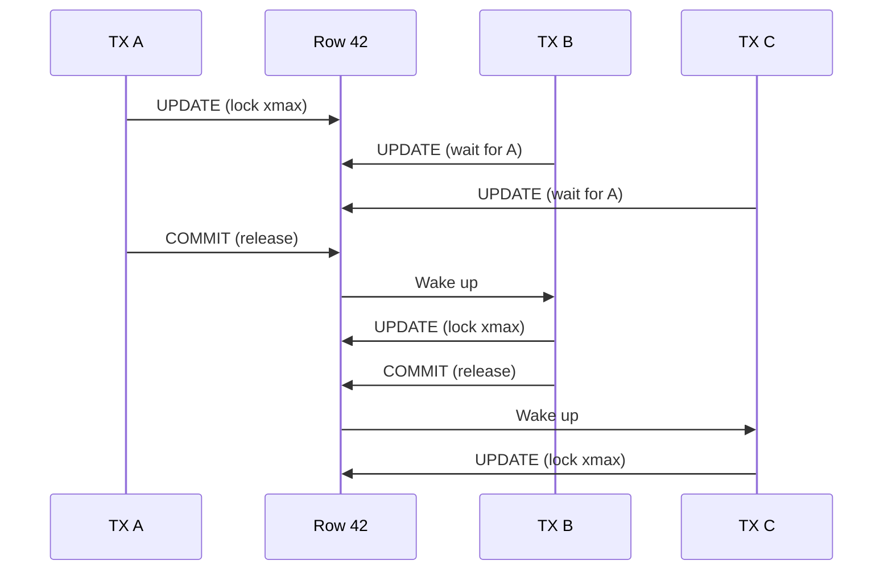
```mermaid
sequenceDiagram
    participant A as TX A
    participant Row as Row 42
    participant B as TX B
    participant C as TX C
    A->>Row: UPDATE (lock xmax)
    B->>Row: UPDATE (wait for A)
    C->>Row: UPDATE (wait for A)
    A->>Row: COMMIT (release)
    Row->>B: Wake up
    B->>Row: UPDATE (lock xmax)
    B->>Row: COMMIT (release)
    Row->>C: Wake up
    C->>Row: UPDATE (lock xmax)
```

**BAD:**

```sql
UPDATE events SET archived = true
WHERE created_at < '2023-01-01';
-- Locks millions of rows at once
```

**GOOD:**

```sql
UPDATE events SET archived = true
WHERE id IN (
  SELECT id FROM events
  WHERE created_at < '2023-01-01'
    AND archived = false
  LIMIT 5000
);  -- repeat; commit each batch
```

### 🚨 Failure Modes

**Failure 1 - Hot row throughput collapse:**
**Symptom:** Transaction latency on a specific table spikes despite low overall database load. `pg_stat_activity` shows many sessions waiting on Lock events with similar queries.
**Root cause:** Many transactions update the same row (e.g., a global counter or a status field), serializing all updates through that single row.
**Diagnostic:**

```sql
SELECT wait_event_type, wait_event,
       count(*) AS waiters,
       left(query, 60) AS query_prefix
FROM pg_stat_activity
WHERE wait_event_type = 'Lock'
GROUP BY 1, 2, 3
ORDER BY waiters DESC;
```

**Fix:** Replace single-row counters with partitioned counters (N rows, each updated by hash(session_id) % N, summed at read time). Use `SELECT ... FOR UPDATE SKIP LOCKED` for queue patterns.

**Failure 2 - Connection pool exhaustion from lock waits:**
**Symptom:** Application reports "no available connections." Database shows many sessions in Lock wait state, all holding a connection pool slot.
**Root cause:** Lock waits extend transaction duration, which extends connection hold time. With a fixed-size connection pool, waiting sessions consume all available slots.
**Diagnostic:**

```sql
SELECT count(*) AS total_conns,
       count(*) FILTER (
         WHERE wait_event_type = 'Lock'
       ) AS lock_waiting
FROM pg_stat_activity
WHERE backend_type = 'client backend';
```

**Fix:** Set `statement_timeout` and `lock_timeout` to prevent indefinite waits. Use `NOWAIT` in application code where fast failure is acceptable. Increase pool size only as a temporary measure - the root cause is the contention pattern.

### 🔬 Production Reality

A payment processing system updates an `account_balance` row for each transaction. During peak load, 500 payments per second target the same account. Each UPDATE acquires a row lock, waits for the previous transaction to commit, then proceeds. With 1 ms per transaction, the theoretical serialized throughput is 1,000 TPS for a single row - but with commit latency, WAL fsync, and network round-trips, actual throughput drops to 200-300 TPS. The queue grows, connection pool exhausts, and the payment service cascades failures. The redesign: batch debits into a `pending_transactions` table (high concurrency, no contention) and apply them to the balance in a single periodic aggregation query. This eliminates hot-row contention entirely.

### ⚖️ Trade-offs & Alternatives

| Aspect                   | PostgreSQL (no escalation) | SQL Server (escalation) | Application-level batching  |
| ------------------------ | -------------------------- | ----------------------- | --------------------------- |
| Max concurrent row locks | Unlimited (xmax-based)     | ~5000 before escalation | N/A                         |
| Hot row contention       | Serialized waits           | Serialized waits (same) | Eliminated by design        |
| Memory per row lock      | 0 (stored in tuple)        | Lock manager entry      | 0 (no DB locks)             |
| Table-wide blocking risk | None from row locks        | Yes (after escalation)  | None                        |
| Design complexity        | Low                        | Low (automatic)         | High (application redesign) |

### ⚡ Decision Snap

**USE WHEN:**

- Understanding contention patterns is needed to diagnose latency spikes
- Redesigning hot-row patterns to distribute contention across multiple rows
- Comparing PostgreSQL lock behavior with SQL Server or Oracle during migration

**AVOID WHEN:**

- Do not add artificial escalation mechanisms in application code - PostgreSQL handles it correctly
- Do not assume low lock manager memory usage means no contention

**PREFER SKIP LOCKED WHEN:**

- Implementing job queues where workers should not wait but instead skip locked rows
- Processing patterns where any available row is acceptable (not a specific row)

### ⚠️ Top Traps

| #   | Misconception                                 | Reality                                                                                                        |
| --- | --------------------------------------------- | -------------------------------------------------------------------------------------------------------------- |
| 1   | PostgreSQL escalates locks like SQL Server    | PostgreSQL never escalates - row locks stay as row locks regardless of count                                   |
| 2   | No escalation means no contention problems    | Contention occurs at the row level regardless of escalation policy; hot rows still serialize transactions      |
| 3   | Bulk UPDATE of 1M rows locks the whole table  | It acquires 1M row locks (stored in xmax) plus one RowExclusiveLock on the table; other rows remain accessible |
| 4   | Lock contention only affects write throughput | Lock waits hold connections, consume connection pool slots, and can cascade to connection exhaustion           |
| 5   | SKIP LOCKED is a hack                         | SKIP LOCKED is a supported SQL standard feature specifically designed for queue-processing patterns            |

### 🪜 Learning Ladder

**Prerequisites:**

- SQL-090 Row-Level vs Table-Level Locking - understand the lock modes and how row locks work
- SQL-069 Optimistic vs Pessimistic Locking - contrast lock-based vs version-based concurrency

**THIS:** SQL-091 Lock Escalation and Contention

**Next steps:**

- SQL-092 Deadlock Detection and Resolution - what happens when contention forms circular dependencies
- SQL-093 Advisory Locks - Application-Level Coordination - lightweight alternative to row locks for coordination
- SQL-102 Connection Pooling - PgBouncer and HikariCP - connection pool sizing must account for lock wait times

**The Surprising Truth:**
PostgreSQL's "no escalation" design means a single `UPDATE ... WHERE status = 'pending'` that touches 10 million rows acquires 10 million row locks without ever locking the table. While this is great for concurrency, it also means the operation holds those rows locked until COMMIT - and if the transaction takes minutes, all concurrent updates to those specific rows are serialized for the entire duration.

**Further Reading:**

- PostgreSQL Documentation: Explicit Locking (postgresql.org/docs/current/explicit-locking.html)
- PostgreSQL Documentation: Row-Level Lock Modes (postgresql.org/docs/current/explicit-locking.html#LOCKING-ROWS)
- Microsoft SQL Server Documentation: Lock Escalation (for comparison with escalation-based systems)

**Revision Card:**

1. PostgreSQL never escalates row locks to table locks - row locks live in the tuple xmax field with zero lock manager overhead
2. Contention is about hot rows, not lock count - serializing 1000 TPS through one row creates latency regardless of lock type
3. Use SKIP LOCKED for queue patterns and partitioned counters for hot-row aggregation

---

---

# SQL-092 Deadlock Detection and Resolution

**TL;DR** - Deadlocks occur when transactions hold locks and each waits for a lock the other holds; PostgreSQL detects cycles after `deadlock_timeout` and aborts one to break the cycle.

### 🔥 Problem Statement

When transaction A locks row 1 and waits for row 2, while transaction B locks row 2 and waits for row 1, neither can proceed - a deadlock. Without detection, both transactions wait forever, holding their connections and locks indefinitely. At production scale, deadlocks cascade: blocked transactions hold connections, connection pools exhaust, and the application appears to hang. Deadlocks are not bugs in PostgreSQL - they are symptoms of application access patterns that conflict. Understanding detection, resolution, and prevention is essential for reliable production systems.

### 📜 Historical Context

Deadlock detection has been studied since Dijkstra's work on the "Dining Philosophers" problem in 1965. Database systems use either timeout-based detection (wait N seconds, then assume deadlock) or graph-based detection (build a wait-for graph, detect cycles). PostgreSQL uses a hybrid: it waits `deadlock_timeout` (default 1 second) before running the cycle detection algorithm. This avoids the overhead of continuous graph maintenance while still detecting deadlocks quickly. The approach has remained fundamentally unchanged since PostgreSQL 7.x, with refinements to the graph-walking algorithm for efficiency.

### 🔩 First Principles

**CORE INVARIANTS:**

1. A deadlock requires a cycle in the wait-for graph - at least two transactions, each waiting for a lock held by the other
2. The only way to break a deadlock is to abort one of the participating transactions
3. Deadlock frequency is proportional to the rate of conflicting lock acquisition orders across transactions

**DERIVED DESIGN:**
PostgreSQL does not run the deadlock detector continuously. When a transaction has waited longer than `deadlock_timeout` for a lock, the backend triggers the deadlock detector, which walks the wait-for graph. If a cycle is detected, PostgreSQL aborts the current transaction (the one that triggered the check) and logs a DETAIL message with the full deadlock chain. The design assumes deadlocks are rare - the detector runs only when a wait exceeds the timeout.

**THE TRADE-OFF:**
**Gain:** Automatic deadlock resolution; no manual intervention needed; the surviving transaction proceeds.
**Cost:** One transaction is aborted (its work is lost and must be retried); detection delay equals `deadlock_timeout`; false deadlock-free periods when timeout has not elapsed.

### 🧠 Mental Model

> Two people approach a narrow hallway from opposite ends. Person A holds the key to room 1 and needs room 2's key. Person B holds room 2's key and needs room 1's key. Neither can pass. After one second of standing still (deadlock_timeout), a guard (deadlock detector) asks one person to step back (abort) so the other can proceed.

- "Person holding a key" -> transaction holding a lock
- "Needing the other key" -> waiting for a conflicting lock
- "Guard asking one to step back" -> PostgreSQL aborting one transaction

**Where this analogy breaks down:** In PostgreSQL, the "guard" (deadlock detector) only checks after a delay, and always makes the requesting transaction step back - it does not evaluate which transaction has done more work.

### 🧩 Components

- **Wait-for graph** - directed graph where nodes are transactions and edges represent "waits for lock held by"
- **Deadlock detector** - triggered per-backend after `deadlock_timeout`; walks the graph looking for cycles
- **deadlock_timeout** - configuration parameter (default 1s) controlling how long to wait before running detection
- **Transaction abort** - the deadlock victim receives ERROR and must ROLLBACK
- **Deadlock log** - PostgreSQL logs DETAIL with the full chain of locks and transactions

```
  Deadlock Cycle
  TX A: holds lock on Row 1
        waits for lock on Row 2
               |
               v
  TX B: holds lock on Row 2
        waits for lock on Row 1
               |
               +-> Cycle detected!
               -> Abort TX that triggered check
```

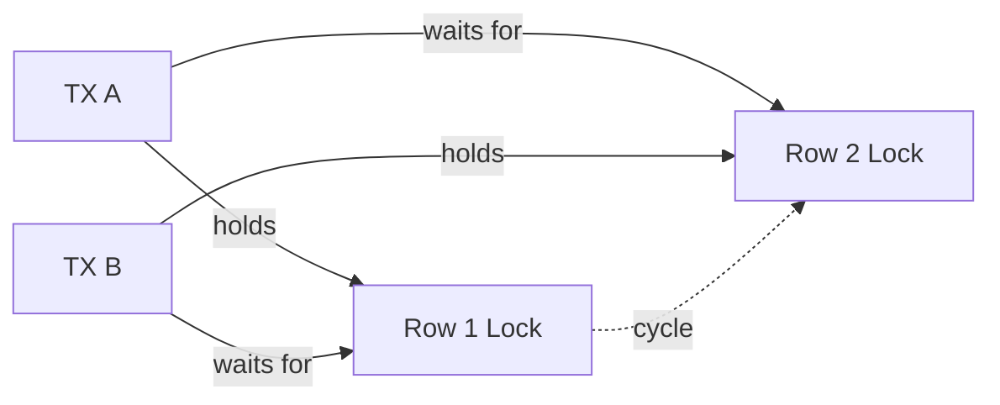
```mermaid
flowchart LR
    A[TX A] -->|holds| R1[Row 1 Lock]
    A -->|waits for| R2[Row 2 Lock]
    B[TX B] -->|holds| R2
    B -->|waits for| R1
    R1 -.->|cycle| R2
```

### 📶 Gradual Depth

**Level 1 - What it is:**
A deadlock is when two transactions are stuck waiting for each other. PostgreSQL detects this automatically and cancels one transaction so the other can continue.

**Level 2 - How to use it:**
Wrap transactions in retry logic. When you receive a deadlock error (SQLSTATE 40P01), roll back and retry the entire transaction. Access rows in a consistent order (e.g., always by ascending primary key) to prevent cycles.

**Level 3 - How it works:**
After waiting `deadlock_timeout` milliseconds, the blocked backend builds a wait-for graph by examining `pg_locks` for lock conflicts. If it finds a cycle, it aborts itself with `ERROR: deadlock detected`. The DETAIL log message shows the full chain: which transactions held and waited for which locks, on which tuples. The surviving transaction is unblocked and proceeds.

**Level 4 - Production mastery:**
High deadlock rates indicate an access pattern problem, not a database problem. Common root causes: inconsistent row ordering in batch updates, concurrent updates to parent and child rows in different orders, and retry storms where retried deadlock victims immediately re-deadlock. Monitor `pg_stat_database.deadlocks` for the per-database deadlock counter. Use log analysis to identify the recurring deadlock pattern and fix the application access order.

### ⚙️ How It Works

**Phase 1 - Lock wait:** Transaction A requests a row lock held by Transaction B. A enters the wait queue and starts a timer for `deadlock_timeout`.

**Phase 2 - Timeout trigger:** After `deadlock_timeout` (default 1s) with no progress, A's backend invokes the deadlock detector.

**Phase 3 - Graph walk:** The detector traverses the wait-for graph: A waits for B; does B wait for anyone? If B waits for A (directly or transitively through other transactions), a cycle exists.

**Phase 4 - Victim selection:** PostgreSQL aborts the transaction that triggered the check (the one that has been waiting). This is simpler than cost-based victim selection but effective.

**Phase 5 - Recovery:** The victim receives `ERROR: deadlock detected` and must ROLLBACK. The surviving transaction's lock is granted, and it proceeds.

```
  Detection Timeline
  t=0s: TX A starts waiting for TX B
  t=1s: deadlock_timeout fires
        -> build wait-for graph
        -> cycle found: A->B->A
        -> abort TX A
        -> TX B unblocked, proceeds
```

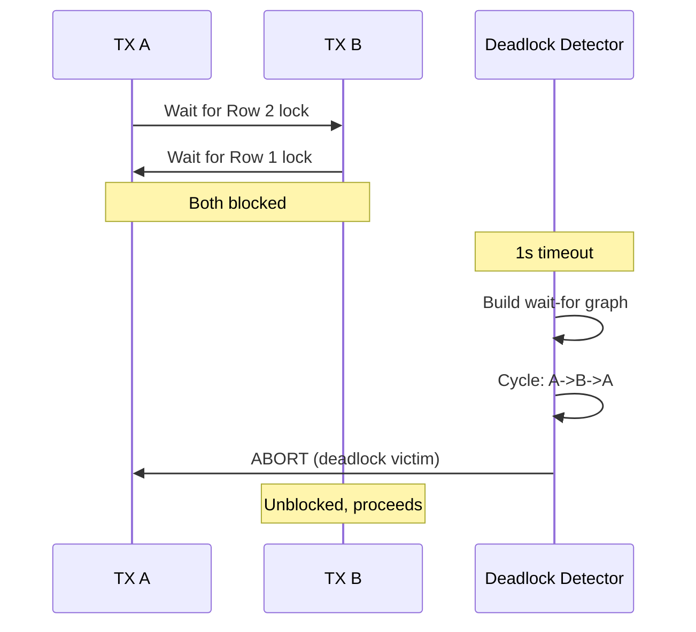
```mermaid
sequenceDiagram
    participant A as TX A
    participant B as TX B
    participant DD as Deadlock Detector
    A->>B: Wait for Row 2 lock
    B->>A: Wait for Row 1 lock
    Note over A,B: Both blocked
    Note over DD: 1s timeout
    DD->>DD: Build wait-for graph
    DD->>DD: Cycle: A->B->A
    DD->>A: ABORT (deadlock victim)
    Note over B: Unblocked, proceeds
```

**BAD:**

```sql
-- Opposite lock order = deadlock
-- TX1: UPDATE accounts WHERE id=1;
--       UPDATE accounts WHERE id=2;
-- TX2: UPDATE accounts WHERE id=2;
--       UPDATE accounts WHERE id=1;
```

**GOOD:**

```sql
-- Consistent lock order
-- TX1: UPDATE accounts WHERE id=1;
--       UPDATE accounts WHERE id=2;
-- TX2: UPDATE accounts WHERE id=1;
--       UPDATE accounts WHERE id=2;
```

### 🚨 Failure Modes

**Failure 1 - Deadlock storm from batch operations:**
**Symptom:** `pg_stat_database.deadlocks` counter climbs rapidly. Application logs show repeated deadlock errors. Throughput collapses.
**Root cause:** Multiple batch jobs update overlapping sets of rows in different orders. Each job acquires row locks in the order rows are found (e.g., based on different WHERE clauses), creating crossing lock patterns.
**Diagnostic:**

```sql
SELECT datname, deadlocks
FROM pg_stat_database
WHERE deadlocks > 0;
-- Check PostgreSQL log for DETAIL messages
```

**Fix:** Sort rows by primary key before updating within each batch. Use `SELECT ... FOR UPDATE ORDER BY id` to lock rows in consistent order. Alternatively, serialize batch jobs through advisory locks.

**Failure 2 - Deadlock retry amplification:**
**Symptom:** Deadlock rate increases exponentially under load. Retried transactions immediately re-deadlock with other retrying transactions.
**Root cause:** Retry logic fires immediately after deadlock error, causing retried transactions to collide with other retried transactions in the same conflict pattern.
**Diagnostic:**

```
Application logs showing rapid deadlock-retry-deadlock
cycles with increasing frequency.
```

**Fix:** Add randomized exponential backoff to retry logic: wait a random duration (e.g., 50-200ms) before retrying. This desynchronizes conflicting transactions.

### 🔬 Production Reality

A typical pattern in order processing: Transaction A updates `orders` row, then updates the customer's `accounts` row. Transaction B updates the same customer's `accounts` row, then updates the `orders` row. Under concurrent load, A holds the order lock and waits for the account lock while B holds the account lock and waits for the order lock. The fix: establish a canonical lock ordering across the application - always acquire locks in the order (accounts, then orders) regardless of the business operation. This is documented as a team convention and enforced through code review. The deadlock counter drops to zero.

### ⚖️ Trade-offs & Alternatives

| Aspect                 | PostgreSQL deadlock detection | Application-level ordering      | Optimistic concurrency (retry on conflict) |
| ---------------------- | ----------------------------- | ------------------------------- | ------------------------------------------ |
| Detection method       | Wait-for graph after timeout  | Prevention (no cycles possible) | Version check at commit                    |
| Performance cost       | 1s detection delay            | Zero (no deadlocks occur)       | Retry cost on conflict                     |
| Application complexity | Low (automatic)               | Moderate (enforced ordering)    | High (retry logic everywhere)              |
| Throughput impact      | Low (rare events)             | None                            | Varies with conflict rate                  |
| Data integrity         | Guaranteed                    | Guaranteed                      | Guaranteed (if retry is correct)           |

### ⚡ Decision Snap

**USE WHEN:**

- Deadlocks are rare (< 1 per minute) and retry logic handles them gracefully
- Application access patterns are inherently unpredictable (user-driven concurrent edits)
- Cost of preventing all deadlocks exceeds cost of detecting and retrying

**AVOID WHEN:**

- Deadlock rate exceeds 10 per minute - fix the access pattern instead of relying on detection
- Real-time systems where 1s detection delay is unacceptable

**PREFER application-level lock ordering WHEN:**

- The set of resources locked per transaction is predictable
- Performance requirements demand zero deadlock overhead
- Team can enforce consistent ordering through code conventions

### ⚠️ Top Traps

| #   | Misconception                                     | Reality                                                                                                                       |
| --- | ------------------------------------------------- | ----------------------------------------------------------------------------------------------------------------------------- |
| 1   | Deadlocks indicate a PostgreSQL bug               | Deadlocks are a normal consequence of conflicting application access patterns; PostgreSQL handles them correctly              |
| 2   | Reducing deadlock_timeout reduces deadlock impact | Lower timeout only detects faster; it does not prevent deadlocks. Prevention requires consistent lock ordering                |
| 3   | Only two transactions can deadlock                | N transactions can form a cycle (A waits for B, B waits for C, C waits for A); PostgreSQL detects cycles of any length        |
| 4   | The transaction that did less work is aborted     | PostgreSQL aborts the transaction that triggered the timeout check, not the one with less work                                |
| 5   | Foreign key checks cannot cause deadlocks         | INSERT into a child table acquires a key-share lock on the parent row; concurrent operations on parent and child can deadlock |

### 🪜 Learning Ladder

**Prerequisites:**

- SQL-090 Row-Level vs Table-Level Locking - understand the lock types that participate in deadlocks
- SQL-091 Lock Escalation and Contention - understand lock wait mechanics

**THIS:** SQL-092 Deadlock Detection and Resolution

**Next steps:**

- SQL-093 Advisory Locks - Application-Level Coordination - lightweight locks that can prevent deadlock-prone patterns
- SQL-070 Long Transaction Anti-Pattern - long transactions increase deadlock windows
- SQL-104 Zero-Downtime Schema Migrations - migration deadlocks with concurrent DDL and DML

**The Surprising Truth:**
The most common deadlock in PostgreSQL production systems is not between two UPDATE statements - it is between an INSERT into a child table (which acquires a FOR KEY SHARE lock on the parent row) and an UPDATE of the parent row (which acquires FOR NO KEY UPDATE). This cross-table, cross-lock-type deadlock is invisible unless you understand PostgreSQL's implicit foreign key locking.

**Further Reading:**

- PostgreSQL Documentation: Deadlocks (postgresql.org/docs/current/explicit-locking.html#LOCKING-DEADLOCKS)
- Dijkstra, E.W. "Hierarchical Ordering of Sequential Processes", Acta Informatica, 1971
- PostgreSQL Documentation: deadlock_timeout parameter (postgresql.org/docs/current/runtime-config-locks.html)

**Revision Card:**

1. Deadlocks are cycles in the wait-for graph; PostgreSQL detects them after deadlock_timeout (default 1s) and aborts one transaction
2. Prevention beats detection: access rows in consistent primary key order across all transactions
3. Foreign key constraints create implicit locks that cause non-obvious cross-table deadlocks

---

---

# SQL-093 Advisory Locks - Application-Level Coordination

**TL;DR** - Advisory locks are PostgreSQL-managed locks on arbitrary integer keys, enabling application-level coordination like job deduplication and distributed mutexes without touching table rows.

### 🔥 Problem Statement

Applications frequently need coordination beyond row-level locking: ensuring only one worker processes a batch job, preventing duplicate cron executions, or serializing access to external resources. Without advisory locks, teams create "lock tables" with `SELECT ... FOR UPDATE` on synthetic rows, adding schema complexity, VACUUM overhead, and contention on real table pages. Advisory locks provide a lightweight, in-memory mechanism for application-level coordination that does not touch heap pages, does not create dead tuples, and does not require VACUUM.

### 📜 Historical Context

Advisory locks were introduced in PostgreSQL 8.2 (2006) as a response to common patterns where applications created lock tables or used external coordination mechanisms like Redis or ZooKeeper. The implementation reuses PostgreSQL's existing lock manager infrastructure, adding a namespace for "advisory" locks keyed by one or two 32-bit integers (or a single 64-bit integer). Session-level and transaction-level variants were added to support different lifecycle requirements. The feature has remained stable with minimal changes since its introduction.

### 🔩 First Principles

**CORE INVARIANTS:**

1. Advisory locks are managed by the PostgreSQL lock manager but have no relation to any table or row - they lock abstract integer keys
2. Session-level advisory locks persist until explicitly released or the session ends; transaction-level locks release at COMMIT/ROLLBACK
3. Advisory locks participate in deadlock detection like any other PostgreSQL lock

**DERIVED DESIGN:**
The lock manager stores advisory locks in the same hash table as regular locks, using the advisory lock key as the lock identifier. This means advisory locks benefit from the same deadlock detection, wait queue management, and `pg_locks` visibility as regular locks. Two modes are available: exclusive (one holder) and shared (multiple holders).

**THE TRADE-OFF:**
**Gain:** Zero heap I/O, no dead tuples, no VACUUM overhead; purely in-memory coordination with full deadlock detection.
**Cost:** Lock manager memory consumption (each advisory lock uses a lock table slot); no automatic release for session-level locks (forgetting to release causes resource leaks); keys are opaque integers, making debugging harder.

### 🧠 Mental Model

> Think of a hotel front desk with numbered key slots. Any guest can request a specific slot number (key). If the slot is empty, they get the key. If occupied, they wait. The keys do not open any actual room - they are just tokens of agreement between guests about who gets to do something.

- "Key slot number" -> advisory lock key (integer)
- "Getting the key" -> `pg_advisory_lock(key)` succeeds
- "Key does not open a room" -> no connection to any table or row

**Where this analogy breaks down:** Advisory locks can be shared (multiple guests hold the same key) or exclusive. The `try` variants return immediately if the key is unavailable rather than waiting.

### 🧩 Components

- **pg_advisory_lock(key)** - acquire exclusive session-level lock (blocks if held)
- **pg_try_advisory_lock(key)** - non-blocking version; returns true/false
- **pg_advisory_xact_lock(key)** - transaction-level; auto-releases at COMMIT/ROLLBACK
- **pg_advisory_unlock(key)** - release a session-level lock
- **pg_locks** - advisory locks visible with `locktype = 'advisory'`
- **Two-key variant** - `pg_advisory_lock(key1, key2)` using two int4 values

```
  Advisory Lock Usage Pattern
  Worker A:
    pg_try_advisory_lock(12345)
    -> true (acquired)
    -> process job
    -> pg_advisory_unlock(12345)

  Worker B (concurrent):
    pg_try_advisory_lock(12345)
    -> false (already held)
    -> skip job (another worker has it)
```

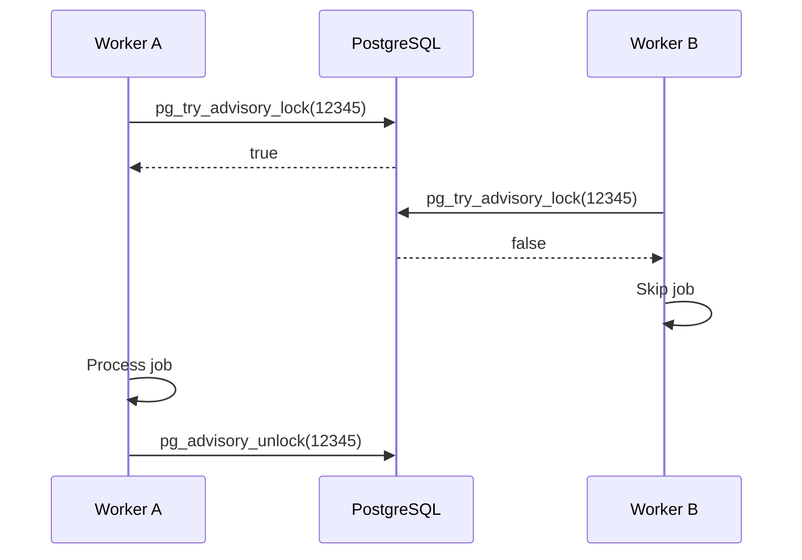
```mermaid
sequenceDiagram
    participant WA as Worker A
    participant PG as PostgreSQL
    participant WB as Worker B
    WA->>PG: pg_try_advisory_lock(12345)
    PG-->>WA: true
    WB->>PG: pg_try_advisory_lock(12345)
    PG-->>WB: false
    WB->>WB: Skip job
    WA->>WA: Process job
    WA->>PG: pg_advisory_unlock(12345)
```

### 📶 Gradual Depth

**Level 1 - What it is:**
Advisory locks let your application claim a "named lock" in PostgreSQL using an integer key. Other sessions can check if the lock is held before proceeding. The database does not enforce what the lock protects - your application decides.

**Level 2 - How to use it:**
For job deduplication: `SELECT pg_try_advisory_lock(hashtext('daily_report'))` returns true if no other session holds it. Process the job, then call `pg_advisory_unlock`. For transaction-scoped work: use `pg_advisory_xact_lock` which releases automatically at transaction end.

**Level 3 - How it works:**
The lock manager stores advisory locks in the same shared memory hash table as table and row locks. The key is stored as the lock's "object" identifier. Exclusive advisory locks conflict with each other; shared advisory locks (`pg_advisory_lock_shared`) allow multiple holders. Deadlock detection works across advisory and regular locks - if a session holds an advisory lock and waits for a regular lock that is held by another session waiting for the same advisory lock, PostgreSQL detects the cycle.

**Level 4 - Production mastery:**
Key design is critical. Use `hashtext('meaningful_name')` to generate deterministic integer keys from human-readable names. For entity-scoped locks, use the two-key variant: `pg_advisory_lock(table_oid, entity_id)` to namespace by table. Monitor advisory lock usage via `pg_locks WHERE locktype = 'advisory'`. Beware: session-level advisory locks accumulate if not released, consuming lock table slots. In PgBouncer transaction-mode pooling, session-level advisory locks are unsafe because sessions are recycled - use transaction-level locks only.

### ⚙️ How It Works

**Phase 1 - Key generation:** Application generates an integer key from a meaningful identifier. Common patterns: `hashtext('job_name')` for named locks, `(table_oid, row_id)` for entity locks.

**Phase 2 - Lock acquisition:** `pg_advisory_lock(key)` requests an exclusive advisory lock from the lock manager. If available, granted immediately. If held by another session, the caller blocks (or returns false for `try` variant).

**Phase 3 - Protected work:** The application performs the coordinated work (process job, run migration, update external system).

**Phase 4 - Release:** For session-level: explicit `pg_advisory_unlock(key)`. For transaction-level: automatic at COMMIT/ROLLBACK. Session-level locks can be acquired multiple times and must be released the same number of times.

```
  Advisory Lock with PgBouncer
  Session mode:   SAFE (session = connection)
  Transaction mode: DANGER for session locks
                    SAFE for xact locks only

  Recommendation:
  PgBouncer transaction mode
    -> use pg_advisory_xact_lock() only
    -> never use pg_advisory_lock()
```

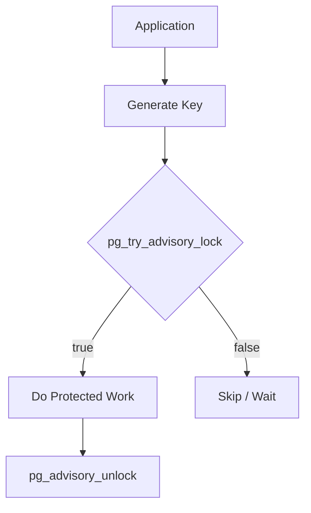
```mermaid
flowchart TD
    APP[Application] --> KEY[Generate Key]
    KEY --> TRY{pg_try_advisory_lock}
    TRY -->|true| WORK[Do Protected Work]
    TRY -->|false| SKIP[Skip / Wait]
    WORK --> REL[pg_advisory_unlock]
```

**BAD:**

```sql
-- Session lock + PgBouncer tx mode
SELECT pg_advisory_lock(42);
-- Lost on connection reassignment
```

**GOOD:**

```sql
BEGIN;
SELECT pg_advisory_xact_lock(42);
-- Do work
COMMIT;  -- lock auto-released
```

### 🚨 Failure Modes

**Failure 1 - Session lock leak:**
**Symptom:** Lock table fills up over time. `pg_locks` shows growing advisory lock entries from long-lived sessions. Eventually: "ERROR: out of shared memory."
**Root cause:** Application acquires session-level advisory locks but fails to release them in error paths (missing `finally` block or `ENSURE` clause).
**Diagnostic:**

```sql
SELECT pid, classid, objid, granted,
       mode
FROM pg_locks
WHERE locktype = 'advisory'
ORDER BY pid;
```

**Fix:** Use transaction-level advisory locks (`pg_advisory_xact_lock`) wherever possible. For session-level locks, implement release in `finally`/`ensure` blocks. Monitor advisory lock count per session.

**Failure 2 - Advisory lock with PgBouncer transaction pooling:**
**Symptom:** Session-level advisory locks appear released prematurely or are held by the wrong application session. Coordination breaks silently.
**Root cause:** PgBouncer transaction pooling reassigns database sessions between application connections at transaction boundaries. A session-level advisory lock acquired by connection A may be visible to connection B after reassignment.
**Diagnostic:**

```
Check PgBouncer pool mode (should be
session mode for session-level advisory
locks, or use xact-level locks only).
```

**Fix:** Switch to `pg_advisory_xact_lock` when using PgBouncer in transaction mode. Or switch PgBouncer to session mode for connections that use advisory locks.

### 🔬 Production Reality

A job scheduling system uses advisory locks to prevent duplicate execution: each job type gets a unique lock key derived from `hashtext(job_name)`. Under PgBouncer transaction-mode pooling, a subtle bug appears: Worker A acquires a session-level advisory lock, processes a job, and releases it. But between acquisition and release, PgBouncer reassigns the database session. Worker B now gets a connection that appears to have the lock available (different database session), acquires it, and both workers process the same job simultaneously. The fix: switch all advisory locks to `pg_advisory_xact_lock` (transaction-scoped), ensuring locks are released when PgBouncer reclaims the connection at transaction end.

### ⚖️ Trade-offs & Alternatives

| Aspect                | Advisory locks        | Lock table pattern    | Redis distributed lock | External coordinator (ZooKeeper) |
| --------------------- | --------------------- | --------------------- | ---------------------- | -------------------------------- |
| Infrastructure        | Built into PostgreSQL | Built into PostgreSQL | Separate Redis server  | Separate ZK cluster              |
| I/O overhead          | None (in-memory)      | Heap I/O + VACUUM     | Network I/O            | Network I/O                      |
| Cross-database        | No                    | No                    | Yes                    | Yes                              |
| Deadlock detection    | Yes (PostgreSQL)      | Yes (PostgreSQL)      | No (timeout only)      | Yes (session expiry)             |
| Failure mode on crash | Auto-release          | Auto-release          | TTL expiry             | Ephemeral node removal           |

### ⚡ Decision Snap

**USE WHEN:**

- Coordinating work between PostgreSQL-connected workers (job deduplication, cron guard, migration serialization)
- Need lightweight locking without table I/O or VACUUM overhead
- All participants connect to the same PostgreSQL instance

**AVOID WHEN:**

- Coordination spans multiple databases or non-PostgreSQL systems
- Using PgBouncer in transaction mode with session-level advisory locks

**PREFER Redis/external locks WHEN:**

- Coordination involves services that do not connect to PostgreSQL
- Lock granularity requires TTL-based auto-expiry (advisory locks have no built-in TTL)

### ⚠️ Top Traps

| #   | Misconception                                               | Reality                                                                                                                               |
| --- | ----------------------------------------------------------- | ------------------------------------------------------------------------------------------------------------------------------------- |
| 1   | Advisory locks protect tables or rows                       | Advisory locks protect nothing automatically; they are abstract coordination tokens that your application must check                  |
| 2   | Session-level locks are safer than transaction-level        | Session-level locks persist beyond transaction boundaries and are prone to leaks; transaction-level locks auto-release                |
| 3   | Advisory lock keys are globally unique                      | Keys are namespaced per database only; different databases can have conflicting keys without interaction                              |
| 4   | pg_try_advisory_lock is always better than blocking variant | Non-blocking acquisition requires application logic to handle the "not acquired" case; blocking is simpler when waiting is acceptable |
| 5   | Advisory locks work correctly with all connection poolers   | PgBouncer transaction mode breaks session-level advisory locks; only transaction-level locks are safe                                 |

### 🪜 Learning Ladder

**Prerequisites:**

- SQL-090 Row-Level vs Table-Level Locking - understand the lock infrastructure advisory locks reuse
- SQL-092 Deadlock Detection and Resolution - advisory locks participate in deadlock detection

**THIS:** SQL-093 Advisory Locks - Application-Level Coordination

**Next steps:**

- SQL-102 Connection Pooling - PgBouncer and HikariCP - understand pooling modes that affect advisory lock safety
- SQL-104 Zero-Downtime Schema Migrations - advisory locks guard migration execution
- SQL-113 Sharding Strategies - Application vs Proxy - distributed coordination beyond single-instance advisory locks

**The Surprising Truth:**
Advisory locks are the most underused feature in PostgreSQL. Teams routinely add Redis to their stack for job deduplication or distributed locking when a simple `pg_try_advisory_lock(hashtext('job_name'))` would eliminate the external dependency, the network hop, and the TTL-expiry race condition - with full deadlock detection included for free.

**Further Reading:**

- PostgreSQL Documentation: Advisory Locks (postgresql.org/docs/current/explicit-locking.html#ADVISORY-LOCKS)
- PostgreSQL Documentation: Advisory Lock Functions (postgresql.org/docs/current/functions-admin.html#FUNCTIONS-ADVISORY-LOCKS)
- PgBouncer Documentation: Pool Modes (pgbouncer.github.io/config.html)

**Revision Card:**

1. Advisory locks are in-memory locks on integer keys - no heap I/O, no dead tuples, no VACUUM overhead
2. Use transaction-level locks (pg_advisory_xact_lock) with PgBouncer; session-level locks break under transaction pooling
3. Derive keys from meaningful names with hashtext() to avoid magic numbers and collisions

---

---

# SQL-094 Query Planner and Cost-Based Optimization

**TL;DR** - PostgreSQL's query planner evaluates multiple execution strategies, estimates each one's cost using table statistics, and selects the plan with the lowest estimated total cost.

### 🔥 Problem Statement

A SQL query declares WHAT data to retrieve but not HOW. The database must decide: which indexes to use, which join algorithm, which scan direction, what join order. For a query joining five tables, there are 5! = 120 possible join orderings, each with multiple join algorithms and scan methods. At production scale, picking the wrong plan turns a 10 ms query into a 10 minute query. The query planner must explore the plan space efficiently and pick the cheapest plan using statistical estimates of data distribution, table sizes, and I/O costs.

### 📜 Historical Context

Cost-based query optimization originates from IBM's System R and the Selinger optimizer (1979), which introduced dynamic programming for join ordering and cost estimation based on table statistics. PostgreSQL's planner is a descendant of this tradition, using a bottom-up dynamic programming approach for small numbers of tables and a Genetic Query Optimizer (GEQO) for queries joining more than 12 tables (configurable via `geqo_threshold`). The cost model has evolved over decades, adding support for index-only scans, parallel query plans, and parameterized paths.

### 🔩 First Principles

**CORE INVARIANTS:**

1. The planner evaluates multiple candidate plans and selects the one with the lowest estimated total cost
2. Cost estimation depends on statistics (pg_statistic) collected by ANALYZE - stale statistics cause wrong plans
3. The planner optimizes for estimated I/O + CPU cost, not actual execution time

**DERIVED DESIGN:**
For each table, the planner considers access paths: sequential scan, index scan (for each relevant index), bitmap index scan, and index-only scan. For each join, it considers nested loop, hash join, and merge join. For join ordering, it uses dynamic programming (up to `geqo_threshold` tables) to find the cheapest ordering. The cost model uses configurable parameters (`seq_page_cost`, `random_page_cost`, `cpu_tuple_cost`) to translate physical operations into cost units.

**THE TRADE-OFF:**
**Gain:** Declarative SQL - the planner finds efficient execution strategies without manual hint-based optimization.
**Cost:** Planning overhead for complex queries; wrong estimates lead to catastrophically bad plans; limited ability to override planner decisions without hints (PostgreSQL has no optimizer hints).

### 🧠 Mental Model

> Think of the planner as a GPS navigation system. You specify the destination (query result), and the GPS evaluates multiple routes (plans), estimates each one's travel time (cost) based on traffic data (statistics), and picks the fastest route. If the traffic data is stale, the GPS may route you through a traffic jam (bad plan).

- "Traffic data" -> pg_statistic (table and column statistics)
- "Route options" -> candidate execution plans
- "Estimated travel time" -> plan cost in arbitrary units

**Where this analogy breaks down:** A GPS can reroute mid-trip; the query planner commits to a plan before execution starts and cannot change it mid-query (except with adaptive execution in some other databases).

### 🧩 Components

- **Parser** - converts SQL text into a parse tree
- **Rewriter** - applies view definitions and rules
- **Planner/Optimizer** - generates candidate plans, estimates costs, selects cheapest
- **Executor** - runs the selected plan node by node
- **pg_statistic** - stores per-column statistics (most common values, histogram, correlation, distinct count)
- **Cost model** - functions estimating I/O and CPU cost for each plan node
- **GEQO** - genetic algorithm for join ordering when table count exceeds `geqo_threshold`

```
  Query Processing Pipeline
  SQL Text -> Parser -> Rewriter -> Planner
              |                      |
              v                      v
           Parse Tree        Plan 1 (cost=100)
                             Plan 2 (cost=50)  <-win
                             Plan 3 (cost=200)
                                     |
                                     v
                                  Executor
                                     |
                                     v
                                  Results
```

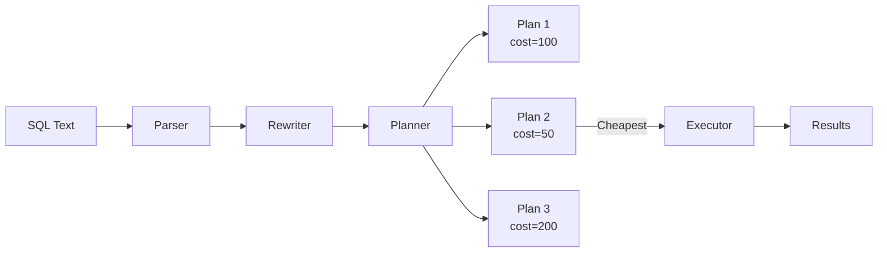
```mermaid
flowchart LR
    SQL[SQL Text] --> P[Parser]
    P --> RW[Rewriter]
    RW --> PL[Planner]
    PL --> P1["Plan 1\ncost=100"]
    PL --> P2["Plan 2\ncost=50"]
    PL --> P3["Plan 3\ncost=200"]
    P2 -->|Cheapest| EX[Executor]
    EX --> RES[Results]
```

### 📶 Gradual Depth

**Level 1 - What it is:**
The query planner is the component that decides HOW to execute your SQL query. It picks which indexes to use, how to join tables, and in what order - all automatically.

**Level 2 - How to use it:**
Run `EXPLAIN` before your query to see the plan. Run `EXPLAIN ANALYZE` to see the plan with actual execution times. Compare estimated rows to actual rows - large discrepancies indicate stale statistics. Run `ANALYZE tablename` to refresh statistics.

**Level 3 - How it works:**
For each table, the planner generates access paths with estimated costs. A sequential scan costs `seq_page_cost * pages + cpu_tuple_cost * rows`. An index scan costs `random_page_cost * index_pages + cpu_index_tuple_cost * index_tuples`. The planner builds join trees bottom-up, combining the cheapest access paths with join algorithms, and prunes dominated plans (higher cost, same result) at each level.

**Level 4 - Production mastery:**
The most common planner failure is cardinality misestimation: the planner estimates a filter will return 100 rows, but it returns 100,000. This causes it to pick nested loop join (good for small results) instead of hash join (good for large results). Fix by running `ANALYZE`, creating extended statistics (`CREATE STATISTICS` for correlated columns), or adjusting `default_statistics_target`. When the planner consistently picks wrong plans for a specific query, use `pg_hint_plan` extension (third party) or rewrite the query to guide the planner.

### ⚙️ How It Works

**Phase 1 - Access path generation:** For each table in the query, generate all possible scan methods (sequential, each applicable index, bitmap). Estimate selectivity of WHERE clauses using pg_statistic.

**Phase 2 - Join ordering (dynamic programming):** For N tables, build optimal join trees bottom-up. Start with 2-table joins, then 3-table, etc. At each level, keep only the cheapest plan for each set of tables joined.

**Phase 3 - Join algorithm selection:** For each join pair, evaluate nested loop, hash join, and merge join. Cost depends on estimated row counts and available memory (`work_mem`).

**Phase 4 - Plan finalization:** Add sort nodes (if ORDER BY requires it), aggregate nodes (for GROUP BY), limit nodes, and other top-level operations. Select the complete plan with the lowest total cost.

```
  Join Order Optimization (3 tables)
  Tables: A(100), B(10000), C(50)

  2-way:   A-B  cost=500
           A-C  cost=150  <- cheapest start
           B-C  cost=2000

  3-way:  (A-C)-B  cost=150+300=450  <-win
          (A-B)-C  cost=500+200=700
          (B-C)-A  cost=2000+100=2100
```

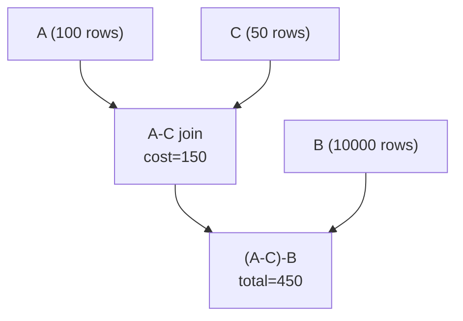
```mermaid
flowchart TD
    A["A (100 rows)"]
    B["B (10000 rows)"]
    C["C (50 rows)"]
    AC["A-C join\ncost=150"]
    ACB["(A-C)-B\ntotal=450"]
    A --> AC
    C --> AC
    AC --> ACB
    B --> ACB
```

**BAD:**

```sql
SET enable_seqscan = off;
SELECT * FROM large_table
WHERE status = 'active';
-- Disables seq scan for session
```

**GOOD:**

```sql
ANALYZE large_table;
EXPLAIN ANALYZE
SELECT * FROM large_table
WHERE status = 'active';
-- Let planner decide with good stats
```

### 🚨 Failure Modes

**Failure 1 - Cardinality misestimation:**
**Symptom:** `EXPLAIN ANALYZE` shows estimated rows differing from actual rows by 10x or more. Query uses nested loop where hash join would be faster.
**Root cause:** Stale statistics, correlated columns not captured by single-column statistics, or non-uniform data distribution.
**Diagnostic:**

```sql
EXPLAIN ANALYZE
SELECT * FROM orders o
JOIN customers c ON o.customer_id = c.id
WHERE o.status = 'pending'
  AND o.region = 'EU';
-- Compare "rows=" (estimated) vs "actual"
```

**Fix:** Run `ANALYZE orders;`. Create extended statistics: `CREATE STATISTICS orders_status_region (dependencies) ON status, region FROM orders;`. Increase `default_statistics_target` for columns with skewed distributions.

**Failure 2 - Wrong index selection:**
**Symptom:** Planner uses a sequential scan on a large table when an index exists. Or uses an index scan when sequential would be faster.
**Root cause:** Cost parameters (`random_page_cost`, `seq_page_cost`) do not reflect actual storage performance. On SSDs, `random_page_cost` should be close to `seq_page_cost` (e.g., 1.1 vs 1.0), not the default 4.0.
**Diagnostic:**

```sql
SHOW random_page_cost;
SHOW seq_page_cost;
-- If on SSD and random_page_cost = 4:
SET random_page_cost = 1.1;
EXPLAIN ANALYZE <query>;
-- Compare plans and times.
```

**Fix:** Set `random_page_cost = 1.1` (or similar) for SSD storage. Set `effective_cache_size` to ~75% of total RAM to help the planner estimate cache hit likelihood.

### 🔬 Production Reality

A common production pattern: a query runs fine for months, then suddenly slows from 5 ms to 30 seconds after a data migration. Investigation reveals the migration loaded 500,000 rows with `status = 'archived'`, skewing the statistics for the `status` column. The planner now estimates `WHERE status = 'active'` returns 80% of rows (the new average) instead of 2% (the pre-migration reality). It switches from index scan to sequential scan. An immediate `ANALYZE` fixes the statistics, and the plan reverts. The lesson: any bulk data change should be followed by `ANALYZE` on affected tables.

### ⚖️ Trade-offs & Alternatives

| Aspect               | PostgreSQL CBO                         | Oracle CBO              | MySQL optimizer          | Hint-based (manual) |
| -------------------- | -------------------------------------- | ----------------------- | ------------------------ | ------------------- |
| Plan selection       | Statistics-based                       | Statistics-based        | Statistics + heuristics  | Developer chooses   |
| Adaptability         | Re-plans per execution (parameterized) | Adaptive cursor sharing | Limited                  | None                |
| Hint support         | None (third-party pg_hint_plan)        | Extensive hint syntax   | Limited hints            | Full control        |
| GEQO for large joins | Yes (>12 tables)                       | Star transformation     | Limited                  | N/A                 |
| Plan caching         | Prepared statement plans               | Cursor cache            | Query cache (deprecated) | N/A                 |

### ⚡ Decision Snap

**USE WHEN:**

- Diagnosing slow queries: always start with EXPLAIN ANALYZE
- After bulk data loads: run ANALYZE to update statistics
- Tuning cost parameters for your storage hardware (SSD vs HDD)

**AVOID WHEN:**

- Do not disable planner components (enable_hashjoin = off) in production - fix the root cause instead
- Do not over-engineer statistics targets for all columns; focus on columns in WHERE and JOIN clauses

**PREFER manual query rewriting WHEN:**

- The planner consistently misestimates a specific pattern and statistics fixes do not help
- CTEs or subquery restructuring can provide the planner with better intermediate cardinality estimates

### ⚠️ Top Traps

| #   | Misconception                                            | Reality                                                                                                                           |
| --- | -------------------------------------------------------- | --------------------------------------------------------------------------------------------------------------------------------- |
| 1   | A higher cost number always means a slower query         | Cost is in arbitrary units relative to `seq_page_cost`; it estimates I/O+CPU, not wall-clock time                                 |
| 2   | EXPLAIN shows the actual performance                     | EXPLAIN shows estimated costs; only EXPLAIN ANALYZE shows actual execution times                                                  |
| 3   | PostgreSQL always uses indexes when they exist           | The planner may choose a sequential scan if it estimates the query will read most of the table - this is often correct            |
| 4   | More indexes always improve query performance            | Each index adds planning overhead, and the planner may choose a suboptimal index; targeted indexes outperform broad coverage      |
| 5   | The planner sees parameter values in prepared statements | After several executions, PostgreSQL may use a generic plan that does not see parameter values, potentially choosing a worse plan |

### 🪜 Learning Ladder

**Prerequisites:**

- SQL-060 Execution Plans Deep Dive - EXPLAIN ANALYZE - know how to read execution plans
- SQL-061 Index Types - B-Tree, Hash, GIN, GiST, BRIN - understand the access paths the planner considers

**THIS:** SQL-094 Query Planner and Cost-Based Optimization

**Next steps:**

- SQL-095 Statistics and Cardinality Estimation - deeper dive into the statistics the planner depends on
- SQL-096 Join Algorithms - Nested Loop, Hash, Merge - understand the join strategies the planner chooses between
- SQL-097 Plan Regression and pg_stat_statements - detecting when the planner starts choosing worse plans

**The Surprising Truth:**
PostgreSQL has no optimizer hints by design. The project philosophy is that if the planner chooses a bad plan, the fix should be better statistics, better cost parameters, or planner improvements - not per-query overrides that become unmaintainable. This forces teams to fix root causes instead of applying band-aids, but it also means there is no escape hatch when the planner is wrong.

**Further Reading:**

- Selinger et al. "Access Path Selection in a Relational Database Management System", ACM SIGMOD, 1979
- PostgreSQL Documentation: Planner Cost Constants (postgresql.org/docs/current/runtime-config-query.html)
- PostgreSQL Documentation: EXPLAIN (postgresql.org/docs/current/sql-explain.html)

**Revision Card:**

1. The planner uses statistics-based cost estimation to select the cheapest execution plan from many candidates
2. Stale statistics are the #1 cause of bad plans - run ANALYZE after bulk data changes
3. Set random_page_cost close to seq_page_cost on SSDs to prevent the planner from over-penalizing index scans

---

---

# SQL-095 Statistics and Cardinality Estimation

**TL;DR** - PostgreSQL collects column-level statistics (histograms, most common values, distinct counts) via ANALYZE, and uses them to estimate how many rows each query operation will produce.

### 🔥 Problem Statement

The query planner's plan quality is only as good as its cardinality estimates. If the planner estimates a filter returns 100 rows but it actually returns 100,000, it will pick nested loop join (efficient for small sets) instead of hash join (efficient for large sets), turning a 10 ms query into a 60 second query. Statistics must accurately represent data distribution, correlation between columns, and skew. At production scale with billions of rows and hundreds of columns, maintaining accurate statistics without excessive ANALYZE overhead is a constant operational challenge.

### 📜 Historical Context

System R's original optimizer used uniform distribution assumptions - every value was equally likely. This worked poorly for real data, which is almost always skewed. PostgreSQL stores detailed per-column statistics in `pg_statistic` (exposed via `pg_stats`): most common values and their frequencies, a histogram of value distribution, correlation between physical and logical order, and distinct value count. PostgreSQL 10 introduced extended statistics (`CREATE STATISTICS`) for multi-column dependencies and MCV (most common value) lists, addressing the historical weakness of assuming column independence.

### 🔩 First Principles

**CORE INVARIANTS:**

1. Cardinality estimation is the single most important factor in plan quality - all cost calculations depend on estimated row counts
2. Statistics are samples, not exact counts - they approximate the true data distribution and can be wrong, especially at distribution tails
3. Single-column statistics assume column independence; correlated columns require extended statistics to estimate correctly

**DERIVED DESIGN:**
`ANALYZE` samples a configurable number of rows (`default_statistics_target * 300` pages) and computes: most common values (MCV list, up to `statistics_target` entries), a histogram of remaining values (up to `statistics_target` buckets), null fraction, average width, distinct value count (estimated), and correlation (physical vs logical order). The planner combines these per-column statistics to estimate selectivity of WHERE clauses, JOIN conditions, and GROUP BY cardinality.

**THE TRADE-OFF:**
**Gain:** Accurate cost estimation enables the planner to choose efficient plans for diverse data distributions.
**Cost:** ANALYZE consumes I/O and CPU; statistics occupy catalog storage; inaccurate statistics lead to catastrophically bad plans with no warning.

### 🧠 Mental Model

> Think of statistics as a survey about a city's population before building public transit routes (query plans). A good survey samples enough neighborhoods (data pages) to know that downtown (most common values) is dense, suburbs (histogram) are spread out, and certain areas are correlated (extended statistics). A transit planner using a survey from five years ago routes buses through empty lots (stale statistics).

- "Survey sample" -> ANALYZE sampling pages and rows
- "Neighborhood density" -> most common values and frequencies
- "Outdated survey" -> stale statistics after bulk data changes

**Where this analogy breaks down:** Database statistics are precise mathematical constructs (histograms, MCVs) with formal selectivity estimation formulas, not qualitative surveys.

### 🧩 Components

- **ANALYZE** - command that samples a table and updates pg_statistic
- **pg_statistic / pg_stats** - catalog table/view storing per-column statistics
- **MCV list** - most common values with their frequencies (up to statistics_target entries)
- **Histogram** - equal-depth histogram of non-MCV values
- **Correlation** - statistical correlation between physical tuple order and logical value order (affects index scan cost)
- **n_distinct** - estimated number of distinct values (negative value = fraction of rows)
- **Extended statistics** - multi-column statistics for functional dependencies and MCV combinations

```
  pg_stats for orders.status
  +-------------------+------------------+
  | most_common_vals  | {active,pending, |
  |                   |  shipped,done}   |
  | most_common_freqs | {0.45,0.30,      |
  |                   |  0.15,0.10}      |
  +-------------------+------------------+
  | histogram_bounds  | (remaining vals) |
  | null_frac         | 0.0              |
  | n_distinct        | 4                |
  | correlation       | 0.12             |
  +-------------------+------------------+
```

```mermaid
flowchart TD
    AN[ANALYZE] -->|samples pages| PGS[pg_statistic]
    PGS --> MCV[MCV List]
    PGS --> HIST[Histogram]
    PGS --> ND[n_distinct]
    PGS --> CORR[Correlation]
    MCV --> PL[Planner]
    HIST --> PL
    ND --> PL
    CORR --> PL
    PL --> PLAN[Query Plan]
```

### 📶 Gradual Depth

**Level 1 - What it is:**
Statistics tell the query planner about your data: how many distinct values a column has, which values are most common, and how values are distributed. The `ANALYZE` command collects these statistics.

**Level 2 - How to use it:**
Run `ANALYZE tablename;` after bulk loads or significant data changes. Check statistics accuracy with `EXPLAIN ANALYZE` - compare estimated rows to actual rows. Increase `default_statistics_target` (default 100) for columns with skewed distributions.

**Level 3 - How it works:**
`ANALYZE` reads a sample of `statistics_target * 300` pages. From the sample, it computes the most common values (top N values by frequency, where N = `statistics_target`) and builds an equal-depth histogram from the remaining values. Selectivity estimation for `WHERE status = 'active'` checks the MCV list first; if found, returns the stored frequency. If not found, it assumes uniform distribution across histogram buckets.

**Level 4 - Production mastery:**
The planner assumes column independence: the selectivity of `WHERE a = 1 AND b = 2` is estimated as `sel(a=1) * sel(b=2)`. If a and b are correlated (e.g., `country = 'US'` and `currency = 'USD'`), this underestimates or overestimates dramatically. Use `CREATE STATISTICS s1 (dependencies) ON country, currency FROM transactions;` to capture the correlation. Monitor `pg_stats_ext` for extended statistics health. For partitioned tables, per-partition statistics are crucial - the planner must know each partition's data distribution to enable partition pruning.

### ⚙️ How It Works

**Phase 1 - Sampling:** ANALYZE reads a random sample of pages from the table (up to `statistics_target * 300` pages). It collects all tuples from sampled pages.

**Phase 2 - MCV computation:** Sort sampled values by frequency. The top `statistics_target` values become the MCV list with their frequencies.

**Phase 3 - Histogram construction:** Remove MCV values from the sample. Divide remaining values into `statistics_target` equal-depth buckets (each bucket contains the same number of values). Store bucket boundaries.

**Phase 4 - Derived statistics:** Compute null_frac (fraction of NULLs), n_distinct (estimated distinct value count using the Haas-Stokes estimator), correlation (Pearson correlation between physical tuple position and value order), and average column width.

**Phase 5 - Catalog update:** Write all statistics to pg_statistic. The planner reads these on every planning cycle.

```
  Selectivity Estimation
  WHERE status = 'active'
  1. Check MCV: 'active' found, freq=0.45
  2. Return selectivity = 0.45

  WHERE amount > 500
  1. Not in MCV list
  2. Find histogram bucket containing 500
  3. Interpolate within bucket
  4. Return fraction of rows above 500
```

```mermaid
flowchart TD
    Q["WHERE status = 'active'"]
    Q --> MCV{In MCV list?}
    MCV -->|Yes| FREQ["Return freq=0.45"]
    MCV -->|No| HIST[Check histogram]
    HIST --> INTERP[Interpolate bucket]
    INTERP --> SEL[Return selectivity]
```

**BAD:**

```sql
SELECT * FROM orders
WHERE status = 'pending';
-- Planner estimates 20%, actual 0.1%
-- Seq scan instead of index scan
```

**GOOD:**

```sql
ALTER TABLE orders
ALTER COLUMN status
SET STATISTICS 1000;
ANALYZE orders;
-- Accurate distribution now visible
```

### 🚨 Failure Modes

**Failure 1 - Stale statistics after bulk load:**
**Symptom:** Query suddenly slows down after data migration or ETL job. `EXPLAIN ANALYZE` shows estimated rows 10-100x off from actual rows.
**Root cause:** ANALYZE has not run since the data load. Autovacuum's ANALYZE trigger (`autovacuum_analyze_threshold + scale_factor * n_live_tup`) has not been reached.
**Diagnostic:**

```sql
SELECT schemaname, relname,
       last_analyze, last_autoanalyze,
       n_live_tup, n_dead_tup
FROM pg_stat_user_tables
WHERE relname = 'orders';
```

**Fix:** Run `ANALYZE orders;` immediately after bulk loads. Set `autovacuum_analyze_scale_factor = 0.01` for large, frequently changing tables.

**Failure 2 - Correlated column misestimation:**
**Symptom:** Multi-column WHERE clause returns far more or fewer rows than estimated. Planner picks wrong join strategy.
**Root cause:** Planner multiplies individual column selectivities, assuming independence. Correlated columns violate this assumption.
**Diagnostic:**

```sql
-- Estimated vs actual for correlated cols
EXPLAIN ANALYZE
SELECT * FROM transactions
WHERE country = 'US' AND currency = 'USD';
-- If estimated << actual: positive correlation
```

**Fix:** Create extended statistics:

```sql
CREATE STATISTICS txn_country_currency
  (dependencies)
  ON country, currency FROM transactions;
ANALYZE transactions;
```

### 🔬 Production Reality

A typical scenario: an e-commerce platform filters orders by `region` and `warehouse`. These columns are highly correlated (region 'EU-West' always uses warehouse 'AMS-1'). The planner estimates `WHERE region = 'EU-West' AND warehouse = 'AMS-1'` will return 0.1% \* 0.05% = 0.00005% of rows (about 5 rows from 10M). Actual result: 500,000 rows. The planner picks nested loop with index scan, expecting 5 rows. It takes 45 seconds instead of the 200 ms a hash join would take. After `CREATE STATISTICS` on the correlated pair, the estimate becomes accurate, and the planner switches to hash join.

### ⚖️ Trade-offs & Alternatives

| Aspect                         | PostgreSQL ANALYZE          | Oracle DBMS_STATS          | MySQL histograms (8.0+)  |
| ------------------------------ | --------------------------- | -------------------------- | ------------------------ |
| Automation                     | Autovacuum-triggered        | Auto-task or manual        | Manual only              |
| Histogram type                 | Equal-depth                 | Height-balanced or hybrid  | Singleton or equi-height |
| Extended statistics            | Dependencies + MCV (PG 10+) | Column groups, expressions | Not supported            |
| Sampling method                | Block-level random          | Row-level or block-level   | Full or sampled          |
| Statistics staleness detection | autovacuum threshold        | Stale % tracking           | Manual check             |

### ⚡ Decision Snap

**USE WHEN:**

- Diagnosing query plan regressions - check if estimated vs actual rows diverge
- After any bulk data modification - always ANALYZE affected tables
- Correlated columns in WHERE clauses - create extended statistics

**AVOID WHEN:**

- Do not set `default_statistics_target` to 10000 globally - it massively increases ANALYZE time for minimal planner benefit
- Do not rely solely on autovacuum for ANALYZE after large ETL jobs

**PREFER extended statistics WHEN:**

- Multi-column filters consistently produce wrong cardinality estimates
- Functional dependencies between columns are known (e.g., zip code determines city)

### ⚠️ Top Traps

| #   | Misconception                                           | Reality                                                                                                               |
| --- | ------------------------------------------------------- | --------------------------------------------------------------------------------------------------------------------- |
| 1   | ANALYZE reads the entire table                          | ANALYZE samples approximately statistics_target \* 300 pages - it reads a fraction of large tables                    |
| 2   | Higher statistics_target is always better               | Beyond 500-1000, the marginal improvement in estimate accuracy is minimal and ANALYZE time increases significantly    |
| 3   | Statistics are exact counts                             | Statistics are estimates from a sample; they can be wrong, especially for rare values at distribution tails           |
| 4   | Index statistics are separate from table statistics     | ANALYZE on a table updates statistics for all indexed and non-indexed columns; there are no separate index statistics |
| 5   | The planner considers column correlations automatically | By default, the planner assumes column independence; correlated columns require explicit CREATE STATISTICS            |

### 🪜 Learning Ladder

**Prerequisites:**

- SQL-060 Execution Plans Deep Dive - EXPLAIN ANALYZE - know how to compare estimated vs actual rows
- SQL-094 Query Planner and Cost-Based Optimization - understand how the planner uses statistics

**THIS:** SQL-095 Statistics and Cardinality Estimation

**Next steps:**

- SQL-096 Join Algorithms - Nested Loop, Hash, Merge - wrong cardinality estimates lead to wrong join algorithm selection
- SQL-097 Plan Regression and pg_stat_statements - detecting when stale statistics cause plan changes
- SQL-130 Query Optimization Theory - Selinger Optimizer - theoretical foundations of cost-based optimization

**The Surprising Truth:**
The `correlation` statistic - how closely the physical order of tuples on disk matches the logical order of values - is one of the most impactful yet least understood statistics. A correlation of 0.9 for a timestamp column means an index range scan will read pages nearly sequentially (cheap). A correlation of 0.01 means the same range scan will read pages randomly (expensive). The planner uses this to decide between index scan and bitmap index scan, and getting it wrong can change query cost by 10x.

**Further Reading:**

- PostgreSQL Documentation: pg_stats view (postgresql.org/docs/current/view-pg-stats.html)
- PostgreSQL Documentation: CREATE STATISTICS (postgresql.org/docs/current/sql-createstatistics.html)
- Haas, P.J. and Stokes, L. "Estimating the Number of Classes in a Finite Population", JASA, 1998

**Revision Card:**

1. The planner depends entirely on statistics for cardinality estimation - stale statistics are the #1 cause of bad plans
2. Single-column statistics assume independence; use CREATE STATISTICS for correlated columns
3. The correlation statistic determines whether index scans read pages sequentially or randomly - it silently controls I/O cost

---

---

# SQL-096 Join Algorithms - Nested Loop, Hash, Merge

**TL;DR** - PostgreSQL selects among three join algorithms based on estimated data sizes: nested loop for small/indexed joins, hash join for medium-large equi-joins, and merge join for pre-sorted or large sorted joins.

### 🔥 Problem Statement

Joining two tables is the most resource-intensive operation in SQL. A naive approach (compare every row in table A with every row in table B) has O(N\*M) complexity - joining two 1-million-row tables would require 1 trillion comparisons. At production scale, queries join 3-10 tables, each potentially millions of rows. The choice of join algorithm determines whether a query runs in milliseconds or hours. Understanding when and why PostgreSQL selects each algorithm is essential for diagnosing slow joins and guiding the planner through query structure.

### 📜 Historical Context

The three classic join algorithms - nested loop, sort-merge, and hash join - were formalized in the database research of the 1970s-1980s. System R implemented nested loop and sort-merge. Hash join was added later and became dominant for large equi-joins. PostgreSQL implements all three, with hash join available since version 7.1. Parallel hash join was added in PostgreSQL 11. The planner selects the algorithm based on cost estimation - there is no manual hint to force a specific algorithm (though disabling algorithms via `enable_hashjoin = off` is possible for diagnostics).

### 🔩 First Principles

**CORE INVARIANTS:**

1. Nested loop is the only algorithm that works for all join conditions (including inequality and cross joins)
2. Hash join requires an equality condition and sufficient `work_mem` to hold the hash table of the smaller side
3. Merge join requires sorted inputs (either pre-sorted via index or explicitly sorted) and an equality or range condition

**DERIVED DESIGN:**
The planner evaluates all three algorithms for every join and picks the cheapest. Nested loop is preferred when the inner side is small or has a fast index lookup. Hash join is preferred when both sides are large but one fits in `work_mem`. Merge join is preferred when both sides are already sorted (e.g., by indexes) or when the sorted output is needed for later operations.

**THE TRADE-OFF:**
**Gain:** Automatic algorithm selection optimizes for data characteristics without developer intervention.
**Cost:** Wrong cardinality estimates lead to wrong algorithm choice; `work_mem` sizing directly affects hash join efficiency; merge join sort overhead can dominate small joins.

### 🧠 Mental Model

> Three ways to match student exam papers with a grading rubric:

> **Nested Loop:** Pick up each paper, walk to the rubric binder, find the matching rubric. Fast if the rubric binder is organized (indexed inner side). Painfully slow if you must flip through all rubrics for each paper.

> **Hash Join:** Copy all rubric entries onto sticky notes organized by student ID on a wall (build hash table). Then walk through papers, glancing at the wall for each student ID. Fast for large batches.

> **Merge Join:** Sort both stacks by student ID. Walk through both stacks simultaneously, matching as you go. Fast when both are already sorted.

- "Rubric binder lookup" -> index scan on inner table (nested loop)
- "Sticky note wall" -> in-memory hash table (hash join)
- "Sorted stacks" -> pre-sorted inputs (merge join)

**Where this analogy breaks down:** Hash join handles multi-batch scenarios (spilling to disk) when the hash table exceeds memory, which has no clean analog in the paper metaphor.

### 🧩 Components

- **Nested Loop Join** - for each outer row, scan inner side (index or sequential). O(N*M) worst case, O(N*logM) with index.
- **Hash Join** - build hash table from smaller side, probe with larger side. O(N+M) for in-memory case.
- **Merge Join** - sort both sides (if not already sorted), merge. O(N*logN + M*logM) with sort, O(N+M) if pre-sorted.
- **work_mem** - memory available per sort/hash operation. Controls whether hash table fits in memory.
- **Parallel hash join** - build hash table cooperatively across parallel workers. Available since PostgreSQL 11.

```
  Algorithm Comparison
  +--------------+----------+-----------+--------+
  | Algorithm    | Best for | Join type | Memory |
  +--------------+----------+-----------+--------+
  | Nested Loop  | Small    | Any       | Low    |
  |              | inner    |           |        |
  | Hash Join    | Medium+  | Equi only | High   |
  |              | equi     |           |        |
  | Merge Join   | Large    | Equi/range| Medium |
  |              | sorted   |           |        |
  +--------------+----------+-----------+--------+
```

```mermaid
flowchart TD
    JC{Join condition?}
    JC -->|Equality| EQ{Inner size?}
    JC -->|Inequality| NL1[Nested Loop]
    EQ -->|Small + indexed| NL2[Nested Loop + Index]
    EQ -->|Large| MEM{Fits work_mem?}
    MEM -->|Yes| HJ[Hash Join]
    MEM -->|No| PRE{Pre-sorted?}
    PRE -->|Yes| MJ[Merge Join]
    PRE -->|No| HJD[Hash Join multi-batch]
```

### 📶 Gradual Depth

**Level 1 - What it is:**
When joining two tables, PostgreSQL picks one of three algorithms: nested loop (check each pair), hash join (build a lookup table in memory), or merge join (sort both sides and merge). The choice depends on data sizes and available memory.

**Level 2 - How to use it:**
Read `EXPLAIN ANALYZE` output to see which algorithm was selected. If a nested loop join shows millions of "loops," the planner may have underestimated the outer side. Increase `work_mem` if hash joins are spilling to disk (look for "Batches: N" where N > 1 in EXPLAIN).

**Level 3 - How it works:**
Hash join builds a hash table from the "inner" side (typically the smaller table): hash each join key and store the row in a bucket. Then scan the "outer" side and probe the hash table for each join key. If the hash table exceeds `work_mem`, it splits into batches, writing some buckets to temporary files and processing them in multiple passes. Merge join requires both inputs sorted on the join key - it advances through both in lockstep, emitting matches. Pre-sorted inputs (from an index) make merge join very efficient.

**Level 4 - Production mastery:**
The most common join performance problem is a nested loop join on a large result set. The planner estimated the outer side would produce 10 rows (so nested loop with index lookup is cheap at 10 lookups), but it actually produces 100,000 rows (100,000 index lookups is far more expensive than a single hash join). Fix the statistics first. If that does not work, increase `work_mem` to make hash join feasible. For very large joins, parallel hash join (PostgreSQL 11+) distributes the build phase across workers. Monitor `temp_blks_read/written` in `pg_stat_statements` to detect joins spilling to disk.

### ⚙️ How It Works

**Phase 1 - Nested Loop:** For each row from the outer input, scan the inner input for matching rows. With an index on the inner join key, each probe is O(logN). Without an index, each probe is O(N) - effective only when the outer side has very few rows.

**Phase 2 - Hash Join Build:** Scan the inner (build) side. Hash each join key and store the row in a hash bucket in memory. If the hash table exceeds `work_mem`, partition into batches and write overflow batches to temp files.

**Phase 3 - Hash Join Probe:** Scan the outer (probe) side. For each row, hash the join key and look up the matching bucket. For multi-batch joins, process one batch at a time, reading overflow from temp files.

**Phase 4 - Merge Join:** Ensure both inputs are sorted on the join key (via explicit sort or index). Advance through both simultaneously: if keys match, emit the join. If the outer key is less, advance the outer. If the inner key is less, advance the inner.

```
  Hash Join (in-memory)
  Build side: [A=1,B=3,C=2]
  Hash table: {1:[A], 2:[C], 3:[B]}

  Probe side: [X=2, Y=1, Z=4]
  X=2 -> bucket 2 -> match C -> emit
  Y=1 -> bucket 1 -> match A -> emit
  Z=4 -> bucket 4 -> empty   -> skip
```

```mermaid
sequenceDiagram
    participant BS as Build Side
    participant HT as Hash Table
    participant PS as Probe Side
    BS->>HT: Hash A(key=1)
    BS->>HT: Hash B(key=3)
    BS->>HT: Hash C(key=2)
    PS->>HT: Probe X(key=2)
    HT-->>PS: Match C
    PS->>HT: Probe Y(key=1)
    HT-->>PS: Match A
    PS->>HT: Probe Z(key=4)
    HT-->>PS: No match
```

**BAD:**

```sql
SET work_mem = '1MB';
SELECT * FROM orders o
JOIN items i ON o.id = i.order_id;
-- Hash spills to disk: 10x slower
```

**GOOD:**

```sql
SET work_mem = '256MB';
SELECT * FROM orders o
JOIN items i ON o.id = i.order_id;
RESET work_mem;
```

### 🚨 Failure Modes

**Failure 1 - Nested loop on large outer set:**
**Symptom:** Query runs for minutes. `EXPLAIN ANALYZE` shows Nested Loop with thousands or millions of "loops" and high actual time per loop.
**Root cause:** Planner estimated the outer side would produce few rows (incorrect cardinality estimate), selecting nested loop instead of hash join.
**Diagnostic:**

```sql
EXPLAIN (ANALYZE, BUFFERS)
SELECT o.*, c.name
FROM orders o
JOIN customers c ON o.customer_id = c.id
WHERE o.created_at > '2025-01-01';
-- Look for: Nested Loop (actual rows=500000)
-- when estimated rows=100
```

**Fix:** Run `ANALYZE orders;` to fix statistics. If the problem persists, increase `work_mem` to enable hash join. As a diagnostic test: `SET enable_nestloop = off;` and compare plans.

**Failure 2 - Hash join disk spill:**
**Symptom:** Query is slower than expected. `EXPLAIN ANALYZE` shows hash join with "Batches: 16" or more. `temp_blks_read/written` is high.
**Root cause:** The build side hash table exceeds `work_mem` and is partitioned into multiple disk-based batches.
**Diagnostic:**

```sql
EXPLAIN (ANALYZE, BUFFERS)
SELECT * FROM big_a
JOIN big_b ON big_a.id = big_b.a_id;
-- Check: Hash (Batches: N) where N > 1
-- Check: temp read/written blocks
```

**Fix:** Increase `work_mem` for this session: `SET work_mem = '256MB';`. Or reduce the build side by adding selective WHERE conditions. For recurring queries, consider `ALTER SYSTEM SET work_mem` carefully (it applies per-sort/hash operation, not per query).

### 🔬 Production Reality

A typical pattern: a reporting query joins `orders` (50M rows) with `order_items` (200M rows) on `order_id`. With `work_mem = 4MB` (default), the hash table for orders exceeds memory and spills to 64 batches. The query takes 45 minutes. Setting `work_mem = '512MB'` for the reporting session allows the hash table to fit in memory. The query drops to 3 minutes. However, increasing `work_mem` globally is dangerous: if 100 concurrent queries each run 4 hash operations, memory usage is 100 _ 4 _ 512MB = 200 GB. The fix: set `work_mem` per-session for heavy queries, or use `pg_stat_statements` to identify queries that spill and tune them individually.

### ⚖️ Trade-offs & Alternatives

| Aspect         | Nested Loop                       | Hash Join                             | Merge Join                        |
| -------------- | --------------------------------- | ------------------------------------- | --------------------------------- |
| Complexity     | O(N*M) or O(N*logM) with index    | O(N+M) in-memory                      | O(NlogN + MlogM) with sort        |
| Memory         | Minimal                           | work_mem for hash table               | work_mem for sort (if needed)     |
| Join condition | Any (equality, inequality, cross) | Equality only                         | Equality or range                 |
| Best scenario  | Small outer, indexed inner        | Large equi-join, one side fits memory | Both sides pre-sorted by join key |
| Worst scenario | Large outer, no inner index       | Both sides huge, insufficient memory  | Neither side sorted, large data   |

### ⚡ Decision Snap

**USE WHEN:**

- Understanding join algorithms helps diagnose slow join queries (always relevant)
- Tuning work_mem for hash-join-heavy workloads
- Designing indexes to enable efficient nested loop or merge join paths

**AVOID WHEN:**

- Do not force join algorithms by disabling others (enable_hashjoin = off) in production
- Do not increase work_mem globally without understanding the per-operation memory impact

**PREFER merge join WHEN:**

- Both join inputs are already sorted (e.g., index scans in order)
- The join output needs to be sorted for ORDER BY or window functions (merge join preserves sort order)

### ⚠️ Top Traps

| #   | Misconception                                           | Reality                                                                                                                   |
| --- | ------------------------------------------------------- | ------------------------------------------------------------------------------------------------------------------------- |
| 1   | Hash join is always the fastest for large tables        | If one side has a selective filter reducing it to a few rows, nested loop with index scan is faster                       |
| 2   | work_mem controls total query memory                    | work_mem is per-sort/hash operation; a single query with 4 joins and 2 sorts can use 6x work_mem                          |
| 3   | Nested loop is always bad for large data                | Nested loop with index scan on the inner side is optimal when the outer side produces few rows                            |
| 4   | The smaller table is always the build side of hash join | The planner may choose the larger table as the build side if it has better selectivity after filtering                    |
| 5   | Merge join requires explicit ORDER BY                   | Merge join can use index-provided sort order without an explicit sort step, making it essentially free when indexes exist |

### 🪜 Learning Ladder

**Prerequisites:**

- SQL-060 Execution Plans Deep Dive - EXPLAIN ANALYZE - know how to read join nodes in plans
- SQL-094 Query Planner and Cost-Based Optimization - understand how the planner selects algorithms
- SQL-095 Statistics and Cardinality Estimation - wrong estimates cause wrong algorithm selection

**THIS:** SQL-096 Join Algorithms - Nested Loop, Hash, Merge

**Next steps:**

- SQL-097 Plan Regression and pg_stat_statements - detect when join algorithm changes degrade performance
- SQL-064 Query Performance Tuning Patterns - apply join understanding to real tuning scenarios
- SQL-130 Query Optimization Theory - Selinger Optimizer - theoretical foundations of join ordering

**The Surprising Truth:**
The default `work_mem = 4MB` in PostgreSQL is deliberately conservative - it assumes many concurrent connections. But for analytical queries joining large tables, 4 MB forces hash joins to spill to disk with dozens of batches, making them 10-100x slower than necessary. A single `SET work_mem = '256MB'` before a reporting query can transform a 30-minute join into a 30-second join, with no schema or index changes required.

**Further Reading:**

- PostgreSQL Documentation: Planner Method Configuration (postgresql.org/docs/current/runtime-config-query.html#RUNTIME-CONFIG-QUERY-ENABLE)
- Shapiro, L.D. "Join Processing in Database Systems with Large Main Memories", ACM TODS, 1986
- PostgreSQL Documentation: EXPLAIN output for joins (postgresql.org/docs/current/using-explain.html)

**Revision Card:**

1. Nested loop: best for small outer + indexed inner. Hash join: best for large equi-joins. Merge join: best when inputs are pre-sorted
2. work_mem controls per-operation memory, not per-query; hash joins spill to disk when the build side exceeds it
3. Wrong cardinality estimates cause wrong algorithm selection - the most common cause of slow joins

---

---

# SQL-097 Plan Regression and pg_stat_statements

**TL;DR** - Plan regression occurs when the planner suddenly chooses a worse execution plan for a previously fast query; pg_stat_statements tracks per-query performance metrics to detect regressions before users notice.

### 🔥 Problem Statement

A query that ran in 5 ms for months suddenly takes 30 seconds. Nothing changed in the application code. The schema is the same. But the data distribution shifted, statistics were refreshed, or PostgreSQL was upgraded - and the planner chose a different (worse) plan. At production scale, plan regressions cascade: the slow query holds connections longer, the connection pool saturates, and the application degrades. Without systematic tracking of per-query performance, regressions are discovered only when users complain - hours or days after the regression occurred.

### 📜 Historical Context

Plan regression has been a known problem since the earliest cost-based optimizers. Oracle introduced SQL Plan Management (SPM) to capture and baseline plans. SQL Server has the Query Store since 2016. PostgreSQL has no built-in plan pinning mechanism but provides `pg_stat_statements` (contrib extension, available since PostgreSQL 8.4) to track execution statistics per normalized query. The extension stores call count, total/mean/min/max time, rows returned, and buffer/I/O statistics. Combined with EXPLAIN analysis, this enables regression detection and root cause analysis.

### 🔩 First Principles

**CORE INVARIANTS:**

1. A plan regression is a cost-model-correct decision that is performance-incorrect - the planner picked the cheapest estimated plan, but the estimate was wrong
2. Detection requires historical comparison - you cannot identify a regression without knowing what "normal" performance looks like
3. The root cause is almost always a change in statistics, data distribution, or cost parameters - not a planner bug

**DERIVED DESIGN:**
pg_stat_statements normalizes queries (replacing literal values with `$1`, `$2`, etc.) and aggregates execution statistics per (userid, dbid, queryid) tuple. By periodically snapshotting these statistics and comparing means/P99s across time windows, you detect regressions: a query whose mean execution time jumped 10x. The queryid links to the specific normalized query for EXPLAIN investigation.

**THE TRADE-OFF:**
**Gain:** Proactive regression detection before user-visible impact; historical query performance baseline.
**Cost:** Extension overhead (minor, typically < 1% CPU); snapshot storage and comparison logic must be built externally; no automatic remediation (PostgreSQL does not pin plans).

### 🧠 Mental Model

> Think of pg_stat_statements as a dashboard camera for your database. It records every trip (query execution) with timing, fuel usage (buffer hits/reads), and distance (rows). When a trip that normally takes 5 minutes suddenly takes 50 minutes, the dashcam footage (statistics) lets you investigate: was there a new road closure (data distribution change), bad GPS data (stale statistics), or a detour (different plan)?

- "Dashcam recording" -> pg_stat_statements accumulating per-query stats
- "Normal trip time" -> baseline mean_exec_time
- "Sudden slow trip" -> plan regression detected by time comparison

**Where this analogy breaks down:** pg_stat_statements does not record the actual plan used - only the performance result. You must use EXPLAIN on the current plan to see what changed.

### 🧩 Components

- **pg_stat_statements** - extension tracking per-query execution statistics
- **queryid** - hash identifying a normalized query (literals replaced with parameters)
- **Counters** - calls, total_exec_time, mean_exec_time, min_exec_time, max_exec_time, rows, shared_blks_hit, shared_blks_read, temp_blks_read, temp_blks_written
- **pg_stat_statements_reset()** - clears accumulated statistics
- **auto_explain** - extension that logs EXPLAIN output for slow queries (complements pg_stat_statements)

```
  Regression Detection Flow
  pg_stat_statements snapshot T1:
    queryid=ABC  mean_time=5ms

  pg_stat_statements snapshot T2:
    queryid=ABC  mean_time=5000ms

  Alert: mean_time increased 1000x
    -> EXPLAIN ANALYZE the query
    -> Compare plan with expected plan
    -> Identify root cause (statistics,
       data distribution, config change)
```

```mermaid
flowchart TD
    T1["Snapshot T1\nmean=5ms"] --> CMP{Compare}
    T2["Snapshot T2\nmean=5000ms"] --> CMP
    CMP -->|1000x increase| ALERT[Alert]
    ALERT --> EA[EXPLAIN ANALYZE]
    EA --> RC[Root Cause Analysis]
    RC --> FIX[Fix: ANALYZE / rewrite / config]
```

### 📶 Gradual Depth

**Level 1 - What it is:**
Plan regression is when a query suddenly becomes slow because the database chose a different execution strategy. pg_stat_statements is a PostgreSQL extension that tracks how fast each query runs over time.

**Level 2 - How to use it:**
Enable: `shared_preload_libraries = 'pg_stat_statements'` in postgresql.conf (requires restart). Create extension: `CREATE EXTENSION pg_stat_statements;`. Query top-N slowest: `SELECT query, calls, mean_exec_time, stddev_exec_time FROM pg_stat_statements ORDER BY mean_exec_time DESC LIMIT 20;`.

**Level 3 - How it works:**
Each query is normalized by replacing constants with parameter placeholders and hashing the result into a `queryid`. For each execution, the extension updates atomic counters for timing, row counts, and buffer statistics. The hash table lives in shared memory (sized by `pg_stat_statements.max`, default 5000 entries). When the table fills, the least-executed queries are evicted. Statistics accumulate until manually reset or server restart.

**Level 4 - Production mastery:**
Build a regression detection pipeline: snapshot `pg_stat_statements` every 5 minutes into a time-series store. Compare current mean_exec_time against the 7-day rolling baseline. Alert when any queryid's mean exceeds 5x the baseline. Combine with `auto_explain` (`auto_explain.log_min_duration = '1s'`) to automatically capture the plan of slow queries. This gives you both the "what changed" (pg_stat_statements) and the "why" (auto_explain plan).

### ⚙️ How It Works

**Phase 1 - Query normalization:** When a query is submitted, the parser normalizes it (replacing literals with `$N` parameters) and computes a queryid hash.

**Phase 2 - Execution tracking:** After execution completes, the extension looks up the queryid in shared memory and atomically updates: calls++, total_exec_time += elapsed, rows += returned_rows, shared_blks_hit += hits, shared_blks_read += reads, etc. Min and max times are updated if the current execution set new extremes.

**Phase 3 - Snapshot and compare:** An external monitoring tool (Prometheus, Datadog, custom script) periodically queries `pg_stat_statements` and stores the results. Comparison logic detects anomalies: queryid X's mean_exec_time was 5ms last week, now 500ms.

**Phase 4 - Investigation:** The DBA uses the normalized query text from pg_stat_statements to run `EXPLAIN ANALYZE` and compare the current plan with the expected plan. Common findings: index scan changed to sequential scan, nested loop replaced hash join, or sort spill to disk.

```
  pg_stat_statements Entry
  queryid | query             | calls | mean
  --------|-------------------|-------|-----
  ABC123  | SELECT ... WHERE  | 50000 | 5ms
          | status = $1       |       |
          | (after regression)|       |
  ABC123  | (same query)      | 50200 | 5000
```

```mermaid
sequenceDiagram
    participant APP as Application
    participant PG as PostgreSQL
    participant PSS as pg_stat_statements
    participant MON as Monitoring
    APP->>PG: SELECT ... WHERE status = 'active'
    PG->>PSS: Update queryid ABC123 stats
    MON->>PSS: Snapshot every 5 min
    MON->>MON: Compare: mean 5ms -> 5000ms
    MON->>MON: ALERT: regression detected
```

**BAD:**

```sql
-- No baseline comparison available
EXPLAIN ANALYZE SELECT ...;
-- Guessing at what changed
```

**GOOD:**

```sql
CREATE EXTENSION pg_stat_statements;
SELECT query, calls,
       mean_exec_time
FROM pg_stat_statements
ORDER BY total_exec_time DESC
LIMIT 10;
```

### 🚨 Failure Modes

**Failure 1 - Regression from statistics refresh:**
**Symptom:** Queries slow down after autovacuum runs ANALYZE on a table. pg_stat_statements shows mean_exec_time jump.
**Root cause:** New statistics changed the planner's cardinality estimates, causing it to switch from index scan to sequential scan (or vice versa).
**Diagnostic:**

```sql
SELECT queryid, query,
       mean_exec_time,
       calls
FROM pg_stat_statements
WHERE mean_exec_time > 1000
ORDER BY mean_exec_time DESC
LIMIT 10;
-- Then EXPLAIN ANALYZE the worst offender
```

**Fix:** Investigate the specific statistics that changed. Create extended statistics if correlated columns are involved. In extreme cases, use `ALTER TABLE SET STATISTICS` to increase or decrease the target for specific columns.

**Failure 2 - Regression from prepared statement generic plans:**
**Symptom:** A parameterized query (via prepared statement) suddenly slows down after the 5th execution. The first 5 executions were fast.
**Root cause:** PostgreSQL creates custom plans (using actual parameter values) for the first 5 executions of a prepared statement. After that, it may switch to a generic plan (parameter-agnostic) if the generic plan is estimated to be cheaper. The generic plan may be suboptimal for specific parameter values.
**Diagnostic:**

```sql
-- Compare custom vs generic plan:
PREPARE my_query(int) AS
  SELECT * FROM orders WHERE status_id = $1;
EXPLAIN ANALYZE EXECUTE my_query(1);
-- Run 5+ times, then:
EXPLAIN ANALYZE EXECUTE my_query(1);
-- Check if plan changed
```

**Fix:** Use `plan_cache_mode = force_custom_plan` for the session if generic plans are consistently worse. Alternatively, restructure the query to provide the planner with better information.

### 🔬 Production Reality

A typical regression scenario: a microservice's database latency doubles overnight. The p99 jumps from 20 ms to 200 ms. pg_stat_statements shows one queryid responsible for 80% of the degradation. The query is `SELECT * FROM orders WHERE customer_id = $1 AND status = $2`. Investigation reveals: autovacuum ran ANALYZE at 3 AM, refreshing statistics. The `status` column's MCV list now shows 'completed' as 60% of rows (previously 30%), causing the planner to estimate `status = 'pending'` returns only 5% (previously 20%). This changes the plan from using the composite index on (customer_id, status) to a bitmap index scan on customer_id alone with a recheck. The fix: `CREATE STATISTICS` on (customer_id, status) to capture the correlation, then `ANALYZE orders`.

### ⚖️ Trade-offs & Alternatives

| Aspect            | pg_stat_statements        | auto_explain                       | Oracle SQL Plan Management     | SQL Server Query Store                    |
| ----------------- | ------------------------- | ---------------------------------- | ------------------------------ | ----------------------------------------- |
| Tracks what       | Execution stats per query | Full EXPLAIN plan for slow queries | Plans + statistics + baselines | Plans + statistics + regression detection |
| Plan pinning      | No                        | No                                 | Yes (plan baselines)           | Yes (forced plans)                        |
| Overhead          | Low (~1% CPU)             | Low-medium (logging)               | Medium                         | Medium                                    |
| Built-in alerting | No (external needed)      | No (log-based)                     | Yes                            | Yes                                       |
| Requires restart  | Yes (shared_preload)      | Yes (shared_preload)               | No                             | No                                        |

### ⚡ Decision Snap

**USE WHEN:**

- Every PostgreSQL production deployment should have pg_stat_statements enabled
- Building a query performance baseline for regression detection
- Identifying the top-N most expensive queries for optimization

**AVOID WHEN:**

- Do not set pg_stat_statements.max too high (> 50,000) without checking shared memory impact
- Do not rely solely on pg_stat_statements for plan analysis - use EXPLAIN ANALYZE for the actual plan

**PREFER auto_explain in addition WHEN:**

- You need the actual execution plan for slow queries, not just timing statistics
- Debugging intermittent regressions where reproducing the slow plan is difficult

### ⚠️ Top Traps

| #   | Misconception                                         | Reality                                                                                                                                   |
| --- | ----------------------------------------------------- | ----------------------------------------------------------------------------------------------------------------------------------------- |
| 1   | pg_stat_statements records execution plans            | It records only timing, row count, and buffer statistics - not the plan. Use auto_explain for plan capture                                |
| 2   | Regression always means the database is broken        | Regression means the planner chose a different plan based on new information; the fix is usually better statistics, not a database change |
| 3   | Resetting pg_stat_statements is harmless              | Resetting loses all historical baseline data; snapshot first, then reset if needed                                                        |
| 4   | mean_exec_time is sufficient for regression detection | Mean hides bimodal distributions; also check stddev_exec_time and min/max to detect intermittent regressions                              |
| 5   | PostgreSQL can pin a known-good plan                  | PostgreSQL has no built-in plan pinning; use pg_hint_plan (third party) or query rewriting as workarounds                                 |

### 🪜 Learning Ladder

**Prerequisites:**

- SQL-060 Execution Plans Deep Dive - EXPLAIN ANALYZE - know how to read and compare plans
- SQL-094 Query Planner and Cost-Based Optimization - understand why the planner changes plans
- SQL-095 Statistics and Cardinality Estimation - stale statistics are the primary cause of regression

**THIS:** SQL-097 Plan Regression and pg_stat_statements

**Next steps:**

- SQL-066 Slow Query Log Analysis - complementary approach to finding problematic queries
- SQL-064 Query Performance Tuning Patterns - fixing the queries that regressed
- SQL-121 Observability for Database Fleets - fleet-wide regression monitoring

**The Surprising Truth:**
The most dangerous plan regression is not the one that makes a query 100x slower - it is the one that makes 50 queries each 2x slower. The individual regressions are below alert thresholds, but collectively they consume enough extra CPU and I/O to push the database into saturation. Only systematic tracking with pg_stat_statements, comparing aggregated query time (total_exec_time) across snapshots, catches this pattern.

**Further Reading:**

- PostgreSQL Documentation: pg_stat_statements (postgresql.org/docs/current/pgstatstatements.html)
- PostgreSQL Documentation: auto_explain (postgresql.org/docs/current/auto-explain.html)
- PostgreSQL Wiki: Monitoring pg_stat_statements (wiki.postgresql.org/wiki/Monitoring)

**Revision Card:**

1. Plan regression = planner chose a different (worse) plan based on changed statistics or data distribution
2. pg_stat_statements tracks per-query timing and I/O stats; snapshot and compare to detect regressions
3. Combine pg_stat_statements (what slowed down) with auto_explain (why the plan changed) for full diagnosis

---

---

# SQL-098 Table Partitioning - Range, List, Hash

**TL;DR** - Table partitioning splits a large table into smaller sub-tables by range, list, or hash, enabling partition pruning, parallel maintenance, and improved query performance.

### 🔥 Problem Statement

A single table with billions of rows creates multiple operational challenges: full-table VACUUM takes hours, index maintenance slows inserts, sequential scans read the entire dataset even when queries target a narrow range, and backup/restore of the table requires processing the entire file. At production scale, monolithic tables become the bottleneck for every operation - from query performance to schema migrations to disaster recovery. Partitioning breaks the table into manageable pieces while presenting a unified logical view to applications.

### 📜 Historical Context

Table partitioning in PostgreSQL was originally implemented via table inheritance and constraint exclusion (PostgreSQL 8.1+), requiring manual trigger/rule maintenance. Declarative partitioning was introduced in PostgreSQL 10 (2017), with hash partitioning and partition pruning improvements in PostgreSQL 11. PostgreSQL 12 added significant performance improvements including default partition and faster partition pruning. PostgreSQL 13+ supports logical replication of partitioned tables. Modern declarative partitioning has made the old inheritance-based approach obsolete.

### 🔩 First Principles

**CORE INVARIANTS:**

1. Each row belongs to exactly one partition, determined by the partition key and strategy (range, list, or hash)
2. The partition key must be part of the primary key and all unique constraints (PostgreSQL requires this for uniqueness enforcement)
3. Partition pruning eliminates partitions from query plans at planning or execution time based on WHERE clause constraints on the partition key

**DERIVED DESIGN:**
The partitioned table is a virtual "parent" with no data storage. Each partition is a real table with a CHECK constraint defining its key range. Inserts route to the correct partition based on the key. Queries include all partitions by default, but the planner prunes partitions that cannot contain matching rows. Indexes, VACUUM, and maintenance operate per-partition independently.

**THE TRADE-OFF:**
**Gain:** Faster scans on partition-key-filtered queries; independent VACUUM and maintenance per partition; easy data lifecycle management (drop old partitions instead of DELETE).
**Cost:** Cross-partition queries without partition key filter scan all partitions; unique constraints must include the partition key; increased planning overhead for many partitions; join performance may degrade if the planner cannot prune.

### 🧠 Mental Model

> Think of a filing cabinet where each drawer holds documents for one year (range partitioning). When someone asks for 2024 documents, you open only the 2024 drawer - ignoring all others. When a year expires, you remove the entire drawer (DROP PARTITION) instead of pulling out individual documents (DELETE).

- "Drawer per year" -> partition per range interval
- "Opening only one drawer" -> partition pruning
- "Removing entire drawer" -> DROP PARTITION (instant, no VACUUM needed)

**Where this analogy breaks down:** Hash partitioning distributes documents across drawers by a hash function - there is no logical grouping by content, just even distribution for load balancing.

### 🧩 Components

- **Partitioned table** - the logical parent table (stores no data)
- **Partition** - physical child table storing a subset of rows
- **Partition key** - column(s) determining which partition receives each row
- **Range partitioning** - partitions defined by value ranges (e.g., date ranges)
- **List partitioning** - partitions defined by explicit value lists (e.g., region codes)
- **Hash partitioning** - partitions defined by hash modulus (even distribution)
- **Default partition** - catches rows that match no other partition
- **Partition pruning** - optimizer feature excluding irrelevant partitions from plans

```
  Range Partitioning by Date
  orders (partitioned)
  +-------------------+
  | orders_2023       | (Jan 1 - Dec 31)
  | orders_2024       | (Jan 1 - Dec 31)
  | orders_2025       | (Jan 1 - Dec 31)
  | orders_default    | (everything else)
  +-------------------+

  Query: WHERE created_at = '2024-06-15'
  -> Prune to: orders_2024 only
```

```mermaid
flowchart TD
    PT[orders partitioned table]
    PT --> P1[orders_2023]
    PT --> P2[orders_2024]
    PT --> P3[orders_2025]
    PT --> PD[orders_default]
    Q["WHERE created_at = '2024-06-15'"]
    Q -->|prune| P2
```

### 📶 Gradual Depth

**Level 1 - What it is:**
Partitioning splits a large table into smaller pieces based on a column value. Each piece (partition) stores a subset of the rows. Queries that filter on the partition column only scan the relevant pieces.

**Level 2 - How to use it:**
Create a partitioned table with `PARTITION BY RANGE (created_at)`. Add partitions with `CREATE TABLE orders_2024 PARTITION OF orders FOR VALUES FROM ('2024-01-01') TO ('2025-01-01');`. Queries with `WHERE created_at BETWEEN ...` automatically prune to the relevant partitions.

**Level 3 - How it works:**
The planner examines WHERE clause constraints against partition bounds. If a constraint provably excludes a partition, that partition is removed from the plan. Dynamic pruning (PostgreSQL 11+) handles parameterized queries where the value is not known at plan time. Each partition has its own heap files, indexes, and statistics - VACUUM and ANALYZE run independently per partition.

**Level 4 - Production mastery:**
Common production pattern: partition by month for time-series data. Create partitions ahead of time (automated via pg_partman extension or cron). Drop old partitions for data retention (`DROP TABLE orders_2022` is instant vs `DELETE FROM orders WHERE created_at < '2023-01-01'` which generates massive WAL and dead tuples). Index each partition independently. For global unique constraints: the partition key must be part of the primary key. Monitor `pg_stat_user_tables` per partition to ensure autovacuum processes each one.

### ⚙️ How It Works

**Phase 1 - Table creation:** Define the parent as `PARTITION BY RANGE|LIST|HASH (key)`. Create child partitions with value bounds or modulus/remainder.

**Phase 2 - Insert routing:** For each INSERT, PostgreSQL evaluates the partition key value against partition bounds and routes the row to the matching partition. If no partition matches and no default exists, the insert fails.

**Phase 3 - Query planning with pruning:** The planner compares WHERE clause conditions against partition constraints. Partitions that cannot contain matching rows are excluded. `EXPLAIN` shows only the included partitions.

**Phase 4 - Maintenance independence:** VACUUM, ANALYZE, REINDEX, and ALTER TABLE operations can target individual partitions. Dropping a partition is a metadata-only operation (if no foreign keys reference it) - the files are unlinked immediately.

```
  Insert Routing
  INSERT INTO orders (created_at, ...)
    VALUES ('2024-06-15', ...);
    |
    v
  Check partition bounds:
    2023: [2023-01-01, 2024-01-01) -> no
    2024: [2024-01-01, 2025-01-01) -> YES
    -> route to orders_2024
```

```mermaid
flowchart TD
    INS["INSERT created_at='2024-06-15'"]
    INS --> CK{Check bounds}
    CK -->|"[2023,2024)"| NO1[Skip]
    CK -->|"[2024,2025)"| YES[Route to orders_2024]
    CK -->|"[2025,2026)"| NO2[Skip]
```

**BAD:**

```sql
SELECT * FROM events
WHERE created_at > '2024-01-01';
-- Scans 5 years for 1 month query
```

**GOOD:**

```sql
CREATE TABLE events (
  id BIGSERIAL,
  created_at TIMESTAMPTZ
) PARTITION BY RANGE (created_at);
-- Query touches only 1 partition
```

### 🚨 Failure Modes

**Failure 1 - Missing partition causes insert failure:**
**Symptom:** `ERROR: no partition of relation "orders" found for row`. Application inserts fail for new data outside existing partition ranges.
**Root cause:** New partitions were not created ahead of time. The system has no default partition.
**Diagnostic:**

```sql
SELECT inhrelid::regclass AS partition,
       pg_get_expr(relpartbound,
         inhrelid) AS bounds
FROM pg_inherits
JOIN pg_class ON pg_class.oid = inhrelid
WHERE inhparent = 'orders'::regclass
ORDER BY bounds;
```

**Fix:** Create future partitions proactively (use pg_partman for automation). Add a default partition as a safety net: `CREATE TABLE orders_default PARTITION OF orders DEFAULT;`.

**Failure 2 - No pruning due to type mismatch or function wrapping:**
**Symptom:** Query scans all partitions despite a filter on the partition key. EXPLAIN shows all partitions in the plan.
**Root cause:** The WHERE clause wraps the partition key in a function (`WHERE DATE(created_at) = ...`) or uses a different type, preventing the planner from matching against partition bounds.
**Diagnostic:**

```sql
EXPLAIN SELECT * FROM orders
WHERE DATE(created_at) = '2024-06-15';
-- Check: does it show all partitions?
-- Fix: use range instead of function:
EXPLAIN SELECT * FROM orders
WHERE created_at >= '2024-06-15'
  AND created_at < '2024-06-16';
```

**Fix:** Write WHERE clauses using direct comparison on the partition key column without functions. Use range predicates (`>= AND <`) instead of equality with function-wrapped keys.

### 🔬 Production Reality

A typical production pattern: a 2 TB `events` table receives 100 million rows per month. Without partitioning, VACUUM takes 4 hours, index rebuilds take 6 hours, and deleting expired data generates massive WAL. After partitioning by month: VACUUM processes each 100 GB partition independently (30 minutes each, staggered). Data retention is implemented by dropping the oldest partition (`DROP TABLE events_2022_01` - instant, no WAL, no dead tuples). Query performance for time-range queries improves dramatically because partition pruning eliminates all but the relevant months. The key lesson: partitioning's biggest production benefit is operational - maintenance and data lifecycle management - not just query performance.

### ⚖️ Trade-offs & Alternatives

| Aspect                       | Native partitioning       | pg_partman (extension)            | Application-level sharding      | Timescale hypertables |
| ---------------------------- | ------------------------- | --------------------------------- | ------------------------------- | --------------------- |
| Setup complexity             | Manual DDL                | Automated partition creation/drop | Application routing logic       | Extension install     |
| Automatic partition creation | No (manual or pg_partman) | Yes (time-based)                  | Application controls            | Yes (chunk-based)     |
| Cross-partition queries      | Transparent (union all)   | Same                              | Application must scatter-gather | Transparent           |
| Compression                  | Not built-in              | Not built-in                      | Varies                          | Built-in per-chunk    |
| Best for                     | General purpose           | Time-series retention             | Multi-database distribution     | Time-series at scale  |

### ⚡ Decision Snap

**USE WHEN:**

- Tables exceed 100 GB or 100 million rows
- Data has a natural partition key (date, region, tenant)
- Data retention requires periodic deletion of old data
- VACUUM or index maintenance takes too long on the full table

**AVOID WHEN:**

- Tables are small (< 10 million rows) - partitioning overhead exceeds benefit
- Most queries do not filter on the partition key (no pruning benefit)

**PREFER hash partitioning WHEN:**

- No natural range or list key exists, but even data distribution is needed for parallel maintenance
- Balancing write throughput across partitions to avoid single-partition hot spots

### ⚠️ Top Traps

| #   | Misconception                            | Reality                                                                                                                          |
| --- | ---------------------------------------- | -------------------------------------------------------------------------------------------------------------------------------- |
| 1   | Partitioning always improves query speed | Only queries filtering on the partition key benefit from pruning; cross-partition queries may be slower due to planning overhead |
| 2   | Any column can be the partition key      | The partition key must be included in all unique constraints and the primary key                                                 |
| 3   | Partition indexes are shared             | Each partition has its own independent indexes; creating an index on the parent creates matching indexes on all partitions       |
| 4   | More partitions = better performance     | Too many partitions (>1000) increase planning time; partition granularity should match query patterns                            |
| 5   | DROP PARTITION deletes data immediately  | DROP PARTITION removes the table and reclaims space; but if foreign keys reference it, the drop will fail or cascade             |

### 🪜 Learning Ladder

**Prerequisites:**

- SQL-040 Indexes - What They Are and Why They Matter - understand per-partition index implications
- SQL-060 Execution Plans Deep Dive - EXPLAIN ANALYZE - read partition pruning in plans
- SQL-089 VACUUM and Bloat Management (PostgreSQL) - per-partition vacuum as key benefit

**THIS:** SQL-098 Table Partitioning - Range, List, Hash

**Next steps:**

- SQL-099 Partition Pruning and Query Routing - deeper dive into pruning mechanics
- SQL-109 Online Store DB - Phase 4 (Internals and Tuning) - apply partitioning in practice
- SQL-113 Sharding Strategies - Application vs Proxy - partitioning across multiple databases

**The Surprising Truth:**
The biggest ROI from partitioning is not faster queries - it is `DROP TABLE partition_name` instead of `DELETE FROM table WHERE date < ...`. A DELETE generating 50 GB of WAL, millions of dead tuples, and hours of VACUUM is replaced by an instant metadata-only DROP that reclaims space immediately and generates zero WAL. This operational benefit alone justifies partitioning for any table with data retention requirements.

**Further Reading:**

- PostgreSQL Documentation: Table Partitioning (postgresql.org/docs/current/ddl-partitioning.html)
- PostgreSQL Documentation: Partition Pruning (postgresql.org/docs/current/ddl-partitioning.html#DDL-PARTITION-PRUNING)
- pg_partman documentation (github.com/pgpartman/pg_partman)

**Revision Card:**

1. Partitioning splits a table into physical sub-tables by range, list, or hash of a partition key
2. Partition pruning eliminates irrelevant partitions at plan time - but only when WHERE directly filters on the partition key
3. The killer feature is DROP PARTITION for data retention: instant, zero WAL, zero dead tuples vs massive DELETE

---

---

# SQL-099 Partition Pruning and Query Routing

**TL;DR** - Partition pruning eliminates irrelevant partitions from query plans at planning or execution time, reducing I/O from full-table scans to single-partition scans when queries filter on the partition key.

### 🔥 Problem Statement

A partitioned table with 120 monthly partitions stores 1.2 billion rows. Without pruning, every query scans all 120 partitions - defeating the purpose of partitioning entirely. Pruning must work at plan time (static pruning) for constant WHERE values and at execution time (dynamic pruning) for parameterized queries, prepared statements, and subquery-driven filters. Understanding pruning mechanics is the difference between partitioning being a performance multiplier and an overhead multiplier.

### 📜 Historical Context

PostgreSQL's original inheritance-based partitioning used constraint exclusion - a planner mechanism that checked CHECK constraints against WHERE clauses. This was slow and unreliable, failing for many common patterns. Declarative partitioning (PostgreSQL 10) introduced native partition pruning. PostgreSQL 11 added dynamic (execution-time) pruning, enabling parameterized queries and prepared statements to prune at runtime. PostgreSQL 12 improved pruning speed and reduced planning overhead for tables with many partitions.

### 🔩 First Principles

**CORE INVARIANTS:**

1. Pruning only works when the WHERE clause contains a condition directly on the partition key column
2. Wrapping the partition key in a function (EXTRACT, DATE, CAST) prevents pruning because the planner cannot reason about transformed bounds
3. Dynamic pruning (runtime) handles cases where the partition key value is not known at plan time (parameters, subqueries)

**DERIVED DESIGN:**
The planner compares each WHERE condition against partition bounds. For range partitioning, a condition like `created_at >= '2024-01-01' AND created_at < '2024-02-01'` matches exactly one partition. For list partitioning, `region = 'EU'` matches one partition. For hash partitioning, `id = 42` can be pruned if the hash modulus and remainder are computable. When the value is a parameter (`$1`), dynamic pruning defers the check to execution time.

**THE TRADE-OFF:**
**Gain:** Query I/O reduced proportionally to the number of pruned partitions; a 120-partition table scanning 1 partition does 1/120th the I/O.
**Cost:** Pruning analysis adds planning time (significant with > 500 partitions); incorrect WHERE patterns silently disable pruning with no warning.

### 🧠 Mental Model

> Imagine an apartment building with 120 floors, each storing packages for one month. The elevator (query executor) checks the delivery label (WHERE clause). Static pruning: the label says "Floor 24" - the elevator goes directly there. Dynamic pruning: the label says "same floor as this other package" - the elevator checks the other package at runtime, then goes to the right floor. No pruning: the label is smudged (function-wrapped partition key) - the elevator visits all 120 floors.

- "Delivery label" -> WHERE clause on partition key
- "Going to one floor" -> pruning to one partition
- "Smudged label" -> function wrapping that defeats pruning

**Where this analogy breaks down:** Pruning can leave multiple partitions active (not just one), and partial pruning (eliminating half the partitions) still provides significant benefit.

### 🧩 Components

- **Static pruning** - planner eliminates partitions at plan time using constant values
- **Dynamic pruning** - executor eliminates partitions at runtime using parameter values or subquery results
- **enable_partition_pruning** - GUC (default: on) controlling whether pruning is active
- **Partition bounds metadata** - stored in `pg_partitioned_table` and `pg_class.relpartbound`
- **Append node** - plan node combining results from multiple partitions; pruned partitions are excluded from the Append

```
  Pruning Examples
  Good: WHERE created_at >= '2024-01-01'
        AND created_at < '2024-02-01'
  -> Static prune to orders_2024_01

  Good: WHERE created_at = $1 (prepared)
  -> Dynamic prune at execution time

  BAD:  WHERE EXTRACT(YEAR FROM created_at)
        = 2024
  -> No pruning! Function wraps key.
```

```mermaid
flowchart TD
    Q[Query with WHERE]
    Q --> SC{Constant on partition key?}
    SC -->|Yes| SP[Static Pruning at plan time]
    SC -->|No| DY{Parameter on partition key?}
    DY -->|Yes| DP[Dynamic Pruning at exec time]
    DY -->|No| FN{Function wrapping key?}
    FN -->|Yes| NP[No Pruning - scans all]
    FN -->|No| NP
```

### 📶 Gradual Depth

**Level 1 - What it is:**
Partition pruning automatically skips partitions that cannot contain the data you are looking for. It works when your WHERE clause filters on the column used to partition the table.

**Level 2 - How to use it:**
Write WHERE conditions directly on the partition key: `WHERE created_at >= '2024-01-01' AND created_at < '2024-02-01'`. Check pruning with EXPLAIN - look for "Partitions pruned: N" or observe that only specific partitions appear in the plan.

**Level 3 - How it works:**
The planner extracts conditions on the partition key from the WHERE clause. It compares these against each partition's bounds (stored in catalog). For range partitions, it performs interval intersection. For list partitions, set membership. For hash, modulus computation. Partitions with no possible overlap are removed from the Append plan node. Dynamic pruning adds a runtime filter node that re-evaluates when parameter values become available.

**Level 4 - Production mastery:**
Common pruning failures: using `DATE(timestamp_col)` instead of range comparison; joining with a non-partition-key column then filtering (the join must use the partition key for pruning to cascade); implicit type casts (`WHERE int_key = '42'::text` may not prune). Use `EXPLAIN (ANALYZE, VERBOSE)` and check "Subplans Removed" or "never executed" markers to verify pruning. For prepared statements, test with at least 6 executions (the generic plan must support dynamic pruning).

### ⚙️ How It Works

**Phase 1 - Plan-time extraction:** The planner identifies all WHERE conditions that directly reference the partition key column. These become "pruning steps."

**Phase 2 - Bound comparison:** Each pruning step is evaluated against each partition's bounds. Partitions whose bounds are disjoint from the step's range are marked for exclusion.

**Phase 3 - Plan construction:** The planner builds an Append node containing only the surviving partitions. Excluded partitions do not appear in EXPLAIN output (or appear as "never executed" in EXPLAIN ANALYZE).

**Phase 4 - Runtime pruning (if needed):** If the pruning step contains a parameter (`$1`) or subquery result, the executor evaluates it at runtime when the value becomes available. This allows prepared statements and parameterized queries to benefit from pruning.

```
  EXPLAIN Output with Pruning
  Append
    -> Seq Scan on orders_2024_01
         Filter: (status = 'active')
    -> Seq Scan on orders_2024_02
         (never executed)
  Partitions: 2 selected, 118 pruned
```

```mermaid
sequenceDiagram
    participant PL as Planner
    participant CAT as Catalog Bounds
    participant EX as Executor
    PL->>CAT: Get partition bounds
    PL->>PL: Compare WHERE vs bounds
    PL->>PL: Prune 118 of 120 partitions
    PL->>EX: Plan with 2 partitions
    EX->>EX: Scan only 2 partitions
```

**BAD:**

```sql
SELECT * FROM events
WHERE user_id = 42;
-- Scans ALL partitions
```

**GOOD:**

```sql
SELECT * FROM events
WHERE created_at >= '2024-06-01'
  AND created_at < '2024-07-01'
  AND user_id = 42;
-- Only one partition scanned
```

### 🚨 Failure Modes

**Failure 1 - Function wrapping defeats pruning:**
**Symptom:** Query on a partitioned table scans all partitions despite filtering on the partition key. EXPLAIN shows all partitions.
**Root cause:** WHERE clause uses a function on the partition key: `WHERE EXTRACT(YEAR FROM created_at) = 2024` instead of `WHERE created_at >= '2024-01-01' AND created_at < '2025-01-01'`.
**Diagnostic:**

```sql
-- BAD: function wrapping
EXPLAIN SELECT * FROM orders
WHERE EXTRACT(YEAR FROM created_at) = 2024;
-- Check: all partitions in plan

-- GOOD: direct range
EXPLAIN SELECT * FROM orders
WHERE created_at >= '2024-01-01'
  AND created_at < '2025-01-01';
-- Check: only 12 partitions
```

**Fix:** Rewrite WHERE to use direct comparison operators on the partition key. Avoid wrapping the key in any function.

**Failure 2 - Join without partition key eliminates pruning:**
**Symptom:** A join query scans all partitions of the partitioned table even though the joined table provides filtering that logically restricts the date range.
**Root cause:** The join condition does not include the partition key, so the planner cannot propagate the filter through the join to enable pruning.
**Diagnostic:**

```sql
-- No pruning:
EXPLAIN SELECT * FROM orders o
JOIN campaigns c ON o.campaign_id = c.id
WHERE c.year = 2024;
-- Pruning (add explicit filter):
EXPLAIN SELECT * FROM orders o
JOIN campaigns c ON o.campaign_id = c.id
WHERE c.year = 2024
  AND o.created_at >= '2024-01-01'
  AND o.created_at < '2025-01-01';
```

**Fix:** Add explicit partition key conditions in the WHERE clause even if they seem redundant with the join logic. The planner needs direct conditions on the partition key to prune.

### 🔬 Production Reality

A reporting dashboard joins `events` (partitioned by month, 120 partitions) with `users` on `user_id`. The dashboard shows data for the current month only, but the join is on `user_id` (not the partition key `event_date`). Result: every dashboard query scans all 120 partitions, taking 30 seconds instead of 250 ms. Adding `AND e.event_date >= date_trunc('month', CURRENT_DATE) AND e.event_date < date_trunc('month', CURRENT_DATE) + INTERVAL '1 month'` enables pruning to a single partition and drops the query to 250 ms. The lesson: the application must explicitly communicate the partition key constraint in every query, even when the join logically implies it.

### ⚖️ Trade-offs & Alternatives

| Aspect         | Partition pruning           | Filtered indexes (partial)      | Materialized views        |
| -------------- | --------------------------- | ------------------------------- | ------------------------- |
| Mechanism      | Eliminate entire sub-tables | Smaller index on subset of rows | Pre-computed query result |
| Applicable to  | Partitioned tables only     | Any table                       | Any query                 |
| Write overhead | None (metadata check)       | Partial index maintenance       | Refresh cost              |
| Flexibility    | Only on partition key       | Any expression                  | Any query                 |
| Maintenance    | Partition creation/drop     | Index rebuild                   | REFRESH command           |

### ⚡ Decision Snap

**USE WHEN:**

- Partitioned tables with queries that always filter on the partition key
- Time-series data where queries naturally restrict by date range
- Multi-tenant systems partitioned by tenant ID

**AVOID WHEN:**

- Queries frequently scan across all partitions without partition key filters
- Partition key is not naturally part of most query predicates

**PREFER partial indexes WHEN:**

- Only a small subset of data is frequently queried (e.g., `WHERE status = 'active'`)
- Partitioning is not justified by table size or maintenance requirements

### ⚠️ Top Traps

| #   | Misconception                                 | Reality                                                                                                                             |
| --- | --------------------------------------------- | ----------------------------------------------------------------------------------------------------------------------------------- |
| 1   | Pruning happens automatically for all queries | Pruning requires a direct condition on the partition key in the WHERE clause - no function wrapping, no indirect filtering          |
| 2   | Prepared statements cannot use pruning        | PostgreSQL 11+ supports dynamic pruning at execution time, which works with prepared statement parameters                           |
| 3   | Pruning works through joins                   | The planner does not propagate partition-key constraints through joins; explicit WHERE conditions on the partition key are required |
| 4   | Hash partitioning cannot be pruned            | Hash partitioning supports pruning for equality conditions (`WHERE id = 42`) since PostgreSQL 11                                    |
| 5   | More partitions = faster queries              | Planning time increases with partition count; beyond ~500-1000 partitions, plan overhead can exceed scan savings                    |

### 🪜 Learning Ladder

**Prerequisites:**

- SQL-098 Table Partitioning - Range, List, Hash - understand how partitions are defined and created
- SQL-060 Execution Plans Deep Dive - EXPLAIN ANALYZE - verify pruning in execution plans

**THIS:** SQL-099 Partition Pruning and Query Routing

**Next steps:**

- SQL-094 Query Planner and Cost-Based Optimization - how the planner evaluates pruned vs unpruned plans
- SQL-109 Online Store DB - Phase 4 (Internals and Tuning) - practical application of partition design
- SQL-116 CQRS and Read/Write Separation Architecture - combine pruning with read/write separation

**The Surprising Truth:**
The most common partition pruning failure in production is not a bug or a PostgreSQL limitation - it is an ORM generating `WHERE DATE(created_at) = ?` instead of `WHERE created_at >= ? AND created_at < ?`. This single function-wrapping pattern silently disables pruning across entire applications, turning carefully designed partitioning into pure overhead.

**Further Reading:**

- PostgreSQL Documentation: Partition Pruning (postgresql.org/docs/current/ddl-partitioning.html#DDL-PARTITION-PRUNING)
- PostgreSQL Documentation: enable_partition_pruning (postgresql.org/docs/current/runtime-config-query.html)
- PostgreSQL 11 Release Notes: Runtime Partition Pruning (postgresql.org/docs/11/release-11.html)

**Revision Card:**

1. Pruning only works with direct conditions on the partition key - function wrapping silently disables it
2. Static pruning handles constants at plan time; dynamic pruning handles parameters at execution time
3. Always add explicit partition key filters in queries, even when joins logically imply the restriction

---

---

# SQL-100 Logical Replication and Physical Replication

**TL;DR** - Physical replication streams WAL bytes for exact block-level copies; logical replication decodes WAL into row-level changes, enabling selective table replication, cross-version replication, and data transformation.

### 🔥 Problem Statement

A single database server has finite read throughput, finite storage, and is a single point of failure. At production scale, you need copies of data for: read scaling (distribute reads across replicas), high availability (failover to a standby on primary failure), and geographic distribution (replicas near users). Physical replication copies the entire cluster byte-for-byte, which is simple but inflexible. Logical replication decodes changes at the row level, enabling selective replication, cross-version upgrades, and pub/sub patterns. Understanding both mechanisms - and when to choose each - is essential for scaling PostgreSQL.

### 📜 Historical Context

PostgreSQL physical replication began with log shipping (copying WAL files, PostgreSQL 8.0), evolved to streaming replication (continuous WAL streaming, PostgreSQL 9.0), and added synchronous replication options (PostgreSQL 9.1). Logical replication was introduced in PostgreSQL 10 (2017), building on the logical decoding infrastructure added in PostgreSQL 9.4. Before native logical replication, tools like Slony and Londiste provided trigger-based replication. The logical decoding approach avoids trigger overhead by reading the WAL directly.

### 🔩 First Principles

**CORE INVARIANTS:**

1. Physical replication produces an exact byte-level copy of the primary - including all databases, users, and system catalogs
2. Logical replication decodes WAL into DML operations (INSERT, UPDATE, DELETE) and applies them as SQL on the subscriber
3. Physical replicas cannot accept writes; logical replication subscribers are independent databases that can have local tables and indexes

**DERIVED DESIGN:**
Physical replication is the simplest HA and read-scaling solution: the standby is a hot copy of the primary, ready for failover. Logical replication is more flexible: replicate specific tables to specific subscribers, replicate between different PostgreSQL major versions, or build materialized data pipelines. The cost of logical replication is higher complexity, potential for replication conflicts (subscriber has independent state), and higher latency.

**THE TRADE-OFF:**
**Gain:** Physical = simple failover, exact copy, low latency. Logical = selective replication, cross-version, independent subscriber.
**Cost:** Physical = all-or-nothing (entire cluster), read-only standby, same major version. Logical = higher complexity, conflict resolution, DDL not replicated.

### 🧠 Mental Model

> **Physical replication** is photocopying an entire document - the copy is identical, byte for byte. You cannot change the copy without it diverging.

> **Logical replication** is dictating the contents of the document to a scribe who writes it in their own handwriting. The scribe can add their own notes (local tables), skip chapters (selective replication), and even write in a newer version of the language (cross-version).

- "Photocopy" -> WAL byte streaming (physical)
- "Scribe dictation" -> WAL logical decoding (logical)
- "Scribe's own notes" -> local tables on subscriber

**Where this analogy breaks down:** Logical replication handles INSERT/UPDATE/DELETE but not DDL (schema changes). The "scribe" must be told about schema changes separately.

### 🧩 Components

- **Primary** - the source database generating WAL
- **Standby (physical)** - byte-level replica consuming WAL stream
- **Publisher (logical)** - primary database publishing changes via publication
- **Subscriber (logical)** - independent database subscribing to publications
- **WAL sender** - primary process streaming WAL to replicas
- **WAL receiver** - standby process receiving and applying WAL
- **Replication slot** - bookmark tracking how far a replica has consumed WAL (prevents recycling)
- **Publication** - logical replication: set of tables whose changes are published
- **Subscription** - logical replication: subscriber's connection to a publication

```
  Physical vs Logical Replication
  Physical:
  Primary -> [WAL bytes] -> Standby
  (exact copy, all DBs, read-only)

  Logical:
  Primary -> [Decoded DML] -> Subscriber
  (table-level, cross-version, writable)
```

```mermaid
flowchart LR
    subgraph Physical
        P1[Primary] -->|WAL bytes| S1[Standby]
    end
    subgraph Logical
        P2[Publisher] -->|Decoded DML| S2[Subscriber]
    end
```

### 📶 Gradual Depth

**Level 1 - What it is:**
Replication copies data from one database to another. Physical replication copies everything at the byte level. Logical replication copies individual row changes and is more flexible.

**Level 2 - How to use it:**
Physical: Set `wal_level = replica`, configure `primary_conninfo` on the standby, use `pg_basebackup` to create the initial copy. Logical: Set `wal_level = logical`, create a publication (`CREATE PUBLICATION pub FOR TABLE orders;`), create a subscription on the subscriber (`CREATE SUBSCRIPTION sub CONNECTION '...' PUBLICATION pub;`).

**Level 3 - How it works:**
Physical: The WAL sender on the primary streams WAL records to the WAL receiver on the standby. The standby applies WAL records to its data files identically to crash recovery. Logical: The WAL sender decodes WAL records into logical change records (INSERT/UPDATE/DELETE with row data), sends them to the subscriber. The subscriber's logical apply worker executes the equivalent DML on the subscriber's tables.

**Level 4 - Production mastery:**
Replication lag is the primary operational concern. Monitor with `pg_stat_replication` on the primary (shows `sent_lsn`, `write_lsn`, `flush_lsn`, `replay_lsn` per replica). For physical replication, lag is usually disk/network-bound. For logical replication, lag can be caused by long transactions on the subscriber, missing indexes on the subscriber (slow UPDATE/DELETE apply), or table locks on the subscriber. Replication slots prevent WAL recycling - an inactive slot causes unbounded WAL growth. Monitor `pg_replication_slots` and drop inactive slots.

### ⚙️ How It Works

**Phase 1 - WAL generation:** Primary generates WAL records for every data modification (same as normal operations).

**Phase 2 - Physical streaming:** WAL sender reads WAL segments and streams bytes to the standby's WAL receiver. The standby writes WAL to its own pg_wal directory and replays it continuously (hot standby mode).

**Phase 3 - Logical decoding:** For logical replication, the WAL sender uses a logical decoding plugin (pgoutput) to translate WAL records into logical change messages: table name, operation type, old/new row data.

**Phase 4 - Logical apply:** The subscriber's apply worker receives change messages and executes them as DML. INSERTs are applied directly. UPDATEs and DELETEs require a unique identifier (primary key or REPLICA IDENTITY) to locate the target row on the subscriber.

```
  Physical Replication Flow
  Primary             Standby
  +----------+        +----------+
  | WAL      | -----> | WAL      |
  | Sender   | bytes  | Receiver |
  +----------+        +----------+
                       | Startup  |
                       | Process  |
                       | (replay) |
                       +----------+

  Logical Replication Flow
  Publisher            Subscriber
  +----------+        +----------+
  | WAL      | -----> | Logical  |
  | Sender + | DML    | Apply    |
  | Decoder  | msgs   | Worker   |
  +----------+        +----------+
```

```mermaid
flowchart LR
    subgraph Primary
        WS[WAL Sender]
        LD[Logical Decoder]
    end
    subgraph Physical_Standby
        WR[WAL Receiver]
        SP[Startup Process / Replay]
    end
    subgraph Logical_Subscriber
        AW[Apply Worker]
    end
    WS -->|WAL bytes| WR
    WR --> SP
    LD -->|DML messages| AW
```

**BAD:**

```sql
CREATE TABLE events (data JSONB);
-- No PK: UPDATE/DELETE can't replicate
```

**GOOD:**

```sql
CREATE TABLE events (
  id BIGSERIAL PRIMARY KEY,
  data JSONB
);
ALTER TABLE events
REPLICA IDENTITY DEFAULT;
```

### 🚨 Failure Modes

**Failure 1 - Replication slot bloating WAL:**
**Symptom:** pg_wal directory grows continuously. Disk fills. Primary eventually halts.
**Root cause:** A replication slot (physical or logical) holds WAL segments for a disconnected or lagging replica. WAL cannot be recycled.
**Diagnostic:**

```sql
SELECT slot_name, active,
       pg_size_pretty(
         pg_wal_lsn_diff(
           pg_current_wal_lsn(),
           restart_lsn
         )
       ) AS retained_wal
FROM pg_replication_slots;
```

**Fix:** Drop inactive slots: `SELECT pg_drop_replication_slot('slot_name');`. Set `max_slot_wal_keep_size` (PostgreSQL 13+) to limit WAL retention per slot.

**Failure 2 - Logical replication conflict:**
**Symptom:** Logical replication stops applying changes. Subscriber logs show "ERROR: duplicate key value violates unique constraint."
**Root cause:** The subscriber has local data that conflicts with replicated inserts. Unlike physical replication, logical replication subscribers are independent databases.
**Diagnostic:**

```sql
SELECT * FROM pg_stat_subscription;
-- Check: last_msg_receipt_time stalled
-- Check subscriber logs for conflict
```

**Fix:** Resolve the conflict on the subscriber (DELETE or UPDATE the conflicting row). Set the subscription to skip the conflicting transaction: `ALTER SUBSCRIPTION sub SET (disable_on_error = true);`. Fix the root cause (remove local writes that conflict with replicated data).

### 🔬 Production Reality

A common pattern: a company uses physical replication for HA (automatic failover to a synchronous standby). They also need a copy of the `orders` table in a separate analytics database running a newer PostgreSQL version. Physical replication cannot help (different version, only one table needed). Logical replication provides the solution: `CREATE PUBLICATION orders_pub FOR TABLE orders;` on the primary, `CREATE SUBSCRIPTION orders_sub CONNECTION '...' PUBLICATION orders_pub;` on the analytics database. The analytics team gets near-real-time order data with their own indexes and local tables. The key learning: physical and logical replication serve different purposes and often coexist in the same architecture.

### ⚖️ Trade-offs & Alternatives

| Aspect              | Physical replication    | Logical replication       | pglogical (extension)        |
| ------------------- | ----------------------- | ------------------------- | ---------------------------- |
| Granularity         | Entire cluster          | Per-table                 | Per-table with more features |
| Cross-version       | Same major version only | Cross-version supported   | Cross-version supported      |
| DDL replication     | Automatic (byte-level)  | Not supported             | Partial support              |
| Writable subscriber | No                      | Yes                       | Yes                          |
| Failover support    | Yes (promote standby)   | Not designed for failover | Manual failover              |
| Initial data copy   | pg_basebackup           | Automatic snapshot        | Manual or automatic          |

### ⚡ Decision Snap

**USE WHEN:**

- Physical: HA failover, read replicas for identical workloads, disaster recovery
- Logical: selective table replication, cross-version migration, data integration with different databases

**AVOID WHEN:**

- Physical: when you need partial replication or writable replicas
- Logical: as a primary HA mechanism (no automatic failover, DDL not replicated)

**PREFER physical replication WHEN:**

- Simple HA/DR is the primary goal
- All databases and tables must be replicated
- Lowest possible replication lag is required (byte-level streaming is faster than logical apply)

### ⚠️ Top Traps

| #   | Misconception                                      | Reality                                                                                                                        |
| --- | -------------------------------------------------- | ------------------------------------------------------------------------------------------------------------------------------ |
| 1   | Logical replication replaces physical              | They serve different purposes; most production setups use physical for HA and logical for data integration                     |
| 2   | Logical replication handles DDL                    | Schema changes are not replicated; you must apply DDL on the subscriber manually before it appears on the publisher            |
| 3   | Replication slots are harmless                     | Inactive slots prevent WAL recycling and can fill the primary's disk; always monitor and drop unused slots                     |
| 4   | Physical replicas can accept writes in emergencies | Physical standbys are strictly read-only until promoted; promotion is a one-way operation                                      |
| 5   | Logical replication has zero lag                   | Logical apply is slower than physical replay because it decodes WAL into SQL operations; lag depends on subscriber performance |

### 🪜 Learning Ladder

**Prerequisites:**

- SQL-086 Write-Ahead Log (WAL) - Crash Recovery Mechanism - understand the WAL that both replication types stream
- SQL-039 ACID Properties - What They Actually Mean - replication guarantees depend on synchronous vs async settings

**THIS:** SQL-100 Logical Replication and Physical Replication

**Next steps:**

- SQL-101 Read Replicas - Scaling Reads - using physical replicas for read scaling
- SQL-103 Backup and Point-in-Time Recovery (PITR) - WAL archiving as backup strategy
- SQL-116 CQRS and Read/Write Separation Architecture - architecture patterns using replication

**The Surprising Truth:**
Logical replication's biggest hidden cost is not complexity or lag - it is the requirement for REPLICA IDENTITY on every replicated table. Without a primary key or explicit `ALTER TABLE SET REPLICA IDENTITY FULL`, UPDATE and DELETE operations on the subscriber do a sequential scan to find the matching row, creating severe performance degradation at scale. Many teams discover this only after logical replication lag climbs to hours.

**Further Reading:**

- PostgreSQL Documentation: Logical Replication (postgresql.org/docs/current/logical-replication.html)
- PostgreSQL Documentation: Streaming Replication (postgresql.org/docs/current/warm-standby.html)
- PostgreSQL Documentation: Replication Slots (postgresql.org/docs/current/warm-standby.html#STREAMING-REPLICATION-SLOTS)

**Revision Card:**

1. Physical replication = byte-level WAL copy for HA/DR. Logical replication = row-level DML for selective, cross-version replication
2. Replication slots retain WAL until the replica consumes it - inactive slots cause unbounded disk growth
3. Logical replication does not replicate DDL; schema changes must be applied manually on subscribers

---

---

# SQL-101 Read Replicas - Scaling Reads

**TL;DR** - Read replicas are standby databases receiving streamed WAL from the primary, serving read-only queries to distribute load and reduce primary contention.

### 🔥 Problem Statement

A primary database can handle a finite number of concurrent queries before CPU, I/O, or connection limits saturate. At production scale - thousands of application instances running both OLTP writes and analytical reads - the primary becomes a bottleneck. Heavy reporting queries compete with transactional writes for buffer pool, CPU, and I/O bandwidth. Without read replicas, you must either over-provision the primary or accept that read-heavy workloads degrade write performance. Read replicas offload read traffic to separate servers, scaling read throughput horizontally.

### 📜 Historical Context

PostgreSQL hot standby (read queries on physical replicas) was introduced in PostgreSQL 9.0 (2010). Before that, standbys were warm - they replayed WAL but could not accept connections. Cloud providers popularized read replicas as a managed feature: AWS RDS, Google Cloud SQL, and Azure Database for PostgreSQL all support automated read replica creation. The pattern is now standard in virtually every production PostgreSQL deployment. Synchronous replication options (PostgreSQL 9.1+) provide stronger durability guarantees at the cost of write latency.

### 🔩 First Principles

**CORE INVARIANTS:**

1. Read replicas are physically identical copies of the primary, continuously updated via WAL streaming
2. Replicas serve only read queries - any write attempt returns an error
3. Replication lag means replicas show slightly stale data; applications must tolerate eventual consistency for reads

**DERIVED DESIGN:**
The application's connection logic splits traffic: writes go to the primary, reads go to one or more replicas (via load balancer, DNS, or application-level routing). The replica continuously replays WAL from the primary, staying up to date within milliseconds under normal conditions. Long-running queries on the replica can conflict with WAL replay (the replica must replay a VACUUM that removes tuples the query is reading), requiring configuration to balance query availability against replay lag.

**THE TRADE-OFF:**
**Gain:** Horizontal read scaling; read traffic does not consume primary resources; replicas double as HA failover targets.
**Cost:** Eventual consistency (reads may be stale); application complexity for read/write routing; replica conflicts between queries and WAL replay.

### 🧠 Mental Model

> Think of a primary database as a live news anchor and read replicas as TV sets in different rooms showing the broadcast with a slight delay. Every room (replica) shows the same content, and the anchor (primary) is not slowed down by more TVs being added. But the delay means viewers in different rooms might see slightly different moments of the broadcast.

- "News anchor" -> primary database (single writer)
- "TV sets in different rooms" -> read replicas
- "Broadcast delay" -> replication lag

**Where this analogy breaks down:** Read replicas can experience query cancellation when the broadcast (WAL replay) conflicts with what a viewer is currently watching (long query on a tuple being vacuumed away).

### 🧩 Components

- **Primary** - accepts all writes, generates WAL
- **Read replica** - physical standby accepting read-only connections
- **WAL streaming** - continuous WAL transfer from primary to replica
- **Replication lag** - time/LSN difference between primary's current state and replica's applied state
- **hot_standby** - PostgreSQL parameter enabling queries on standbys
- **max_standby_streaming_delay** - how long the replica delays WAL replay to avoid canceling queries
- **pg_stat_replication** - primary-side view showing replica lag metrics

```
  Read Replica Architecture
  App Writes -> Primary (read-write)
                  |
            WAL Streaming
                  |
         +--------+--------+
         |        |        |
      Replica1  Replica2  Replica3
      (read)    (read)    (read)
         ^        ^        ^
         |        |        |
  App Reads (load balanced)
```

```mermaid
flowchart TD
    APP[Application]
    APP -->|Writes| PRI[Primary]
    PRI -->|WAL| R1[Replica 1]
    PRI -->|WAL| R2[Replica 2]
    PRI -->|WAL| R3[Replica 3]
    APP -->|Reads| LB[Load Balancer]
    LB --> R1
    LB --> R2
    LB --> R3
```

### 📶 Gradual Depth

**Level 1 - What it is:**
A read replica is a copy of your database that automatically stays updated. Applications send read queries to replicas instead of the primary, reducing load on the primary.

**Level 2 - How to use it:**
Create a replica with `pg_basebackup`. Configure the application to route writes to the primary connection string and reads to the replica connection string. In frameworks like Spring Boot, use `@Transactional(readOnly = true)` to route reads to replicas.

**Level 3 - How it works:**
The replica connects to the primary as a replication client. The WAL sender on the primary continuously streams WAL records. The WAL receiver on the replica writes them to disk, and the startup process replays them against the data files. With `hot_standby = on`, the replica accepts read connections during replay. Replay and queries share the same data files, so conflicts can occur when replay needs to remove rows a query is reading.

**Level 4 - Production mastery:**
Replica query conflicts are the most common operational issue. When WAL replay needs to clean up rows that an active query on the replica is reading, PostgreSQL faces a choice: delay replay (increasing lag) or cancel the query. `max_standby_streaming_delay` controls this balance (default 30s). For reporting replicas, set it high (5 minutes) to avoid canceling analytical queries. Monitor `pg_stat_database_conflicts` for conflict counts. For HA, use synchronous replication (`synchronous_standby_names`) to guarantee zero data loss on failover, at the cost of write latency (each commit waits for the replica to acknowledge).

### ⚙️ How It Works

**Phase 1 - Initial copy:** `pg_basebackup` creates a full copy of the primary's data directory on the replica server. This is the starting point.

**Phase 2 - Continuous streaming:** The replica connects to the primary's WAL sender. WAL records are streamed continuously as they are generated. The replica writes WAL to its own pg_wal directory.

**Phase 3 - WAL replay:** The startup process replays WAL records against the replica's data files, keeping them in sync with the primary. Replay lag depends on I/O throughput and conflict resolution.

**Phase 4 - Query serving:** With `hot_standby = on`, the replica accepts read connections. Queries execute against the replica's data files. The replica's snapshot reflects the latest replayed WAL position.

```
  Replica Conflict Resolution
  Query on replica: reading tuple T
  WAL replay: VACUUM removes tuple T
  Conflict!
  Option A: delay replay (increase lag)
  Option B: cancel query (preserve lag)
  Controlled by: max_standby_streaming_delay
```

```mermaid
sequenceDiagram
    participant Q as Query on Replica
    participant R as WAL Replay
    participant C as Conflict Resolution
    Q->>Q: Reading tuple T
    R->>R: VACUUM removes tuple T
    R->>C: Conflict detected
    C->>C: Wait max_standby_streaming_delay
    alt Delay exceeded
        C->>Q: Cancel query
    else Query finishes
        C->>R: Resume replay
    end
```

**BAD:**

```sql
INSERT INTO orders VALUES (...);
-- Read from replica immediately:
SELECT * FROM orders WHERE id = ?;
-- NULL due to replication lag
```

**GOOD:**

```sql
INSERT INTO orders VALUES (...);
-- Read-your-write: use PRIMARY
SELECT * FROM orders WHERE id = ?;
-- Catalog browse -> replica OK
```

### 🚨 Failure Modes

**Failure 1 - Replica lag under write-heavy load:**
**Symptom:** pg_stat_replication shows growing lag (replay_lsn far behind sent_lsn). Application reads stale data.
**Root cause:** Replica I/O cannot keep up with primary's write rate. WAL replay is single-threaded (primary limitation until parallel replay is available).
**Diagnostic:**

```sql
-- On primary:
SELECT client_addr,
       pg_wal_lsn_diff(
         sent_lsn, replay_lsn
       ) AS replay_lag_bytes,
       replay_lag
FROM pg_stat_replication;
```

**Fix:** Upgrade replica storage (NVMe SSD). Reduce primary write volume during peak hours. For persistent lag, add more replicas and distribute reads. Consider separating analytical reads to a dedicated replica with higher max_standby_streaming_delay.

**Failure 2 - Query cancellation on replica:**
**Symptom:** Queries on the replica are killed with "ERROR: canceling statement due to conflict with recovery." Application errors spike on read-replica-routed queries.
**Root cause:** WAL replay needs to apply VACUUM or HOT cleanup that conflicts with running queries, and `max_standby_streaming_delay` is exceeded.
**Diagnostic:**

```sql
-- On replica:
SELECT datname, confl_tablespace,
       confl_lock, confl_snapshot,
       confl_bufferpin, confl_deadlock
FROM pg_stat_database_conflicts;
```

**Fix:** Increase `max_standby_streaming_delay` on the replica (e.g., 300s for reporting workloads). Accept higher lag as the trade-off. Alternatively, reduce `vacuum_defer_cleanup_age` on the primary or use `hot_standby_feedback = on` (but this prevents VACUUM on the primary from cleaning tuples visible to replica queries - potentially causing primary bloat).

### 🔬 Production Reality

A common production challenge: an e-commerce platform sends all read traffic to two replicas. During a flash sale, the primary generates WAL at 500 MB/s. Replicas fall 30 seconds behind. The product catalog page shows items as "in stock" that were sold out 30 seconds ago, causing over-selling. The fix is architectural: inventory checks (which require real-time accuracy) must go to the primary. Product catalog browsing (tolerant of staleness) goes to replicas. The lesson: not all reads have the same freshness requirement. Read routing must be semantically aware, not just a simple round-robin split.

### ⚖️ Trade-offs & Alternatives

| Aspect           | Physical read replicas  | Logical replication subscribers | Application-level caching (Redis) |
| ---------------- | ----------------------- | ------------------------------- | --------------------------------- |
| Data freshness   | Near-real-time (ms lag) | Near-real-time (higher lag)     | TTL-based (seconds to minutes)    |
| Query capability | Full SQL (read-only)    | Full SQL (read-write)           | Key-value lookups only            |
| Write capability | No                      | Yes (local tables)              | Yes (cache writes)                |
| Setup complexity | Low                     | Medium                          | High (cache invalidation)         |
| Scaling model    | Add replicas            | Add subscribers                 | Add cache nodes                   |

### ⚡ Decision Snap

**USE WHEN:**

- Read traffic exceeds what the primary can handle alone
- Reporting/analytical queries compete with OLTP on the primary
- HA failover is required (replicas double as failover targets)

**AVOID WHEN:**

- Reads require absolute real-time consistency (read-your-own-writes guarantee)
- The application cannot tolerate replication lag for any reads

**PREFER application caching WHEN:**

- Hot data set is small and fits in cache
- Read patterns are highly repetitive (same keys, same queries)
- Sub-millisecond read latency is required

### ⚠️ Top Traps

| #   | Misconception                        | Reality                                                                                                           |
| --- | ------------------------------------ | ----------------------------------------------------------------------------------------------------------------- |
| 1   | Read replicas are always up-to-date  | Replication lag is always present; under load it can grow to seconds or minutes                                   |
| 2   | All reads can safely go to replicas  | Reads requiring write-your-own-read consistency must go to the primary                                            |
| 3   | More replicas = linear scaling       | Each replica adds WAL streaming load on the primary; cascading replication reduces this                           |
| 4   | hot_standby_feedback has no downside | It prevents the primary from vacuuming tuples visible to replica queries, potentially causing primary table bloat |
| 5   | Replica failover is automatic        | Native PostgreSQL has no automatic failover; use Patroni, pg_auto_failover, or cloud-managed failover             |

### 🪜 Learning Ladder

**Prerequisites:**

- SQL-100 Logical Replication and Physical Replication - understand the replication mechanisms read replicas use
- SQL-086 Write-Ahead Log (WAL) - Crash Recovery Mechanism - WAL is the transport for replication

**THIS:** SQL-101 Read Replicas - Scaling Reads

**Next steps:**

- SQL-102 Connection Pooling - PgBouncer and HikariCP - pool connections to replicas efficiently
- SQL-116 CQRS and Read/Write Separation Architecture - architectural patterns for read/write separation
- SQL-113 Sharding Strategies - Application vs Proxy - scaling beyond what replicas provide

**The Surprising Truth:**
The most common read replica failure is not replication lag - it is query cancellation from WAL replay conflicts. Teams deploy replicas expecting seamless read offloading, only to find that long-running analytical queries are killed every few minutes because VACUUM on the primary generates WAL that conflicts with the replica's query snapshots. The fix - `hot_standby_feedback = on` - solves replica cancellations but can cause primary table bloat, creating a hidden trade-off that most teams discover the hard way.

**Further Reading:**

- PostgreSQL Documentation: Hot Standby (postgresql.org/docs/current/hot-standby.html)
- PostgreSQL Documentation: pg_stat_replication (postgresql.org/docs/current/monitoring-stats.html)
- PostgreSQL Documentation: Standby Server Settings (postgresql.org/docs/current/standby-settings.html)

**Revision Card:**

1. Read replicas stream WAL from the primary and serve read-only queries - scaling reads horizontally
2. Replication lag is always present; route consistency-sensitive reads to the primary
3. Query cancellation from VACUUM replay conflicts is the primary operational challenge - tune max_standby_streaming_delay

---

---

# SQL-102 Connection Pooling - PgBouncer and HikariCP

**TL;DR** - Connection pooling multiplexes many application connections over fewer database connections, reducing PostgreSQL's per-connection memory overhead and avoiding the cost of establishing new connections.

### 🔥 Problem Statement

Each PostgreSQL connection forks a dedicated backend process consuming 5-10 MB of RAM. A microservices architecture with 50 services, each maintaining a pool of 20 connections, needs 1,000 database connections - consuming 5-10 GB of RAM on the database server just for connection overhead. At production scale, connection storms (many services reconnecting simultaneously) overwhelm the `postmaster` fork rate, causing latency spikes and connection failures. Without pooling, the connection count becomes the primary scalability constraint long before CPU or disk I/O are saturated.

### 📜 Historical Context

PgBouncer was created in 2007 by Skype to handle their massive PostgreSQL connection requirements. It remains the dominant external connection pooler for PostgreSQL. On the application side, HikariCP (2013) became the de facto Java connection pool, known for its minimal overhead and correct connection lifecycle management. PostgreSQL has discussed built-in connection pooling for years, and some features (connection reuse improvements in PostgreSQL 17) address parts of the problem. The two layers complement each other: HikariCP pools at the application level, PgBouncer pools at the database level.

### 🔩 First Principles

**CORE INVARIANTS:**

1. Each PostgreSQL backend process is expensive - fork cost, memory allocation, and catalog cache initialization
2. Most application connections are idle most of the time - active query time is typically < 5% of connection hold time
3. Pooling reduces the many-to-one mapping: many application connections share fewer database connections

**DERIVED DESIGN:**
PgBouncer operates as a proxy between applications and PostgreSQL, maintaining a pool of real database connections and assigning them to application requests. In transaction mode (most common), a database connection is assigned when a transaction begins and returned to the pool when it commits. HikariCP manages the application-side pool, ensuring connections are healthy, limiting maximum connections, and providing fast checkout/return.

**THE TRADE-OFF:**
**Gain:** Support thousands of application connections with hundreds (or fewer) database connections; reduced memory and CPU overhead on PostgreSQL; faster "connection" establishment (pool checkout vs OS fork).
**Cost:** Transaction-mode pooling breaks session-level features (prepared statements, advisory locks, SET variables); pool sizing requires careful tuning; additional infrastructure component (PgBouncer).

### 🧠 Mental Model

> Think of a busy restaurant with 20 tables (database connections) serving 200 diners (application connections). Without a host (pooler), each diner claims a table for the entire evening even while waiting for dessert (idle connection). With a host (PgBouncer), diners are seated only when their course arrives (transaction) and give up the table between courses.

- "Restaurant table" -> database connection (backend process)
- "Host managing seating" -> PgBouncer in transaction mode
- "Seated only during courses" -> connection assigned per transaction

**Where this analogy breaks down:** In session mode, the diner keeps the table for the entire evening (like no pooling). The pooler also handles "health checks" - testing if a table is actually usable before seating someone.

### 🧩 Components

- **PgBouncer** - external proxy pooler; sits between application and PostgreSQL
- **HikariCP** - application-side connection pool (Java/JVM)
- **Pool modes** - session (1:1 mapping), transaction (shared per tx), statement (shared per statement)
- **max_connections** - PostgreSQL parameter limiting total backend processes
- **pool_size** - PgBouncer parameter setting how many real database connections to maintain
- **Connection checkout** - application borrows a connection from the pool
- **Connection return** - application returns a connection after use

```
  Two-Layer Pooling
  App instances (200 total connections)
    |  HikariCP (20 per instance)
    v
  PgBouncer (50 pool_size)
    |  transaction mode
    v
  PostgreSQL (max_connections=60)
    |
  50 backend processes (shared)
```

```mermaid
flowchart TD
    A1[App 1 - HikariCP 20] --> PGB[PgBouncer pool=50]
    A2[App 2 - HikariCP 20] --> PGB
    A3[App N - HikariCP 20] --> PGB
    PGB -->|50 connections| PG[PostgreSQL max_conn=60]
```

### 📶 Gradual Depth

**Level 1 - What it is:**
Connection pooling reuses database connections instead of creating new ones for each request. This reduces the overhead of connecting to PostgreSQL and allows more application instances to share fewer database connections.

**Level 2 - How to use it:**
Application side: configure HikariCP with `maximumPoolSize=20`, `minimumIdle=5`, `connectionTimeout=30000`. Database side: install PgBouncer, configure `pool_mode = transaction`, set `default_pool_size = 25`. Point applications at PgBouncer instead of directly at PostgreSQL.

**Level 3 - How it works:**
PgBouncer listens on a port (typically 6432). When an application opens a "connection," PgBouncer creates a lightweight client-side socket. When the application begins a transaction, PgBouncer assigns a real PostgreSQL connection from the pool. When the transaction commits, the PostgreSQL connection is returned to the pool. Session state (SET parameters, prepared statements) is not preserved between transactions in transaction mode.

**Level 4 - Production mastery:**
Pool sizing is the critical tuning challenge. The formula for PgBouncer `default_pool_size` starts with: CPU cores _ 2 + effective_spindle_count. For SSD, this is roughly `cores _ 2 + 1`. Over-sizing the pool (e.g., 500 real connections) defeats the purpose - it just moves the memory problem from application-level to database-level. Under-sizing causes queuing at PgBouncer. Monitor PgBouncer's `SHOW POOLS`and`SHOW STATS`for active/waiting/idle counts. For HikariCP, set`maximumPoolSize` based on expected concurrent transactions, not concurrent users.

### ⚙️ How It Works

**Phase 1 - Client connection:** Application connects to PgBouncer. PgBouncer authenticates the client (using its own auth database or passthrough to PostgreSQL). A lightweight client session is created in PgBouncer's memory.

**Phase 2 - Transaction start:** Application begins a transaction (or issues the first query). PgBouncer assigns a real PostgreSQL connection from the pool. If no connection is available, the client waits in PgBouncer's queue.

**Phase 3 - Query relay:** PgBouncer relays queries from the client to the assigned PostgreSQL connection and returns results. The PostgreSQL backend is fully dedicated to this client for the transaction duration.

**Phase 4 - Transaction end:** Application commits or rolls back. PgBouncer returns the PostgreSQL connection to the pool. The client session remains open but no longer holds a database connection.

```
  Transaction Mode Timeline
  Client A: [connect]...[BEGIN]=====[COMMIT]
  DB conn:            [assigned]====[freed]
  Client B: [connect]........[BEGIN]==[COMMIT]
  DB conn:                   [assigned]==[freed]
  Same DB connection may serve both!
```

```mermaid
sequenceDiagram
    participant CA as Client A
    participant PGB as PgBouncer
    participant PG as PostgreSQL conn
    CA->>PGB: Connect
    PGB-->>CA: OK (no DB conn yet)
    CA->>PGB: BEGIN
    PGB->>PG: Assign from pool
    CA->>PGB: SELECT ...
    PGB->>PG: Relay query
    PG-->>PGB: Results
    PGB-->>CA: Results
    CA->>PGB: COMMIT
    PGB->>PG: COMMIT
    PGB->>PGB: Return conn to pool
```

**BAD:**

```
-- 500 direct connections
-- max_connections = 500
-- 5-10 MB each = 2.5-5 GB RAM
```

**GOOD:**

```
-- PgBouncer transaction mode
-- 500 app conns -> 50 DB conns
-- pool_mode = transaction
-- ~500 MB total
```

### 🚨 Failure Modes

**Failure 1 - Pool exhaustion:**
**Symptom:** Application connections hang at "acquiring connection from pool." HikariCP logs "Connection is not available, request timed out." PgBouncer shows high "waiting" count.
**Root cause:** Long-running transactions or connection leaks (application code that checks out a connection but never returns it).
**Diagnostic:**

```sql
-- PgBouncer admin console:
SHOW POOLS;
-- Check: cl_active vs cl_waiting
-- sv_active vs sv_idle
SHOW CLIENTS;
-- Look for long-lived active clients
```

**Fix:** Set `connectionTimeout` in HikariCP (e.g., 30 seconds) to fail fast instead of waiting forever. Set `maxLifetime` to rotate connections. Find and fix connection leaks (missing `finally` close blocks). Use `leakDetectionThreshold` in HikariCP to log stack traces of leaked connections.

**Failure 2 - Prepared statement incompatibility in transaction mode:**
**Symptom:** Queries using server-side prepared statements fail with "ERROR: prepared statement does not exist" intermittently.
**Root cause:** In transaction mode, PgBouncer assigns different PostgreSQL connections per transaction. Prepared statements created in one transaction are not visible in the next because it may use a different backend.
**Diagnostic:**

```
Application logs showing intermittent
prepared statement errors. Error
frequency correlates with pool cycling.
```

**Fix:** Use PgBouncer's `prepared_statement` mode (available in PgBouncer 1.21+) or switch to client-side prepared statements in the JDBC driver (`prepareThreshold=0` in PostgreSQL JDBC). Alternatively, use PgBouncer session mode for applications that rely on prepared statements.

### 🔬 Production Reality

A common production scenario: a microservices platform has 100 service instances, each with HikariCP pools of 20 connections, pointing directly at PostgreSQL with `max_connections = 2000`. The database uses 15 GB of RAM just for connection overhead. Adding PgBouncer in transaction mode with `default_pool_size = 50` reduces the real connection count from 2000 to 50 - because at any given moment, fewer than 50 transactions are actually executing simultaneously. PostgreSQL memory drops from 15 GB to under 500 MB for connections. The lesson: connection pooling is not optional in microservices architectures; it is the difference between a database that scales and one that falls over at 100 services.

### ⚖️ Trade-offs & Alternatives

| Aspect           | PgBouncer                 | pgpool-II                      | HikariCP (alone)     | Built-in (max_connections) |
| ---------------- | ------------------------- | ------------------------------ | -------------------- | -------------------------- |
| Pool level       | Database proxy            | Database proxy + query routing | Application          | None (fork per conn)       |
| Transaction mode | Yes                       | Limited                        | N/A (always session) | N/A                        |
| Load balancing   | No                        | Yes (read/write split)         | No                   | No                         |
| Overhead         | Minimal (~2KB per client) | Higher (query parsing)         | Minimal              | 5-10 MB per conn           |
| Session features | Broken in tx mode         | Preserved                      | Preserved            | Full                       |
| Failover support | No                        | Yes                            | No                   | No                         |

### ⚡ Decision Snap

**USE WHEN:**

- Microservices architecture with many application instances (PgBouncer: always)
- Java applications needing efficient connection management (HikariCP: always)
- Total application connection count exceeds 200

**AVOID WHEN:**

- Applications rely heavily on session-level features (prepared statements, SET, advisory locks) and cannot switch to transaction-scoped alternatives
- Single monolithic application with < 50 connections (pooling overhead exceeds benefit)

**PREFER PgBouncer session mode WHEN:**

- Application uses session-level prepared statements extensively
- Advisory locks (session-level) are used for coordination
- Connection count is moderate (< 200 total)

### ⚠️ Top Traps

| #   | Misconception                                         | Reality                                                                                                                 |
| --- | ----------------------------------------------------- | ----------------------------------------------------------------------------------------------------------------------- |
| 1   | More connections = more throughput                    | Beyond CPU cores \* 2-3, additional connections add contention (lock waits, buffer pool pressure) and reduce throughput |
| 2   | PgBouncer transaction mode is transparent             | Session-level features (prepared statements, SET, LISTEN/NOTIFY, temp tables) break in transaction mode                 |
| 3   | HikariCP maximumPoolSize should match max_connections | HikariCP pool size should match expected concurrent transactions, which is far less than total user count               |
| 4   | Connection pooling fixes slow queries                 | Pooling reduces connection overhead; it does not speed up query execution. Slow queries still hold connections longer   |
| 5   | PgBouncer adds significant latency                    | PgBouncer adds sub-millisecond overhead; the network hop is negligible compared to query execution time                 |

### 🪜 Learning Ladder

**Prerequisites:**

- SQL-087 Buffer Pool and Shared Memory Architecture - understand per-connection memory overhead
- SQL-090 Row-Level vs Table-Level Locking - connections holding locks affect pool utilization

**THIS:** SQL-102 Connection Pooling - PgBouncer and HikariCP

**Next steps:**

- SQL-101 Read Replicas - Scaling Reads - route pooled connections to replicas for read scaling
- SQL-119 Connection Routing and Proxy Architecture - advanced routing beyond simple pooling
- SQL-093 Advisory Locks - Application-Level Coordination - advisory lock safety with PgBouncer

**The Surprising Truth:**
The optimal number of database connections is far smaller than most teams expect. PostgreSQL benchmarks consistently show that throughput peaks at roughly `CPU cores * 2` active connections and declines with more. A 16-core database server achieves maximum throughput with about 32 active connections, not 500. PgBouncer's job is not just reducing connection overhead - it is enforcing this optimal concurrency level by queuing excess requests.

**Further Reading:**

- PgBouncer Documentation (pgbouncer.github.io)
- HikariCP GitHub: About Pool Sizing (github.com/brettwooldridge/HikariCP/wiki/About-Pool-Sizing)
- PostgreSQL Wiki: Number Of Database Connections (wiki.postgresql.org/wiki/Number_Of_Database_Connections)

**Revision Card:**

1. PgBouncer multiplexes many application connections over few database connections in transaction mode
2. Optimal database connections approximately equals CPU cores \* 2; more connections decrease throughput
3. Transaction mode breaks session-level features (prepared statements, SET, advisory locks) - use alternatives or session mode

---

---

# SQL-103 Backup and Point-in-Time Recovery (PITR)

**TL;DR** - PITR combines a base backup with archived WAL segments to restore a database to any point in time, enabling recovery from accidental data deletion or corruption.

### 🔥 Problem Statement

Logical backups (`pg_dump`) capture a snapshot at a single point in time. If someone runs `DELETE FROM orders WHERE 1=1` at 3:00 PM and you discover it at 5:00 PM, restoring last night's pg_dump loses the entire day's data. At production scale, the gap between the last backup and the incident (Recovery Point Objective / RPO) can represent millions of dollars in lost transactions. PITR solves this by continuously archiving WAL segments, enabling restoration to any second between the base backup and the present - including the moment just before the destructive operation.

### 📜 Historical Context

PostgreSQL added WAL archiving in version 8.0 (2005) and PITR in version 8.1 (2005). Before PITR, the only recovery option was restoring from the last pg_dump. The introduction of continuous archiving transformed PostgreSQL into an enterprise-grade database for disaster recovery. Tools like pgBackRest (2014) and Barman (2013) built on this foundation, adding incremental backups, compression, parallel backup/restore, and cloud storage integration. Modern PostgreSQL (14+) adds server-side backup manifests for integrity verification.

### 🔩 First Principles

**CORE INVARIANTS:**

1. A base backup is a copy of the data directory at a point in time; WAL segments contain all changes since that point
2. Replaying WAL from a base backup to a target timestamp recreates the exact database state at that moment
3. Continuous WAL archiving is required - any gap in archived WAL segments creates a gap in recovery capability

**DERIVED DESIGN:**
The backup strategy has three components: periodic base backups (e.g., daily), continuous WAL archiving (every completed 16 MB segment), and a recovery configuration specifying the target time. Recovery replays WAL from the base backup's start point to the target, then opens the database. The RPO is determined by the last archived WAL segment - typically seconds to minutes.

**THE TRADE-OFF:**
**Gain:** Recovery to any point in time with second-level granularity; near-zero RPO with continuous archiving.
**Cost:** Storage for base backups and WAL archives; operational complexity of managing archive storage; recovery time proportional to WAL volume between base backup and target.

### 🧠 Mental Model

> Think of PITR as a DVR for your database. The base backup is the recording's starting point. WAL archiving continuously records everything that happens. When disaster strikes, you rewind (replay WAL) to the exact moment before the problem - like rewinding a video to before the bad scene.

- "DVR recording start" -> base backup
- "Continuous recording" -> WAL archiving
- "Rewinding to a specific time" -> PITR recovery target

**Where this analogy breaks down:** Recovery is not instant like rewinding video - replaying hours of WAL can take significant time, proportional to the amount of changes.

### 🧩 Components

- **Base backup** - full copy of the data directory (`pg_basebackup`)
- **WAL archiving** - copying completed WAL segments to archive storage (`archive_command`)
- **Archive storage** - durable location for WAL and base backups (local, NFS, S3, GCS)
- **recovery_target_time** - PostgreSQL parameter specifying the PITR target timestamp
- **pgBackRest** - production-grade backup tool with incremental, parallel, and cloud support
- **Barman** - alternative backup tool by EnterpriseDB

```
  PITR Timeline
  Base Backup         Incident    Target
  (Sun 2AM)           (Wed 3PM)   (Wed 2:59PM)
  |                       |           |
  v                       v           v
  [--WAL archived continuously--]
  |=====recovery replay========|
                               ^
                          recover here
```

```mermaid
flowchart LR
    BB["Base Backup\nSun 2AM"] --> WAL["WAL Archive\nSun-Wed"]
    WAL --> RT["Recovery Target\nWed 2:59PM"]
    INC["Incident\nWed 3PM"] -.->|"Recover BEFORE"| RT
```

### 📶 Gradual Depth

**Level 1 - What it is:**
PITR lets you restore your database to any moment in the past. You need a starting copy (base backup) and a continuous record of all changes (WAL archive).

**Level 2 - How to use it:**
Set up WAL archiving: `archive_mode = on`, `archive_command = 'pgbackrest --stanza=main archive-push %p'`. Take periodic base backups: `pgbackrest --stanza=main --type=full backup`. To recover: restore the base backup, set `recovery_target_time`, and start PostgreSQL.

**Level 3 - How it works:**
`pg_basebackup` copies the data directory while the database is running (it takes a snapshot using a checkpoint). WAL generated during the backup is included. After the base backup, `archive_command` copies each completed 16 MB WAL segment to archive storage. Recovery: PostgreSQL restores the base backup, then replays WAL segments from the archive in order, stopping at `recovery_target_time`. Uncommitted transactions at the target time are rolled back.

**Level 4 - Production mastery:**
Recovery Time Objective (RTO) depends on: base backup age (more WAL to replay = longer recovery), WAL replay speed (proportional to write volume), and storage I/O. Strategy: take daily full backups and keep incremental backups (pgBackRest supports this). Test recovery regularly - untested backups are not backups. Use `pg_verifybackup` (PostgreSQL 14+) to validate backup integrity. Monitor `archive_command` success: a failing archive command means WAL accumulates locally and eventually fills pg_wal. Set up alerts on `pg_stat_archiver` for failed archive attempts.

### ⚙️ How It Works

**Phase 1 - Base backup:** `pg_basebackup` requests a checkpoint on the primary, then copies all data files. WAL generated during the copy is included in the backup. The backup is labeled with a start and end LSN.

**Phase 2 - Continuous archiving:** As the database operates, WAL segments fill up (16 MB each). When a segment is complete, `archive_command` fires, copying the segment to archive storage. With `archive_timeout`, partially-filled segments are forced to archive after a timeout (reducing RPO).

**Phase 3 - Recovery initiation:** Restore the base backup data directory. Create `recovery.signal` (or set `restore_command` and `recovery_target_time` in postgresql.conf). Start PostgreSQL.

**Phase 4 - WAL replay:** PostgreSQL reads WAL segments from the archive via `restore_command`, replaying each in sequence. When it reaches a segment containing the target time, it replays up to that exact point and stops.

**Phase 5 - Promotion:** PostgreSQL opens the database for connections. The recovery is complete. The database state is exactly as it was at the target time.

```
  Recovery Process
  1. Restore base backup (data dir)
  2. Set recovery_target_time
  3. Start PostgreSQL
  4. PG requests WAL from archive:
     restore_command ->
       pg_wal/00000001000000A
     Replay... replay... replay...
  5. Reached target time -> STOP
  6. Database open for connections
```

```mermaid
sequenceDiagram
    participant DBA as DBA
    participant PG as PostgreSQL
    participant ARC as WAL Archive
    DBA->>PG: Restore base backup
    DBA->>PG: Set recovery_target_time
    DBA->>PG: Start PostgreSQL
    PG->>ARC: Request WAL segment 1
    ARC-->>PG: Segment 1
    PG->>PG: Replay segment 1
    PG->>ARC: Request WAL segment 2
    ARC-->>PG: Segment 2
    PG->>PG: Replay... target reached
    PG->>PG: Open for connections
```

**BAD:**

```sql
-- pg_dump only, once per night
-- RPO: up to 24 hours of data loss
-- archive_mode = off
```

**GOOD:**

```sql
ALTER SYSTEM
SET archive_mode = on;
ALTER SYSTEM SET archive_command =
  'pgbackrest --stanza=main
   archive-push %p';
-- RPO: seconds
```

### 🚨 Failure Modes

**Failure 1 - WAL archive gap:**
**Symptom:** Recovery fails with "ERROR: could not find WAL segment" or "requested WAL segment has already been removed."
**Root cause:** archive_command failed silently for some segments, or WAL was recycled before being archived (replication slot not used).
**Diagnostic:**

```sql
SELECT * FROM pg_stat_archiver;
-- Check: failed_count > 0
-- Check: last_failed_wal, last_failed_time
```

**Fix:** Monitor `pg_stat_archiver` and alert on any `failed_count` increase. Test `archive_command` in isolation. Use pgBackRest's asynchronous archiving with verification. Ensure `wal_keep_size` or a replication slot retains WAL until archived.

**Failure 2 - Recovery takes too long (RTO exceeded):**
**Symptom:** PITR recovery takes hours instead of the expected 30 minutes. Business impact from extended downtime.
**Root cause:** Base backup is too old, so hundreds of gigabytes of WAL must be replayed. Or recovery storage has slow I/O.
**Diagnostic:**

```
Check: age of most recent base backup
Check: total WAL volume since backup
Check: storage IOPS during recovery
```

**Fix:** Take more frequent base backups (every 6-12 hours for critical databases). Use incremental backups (pgBackRest delta). Ensure recovery storage uses fast SSD. Pre-stage base backups for faster restore.

### 🔬 Production Reality

A well-known pattern: a developer accidentally runs `UPDATE users SET email = NULL;` on production at 2:47 PM. The team discovers it at 4:00 PM. With daily pg_dump (taken at midnight), they would lose 14 hours of data. With PITR: they spin up a recovery instance, set `recovery_target_time = '2024-03-15 14:46:59'`, replay WAL, and extract the correct `users` table. They `pg_dump` just the `users` table from the recovery instance and restore it to production. Total data loss: zero. The key insight: PITR is not just for full-cluster recovery - it can be used to recover individual tables or even individual rows by restoring to a separate instance and extracting the needed data.

### ⚖️ Trade-offs & Alternatives

| Aspect                | PITR (WAL-based)                     | pg_dump (logical)         | pgBackRest (full tool)        | Cloud-managed snapshots      |
| --------------------- | ------------------------------------ | ------------------------- | ----------------------------- | ---------------------------- |
| RPO                   | Seconds (continuous WAL)             | Hours (last dump)         | Seconds (WAL + incremental)   | Minutes (snapshot frequency) |
| RTO                   | Minutes to hours (WAL replay)        | Minutes (logical restore) | Minutes (parallel restore)    | Minutes (volume attach)      |
| Storage efficiency    | WAL compression available            | SQL text (large)          | Incremental + compression     | Block-level dedup            |
| Table-level recovery  | Possible (restore separately)        | Direct (pg_dump -t)       | Possible (restore separately) | Full volume only             |
| Cross-version restore | No (physical format tied to version) | Yes (logical SQL)         | No                            | Provider-specific            |

### ⚡ Decision Snap

**USE WHEN:**

- Any production database where data loss is unacceptable (RPO near zero)
- Protection against accidental data deletion or corruption
- Compliance requirements mandate point-in-time recovery capability

**AVOID WHEN:**

- Ephemeral or easily reconstructable data (development databases, caches)
- Cross-version migration is needed (use pg_dump for logical portability)

**PREFER pgBackRest over manual PITR WHEN:**

- Managing multiple databases or standbys
- Incremental backups are needed to reduce storage and backup time
- Cloud storage (S3/GCS) is the backup target

### ⚠️ Top Traps

| #   | Misconception                                | Reality                                                                                                                                    |
| --- | -------------------------------------------- | ------------------------------------------------------------------------------------------------------------------------------------------ |
| 1   | pg_dump is sufficient for production backups | pg_dump captures a single point in time; any data written between dumps is lost in a disaster                                              |
| 2   | PITR recovery is instant                     | Recovery time is proportional to WAL volume since the base backup; hours of WAL = hours of replay                                          |
| 3   | archive_command failures are harmless        | A failed archive_command means WAL gaps; gaps make PITR impossible for the affected time range                                             |
| 4   | PITR can recover from disk corruption        | PITR replays WAL onto data files; if the base backup or archive storage is corrupted, recovery fails. Maintain backups on separate storage |
| 5   | Testing backups is optional                  | An untested backup is Schrodinger's backup - you do not know if it works until you try to restore. Test monthly                            |

### 🪜 Learning Ladder

**Prerequisites:**

- SQL-086 Write-Ahead Log (WAL) - Crash Recovery Mechanism - understand WAL as the basis for PITR
- SQL-100 Logical Replication and Physical Replication - understand WAL archiving and streaming

**THIS:** SQL-103 Backup and Point-in-Time Recovery (PITR)

**Next steps:**

- SQL-104 Zero-Downtime Schema Migrations - safe migration practices that reduce the need for PITR
- SQL-105 GitLab Database Incident (2017) - real-world case where backup practices failed
- SQL-122 Database Capacity Planning and Growth Modeling - plan storage for backups and WAL archives

**The Surprising Truth:**
The most common PITR failure mode is not a missing WAL segment or corrupted backup - it is that the team never tested recovery until the actual disaster. In a 2023 survey of database incidents, over 30% of teams discovered their backup was unusable only when they tried to restore it in an emergency. Regular recovery testing - monthly at minimum - is the most important backup practice, far more important than the backup tool or storage backend.

**Further Reading:**

- PostgreSQL Documentation: Continuous Archiving and PITR (postgresql.org/docs/current/continuous-archiving.html)
- pgBackRest Documentation (pgbackrest.org)
- PostgreSQL Documentation: pg_basebackup (postgresql.org/docs/current/app-pgbasebackup.html)

**Revision Card:**

1. PITR = base backup + continuous WAL archiving; enables recovery to any point in time with second-level precision
2. RPO depends on WAL archiving continuity; RTO depends on WAL volume since the last base backup
3. Untested backups are not backups - test recovery regularly and monitor pg_stat_archiver for archive failures

---

---

# SQL-104 Zero-Downtime Schema Migrations

**TL;DR** - Zero-downtime migrations modify database schema without locking out concurrent queries, using patterns like adding nullable columns, backfilling in batches, and swap-based index creation.

### 🔥 Problem Statement

Traditional schema migrations (`ALTER TABLE ADD COLUMN ... DEFAULT ...`, `CREATE INDEX`, `ALTER TABLE ... ADD CONSTRAINT`) acquire locks that block concurrent queries. On a 500 GB table, `CREATE INDEX` takes hours with a full table lock in older PostgreSQL versions. `ALTER TABLE` with a volatile default rewrites the entire table. In production systems serving thousands of requests per second, even a 30-second lock causes connection pool exhaustion, timeout errors, and cascading failures. Zero-downtime migrations restructure the database without any lock that blocks concurrent reads or writes.

### 📜 Historical Context

The problem of online schema change gained prominence as web-scale applications moved to continuous deployment. GitHub developed `gh-ost` (2016) for MySQL online schema migrations using binary log replication. Facebook's `OSC` (Online Schema Change) tool predated it. PostgreSQL addressed the problem differently: adding `CREATE INDEX CONCURRENTLY` (PostgreSQL 8.2), non-locking `ALTER TABLE ADD COLUMN` without default (all versions), and instant `ADD COLUMN WITH DEFAULT` for non-volatile defaults (PostgreSQL 11). Tools like `pg_repack` and libraries like `strong_migrations` (Rails) enforce safe migration patterns.

### 🔩 First Principles

**CORE INVARIANTS:**

1. Any operation requiring AccessExclusiveLock blocks ALL concurrent queries on the table - the lock must be held for the shortest possible time
2. Table rewrites (adding a column with a volatile default, changing column type) are the most dangerous because they hold locks for the duration of the rewrite
3. Safe migrations decompose dangerous operations into multiple small, non-blocking steps

**DERIVED DESIGN:**
The safe migration pattern: (1) Add column with no default or a non-volatile default (instant, brief lock). (2) Backfill data in batches (no lock, concurrent access continues). (3) Add constraint as NOT VALID (brief lock, no data scan). (4) VALIDATE CONSTRAINT separately (ShareUpdateExclusiveLock, concurrent DML continues). (5) Add index concurrently (no lock on reads/writes). Each step holds AccessExclusiveLock for milliseconds, not minutes.

**THE TRADE-OFF:**
**Gain:** Zero application downtime during schema changes; continuous deployment without maintenance windows.
**Cost:** Migration complexity (multiple steps instead of one); longer total migration time; application must handle the transitional state (nullable column, missing constraint).

### 🧠 Mental Model

> Think of renovating a restaurant kitchen while the restaurant stays open. You cannot close the kitchen for a day (downtime migration). Instead: install new counters alongside old ones (add column), gradually move utensils (backfill in batches), then remove old counters during a quiet moment (drop old column). Customers never notice the renovation.

- "Closing the kitchen" -> AccessExclusiveLock (blocks everything)
- "Installing alongside" -> ADD COLUMN (nullable, no default)
- "Moving utensils gradually" -> batch backfill with small transactions

**Where this analogy breaks down:** Database migrations also interact with application code that must handle both old and new schema states during the transition period.

### 🧩 Components

- **AccessExclusiveLock** - the most restrictive lock; blocks all concurrent operations
- **CREATE INDEX CONCURRENTLY** - builds index without blocking writes (acquires ShareUpdateExclusiveLock)
- **ADD COLUMN (no default)** - instant metadata change, brief lock
- **ADD COLUMN ... DEFAULT (non-volatile)** - instant on PostgreSQL 11+ (stored in catalog, not written to every row)
- **NOT VALID constraint** - adds constraint metadata without scanning existing rows
- **VALIDATE CONSTRAINT** - scans data with ShareUpdateExclusiveLock (allows concurrent DML)
- **Batch backfill** - update rows in small batches with commits between batches

```
  Safe Migration Steps
  1. ADD COLUMN name TEXT;  -- instant
  2. Backfill:
     UPDATE t SET name = compute()
     WHERE id BETWEEN 1 AND 10000;
     COMMIT;
     (repeat for next batch)
  3. ALTER TABLE ALTER COLUMN name
     SET NOT NULL;  -- or add CHECK
  4. CREATE INDEX CONCURRENTLY
     idx_name ON t(name);
```

```mermaid
flowchart TD
    AC["1. ADD COLUMN\n(instant, brief lock)"]
    BF["2. Backfill in batches\n(no lock, concurrent OK)"]
    CN["3. ADD CONSTRAINT NOT VALID\n(brief lock)"]
    VC["4. VALIDATE CONSTRAINT\n(ShareUpdateExclusive)"]
    CI["5. CREATE INDEX CONCURRENTLY\n(no blocking lock)"]
    AC --> BF --> CN --> VC --> CI
```

### 📶 Gradual Depth

**Level 1 - What it is:**
Zero-downtime migrations change database schema (adding columns, indexes, constraints) without blocking application queries. They use special PostgreSQL features like `CONCURRENTLY` and multi-step patterns.

**Level 2 - How to use it:**
Never run `ALTER TABLE ... ADD COLUMN ... DEFAULT ... NOT NULL` in one step on a large table. Instead: (1) `ADD COLUMN name TEXT;` (2) Backfill with batched UPDATE. (3) `ALTER TABLE ALTER COLUMN name SET DEFAULT 'value';` (4) `ALTER TABLE ALTER COLUMN name SET NOT NULL;`. Use `CREATE INDEX CONCURRENTLY` instead of `CREATE INDEX`.

**Level 3 - How it works:**
`CREATE INDEX CONCURRENTLY` works in two passes: first, it scans the table and builds the index while allowing concurrent DML; second, it scans for any rows changed during the first pass and adds them. This requires holding a weaker lock (ShareUpdateExclusiveLock) that allows normal DML but blocks DDL and VACUUM FULL. `ADD COLUMN` with a non-volatile default (PostgreSQL 11+) stores the default in `pg_attribute.attmissingval` rather than rewriting every row - existing rows return the default value on read, with no physical storage update.

**Level 4 - Production mastery:**
The most dangerous moment is the brief AccessExclusiveLock at the start of ALTER TABLE. Even though it lasts milliseconds for metadata-only changes, it must wait for all existing transactions to finish first. A long-running query (30-minute report) holds AccessShareLock, which blocks the ALTER, which blocks all subsequent queries behind it. Mitigation: set `lock_timeout = '3s'` on the migration session. If the ALTER cannot acquire the lock within 3 seconds, it fails fast and you retry. This prevents the DDL queue pile-up. Use `strong_migrations` (Rails), `django-safemigrate`, or `flyway` with custom validators to enforce safe patterns.

### ⚙️ How It Works

**Phase 1 - Metadata-only change:** `ALTER TABLE ADD COLUMN name TEXT;` adds a column with no default and no NOT NULL constraint. PostgreSQL modifies only the catalog (pg_attribute). No data pages are touched. AccessExclusiveLock held for milliseconds.

**Phase 2 - Batch backfill:** Application or migration script updates rows in batches:

```sql
UPDATE orders SET name = compute_name()
WHERE id >= 1 AND id < 10001;
COMMIT;
-- repeat for next 10000
```

Each batch holds RowExclusiveLock on updated rows for a short transaction. Concurrent queries continue.

**Phase 3 - Constraint addition:** `ALTER TABLE ADD CONSTRAINT chk_name CHECK (name IS NOT NULL) NOT VALID;` adds the constraint for new rows without scanning existing data. Brief AccessExclusiveLock.

**Phase 4 - Constraint validation:** `ALTER TABLE VALIDATE CONSTRAINT chk_name;` scans all existing rows with ShareUpdateExclusiveLock (concurrent DML allowed). Once validated, the constraint is enforced for both new and existing rows.

**Phase 5 - Index creation:** `CREATE INDEX CONCURRENTLY idx_orders_name ON orders(name);` builds the index without blocking reads or writes.

```
  Lock Duration Comparison
  Unsafe:
  ALTER TABLE ADD COLUMN x INT DEFAULT 0;
  Lock: AccessExclusive for HOURS (rewrite)

  Safe:
  ALTER TABLE ADD COLUMN x INT;  -- ms
  UPDATE ... WHERE id < 10000;   -- no DDL lock
  ALTER TABLE ALTER x SET DEFAULT 0; -- ms
  ALTER TABLE ALTER x SET NOT NULL;  -- ms
```

```mermaid
sequenceDiagram
    participant MIG as Migration
    participant PG as PostgreSQL
    participant APP as Application
    MIG->>PG: ADD COLUMN (instant)
    Note over PG: Lock held ~ms
    APP->>PG: Queries continue normally
    MIG->>PG: Batch UPDATE 1-10000
    APP->>PG: Queries continue normally
    MIG->>PG: Batch UPDATE 10001-20000
    APP->>PG: Queries continue normally
    MIG->>PG: ADD CONSTRAINT NOT VALID
    Note over PG: Lock held ~ms
    MIG->>PG: VALIDATE CONSTRAINT
    Note over PG: ShareUpdateExclusive
    APP->>PG: DML continues normally
    MIG->>PG: CREATE INDEX CONCURRENTLY
    APP->>PG: DML continues normally
```

**BAD:**

```sql
ALTER TABLE orders
ADD COLUMN note TEXT NOT NULL
DEFAULT '';
-- AccessExclusiveLock for hours
```

**GOOD:**

```sql
ALTER TABLE orders
ADD COLUMN note TEXT;
UPDATE orders SET note = ''
WHERE id BETWEEN 1 AND 10000;
-- Batch; then NOT VALID + VALIDATE
```

### 🚨 Failure Modes

**Failure 1 - DDL queue pile-up:**
**Symptom:** Migration starts, application queries begin timing out, connection pool exhausts.
**Root cause:** ALTER TABLE waits for AccessExclusiveLock, blocked by a long-running query. All new queries queue behind the ALTER.
**Diagnostic:**

```sql
SELECT pid, query, state,
       wait_event_type, wait_event,
       now() - xact_start AS duration
FROM pg_stat_activity
WHERE wait_event = 'relation'
   OR state = 'active'
ORDER BY xact_start;
```

**Fix:** Set `lock_timeout = '3s'` before running the ALTER. If it times out, retry. Kill long-running queries blocking the ALTER if acceptable.

**Failure 2 - CREATE INDEX CONCURRENTLY fails and leaves invalid index:**
**Symptom:** `CREATE INDEX CONCURRENTLY` fails (e.g., uniqueness violation or cancellation). An invalid index remains in the catalog.
**Root cause:** During the two-pass index build, a concurrent DML operation caused a constraint violation, or the operation was canceled.
**Diagnostic:**

```sql
SELECT indexrelid::regclass,
       indisvalid
FROM pg_index
WHERE NOT indisvalid;
```

**Fix:** Drop the invalid index (`DROP INDEX CONCURRENTLY idx_name;`) and retry the creation after fixing the underlying data issue.

### 🔬 Production Reality

A common production pattern: a team needs to add a NOT NULL column with a default value to a 200 GB table. The naive approach (`ALTER TABLE ADD COLUMN x INT NOT NULL DEFAULT 0`) on PostgreSQL 10 rewrites the entire table while holding AccessExclusiveLock - the table is locked for 45 minutes. On PostgreSQL 11+, the same command is instant because the default is stored in the catalog. But adding NOT NULL requires scanning all existing rows. The safe pattern: add the column (instant), backfill in batches of 10,000 rows (10 minutes total, no lock), then set NOT NULL (instant if all rows are backfilled). Total downtime: zero. Total migration time: 15 minutes. The lesson: the migration strategy depends critically on the PostgreSQL version.

### ⚖️ Trade-offs & Alternatives

| Aspect             | Multi-step safe migration      | pg_repack (online rewrite) | gh-ost (MySQL)       | Direct ALTER (unsafe) |
| ------------------ | ------------------------------ | -------------------------- | -------------------- | --------------------- |
| Lock duration      | Milliseconds per step          | Brief (trigger swap)       | Trigger-based, brief | Minutes to hours      |
| Complexity         | High (multiple steps)          | Low (single command)       | Medium               | Low                   |
| Works for all DDL  | Most operations                | Table rewrite only         | Column add/modify    | All DDL               |
| Risk               | Low per step                   | Medium (trigger overhead)  | Medium               | High (downtime)       |
| PostgreSQL version | All (11+ for instant defaults) | All (extension required)   | MySQL only           | All                   |

### ⚡ Decision Snap

**USE WHEN:**

- Any production system where downtime is unacceptable during deployments
- Tables larger than 1 GB where ALTER TABLE would hold locks for minutes
- Continuous deployment pipelines requiring automated, safe migrations

**AVOID WHEN:**

- Development databases where locking is not a concern
- Small tables (< 100 MB) where ALTER TABLE completes in seconds

**PREFER direct ALTER WHEN:**

- PostgreSQL 11+ and adding a column with a non-volatile default (instant operation)
- Table is small enough that the lock duration is negligible (< 1 second)

### ⚠️ Top Traps

| #   | Misconception                                     | Reality                                                                                                                          |
| --- | ------------------------------------------------- | -------------------------------------------------------------------------------------------------------------------------------- |
| 1   | ADD COLUMN with DEFAULT always rewrites the table | PostgreSQL 11+ stores non-volatile defaults in the catalog without rewriting rows - it is instant                                |
| 2   | CREATE INDEX CONCURRENTLY is safe to run anytime  | It still holds ShareUpdateExclusiveLock and can fail, leaving an invalid index that must be dropped                              |
| 3   | lock_timeout prevents all lock problems           | lock_timeout only applies to the session that sets it; other sessions still queue behind the waiting DDL                         |
| 4   | NOT NULL can be added instantly                   | Adding NOT NULL requires scanning all rows to verify no NULLs exist; use CHECK constraint NOT VALID + VALIDATE as an alternative |
| 5   | Rolling back a failed migration is simple         | Some DDL operations (DROP COLUMN, type changes) cannot be rolled back after COMMIT; use transactional DDL and test migrations    |

### 🪜 Learning Ladder

**Prerequisites:**

- SQL-090 Row-Level vs Table-Level Locking - understand the lock modes DDL operations acquire
- SQL-075 Schema Migration Fundamentals - basic migration concepts and tooling
- SQL-076 Flyway and Liquibase - Migration Tooling - migration tools that can enforce safe patterns

**THIS:** SQL-104 Zero-Downtime Schema Migrations

**Next steps:**

- SQL-105 GitLab Database Incident (2017) - real-world case of migration-related data loss
- SQL-117 Database Version Migration Strategy at Scale - migration strategy for multi-service architectures
- SQL-089 VACUUM and Bloat Management (PostgreSQL) - migrations interact with VACUUM and table bloat

**The Surprising Truth:**
The most dangerous moment in a zero-downtime migration is not the ALTER TABLE itself - it is the brief AccessExclusiveLock acquisition at the start. Even though the lock is held for milliseconds, it must wait in the lock queue for all existing AccessShareLock holders to finish. If a 30-minute reporting query is running, the ALTER waits 30 minutes, and every new query queues behind it for those 30 minutes. The `lock_timeout` setting is the single most important safety mechanism for production DDL.

**Further Reading:**

- PostgreSQL Documentation: ALTER TABLE (postgresql.org/docs/current/sql-altertable.html)
- PostgreSQL Documentation: CREATE INDEX CONCURRENTLY (postgresql.org/docs/current/sql-createindex.html#SQL-CREATEINDEX-CONCURRENTLY)
- strong_migrations gem documentation (github.com/ankane/strong_migrations)

**Revision Card:**

1. Decompose schema changes into small, non-blocking steps: add column, backfill in batches, add constraint NOT VALID, validate
2. Always use CREATE INDEX CONCURRENTLY and set lock_timeout on DDL sessions
3. PostgreSQL 11+ makes ADD COLUMN WITH DEFAULT instant for non-volatile defaults - know your version's capabilities

---

---

# SQL-105 GitLab Database Incident (2017)

**TL;DR** - GitLab lost 6 hours of production data when a database deletion on the wrong server combined with untested backups, exposing how defense-in-depth failures cascade into irrecoverable data loss.

### 🔥 Problem Statement

On January 31, 2017, a GitLab engineer accidentally ran `rm -rf` on a PostgreSQL data directory - on the production primary instead of the intended staging replica. All five backup and recovery mechanisms (regular backups, LVM snapshots, WAL archiving, pg_dump, replication) had independently failed or were misconfigured. The result: 6 hours of production data permanently lost, affecting issues, merge requests, and user accounts. This incident is a canonical case study in why defense-in-depth requires verification of every layer, not just implementation.

### 📜 Historical Context

GitLab's infrastructure in 2017 ran on PostgreSQL 9.6 with a mix of self-managed and partially automated backup systems. The incident occurred during an on-call response to a database replication lag issue. The engineer was removing data from what they believed was a secondary server. The live-streamed recovery effort became one of the most publicly transparent database incident responses in the industry. GitLab published a detailed post-mortem documenting every failure, every recovery attempt, and every lesson learned.

### 🔩 First Principles

**CORE INVARIANTS:**

1. Backups do not exist until they have been restored successfully in a test environment
2. Defense-in-depth requires independent, verified layers - multiple failing backup systems provide zero protection
3. Human error on production systems is inevitable; the defense is automation and guardrails, not procedures

**DERIVED DESIGN:**
The incident revealed that each backup layer had an independent failure: pg_dump was not running (cron misconfigured), WAL archiving was not enabled (configuration oversight), LVM snapshots were not being taken (cloud provider limitation), replication was lagging (the problem being debugged), and the remaining backup was 6 hours old. No single failure was catastrophic - the combination was.

**THE TRADE-OFF:**
**Gain:** GitLab's public post-mortem created industry-wide awareness of backup verification as a critical practice.
**Cost:** 6 hours of production data permanently lost; significant customer trust impact; engineering team spent weeks on recovery and process improvements.

### 🧠 Mental Model

> Think of a building with five fire exits, each independently broken: one locked, one blocked by furniture, one alarm disabled, one leads to a dead end, one has a broken handle. Individually, each would be caught in an annual inspection. Together - in an actual fire - they create a fatal trap. The lesson is not "install more exits" but "test every exit regularly."

- "Five broken exits" -> five backup mechanisms, all independently failing
- "Annual inspection" -> backup restoration testing
- "Actual fire" -> production data deletion

**Where this analogy breaks down:** Database backup failures are silent - they do not produce visible symptoms until recovery is needed. Fire exits at least look visibly broken to anyone who tries them.

### 🧩 Components

- **pg_dump** - scheduled logical backup (was not running due to cron misconfiguration)
- **WAL archiving** - continuous WAL backup (was not enabled)
- **LVM snapshots** - filesystem-level snapshot (not available on the cloud provider)
- **Replication** - streaming replica (was lagging - the original problem being debugged)
- **Azure disk snapshot** - cloud provider snapshot (6 hours old, the only surviving backup)
- **rm -rf** - the accidental deletion command run on the wrong server

```
  Defense-in-Depth Failures
  Layer 1: pg_dump        -> FAILED (cron)
  Layer 2: WAL archiving  -> FAILED (not on)
  Layer 3: LVM snapshots  -> FAILED (no LVM)
  Layer 4: Replication    -> FAILED (lagging)
  Layer 5: Azure snapshot -> PARTIAL (6hr old)
  Result: 6 hours of data lost permanently
```

```mermaid
flowchart TD
    INC["Accidental rm -rf\non production"] --> B1["pg_dump?"]
    B1 -->|"cron not running"| FAIL1[FAILED]
    INC --> B2["WAL archive?"]
    B2 -->|"not enabled"| FAIL2[FAILED]
    INC --> B3["LVM snapshot?"]
    B3 -->|"not available"| FAIL3[FAILED]
    INC --> B4["Replication?"]
    B4 -->|"lagging"| FAIL4[FAILED]
    INC --> B5["Azure snapshot?"]
    B5 -->|"6 hours old"| PARTIAL[Partial recovery]
```

### 📶 Gradual Depth

**Level 1 - What it is:**
GitLab accidentally deleted their production database and discovered that none of their backup systems were working. They lost 6 hours of data because their only surviving backup was 6 hours old.

**Level 2 - How to use it:**
Treat this as a checklist: (1) Are your backups running? Check right now. (2) When did you last test a restore? If the answer is "never," schedule one this week. (3) Can an engineer accidentally run destructive commands on production? Add guardrails.

**Level 3 - How it works:**
The cascade: engineer investigates replication lag by examining the secondary. Due to confusing hostname conventions, the engineer runs `rm -rf /var/opt/gitlab/postgresql/data` on the production primary instead. The team discovers pg_dump has not been running. WAL archiving was never configured. LVM is not available. Replication was the problem being fixed. The Azure disk snapshot from 6 hours earlier is the only recovery option. 6 hours of data is unrecoverable.

**Level 4 - Production mastery:**
The post-mortem lessons are universal: (1) Automate backup verification with daily restore tests to a staging environment. (2) Monitor backup freshness with alerting (if the last successful backup is older than N hours, alert). (3) Use distinct hostname/prompt conventions that make production unmistakable (red prompt, distinct hostname pattern). (4) Implement "break glass" procedures requiring multiple approvals for destructive production operations. (5) Make backup status a first-class dashboard metric, not an afterthought.

### ⚙️ How It Works

**Phase 1 - The trigger:** An engineer responds to replication lag on a PostgreSQL secondary. While debugging, they need to wipe data on the secondary to re-sync from the primary.

**Phase 2 - The mistake:** Due to similar hostnames and multiple terminal windows, the engineer runs the deletion command on the production primary database server instead of the secondary.

**Phase 3 - The discovery:** The team realizes the mistake within minutes. They check each backup mechanism and discover each has independently failed. Panic sets in.

**Phase 4 - The recovery attempt:** The team locates a 6-hour-old Azure disk snapshot. They restore from it, losing all data written in the last 6 hours. The recovery takes multiple hours.

**Phase 5 - The post-mortem:** GitLab publishes a detailed, transparent post-mortem. They implement automated backup verification, monitoring, and production access controls.

```
  Incident Timeline (simplified)
  23:00 - Replication lag alert
  23:30 - Engineer investigates
  00:00 - rm -rf on WRONG server
  00:05 - Realize mistake
  00:10 - Check backups: all failed
  00:30 - Find 6hr-old Azure snapshot
  01:00 - Begin restore from snapshot
  06:00 - Restore complete, 6hr data lost
```

```mermaid
flowchart TD
    A["23:00 Replication lag alert"]
    B["23:30 Investigation begins"]
    C["00:00 rm -rf on PRODUCTION"]
    D["00:05 Mistake discovered"]
    E["00:10 All backups checked: FAILED"]
    F["00:30 6hr-old snapshot found"]
    G["06:00 Restore complete, 6hr lost"]
    A --> B --> C --> D --> E --> F --> G
```

**BAD:**

```bash
ssh db1.internal
rm -rf /var/opt/gitlab/postgresql/data
# Oops - that was production
```

**GOOD:**

```bash
# Distinct prompts + safeguards
ssh prod-db1.gitlab.internal
# Requires peer approval for
# destructive operations
```

### 🚨 Failure Modes

**Failure 1 - Silent backup failure:**
**Symptom:** Backups appear configured but have not produced a valid backup in weeks. No alerts fire because backup monitoring was not implemented.
**Root cause:** Backup systems can fail silently: cron jobs stop, disk space runs out for dump files, archive_command fails without alerting.
**Diagnostic:**

```sql
-- Check last successful backup:
-- For WAL archiving:
SELECT last_archived_wal,
       last_archived_time,
       failed_count,
       last_failed_time
FROM pg_stat_archiver;
-- For pg_dump: check cron log / backup file timestamps
```

**Fix:** Implement backup monitoring that alerts when the last successful backup is older than the RPO target. Test restores automatically and daily.

**Failure 2 - Hostname confusion leading to wrong-server operations:**
**Symptom:** Destructive command run on production instead of staging/secondary.
**Root cause:** Similar hostnames (db1.gitlab.com vs db2.gitlab.com), multiple terminal windows, no visual distinction between production and non-production.
**Diagnostic:**

```
Review: terminal prompt format,
hostname conventions, SSH
configuration, and access controls.
```

**Fix:** Use distinct visual markers: red terminal prompts for production, green for staging. Implement tiered access controls: require MFA + approval for production destructive operations. Use configuration management to enforce prompt settings.

### 🔬 Production Reality

The GitLab incident's most important lesson is not about technology - it is about the gap between "we have backups" and "we have verified, working backups." Every layer of their backup strategy was "implemented" - pg_dump was configured, WAL archiving was planned, replication was set up. But none had been verified end-to-end. The industry pattern this exposed: organizations invest in backup infrastructure but not in backup verification. The fix is cultural: backup restoration testing must be a scheduled, automated, recurring event - not a hope and a prayer.

### ⚖️ Trade-offs & Alternatives

| Aspect              | Manual backup verification | Automated restore testing | Cloud-managed backups   | No verification  |
| ------------------- | -------------------------- | ------------------------- | ----------------------- | ---------------- |
| Confidence level    | Medium (human error)       | High (automated)          | Medium (vendor trust)   | Zero             |
| Cost                | Low (engineer time)        | Medium (infrastructure)   | Included in service     | Zero             |
| Frequency           | Monthly (realistic)        | Daily (automated)         | Per provider SLA        | Never            |
| Detection speed     | Days to weeks              | Hours                     | Per provider monitoring | At disaster time |
| Recovery confidence | Some                       | High                      | Medium                  | Unknown          |

### ⚡ Decision Snap

**USE WHEN:**

- Every production database deployment: verify backups regularly
- Onboarding new team members: use as a case study for production safety
- Designing backup strategies: ensure each layer is independently verified

**AVOID WHEN:**

- Do not dismiss this as "it cannot happen here" - the pattern is universal
- Do not assume cloud-managed backups eliminate the need for verification

**PREFER automated restore testing WHEN:**

- RPO requirements are strict (< 1 hour)
- The team cannot reliably perform manual testing monthly
- Compliance requires demonstrable backup verification

### ⚠️ Top Traps

| #   | Misconception                                    | Reality                                                                                                            |
| --- | ------------------------------------------------ | ------------------------------------------------------------------------------------------------------------------ |
| 1   | Having backup configuration means having backups | Configuration without verification is hope, not a backup strategy                                                  |
| 2   | Multiple backup layers guarantee safety          | Multiple independently failing layers provide zero protection - each must be verified independently                |
| 3   | This level of failure is rare                    | Silent backup failures are common; most teams discover them only during incidents                                  |
| 4   | Cloud providers handle backups automatically     | Cloud-managed backups still require verification of RPO, RTO, and restore procedures                               |
| 5   | The engineer who made the mistake was negligent  | The system allowed a single unverified command to destroy production data; the failure is systemic, not individual |

### 🪜 Learning Ladder

**Prerequisites:**

- SQL-103 Backup and Point-in-Time Recovery (PITR) - understand the backup mechanisms that failed
- SQL-100 Logical Replication and Physical Replication - understand the replication that was lagging

**THIS:** SQL-105 GitLab Database Incident (2017)

**Next steps:**

- SQL-106 GitHub MySQL Failover Incident (2018) - another real-world incident with different failure patterns
- SQL-104 Zero-Downtime Schema Migrations - operational practices that reduce incident risk
- SQL-121 Observability for Database Fleets - monitoring that catches silent failures

**The Surprising Truth:**
GitLab's incident response was live-streamed on YouTube and their post-mortem was published with complete transparency. This radical openness did not damage their reputation - it strengthened it. The industry learned more from GitLab's honest post-mortem than from a hundred "best practices" blog posts. The lesson: transparency about failures builds trust; hiding them destroys it.

**Further Reading:**

- GitLab Post-Mortem: "GitLab.com Database Incident" (about.gitlab.com/blog/2017/02/10/postmortem-of-database-outage-of-january-31/)
- GitLab Blog: Postmortem Methodology (about.gitlab.com/handbook/engineering/infrastructure/incident-management/)
- PostgreSQL Documentation: Continuous Archiving and PITR (postgresql.org/docs/current/continuous-archiving.html)

**Revision Card:**

1. Five backup layers independently failed: pg_dump, WAL archiving, LVM, replication, and snapshots
2. Untested backups are not backups - automate daily restore verification
3. Production safety is systemic: hostname conventions, access controls, and automation prevent human error

---

---

# SQL-106 GitHub MySQL Failover Incident (2018)

**TL;DR** - GitHub's 2018 outage lasted 24+ hours because an automated failover promoted a replica with stale data, and re-synchronizing divergent clusters required manual orchestration that no runbook covered.

### 🔥 Problem Statement

On October 21, 2018, a routine maintenance event triggered a network partition between GitHub's primary MySQL database and its replicas. The automated failover system (Orchestrator) promoted a replica to primary. However, the promoted replica had not received all writes from the old primary, creating a "split-brain" scenario where two clusters contained divergent data. Reconciling the divergent datasets while maintaining data integrity took over 24 hours. The incident demonstrated that automated failover - while essential - introduces data consistency risks that are difficult to resolve without manual intervention.

### 📜 Historical Context

GitHub ran one of the largest MySQL deployments in the world, using MySQL with Orchestrator for automated failover. Orchestrator detects primary failures and promotes the most up-to-date replica. Semi-synchronous replication was in use, providing stronger (but not absolute) durability guarantees. The 2018 incident occurred during a period of network instability between data centers. The challenge was not the failover itself but the aftermath: reconciling writes that existed on the old primary but not on the new primary, across hundreds of database clusters.

### 🔩 First Principles

**CORE INVARIANTS:**

1. Asynchronous (and semi-synchronous) replication can lose committed transactions during failover because replicas may lag behind the primary
2. Split-brain occurs when two nodes accept writes independently after a network partition - reconciling divergent state requires application-specific logic
3. Automated failover optimizes for availability over consistency; recovering consistency after failover is a separate, often manual process

**DERIVED DESIGN:**
GitHub's Orchestrator correctly detected the primary failure and promoted a replica. But the promoted replica was missing some recent writes from the old primary. When the old primary came back online, its extra writes conflicted with new writes on the promoted primary. Reconciliation required: identifying divergent transactions, determining which version was correct, and replaying or discarding transactions - a process that could not be fully automated.

**THE TRADE-OFF:**
**Gain:** Automated failover minimizes downtime during primary failures (minutes vs hours of manual intervention).
**Cost:** Risk of data divergence; reconciliation requires manual effort; the failover system must choose between availability and strict consistency (CAP theorem in practice).

### 🧠 Mental Model

> Two accountants share a ledger book via courier. When the courier service breaks (network partition), both accountants continue recording transactions in their own copies. When the courier resumes, the two ledgers have divergent entries. Merging them requires examining each entry and deciding which version is correct - a process that cannot be automated without understanding the business context.

- "Courier service" -> replication connection between primary and replica
- "Both recording independently" -> split-brain writes on old and new primary
- "Merging ledgers" -> reconciliation of divergent data

**Where this analogy breaks down:** In databases, some divergent writes may be irreconcilable (e.g., two different users assigned the same unique ID), requiring application-level resolution.

### 🧩 Components

- **MySQL primary** - accepts all writes, replicates to secondaries
- **Orchestrator** - automated failover tool detecting primary failure and promoting replicas
- **Semi-synchronous replication** - primary waits for at least one replica to acknowledge WAL before confirming commit
- **Network partition** - loss of connectivity between primary and replicas
- **Split-brain** - condition where two nodes accept writes independently
- **GTID (Global Transaction ID)** - MySQL feature tracking transactions for replication positioning

```
  Failover Sequence
  1. Primary-Replica connected (normal)
  2. Network partition splits them
  3. Orchestrator promotes Replica
  4. Old Primary reconnects
  5. Divergent writes discovered
  6. Manual reconciliation (24+ hours)
```

```mermaid
sequenceDiagram
    participant P as Old Primary
    participant R as Replica
    participant O as Orchestrator
    Note over P,R: Normal replication
    Note over P,R: NETWORK PARTITION
    O->>R: Promote to new Primary
    P->>P: Continues accepting writes
    R->>R: Accepts new writes
    Note over P,R: Partition heals
    Note over P,R: DIVERGENT DATA
    Note over P,R: Manual reconciliation
```

### 📶 Gradual Depth

**Level 1 - What it is:**
GitHub's database automatically switched to a backup when the main server became unreachable. But the backup was slightly behind, and when the main server came back, their data did not match. Fixing this took over 24 hours.

**Level 2 - How to use it:**
Understand that automated failover trades consistency for availability. After any failover, verify data consistency between old and new primaries. Have runbooks for reconciliation - not just for failover.

**Level 3 - How it works:**
Semi-synchronous replication guarantees that at least one replica has received each transaction before the primary acknowledges the commit. But "received" does not mean "applied" - during a network partition, the replica may not have received the last few transactions. When Orchestrator promotes the replica, those transactions are lost. The old primary may have already acknowledged those commits to clients, creating a data integrity issue: clients believe their writes succeeded, but the new primary does not have them.

**Level 4 - Production mastery:**
The key lesson is that failover and recovery are two separate problems. Failover can be automated; recovery (reconciliation of divergent data) often cannot. Production preparedness requires: (1) Monitoring replication lag before and during failover. (2) Capturing the old primary's binary logs for post-failover analysis. (3) Having tooling to compare and reconcile rows between old and new primaries. (4) Deciding in advance whether the business prioritizes availability (accept some data loss) or consistency (delay failover until replica is fully caught up).

### ⚙️ How It Works

**Phase 1 - Normal operation:** GitHub's MySQL primary replicates to multiple secondaries via semi-synchronous replication. Orchestrator monitors heartbeat and replication health.

**Phase 2 - Network partition:** Connectivity between the primary and its replicas is disrupted. The primary cannot reach any replica to confirm semi-synchronous acknowledgment.

**Phase 3 - Automated failover:** Orchestrator detects the primary as unreachable after a timeout. It promotes the most up-to-date replica to become the new primary. Applications are redirected to the new primary.

**Phase 4 - Partition heals:** The old primary becomes reachable again. It has transactions that the new primary does not (committed after the last replicated position). The new primary has transactions the old primary does not (committed after promotion).

**Phase 5 - Reconciliation:** Engineers identify divergent transactions using binary log analysis. For each divergent write, they determine the correct state and apply corrections. This process took over 24 hours due to the volume and complexity of divergent data.

```
  Data Divergence
  Old Primary:  TX 1000, 1001, 1002, 1003
  New Primary:  TX 1000, 1001, [1004, 1005]
  Lost: TX 1002, 1003 (on old, not new)
  New: TX 1004, 1005 (on new, not old)
  Reconcile: replay 1002,1003 if compatible
             with 1004,1005
```

```mermaid
flowchart LR
    OP["Old Primary\nTX: 1000-1003"]
    NP["New Primary\nTX: 1000-1001, 1004-1005"]
    OP -->|"Lost: 1002,1003"| REC[Reconciliation]
    NP -->|"New: 1004,1005"| REC
    REC --> FIX["Merge or discard\nbased on analysis"]
```

**BAD:**

```
-- Assume failover = zero data loss
-- Semi-sync falls back to async
-- during network partition
-- Lost commits on promote
```

**GOOD:**

```
-- Plan for reconciliation
-- Monitor replication lag always
-- Capture old primary binlogs
-- Test failover + recovery quarterly
```

### 🚨 Failure Modes

**Failure 1 - Promoted replica missing committed transactions:**
**Symptom:** After failover, application data inconsistencies appear. Users report missing recent actions (issues, comments, commits).
**Root cause:** The promoted replica had not received the last N transactions from the old primary before the partition.
**Diagnostic:**

```
Compare GTID sets between old and new
primary's binary logs to identify
divergent transactions.
```

**Fix:** Capture old primary's binary logs. Replay missing transactions onto the new primary after verifying compatibility. For conflicting transactions, apply application-specific resolution.

**Failure 2 - Cascading failures from extended outage:**
**Symptom:** The 24-hour reconciliation caused cascading issues: webhook delivery queues grew, CI/CD pipelines stalled, dependent services degraded.
**Root cause:** The database inconsistency required the team to put some services into read-only mode during reconciliation, causing upstream and downstream service disruptions.
**Diagnostic:**

```
Monitor dependent service health
during recovery. Track queue depths,
error rates, and SLO violations.
```

**Fix:** Design services to tolerate database read-only periods gracefully (queue writes, display degraded-mode UI). Practice failover and reconciliation procedures regularly.

### 🔬 Production Reality

The GitHub incident's deepest lesson: the 43-second network partition was resolved quickly, but the data reconciliation took over 24 hours. The ratio - seconds of trigger to hours of recovery - illustrates that failover automation solves only the easy part of the problem. The hard part - understanding which data is correct when two sources disagree - requires human judgment, application-specific logic, and tooling that most teams have never built or tested. The incident prompted GitHub to invest in improved replication monitoring, faster reconciliation tooling, and regular "game day" exercises simulating failover scenarios.

### ⚖️ Trade-offs & Alternatives

| Aspect                | Automated failover (Orchestrator) | Manual failover       | Synchronous replication | Consensus-based (Raft/Paxos) |
| --------------------- | --------------------------------- | --------------------- | ----------------------- | ---------------------------- |
| RTO                   | Seconds to minutes                | Minutes to hours      | Seconds (no data loss)  | Seconds (no data loss)       |
| Data loss risk        | Possible (async lag)              | Operator-controlled   | None                    | None                         |
| Complexity            | Medium                            | Low                   | High (latency cost)     | Very high                    |
| Split-brain risk      | Yes                               | Low (human validates) | No                      | No                           |
| PostgreSQL equivalent | Patroni                           | Manual pg_ctl promote | synchronous_commit      | N/A (external systems)       |

### ⚡ Decision Snap

**USE WHEN:**

- Studying failover planning and the gap between failover and recovery
- Designing reconciliation tooling for post-failover scenarios
- Evaluating automated vs manual failover trade-offs

**AVOID WHEN:**

- Do not assume automated failover eliminates data loss risk
- Do not implement failover without reconciliation procedures

**PREFER synchronous replication WHEN:**

- Zero data loss is a hard requirement (financial systems, regulatory compliance)
- Write latency increase is acceptable (synchronous commit adds network round-trip)

### ⚠️ Top Traps

| #   | Misconception                                        | Reality                                                                                                                 |
| --- | ---------------------------------------------------- | ----------------------------------------------------------------------------------------------------------------------- |
| 1   | Automated failover means zero data loss              | Async and semi-sync replication can lose committed transactions during failover                                         |
| 2   | Failover is the hard part of HA                      | Failover can be automated in seconds; reconciliation after failover is the hard part and often takes hours              |
| 3   | Semi-synchronous replication guarantees no data loss | Semi-sync guarantees the replica received the transaction; it does not guarantee the replica applied it before failover |
| 4   | Split-brain is a theoretical concern                 | GitHub's incident proved split-brain occurs in production with real consequences                                        |
| 5   | One failover test proves readiness                   | Network partitions vary in duration, timing, and affected components; regular, varied testing is required               |

### 🪜 Learning Ladder

**Prerequisites:**

- SQL-100 Logical Replication and Physical Replication - understand replication mechanisms that underpin failover
- SQL-101 Read Replicas - Scaling Reads - understand replica lag and its implications

**THIS:** SQL-106 GitHub MySQL Failover Incident (2018)

**Next steps:**

- SQL-105 GitLab Database Incident (2017) - complementary incident focused on backup failures
- SQL-113 Sharding Strategies - Application vs Proxy - scaling patterns that introduce more failover complexity
- SQL-114 Multi-Database Topology Design - designing topologies resilient to partition and failover

**The Surprising Truth:**
The GitHub incident demonstrated that semi-synchronous replication - widely considered "good enough" for durability - can still lose committed transactions during a network partition. The "semi" in semi-synchronous means the primary waits for ONE replica to acknowledge receipt, but if no replica is reachable, it can fall back to asynchronous mode. This fallback is the gap through which committed transactions are lost.

**Further Reading:**

- GitHub Engineering Blog: "October 21 post-incident analysis" (github.blog/2018-10-30-oct21-post-incident-analysis/)
- GitHub Engineering Blog: Orchestrator at GitHub (github.blog/engineering/)
- Kleppmann, M. "Designing Data-Intensive Applications" - Chapter 9: Consistency and Consensus (O'Reilly, 2017)

**Revision Card:**

1. Automated failover promotes a replica that may be missing recent commits - failover is fast, reconciliation is slow
2. Semi-synchronous replication can fall back to async under network partitions, creating a data loss window
3. Failover testing must include the reconciliation phase, not just the promotion step

---

---

# SQL-107 Unindexed Foreign Key Anti-Pattern

**TL;DR** - Foreign keys without indexes on the referencing column cause full table scans during parent row updates and deletes, creating severe lock contention and performance degradation at scale.

### 🔥 Problem Statement

When a parent row is updated or deleted, PostgreSQL must verify that no child rows reference it (referential integrity check). Without an index on the foreign key column in the child table, this check requires a sequential scan of the entire child table while holding a lock on the parent row. At production scale - parent table with millions of rows, child table with hundreds of millions of rows - a single parent row update triggers a full scan of the child table, blocking concurrent operations and causing cascading latency. This is one of the most common and most damaging PostgreSQL performance anti-patterns.

### 📜 Historical Context

PostgreSQL does not automatically create indexes on foreign key columns (unlike MySQL/InnoDB, which requires an index on every foreign key). This is a deliberate design choice: not every foreign key needs an index for query performance, and unnecessary indexes waste storage and slow writes. However, this means developers must manually create indexes on foreign key columns when referential integrity checks or join performance require it. The anti-pattern is so common that `pg_stat_user_tables.seq_scan` on large child tables is often the first diagnostic clue.

### 🔩 First Principles

**CORE INVARIANTS:**

1. DELETE or UPDATE on a parent row requires checking all rows in the child table for references to the affected key
2. Without an index on the child's FK column, this check is a sequential scan of the entire child table
3. The referential integrity check holds a lock on the parent row for the duration of the child table scan

**DERIVED DESIGN:**
An index on the foreign key column in the child table converts the referential integrity check from O(N) sequential scan to O(logN) index lookup. This is the difference between scanning 100 million rows (seconds to minutes) and looking up a few index entries (microseconds). The index also benefits JOIN queries using the foreign key.

**THE TRADE-OFF:**
**Gain:** Referential integrity checks become O(logN) instead of O(N); parent updates/deletes are fast; join queries on FK columns benefit.
**Cost:** Index storage space; index maintenance overhead on child table INSERT/UPDATE/DELETE; potential over-indexing if the FK is never queried.

### 🧠 Mental Model

> Imagine a school directory (parent table: classes) and student roster (child table: students, FK: class_id). When a class is canceled (DELETE class), the school must check if any students are enrolled. Without an index (alphabetical roster sorted by class), the school checks every student in every class. With an index (a list sorted by class_id), the school looks up the specific class instantly.

- "Checking every student" -> sequential scan of child table
- "List sorted by class_id" -> index on foreign key column
- "Canceling a class" -> DELETE FROM parent table

**Where this analogy breaks down:** In PostgreSQL, the sequential scan for the FK check also acquires a ShareLock on the child table, blocking concurrent DDL, which the school analogy does not capture.

### 🧩 Components

- **Foreign key constraint** - defined on the child table referencing the parent's primary key
- **Referential integrity check** - triggered by parent UPDATE/DELETE to verify no orphan children
- **RI trigger** - PostgreSQL internal trigger that runs the FK check on parent modification
- **Sequential scan** - full table scan of the child table when no FK index exists
- **Index on FK column** - B-tree index on the child table's FK column enabling fast lookup

```
  Without FK Index           With FK Index
  DELETE FROM parents        DELETE FROM parents
  WHERE id = 42;             WHERE id = 42;
       |                          |
       v                          v
  Check children table:      Check children index:
  Seq Scan 100M rows         Index Scan ~3 rows
  (30 seconds)               (0.1 ms)
```

```mermaid
flowchart TD
    DEL["DELETE FROM parents\nWHERE id = 42"]
    DEL --> CK{FK index on children?}
    CK -->|No| SS["Seq Scan 100M rows\n30 seconds"]
    CK -->|Yes| IS["Index Scan\n0.1 ms"]
```

### 📶 Gradual Depth

**Level 1 - What it is:**
When you delete or update a parent row, PostgreSQL checks the child table for references. Without an index on the child's foreign key column, this check scans the entire child table - which can be very slow on large tables.

**Level 2 - How to use it:**
Always create an index on foreign key columns in child tables: `CREATE INDEX idx_orders_customer_id ON orders(customer_id);`. Check for missing FK indexes with a query against pg_constraint and pg_index.

**Level 3 - How it works:**
PostgreSQL implements foreign key constraints via internal triggers (RI triggers). When a parent row is modified, the trigger executes a query against the child table: `SELECT 1 FROM child WHERE fk_col = $1`. Without an index, this is a sequential scan. The trigger holds a row-level lock on the parent row for the duration of the check. If the child table has 100M rows, the sequential scan can take 30+ seconds, during which the parent row is locked.

**Level 4 - Production mastery:**
Detecting unindexed FKs:

```sql
SELECT c.conrelid::regclass AS child,
       c.conname AS constraint,
       a.attname AS fk_column
FROM pg_constraint c
JOIN pg_attribute a
  ON a.attrelid = c.conrelid
  AND a.attnum = ANY(c.conkey)
WHERE c.contype = 'f'
  AND NOT EXISTS (
    SELECT 1 FROM pg_index i
    WHERE i.indrelid = c.conrelid
      AND a.attnum = ANY(i.indkey)
  );
```

This query finds all foreign key columns that lack a supporting index. Run it regularly as a health check.

### ⚙️ How It Works

**Phase 1 - Parent modification:** An application executes `DELETE FROM customers WHERE id = 42;` or `UPDATE customers SET id = 43 WHERE id = 42;`.

**Phase 2 - RI trigger fires:** PostgreSQL's internal RI trigger on the `orders` table (child) fires. It needs to verify no rows in `orders` have `customer_id = 42`.

**Phase 3 - Child table lookup:** Without an index on `orders.customer_id`, the trigger executes a sequential scan: read every row in `orders` checking `customer_id = 42`. With an index, it performs a B-tree lookup.

**Phase 4 - Lock holding:** The parent row (`customers` row with id=42) remains locked until the child table check completes. If the scan takes 30 seconds, all concurrent transactions wanting to modify this parent row wait 30 seconds.

```
  BAD: No index on orders.customer_id
  DELETE FROM customers WHERE id = 42;
  -> RI trigger: Seq Scan on orders
  -> Scans 100,000,000 rows
  -> Lock held for 30 seconds
  -> Concurrent deletes on customers
     blocked for 30 seconds each

  GOOD: Index on orders.customer_id
  DELETE FROM customers WHERE id = 42;
  -> RI trigger: Index Scan on orders
  -> Reads 3 index entries
  -> Lock held for < 1 ms
```

```mermaid
sequenceDiagram
    participant APP as Application
    participant PG as PostgreSQL
    participant CT as Child Table
    APP->>PG: DELETE FROM parents WHERE id=42
    PG->>CT: Check FK: customer_id=42?
    alt No FK index
        CT->>CT: Seq Scan 100M rows (30s)
    else FK index exists
        CT->>CT: Index Scan (0.1ms)
    end
    CT-->>PG: No children / children found
    PG-->>APP: DELETE complete
```

**BAD:**

```sql
CREATE TABLE orders (
  id SERIAL PRIMARY KEY,
  customer_id INT
    REFERENCES customers
);  -- no FK index!
-- DELETE parent: full table scan
```

**GOOD:**

```sql
CREATE TABLE orders (
  id SERIAL PRIMARY KEY,
  customer_id INT
    REFERENCES customers
);
CREATE INDEX idx_orders_cust
  ON orders(customer_id);
```

### 🚨 Failure Modes

**Failure 1 - Cascading lock contention on parent table:**
**Symptom:** Deleting or updating rows in the parent table takes seconds instead of milliseconds. Concurrent operations on the parent table queue up. Connection pool starts to exhaust.
**Root cause:** Each parent row modification triggers a full sequential scan of the child table, holding the parent row lock for the scan duration.
**Diagnostic:**

```sql
-- Find slow FK checks:
SELECT schemaname, relname,
       seq_scan, seq_tup_read,
       idx_scan, idx_tup_fetch
FROM pg_stat_user_tables
WHERE seq_scan > 1000
  AND seq_tup_read / nullif(seq_scan, 0)
      > 100000
ORDER BY seq_tup_read DESC;
```

**Fix:** Create an index on the foreign key column: `CREATE INDEX CONCURRENTLY idx_orders_customer_id ON orders(customer_id);`.

**Failure 2 - Autovacuum blocked by long FK checks:**
**Symptom:** Parent table bloat increases because autovacuum cannot acquire the necessary lock while long FK checks hold locks.
**Root cause:** The sequential scan FK check holds locks that conflict with autovacuum's ShareUpdateExclusiveLock.
**Diagnostic:**

```sql
SELECT relname, n_dead_tup,
       last_autovacuum
FROM pg_stat_user_tables
WHERE relname = 'customers';
```

**Fix:** Add the FK index to eliminate long-running FK checks. The reduced lock duration allows autovacuum to proceed.

### 🔬 Production Reality

A common pattern: a multi-tenant SaaS application with a `tenants` table (10,000 rows) and an `events` table (500 million rows, FK: tenant_id). When a tenant is deactivated (soft delete on `tenants`), the application updates the tenant row. The RI trigger scans 500 million rows in `events` to verify the FK. This 2-minute scan locks the tenant row, blocking all concurrent tenant operations. Adding `CREATE INDEX CONCURRENTLY ON events(tenant_id)` reduces the FK check from 2 minutes to milliseconds. The lesson: FK indexes are not optional on child tables with more than a few thousand rows.

### ⚖️ Trade-offs & Alternatives

| Aspect                 | Index on FK column            | No index (anti-pattern) | DROP FK constraint | MySQL/InnoDB     |
| ---------------------- | ----------------------------- | ----------------------- | ------------------ | ---------------- |
| FK check speed         | O(logN)                       | O(N)                    | N/A (no check)     | O(logN) required |
| Index maintenance cost | INSERT/UPDATE/DELETE overhead | Zero                    | Zero               | Same             |
| Storage                | Index size (~20-30% of table) | Zero                    | Zero               | Mandatory        |
| Data integrity         | Guaranteed                    | Guaranteed (but slow)   | Not enforced       | Guaranteed       |
| PostgreSQL default     | Manual creation needed        | Automatic (no index)    | Manual drop        | Auto-created     |

### ⚡ Decision Snap

**USE WHEN:**

- Always create an index on FK columns when the child table has more than a few thousand rows
- Parent table rows are updated or deleted in normal operations
- JOIN queries use the FK column (the index benefits query performance too)

**AVOID WHEN:**

- Child table is tiny (< 1000 rows) and FK checks are instantaneous
- The FK relationship is append-only (parent rows are never updated or deleted)

**PREFER dropping the FK constraint WHEN:**

- Referential integrity is enforced at the application level and the FK check overhead is unacceptable
- The parent table is never modified (reference data that changes only via migration)

### ⚠️ Top Traps

| #   | Misconception                                 | Reality                                                                                                                     |
| --- | --------------------------------------------- | --------------------------------------------------------------------------------------------------------------------------- |
| 1   | PostgreSQL creates FK indexes automatically   | PostgreSQL does not create indexes on FK columns; MySQL/InnoDB does. This is the most common source of this anti-pattern    |
| 2   | FK indexes only help JOIN queries             | FK indexes also accelerate the referential integrity check triggered by parent UPDATE/DELETE                                |
| 3   | The problem only appears with CASCADE deletes | Any modification to the parent's referenced column triggers the FK check, including plain UPDATE and DELETE without CASCADE |
| 4   | Small parent tables are safe                  | The scan happens on the CHILD table, not the parent. A small parent table with a huge child table has the problem           |
| 5   | Only DELETE triggers FK checks                | UPDATE on the parent's primary key also triggers FK checks on all referencing child tables                                  |

### 🪜 Learning Ladder

**Prerequisites:**

- SQL-017 Foreign Keys and Relationships - understand what FK constraints enforce
- SQL-040 Indexes - What They Are and Why They Matter - understand how indexes accelerate lookups
- SQL-090 Row-Level vs Table-Level Locking - understand the lock implications of long FK checks

**THIS:** SQL-107 Unindexed Foreign Key Anti-Pattern

**Next steps:**

- SQL-064 Query Performance Tuning Patterns - systematic approach to finding and fixing performance issues
- SQL-062 Composite Indexes and Column Order - optimize FK indexes for multi-column foreign keys
- SQL-089 VACUUM and Bloat Management (PostgreSQL) - unindexed FK checks block VACUUM

**The Surprising Truth:**
This anti-pattern is so common that it is likely the single most frequent cause of unexplained PostgreSQL performance degradation in applications with foreign keys. A query to detect unindexed foreign keys (comparing pg_constraint against pg_index) should be part of every PostgreSQL deployment's health check script - it typically finds 2-5 missing indexes in established applications.

**Further Reading:**

- PostgreSQL Documentation: Foreign Keys (postgresql.org/docs/current/ddl-constraints.html#DDL-CONSTRAINTS-FK)
- PostgreSQL Wiki: Performance Optimization, Indexes on Foreign Keys (wiki.postgresql.org/wiki/Performance_Optimization)
- PostgreSQL Documentation: pg_constraint catalog (postgresql.org/docs/current/catalog-pg-constraint.html)

**Revision Card:**

1. PostgreSQL does not auto-create indexes on FK columns; without them, parent UPDATE/DELETE triggers full child table scans
2. The FK check scans the CHILD table, not the parent - a small parent with a huge child is the worst case
3. Run the unindexed FK detection query as a regular health check; it is the most common hidden performance problem

---

---

# SQL-108 OFFSET Pagination at Scale Anti-Pattern

**TL;DR** - OFFSET pagination scans and discards N rows before returning results, making deep pages linearly slower; keyset pagination via WHERE + ORDER BY scales consistently.

### 🔥 Problem Statement

The classic pagination pattern `SELECT * FROM items ORDER BY id LIMIT 20 OFFSET 10000` requires PostgreSQL to sort and scan 10,020 rows, discard the first 10,000, and return 20. For page 500 of 20-item pages, the database scans 10,000 rows. For page 50,000, it scans 1,000,000 rows. At production scale with millions of rows, deep pagination grinds to a halt: response times grow linearly with page depth, buffer pool is polluted with rows that are immediately discarded, and CPU time is wasted on sorting data that is thrown away.

### 📜 Historical Context

OFFSET-based pagination became the default pattern in web applications because SQL standards included OFFSET/LIMIT (or FETCH FIRST N ROWS), and ORMs generated it by default. The performance problem was documented as early as the 2000s, but the simplicity of OFFSET pagination meant it persisted. The alternative - keyset (cursor-based) pagination - was popularized by API design guides from Slack, Stripe, and Twitter in the 2010s. Modern API specifications (JSON:API, GraphQL Connections) explicitly recommend cursor-based pagination.

### 🔩 First Principles

**CORE INVARIANTS:**

1. OFFSET N requires scanning (OFFSET + LIMIT) rows even though only LIMIT rows are returned
2. Keyset pagination uses a WHERE clause on the last-seen value, enabling the database to seek directly to the starting point via index
3. For OFFSET, cost grows linearly with page depth; for keyset, cost is constant regardless of page depth

**DERIVED DESIGN:**
Keyset pagination replaces `OFFSET N` with `WHERE id > last_seen_id ORDER BY id LIMIT 20`. If an index exists on `id`, the database seeks directly to `last_seen_id` in the B-tree and reads the next 20 entries. The cost is identical whether the user is on page 1 or page 50,000. The trade-off is that keyset pagination does not support "jump to page N" - it only supports "next page" and "previous page."

**THE TRADE-OFF:**
**Gain:** Constant-time pagination regardless of depth; efficient index usage; no wasted row scanning.
**Cost:** No "jump to page N" capability; more complex API design (pass cursor, not page number); cursor must be based on a unique, ordered column.

### 🧠 Mental Model

> OFFSET pagination is like reading a book by counting pages from the beginning every time. To read page 500, you flip through 499 pages. To read page 501, you flip through 500 pages. Keyset pagination is using a bookmark: to read the next page, you open the book at the bookmark and read forward. The bookmark approach takes the same time regardless of which page you are on.

- "Counting pages from the start" -> OFFSET scanning rows from the beginning
- "Using a bookmark" -> WHERE id > last_seen_id (keyset)
- "Same time for any page" -> constant-cost keyset pagination

**Where this analogy breaks down:** Keyset pagination requires a "bookmark" (last-seen value) that the client must track and pass back. OFFSET pagination only requires a page number, which is simpler for the client.

### 🧩 Components

- **OFFSET N** - SQL clause skipping the first N rows of the result
- **LIMIT M** - SQL clause returning only M rows
- **Keyset (cursor) pagination** - WHERE clause filtering on the last-seen sort value
- **Covering index** - index containing all columns needed by the query, enabling index-only scans for pagination
- **Deferred join** - technique where OFFSET is applied to a subquery returning only IDs, then joined with the full table

```
  Performance at Different Page Depths
  OFFSET:
  Page 1:    scan 20 rows       ~1ms
  Page 100:  scan 2000 rows     ~10ms
  Page 10K:  scan 200,000 rows  ~500ms
  Page 100K: scan 2,000,000 rows ~5s

  Keyset:
  Page 1:    index seek + 20    ~1ms
  Page 100:  index seek + 20    ~1ms
  Page 10K:  index seek + 20    ~1ms
  Page 100K: index seek + 20    ~1ms
```

```mermaid
flowchart LR
    subgraph OFFSET
        O1["Page 1\n1ms"] --> O100["Page 100\n10ms"]
        O100 --> O10K["Page 10K\n500ms"]
        O10K --> O100K["Page 100K\n5s"]
    end
    subgraph Keyset
        K1["Page 1\n1ms"] --> K100["Page 100\n1ms"]
        K100 --> K10K["Page 10K\n1ms"]
        K10K --> K100K["Page 100K\n1ms"]
    end
```

### 📶 Gradual Depth

**Level 1 - What it is:**
OFFSET pagination gets slower as you go deeper into the results because the database counts through all the earlier rows. Keyset pagination is always fast because it jumps directly to where you left off.

**Level 2 - How to use it:**
Replace `SELECT * FROM items ORDER BY id LIMIT 20 OFFSET 200` with `SELECT * FROM items WHERE id > 210 ORDER BY id LIMIT 20` (where 210 is the last ID from the previous page). The client passes the last-seen ID instead of a page number.

**Level 3 - How it works:**
With OFFSET, PostgreSQL executes the full sort, iterates through OFFSET rows (incrementing a counter but discarding each row), then returns the next LIMIT rows. With keyset, the B-tree index on `id` provides direct access: the executor descends the tree to the value > 210, then reads 20 leaf entries sequentially. The scan never touches rows before the cursor position.

**Level 4 - Production mastery:**
Multi-column keyset pagination: when sorting by `(created_at, id)`, the keyset condition is `WHERE (created_at, id) > ($1, $2) ORDER BY created_at, id LIMIT 20`. PostgreSQL supports row-value comparisons for this. Ensure a composite index on `(created_at, id)`. For APIs, encode the cursor as a base64-encoded JSON object containing the sort values, making it opaque to clients. The deferred join pattern can improve OFFSET performance as a middle ground: `SELECT t.* FROM items t JOIN (SELECT id FROM items ORDER BY id LIMIT 20 OFFSET 10000) sub ON t.id = sub.id;` - the subquery uses an index-only scan on `id`, avoiding fetching full rows for the offset portion.

### ⚙️ How It Works

**Phase 1 - OFFSET execution:** Sort all matching rows by the ORDER BY column. Iterate through the first OFFSET rows, discarding each. Return the next LIMIT rows. Total work: OFFSET + LIMIT rows processed.

**Phase 2 - Keyset execution:** Descend the B-tree index to the first entry greater than the cursor value. Read LIMIT entries from the leaf pages. Total work: LIMIT rows processed (plus index descent, O(logN)).

**Phase 3 - Cursor management:** The API response includes the cursor value (last-seen sort key) for the next page. The client sends this cursor with the next request. The server constructs the WHERE clause from the cursor.

```
  BAD: OFFSET pagination
  SELECT * FROM products
  ORDER BY id
  LIMIT 20 OFFSET 100000;
  -- Scans 100,020 rows, returns 20

  GOOD: Keyset pagination
  SELECT * FROM products
  WHERE id > 100000
  ORDER BY id
  LIMIT 20;
  -- Index seek to 100000, reads 20 rows
```

```mermaid
sequenceDiagram
    participant C as Client
    participant API as API Server
    participant DB as PostgreSQL
    C->>API: GET /items?cursor=abc123
    API->>API: Decode cursor: last_id=5042
    API->>DB: WHERE id > 5042 LIMIT 20
    DB->>DB: Index seek to 5042
    DB->>DB: Read 20 entries
    DB-->>API: 20 rows
    API->>API: Encode cursor: last_id=5062
    API-->>C: {items: [...], cursor: "def456"}
```

**BAD:**

```sql
SELECT * FROM products
ORDER BY id
LIMIT 20 OFFSET 100000;
-- Scans 100,020 rows, returns 20
```

**GOOD:**

```sql
SELECT * FROM products
WHERE id > 100000
ORDER BY id LIMIT 20;
-- Index seek + 20 rows, any depth
```

### 🚨 Failure Modes

**Failure 1 - Deep page timeout:**
**Symptom:** Users or crawlers requesting high page numbers cause query timeouts. Database load spikes from OFFSET scanning millions of rows.
**Root cause:** OFFSET 5,000,000 LIMIT 20 scans 5 million rows. Each request consumes significant CPU and I/O.
**Diagnostic:**

```sql
SELECT query, calls, mean_exec_time,
       total_exec_time
FROM pg_stat_statements
WHERE query LIKE '%OFFSET%'
ORDER BY mean_exec_time DESC;
```

**Fix:** Replace OFFSET with keyset pagination. If OFFSET must be supported, cap the maximum allowed OFFSET (e.g., 10,000) and return an error for deeper pages.

**Failure 2 - Inconsistent results with OFFSET during concurrent writes:**
**Symptom:** Paginating through a dataset with OFFSET, the same row appears on two consecutive pages, or a row is missing from all pages.
**Root cause:** Between page requests, rows are inserted or deleted, shifting the OFFSET boundary. Row 1001 on page 51 becomes row 1000 on page 51 after a deletion, and the client skips it.
**Diagnostic:**

```
Compare row IDs across consecutive pages.
Duplicate or missing IDs indicate
OFFSET instability during concurrent
modifications.
```

**Fix:** Keyset pagination is immune to this: `WHERE id > last_seen_id` always picks up from the correct position regardless of insertions or deletions before the cursor.

### 🔬 Production Reality

A common pattern: an e-commerce search API uses OFFSET pagination because the frontend needs "page 1 of 500." At launch, maximum result sets are small (a few thousand products). As the catalog grows to 5 million products, search API p99 latency climbs from 50 ms to 5 seconds. Investigation shows that web crawlers are paginating to page 250,000 (OFFSET 5,000,000). Each request scans 5 million rows. The fix: switch the API to cursor-based pagination with a base64-encoded cursor. For the frontend "jump to page N" requirement, limit displayed pages to 100 and cap OFFSET at 2,000 for backward compatibility. The lesson: design for scale from the start; retrofitting pagination patterns is painful.

### ⚖️ Trade-offs & Alternatives

| Aspect                    | OFFSET pagination | Keyset pagination    | Deferred join     | Materialized page table |
| ------------------------- | ----------------- | -------------------- | ----------------- | ----------------------- |
| Page N support            | Yes (O(N))        | No (sequential only) | Yes (faster O(N)) | Yes (O(1))              |
| Deep page cost            | O(N) linear       | O(1) constant        | O(N) but faster   | O(1) with maintenance   |
| Concurrent write safety   | Unstable          | Stable               | Unstable          | Stable (if maintained)  |
| Implementation complexity | Low               | Medium               | Medium            | High                    |
| Client complexity         | Page number only  | Must track cursor    | Page number only  | Page number only        |

### ⚡ Decision Snap

**USE WHEN:**

- Keyset: APIs paginating through large datasets (> 10,000 results)
- Keyset: Mobile/infinite-scroll UIs that naturally load "next page"
- Deferred join: When OFFSET is required but full row fetching is expensive

**AVOID WHEN:**

- Keyset: UI requires "jump to page 247" (keyset does not support random page access)
- OFFSET: Deep pagination on tables with > 100,000 rows

**PREFER capping OFFSET WHEN:**

- Backward compatibility requires OFFSET support
- Displaying a limited number of pages (e.g., "showing pages 1-100 of 5000")

### ⚠️ Top Traps

| #   | Misconception                                   | Reality                                                                                                                             |
| --- | ----------------------------------------------- | ----------------------------------------------------------------------------------------------------------------------------------- |
| 1   | OFFSET is fast because it uses LIMIT            | LIMIT only controls how many rows are returned; the database still scans OFFSET + LIMIT rows                                        |
| 2   | Adding an index fixes OFFSET performance        | An index helps the sort but not the scan-and-discard; the database still iterates through OFFSET entries even with an index         |
| 3   | Keyset pagination requires sequential IDs       | Any unique, ordered column works: timestamps, composite keys, UUIDs (though UUID sort order may not be meaningful)                  |
| 4   | Total count (COUNT(\*)) is free                 | COUNT(\*) on a large table is expensive in PostgreSQL (full table scan); cache the count or use an estimate from pg_class.reltuples |
| 5   | OFFSET instability only affects rare edge cases | On high-write tables, OFFSET pagination regularly produces duplicate or missing rows between pages                                  |

### 🪜 Learning Ladder

**Prerequisites:**

- SQL-015 ORDER BY and LIMIT - understand basic pagination syntax
- SQL-041 B-Tree Index Basics - understand how indexes enable efficient keyset seeks
- SQL-060 Execution Plans Deep Dive - EXPLAIN ANALYZE - see the difference between OFFSET and keyset plans

**THIS:** SQL-108 OFFSET Pagination at Scale Anti-Pattern

**Next steps:**

- SQL-064 Query Performance Tuning Patterns - broader query optimization context
- SQL-063 Covering Indexes (Index-Only Scans) - optimize keyset pagination with covering indexes
- SQL-109 Online Store DB - Phase 4 (Internals and Tuning) - apply pagination patterns in practice

**The Surprising Truth:**
OFFSET pagination is not just slow - it is inconsistent. In a table with concurrent writes, paginating with OFFSET can show the same row on two different pages or skip a row entirely. Keyset pagination is immune to this because it uses a stable cursor (the last-seen value) rather than a positional offset that shifts with every insert or delete. Correctness, not just performance, is the reason to switch.

**Further Reading:**

- Use The Index, Luke: "No Offset" (use-the-index-luke.com/no-offset)
- PostgreSQL Documentation: LIMIT and OFFSET (postgresql.org/docs/current/queries-limit.html)
- Slack Engineering Blog: "Evolving API Pagination at Slack" (discusses cursor-based pagination design)

**Revision Card:**

1. OFFSET scans and discards N rows before returning results - cost grows linearly with page depth
2. Keyset pagination (WHERE id > last_seen ORDER BY id LIMIT N) has constant cost at any depth
3. OFFSET pagination is also inconsistent under concurrent writes - keyset is stable

---

---

# SQL-109 Online Store DB - Phase 4 (Internals and Tuning)

**TL;DR** - Phase 4 applies production internals knowledge to a realistic e-commerce database: VACUUM tuning, index maintenance, query plan analysis, connection pooling configuration, and backup strategy for a growing, write-heavy workload.

### 🔥 Problem Statement

An online store database has grown from Phase 3's design-optimized schema into a production system handling 10,000 orders per day, 50 million order_items rows, and 200 concurrent application connections. Performance has degraded: VACUUM cannot keep up with dead tuple accumulation, sequential scans appear on queries that previously used indexes, connection pool exhaustion occurs during flash sales, and the pg_dump backup takes 4 hours (blocking autovacuum). The team must apply internals knowledge - buffer pool tuning, VACUUM configuration, query plan regression detection, and operational tooling - to restore and maintain performance at scale.

### 📜 Historical Context

This is Phase 4 of a progressive case study. Phase 1 (Foundations) established the schema. Phase 2 (Working Queries) added complex queries. Phase 3 (Design and Optimization) added indexes, normalization, and query optimization. Phase 4 addresses production internals: the operational knowledge required when a well-designed database encounters scale, concurrency, and the realities of long-running production workloads. This phase demonstrates that schema design and query optimization are necessary but insufficient - production databases require ongoing tuning and monitoring.

### 🔩 First Principles

**CORE INVARIANTS:**

1. Production database performance degrades continuously without active maintenance (VACUUM, index maintenance, statistics updates)
2. Configuration tuned for 1x load is wrong at 10x load - connection pooling, memory allocation, and checkpoint frequency must scale with workload
3. Performance diagnosis requires understanding internals (buffer pool, WAL, planner statistics) - surface-level metrics are insufficient

**DERIVED DESIGN:**
The Phase 4 tuning plan addresses four domains: (1) VACUUM and bloat management for the high-write orders/order_items tables. (2) Connection pooling via PgBouncer to support 200+ application connections efficiently. (3) Query plan monitoring to detect and fix regressions after statistics changes. (4) Backup strategy transition from pg_dump to WAL-based PITR.

**THE TRADE-OFF:**
**Gain:** Sustained performance under growing load; reduced operational incidents; proactive problem detection.
**Cost:** Operational complexity; monitoring infrastructure; ongoing tuning effort; team must understand internals, not just SQL.

### 🧠 Mental Model

> Phase 4 is like maintaining a racing car during a multi-day race. Phase 1-3 built and optimized the car (schema, queries, indexes). Phase 4 is the pit crew: changing tires (VACUUM), monitoring engine temperature (pg*stat*\* views), refueling (backup/recovery), and managing pit lane traffic (connection pooling). Without the pit crew, even the best car breaks down mid-race.

- "Pit crew" -> database operations team
- "Changing tires" -> VACUUM maintenance
- "Engine temperature monitoring" -> performance metrics
- "Pit lane traffic" -> connection pool management

**Where this analogy breaks down:** Database tuning is continuous, not periodic pit stops. Autovacuum runs in the background constantly, and configuration changes require careful testing.

### 🧩 Components

- **autovacuum tuning** - adjusting thresholds and scale factors for high-write tables
- **PgBouncer** - connection pooler between application and PostgreSQL
- **pg_stat_statements** - extension tracking query performance metrics
- **pg_stat_user_tables** - statistics on table access patterns (seq scans, idx scans, dead tuples)
- **shared_buffers** - buffer pool size configuration
- **work_mem** - per-operation sort/hash memory allocation
- **pgBackRest** - production backup tool replacing pg_dump

```
  Phase 4 Tuning Domains
  +-------------------------+
  | VACUUM & Bloat          |
  |  autovacuum_scale_factor|
  |  per-table settings     |
  +-------------------------+
  | Connection Pooling      |
  |  PgBouncer tx mode      |
  |  HikariCP sizing        |
  +-------------------------+
  | Query Plan Monitoring   |
  |  pg_stat_statements     |
  |  plan regression alerts |
  +-------------------------+
  | Backup Strategy         |
  |  pgBackRest PITR        |
  |  recovery testing       |
  +-------------------------+
```

```mermaid
flowchart TD
    subgraph Phase4["Phase 4: Production Tuning"]
        VA["VACUUM & Bloat\nautovacuum tuning"]
        CP["Connection Pooling\nPgBouncer + HikariCP"]
        QP["Query Plan Monitoring\npg_stat_statements"]
        BK["Backup Strategy\npgBackRest + PITR"]
    end
    VA --> PERF["Sustained Performance"]
    CP --> PERF
    QP --> PERF
    BK --> DR["Disaster Recovery"]
```

### 📶 Gradual Depth

**Level 1 - What it is:**
Phase 4 applies database internals knowledge to keep a growing e-commerce database performing well. It covers maintenance (VACUUM), connection management, query monitoring, and backups.

**Level 2 - How to use it:**
Start with diagnostics: check `pg_stat_user_tables` for tables with high dead tuple counts. Configure PgBouncer for your connection requirements. Enable `pg_stat_statements` to track query performance. Switch from pg_dump to pgBackRest for backups.

**Level 3 - How it works:**
For the `order_items` table (50M rows, 10K new rows/day, frequent status updates): set `autovacuum_vacuum_scale_factor = 0.01` (VACUUM after 1% dead tuples instead of default 20%). For connection pooling: PgBouncer `default_pool_size = 25` in transaction mode, HikariCP `maximumPoolSize = 10` per service instance. For monitoring: create a dashboard from `pg_stat_statements` showing p50/p95/p99 query times.

**Level 4 - Production mastery:**
Complete Phase 4 implementation:

**VACUUM tuning for order_items:**

```sql
ALTER TABLE order_items SET (
  autovacuum_vacuum_scale_factor = 0.01,
  autovacuum_vacuum_cost_delay = 2,
  autovacuum_vacuum_cost_limit = 1000
);
```

This triggers VACUUM after 500,000 dead tuples (1% of 50M) instead of 10M (20%), and increases the VACUUM I/O budget.

**PgBouncer configuration:**

```
[databases]
store = host=127.0.0.1 dbname=store
[pgbouncer]
pool_mode = transaction
default_pool_size = 25
max_client_conn = 500
```

**Query monitoring baseline:**

```sql
SELECT query,
       calls,
       mean_exec_time,
       stddev_exec_time
FROM pg_stat_statements
ORDER BY total_exec_time DESC
LIMIT 20;
```

### ⚙️ How It Works

**Phase 4a - Diagnose current state:**

```sql
-- Table health check
SELECT relname,
       n_live_tup, n_dead_tup,
       n_dead_tup::float /
         nullif(n_live_tup, 0) AS dead_ratio,
       last_autovacuum,
       last_autoanalyze
FROM pg_stat_user_tables
WHERE relname IN ('orders', 'order_items',
                  'products', 'customers')
ORDER BY n_dead_tup DESC;
```

**Phase 4b - Apply per-table VACUUM settings:**
High-write tables (`orders`, `order_items`) need aggressive VACUUM. Low-write tables (`products`, `categories`) use defaults. The tuning prevents bloat accumulation that degrades sequential scan performance and wastes disk space.

**Phase 4c - Connection pool deployment:**
Deploy PgBouncer between application instances and PostgreSQL. Reduce `max_connections` from 500 to 60 (PgBouncer handles multiplexing). This frees approximately 2 GB of RAM on the database server.

**Phase 4d - Backup migration:**
Replace the 4-hour pg_dump (which blocks autovacuum due to long transaction) with pgBackRest incremental backups + WAL archiving. Incremental backups complete in minutes. PITR provides second-level recovery granularity.

```
  Before Phase 4        After Phase 4
  max_connections: 500  max_connections: 60
  Connection RAM: 3GB   Connection RAM: 400MB
  Backup: pg_dump 4hr   Backup: pgBackRest 5min
  VACUUM: default       VACUUM: per-table tuned
  Monitoring: none      Monitoring: pg_stat_*
```

```mermaid
sequenceDiagram
    participant OPS as Operations
    participant PG as PostgreSQL
    OPS->>PG: Diagnose (pg_stat_*)
    PG-->>OPS: Dead tuples, seq scans
    OPS->>PG: Tune autovacuum per table
    OPS->>PG: Deploy PgBouncer
    OPS->>PG: Reduce max_connections
    OPS->>PG: Switch to pgBackRest
    OPS->>PG: Enable pg_stat_statements
    Note over OPS,PG: Continuous monitoring
```

**BAD:**

```sql
-- Default autovacuum on 50M rows
-- scale_factor = 0.2
-- VACUUM after 10M dead tuples
-- Table bloats 2x before cleanup
```

**GOOD:**

```sql
ALTER TABLE order_items SET (
  autovacuum_vacuum_scale_factor
    = 0.01
);  -- after 500K dead tuples
```

### 🚨 Failure Modes

**Failure 1 - Autovacuum cannot keep up with write rate:**
**Symptom:** `n_dead_tup` on `order_items` grows continuously. Table size on disk grows even though live row count is stable. Query performance degrades as sequential scans read dead tuples.
**Root cause:** Default `autovacuum_vacuum_scale_factor = 0.2` means VACUUM triggers after 10M dead tuples on a 50M row table - by then, the table has significant bloat.
**Diagnostic:**

```sql
SELECT relname, n_dead_tup,
       pg_size_pretty(
         pg_total_relation_size(relid)
       ) AS total_size
FROM pg_stat_user_tables
WHERE relname = 'order_items';
```

**Fix:** Reduce `autovacuum_vacuum_scale_factor` to 0.01 or use `autovacuum_vacuum_threshold` (absolute dead tuple count) for large tables.

**Failure 2 - pg_dump blocks autovacuum:**
**Symptom:** During the 4-hour pg_dump window, dead tuples accumulate because VACUUM cannot remove tuples visible to the pg_dump transaction's snapshot.
**Root cause:** pg_dump holds a long-running transaction (REPEATABLE READ) that prevents VACUUM from cleaning tuples created after the transaction started.
**Diagnostic:**

```sql
SELECT pid, xact_start,
       now() - xact_start AS duration,
       query
FROM pg_stat_activity
WHERE state = 'idle in transaction'
  AND now() - xact_start > interval '1h';
```

**Fix:** Replace pg_dump with pgBackRest physical backups, which do not hold long transactions.

### 🔬 Production Reality

The most common Phase 4 discovery: after deploying PgBouncer and reducing `max_connections` from 500 to 60, overall database throughput increases by 30%. The reason is counter-intuitive: fewer connections mean less contention for shared resources (buffer pool, lock manager, WAL writer). The 500-connection configuration was not just wasting memory - it was actively degrading performance through contention. This is the production manifestation of the "optimal connections = CPU cores \* 2" principle: more connections beyond the optimal point reduces throughput.

### ⚖️ Trade-offs & Alternatives

| Aspect                   | Manual tuning (Phase 4)   | Cloud-managed auto-tuning | Default configuration | Over-provisioning hardware |
| ------------------------ | ------------------------- | ------------------------- | --------------------- | -------------------------- |
| Performance              | Optimized for workload    | Generic optimization      | Degrades at scale     | Masks problems             |
| Operational cost         | High (requires expertise) | Low                       | Zero                  | High (hardware cost)       |
| Scaling ceiling          | High                      | Medium                    | Low                   | Medium                     |
| Problem visibility       | High (instrumented)       | Low (black box)           | Zero                  | Low                        |
| Long-term sustainability | Sustainable               | Sustainable               | Unsustainable         | Unsustainable              |

### ⚡ Decision Snap

**USE WHEN:**

- Database workload has grown beyond default configuration capacity
- Performance degradation is observed (slow queries, connection timeouts)
- Moving from development/prototype to production operation

**AVOID WHEN:**

- Database is small (< 1 GB) and default settings are sufficient
- Workload is stable and within default configuration headroom

**PREFER cloud-managed auto-tuning WHEN:**

- Team lacks PostgreSQL internals expertise
- Workload is standard OLTP without extreme characteristics
- Operational simplicity is more valuable than peak optimization

### ⚠️ Top Traps

| #   | Misconception                                                  | Reality                                                                                                        |
| --- | -------------------------------------------------------------- | -------------------------------------------------------------------------------------------------------------- |
| 1   | Default PostgreSQL configuration works at any scale            | Defaults are conservative; they work for small workloads but degrade significantly at scale                    |
| 2   | More connections always means more capacity                    | Beyond the optimal point (cores \* 2), additional connections decrease throughput through contention           |
| 3   | pg_dump is sufficient for production backups                   | pg_dump holds a long transaction that blocks VACUUM and provides poor RPO; use physical backups for production |
| 4   | VACUUM runs automatically and needs no tuning                  | Autovacuum defaults are too conservative for high-write tables; per-table tuning is essential                  |
| 5   | Schema optimization eliminates the need for operational tuning | Even a perfectly designed schema requires ongoing maintenance: VACUUM, statistics updates, index maintenance   |

### 🪜 Learning Ladder

**Prerequisites:**

- SQL-089 VACUUM and Bloat Management (PostgreSQL) - VACUUM internals for Phase 4 tuning
- SQL-102 Connection Pooling - PgBouncer and HikariCP - connection pooling principles
- SQL-094 Query Planner and Cost-Based Optimization - understand plan regression detection
- SQL-103 Backup and Point-in-Time Recovery (PITR) - backup strategy for Phase 4

**THIS:** SQL-109 Online Store DB - Phase 4 (Internals and Tuning)

**Next steps:**

- SQL-110 SQL Expert-Level Mastery Verification - test your production internals knowledge
- SQL-121 Observability for Database Fleets - build comprehensive monitoring
- SQL-122 Database Capacity Planning and Growth Modeling - plan for future growth

**The Surprising Truth:**
The biggest performance gain in Phase 4 is usually not from any clever tuning parameter - it is from removing the pg_dump backup that blocks autovacuum for 4 hours every night. During that window, dead tuples accumulate, table bloat grows, and sequential scans slow down. Switching to physical backups (pgBackRest) that do not hold long transactions often improves average daily performance by 15-20%, simply by letting VACUUM do its job.

**Further Reading:**

- PostgreSQL Documentation: Automatic Vacuuming (postgresql.org/docs/current/routine-vacuuming.html#AUTOVACUUM)
- PostgreSQL Documentation: Resource Consumption (postgresql.org/docs/current/runtime-config-resource.html)
- pgBackRest Documentation (pgbackrest.org)

**Revision Card:**

1. Per-table autovacuum tuning is essential for high-write tables - default scale_factor (0.2) is too conservative for large tables
2. Reducing max_connections via PgBouncer often increases throughput by reducing contention
3. Replace pg_dump with physical backups to stop blocking autovacuum with long-running transactions

---

---

# SQL-110 SQL Expert-Level Mastery Verification

**TL;DR** - A comprehensive assessment verifying deep understanding of SQL production internals: MVCC mechanics, WAL architecture, VACUUM behavior, locking protocols, query planner decisions, and operational diagnostics under realistic failure scenarios.

### 🔥 Problem Statement

Engineers who can write correct SQL queries often lack the internals knowledge needed to diagnose and resolve production database issues. The gap between "can write queries" and "can debug a production outage caused by VACUUM not keeping up, or a query plan regression after a statistics update" is substantial. This assessment verifies mastery across all production-critical internals topics: MVCC transaction isolation, WAL crash recovery, buffer pool behavior, VACUUM mechanics, locking and deadlock resolution, query planner internals, replication, and operational diagnostics.

### 📜 Historical Context

Database internals knowledge was historically the domain of dedicated DBAs. As DevOps and SRE practices distributed database responsibility across engineering teams, the need for broader internals knowledge grew. Modern production incidents often require engineers to understand why a query plan changed (statistics update), why a table is growing (VACUUM lag), or why connections are exhausting (pool misconfiguration) - skills that pure SQL proficiency does not provide.

### 🔩 First Principles

**CORE INVARIANTS:**

1. Production database mastery requires understanding WHY things work, not just HOW to use them
2. Diagnostic capability requires knowing the relationship between internal mechanisms (MVCC, WAL, buffer pool, planner)
3. Real mastery is demonstrated by diagnosing novel failure scenarios, not by reciting configuration parameters

**DERIVED DESIGN:**
The assessment covers seven domains at increasing depth: (1) MVCC and transaction isolation. (2) WAL and crash recovery. (3) Buffer pool and memory. (4) VACUUM and bloat. (5) Locking and concurrency. (6) Query planner and optimization. (7) Operational diagnostics under failure scenarios.

**THE TRADE-OFF:**
**Gain:** Engineers who pass this assessment can independently diagnose and resolve production database issues, reducing incident response time.
**Cost:** Acquiring this knowledge requires significant study time; not all engineers need this depth for their daily work.

### 🧠 Mental Model

> This assessment tests whether you can be the "database doctor" on call at 3 AM when production is down. A doctor does not just prescribe medication (write queries) - they diagnose from symptoms (metrics), understand the body's systems (internals), and know which intervention resolves which condition (operational fixes).

- "Prescribing medication" -> writing SQL queries
- "Diagnosing from symptoms" -> reading pg*stat*\* views and EXPLAIN output
- "Understanding body systems" -> knowing MVCC, WAL, buffer pool, planner internals

**Where this analogy breaks down:** Unlike medicine, database internals are deterministic - given the same inputs and configuration, the behavior is reproducible and debuggable.

### 🧩 Components

- **Domain 1: MVCC** - transaction visibility, snapshot isolation, tuple versioning
- **Domain 2: WAL** - crash recovery, checkpoint, fsync, WAL segment management
- **Domain 3: Buffer Pool** - shared_buffers, page eviction, checkpoint dirty page writes
- **Domain 4: VACUUM** - dead tuple cleanup, bloat, autovacuum tuning, wraparound prevention
- **Domain 5: Locking** - lock modes, deadlock detection, advisory locks, lock queue ordering
- **Domain 6: Query Planner** - cost model, statistics, join algorithm selection, plan regression
- **Domain 7: Diagnostics** - pg_stat_activity, pg_stat_statements, pg_locks, EXPLAIN ANALYZE

```
  Assessment Domains
  +------------------+
  | MVCC             | - Visibility rules
  | WAL              | - Recovery mechanics
  | Buffer Pool      | - Memory management
  | VACUUM           | - Maintenance tuning
  | Locking          | - Concurrency control
  | Query Planner    | - Optimization logic
  | Diagnostics      | - Production debugging
  +------------------+
```

```mermaid
mindmap
  root((Expert Mastery))
    MVCC
      Visibility rules
      Snapshot isolation
      Tuple versioning
    WAL
      Crash recovery
      Checkpoints
      Archiving
    Buffer Pool
      Shared memory
      Page eviction
      Dirty writes
    VACUUM
      Dead tuples
      Bloat management
      Wraparound
    Locking
      Lock modes
      Deadlocks
      Advisory locks
    Query Planner
      Cost model
      Statistics
      Join algorithms
    Diagnostics
      pg_stat views
      EXPLAIN ANALYZE
      Lock analysis
```

### 📶 Gradual Depth

**Level 1 - What it is:**
A comprehensive test of PostgreSQL production internals knowledge, covering seven domains from MVCC to operational diagnostics.

**Level 2 - How to use it:**
Work through each domain's questions. For each question, write your answer before checking. Focus on the "why" behind each mechanism, not just the "what."

**Level 3 - How it works:**
Each domain progresses from conceptual understanding to diagnostic application. The assessment culminates in scenario-based questions that combine multiple domains - simulating real production incidents.

**Level 4 - Production mastery:**
The final assessment tier presents realistic failure scenarios requiring cross-domain reasoning. Example: "A query that ran in 5ms yesterday now takes 30 seconds. The table was not modified. What changed, and how do you diagnose it?" The answer requires understanding: planner statistics (ANALYZE may have run), plan regression (a new plan was chosen), index visibility (concurrent VACUUM may have changed index statistics), and diagnostic tools (pg_stat_statements comparison, EXPLAIN ANALYZE before/after).

### ⚙️ How It Works

**Assessment Structure:**

**Domain 1 - MVCC Questions:**
Q1: Explain why a long-running transaction can cause table bloat even if it reads no data from the affected table.
Q2: What is the difference between `xmin`, `xmax`, and the `cmin`/`cmax` fields in a tuple header?
Q3: Why does REPEATABLE READ in PostgreSQL use snapshot isolation rather than lock-based repeatable read?

**Domain 2 - WAL Questions:**
Q4: Explain the WAL write sequence during a single INSERT: what is written, when, and in what order relative to the data page write.
Q5: What happens if the server crashes after WAL is flushed but before the data page is written to disk?
Q6: Why does reducing `checkpoint_timeout` increase I/O but improve recovery time?

**Domain 3 - Buffer Pool Questions:**
Q7: How does PostgreSQL decide which page to evict from shared_buffers when the buffer pool is full?
Q8: Why might increasing shared_buffers beyond 25% of RAM decrease performance?

**Domain 4 - VACUUM Questions:**
Q9: Explain the difference between regular VACUUM and VACUUM FULL in terms of locking, disk space recovery, and table rewriting.
Q10: What is transaction ID wraparound, and why does PostgreSQL force aggressive VACUUM to prevent it?

**Domain 5 - Locking Questions:**
Q11: Three transactions deadlock in a cycle (A waits for B, B waits for C, C waits for A). How does PostgreSQL choose which transaction to abort?
Q12: Why does `SELECT ... FOR UPDATE` acquire a different lock than plain `SELECT`?

**Domain 6 - Query Planner Questions:**
Q13: The planner chooses a sequential scan on a 1M-row table when an index exists. Name three valid reasons for this choice.
Q14: What is the effect of `random_page_cost` on the planner's choice between index scan and sequential scan?

**Domain 7 - Diagnostic Scenarios:**
Q15: Production alert: connection count at max_connections. `pg_stat_activity` shows 90% of connections in "idle in transaction" state. Diagnose and fix.
Q16: A table's disk size has doubled in a month, but row count is unchanged. Diagnose.

```
  Diagnostic Scenario Flow
  Symptom -> Metrics -> Hypothesis -> Verify
  Example:
  "Slow query" ->
    pg_stat_statements (mean_exec_time) ->
    "Plan regression after ANALYZE" ->
    EXPLAIN ANALYZE (compare plans)
```

```mermaid
flowchart TD
    S["Symptom reported"]
    M["Gather metrics\npg_stat_*, EXPLAIN"]
    H["Form hypothesis"]
    V["Verify hypothesis"]
    F["Apply fix"]
    MO["Monitor result"]
    S --> M --> H --> V --> F --> MO
    V -->|"Wrong hypothesis"| H
```

**BAD:**

```sql
ALTER SYSTEM
SET shared_buffers = '32GB';
-- "Blog said 25%"
-- Cannot explain or troubleshoot
```

**GOOD:**

```sql
SELECT * FROM pg_stat_bgwriter;
-- Check checkpoint write ratio
-- Understand OS cache interaction
-- Then tune based on evidence
```

### 🚨 Failure Modes

**Failure 1 - Knowing configuration without understanding mechanism:**
**Symptom:** Engineer sets `shared_buffers = 8GB` because "the docs say 25% of RAM" but cannot explain why 50% would be worse, or what the OS page cache's role is.
**Root cause:** Configuration knowledge without internals understanding leads to cargo-cult tuning.
**Diagnostic:**

```
Ask: "What happens to a data page
when shared_buffers is full and a
new page must be loaded?"
If the answer does not mention clock-sweep
or dirty page writeback, the understanding
is surface-level.
```

**Fix:** Study the buffer pool eviction algorithm (clock-sweep), the relationship between shared_buffers and OS page cache (double-buffering), and checkpoint dirty page write behavior.

**Failure 2 - Diagnosing symptoms without root cause:**
**Symptom:** Engineer sees high CPU and adds more CPU (or adds read replicas) without investigating the actual cause - which is a missing index causing full table scans.
**Root cause:** Lack of diagnostic methodology: jumping to solutions without understanding the problem.
**Diagnostic:**

```
Check: does the engineer use
pg_stat_statements to identify
the slow queries?
Check: does the engineer use
EXPLAIN ANALYZE to understand
why the queries are slow?
```

**Fix:** Establish a diagnostic workflow: symptom -> metrics -> hypothesis -> verify -> fix. Always start with pg_stat_statements and EXPLAIN ANALYZE before making configuration or infrastructure changes.

### 🔬 Production Reality

The difference between a team with internals mastery and one without: when a production database suddenly slows down, the team without mastery opens a support ticket, scales up hardware, or restarts the database. The team with mastery checks `pg_stat_statements` for query regression, runs `EXPLAIN ANALYZE` on the slow queries, discovers a plan change after autovacuum ran ANALYZE on a large table, resets statistics or pins the query plan, and resolves the issue in 15 minutes. The hardware scaling team spends hours and thousands of dollars solving the wrong problem.

### ⚖️ Trade-offs & Alternatives

| Aspect                 | Deep internals mastery | Surface-level SQL proficiency | Managed DBA service | Cloud auto-tuning   |
| ---------------------- | ---------------------- | ----------------------------- | ------------------- | ------------------- |
| Incident response time | Minutes                | Hours to days                 | Depends on SLA      | Automated (limited) |
| Root cause analysis    | Deep                   | Surface                       | Deep (if good DBA)  | N/A                 |
| Cost                   | Training investment    | Low                           | Monthly cost        | Included            |
| Team dependency        | Self-sufficient        | Blocked on incidents          | Vendor dependency   | Platform dependency |
| Novel problem solving  | Strong                 | Weak                          | Variable            | None                |

### ⚡ Decision Snap

**USE WHEN:**

- Preparing engineers for on-call database responsibilities
- Evaluating team readiness for managing production PostgreSQL
- Self-assessment before taking ownership of a critical database

**AVOID WHEN:**

- Engineers work exclusively on application logic with no database operational responsibility
- Fully managed database services handle all operational concerns

**PREFER focused domain study WHEN:**

- Time is limited: prioritize VACUUM (most common issue), then locking (second most common), then query planner

### ⚠️ Top Traps

| #   | Misconception                                        | Reality                                                                                                                                |
| --- | ---------------------------------------------------- | -------------------------------------------------------------------------------------------------------------------------------------- |
| 1   | Knowing SQL syntax equals knowing database internals | SQL is the interface; internals (MVCC, WAL, buffer pool) are the engine. Production issues are engine problems, not interface problems |
| 2   | Configuration tuning replaces understanding          | Setting parameters without understanding mechanisms leads to cargo-cult tuning that breaks under different workloads                   |
| 3   | PostgreSQL documentation covers everything needed    | The documentation covers features; production mastery requires understanding interactions between features under load                  |
| 4   | One-time study is sufficient                         | PostgreSQL releases new features regularly (e.g., parallel query improvements, new index types); ongoing learning is necessary         |
| 5   | All engineers need the same depth                    | Depth should match responsibility: query writers need Level 2, SREs need Level 4, DBAs need all domains                                |

### 🪜 Learning Ladder

**Prerequisites:**

- SQL-085 MVCC - How PostgreSQL Handles Concurrent Access - core concurrency mechanism
- SQL-086 Write-Ahead Log (WAL) - Crash Recovery Mechanism - durability foundation
- SQL-089 VACUUM and Bloat Management (PostgreSQL) - maintenance operations
- SQL-094 Query Planner and Cost-Based Optimization - plan selection internals

**THIS:** SQL-110 SQL Expert-Level Mastery Verification

**Next steps:**

- SQL-111 SQL Deep-Dive Interview Questions - targeted interview preparation
- SQL-109 Online Store DB - Phase 4 (Internals and Tuning) - apply knowledge to a realistic workload
- SQL-121 Observability for Database Fleets - operational monitoring at scale

**The Surprising Truth:**
The most valuable internals knowledge for production is not about exotic edge cases or advanced features - it is about three fundamentals: (1) why is VACUUM not keeping up, (2) why did the query plan change, and (3) why are connections exhausted. These three categories account for the vast majority of production PostgreSQL incidents. Mastering these three areas provides more operational value than knowing every PostgreSQL feature.

**Further Reading:**

- PostgreSQL Documentation: Monitoring Database Activity (postgresql.org/docs/current/monitoring.html)
- "The Internals of PostgreSQL" by Hironobu Suzuki (interdb.jp/pg/)
- PostgreSQL Documentation: Server Configuration (postgresql.org/docs/current/runtime-config.html)

**Revision Card:**

1. Production mastery = understanding WHY (mechanisms) not just WHAT (configuration) - MVCC, WAL, buffer pool, VACUUM, planner
2. Three areas cover most production incidents: VACUUM lag, query plan regression, and connection exhaustion
3. Diagnostic workflow: symptom -> metrics (pg*stat*\*) -> hypothesis -> EXPLAIN ANALYZE -> verify -> fix

---

---

# SQL-111 SQL Deep-Dive Interview Questions

**TL;DR** - An advanced interview framework testing a candidate's ability to reason about database internals under pressure: explain mechanisms from first principles, diagnose realistic failure scenarios, and make architectural trade-off decisions.

### 🔥 Problem Statement

Hiring engineers for roles requiring database expertise (senior backend, SRE, platform engineering) demands interview questions that distinguish surface-level knowledge from genuine understanding. Standard SQL interview questions ("write a query to find the second highest salary") test syntax, not production capability. This framework provides questions that probe understanding of internal mechanisms, diagnostic reasoning, and architectural decision-making - the skills that matter when a production database is down at 3 AM.

### 📜 Historical Context

Database interview questions have traditionally focused on query writing, normalization theory, and basic indexing concepts. As distributed systems and cloud-native architectures increased the operational complexity of database management, interview frameworks evolved to include systems thinking. Companies like Google, Stripe, and Uber developed internal interview frameworks that test candidates' ability to reason about database behavior under failure conditions, replication lag, and performance degradation.

### 🔩 First Principles

**CORE INVARIANTS:**

1. Genuine understanding is revealed by the ability to explain mechanisms from first principles, not by reciting memorized answers
2. Production capability is demonstrated by diagnostic reasoning under ambiguous, incomplete information
3. Architectural maturity is shown by articulating trade-offs rather than advocating for a single solution

**DERIVED DESIGN:**
The interview framework has three phases: (1) Mechanism explanation - "explain X as if I know nothing about databases." (2) Diagnostic scenario - "here are the symptoms; what is wrong and how do you fix it?" (3) Architecture decision - "we need to build X; what are the options and trade-offs?"

**THE TRADE-OFF:**
**Gain:** Interviews that accurately predict production capability; reduced false positives (candidates who sound good but cannot diagnose real issues).
**Cost:** Requires interviewers with internals knowledge; longer interview duration; may exclude excellent engineers who learned differently.

### 🧠 Mental Model

> A database internals interview is like a pilot's simulator check ride. Writing SQL is like knowing the cockpit controls (necessary but insufficient). The interview tests what happens when an engine fails at 30,000 feet: can you diagnose the problem, communicate clearly, and make the right decisions under pressure?

- "Knowing cockpit controls" -> SQL proficiency
- "Engine failure at 30,000 feet" -> production database incident
- "Simulator check ride" -> interview diagnostic scenarios

**Where this analogy breaks down:** Unlike pilots, database engineers can consult documentation during real incidents. The interview tests foundational understanding that enables effective use of documentation under pressure.

### 🧩 Components

- **Phase 1: Mechanism** - explain internal mechanisms from first principles
- **Phase 2: Diagnosis** - diagnose failure scenarios from symptoms
- **Phase 3: Architecture** - evaluate trade-offs and make recommendations
- **Calibration rubric** - scoring framework distinguishing levels (junior/mid/senior/staff)
- **Follow-up probes** - questions that test depth beyond prepared answers

```
  Interview Structure
  Phase 1: Mechanism (15 min)
    "Explain MVCC from first principles"
    Follow-ups probe depth

  Phase 2: Diagnosis (20 min)
    "Production alert: [symptoms]"
    Candidate drives investigation

  Phase 3: Architecture (15 min)
    "Design backup strategy for X"
    Evaluate trade-off reasoning
```

```mermaid
flowchart LR
    P1["Phase 1\nMechanism\n15 min"]
    P1 --> P2["Phase 2\nDiagnosis\n20 min"]
    P2 --> P3["Phase 3\nArchitecture\n15 min"]
    P1 -.->|"Probes depth"| P1
    P2 -.->|"Candidate-led"| P2
```

### 📶 Gradual Depth

**Level 1 - What it is:**
An interview framework with three phases: explain a mechanism, diagnose a failure, and evaluate an architectural trade-off. It tests production database capability, not SQL syntax.

**Level 2 - How to use it:**
Select one question from each phase. Allow candidates to think aloud. Score on depth of understanding (can they explain WHY, not just WHAT), diagnostic methodology (do they follow a systematic process), and trade-off articulation (do they consider multiple options).

**Level 3 - How it works:**
Phase 1 reveals whether candidates understand mechanisms or have memorized definitions. The signal: can they answer follow-up questions that were not in their preparation? Phase 2 reveals diagnostic reasoning: do they start with metrics (pg*stat*\*) or jump to solutions? Phase 3 reveals architectural maturity: do they articulate trade-offs or advocate for a single approach?

**Level 4 - Production mastery:**
Calibration across levels:

- **Junior:** Knows concepts exist, can describe at high level, needs guidance on diagnosis.
- **Mid:** Can explain mechanisms correctly, follows diagnostic process with hints, considers 2+ options in architecture.
- **Senior:** Explains from first principles with nuance, leads diagnosis independently, articulates trade-offs with real-world context.
- **Staff:** Identifies edge cases the interviewer did not consider, connects diagnosis to systemic improvements, frames architecture in terms of organizational capability and long-term maintainability.

### ⚙️ How It Works

**Phase 1 - Sample Mechanism Questions:**

Q1: "Explain how PostgreSQL ensures crash recovery. Start from what happens when a transaction commits."

- **Good answer:** WAL write first (sequential), fsync, then data pages written lazily. Recovery replays WAL from last checkpoint. Explains why WAL is sequential (fast) and data pages are random (deferred).
- **Follow-up:** "What happens if fsync fails silently?" (Tests knowledge of the PostgreSQL fsync bug pre-12.)

Q2: "Why does PostgreSQL keep old row versions instead of updating rows in place?"

- **Good answer:** MVCC allows readers and writers to not block each other. Old versions are needed for active snapshots. Trade-off: space overhead from dead tuples, requiring VACUUM.
- **Follow-up:** "How does this differ from MySQL/InnoDB's undo log approach?"

**Phase 2 - Sample Diagnostic Scenarios:**

S1: "Production alert: application p99 latency has doubled in the last hour. No deployments occurred. pg_stat_activity shows normal connection count. What do you do?"

- **Good candidate flow:** Check pg_stat_statements for query regression -> EXPLAIN ANALYZE on slow queries -> compare current plan with expected plan -> check if autovacuum ran ANALYZE recently -> verify statistics accuracy.
- **Red flag:** Immediately suggests "add an index" or "increase CPU" without diagnosis.

S2: "A table was 10 GB last month and is now 30 GB. Row count has not changed. Diagnose."

- **Good answer:** Table bloat from dead tuples. VACUUM is not keeping up, or a long-running transaction is preventing VACUUM cleanup. Check n_dead_tup, last_autovacuum, oldest running transaction.

**Phase 3 - Sample Architecture Questions:**

A1: "Design a backup strategy for a 2 TB PostgreSQL database with RPO < 5 minutes and RTO < 30 minutes."

- **Good answer:** pgBackRest with daily full + hourly incremental backups, continuous WAL archiving. RTO: parallel restore + WAL replay. Test monthly. Discusses trade-offs: storage cost, backup I/O impact, recovery complexity.

```
  Scoring Rubric
  Mechanism: 1-4
    1: Knows concept name only
    2: Describes correctly at high level
    3: Explains from first principles
    4: Identifies edge cases, trade-offs

  Diagnosis: 1-4
    1: Guesses solutions without data
    2: Follows process with hints
    3: Leads investigation independently
    4: Identifies systemic root cause

  Architecture: 1-4
    1: Single solution, no trade-offs
    2: Multiple options, basic comparison
    3: Trade-offs with production context
    4: Frames in organizational terms
```

```mermaid
flowchart TD
    subgraph Scoring
        M["Mechanism 1-4"]
        D["Diagnosis 1-4"]
        A["Architecture 1-4"]
    end
    M --> J{Score >= 9?}
    D --> J
    A --> J
    J -->|Yes| SR["Senior+ recommendation"]
    J -->|No| MD["Mid-level or below"]
```

**BAD:**

```sql
-- "How fix slow query?"
-- Candidate: "Add an index."
-- No diagnosis, no EXPLAIN
```

**GOOD:**

```sql
-- "First check pg_stat_statements.
-- Then EXPLAIN ANALYZE the plan.
-- Compare with expected plan.
-- Check if ANALYZE ran recently."
```

### 🚨 Failure Modes

**Failure 1 - Memorized answers without depth:**
**Symptom:** Candidate provides textbook-perfect initial answers but cannot answer follow-up questions or apply the concept to a new scenario.
**Root cause:** Preparation from blog summaries without genuine understanding.
**Diagnostic:**

```
Follow-up test: ask a "what if"
variation that requires reasoning
from the mechanism, not recalling
a memorized answer.
```

**Fix:** Design follow-up questions that require applying the mechanism to a novel scenario. Example: after explaining MVCC, ask "What would happen if PostgreSQL used a different approach for long-running analytical queries?"

**Failure 2 - Solution-first diagnosis:**
**Symptom:** When presented with a diagnostic scenario, the candidate immediately suggests fixes ("add an index," "increase memory") without gathering data or forming hypotheses.
**Root cause:** Pattern matching from incident experience without a diagnostic methodology.
**Diagnostic:**

```
Ask: "Before we fix it, how would
you confirm your hypothesis?"
If the candidate cannot name specific
diagnostic queries or tools, they
are guessing.
```

**Fix:** Evaluate the diagnostic process, not just the answer. A candidate who methodically investigates and arrives at the wrong initial hypothesis (then corrects it) demonstrates better capability than one who guesses correctly.

### 🔬 Production Reality

The best interview signal for production capability: give the candidate a pg_stat_activity output showing 50 connections in "idle in transaction" state, 10 in "active" state, and 40 in "idle" state, with max_connections at 100. Ask them to interpret the situation and recommend actions. A strong candidate identifies: (1) the 50 "idle in transaction" connections are the problem (leaked transactions), (2) they should check `xact_start` to find the oldest transactions, (3) the application likely has a connection leak or missing transaction close, (4) short-term fix is setting `idle_in_transaction_session_timeout`, (5) long-term fix is finding and fixing the application code.

### ⚖️ Trade-offs & Alternatives

| Aspect                       | Internals interview | SQL query interview | Take-home assignment | Pair debugging session |
| ---------------------------- | ------------------- | ------------------- | -------------------- | ---------------------- |
| Tests production capability  | High                | Low                 | Medium               | High                   |
| Preparation time             | High                | Low                 | High                 | Low                    |
| Interviewer expertise needed | High                | Low                 | Medium               | High                   |
| Candidate stress             | Medium              | Low                 | Low                  | Medium                 |
| False positive rate          | Low                 | High                | Medium               | Low                    |

### ⚡ Decision Snap

**USE WHEN:**

- Hiring for roles with production database ownership (SRE, platform, senior backend)
- Evaluating candidates who will be on-call for database incidents
- Assessing existing team members' readiness for database operational responsibilities

**AVOID WHEN:**

- Hiring for roles that primarily consume databases as a service (junior frontend, mobile)
- Fully managed database services handle all operational concerns

**PREFER lighter assessment WHEN:**

- The role requires SQL proficiency but not operational internals knowledge
- Team has dedicated DBAs who handle all internals work

### ⚠️ Top Traps

| #   | Misconception                                            | Reality                                                                                                   |
| --- | -------------------------------------------------------- | --------------------------------------------------------------------------------------------------------- |
| 1   | SQL query challenges test production capability          | SQL syntax tests are necessary but insufficient; they do not test diagnostic or operational skills        |
| 2   | Memorized answers indicate understanding                 | Follow-up questions and novel scenarios distinguish memorization from genuine comprehension               |
| 3   | Only DBAs need internals knowledge                       | Any engineer on-call for a system with a database needs enough internals knowledge to triage incidents    |
| 4   | One correct answer means the candidate is strong         | The diagnostic process and trade-off reasoning are more informative than any single correct answer        |
| 5   | Interview performance perfectly predicts job performance | Interviews are noisy signals; complement with take-home exercises and reference checks for critical roles |

### 🪜 Learning Ladder

**Prerequisites:**

- SQL-110 SQL Expert-Level Mastery Verification - self-assessment before interview preparation
- SQL-085 MVCC - How PostgreSQL Handles Concurrent Access - core mechanism for interview questions
- SQL-094 Query Planner and Cost-Based Optimization - planner knowledge for diagnostic scenarios

**THIS:** SQL-111 SQL Deep-Dive Interview Questions

**Next steps:**

- SQL-109 Online Store DB - Phase 4 (Internals and Tuning) - practical application of internals knowledge
- SQL-112 PCI-DSS and Data-at-Rest Encryption - compliance and security architecture knowledge
- SQL-113 Sharding Strategies - Application vs Proxy - advanced architecture topics for staff-level interviews

**The Surprising Truth:**
The strongest interview signal is not the candidate's answer to any single question - it is how they respond to "I do not know." A candidate who says "I am not sure about the exact mechanism, but I would expect it works by [reasoning from first principles]" demonstrates stronger capability than one who confidently states an incorrect memorized answer. The ability to reason from principles under uncertainty is the skill that matters at 3 AM.

**Further Reading:**

- "The Internals of PostgreSQL" by Hironobu Suzuki (interdb.jp/pg/), comprehensive internals reference for preparation
- PostgreSQL Documentation: Monitoring Database Activity (postgresql.org/docs/current/monitoring.html)
- Kleppmann, M. "Designing Data-Intensive Applications" (O'Reilly, 2017) - architecture trade-off reasoning

**Revision Card:**

1. Three phases: mechanism explanation (can they explain WHY), diagnostic scenario (can they investigate systematically), architecture trade-off (can they reason about options)
2. Follow-up questions are the key signal - they distinguish memorization from understanding
3. Process matters more than answers: systematic diagnosis beats lucky guesses in production

---

---

# SQL-112 PCI-DSS and Data-at-Rest Encryption

**TL;DR** - PCI-DSS requires encryption of stored cardholder data, access controls, audit logging, and key management - implemented in PostgreSQL through TDE, column-level encryption with pgcrypto, and strict role-based access.

### 🔥 Problem Statement

Any system storing, processing, or transmitting payment card data must comply with PCI-DSS (Payment Card Industry Data Security Standard). Non-compliance carries penalties ranging from fines to loss of the ability to process card payments. PCI-DSS Requirement 3 mandates that stored cardholder data (primary account numbers, cardholder names, service codes, expiration dates) must be rendered unreadable using encryption, hashing, truncation, or tokenization. The database engineer must implement encryption that satisfies the standard while maintaining query performance and operational feasibility.

### 📜 Historical Context

PCI-DSS was established in 2004 by the major card brands (Visa, Mastercard, American Express, Discover, JCB) as a unified standard replacing individual brand security programs. The standard has evolved through multiple versions (current: PCI-DSS v4.0, March 2022, with enforcement from March 2025). PostgreSQL added Transparent Data Encryption (TDE) support through third-party extensions and enterprise distributions (e.g., Percona, EDB). The `pgcrypto` extension has been available since PostgreSQL 8.1 for column-level encryption. Cloud providers offer server-side encryption for storage volumes as an alternative or complement.

### 🔩 First Principles

**CORE INVARIANTS:**

1. Encryption at rest protects against physical media theft and unauthorized filesystem access - it does NOT protect against SQL injection or application-level data leaks
2. Key management is the hardest part - the encryption is only as strong as the key storage and rotation practices
3. PCI-DSS is a minimum standard, not a security architecture - compliance does not equal security

**DERIVED DESIGN:**
PCI-DSS Requirement 3 (protect stored cardholder data) maps to database implementation as: (1) Identify all locations where cardholder data is stored. (2) Apply appropriate protection (encryption, tokenization, or truncation). (3) Implement key management with rotation. (4) Restrict access to decrypted data to authorized roles only. (5) Log all access to cardholder data for audit.

**THE TRADE-OFF:**
**Gain:** Regulatory compliance; protection against data theft from physical media or filesystem access; reduced liability.
**Cost:** Performance overhead from encryption/decryption operations; key management complexity; operational procedures for key rotation and recovery; limitations on querying encrypted data.

### 🧠 Mental Model

> Think of data-at-rest encryption as a bank vault. The data is locked in the vault (encrypted on disk). Having a login to the database is like having a key to the building - you can enter, but the vault requires a separate key (decryption key). PCI-DSS is the building code that says "if you store cash (cardholder data), you must have a vault (encryption), and the vault key must be stored separately from the vault (key management)."

- "Building access" -> database authentication
- "Vault" -> data-at-rest encryption
- "Vault key stored separately" -> key management (HSM, KMS, separate key server)
- "Building code" -> PCI-DSS standard

**Where this analogy breaks down:** Encryption at rest does not protect data from authorized users who can decrypt it through normal query execution. It protects against physical media theft or filesystem access by unauthorized persons.

### 🧩 Components

- **PCI-DSS Requirement 3** - protect stored cardholder data (render unreadable)
- **pgcrypto** - PostgreSQL extension for column-level encryption/decryption
- **Transparent Data Encryption (TDE)** - encrypts entire database cluster at the storage level
- **Column-level encryption** - encrypt specific columns containing sensitive data
- **Key Management Service (KMS)** - external service for key storage and rotation (AWS KMS, HashiCorp Vault)
- **Tokenization** - replace sensitive data with non-sensitive tokens; original data stored in a secure token vault
- **Audit logging** - pg_audit extension for PCI-DSS Requirement 10

```
  PCI-DSS Database Architecture
  Application
    |
    v
  PostgreSQL (column-level pgcrypto)
    |   encrypted columns: card_number
    |   clear columns: order_id, amount
    v
  Storage (TDE or volume encryption)
    |
    v
  Key Management (KMS / HSM)
    |   key rotation every 12 months
    v
  Audit Log (pgaudit)
```

```mermaid
flowchart TD
    APP[Application] --> PG[PostgreSQL]
    PG --> COL["Column encryption\npgcrypto"]
    PG --> TDE["Storage encryption\nTDE / volume"]
    COL --> KMS["Key Management\nAWS KMS / Vault"]
    TDE --> KMS
    PG --> AUD["Audit Logging\npgaudit"]
```

### 📶 Gradual Depth

**Level 1 - What it is:**
PCI-DSS requires that credit card numbers stored in your database must be encrypted or otherwise protected so that stealing the database files does not expose card numbers.

**Level 2 - How to use it:**
Use `pgcrypto` for column-level encryption of the PAN (Primary Account Number):

```sql
-- Encrypt
INSERT INTO payments (card_encrypted)
VALUES (
  pgp_sym_encrypt(
    '4111111111111111',
    current_setting('app.encryption_key')
  )
);
-- Decrypt
SELECT pgp_sym_decrypt(
  card_encrypted,
  current_setting('app.encryption_key')
) FROM payments WHERE id = 1;
```

Store the encryption key in an external KMS, not in the database or application configuration file.

**Level 3 - How it works:**
Column-level encryption: the application encrypts sensitive fields before INSERT and decrypts after SELECT. The database stores ciphertext. TDE (Transparent Data Encryption): the database engine encrypts/decrypts data pages transparently as they are written to / read from disk. The application sees plaintext. Volume encryption (dm-crypt, LUKS, AWS EBS encryption): the storage layer encrypts/decrypts entire disk volumes. The database engine sees plaintext.

Each layer protects against different threats:

- Volume encryption: protects against disk theft
- TDE: protects against filesystem access (OS-level breach)
- Column encryption: protects against database-level access (SQL injection, overprivileged roles)

**Level 4 - Production mastery:**
PCI-DSS v4.0 key requirements for databases:

- **Req 3.4:** Render PAN unreadable wherever stored (encryption, hashing, truncation, tokenization)
- **Req 3.5:** Protect encryption keys from disclosure and misuse
- **Req 3.6:** Key management procedures: generation, distribution, storage, rotation, destruction
- **Req 3.7:** Key rotation at least annually
- **Req 7:** Restrict access to cardholder data by business need-to-know
- **Req 10:** Log and monitor all access to cardholder data

For most applications, the strongest approach is tokenization: replace the PAN with a token before it reaches the database. The actual PAN is stored in a PCI-compliant token vault (e.g., Stripe, Braintree). The database never stores the real card number, dramatically reducing PCI scope.

### ⚙️ How It Works

**Phase 1 - Data discovery:** Identify all database columns storing cardholder data (PAN, cardholder name, service code, expiration date). Query the schema and application code to map every location.

**Phase 2 - Protection method selection:**

- PAN: encrypt with pgcrypto (column-level) or tokenize
- Cardholder name: may be stored in clear if other PCI controls are in place; encrypt if feasible
- Expiration date: may be stored in clear under PCI-DSS if PAN is protected
- CVV/CVC: MUST NOT be stored at all after authorization (PCI-DSS Req 3.3)

**Phase 3 - Implementation:**

```sql
-- Create encrypted column
ALTER TABLE payments
ADD COLUMN card_encrypted BYTEA;

-- Populate from cleartext (migration)
UPDATE payments
SET card_encrypted = pgp_sym_encrypt(
  card_number,
  current_setting('app.encryption_key')
);

-- Drop cleartext column after migration
ALTER TABLE payments
DROP COLUMN card_number;
```

**Phase 4 - Key management:**
Store the encryption key in AWS KMS, HashiCorp Vault, or an HSM. The database retrieves the key at startup via a custom GUC variable (`app.encryption_key`). Rotate the key annually: re-encrypt all rows with the new key, then destroy the old key.

**Phase 5 - Access control and audit:**

```sql
-- Restrict decryption to authorized role
REVOKE ALL ON payments FROM PUBLIC;
GRANT SELECT (id, amount, order_id)
  ON payments TO app_read;
GRANT SELECT ON payments
  TO pci_authorized;

-- Enable audit logging
-- postgresql.conf: pgaudit.log = 'read'
```

```
  Encryption Layers
  +--------------------------------+
  | Column encryption (pgcrypto)   |
  |  Protects: DB-level breach     |
  |  Key: in KMS, not in DB       |
  +--------------------------------+
  | TDE (transparent)              |
  |  Protects: filesystem access   |
  |  Key: in KMS, not on disk     |
  +--------------------------------+
  | Volume encryption (dm-crypt)   |
  |  Protects: physical disk theft |
  |  Key: in TPM or boot-time     |
  +--------------------------------+
```

```mermaid
flowchart TD
    subgraph "Protection Layers"
        CE["Column Encryption\npgcrypto\nProtects: DB breach"]
        TDE2["TDE\nProtects: filesystem"]
        VE["Volume Encryption\nProtects: disk theft"]
    end
    CE --> KMS1[KMS Key]
    TDE2 --> KMS2[KMS Key]
    VE --> KMS3[TPM / Boot Key]
```

**BAD:**

```sql
CREATE TABLE keys (
  key_name TEXT, key_value TEXT
);
-- Attacker gets data AND key
```

**GOOD:**

```sql
SELECT pgp_sym_encrypt(
  card_number,
  current_setting(
    'app.encryption_key')
) FROM payments;
-- Key from external KMS at startup
```

### 🚨 Failure Modes

**Failure 1 - Encryption key stored alongside encrypted data:**
**Symptom:** Audit reveals the encryption key is stored in the same database, in an application config file on the same server, or hardcoded in application source code.
**Root cause:** Convenience over security; developers used the simplest key storage during development and never migrated to a KMS.
**Diagnostic:**

```
Search: application config files for
encryption key values.
Search: database tables for key
storage columns.
Search: source code for hardcoded keys.
Any match = PCI-DSS violation.
```

**Fix:** Migrate the key to an external KMS (AWS KMS, GCP KMS, HashiCorp Vault, or an HSM). The database/application retrieves the key at runtime via a secure API call. The key never persists on the database server's filesystem.

**Failure 2 - CVV/CVC stored post-authorization:**
**Symptom:** PCI audit discovers a database column storing CVV/CVC values after transaction authorization.
**Root cause:** Application stores the full card submission payload, including CVV, in a logging or transaction history table.
**Diagnostic:**

```sql
-- Search for CVV-like columns:
SELECT table_name, column_name
FROM information_schema.columns
WHERE column_name ILIKE '%cvv%'
   OR column_name ILIKE '%cvc%'
   OR column_name ILIKE '%security_code%';
```

**Fix:** Immediately delete all stored CVV data. Add application-level validation to strip CVV before any database write. Add a database CHECK constraint or trigger to prevent CVV storage.

### 🔬 Production Reality

The most practical approach for most applications: avoid storing cardholder data entirely. Use a payment processor (Stripe, Braintree, Adyen) that tokenizes card data. The application stores only a token (e.g., `tok_abc123`) in its database. The actual card number never touches the application's database. This reduces PCI scope from SAQ D (full assessment, 300+ requirements) to SAQ A (13 requirements). The cost of implementing full database encryption with key management typically exceeds the cost of using a tokenization service. The lesson: the best encryption strategy for cardholder data is to not store it at all.

### ⚖️ Trade-offs & Alternatives

| Aspect             | Column encryption (pgcrypto)     | TDE (full database)        | Volume encryption     | Tokenization (no storage) |
| ------------------ | -------------------------------- | -------------------------- | --------------------- | ------------------------- |
| PCI scope          | SAQ D (full)                     | SAQ D (full)               | SAQ D (full)          | SAQ A (minimal)           |
| Performance impact | High (per-query encrypt/decrypt) | Low (transparent)          | Negligible            | None (no card data)       |
| Query capability   | Cannot query encrypted columns   | Full SQL on decrypted data | Full SQL              | Query by token only       |
| Key management     | Required (per-column key)        | Required (cluster key)     | Required (volume key) | Handled by provider       |
| Protection level   | Application + DB breach          | Filesystem breach          | Physical theft only   | No card data to steal     |

### ⚡ Decision Snap

**USE WHEN:**

- Tokenization: always prefer this if a payment processor supports it (reduces PCI scope dramatically)
- Column encryption: business requirements mandate storing the actual PAN in the application's database
- TDE: compliance requires encryption at rest but queries need plaintext access (no per-query decrypt overhead)

**AVOID WHEN:**

- Never store CVV/CVC post-authorization under any circumstances
- Never implement encryption without a KMS - key storage alongside encrypted data provides no protection

**PREFER tokenization WHEN:**

- The application processes payments but does not need to display or re-use the full card number
- Reducing PCI scope is more valuable than retaining card data locally

### ⚠️ Top Traps

| #   | Misconception                                     | Reality                                                                                                                                                    |
| --- | ------------------------------------------------- | ---------------------------------------------------------------------------------------------------------------------------------------------------------- |
| 1   | Encryption at rest protects against SQL injection | Encryption at rest protects against physical/filesystem theft; SQL injection accesses decrypted data through the application layer                         |
| 2   | TDE satisfies all PCI-DSS encryption requirements | TDE protects against disk-level access but not database-level; PCI assessors may require additional column-level encryption depending on threat model      |
| 3   | PCI-DSS compliance means the system is secure     | PCI-DSS is a minimum standard; compliance does not prevent application-level vulnerabilities, insider threats, or architectural weaknesses                 |
| 4   | Hashing a PAN is sufficient protection            | Simple hashing of a 16-digit number with a known format (Luhn algorithm) can be brute-forced. If hashing, use a strong keyed hash (HMAC) with a secret key |
| 5   | Annual key rotation is automatic                  | Key rotation requires re-encrypting all stored data with the new key - a significant operational task that must be planned and tested                      |

### 🪜 Learning Ladder

**Prerequisites:**

- SQL-008 Data Types and Column Design - understand column types for encrypted data storage
- SQL-074 Database Security Fundamentals - general database security concepts
- SQL-090 Row-Level vs Table-Level Locking - understand access control mechanisms

**THIS:** SQL-112 PCI-DSS and Data-at-Rest Encryption

**Next steps:**

- SQL-120 Regulatory Compliance Architecture (SOC 2, GDPR, HIPAA) - broader compliance landscape
- SQL-121 Observability for Database Fleets - audit logging and monitoring for compliance
- SQL-113 Sharding Strategies - Application vs Proxy - data isolation patterns for compliance

**The Surprising Truth:**
The most common PCI-DSS finding in database audits is not weak encryption - it is card data stored in unexpected locations: log files, error tables, ETL staging tables, developer copies of production data, and backup files. The encryption on the payments table is strong, but the card number was also written to an application log, a debug table, and a data warehouse staging area - all in cleartext. Data discovery (finding every copy of cardholder data) is harder than data encryption.

**Further Reading:**

- PCI Security Standards Council: PCI DSS v4.0 (pcisecuritystandards.org)
- PostgreSQL Documentation: pgcrypto Extension (postgresql.org/docs/current/pgcrypto.html)
- NIST SP 800-57: Recommendation for Key Management (csrc.nist.gov/publications/detail/sp/800-57-part-1/rev-5/final)

**Revision Card:**

1. PCI-DSS Req 3 mandates rendering stored PAN unreadable - encryption, tokenization, truncation, or hashing
2. Tokenization (not storing card data) is the strongest strategy, reducing PCI scope from SAQ D to SAQ A
3. Key management is harder than encryption - keys must be in an external KMS, rotated annually, never stored alongside encrypted data
