## Keywords

1. [SQL-026 INNER JOIN - Matching Rows Across Tables](#sql-026-inner-join---matching-rows-across-tables)
2. [SQL-027 LEFT JOIN and RIGHT JOIN](#sql-027-left-join-and-right-join)
3. [SQL-028 FULL OUTER JOIN and CROSS JOIN](#sql-028-full-outer-join-and-cross-join)
4. [SQL-029 Self-Joins - When a Table References Itself](#sql-029-self-joins---when-a-table-references-itself)
5. [SQL-030 UNION, INTERSECT, EXCEPT](#sql-030-union-intersect-except)
6. [SQL-031 Aggregate Functions - COUNT, SUM, AVG, MIN, MAX](#sql-031-aggregate-functions---count-sum-avg-min-max)
7. [SQL-032 GROUP BY and HAVING](#sql-032-group-by-and-having)
8. [SQL-033 Subqueries - Scalar, Row, Table](#sql-033-subqueries---scalar-row-table)
9. [SQL-034 Normalization - 1NF, 2NF, 3NF](#sql-034-normalization---1nf-2nf-3nf)
10. [SQL-035 Denormalization - When and Why](#sql-035-denormalization---when-and-why)
11. [SQL-036 CHECK, DEFAULT, and NOT NULL Constraints](#sql-036-check-default-and-not-null-constraints)
12. [SQL-037 Entity-Relationship Modeling Basics](#sql-037-entity-relationship-modeling-basics)
13. [SQL-038 Transactions - BEGIN, COMMIT, ROLLBACK](#sql-038-transactions---begin-commit-rollback)
14. [SQL-039 ACID Properties - What They Actually Mean](#sql-039-acid-properties---what-they-actually-mean)
15. [SQL-040 Indexes - What They Are and Why They Matter](#sql-040-indexes---what-they-are-and-why-they-matter)
16. [SQL-041 B-Tree Index Basics](#sql-041-b-tree-index-basics)
17. [SQL-042 EXPLAIN - Reading Your First Query Plan](#sql-042-explain---reading-your-first-query-plan)
18. [SQL-043 Index on Every Column Anti-Pattern](#sql-043-index-on-every-column-anti-pattern)
19. [SQL-044 CASE Expressions and Conditional Logic](#sql-044-case-expressions-and-conditional-logic)
20. [SQL-045 String Functions and Pattern Matching (LIKE)](#sql-045-string-functions-and-pattern-matching-like)
21. [SQL-046 Date and Time Functions](#sql-046-date-and-time-functions)
22. [SQL-047 Normalize-or-Denormalize Decision Guide](#sql-047-normalize-or-denormalize-decision-guide)
23. [SQL-048 Online Store DB - Phase 2 (Joins and Reports)](#sql-048-online-store-db---phase-2-joins-and-reports)
24. [SQL-049 JOIN Practice Kata](#sql-049-join-practice-kata)
25. [SQL-050 SQL Working-Level Quick Recall Card](#sql-050-sql-working-level-quick-recall-card)
26. [SQL-051 SQL Interview Essentials - Working Level](#sql-051-sql-interview-essentials---working-level)
27. [SQL-052 N+1 Query Anti-Pattern](#sql-052-n1-query-anti-pattern)

---

# SQL-026 INNER JOIN - Matching Rows Across Tables

**TL;DR** - INNER JOIN combines rows from two tables where a condition matches, discarding unmatched rows from both sides.

---

### 🔥 The Problem in One Paragraph

You have customers in one table and orders in another. A manager asks "show me each customer with their orders." You could query each table separately and stitch results together in application code - looping through customers, querying orders for each one, building a combined list. This is slow, error-prone, and pushes relational logic into a language that was not designed for it. You need the database to combine related rows from multiple tables in a single operation, returning only the pairs that belong together. This is exactly why INNER JOIN was created.

---

### 📘 Textbook Definition

An **INNER JOIN** produces the set of rows formed by combining each row from table A with each row from table B where a specified join condition evaluates to true. Rows from either table that have no matching partner are excluded from the result. The join condition is typically an equality between a foreign key and a primary key, though any Boolean expression is valid.

---

### 🧠 Mental Model

> Imagine two lines of people at a dance. The host calls matching pairs by ticket number. If your ticket number appears in both lines, you dance together. If your number has no match in the other line, you sit down and vanish from the results.

- "Ticket number" -> join condition (ON a.id = b.a_id)
- "Dancing pair" -> combined result row
- "Sitting down" -> row excluded (no match found)

**Where this analogy breaks down:** A single person can match multiple partners if ticket numbers are not unique, producing multiple output rows per input row - the dance floor gets crowded.

---

### ⚙️ How It Works

1. The query planner chooses a join algorithm (nested loop,
   hash, or merge) based on table sizes and indexes.
2. For each candidate pair of rows (one from each table),
   the engine evaluates the ON condition.
3. If the condition is true, the pair is emitted as one
   combined row in the result set.
4. Rows from either table with zero matches are silently
   dropped - no NULLs, no placeholders.
5. The output contains all selected columns from both
   tables, aliased as needed to avoid ambiguity.

```
Table A            Table B
+----+------+      +----+------+-----+
| id | name |      | id | a_id | amt |
+----+------+      +----+------+-----+
|  1 | Ali  |      | 10 |    1 |  50 |
|  2 | Bo   |      | 11 |    1 |  30 |
|  3 | Cat  |      | 12 |    4 |  20 |
+----+------+      +----+------+-----+

  INNER JOIN ON A.id = B.a_id

Result:
+------+----+-----+
| name | id | amt |
+------+----+-----+
| Ali  | 10 |  50 |
| Ali  | 11 |  30 |
+------+----+-----+
Bo  -> no match in B -> excluded
Cat -> no match in B -> excluded
B row 12 (a_id=4) -> no match in A -> excluded
```

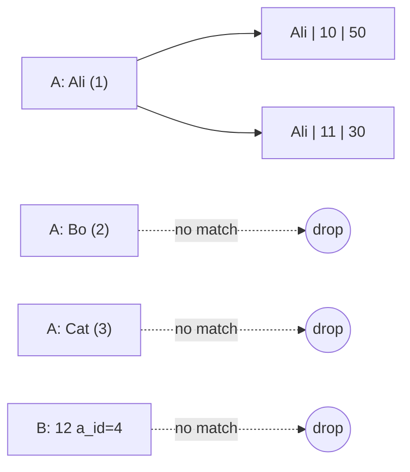

---

### 🛠️ Worked Example

**BAD:**

```python
# N+1 pattern: join in application code
customers = db.query(
    "SELECT * FROM customers"
)
for c in customers:
    orders = db.query(
        "SELECT * FROM orders "
        f"WHERE customer_id = {c.id}"
    )
    results.append((c, orders))
```

Why it's wrong: N+1 round-trips, no parameterization,
and the database cannot optimize across separate queries.

**GOOD:**

```sql
SELECT c.name,
       o.id AS order_id,
       o.total
FROM customers c
INNER JOIN orders o
    ON o.customer_id = c.id
WHERE o.total > 100
ORDER BY c.name, o.id;
```

Why it's right: single round-trip, the planner picks the
optimal join algorithm, and indexes on customer_id are
used automatically.

**Production pattern - joining through a bridge table:**

```sql
-- Many-to-many: products <-> categories
SELECT p.name, c.name AS category
FROM products p
INNER JOIN product_categories pc
    ON pc.product_id = p.id
INNER JOIN categories c
    ON c.id = pc.category_id
WHERE p.active = true;
```

---

### ⚖️ Trade-offs

**Gain:** Single query, database-optimized execution, automatic use of indexes, declarative instead of procedural.

**Cost:** Result set can explode on many-to-many relationships without filtering. Large joins consume memory for hash tables or sort buffers.

| Aspect         | INNER JOIN               | App-side loop       |
| -------------- | ------------------------ | ------------------- |
| Round trips    | 1                        | N+1                 |
| Optimization   | Planner-chosen algorithm | None                |
| Unmatched rows | Excluded automatically   | Must filter in code |
| Memory         | DB-managed buffers       | Application heap    |

---

### ⚡ Decision Snap

**USE WHEN:**

- You need combined data from two tables with guaranteed matches on both sides
- Foreign key relationships connect the tables
- You want unmatched rows excluded from results

**AVOID WHEN:**

- You need rows from one side even when no match exists (use LEFT JOIN)
- Tables share no logical relationship

**PREFER LEFT JOIN WHEN:**

- You need all rows from one table regardless of matches
- Missing matches are meaningful (e.g., customers with zero orders)

---

### ⚠️ Top Traps

| #   | Misconception                                   | Reality                                                                                                                   |
| --- | ----------------------------------------------- | ------------------------------------------------------------------------------------------------------------------------- |
| 1   | INNER JOIN preserves all rows from both tables  | It drops every row that has no match on the other side                                                                    |
| 2   | Join order in FROM controls execution order     | The query planner reorders joins for optimal performance                                                                  |
| 3   | Comma-separated FROM is identical to INNER JOIN | Functionally equivalent but comma syntax makes it easy to accidentally create a cross join by forgetting the WHERE clause |

---

### 🪜 Learning Ladder

**Prerequisites:**

- SQL-012 SELECT and FROM - Reading Data - single-table queries are the foundation
- SQL-017 Foreign Keys and Relationships - joins follow FK paths

**THIS:** SQL-026 INNER JOIN - Matching Rows Across Tables

**Next steps:**

- SQL-027 LEFT JOIN and RIGHT JOIN - preserving unmatched rows
- SQL-029 Self-Joins - When a Table References Itself - joining a table to itself

---

### 💡 The Surprising Truth

An INNER JOIN with an equality condition produces identical results whether you put a filter in the ON clause or the WHERE clause. But the moment you switch to a LEFT JOIN, moving a condition from WHERE to ON changes the result set dramatically. Many developers discover this the hard way when converting an INNER JOIN to a LEFT JOIN and wondering why their "filter" now eliminates the very rows they wanted to preserve.

---

### 📇 Revision Card

1. INNER JOIN returns only rows that match on both sides - unmatched rows vanish silently.
2. The planner picks the join algorithm; your job is to provide indexes on join columns.
3. ON vs WHERE filtering is interchangeable here - but not once you switch to OUTER joins.

---

---

# SQL-027 LEFT JOIN and RIGHT JOIN

**TL;DR** - LEFT JOIN keeps every row from the left table, padding with NULLs when no right-side match exists.

---

### 🔥 The Problem in One Paragraph

You need a report of all customers and their orders. With INNER JOIN, customers who have never ordered anything simply vanish from the output. But the business wants to see every customer - especially the ones with zero orders, because those are sales leads. You need a join that preserves all rows from one table regardless of whether a match exists in the other. Silently dropping unmatched rows is not always what you want. This is exactly why LEFT JOIN was created.

---

### 📘 Textbook Definition

A **LEFT JOIN** (or LEFT OUTER JOIN) returns every row from the left table and the matching rows from the right table. When a left-side row has no match on the right, the right-side columns are filled with NULL. A **RIGHT JOIN** is the mirror: it preserves all rows from the right table instead. Both are outer joins - the "outer" means unmatched rows survive.

---

### 🧠 Mental Model

> Imagine a class roster. The teacher calls every student's name (left table) and checks if they submitted homework (right table). Students who submitted get their grade listed. Students who did not submit still appear on the roster - with a blank grade column.

- "Class roster" -> left table (all rows preserved)
- "Homework submissions" -> right table (matched where possible)
- "Blank grade" -> NULL-padded columns for unmatched rows

**Where this analogy breaks down:** A student can submit multiple homework assignments, producing multiple output rows per student - the roster grows beyond one row per student.

---

### ⚙️ How It Works

1. The engine performs the join as if it were an INNER JOIN,
   finding all matching pairs.
2. For each left-side row that produced zero matches, the
   engine adds a row with NULLs in every right-side column.
3. The result always contains at least as many rows as the
   left table (more if one-to-many matches exist).
4. RIGHT JOIN works identically but preserves the right
   table and NULL-pads the left.
5. WHERE filters applied to right-side columns can
   accidentally convert a LEFT JOIN back into an INNER JOIN.

```
customers          orders
+----+------+      +----+------+-----+
| id | name |      | id | c_id | amt |
+----+------+      +----+------+-----+
|  1 | Ali  |      | 10 |    1 |  50 |
|  2 | Bo   |      | 11 |    1 |  30 |
|  3 | Cat  |      +----+------+-----+
+----+------+

  LEFT JOIN ON customers.id = orders.c_id

+------+------+------+
| name | o_id | amt  |
+------+------+------+
| Ali  |   10 |   50 |
| Ali  |   11 |   30 |
| Bo   | NULL | NULL |  <- preserved, NULL-padded
| Cat  | NULL | NULL |  <- preserved, NULL-padded
+------+------+------+
```

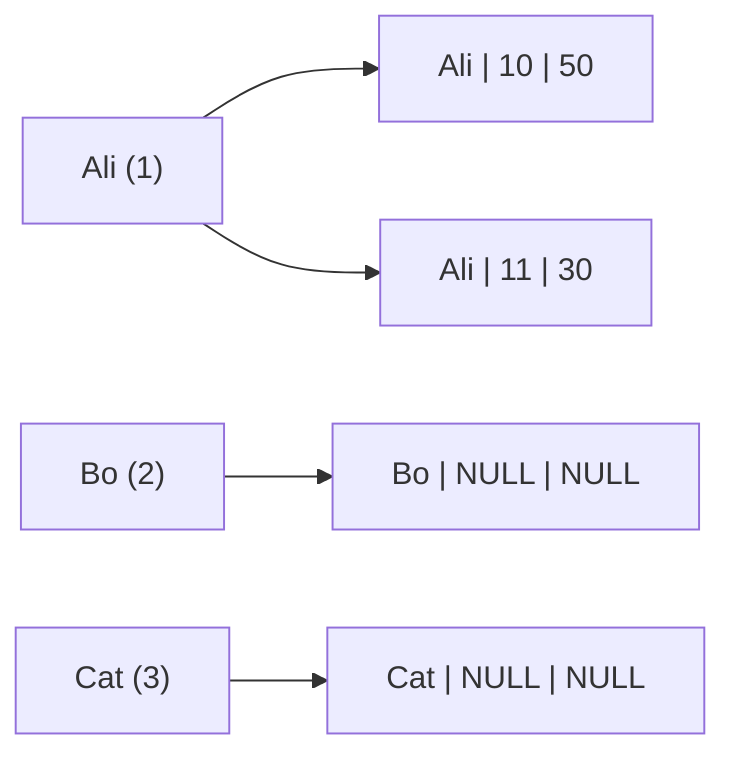

---

### 🛠️ Worked Example

**BAD:**

```sql
-- WHERE on right-side column kills the LEFT JOIN
SELECT c.name, o.total
FROM customers c
LEFT JOIN orders o ON o.customer_id = c.id
WHERE o.total > 50;
-- Bo and Cat vanish: their o.total is NULL,
-- and NULL > 50 is UNKNOWN (falsy)
```

Why it's wrong: the WHERE clause filters out NULL rows,
converting the LEFT JOIN into an effective INNER JOIN.

**GOOD:**

```sql
-- Move the filter into ON to preserve unmatched rows
SELECT c.name, o.total
FROM customers c
LEFT JOIN orders o
    ON o.customer_id = c.id
    AND o.total > 50;
-- Bo and Cat appear with NULL total
```

Why it's right: the ON filter restricts which right-side
rows can match, but unmatched left rows still appear.

**Production pattern - finding rows with no match:**

```sql
-- Customers who have never placed an order
SELECT c.id, c.name, c.email
FROM customers c
LEFT JOIN orders o ON o.customer_id = c.id
WHERE o.id IS NULL;
```

---

### ⚖️ Trade-offs

**Gain:** Preserves all rows from the driving table, reveals missing data, enables "find unmatched" queries.

**Cost:** NULL-padded columns require careful handling. Aggregations over NULL columns need COALESCE. Result sets can be larger than INNER JOIN.

| Aspect         | LEFT JOIN              | INNER JOIN          |
| -------------- | ---------------------- | ------------------- |
| Unmatched rows | Preserved with NULLs   | Dropped             |
| Result size    | >= left table rows     | <= left table rows  |
| NULL handling  | Required everywhere    | Not needed for join |
| "Find missing" | WHERE right.id IS NULL | Not possible        |

---

### ⚡ Decision Snap

**USE WHEN:**

- You need all rows from one side regardless of matches
- You want to find rows that have no related data (IS NULL pattern)
- Report requires every entity even if some have no activity

**AVOID WHEN:**

- Both sides must have matching data to be meaningful
- You do not plan to handle NULLs in downstream logic

**PREFER INNER JOIN WHEN:**

- Foreign key is NOT NULL, guaranteeing every row has a match
- Unmatched rows are data errors, not valid states

---

### ⚠️ Top Traps

| #   | Misconception                                        | Reality                                                                                            |
| --- | ---------------------------------------------------- | -------------------------------------------------------------------------------------------------- |
| 1   | LEFT JOIN and LEFT OUTER JOIN are different          | They are identical; OUTER is optional syntax                                                       |
| 2   | WHERE on a right-side column is safe after LEFT JOIN | It converts the LEFT JOIN to INNER JOIN by filtering out NULLs                                     |
| 3   | RIGHT JOIN is commonly needed                        | Almost never - reorder tables and use LEFT JOIN for clarity; RIGHT JOIN is rarely used in practice |

---

### 🪜 Learning Ladder

**Prerequisites:**

- SQL-026 INNER JOIN - Matching Rows Across Tables - understand matching before preserving
- SQL-018 NULL - The Three-Valued Logic Trap - LEFT JOIN produces NULLs you must handle

**THIS:** SQL-027 LEFT JOIN and RIGHT JOIN

**Next steps:**

- SQL-028 FULL OUTER JOIN and CROSS JOIN - preserving both sides
- SQL-052 N+1 Query Anti-Pattern - LEFT JOIN is the typical fix

---

### 💡 The Surprising Truth

The most powerful use of LEFT JOIN is not combining data - it is finding what is missing. The pattern `LEFT JOIN ... WHERE right.id IS NULL` is one of the most frequently used queries in production systems: finding orphaned records, customers without orders, products without reviews, or users without logins. The join you think of as "adding columns" is equally valuable for subtracting rows.

---

### 📇 Revision Card

1. LEFT JOIN preserves every left-side row; unmatched right-side columns become NULL.
2. Never put a filter on a right-side column in WHERE - use ON or it becomes an INNER JOIN.
3. LEFT JOIN + WHERE IS NULL = find rows with no match - one of SQL's most useful patterns.

---

---

# SQL-028 FULL OUTER JOIN and CROSS JOIN

**TL;DR** - FULL OUTER JOIN preserves unmatched rows from both sides; CROSS JOIN produces every possible row combination.

---

### 🔥 The Problem in One Paragraph

You are reconciling two data sources: a payments table and an invoices table. Some payments have no matching invoice (overpayments). Some invoices have no matching payment (outstanding debts). INNER JOIN loses both sets of orphans. LEFT JOIN loses one set. You need a join that keeps every row from both sides, revealing all mismatches in a single query. Separately, you need to generate all possible combinations of sizes and colors for a product catalog. These two different problems require two different join types that go beyond the standard inner/left pattern. This is exactly why FULL OUTER JOIN and CROSS JOIN were created.

---

### 📘 Textbook Definition

A **FULL OUTER JOIN** returns all rows from both tables. Matching rows are combined; unmatched rows from either side are preserved with NULLs in the missing columns. A **CROSS JOIN** (Cartesian product) returns every combination of rows from both tables with no join condition - if table A has M rows and table B has N rows, the result has M x N rows.

---

### 🧠 Mental Model

> FULL OUTER JOIN is a guest list merge for a wedding. You combine the bride's guest list and the groom's guest list. Mutual friends appear once (matched). Bride-only guests appear with blank groom-side info. Groom-only guests appear with blank bride-side info. Nobody is left out. CROSS JOIN is a menu generator: pair every appetizer with every main course.

- "Bride's list / Groom's list" -> left / right table
- "Mutual friends" -> matched rows
- "Blank info" -> NULL-padded columns

**Where this analogy breaks down:** FULL OUTER JOIN can produce duplicate rows when the join key is not unique, unlike a simple guest list merge.

---

### ⚙️ How It Works

**FULL OUTER JOIN:**

1. Perform INNER JOIN to find matched pairs.
2. Add unmatched left rows with right columns as NULL.
3. Add unmatched right rows with left columns as NULL.
4. Result = matched + left-only + right-only.

**CROSS JOIN:**

1. Take every row from table A.
2. Pair it with every row from table B.
3. No ON condition - all combinations emitted.
4. Result = A.rows x B.rows (Cartesian product).

```
 payments        invoices
 +----+-----+   +----+-----+
 | id | amt |   | id | amt |
 +----+-----+   +----+-----+
 | P1 | 100 |   | I1 | 100 |
 | P2 |  50 |   | I2 | 200 |
 +----+-----+   +----+-----+

 FULL OUTER JOIN ON payments.id = invoices.id
 +------+------+------+------+
 | p_id | p_amt| i_id | i_amt|
 +------+------+------+------+
 | P1   |  100 | NULL | NULL |  <- no invoice
 | NULL | NULL | I1   |  100 |  <- no payment
 | P2   |   50 | NULL | NULL |  <- no invoice
 | NULL | NULL | I2   |  200 |  <- no payment
 +------+------+------+------+
```

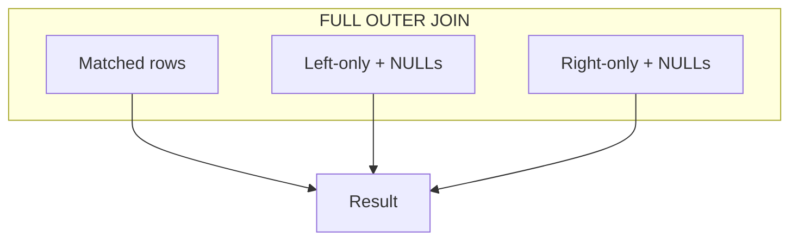

---

### 🛠️ Worked Example

**BAD:**

```sql
-- Two separate queries to find mismatches
SELECT * FROM payments
WHERE id NOT IN (SELECT id FROM invoices);
-- plus
SELECT * FROM invoices
WHERE id NOT IN (SELECT id FROM payments);
-- Two round-trips, NOT IN fails with NULLs
```

Why it's wrong: two queries, NOT IN breaks if the
subquery returns any NULL, and results are not aligned.

**GOOD:**

```sql
-- Single FULL OUTER JOIN shows all mismatches
SELECT
    p.id AS payment_id,
    p.amount AS paid,
    i.id AS invoice_id,
    i.amount AS invoiced
FROM payments p
FULL OUTER JOIN invoices i
    ON p.invoice_id = i.id
WHERE p.id IS NULL OR i.id IS NULL;
```

Why it's right: one query, one result set, no NULL
pitfalls from NOT IN, clearly shows both sides.

**Production pattern - CROSS JOIN for combinations:**

```sql
-- Generate all size/color variants
SELECT s.label, c.hex_code
FROM sizes s
CROSS JOIN colors c
ORDER BY s.sort_order, c.label;
```

---

### ⚖️ Trade-offs

**Gain:** FULL OUTER JOIN reveals all data from both sides. CROSS JOIN generates combinations without procedural loops.

**Cost:** FULL OUTER JOIN results can be large and require careful NULL handling on both sides. CROSS JOIN result size is multiplicative and can explode with large tables.

| Aspect          | FULL OUTER      | LEFT JOIN   | CROSS JOIN |
| --------------- | --------------- | ----------- | ---------- |
| Unmatched left  | Preserved       | Preserved   | N/A        |
| Unmatched right | Preserved       | Dropped     | N/A        |
| Condition       | ON required     | ON required | None       |
| Result size     | A + B - matched | >= A        | A x B      |

---

### ⚡ Decision Snap

**USE WHEN:**

- FULL OUTER: reconciling two independent data sources for mismatches
- CROSS JOIN: generating all combinations from two small dimension tables
- You need unmatched rows from both sides in one query

**AVOID WHEN:**

- One table is the "primary" and the other is supplementary (use LEFT JOIN)
- CROSS JOIN on large tables (result size explodes)

**PREFER LEFT JOIN WHEN:**

- Only one side has unmatched rows you care about
- The relationship is parent-child, not peer-to-peer

---

### ⚠️ Top Traps

| #   | Misconception                                   | Reality                                                                                                           |
| --- | ----------------------------------------------- | ----------------------------------------------------------------------------------------------------------------- |
| 1   | FULL OUTER JOIN is just LEFT JOIN + RIGHT JOIN  | Conceptually yes, but a naive UNION of both can produce duplicate matched rows unless you handle overlap          |
| 2   | CROSS JOIN is never useful in production        | It is essential for generating dimension combinations, calendar grids, and test matrices from small lookup tables |
| 3   | Every database supports FULL OUTER JOIN equally | MySQL did not support FULL OUTER JOIN until version 8.0.31 (2022); older versions require a UNION workaround      |

---

### 🪜 Learning Ladder

**Prerequisites:**

- SQL-026 INNER JOIN - Matching Rows Across Tables - understand the matched-rows foundation
- SQL-027 LEFT JOIN and RIGHT JOIN - understand one-sided preservation

**THIS:** SQL-028 FULL OUTER JOIN and CROSS JOIN

**Next steps:**

- SQL-030 UNION, INTERSECT, EXCEPT - alternative set operations
- SQL-058 Correlated Subqueries and Lateral Joins - advanced row combination techniques

---

### 💡 The Surprising Truth

CROSS JOIN has a secret identity: every join is internally a filtered cross join. When the database executes `A INNER JOIN B ON A.id = B.a_id`, it conceptually generates all pairs (cross product) then filters by the ON condition. The query planner just optimizes away the full cross product using algorithms like hash join or index lookup. Understanding this makes join behavior predictable - especially when you accidentally omit an ON condition and get a Cartesian product.

---

### 📇 Revision Card

1. FULL OUTER JOIN = matched rows + left-only (right NULLed) + right-only (left NULLed).
2. CROSS JOIN = every combination, no condition - result is M x N rows, so keep tables small.
3. Every join is a filtered cross join internally - forget the ON clause and you get the full Cartesian product.

---

---

# SQL-029 Self-Joins - When a Table References Itself

**TL;DR** - A self-join joins a table to itself using aliases, enabling row-to-row comparisons within the same dataset.

---

### 🔥 The Problem in One Paragraph

Your employees table has a `manager_id` column that references another row in the same table. You need to display each employee alongside their manager's name. But the manager data lives in the same table as the employee data - there is no separate "managers" table to join against. You need a way to treat one table as two logical copies so you can match employees to their managers within a single query. This is exactly why self-joins were created.

---

### 📘 Textbook Definition

A **self-join** is a join in which a table is joined to itself. The table appears twice (or more) in the FROM clause, each occurrence given a distinct alias. The join condition relates rows in one alias to rows in the other, enabling comparisons, hierarchical traversal, or duplicate detection within a single table.

---

### 🧠 Mental Model

> Imagine a company org chart printed on paper. You photocopy it. Now you hold two identical copies side by side. You draw lines from each employee on copy A to their manager on copy B. The two copies are the same table - the aliases just let you point at it twice.

- "Original paper" -> table aliased as `e` (employee)
- "Photocopy" -> same table aliased as `m` (manager)
- "Drawing lines" -> ON e.manager_id = m.id

**Where this analogy breaks down:** The two "copies" are not stored separately - the database uses the same physical data and indexes. The aliases are logical, not physical.

---

### ⚙️ How It Works

1. The table appears in FROM twice with different aliases
   (e.g., `employees e` and `employees m`).
2. The join condition links a foreign-key-like column in
   one alias to the primary key of the other alias.
3. The planner treats them as two separate inputs to the
   join algorithm.
4. Each output row combines columns from both aliases,
   which physically come from the same table.
5. For hierarchical data, recursive CTEs are often
   preferred over multiple self-joins.

```
employees
+----+-------+------------+
| id | name  | manager_id |
+----+-------+------------+
|  1 | Alice | NULL       |  <- CEO, no manager
|  2 | Bob   |          1 |
|  3 | Carol |          1 |
|  4 | Dave  |          2 |
+----+-------+------------+

  Self-join: e.manager_id = m.id

+-------+---------+
| emp   | manager |
+-------+---------+
| Bob   | Alice   |
| Carol | Alice   |
| Dave  | Bob     |
+-------+---------+
Alice has no manager -> excluded (INNER JOIN)
```

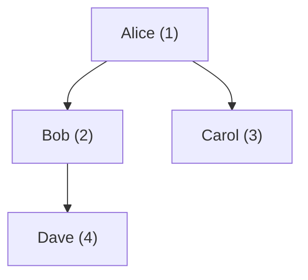

---

### 🛠️ Worked Example

**BAD:**

```sql
-- Forgetting aliases causes ambiguity errors
SELECT name, name
FROM employees, employees
WHERE manager_id = id;
-- ERROR: ambiguous column references
```

Why it's wrong: without aliases, the database cannot tell
which "name" or "id" you mean.

**GOOD:**

```sql
SELECT
    e.name AS employee,
    m.name AS manager
FROM employees e
INNER JOIN employees m
    ON e.manager_id = m.id
ORDER BY m.name, e.name;
```

Why it's right: aliases `e` and `m` disambiguate every
column reference.

**Production pattern - finding duplicates:**

```sql
-- Find customers with duplicate email addresses
SELECT a.id, b.id, a.email
FROM customers a
INNER JOIN customers b
    ON a.email = b.email
    AND a.id < b.id;
-- a.id < b.id prevents pairing a row with
-- itself and avoids listing (A,B) and (B,A)
```

---

### ⚖️ Trade-offs

**Gain:** Solves hierarchical queries, duplicate detection, and row comparisons without needing a second table or subquery.

**Cost:** Readability drops quickly with more than two self-join levels. Deep hierarchies need recursive CTEs instead.

| Aspect       | Self-join             | Recursive CTE       |
| ------------ | --------------------- | ------------------- |
| Depth        | Fixed levels only     | Arbitrary depth     |
| Readability  | Clear for 1-2 levels  | Better for N levels |
| Performance  | Single join operation | Iterative expansion |
| Availability | All SQL dialects      | SQL:1999 and later  |

---

### ⚡ Decision Snap

**USE WHEN:**

- You need to compare rows within the same table (duplicates, pairs)
- Hierarchical depth is fixed and shallow (1-2 levels)
- The relationship is a foreign key pointing back to the same table

**AVOID WHEN:**

- Hierarchy depth is variable or unknown (use recursive CTE)
- The query needs more than three self-join levels (unreadable)

**PREFER Recursive CTE WHEN:**

- You need to traverse an entire tree to arbitrary depth
- The hierarchy changes shape over time

---

### ⚠️ Top Traps

| #   | Misconception                                  | Reality                                                                        |
| --- | ---------------------------------------------- | ------------------------------------------------------------------------------ |
| 1   | Self-joins duplicate the table in memory       | The planner uses the same physical data and indexes; aliases are logical only  |
| 2   | Self-join is the best way to query hierarchies | For fixed depth (1-2 levels) yes, but recursive CTEs handle arbitrary depth    |
| 3   | You need a.id != b.id to avoid self-pairing    | Use a.id < b.id instead - != still produces both (A,B) and (B,A) as duplicates |

---

### 🪜 Learning Ladder

**Prerequisites:**

- SQL-026 INNER JOIN - Matching Rows Across Tables - self-join is just INNER JOIN with the same table
- SQL-025 SQL Aliases and Expressions - aliases are mandatory for self-joins

**THIS:** SQL-029 Self-Joins - When a Table References Itself

**Next steps:**

- SQL-054 Recursive CTEs - Hierarchical Data - the scalable approach for deep hierarchies
- SQL-033 Subqueries - Scalar, Row, Table - alternative for row comparisons

---

### 💡 The Surprising Truth

The `a.id < b.id` trick in self-joins for duplicate detection is not just about avoiding self-pairing. It eliminates exactly half the result set by keeping only one direction of each pair. Without it, you get both (Alice, Bob) and (Bob, Alice) for every duplicate. With it, you get exactly one row per duplicate pair - a subtle but critical difference when you are counting or deleting duplicates in production.

---

### 📇 Revision Card

1. A self-join is a regular join where the same table appears twice with different aliases.
2. Use `a.id < b.id` (not `!=`) for duplicate detection to avoid doubled results.
3. For hierarchies deeper than 2 levels, switch to recursive CTEs.

---

---

# SQL-030 UNION, INTERSECT, EXCEPT

**TL;DR** - Set operators combine result sets vertically: UNION merges, INTERSECT finds common rows, EXCEPT subtracts.

---

### 🔥 The Problem in One Paragraph

You have two tables with the same column structure - perhaps `active_customers` and `archived_customers`. You need a single combined list. Or you need to find which customers appear in both a marketing list and a purchase history. Or you need everyone in list A who is not in list B. These are set operations: union, intersection, and difference. SQL provides these as first-class operators, matching the relational algebra that underpins the entire language. This is exactly why UNION, INTERSECT, and EXCEPT were created.

---

### 📘 Textbook Definition

**UNION** combines two result sets and removes duplicate rows. **UNION ALL** combines without deduplication. **INTERSECT** returns only rows that appear in both result sets. **EXCEPT** (MINUS in Oracle) returns rows from the first set that do not appear in the second. All three require both queries to produce the same number of columns with compatible types.

---

### 🧠 Mental Model

> Think of two stacks of index cards, each with the same fields. UNION stacks them together and removes duplicates. UNION ALL just stacks them. INTERSECT pulls out only cards that appear in both stacks. EXCEPT removes from the first stack any card that also appears in the second.

- "Index cards" -> result set rows
- "Same fields" -> matching column count and types
- "Removing duplicates" -> implicit DISTINCT in UNION

**Where this analogy breaks down:** "Duplicate" means all columns match, not just an ID - two rows with different values in any column are distinct even if they share a key.

---

### ⚙️ How It Works

1. Both queries execute independently, producing two
   result sets with matching column counts and types.
2. UNION sorts or hashes both sets to remove duplicates.
   UNION ALL skips this step entirely.
3. INTERSECT hashes both sets and emits only rows
   found in both.
4. EXCEPT hashes both sets and emits rows from the
   first that are absent from the second.
5. Column names come from the first query. ORDER BY
   applies to the combined result and goes at the end.

```
 Query A result    Query B result
 +----+------+    +----+------+
 | id | name |    | id | name |
 +----+------+    +----+------+
 |  1 | Ali  |    |  2 | Bo   |
 |  2 | Bo   |    |  3 | Cat  |
 +----+------+    +----+------+

 UNION     -> Ali, Bo, Cat  (Bo deduplicated)
 UNION ALL -> Ali, Bo, Bo, Cat
 INTERSECT -> Bo            (in both)
 EXCEPT    -> Ali           (in A, not in B)
```

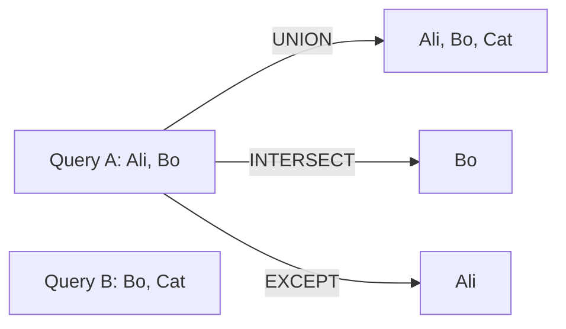

---

### 🛠️ Worked Example

**BAD:**

```sql
-- Using OR in a single query with unrelated tables
SELECT name FROM customers
WHERE active = true
OR name IN (SELECT name FROM leads);
-- Mixes concerns, cannot handle different schemas
```

Why it's wrong: OR within a single query is not a set
operation and falls apart when the sources have
different structures or filtering needs.

**GOOD:**

```sql
-- Combine active and archived customers
SELECT id, name, email FROM active_customers
UNION
SELECT id, name, email FROM archived_customers
ORDER BY name;
```

Why it's right: clean set union, duplicates removed,
single sorted result.

**Production pattern - EXCEPT for data validation:**

```sql
-- Find orders with no matching shipment
SELECT order_id FROM orders
EXCEPT
SELECT order_id FROM shipments;
-- Returns order_ids that have not shipped
```

---

### ⚖️ Trade-offs

**Gain:** Declarative set operations, no procedural loops, handles deduplication automatically (UNION), clear semantics for finding overlap or differences.

**Cost:** UNION (not ALL) requires sorting or hashing for deduplication, which adds CPU and memory. UNION ALL is much cheaper but may include duplicates you did not want.

| Aspect      | UNION              | UNION ALL          |
| ----------- | ------------------ | ------------------ |
| Duplicates  | Removed            | Kept               |
| Performance | Sort/hash cost     | No extra cost      |
| Use case    | Need distinct rows | Know no dups exist |

---

### ⚡ Decision Snap

**USE WHEN:**

- Combining data from structurally similar tables or queries
- Finding overlap (INTERSECT) or difference (EXCEPT) between sets
- Building a unified view from partitioned data

**AVOID WHEN:**

- Queries produce different column counts or incompatible types
- You should be using a JOIN (combining columns, not stacking rows)

**PREFER UNION ALL WHEN:**

- You know there are no duplicates across the sets
- Performance matters and deduplication is unnecessary

---

### ⚠️ Top Traps

| #   | Misconception                               | Reality                                                                                    |
| --- | ------------------------------------------- | ------------------------------------------------------------------------------------------ |
| 1   | UNION and JOIN do the same thing            | JOIN combines columns horizontally; UNION stacks rows vertically - fundamentally different |
| 2   | UNION ALL is always faster than UNION       | Yes, because it skips dedup - but if you need unique rows, UNION ALL gives wrong results   |
| 3   | Column names must match across both queries | Only column count and type compatibility matter; names come from the first query           |

---

### 🪜 Learning Ladder

**Prerequisites:**

- SQL-012 SELECT and FROM - Reading Data - each side of UNION is a SELECT
- SQL-015 ORDER BY and LIMIT - ORDER BY applies to the final combined result

**THIS:** SQL-030 UNION, INTERSECT, EXCEPT

**Next steps:**

- SQL-053 Common Table Expressions (CTEs) - CTEs compose cleanly with set operations
- SQL-032 GROUP BY and HAVING - aggregate after combining sets

---

### 💡 The Surprising Truth

EXCEPT is one of the most underused SQL operators, yet it solves a problem developers frequently write complex NOT IN or NOT EXISTS subqueries for. `SELECT id FROM A EXCEPT SELECT id FROM B` is cleaner, more readable, and often faster than `SELECT id FROM A WHERE id NOT IN (SELECT id FROM B)` - and it does not break when the subquery returns NULLs, which NOT IN infamously does.

---

### 📇 Revision Card

1. UNION stacks rows and deduplicates; UNION ALL stacks without dedup - always prefer ALL when you know sets are disjoint.
2. INTERSECT = both; EXCEPT = first minus second - cleaner than NOT IN for set differences.
3. Both queries must have the same column count and compatible types - column names come from the first query.

---

---

# SQL-031 Aggregate Functions - COUNT, SUM, AVG, MIN, MAX

**TL;DR** - Aggregate functions collapse multiple rows into a single summary value per group.

---

### 🔥 The Problem in One Paragraph

Your orders table has 500,000 rows. The CFO asks: "What is total revenue? How many orders? What is the average order value?" You could fetch all 500,000 rows into your application, loop through them, and calculate the answers in code. But transmitting half a million rows over the network to sum a column is wasteful. The database already has the data in memory or on disk with optimized internal structures for scanning. You need the calculation to happen where the data lives. This is exactly why aggregate functions were created.

---

### 📘 Textbook Definition

**Aggregate functions** operate on a set of rows and return a single value. **COUNT** returns the number of rows or non-NULL values. **SUM** totals numeric values. **AVG** computes the arithmetic mean. **MIN** and **MAX** return the smallest and largest values. When used without GROUP BY, they operate on the entire result set as one group.

---

### 🧠 Mental Model

> Imagine a teacher collecting test scores from a class. COUNT is counting how many students took the test. SUM is adding all scores together. AVG is dividing the sum by the count. MIN is the lowest score. MAX is the highest. The teacher does not list individual scores - she reports one number per statistic.

- "Class of students" -> the row set (or group)
- "One number per statistic" -> aggregate collapses rows
- "The teacher" -> the database engine

**Where this analogy breaks down:** SQL aggregates can operate on groups of rows (via GROUP BY), producing one summary row per group rather than one for the entire table.

---

### ⚙️ How It Works

1. The engine scans the rows (or a subset defined by
   WHERE).
2. For each aggregate function, it maintains a running
   accumulator (counter, sum, min, max).
3. NULL values are skipped by all aggregates except
   COUNT(\*), which counts rows regardless of NULLs.
4. When GROUP BY is present, separate accumulators are
   maintained per group.
5. The final values are returned - one row if no
   GROUP BY, one row per group otherwise.

```
orders
+----+-------+
| id | total |
+----+-------+
|  1 |  100  |
|  2 |  NULL |
|  3 |   50  |
|  4 |  200  |
+----+-------+

COUNT(*)     = 4     (counts rows, incl. NULL)
COUNT(total) = 3     (skips NULL)
SUM(total)   = 350
AVG(total)   = 116.67 (350 / 3, not 350 / 4)
MIN(total)   = 50
MAX(total)   = 200
```

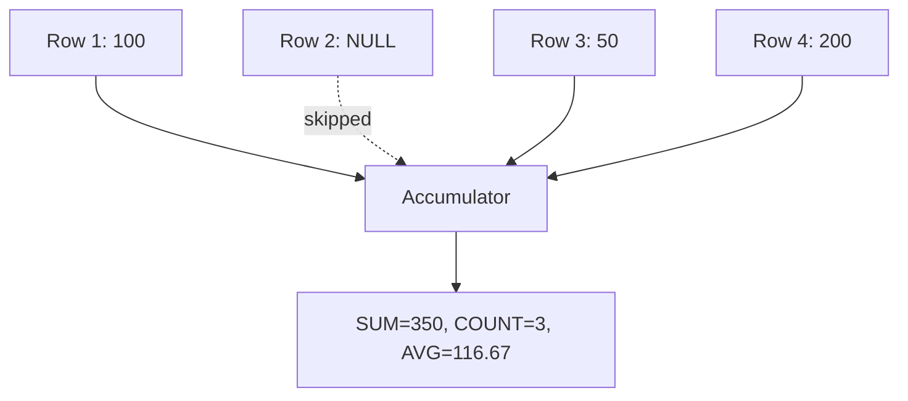

---

### 🛠️ Worked Example

**BAD:**

```sql
-- Mixing aggregate and non-aggregate columns
SELECT id, SUM(total)
FROM orders;
-- ERROR in standard SQL: id is not aggregated
-- or grouped. Some databases pick an arbitrary
-- id value, giving misleading results.
```

Why it's wrong: selecting a non-aggregated column
alongside an aggregate without GROUP BY is either an
error or undefined behavior depending on the database.

**GOOD:**

```sql
SELECT
    COUNT(*)       AS order_count,
    SUM(total)     AS revenue,
    AVG(total)     AS avg_order,
    MIN(total)     AS smallest,
    MAX(total)     AS largest
FROM orders
WHERE placed_at >= '2024-01-01';
```

Why it's right: all columns are aggregates, the WHERE
filters before aggregation, and the result is one row.

**Production pattern - COUNT with FILTER:**

```sql
-- PostgreSQL FILTER syntax for conditional counts
SELECT
    COUNT(*) AS total_orders,
    COUNT(*) FILTER (WHERE status = 'shipped')
        AS shipped,
    COUNT(*) FILTER (WHERE status = 'returned')
        AS returned
FROM orders;
```

---

### ⚖️ Trade-offs

**Gain:** Calculations happen at the data source, eliminating network transfer of raw rows. Aggregates use optimized internal paths (index-only scans for COUNT, B-tree walks for MIN/MAX).

**Cost:** You lose individual row detail. Once aggregated, you cannot inspect the rows that produced the number without a separate query.

| Aspect        | DB aggregation     | App-side loop  |
| ------------- | ------------------ | -------------- |
| Network       | 1 summary row      | All raw rows   |
| CPU           | DB-optimized       | App language   |
| NULL handling | Automatic skip     | Manual checks  |
| Flexibility   | SQL functions only | Any code logic |

---

### ⚡ Decision Snap

**USE WHEN:**

- You need summary statistics (totals, counts, averages)
- The raw row data is not needed in the application
- Performance matters and you want to avoid transferring large datasets

**AVOID WHEN:**

- You need the individual rows alongside the aggregate (use window functions instead)
- The aggregation logic is too complex for SQL (rare)

**PREFER Window Functions WHEN:**

- You need both the detail row and a running total or ranking alongside it
- You want per-row context with group-level stats

---

### ⚠️ Top Traps

| #   | Misconception                                         | Reality                                                                                                                       |
| --- | ----------------------------------------------------- | ----------------------------------------------------------------------------------------------------------------------------- |
| 1   | AVG counts NULLs as zero                              | AVG skips NULLs entirely - it divides by the count of non-NULL values, not total rows                                         |
| 2   | COUNT(\*) and COUNT(column) are identical             | COUNT(\*) counts all rows; COUNT(column) counts only rows where column is not NULL                                            |
| 3   | You can SELECT non-aggregated columns with aggregates | Standard SQL requires every non-aggregated column to be in GROUP BY; MySQL historically allowed it with unpredictable results |

---

### 🪜 Learning Ladder

**Prerequisites:**

- SQL-012 SELECT and FROM - Reading Data - aggregates go in the SELECT clause
- SQL-018 NULL - The Three-Valued Logic Trap - NULL handling in aggregates is critical

**THIS:** SQL-031 Aggregate Functions - COUNT, SUM, AVG, MIN, MAX

**Next steps:**

- SQL-032 GROUP BY and HAVING - partition rows into groups before aggregating
- SQL-055 Window Functions - ROW_NUMBER, RANK, DENSE_RANK - aggregate without collapsing rows

---

### 💡 The Surprising Truth

MIN and MAX on an indexed column do not scan the table at all. The B-tree index stores values in sorted order, so MIN reads the leftmost leaf and MAX reads the rightmost leaf - a constant-time operation regardless of table size. This is why `SELECT MAX(id) FROM orders` on a primary key returns instantly even on a table with billions of rows.

---

### 📇 Revision Card

1. All aggregates skip NULLs except COUNT(\*) - this one difference explains most aggregate surprises.
2. AVG = SUM / COUNT(non-null), not SUM / total rows - NULLs shrink the denominator.
3. MIN/MAX on indexed columns are O(1) via B-tree edge reads, not full scans.

---

---

# SQL-032 GROUP BY and HAVING

**TL;DR** - GROUP BY partitions rows into groups for aggregation; HAVING filters groups after aggregation.

---

### 🔥 The Problem in One Paragraph

You know how to compute total revenue across all orders with SUM. Now the VP of Sales asks: "Show me total revenue per customer." You need to partition the orders table into groups - one group per customer - and compute SUM within each group. Then she adds: "But only show customers whose total exceeds $1,000." WHERE cannot help because it filters individual rows before aggregation. You need a way to filter the aggregated results. This is exactly why GROUP BY and HAVING were created.

---

### 📘 Textbook Definition

**GROUP BY** divides the result set into groups based on one or more columns. Aggregate functions then compute a summary value for each group independently, producing one output row per group. **HAVING** is a filter applied after aggregation that accepts or rejects entire groups based on aggregate conditions. WHERE filters rows before grouping; HAVING filters groups after.

---

### 🧠 Mental Model

> Imagine sorting a pile of receipts into envelopes by customer name (GROUP BY). You then staple a summary slip to each envelope showing the total (SUM). Finally, you toss out any envelope whose total is below $1,000 (HAVING). WHERE would have removed individual receipts before you even started sorting.

- "Sorting into envelopes" -> GROUP BY partitioning
- "Summary slip" -> aggregate function per group
- "Tossing envelopes" -> HAVING filter on aggregates

**Where this analogy breaks down:** You can group by multiple columns (e.g., customer + month), creating finer-grained envelopes, but the analogy stays essentially correct.

---

### ⚙️ How It Works

1. WHERE filters individual rows from the source tables.
2. GROUP BY partitions the surviving rows into groups
   by distinct values of the grouping columns.
3. Aggregate functions compute one value per group.
4. HAVING filters groups based on aggregate results.
5. SELECT returns one row per surviving group.
6. ORDER BY sorts the final output.

Execution order: FROM -> WHERE -> GROUP BY ->
aggregates -> HAVING -> SELECT -> ORDER BY.

```
orders
+----+------+-------+
| id | c_id | total |
+----+------+-------+
|  1 |    1 |   100 |
|  2 |    1 |   200 |
|  3 |    2 |    50 |
|  4 |    2 |    75 |
|  5 |    3 |  1500 |
+----+------+-------+

GROUP BY c_id, HAVING SUM(total) > 200
+------+----------+
| c_id | revenue  |
+------+----------+
|    1 |      300 |  <- passes (300 > 200)
|    3 |     1500 |  <- passes (1500 > 200)
+------+----------+
c_id=2 (125) -> filtered by HAVING
```

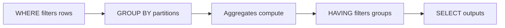

---

### 🛠️ Worked Example

**BAD:**

```sql
-- Using WHERE to filter on an aggregate
SELECT customer_id, SUM(total) AS revenue
FROM orders
WHERE SUM(total) > 1000
GROUP BY customer_id;
-- ERROR: aggregate functions not allowed
-- in WHERE clause
```

Why it's wrong: WHERE runs before GROUP BY, so
aggregates do not exist yet when WHERE executes.

**GOOD:**

```sql
SELECT
    customer_id,
    COUNT(*) AS order_count,
    SUM(total) AS revenue
FROM orders
WHERE total > 0
GROUP BY customer_id
HAVING SUM(total) > 1000
ORDER BY revenue DESC;
```

Why it's right: WHERE filters bad rows first, GROUP BY
partitions, aggregates compute, then HAVING filters on
the computed sum.

**Production pattern - multi-column grouping:**

```sql
-- Monthly revenue per product category
SELECT
    c.name AS category,
    DATE_TRUNC('month', o.placed_at) AS month,
    SUM(oi.price * oi.qty) AS revenue
FROM order_items oi
INNER JOIN orders o ON o.id = oi.order_id
INNER JOIN categories c ON c.id = oi.category_id
GROUP BY c.name, DATE_TRUNC('month', o.placed_at)
HAVING SUM(oi.price * oi.qty) > 500
ORDER BY month, revenue DESC;
```

---

### ⚖️ Trade-offs

**Gain:** Summarize large datasets into manageable group-level insights. HAVING filters impossible to express with WHERE. Multi-column grouping enables dimensional analysis.

**Cost:** Grouping requires sorting or hashing all rows. Large cardinality grouping columns (e.g., grouping by a UUID) can be expensive and produce as many output rows as input rows.

| Aspect        | GROUP BY            | Window Functions         |
| ------------- | ------------------- | ------------------------ |
| Output rows   | One per group       | One per input row        |
| Detail access | Lost after grouping | Preserved                |
| Filtering     | HAVING              | WHERE on window result   |
| Use case      | Summary reports     | Rankings, running totals |

---

### ⚡ Decision Snap

**USE WHEN:**

- You need one summary row per group (totals, counts, averages per category)
- You must filter on aggregated values (HAVING)
- Reports require dimensional breakdowns (by region, by month)

**AVOID WHEN:**

- You need individual rows alongside aggregated values (use window functions)
- Grouping cardinality equals row count (grouping adds no value)

**PREFER Window Functions WHEN:**

- Each row needs its own value plus a group-level aggregate alongside it
- You want rankings or running totals without collapsing rows

---

### ⚠️ Top Traps

| #   | Misconception                              | Reality                                                                                                  |
| --- | ------------------------------------------ | -------------------------------------------------------------------------------------------------------- |
| 1   | HAVING and WHERE are interchangeable       | WHERE filters rows before grouping; HAVING filters groups after aggregation - different execution phases |
| 2   | Every column in SELECT must be in GROUP BY | Only non-aggregated columns must be in GROUP BY; aggregated columns (SUM, COUNT) must not be             |
| 3   | GROUP BY always sorts the output           | GROUP BY does not guarantee order; add ORDER BY explicitly if you need sorted results                    |

---

### 🪜 Learning Ladder

**Prerequisites:**

- SQL-031 Aggregate Functions - COUNT, SUM, AVG, MIN, MAX - aggregates are the point of grouping
- SQL-013 WHERE - Filtering Rows - understand row-level filtering before group-level

**THIS:** SQL-032 GROUP BY and HAVING

**Next steps:**

- SQL-033 Subqueries - Scalar, Row, Table - use grouped results as subquery inputs
- SQL-059 GROUPING SETS, CUBE, ROLLUP - advanced multi-level grouping

---

### 💡 The Surprising Truth

The SQL execution order is nothing like the reading order. You write SELECT first, but it executes nearly last. The actual order - FROM, WHERE, GROUP BY, HAVING, SELECT, ORDER BY - means you cannot use a SELECT alias in WHERE or GROUP BY in most databases. PostgreSQL allows aliases in ORDER BY and HAVING but not in WHERE or GROUP BY. Understanding execution order eliminates an entire class of "why doesn't my alias work?" confusion.

---

### 📇 Revision Card

1. WHERE filters rows before grouping; HAVING filters groups after aggregation - never confuse them.
2. Every non-aggregated column in SELECT must appear in GROUP BY - this is not optional.
3. GROUP BY does not sort; always add ORDER BY if you need ordered output.

---

---

# SQL-033 Subqueries - Scalar, Row, Table

**TL;DR** - Subqueries are queries nested inside other queries, returning a single value, a row, or a full table.

---

### 🔥 The Problem in One Paragraph

You want to find all orders whose total exceeds the average order total. But the average is itself a query. You cannot hardcode it because it changes as new orders arrive. You need a query result to feed into another query dynamically. Similarly, you want to find the customer with the highest lifetime spend - but "highest" requires aggregating first and then filtering. Simple single-level queries cannot express these multi-step problems. This is exactly why subqueries were created.

---

### 📘 Textbook Definition

A **subquery** (inner query) is a SELECT statement embedded within another SQL statement. A **scalar subquery** returns exactly one value (one row, one column). A **row subquery** returns one row with multiple columns. A **table subquery** returns multiple rows and columns, used with IN, EXISTS, or as a derived table in FROM. Subqueries can be non-correlated (independent) or correlated (referencing the outer query).

---

### 🧠 Mental Model

> Think of a subquery as a sticky note you write before filling in the main form. Scalar subquery: you calculate one number on the sticky note and write it into a blank on the form. Row subquery: you look up one complete record. Table subquery: you generate an entire mini-report and attach it as a reference table.

- "Sticky note" -> inner query that executes first
- "Main form" -> outer query that uses the result
- "Blank on the form" -> WHERE, SELECT, or FROM clause that receives the subquery result

**Where this analogy breaks down:** Correlated subqueries re-execute the sticky note for every row of the main form - more like a lookup function than a pre-computed note.

---

### ⚙️ How It Works

1. Non-correlated subqueries execute once. The result
   is cached and reused by the outer query.
2. Correlated subqueries execute once per outer row,
   referencing outer-row values in their WHERE clause.
3. Scalar subqueries must return exactly one value; if
   they return more, the query errors. If zero rows,
   the result is NULL.
4. Table subqueries in FROM must have an alias (derived
   table) and act like a temporary table.
5. The planner may rewrite subqueries as joins
   internally for optimization.

```
Scalar subquery (returns one value):
  SELECT name FROM customers
  WHERE id = (SELECT customer_id
              FROM orders
              ORDER BY total DESC
              LIMIT 1);

Table subquery (returns a table):
  SELECT * FROM (
      SELECT c_id, SUM(total) AS rev
      FROM orders
      GROUP BY c_id
  ) AS summary
  WHERE rev > 1000;

Correlated subquery (re-executes per row):
  SELECT name FROM customers c
  WHERE EXISTS (
      SELECT 1 FROM orders o
      WHERE o.customer_id = c.id
      AND o.total > 500
  );
```

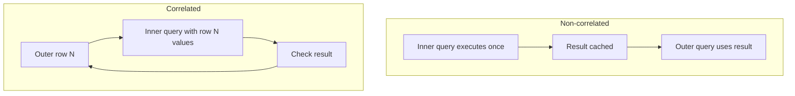

---

### 🛠️ Worked Example

**BAD:**

```sql
-- Scalar subquery returning multiple rows
SELECT name
FROM customers
WHERE id = (
    SELECT customer_id FROM orders
    WHERE total > 100
);
-- ERROR if multiple orders match:
-- subquery returns more than one row
```

Why it's wrong: `=` expects one value, but the subquery
can return multiple customer_ids. Use `IN` instead.

**GOOD:**

```sql
-- Orders above the average order total
SELECT id, total
FROM orders
WHERE total > (
    SELECT AVG(total) FROM orders
);
```

Why it's right: scalar subquery returns exactly one
value (the average), safe for comparison.

**Production pattern - derived table for top-N per group:**

```sql
-- Top 3 orders per customer (PostgreSQL)
SELECT ranked.*
FROM (
    SELECT
        customer_id,
        id,
        total,
        ROW_NUMBER() OVER (
            PARTITION BY customer_id
            ORDER BY total DESC
        ) AS rn
    FROM orders
) AS ranked
WHERE ranked.rn <= 3;
```

---

### ⚖️ Trade-offs

**Gain:** Express multi-step logic in a single SQL statement. Subqueries enable comparisons against computed values without temp tables or application code.

**Cost:** Correlated subqueries can be slow (re-execute per outer row). Deeply nested subqueries are hard to read and debug. The planner may not optimize all subquery forms equally.

| Aspect       | Subquery            | JOIN         | CTE               |
| ------------ | ------------------- | ------------ | ----------------- |
| Readability  | Nested, harder      | Flat, easier | Named, clearest   |
| Reuse        | Single-use          | N/A          | Referenceable     |
| Optimization | Planner may flatten | Direct       | Typically inlined |
| Correlated   | Supported           | N/A          | Not applicable    |

---

### ⚡ Decision Snap

**USE WHEN:**

- You need a computed value for comparison (scalar subquery in WHERE)
- EXISTS/NOT EXISTS checks for existence efficiently
- A derived table simplifies a complex transformation step

**AVOID WHEN:**

- A simple JOIN achieves the same result more readably
- The subquery is correlated and the outer query has many rows (performance risk)

**PREFER CTE WHEN:**

- The subquery result is referenced multiple times
- Readability matters and the logic has multiple steps

---

### ⚠️ Top Traps

| #   | Misconception                              | Reality                                                                                                              |
| --- | ------------------------------------------ | -------------------------------------------------------------------------------------------------------------------- |
| 1   | Subqueries are always slower than joins    | The planner often rewrites subqueries as joins internally; performance depends on the specific query and indexes     |
| 2   | NOT IN with a subquery is safe             | If the subquery returns any NULL, NOT IN returns no rows at all - use NOT EXISTS instead                             |
| 3   | Correlated subqueries always perform badly | With proper indexes on the inner query's filter columns, correlated subqueries can be efficient for existence checks |

---

### 🪜 Learning Ladder

**Prerequisites:**

- SQL-031 Aggregate Functions - COUNT, SUM, AVG, MIN, MAX - scalar subqueries often contain aggregates
- SQL-026 INNER JOIN - Matching Rows Across Tables - joins are the alternative to many subquery patterns

**THIS:** SQL-033 Subqueries - Scalar, Row, Table

**Next steps:**

- SQL-053 Common Table Expressions (CTEs) - named, reusable subquery blocks
- SQL-058 Correlated Subqueries and Lateral Joins - advanced correlated patterns

---

### 💡 The Surprising Truth

`NOT IN` and `NOT EXISTS` are not interchangeable. If the subquery column contains even a single NULL, `NOT IN` returns zero rows because `x NOT IN (1, NULL)` evaluates to UNKNOWN for every x. `NOT EXISTS` handles NULLs correctly. This is not a rare edge case - nullable foreign keys and optional fields are common, and this trap has caused countless production bugs where "missing" data queries silently returned empty results.

---

### 📇 Revision Card

1. Scalar = one value, row = one row, table = full result set - match the subquery type to the context (=, IN, FROM).
2. NOT IN breaks on NULLs; always prefer NOT EXISTS for "not found" checks.
3. The planner often rewrites subqueries as joins - but correlated subqueries on unindexed columns can still be slow.

---

---

# SQL-034 Normalization - 1NF, 2NF, 3NF

**TL;DR** - Normalization eliminates data redundancy by organizing tables so each fact is stored exactly once.

---

### 🔥 The Problem in One Paragraph

Your orders table stores the customer name, email, and address on every order row. Customer "Alice" has 200 orders, so her address appears 200 times. She moves, and you update 199 rows but miss one. Now you have two addresses for Alice - which is correct? This is an update anomaly, and it is the inevitable result of storing the same fact in multiple places. Beyond inconsistency, you also waste storage and make queries slower by scanning bloated rows. This is exactly why normalization was created.

---

### 📘 Textbook Definition

**Normalization** is the process of structuring a relational database to reduce data redundancy and eliminate insertion, update, and deletion anomalies. **First Normal Form (1NF)** requires atomic column values and no repeating groups. **Second Normal Form (2NF)** requires 1NF plus every non-key column must depend on the entire primary key (no partial dependencies). **Third Normal Form (3NF)** requires 2NF plus no non-key column depends on another non-key column (no transitive dependencies).

---

### 🧠 Mental Model

> Think of normalization as the "one source of truth" principle. If you store Alice's address in one place (customers table), every query that needs it looks there. If you store it in ten places, you must update ten places in perfect sync or live with contradictions.

- "One source of truth" -> each fact in exactly one table
- "Contradiction" -> update anomaly from redundant data
- "Looking it up" -> using a JOIN to retrieve the single source

**Where this analogy breaks down:** Perfect normalization can require many JOINs that hurt read performance, which is why denormalization sometimes makes sense.

---

### ⚙️ How It Works

1. **1NF:** Every column holds one value (no lists, no
   comma-separated strings). Each row is unique.
2. **2NF:** Remove partial dependencies - if the primary
   key is composite (A, B), no column should depend on
   only A or only B. Split into separate tables.
3. **3NF:** Remove transitive dependencies - if column C
   depends on column B which depends on the key, move C
   and B into their own table.
4. Each step splits one table into two or more, linked
   by foreign keys.
5. The original data can always be reconstructed by
   joining the normalized tables.

```
UNNORMALIZED:
+----------+--------+-----------+----------+
| order_id | cust   | cust_city | product  |
+----------+--------+-----------+----------+
|        1 | Alice  | NYC       | Widget   |
|        2 | Alice  | NYC       | Gadget   |
+----------+--------+-----------+----------+
Problem: Alice's city stored twice

3NF:
customers              orders
+----+-------+------+  +----+------+---------+
| id | name  | city |  | id | c_id | product |
+----+-------+------+  +----+------+---------+
|  1 | Alice | NYC  |  |  1 |    1 | Widget  |
+----+-------+------+  |  2 |    1 | Gadget  |
                        +----+------+---------+
City stored once. JOIN to reconstruct.
```

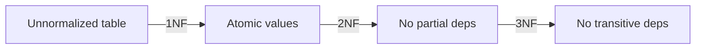

---

### 🛠️ Worked Example

**BAD:**

```sql
-- Repeating groups violate 1NF
CREATE TABLE orders (
    id INTEGER PRIMARY KEY,
    customer TEXT,
    products TEXT  -- 'Widget,Gadget,Bolt'
);
-- Cannot query individual products,
-- cannot enforce constraints per product
```

Why it's wrong: comma-separated values prevent
filtering, joining, or constraining individual items.

**GOOD:**

```sql
-- Normalized: separate tables, atomic values
CREATE TABLE customers (
    id   INTEGER PRIMARY KEY,
    name TEXT NOT NULL,
    city TEXT NOT NULL
);
CREATE TABLE orders (
    id          INTEGER PRIMARY KEY,
    customer_id INTEGER REFERENCES customers(id),
    placed_at   DATE NOT NULL
);
CREATE TABLE order_items (
    id         INTEGER PRIMARY KEY,
    order_id   INTEGER REFERENCES orders(id),
    product_id INTEGER REFERENCES products(id),
    qty        INTEGER NOT NULL CHECK (qty > 0)
);
```

Why it's right: each fact stored once, foreign keys
enforce relationships, individual items are queryable.

**Production pattern - checking normal form:**

```sql
-- Find customers with inconsistent city data
-- (symptom of denormalized design)
SELECT name, COUNT(DISTINCT city) AS cities
FROM orders_denormalized
GROUP BY name
HAVING COUNT(DISTINCT city) > 1;
```

---

### ⚖️ Trade-offs

**Gain:** No update anomalies, smaller row sizes, clearer data model, easier constraint enforcement.

**Cost:** More tables mean more JOINs. Read-heavy workloads may be slower if many tables must be joined for a single query.

| Aspect           | Normalized (3NF)   | Denormalized        |
| ---------------- | ------------------ | ------------------- |
| Write safety     | No anomalies       | Update anomaly risk |
| Read performance | JOIN cost          | Single-table scan   |
| Storage          | Minimal redundancy | Redundant data      |
| Schema clarity   | High               | Lower               |

---

### ⚡ Decision Snap

**USE WHEN:**

- Write correctness is critical (financial, medical, legal data)
- Data is updated frequently and inconsistency is unacceptable
- The schema is evolving and must remain maintainable

**AVOID WHEN:**

- Read performance is the dominant concern and writes are rare
- You are building a read-only reporting warehouse

**PREFER Denormalization WHEN:**

- Specific queries are too slow due to excessive JOINs and correctness can be managed at the application layer
- Data is append-only (event logs, analytics)

---

### ⚠️ Top Traps

| #   | Misconception                              | Reality                                                                                                                           |
| --- | ------------------------------------------ | --------------------------------------------------------------------------------------------------------------------------------- |
| 1   | More normalized is always better           | Over-normalization creates excessive JOINs and hurts read performance; 3NF is the practical sweet spot for most OLTP systems      |
| 2   | 1NF just means "no duplicate rows"         | 1NF also requires atomic column values - no arrays, no comma-separated lists, no JSON blobs storing multiple values in one column |
| 3   | Normalization is only about saving storage | Storage is cheap; normalization is primarily about preventing contradictory data (update anomalies)                               |

---

### 🪜 Learning Ladder

**Prerequisites:**

- SQL-016 Primary Keys and Uniqueness - keys are the foundation of functional dependencies
- SQL-017 Foreign Keys and Relationships - normalization splits tables connected by FKs

**THIS:** SQL-034 Normalization - 1NF, 2NF, 3NF

**Next steps:**

- SQL-035 Denormalization - When and Why - the deliberate reversal
- SQL-047 Normalize-or-Denormalize Decision Guide - the decision framework

---

### 💡 The Surprising Truth

Most production databases aim for 3NF, not higher normal forms like BCNF, 4NF, or 5NF. The jump from 3NF to BCNF eliminates only a narrow class of anomalies involving overlapping candidate keys - a situation rare enough in practice that the added complexity is usually not worth it. Edgar Codd himself advocated 3NF as the standard target for application databases.

---

### 📇 Revision Card

1. 1NF = atomic values, 2NF = no partial key deps, 3NF = no transitive deps - each step removes a class of anomalies.
2. Normalization prevents contradictory data; denormalization trades safety for read speed.
3. 3NF is the practical target for OLTP systems - higher normal forms rarely justify their complexity.

---

---

# SQL-035 Denormalization - When and Why

**TL;DR** - Denormalization intentionally adds redundancy to reduce JOINs and speed up reads at the cost of write complexity.

---

### 🔥 The Problem in One Paragraph

Your perfectly normalized 3NF schema has a product listing page that requires joining six tables: products, categories, brands, prices, inventory, and images. The page loads slowly because each request triggers a six-table JOIN. You have already added indexes. The query planner is doing its best. But the fundamental cost is the JOIN itself - matching rows across six tables on every single page load. You need a way to pre-combine the data so reads are fast, even if it means storing some data redundantly. This is exactly why denormalization was created.

---

### 📘 Textbook Definition

**Denormalization** is the deliberate introduction of redundancy into a database schema to improve read performance. It reverses normalization by duplicating data, pre-computing aggregates, or merging tables to reduce the number of JOINs required for frequent queries. Denormalization is a conscious engineering trade-off, not a design mistake.

---

### 🧠 Mental Model

> Normalization is filing every document in exactly one folder. Denormalization is photocopying a document and placing copies in multiple folders so anyone can find it without cross-referencing. Faster lookup, but you must update every copy when the original changes.

- "Photocopying" -> duplicating data across tables
- "Multiple folders" -> redundant columns or summary tables
- "Updating every copy" -> write-time maintenance cost

**Where this analogy breaks down:** In databases, you can automate the "updating copies" step with triggers, materialized views, or application logic - but the complexity cost remains.

---

### ⚙️ How It Works

1. Identify the slow read query and which JOINs
   dominate its cost.
2. Choose a denormalization strategy: add a redundant
   column, create a summary table, or merge two tables.
3. Populate the redundant data via migration.
4. Maintain consistency on writes - update the redundant
   data whenever the source changes (trigger,
   application code, or materialized view refresh).
5. Monitor for drift between the source and the
   redundant copy.

```
NORMALIZED (3 tables, 2 JOINs):
orders -> customers -> cities
  Need: order_id, customer_name, city_name

DENORMALIZED (1 table, 0 JOINs):
orders_denorm
+----------+--------+-----------+
| order_id | c_name | city_name |
+----------+--------+-----------+
  Redundant: c_name, city_name duplicated
  Fast read: single-table scan
  Risk: c_name change must update all rows
```

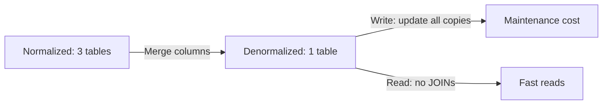

---

### 🛠️ Worked Example

**BAD:**

```sql
-- Accidental denormalization with no maintenance
ALTER TABLE orders
    ADD COLUMN customer_name TEXT;
-- Populated once, never updated when
-- customer changes name
-- Result: stale data, silent inconsistency
```

Why it's wrong: no mechanism to keep the redundant
column in sync with the customers table.

**GOOD:**

```sql
-- Materialized view: controlled denormalization
CREATE MATERIALIZED VIEW order_summary AS
SELECT
    o.id AS order_id,
    c.name AS customer_name,
    c.city,
    o.total,
    o.placed_at
FROM orders o
INNER JOIN customers c ON c.id = o.customer_id;

-- Refresh on a schedule or after bulk writes
REFRESH MATERIALIZED VIEW CONCURRENTLY
    order_summary;
```

Why it's right: the source of truth remains normalized.
The materialized view is an explicit, refreshable cache.

**Production pattern - redundant counter column:**

```sql
-- Add order_count to customers for fast display
ALTER TABLE customers
    ADD COLUMN order_count INTEGER DEFAULT 0;

-- Maintain via trigger
CREATE FUNCTION update_order_count()
RETURNS TRIGGER AS $$
BEGIN
    UPDATE customers
    SET order_count = order_count + 1
    WHERE id = NEW.customer_id;
    RETURN NEW;
END;
$$ LANGUAGE plpgsql;
```

---

### ⚖️ Trade-offs

**Gain:** Dramatically faster reads for specific query patterns. Fewer JOINs, simpler read queries, lower latency for dashboards and listing pages.

**Cost:** Write complexity increases. Every update must maintain redundant copies. Risk of data inconsistency if maintenance fails. Schema is harder to evolve.

| Aspect           | Normalized     | Denormalized       |
| ---------------- | -------------- | ------------------ |
| Read speed       | JOINs required | Pre-joined, fast   |
| Write speed      | Single update  | Multiple updates   |
| Consistency      | Guaranteed     | Must be maintained |
| Schema evolution | Easier         | Harder             |

---

### ⚡ Decision Snap

**USE WHEN:**

- A specific query is too slow and JOINs are the bottleneck
- The data is read far more often than written
- You have a maintenance strategy (triggers, materialized views, or application logic)

**AVOID WHEN:**

- Write frequency is high and consistency is critical
- You have not yet tried indexing, query optimization, or caching

**PREFER Materialized Views WHEN:**

- You want denormalized reads but do not want to maintain redundant columns manually
- Slight staleness is acceptable (refresh interval)

---

### ⚠️ Top Traps

| #   | Misconception                                       | Reality                                                                                        |
| --- | --------------------------------------------------- | ---------------------------------------------------------------------------------------------- |
| 1   | Denormalization means the schema is badly designed  | It is a deliberate trade-off, not a mistake - but only after normalization has been done first |
| 2   | You should denormalize preemptively for performance | Always start normalized, measure, then denormalize specific pain points with data              |
| 3   | Denormalization eliminates the need for indexes     | Denormalized tables still need indexes on filter and sort columns                              |

---

### 🪜 Learning Ladder

**Prerequisites:**

- SQL-034 Normalization - 1NF, 2NF, 3NF - you must normalize before you can knowingly denormalize
- SQL-040 Indexes - What They Are and Why They Matter - try indexes before denormalization

**THIS:** SQL-035 Denormalization - When and Why

**Next steps:**

- SQL-047 Normalize-or-Denormalize Decision Guide - the decision framework
- SQL-072 Materialized Views - the safest denormalization technique

---

### 💡 The Surprising Truth

The most common form of denormalization in production is not adding redundant columns - it is caching query results at the application layer (Redis, Memcached). This is functionally equivalent to denormalization: you are storing a pre-computed, redundant copy of data for fast reads and accepting a maintenance cost (cache invalidation). Every caching problem is a denormalization problem in disguise.

---

### 📇 Revision Card

1. Denormalization is intentional redundancy for read speed - never do it by accident.
2. Always normalize first, measure the bottleneck, then denormalize with a maintenance strategy.
3. Materialized views are the safest form: normalized source of truth, denormalized read layer, explicit refresh.

---

---

# SQL-036 CHECK, DEFAULT, and NOT NULL Constraints

**TL;DR** - CHECK, DEFAULT, and NOT NULL enforce data validity rules directly in the schema, rejecting bad data at the door.

---

### 🔥 The Problem in One Paragraph

Your application code validates that prices must be positive, that status must be one of three values, and that every order must have a placed date. But a developer writes a data migration script that bypasses the application layer and inserts negative prices directly into the database. Another script forgets to set the status column, leaving NULLs that crash the reporting dashboard. Validating only in application code leaves the database undefended against direct SQL access, bulk imports, and future applications that share the same tables. This is exactly why schema-level constraints were created.

---

### 📘 Textbook Definition

**NOT NULL** requires that a column must have a value in every row - NULL is rejected. **DEFAULT** provides an automatic value when an INSERT omits the column. **CHECK** evaluates a Boolean expression on each row insert or update, rejecting the write if the expression is false. Together, these column-level constraints enforce data integrity rules directly in the database schema.

---

### 🧠 Mental Model

> Think of constraints as a bouncer at a nightclub door. NOT NULL checks your ID exists. DEFAULT gives you a guest badge if you forgot yours. CHECK verifies you meet the dress code. No matter who tries to enter - the app, a script, a DBA with psql - the bouncer enforces the rules identically.

- "Bouncer" -> database constraint enforcement
- "ID exists" -> NOT NULL
- "Guest badge" -> DEFAULT value
- "Dress code" -> CHECK condition

**Where this analogy breaks down:** Constraints apply per-row, not per-transaction - a CHECK cannot validate across rows (use triggers or application logic for cross-row rules).

---

### ⚙️ How It Works

1. On INSERT or UPDATE, the database evaluates every
   constraint defined on the affected columns.
2. NOT NULL: if the value is NULL and no DEFAULT is
   defined, the statement is rejected.
3. DEFAULT: if the column is omitted from INSERT, the
   default value is used automatically. Explicit NULL
   overrides the default if NOT NULL is absent.
4. CHECK: the Boolean expression is evaluated. If it
   returns FALSE, the row is rejected. If NULL, it
   passes (CHECK uses three-valued logic).
5. Constraints are enforced regardless of the client -
   application code, migration scripts, psql, or ORM.

```
CREATE TABLE products (
    id    SERIAL PRIMARY KEY,
    name  TEXT NOT NULL,
    price NUMERIC(10,2) NOT NULL
          CHECK (price > 0),
    status TEXT NOT NULL
           DEFAULT 'active'
           CHECK (status IN
                  ('active','archived','draft'))
);

INSERT (name='Widget', price=-5)
  -> REJECTED by CHECK (price > 0)

INSERT (name='Gadget', price=10)
  -> status auto-set to 'active' by DEFAULT

INSERT (name=NULL, price=10)
  -> REJECTED by NOT NULL on name
```

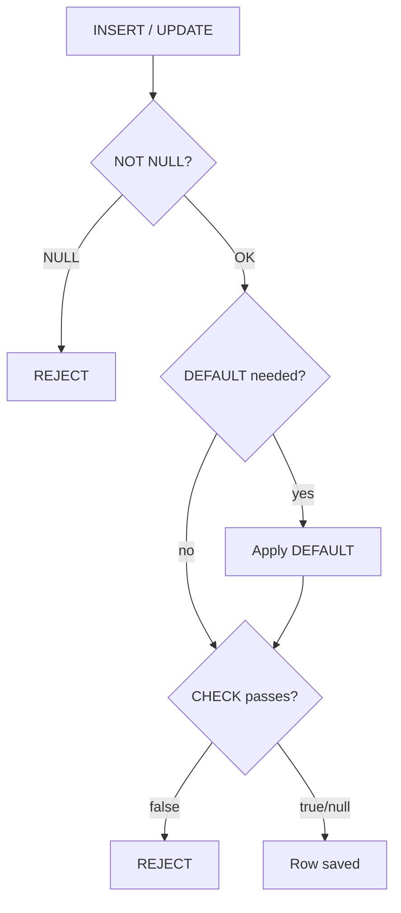

---

### 🛠️ Worked Example

**BAD:**

```sql
-- No constraints: database accepts anything
CREATE TABLE orders (
    id     SERIAL PRIMARY KEY,
    total  NUMERIC,
    status TEXT
);
INSERT INTO orders (total, status)
VALUES (-100, 'banana');
-- Accepted: negative total, invalid status
```

Why it's wrong: the database stores obviously invalid
data that will cause downstream errors.

**GOOD:**

```sql
CREATE TABLE orders (
    id     SERIAL PRIMARY KEY,
    total  NUMERIC(10,2) NOT NULL
           CHECK (total >= 0),
    status TEXT NOT NULL
           DEFAULT 'pending'
           CHECK (status IN
                  ('pending','paid','refunded'))
);
-- Negative total -> rejected
-- Missing status -> auto 'pending'
-- Invalid status -> rejected
```

Why it's right: the schema enforces invariants
regardless of which client writes to the table.

**Production pattern - named constraints for clear errors:**

```sql
ALTER TABLE orders
ADD CONSTRAINT orders_total_positive
    CHECK (total >= 0);
-- Error message includes constraint name:
-- "violates check constraint
-- orders_total_positive"
```

---

### ⚖️ Trade-offs

**Gain:** Data integrity enforced at the lowest level. Works for all clients, all access paths. Named constraints produce clear error messages. Zero application code required.

**Cost:** Schema changes needed to modify rules. CHECK cannot reference other tables (use foreign keys or triggers for that). Complex business rules may not fit in a single Boolean expression.

| Aspect         | Schema constraints     | App-layer validation |
| -------------- | ---------------------- | -------------------- |
| Enforcement    | Always, any client     | Only through the app |
| Bypass risk    | None (unless disabled) | Scripts, direct SQL  |
| Flexibility    | Boolean expressions    | Any code logic       |
| Error messages | Constraint name        | Custom messages      |

---

### ⚡ Decision Snap

**USE WHEN:**

- The rule is simple and universal (non-negative prices, required fields, enum values)
- Multiple applications or scripts access the same table
- You want defense-in-depth alongside application validation

**AVOID WHEN:**

- The rule requires cross-table or cross-row checks (use triggers or app logic)
- The constraint would need to change frequently (schema migrations have cost)

**PREFER Triggers WHEN:**

- The validation logic requires querying other tables
- You need to enforce complex invariants that CHECK cannot express

---

### ⚠️ Top Traps

| #   | Misconception                                               | Reality                                                                                                                                         |
| --- | ----------------------------------------------------------- | ----------------------------------------------------------------------------------------------------------------------------------------------- |
| 1   | DEFAULT replaces NULL on explicit INSERT                    | DEFAULT only applies when the column is omitted; `INSERT (col) VALUES (NULL)` inserts NULL even if DEFAULT is set (unless NOT NULL prevents it) |
| 2   | CHECK constraints validate NULLs                            | CHECK treats NULL as UNKNOWN, which passes - add NOT NULL if NULL should be rejected                                                            |
| 3   | Application validation makes schema constraints unnecessary | Constraints are defense-in-depth; direct SQL, migrations, and future apps all bypass app validation                                             |

---

### 🪜 Learning Ladder

**Prerequisites:**

- SQL-010 CREATE TABLE and DROP TABLE - constraints are defined in CREATE TABLE
- SQL-018 NULL - The Three-Valued Logic Trap - understanding NULL is critical for CHECK behavior

**THIS:** SQL-036 CHECK, DEFAULT, and NOT NULL Constraints

**Next steps:**

- SQL-034 Normalization - 1NF, 2NF, 3NF - constraints enforce the rules normalization assumes
- SQL-037 Entity-Relationship Modeling Basics - constraints implement ER model rules

---

### 💡 The Surprising Truth

A CHECK constraint that evaluates to NULL passes, not fails. This follows SQL's three-valued logic: CHECK rejects only FALSE, not UNKNOWN. This means `CHECK (price > 0)` allows NULL prices unless you also add NOT NULL. Many developers assume CHECK catches NULLs and are surprised when NULL values slip through their "positive price" constraint.

---

### 📇 Revision Card

1. NOT NULL = required, DEFAULT = auto-fill when omitted, CHECK = reject if expression is false.
2. CHECK passes on NULL (three-valued logic) - pair CHECK with NOT NULL for full protection.
3. Name your constraints (`CONSTRAINT name CHECK (...)`) so error messages tell you what failed.

---

---

# SQL-037 Entity-Relationship Modeling Basics

**TL;DR** - ER modeling maps real-world entities and their relationships into a visual diagram before writing any SQL.

---

### 🔥 The Problem in One Paragraph

You are designing a database for an online store. You know you need tables, but how many? What columns go where? Should shipping addresses be a column in orders or a separate table? Without a plan, you start creating tables ad hoc, discover missing relationships midway, and refactor the schema repeatedly. ER modeling gives you a visual blueprint that captures entities, their attributes, and the relationships between them before you write a single CREATE TABLE statement. This is exactly why Entity-Relationship modeling was created.

---

### 📘 Textbook Definition

**Entity-Relationship (ER) modeling** is a data modeling technique that represents the logical structure of a database using entities (things), attributes (properties), and relationships (connections). An ER diagram (ERD) is the visual notation. Entities become tables, attributes become columns, and relationships become foreign keys or junction tables. Cardinality notation (1:1, 1:N, M:N) specifies how many instances of each entity participate in a relationship.

---

### 🧠 Mental Model

> An ER diagram is an architect's floor plan. Before building the house (database), you draw rooms (entities), label what goes in each room (attributes), and draw doors between rooms (relationships). A floor plan catches layout problems before you pour concrete.

- "Rooms" -> entities (tables)
- "Room labels" -> attributes (columns)
- "Doors" -> relationships (foreign keys)

**Where this analogy breaks down:** Unlike physical rooms, a single entity can have an unlimited number of relationships, and the "doors" can connect any two rooms regardless of physical proximity.

---

### ⚙️ How It Works

1. Identify entities: nouns in the domain (Customer,
   Order, Product).
2. Define attributes for each entity: properties that
   describe it (name, email, price).
3. Identify relationships between entities: verbs that
   connect them (Customer PLACES Order).
4. Determine cardinality: 1:1, 1:N, or M:N.
5. Map to tables: entities become tables, 1:N uses a
   foreign key, M:N uses a junction table.

```
ER DIAGRAM (ASCII):
 +----------+    places     +---------+
 | Customer |----1:N-------| Order   |
 +----------+              +---------+
 | id (PK)  |              | id (PK) |
 | name     |              | c_id(FK)|
 | email    |              | total   |
 +----------+              +---------+
                               |
                            contains
                             1:N
                               |
                          +-----------+
                          | OrderItem |
                          +-----------+
                          | id (PK)   |
                          | order_id  |
                          | prod_id   |
                          | qty       |
                          +-----------+
```

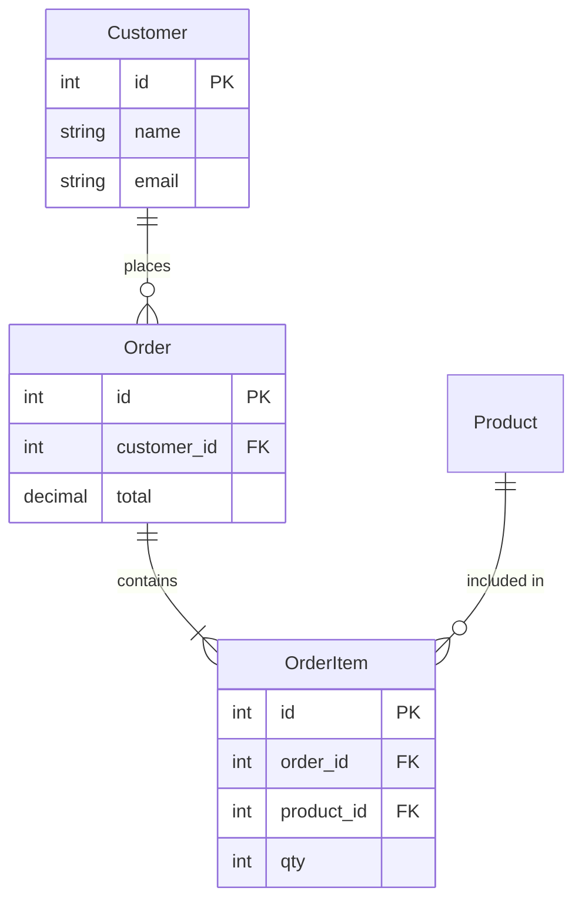

---

### 🛠️ Worked Example

**BAD:**

```sql
-- No ER model: everything in one table
CREATE TABLE everything (
    order_id INT,
    cust_name TEXT,
    cust_email TEXT,
    product TEXT,
    qty INT,
    price NUMERIC
);
-- Massive redundancy, no relationships,
-- no constraints, update anomalies
```

Why it's wrong: without ER modeling, all data gets
crammed into one table with no structure.

**GOOD:**

```sql
-- ER model translated to 3NF schema
CREATE TABLE customers (
    id    SERIAL PRIMARY KEY,
    name  TEXT NOT NULL,
    email TEXT NOT NULL UNIQUE
);
CREATE TABLE orders (
    id          SERIAL PRIMARY KEY,
    customer_id INT REFERENCES customers(id),
    placed_at   DATE NOT NULL DEFAULT CURRENT_DATE
);
CREATE TABLE order_items (
    id         SERIAL PRIMARY KEY,
    order_id   INT REFERENCES orders(id),
    product_id INT REFERENCES products(id),
    qty        INT NOT NULL CHECK (qty > 0),
    unit_price NUMERIC(10,2) NOT NULL
);
```

Why it's right: entities, attributes, and relationships
map directly from the ER diagram to tables.

**Production pattern - M:N junction table:**

```sql
-- Students <-> Courses (M:N relationship)
CREATE TABLE enrollments (
    student_id INT REFERENCES students(id),
    course_id  INT REFERENCES courses(id),
    enrolled   DATE DEFAULT CURRENT_DATE,
    PRIMARY KEY (student_id, course_id)
);
```

---

### ⚖️ Trade-offs

**Gain:** Catches design errors before schema creation. Provides a shared visual vocabulary for developers, DBAs, and stakeholders. Maps cleanly to normalized tables.

**Cost:** Requires upfront time. ER diagrams can become complex for large domains. The model is logical - physical optimizations (indexes, partitions) are a separate concern.

| Aspect           | ER Modeling          | Ad-hoc table creation |
| ---------------- | -------------------- | --------------------- |
| Design errors    | Caught early         | Found in production   |
| Communication    | Visual, shareable    | Tribal knowledge      |
| Upfront cost     | Hours                | Minutes               |
| Refactoring cost | Low (change diagram) | High (migrate data)   |

---

### ⚡ Decision Snap

**USE WHEN:**

- Designing a new database or major schema extension
- Multiple developers or teams need to agree on data structure
- The domain has non-trivial relationships (M:N, hierarchies)

**AVOID WHEN:**

- Adding a single column to an existing well-understood table
- Prototyping a throwaway proof-of-concept

**PREFER Domain-Driven Design WHEN:**

- The business logic is complex and entities need behavioral modeling, not just data modeling
- Bounded contexts span multiple databases

---

### ⚠️ Top Traps

| #   | Misconception                               | Reality                                                                                              |
| --- | ------------------------------------------- | ---------------------------------------------------------------------------------------------------- |
| 1   | ER diagrams are just documentation          | They are a design tool - the diagram drives the schema, not the other way around                     |
| 2   | Every relationship is either 1:1 or 1:N     | M:N relationships are common and require a junction (bridge) table with its own attributes           |
| 3   | ER models must capture every column upfront | Start with entities and relationships; attributes can be refined iteratively as requirements clarify |

---

### 🪜 Learning Ladder

**Prerequisites:**

- SQL-008 Tables, Rows, and Columns - understand what entities become
- SQL-017 Foreign Keys and Relationships - FKs implement ER relationships

**THIS:** SQL-037 Entity-Relationship Modeling Basics

**Next steps:**

- SQL-034 Normalization - 1NF, 2NF, 3NF - normalize the ER model into clean tables
- SQL-075 Schema Migration Fundamentals - evolving the model over time

---

### 💡 The Surprising Truth

The most valuable artifact from ER modeling is not the diagram itself - it is the conversations the diagram provokes. Drawing entities forces you to answer questions like "can a product belong to multiple categories?" and "is an address part of the customer or a separate entity?" These questions, answered before any code is written, prevent the most expensive kind of technical debt: schema redesigns under live production data.

---

### 📇 Revision Card

1. Entities = tables, attributes = columns, relationships = foreign keys or junction tables.
2. 1:N uses a FK in the child table; M:N requires a junction table with two FKs.
3. The ER diagram is a design tool, not documentation - draw it before CREATE TABLE.

---

---

# SQL-038 Transactions - BEGIN, COMMIT, ROLLBACK

**TL;DR** - Transactions group multiple statements into an atomic unit that either fully succeeds or fully fails.

---

### 🔥 The Problem in One Paragraph

A bank transfer moves $500 from Account A to Account B. That requires two UPDATEs: subtract from A, add to B. If the system crashes after subtracting from A but before adding to B, $500 vanishes. If you subtract from A and then the add-to-B statement hits a constraint violation, A is debited but B never receives the money. You need a mechanism that guarantees either both statements succeed together or neither takes effect. Half-done operations corrupt data. This is exactly why transactions were created.

---

### 📘 Textbook Definition

A **transaction** is a sequence of one or more SQL statements that execute as a single logical unit of work. **BEGIN** starts the transaction. **COMMIT** makes all changes permanent. **ROLLBACK** undoes all changes since BEGIN, restoring the database to its prior state. If any statement fails during the transaction, the entire transaction can be rolled back, ensuring the database never enters an inconsistent state.

---

### 🧠 Mental Model

> A transaction is an envelope you seal before mailing. You write multiple checks (statements), put them in the envelope, and either mail it (COMMIT) or shred it (ROLLBACK). The bank processes all checks in the envelope as one batch - it never processes half the envelope.

- "Envelope" -> transaction boundary (BEGIN...COMMIT)
- "Checks" -> SQL statements inside the transaction
- "Mail" -> COMMIT (permanent)
- "Shred" -> ROLLBACK (discard all)

**Where this analogy breaks down:** Other transactions are running simultaneously and may see or not see your in-progress changes depending on the isolation level - envelopes do not have this concurrency dimension.

---

### ⚙️ How It Works

1. BEGIN marks the start of the transaction.
2. Each subsequent statement executes but changes are
   not visible to other transactions (depending on
   isolation level).
3. If all statements succeed, COMMIT makes every change
   durable and visible.
4. If any statement fails or you issue ROLLBACK, all
   changes since BEGIN are undone.
5. PostgreSQL uses MVCC (multi-version concurrency
   control) to allow concurrent transactions without
   blocking readers.

```
Timeline:
  BEGIN
    UPDATE accounts SET bal = bal - 500
        WHERE id = 'A';          -- tentative
    UPDATE accounts SET bal = bal + 500
        WHERE id = 'B';          -- tentative
  COMMIT                         -- both permanent

  If crash after first UPDATE:
    ROLLBACK (automatic)         -- A restored
```

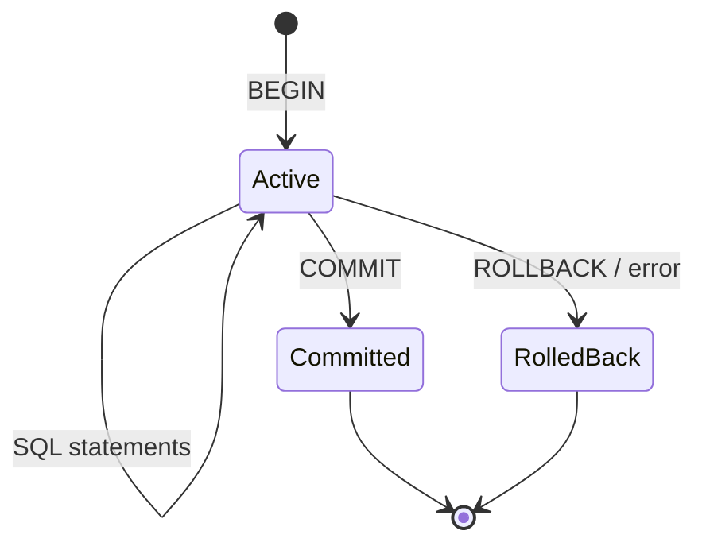

---

### 🛠️ Worked Example

**BAD:**

```sql
-- No transaction: partial failure possible
UPDATE accounts SET balance = balance - 500
    WHERE id = 'A';
-- If this crashes, A lost $500
UPDATE accounts SET balance = balance + 500
    WHERE id = 'B';
```

Why it's wrong: each statement auto-commits
independently. A crash between them leaves the
database in an inconsistent state.

**GOOD:**

```sql
BEGIN;
    UPDATE accounts SET balance = balance - 500
        WHERE id = 'A';
    UPDATE accounts SET balance = balance + 500
        WHERE id = 'B';
COMMIT;
-- Either both succeed or both are rolled back
```

Why it's right: the transaction ensures atomicity.
If anything fails, ROLLBACK restores both accounts.

**Production pattern - savepoints for partial rollback:**

```sql
BEGIN;
    INSERT INTO orders (customer_id, total)
        VALUES (1, 100);
    SAVEPOINT before_items;
    INSERT INTO order_items (order_id, product_id)
        VALUES (currval('orders_id_seq'), 999);
    -- product 999 does not exist: FK error
    ROLLBACK TO before_items;
    -- Order is still inserted, items rolled back
COMMIT;
```

---

### ⚖️ Trade-offs

**Gain:** Atomicity guarantees no partial updates. Crash recovery automatic. Consistent state always maintained.

**Cost:** Transactions hold locks and resources while open. Long transactions block other writers and increase contention. Connection pool starvation risk if transactions are not closed promptly.

| Aspect        | Explicit transactions | Auto-commit      |
| ------------- | --------------------- | ---------------- |
| Atomicity     | Multi-statement       | Single statement |
| Crash safety  | Full rollback         | Per-statement    |
| Lock duration | BEGIN to COMMIT       | Statement only   |
| Complexity    | Must manage lifecycle | Simpler          |

---

### ⚡ Decision Snap

**USE WHEN:**

- Multiple statements must succeed or fail as one unit
- Financial or critical data operations (transfers, inventory adjustments)
- You need to validate intermediate results before committing

**AVOID WHEN:**

- A single INSERT or UPDATE suffices (auto-commit handles it)
- Read-only queries (SELECT does not modify data)

**PREFER Savepoints WHEN:**

- You want to retry part of a transaction without losing earlier work
- Batch processing where individual item failures should not abort the batch

---

### ⚠️ Top Traps

| #   | Misconception                                    | Reality                                                                                                                                     |
| --- | ------------------------------------------------ | ------------------------------------------------------------------------------------------------------------------------------------------- |
| 1   | Transactions prevent all concurrency issues      | Transactions provide atomicity, but concurrency issues depend on the isolation level (Read Committed, Serializable, etc.)                   |
| 2   | If I do not write BEGIN, there is no transaction | Most databases use auto-commit: each statement runs in its own implicit transaction                                                         |
| 3   | ROLLBACK recovers from any error                 | DDL statements (CREATE, DROP) in some databases auto-commit and cannot be rolled back (PostgreSQL allows transactional DDL, MySQL does not) |

---

### 🪜 Learning Ladder

**Prerequisites:**

- SQL-011 INSERT - Adding Rows - understand write operations
- SQL-014 UPDATE and DELETE - Modifying Data - transactions protect multi-step modifications

**THIS:** SQL-038 Transactions - BEGIN, COMMIT, ROLLBACK

**Next steps:**

- SQL-039 ACID Properties - What They Actually Mean - the theory behind transactions
- SQL-067 Transaction Isolation Levels - controlling what concurrent transactions see

---

### 💡 The Surprising Truth

PostgreSQL supports transactional DDL: you can CREATE TABLE, ALTER TABLE, and DROP TABLE inside a transaction and ROLLBACK all of it. This is rare among databases. MySQL auto-commits DDL statements, making them impossible to roll back. This difference matters enormously for schema migrations - in PostgreSQL you can wrap an entire migration in a transaction, and if it fails, the schema is untouched.

---

### 📇 Revision Card

1. BEGIN groups statements; COMMIT makes them permanent; ROLLBACK undoes everything.
2. Without BEGIN, every statement auto-commits independently - partial failures become possible.
3. Keep transactions short: long transactions hold locks, increase contention, and risk connection pool starvation.

---

---

# SQL-039 ACID Properties - What They Actually Mean

**TL;DR** - ACID guarantees that database transactions are atomic, consistent, isolated, and durable - or they fail cleanly.

---

### 🔥 The Problem in One Paragraph

You know transactions exist, but why should you trust them? What exactly does the database promise? If two transactions run simultaneously and both update the same row, what happens? If the server loses power during a COMMIT, is the data safe? If a constraint is violated midway through a transaction, does the database silently corrupt data? ACID is the set of guarantees that answers every one of these questions and separates real databases from "just writing to files." This is exactly why ACID properties were formalized.

---

### 📘 Textbook Definition

**ACID** is an acronym for four properties that guarantee reliable transaction processing. **Atomicity:** a transaction either fully completes or fully aborts - no partial effects. **Consistency:** a transaction transforms the database from one valid state to another, respecting all constraints. **Isolation:** concurrent transactions do not interfere with each other as if they ran sequentially. **Durability:** once committed, changes survive crashes, power failures, and restarts.

---

### 🧠 Mental Model

> Think of ACID as the contract a bank vault promises you. Atomicity: the vault door is either fully locked or fully open - never half-open. Consistency: the vault only accepts items that fit the deposit rules. Isolation: two people using adjacent safety deposit boxes cannot see or interfere with each other. Durability: once the vault door closes, fire, flood, or earthquake cannot erase what is inside.

- "Vault door" -> Atomicity (all or nothing)
- "Deposit rules" -> Consistency (constraints hold)
- "Separate boxes" -> Isolation (no interference)
- "Fire-proof" -> Durability (survives crashes)

**Where this analogy breaks down:** Real database isolation has degrees (read committed, repeatable read, serializable) - the "walls" between boxes have adjustable thickness.

---

### ⚙️ How It Works

1. **Atomicity:** The database logs every change to a
   write-ahead log (WAL) before applying it. If a crash
   occurs, the WAL is replayed to undo incomplete
   transactions.
2. **Consistency:** Constraints (PK, FK, CHECK, NOT NULL)
   are evaluated at statement end or transaction end.
   Any violation aborts the transaction.
3. **Isolation:** MVCC creates versioned snapshots of
   rows so readers do not block writers and vice versa.
   The isolation level controls which versions are
   visible.
4. **Durability:** COMMIT flushes WAL records to disk
   before acknowledging. Even if the server crashes one
   millisecond later, the committed data can be
   recovered from the WAL.

```
ACID in action (bank transfer):

A: Atomicity
   Both UPDATEs succeed or both revert.

C: Consistency
   CHECK (balance >= 0) enforced.
   If debit makes A negative -> abort.

I: Isolation
   Another query reading A's balance sees
   either the old or new value, never a
   half-updated state.

D: Durability
   After COMMIT, the new balances survive
   even if the server loses power.
```

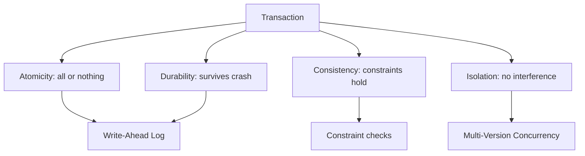

---

### 🛠️ Worked Example

**BAD:**

```python
# Simulating transactions in application code
db.execute("UPDATE accounts SET bal=bal-500 "
           "WHERE id='A'")
db.execute("UPDATE accounts SET bal=bal+500 "
           "WHERE id='B'")
# No atomicity: crash between statements
# corrupts data. No isolation: concurrent
# reads see partial state.
```

Why it's wrong: application code cannot provide
atomicity or isolation without database support.

**GOOD:**

```sql
BEGIN;
    UPDATE accounts SET balance = balance - 500
        WHERE id = 'A';
    -- If balance goes negative, CHECK constraint
    -- aborts: Consistency
    UPDATE accounts SET balance = balance + 500
        WHERE id = 'B';
COMMIT;
-- Atomicity: both or neither
-- Durability: committed to WAL on disk
```

Why it's right: the database enforces all four ACID
properties without application-level coordination.

**Production pattern - testing durability:**

```sql
-- PostgreSQL: synchronous_commit controls
-- durability vs performance trade-off
SET synchronous_commit = 'on';  -- default, safe
-- 'off' = faster but small data loss window
-- on crash (typically < 10ms of commits)
```

---

### ⚖️ Trade-offs

**Gain:** Bulletproof data integrity. Applications can trust the database to handle crash recovery, concurrency, and constraint enforcement.

**Cost:** ACID enforcement adds overhead - WAL writes for durability, lock management for isolation, constraint evaluation for consistency. Relaxing any property (e.g., weaker isolation) trades safety for performance.

| Aspect      | Full ACID           | Relaxed (e.g., eventual consistency) |
| ----------- | ------------------- | ------------------------------------ |
| Correctness | Guaranteed          | Application must handle              |
| Performance | WAL + lock overhead | Higher throughput                    |
| Complexity  | Database handles it | App must compensate                  |
| Use case    | Financial, OLTP     | Analytics, event logs                |

---

### ⚡ Decision Snap

**USE WHEN:**

- Data correctness is non-negotiable (financial, medical, legal)
- Multiple concurrent writers modify the same data
- You need crash recovery guarantees

**AVOID WHEN:**

- Performance matters more than strict consistency (analytics pipelines, event logs)
- Data is append-only and eventual consistency is acceptable

**PREFER Weaker Isolation WHEN:**

- Read Committed is sufficient and Serializable is too expensive
- You understand the read phenomena you are accepting (see SQL-068)

---

### ⚠️ Top Traps

| #   | Misconception                                  | Reality                                                                                                                    |
| --- | ---------------------------------------------- | -------------------------------------------------------------------------------------------------------------------------- |
| 1   | ACID means zero data loss in all scenarios     | Durability means committed data survives crashes; uncommitted data is lost by design (that is atomicity working correctly) |
| 2   | All databases provide the same ACID guarantees | Isolation levels vary widely. MySQL's default (REPEATABLE READ) differs from PostgreSQL's default (READ COMMITTED)         |
| 3   | NoSQL databases cannot provide ACID            | Many NoSQL databases now offer ACID transactions (MongoDB 4.0+, FaunaDB, CockroachDB)                                      |

---

### 🪜 Learning Ladder

**Prerequisites:**

- SQL-038 Transactions - BEGIN, COMMIT, ROLLBACK - ACID describes what transactions guarantee
- SQL-036 CHECK, DEFAULT, and NOT NULL Constraints - constraints enforce the "C" in ACID

**THIS:** SQL-039 ACID Properties - What They Actually Mean

**Next steps:**

- SQL-067 Transaction Isolation Levels - controlling the "I" in ACID
- SQL-068 Read Phenomena - Dirty, Non-Repeatable, Phantom - what weakened isolation allows

---

### 💡 The Surprising Truth

The "C" in ACID is the most misunderstood property. It does not mean "consistent" in the distributed systems sense (all nodes agree). In ACID, Consistency means the database moves from one valid state to another - all constraints hold before and after the transaction. This is entirely different from CAP theorem's Consistency, which means all nodes return the same data. Confusing the two leads to incorrect conclusions when comparing SQL databases to distributed NoSQL systems.

---

### 📇 Revision Card

1. Atomicity = all or nothing, Consistency = constraints hold, Isolation = no interference, Durability = survives crashes.
2. The WAL (write-ahead log) is the mechanism behind both Atomicity and Durability.
3. ACID's "C" means constraint validity, not distributed consensus - do not confuse it with CAP theorem's "C".

---

---

# SQL-040 Indexes - What They Are and Why They Matter

**TL;DR** - An index is a separate data structure that speeds up lookups by avoiding full table scans, at the cost of slower writes.

---

### 🔥 The Problem in One Paragraph

Your orders table has 10 million rows. You run `SELECT * FROM orders WHERE customer_id = 42`. Without an index, the database reads every single row - all 10 million - to find the ones matching customer 42. This is a sequential scan (Seq Scan), and it takes seconds on a large table. Every additional row makes it slower. With an index on customer_id, the database jumps directly to the matching rows, reading a handful of pages instead of millions. This is exactly why indexes were created.

---

### 📘 Textbook Definition

An **index** is an auxiliary data structure maintained by the database that maps column values to the physical locations of the rows containing those values. The most common type is a B-tree index, which stores sorted values in a balanced tree structure, enabling lookups, range scans, and ordered retrieval in O(log N) time. Indexes are transparent to queries - the planner decides whether to use them.

---

### 🧠 Mental Model

> An index is a book's back-of-book index. Instead of reading every page to find "concurrency," you look up "concurrency" in the index, find "pages 42, 87, 103," and flip directly there. The index is small, sorted alphabetically, and saves you from scanning the entire book.

- "Back-of-book index" -> database index structure
- "Alphabetical sorting" -> B-tree sorted order
- "Page numbers" -> pointers to row locations (ctid in PostgreSQL)

**Where this analogy breaks down:** A book index is built once; a database index is updated on every INSERT, UPDATE, and DELETE. The maintenance cost is the trade-off.

---

### ⚙️ How It Works

1. CREATE INDEX builds a sorted copy of the indexed
   column(s) alongside pointers to the actual rows.
2. When a query filters on the indexed column, the
   planner uses the index to locate matching rows
   directly instead of scanning the entire table.
3. For range queries (WHERE price BETWEEN 10 AND 50),
   the B-tree finds the start point and scans forward.
4. The planner may ignore the index if it estimates a
   table scan would be faster (e.g., query returns
   most of the table's rows).
5. Every INSERT, UPDATE, or DELETE on the table must
   also update every index on that table.

```
Without index (Seq Scan):
  +------+------+------+------+------+
  | row1 | row2 | row3 | ... | rowN |
  +------+------+------+------+------+
  Scan every row: O(N)

With B-tree index on customer_id:
         [50]
        /    \
     [25]    [75]
     / \      / \
  [10] [30] [60] [90]
   |    |    |    |
  rows rows rows rows
  Lookup: O(log N) -> jump to matching rows
```

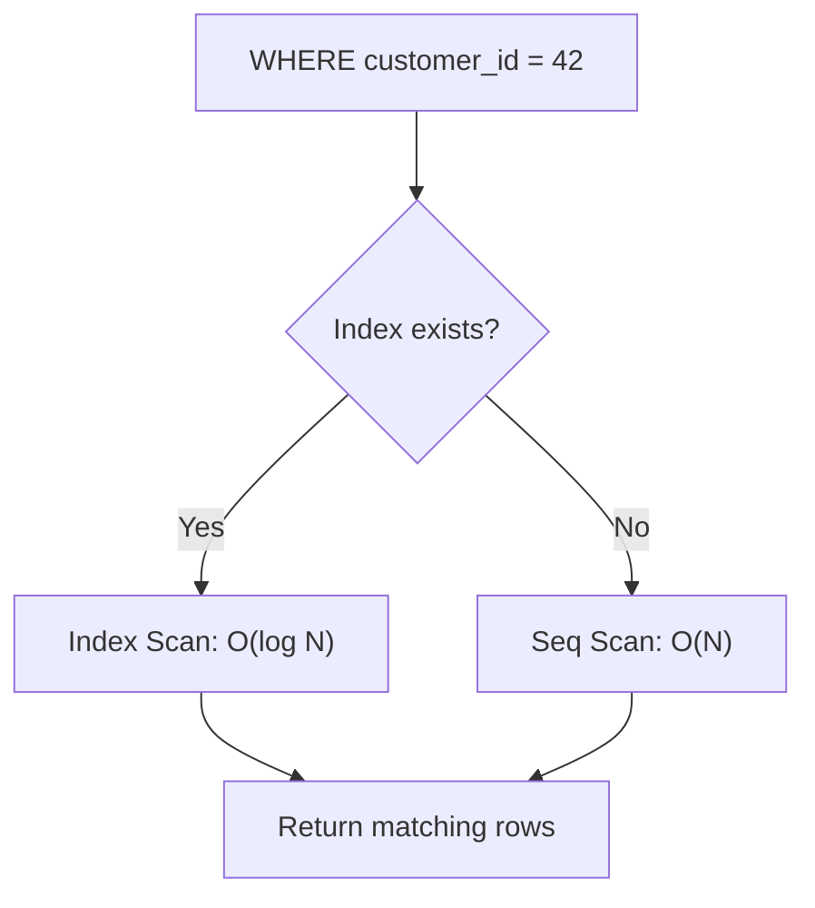

---

### 🛠️ Worked Example

**BAD:**

```sql
-- No index: full table scan on every query
SELECT * FROM orders WHERE customer_id = 42;
-- Seq Scan on 10M rows: seconds per query
-- Every dashboard load pays this cost
```

Why it's wrong: without an index, the database must
read every row regardless of how selective the filter is.

**GOOD:**

```sql
-- Create index on the filtered column
CREATE INDEX idx_orders_customer_id
    ON orders (customer_id);

-- Same query now uses Index Scan
SELECT * FROM orders WHERE customer_id = 42;
-- Index Scan: milliseconds, reads only
-- matching rows plus index pages
```

Why it's right: the B-tree index turns an O(N) scan
into an O(log N) lookup.

**Production pattern - partial index:**

```sql
-- Index only active orders (smaller, faster)
CREATE INDEX idx_orders_active
    ON orders (customer_id)
    WHERE status = 'active';
-- Only rows where status='active' are indexed
-- Smaller index = less maintenance = faster scans
```

---

### ⚖️ Trade-offs

**Gain:** Dramatic read speedup for selective queries. Enables sorted retrieval without runtime sorting. Supports unique constraints efficiently.

**Cost:** Every write (INSERT, UPDATE, DELETE) must maintain every index on the table. Indexes consume disk space. Too many indexes slow writes significantly.

| Aspect           | With index                    | Without index |
| ---------------- | ----------------------------- | ------------- |
| Read (selective) | O(log N)                      | O(N)          |
| Write overhead   | Index maintenance             | None          |
| Disk space       | Extra structure               | Table only    |
| Planner choice   | May ignore if low selectivity | Always scans  |

---

### ⚡ Decision Snap

**USE WHEN:**

- Columns appear frequently in WHERE, JOIN ON, or ORDER BY clauses
- The table has many rows and queries are selective (return small fraction)
- You need to enforce UNIQUE constraints

**AVOID WHEN:**

- The table is small (hundreds of rows) - scan is fast enough
- The column has very low cardinality (e.g., boolean with 50/50 distribution)

**PREFER Partial Index WHEN:**

- Only a subset of rows matches the common query pattern
- You want a smaller index with less write overhead

---

### ⚠️ Top Traps

| #   | Misconception                                   | Reality                                                                                                          |
| --- | ----------------------------------------------- | ---------------------------------------------------------------------------------------------------------------- |
| 1   | More indexes always mean faster queries         | Each index slows every INSERT, UPDATE, DELETE; the optimal number is the minimum that covers your query patterns |
| 2   | The database always uses an index if one exists | The planner estimates cost and may choose a Seq Scan if the query returns a large fraction of the table          |
| 3   | Indexes only help equality lookups              | B-tree indexes also help range queries (BETWEEN, <, >), ORDER BY, and MIN/MAX                                    |

---

### 🪜 Learning Ladder

**Prerequisites:**

- SQL-013 WHERE - Filtering Rows - indexes accelerate WHERE conditions
- SQL-012 SELECT and FROM - Reading Data - understand what a full table scan means

**THIS:** SQL-040 Indexes - What They Are and Why They Matter

**Next steps:**

- SQL-041 B-Tree Index Basics - how the default index structure works
- SQL-042 EXPLAIN - Reading Your First Query Plan - verify the index is being used

---

### 💡 The Surprising Truth

Primary key columns are automatically indexed in every major database. When you write `id INTEGER PRIMARY KEY`, the database creates a unique B-tree index behind the scenes. This is why lookups by primary key are always fast without you doing anything. But foreign key columns are NOT automatically indexed in most databases (PostgreSQL, MySQL InnoDB) - and missing FK indexes are one of the most common causes of slow JOINs in production.

---

### 📇 Revision Card

1. An index trades write overhead for read speed: O(log N) lookup instead of O(N) scan.
2. Primary keys are auto-indexed; foreign keys are NOT - always index your FK columns.
3. The planner decides whether to use an index; it will skip it if the query is not selective enough.

---

---

# SQL-041 B-Tree Index Basics

**TL;DR** - A B-tree index stores sorted values in a balanced tree, enabling O(log N) lookups, range scans, and ordered retrieval.

---

### 🔥 The Problem in One Paragraph

You know indexes make queries faster, but how? If an index were a simple sorted list, inserting a value in the middle would require shifting all subsequent entries - O(N) per write, defeating the purpose for write-heavy tables. You need a data structure that keeps values sorted for fast lookups and range scans while also handling inserts, updates, and deletes efficiently. The structure must stay balanced as data grows, so performance remains predictable at any table size. This is exactly why B-tree indexes were created.

---

### 📘 Textbook Definition

A **B-tree** (balanced tree) index organizes values in a self-balancing tree structure where every path from root to leaf has the same length. Internal nodes contain keys and pointers to child nodes. Leaf nodes contain the indexed values and pointers (ctids in PostgreSQL) to the actual table rows. The tree maintains sorted order, enabling binary-search-style navigation from root to leaf in O(log N) time. B-tree is the default index type in PostgreSQL, MySQL, SQL Server, and Oracle.

---

### 🧠 Mental Model

> Imagine a library card catalog organized into drawers. The top-level guide card says "A-M left, N-Z right." Within a drawer, dividers narrow further: "Na-Nm, Nn-Nz." You follow dividers from general to specific until you find the exact card. At every level, you eliminate half the remaining options. That is a B-tree traversal.

- "Guide cards at each level" -> internal nodes with separator keys
- "Final card" -> leaf node with row pointer
- "Following dividers" -> tree traversal from root to leaf

**Where this analogy breaks down:** A B-tree node can have hundreds of children (high fan-out), not just two - this is what makes it efficient for disk-based storage, minimizing I/O by packing many keys per page.

---

### ⚙️ How It Works

1. The root node contains a few separator keys that
   divide the entire value range into subtrees.
2. Each internal node similarly divides its range,
   pointing to child nodes.
3. Leaf nodes store the actual indexed values and
   pointers (ctids) to table rows.
4. Lookup: start at root, compare the search key at
   each level, follow the appropriate pointer down.
   Depth is typically 3-4 levels for millions of rows.
5. Range scan: find the start leaf, then follow
   sibling pointers (leaf nodes are linked) to scan
   sequentially.
6. Insertion: find the correct leaf, insert the value.
   If the leaf overflows, split it and propagate a
   separator key up. The tree stays balanced.

```
B-tree index on customer_id:

          [50]            <- root (level 0)
         /    \
      [25]    [75]        <- internal (level 1)
      / \      / \
   [10][30] [60][90]      <- leaf (level 2)
    |    |    |    |
   ctid ctid ctid ctid    <- row pointers

Lookup customer_id = 30:
  root: 30 < 50 -> go left
  internal: 30 >= 25 -> go right
  leaf: found 30 -> follow ctid to row
  Total: 3 page reads
```

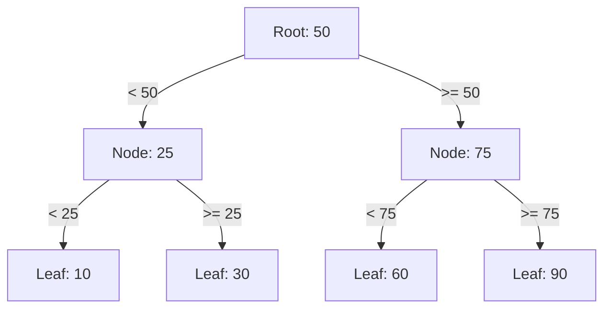

---

### 🛠️ Worked Example

**BAD:**

```sql
-- Hash index cannot do range queries
CREATE INDEX idx_price_hash
    ON products USING hash (price);
SELECT * FROM products
    WHERE price BETWEEN 10 AND 50;
-- Hash index is useless here:
-- it only supports equality (=)
```

Why it's wrong: hash indexes only support `=` lookups.
Range queries require sorted structure (B-tree).

**GOOD:**

```sql
-- B-tree supports equality AND range
CREATE INDEX idx_price
    ON products (price);
-- All of these use the B-tree:
SELECT * FROM products WHERE price = 25;
SELECT * FROM products
    WHERE price BETWEEN 10 AND 50;
SELECT * FROM products
    ORDER BY price LIMIT 10;
```

Why it's right: B-tree sorted structure enables
equality, range, and ordered retrieval efficiently.

**Production pattern - checking index size and usage:**

```sql
-- Index size
SELECT pg_size_pretty(
    pg_relation_size('idx_price')
) AS index_size;

-- Index usage stats
SELECT indexrelname, idx_scan, idx_tup_read
FROM pg_stat_user_indexes
WHERE relname = 'products';
```

---

### ⚖️ Trade-offs

**Gain:** O(log N) lookup, range scan, ordered retrieval, and unique enforcement. Works for the vast majority of query patterns. Default and most battle-tested index type.

**Cost:** Write amplification - every row change updates the index. Space overhead (typically 1-3x the column data size). Not optimal for very low cardinality or specialized patterns (full-text, geospatial).

| Aspect      | B-tree   | Hash | GIN                |
| ----------- | -------- | ---- | ------------------ |
| Equality    | Yes      | Yes  | Yes                |
| Range       | Yes      | No   | No                 |
| Multi-value | No       | No   | Yes (arrays, text) |
| Write cost  | Moderate | Low  | High               |
| Default     | Yes      | No   | No                 |

---

### ⚡ Decision Snap

**USE WHEN:**

- The column appears in WHERE with equality or range conditions
- You need ORDER BY without a runtime sort
- This is your first index on a column (B-tree is the safe default)

**AVOID WHEN:**

- The column is a JSONB field needing key-path lookups (use GIN)
- Full-text search is required (use GIN with tsvector)

**PREFER Hash Index WHEN:**

- Only equality lookups are needed and the column is very large (hash is smaller but limited to `=` only)
- PostgreSQL 10+ where hash indexes are crash-safe

---

### ⚠️ Top Traps

| #   | Misconception                              | Reality                                                                                                                                              |
| --- | ------------------------------------------ | ---------------------------------------------------------------------------------------------------------------------------------------------------- |
| 1   | B-tree indexes work on any operator        | B-tree supports =, <, >, <=, >=, BETWEEN, IS NULL, and ORDER BY - but not LIKE '%prefix' (leading wildcard) or array containment                     |
| 2   | B-tree depth grows linearly with data      | Depth grows logarithmically; a B-tree with millions of rows is typically only 3-4 levels deep                                                        |
| 3   | Index lookups are always faster than scans | If the query returns a large fraction of the table, the planner skips the index because random I/O from index lookups is slower than sequential scan |

---

### 🪜 Learning Ladder

**Prerequisites:**

- SQL-040 Indexes - What They Are and Why They Matter - understand what indexes do before how they work
- SQL-009 Data Types - Integers, Text, Dates, Booleans - B-tree relies on ordered data types

**THIS:** SQL-041 B-Tree Index Basics

**Next steps:**

- SQL-042 EXPLAIN - Reading Your First Query Plan - verify B-tree usage in query plans
- SQL-061 Index Types - B-Tree, Hash, GIN, GiST, BRIN - alternative index structures

---

### 💡 The Surprising Truth

A B-tree index on a table with 100 million rows is typically only 3 or 4 levels deep. Each internal node holds hundreds of keys (because a database page is typically 8KB and keys are small). This high fan-out means the tree stays extremely shallow even at enormous scale. The practical consequence: an index lookup on a 100-million-row table reads 3-4 pages from disk - the same as on a 100,000-row table.

---

### 📇 Revision Card

1. B-tree = sorted balanced tree. O(log N) for equality, range, and order. Default index in every major database.
2. Depth is typically 3-4 levels even for millions of rows, because high fan-out keeps the tree shallow.
3. B-tree handles =, <, >, BETWEEN, ORDER BY - but not leading-wildcard LIKE or array containment.

---

---

# SQL-042 EXPLAIN - Reading Your First Query Plan

**TL;DR** - EXPLAIN shows the database's execution plan for a query, revealing whether indexes are used and where time is spent.

---

### 🔥 The Problem in One Paragraph

Your query is slow but you do not know why. Is it scanning the entire table? Is the index being used? Is a nested loop join scanning millions of rows? Without seeing the execution plan, you are guessing. You might add indexes that the planner ignores, or optimize the wrong part of the query. You need a way to ask the database "what will you actually do to execute this query?" before and after optimization. This is exactly why EXPLAIN was created.

---

### 📘 Textbook Definition

**EXPLAIN** is a SQL command that displays the execution plan the query planner has chosen for a given query. The plan shows the sequence of operations (scan, join, sort, aggregate), the estimated or actual row counts, and the cost estimates. **EXPLAIN ANALYZE** executes the query and shows actual timings alongside estimates. The plan is a tree of nodes, read from the innermost (bottom) node to the outermost (top).

---

### 🧠 Mental Model

> EXPLAIN is an X-ray of your query. Without it, you see symptoms ("the query is slow"). With it, you see the skeleton: which bones (operations) bear the load, where the fractures (bottlenecks) are, and what the body is actually doing (scan types, join methods). You cannot fix what you cannot see.

- "X-ray" -> EXPLAIN output
- "Bones" -> plan nodes (Seq Scan, Index Scan, Hash Join)
- "Fractures" -> high-cost or high-row-count nodes

**Where this analogy breaks down:** EXPLAIN without ANALYZE shows estimated costs, not actual timings - it is a prediction, not a measurement. Use EXPLAIN ANALYZE for the real X-ray.

---

### ⚙️ How It Works

1. EXPLAIN parses and plans the query without executing
   it. It shows estimated rows and cost.
2. EXPLAIN ANALYZE actually executes the query, adds
   actual time and row counts to each node.
3. The plan is a tree. Leaf nodes are table accesses
   (Seq Scan, Index Scan). Internal nodes are joins,
   sorts, and aggregations.
4. Read the plan bottom-up: the deepest nodes execute
   first, feeding rows upward.
5. Key metrics per node: startup cost, total cost,
   estimated rows, actual rows (with ANALYZE), and
   loops (iterations).

```
EXPLAIN ANALYZE output (simplified):

Sort (cost=100..105 rows=20 actual=0.5ms)
  -> Hash Join (cost=50..80 rows=20 actual=0.3ms)
       Hash Cond: o.cust_id = c.id
       -> Seq Scan on orders o
            (cost=0..40 rows=1000 actual=0.2ms)
       -> Hash
            -> Index Scan on customers c
                 (cost=0..10 rows=50 actual=0.05ms)

Read bottom-up:
  1. Index Scan on customers (fast, 50 rows)
  2. Seq Scan on orders (slow? 1000 rows)
  3. Hash Join combines them
  4. Sort at the top
```

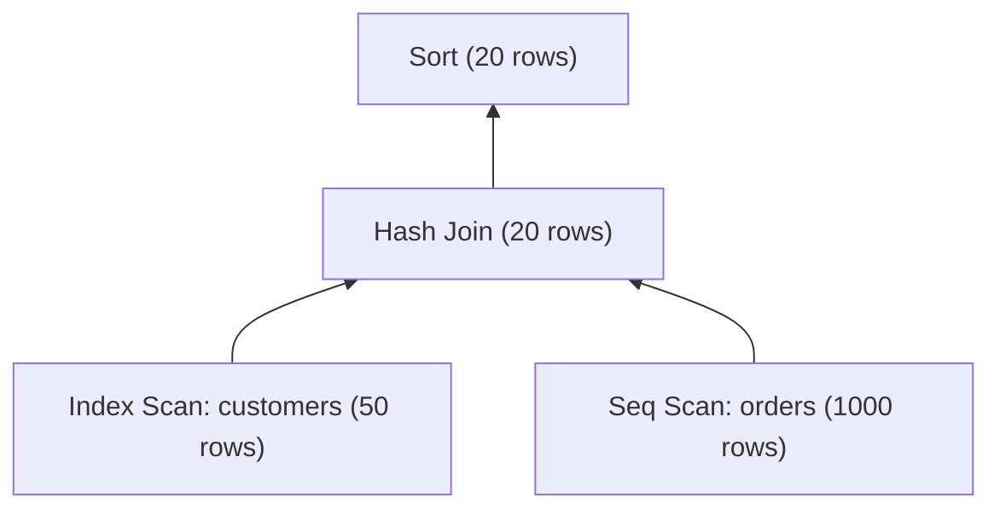

---

### 🛠️ Worked Example

**BAD:**

```sql
-- Guessing at performance without EXPLAIN
CREATE INDEX idx_orders_date ON orders(placed_at);
-- Did not check if the planner uses it
SELECT * FROM orders WHERE placed_at > '2024-01-01';
-- Still slow? No way to know why without EXPLAIN
```

Why it's wrong: creating indexes blindly without
verifying the planner's behavior is guesswork.

**GOOD:**

```sql
EXPLAIN ANALYZE
SELECT * FROM orders
WHERE customer_id = 42;

-- Output shows:
-- Index Scan using idx_orders_cust_id
--   on orders (actual time=0.02..0.05
--   rows=12 loops=1)
-- Confirms the index is used, fast
```

Why it's right: EXPLAIN ANALYZE confirms the index is
being used and shows actual execution time.

**Production pattern - identifying a missing index:**

```sql
EXPLAIN ANALYZE
SELECT * FROM orders
WHERE status = 'pending'
AND placed_at > '2024-01-01';
-- Output: Seq Scan on orders
--   Filter: status = 'pending' AND ...
--   Rows Removed by Filter: 999,800
-- Seq Scan + high rows removed = missing index
-- Fix: CREATE INDEX idx_orders_status_date
--   ON orders (status, placed_at);
```

---

### ⚖️ Trade-offs

**Gain:** Visibility into planner decisions, proof that indexes are used, identification of bottleneck nodes, data-driven optimization.

**Cost:** EXPLAIN ANALYZE actually executes the query (including side effects for INSERT/UPDATE/DELETE - wrap in a transaction and ROLLBACK). Estimated costs in plain EXPLAIN can differ from reality.

| Aspect          | EXPLAIN | EXPLAIN ANALYZE  |
| --------------- | ------- | ---------------- |
| Executes query  | No      | Yes              |
| Shows estimates | Yes     | Yes + actuals    |
| Side effects    | None    | Real changes     |
| Use for writes  | Safe    | Wrap in ROLLBACK |

---

### ⚡ Decision Snap

**USE WHEN:**

- A query is slow and you need to find out why
- You created an index and want to verify it is being used
- Before and after optimization to measure improvement

**AVOID WHEN:**

- The query modifies data and you do not wrap EXPLAIN ANALYZE in a transaction
- You are checking trivial queries on tiny tables (overhead not worth it)

**PREFER EXPLAIN (ANALYZE, BUFFERS) WHEN:**

- You want to see I/O details (shared blocks hit vs read)
- You need to distinguish between CPU-bound and I/O-bound bottlenecks

---

### ⚠️ Top Traps

| #   | Misconception                                  | Reality                                                                                                     |
| --- | ---------------------------------------------- | ----------------------------------------------------------------------------------------------------------- |
| 1   | EXPLAIN shows which query is faster            | EXPLAIN shows the plan for one query; to compare, run EXPLAIN ANALYZE on both and compare actual times      |
| 2   | If EXPLAIN says "Index Scan" the query is fast | An Index Scan on a low-selectivity column may read most of the table via random I/O, slower than a Seq Scan |
| 3   | EXPLAIN ANALYZE is safe for all queries        | It executes the query - an EXPLAIN ANALYZE on a DELETE will delete rows unless wrapped in BEGIN/ROLLBACK    |

---

### 🪜 Learning Ladder

**Prerequisites:**

- SQL-040 Indexes - What They Are and Why They Matter - you must understand indexes to interpret plan nodes
- SQL-026 INNER JOIN - Matching Rows Across Tables - join nodes appear in multi-table plans

**THIS:** SQL-042 EXPLAIN - Reading Your First Query Plan

**Next steps:**

- SQL-060 Execution Plans Deep Dive - EXPLAIN ANALYZE - advanced plan reading
- SQL-064 Query Performance Tuning Patterns - applying what EXPLAIN reveals

---

### 💡 The Surprising Truth

The estimated row counts in EXPLAIN are frequently wrong - sometimes by orders of magnitude. The planner relies on table statistics (pg_statistic), which are samples, not exact counts. If statistics are stale (no recent ANALYZE), the planner may estimate 100 rows when the actual count is 100,000, leading it to choose a nested loop join instead of a hash join. Running `ANALYZE tablename` to update statistics is often the single most effective performance fix.

---

### 📇 Revision Card

1. EXPLAIN shows the plan; EXPLAIN ANALYZE shows the plan with actual execution times - always use ANALYZE for real performance work.
2. Read the plan bottom-up: leaf nodes (scans) feed into join nodes, then into sort/aggregate nodes.
3. "Rows Removed by Filter" in a Seq Scan = strong signal for a missing index.

---

---

# SQL-043 Index on Every Column Anti-Pattern

**TL;DR** - Indexing every column wastes disk space, slows writes, and gives the planner too many bad choices.

---

### 🔥 The Problem in One Paragraph

A well-meaning developer reads "indexes make queries fast" and concludes "more indexes = more fast." They create an index on every column of a 20-column orders table. Now every INSERT updates 20 index structures. Bulk imports crawl. Disk usage doubles. The query planner, overwhelmed with 20 candidate indexes for every query, sometimes picks the wrong one. Write throughput drops. The cure has become worse than the disease. This is exactly why index-on-every-column is an anti-pattern.

---

### 📘 Textbook Definition

The **index-on-every-column anti-pattern** is the practice of creating a separate index on every column (or nearly every column) of a table. While each index individually has a valid purpose, the aggregate cost in write amplification, disk space, memory pressure, and planner confusion exceeds the read benefit for most workloads.

---

### 🧠 Mental Model

> Imagine a book where every word has its own index at the back. The index section becomes larger than the book itself. Adding a new page requires updating thousands of index entries. Looking something up becomes paradoxically harder because you must choose which of 10,000 index categories to consult. Fewer, well-chosen indexes are better than exhaustive ones.

- "Every word indexed" -> index on every column
- "Index larger than book" -> index overhead exceeding data
- "Too many categories" -> planner confusion

**Where this analogy breaks down:** The query planner can combine multiple indexes via bitmap scans, but each additional index still costs write amplification.

---

### ⚙️ How It Works

1. Each index on a table is a separate data structure
   that must be updated on every INSERT, UPDATE, and
   DELETE affecting that column.
2. Write amplification: N indexes means each write
   does N+1 operations (1 table + N index updates).
3. Disk space: each index stores the indexed column(s)
   plus row pointers. Twenty indexes can easily exceed
   the table's own size.
4. Planner confusion: with many candidate indexes, the
   planner must evaluate more access paths, and
   cost-based estimation errors become more likely.
5. Vacuum overhead: PostgreSQL's VACUUM must also
   clean dead index entries in every index.

```
Table: orders (20 columns)
+----------+---------+-------+---+
| id (PK)  | cust_id | total |...|
+----------+---------+-------+---+

20 separate indexes:
  idx_id, idx_cust_id, idx_total, ...

INSERT 1 row =
  1 table write + 20 index writes = 21 I/O ops

Disk: table = 500MB
      indexes = 20 x ~100MB = 2GB
      Total = 2.5GB (5x the data)
```

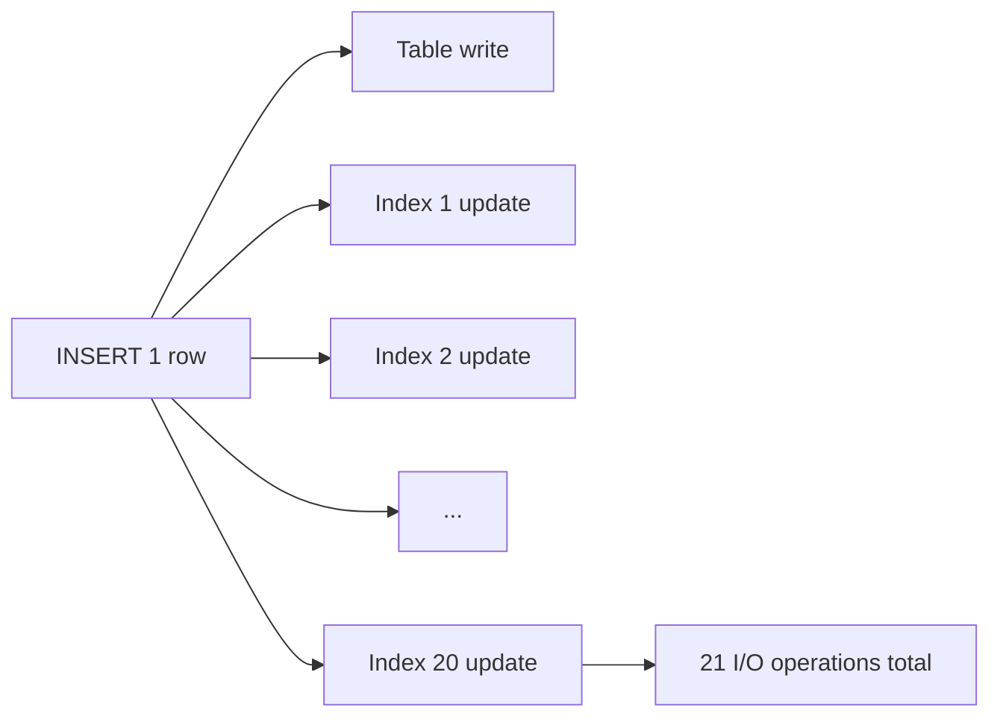

---

### 🛠️ Worked Example

**BAD:**

```sql
-- Index on every column
CREATE INDEX idx_1 ON orders (id);      -- PK already indexed!
CREATE INDEX idx_2 ON orders (cust_id);
CREATE INDEX idx_3 ON orders (total);
CREATE INDEX idx_4 ON orders (status);
CREATE INDEX idx_5 ON orders (placed_at);
CREATE INDEX idx_6 ON orders (shipped);
CREATE INDEX idx_7 ON orders (notes);   -- TEXT, rarely filtered
-- ... 13 more indexes
-- Bulk import of 1M rows: 45 minutes
```

Why it's wrong: redundant PK index, index on
rarely-queried columns, massive write overhead.

**GOOD:**

```sql
-- Only index columns that appear in
-- WHERE, JOIN, or ORDER BY of real queries
-- PK is auto-indexed, skip it
CREATE INDEX idx_orders_cust
    ON orders (customer_id);
CREATE INDEX idx_orders_status_date
    ON orders (status, placed_at);
-- 2 targeted indexes cover the main queries
-- Bulk import of 1M rows: 3 minutes
```

Why it's right: indexes match actual query patterns.
Fewer indexes mean faster writes and less disk usage.

**Production pattern - finding unused indexes:**

```sql
-- PostgreSQL: find indexes with zero scans
SELECT indexrelname, idx_scan
FROM pg_stat_user_indexes
WHERE idx_scan = 0
AND indexrelname NOT LIKE '%_pkey'
ORDER BY pg_relation_size(indexrelid) DESC;
-- Drop unused indexes to reclaim space
-- and reduce write overhead
```

---

### ⚖️ Trade-offs

**Gain (of removing excess indexes):** Faster writes, less disk usage, lower VACUUM overhead, simpler planner decisions.

**Cost (of fewer indexes):** Some queries without a matching index will use Seq Scan. The trade-off is worth it when those queries are rare or the table is small.

| Aspect        | Minimal indexes  | Index-every-column   |
| ------------- | ---------------- | -------------------- |
| Write speed   | Fast             | Slow (N+1 writes)    |
| Disk usage    | Low              | High (often > table) |
| Read coverage | Targeted queries | All queries          |
| Maintenance   | Low              | High (VACUUM cost)   |

---

### ⚡ Decision Snap

**USE WHEN (creating an index):**

- A specific query is slow and EXPLAIN shows Seq Scan on a large table
- The column is frequently used in WHERE, JOIN ON, or ORDER BY
- The column has reasonable selectivity (not a boolean split 50/50)

**AVOID WHEN:**

- The column is rarely filtered or joined
- The table has heavy write traffic and the read benefit is marginal
- An existing composite index already covers the column

**PREFER Composite Index WHEN:**

- Queries filter on multiple columns together (e.g., status + date)
- One composite index replaces two or more single-column indexes

---

### ⚠️ Top Traps

| #   | Misconception                           | Reality                                                                                                                                |
| --- | --------------------------------------- | -------------------------------------------------------------------------------------------------------------------------------------- |
| 1   | More indexes cannot hurt                | Every index slows writes, uses disk, and adds VACUUM overhead; unused indexes are pure cost                                            |
| 2   | The planner always picks the best index | With many indexes, cost estimates can lead the planner to suboptimal choices - fewer, better indexes reduce this risk                  |
| 3   | Dropping an unused index is risky       | Use pg_stat_user_indexes to verify idx_scan = 0 over a representative period before dropping; the risk is low for truly unused indexes |

---

### 🪜 Learning Ladder

**Prerequisites:**

- SQL-040 Indexes - What They Are and Why They Matter - understand what indexes cost
- SQL-042 EXPLAIN - Reading Your First Query Plan - verify which indexes are actually used

**THIS:** SQL-043 Index on Every Column Anti-Pattern

**Next steps:**

- SQL-062 Composite Indexes and Column Order - strategic multi-column indexes
- SQL-063 Covering Indexes (Index-Only Scans) - indexes that eliminate table access entirely

---

### 💡 The Surprising Truth

In PostgreSQL, every unnecessary index makes VACUUM slower. VACUUM must clean dead tuples from every index on the table, not just the table itself. On write-heavy tables with many indexes, VACUUM can become the biggest performance bottleneck - not the queries themselves. Dropping unused indexes often improves overall system throughput more than adding new ones.

---

### 📇 Revision Card

1. Each index costs: one extra write per row change, disk space, VACUUM time, and planner complexity.
2. Index only columns that appear in WHERE, JOIN, or ORDER BY of real, measured query patterns.
3. Use pg_stat_user_indexes to find and drop indexes with idx_scan = 0 - unused indexes are pure overhead.

---

---

# SQL-044 CASE Expressions and Conditional Logic

**TL;DR** - CASE applies if-then-else logic inside SQL queries, returning different values based on conditions per row.

---

### 🔥 The Problem in One Paragraph

You need to display order status as human-readable text: "pending" becomes "Awaiting Payment," "shipped" becomes "On Its Way," and anything else becomes "Unknown." You could fetch all rows into your application and use an if-else chain, but that means transferring every row over the network and processing in application code what the database can do natively. You need conditional logic inside SQL itself - a way to say "if this condition, return that value" directly in a SELECT, WHERE, or ORDER BY clause. This is exactly why CASE expressions were created.

---

### 📘 Textbook Definition

A **CASE expression** is SQL's built-in conditional logic construct. The **simple CASE** compares one expression to a list of values. The **searched CASE** evaluates independent Boolean conditions in order, returning the value for the first condition that is true. If no condition matches, ELSE provides a default (or NULL if ELSE is omitted). CASE can appear anywhere a scalar expression is valid: SELECT, WHERE, ORDER BY, GROUP BY, and even inside aggregate functions.

---

### 🧠 Mental Model

> CASE is a switchboard operator routing calls. Each WHEN is a label on the switchboard: if the incoming signal matches, the operator connects to that output. The first matching WHEN wins. ELSE is the fallback socket for unrecognized signals.

- "Incoming signal" -> the expression being evaluated
- "WHEN labels" -> conditions checked in order
- "First match wins" -> short-circuit evaluation
- "ELSE fallback" -> default when nothing matches

**Where this analogy breaks down:** CASE is an expression, not a control flow statement - it returns a value, not a branch of execution. You cannot use it to execute different SQL statements.

---

### ⚙️ How It Works

1. **Simple CASE:** Evaluates one expression, compares
   it to each WHEN value in order.
2. **Searched CASE:** Evaluates each WHEN condition
   (any Boolean expression) in order.
3. Returns the THEN value for the first matching WHEN.
4. If no WHEN matches, returns the ELSE value. If ELSE
   is omitted, returns NULL.
5. CASE is evaluated per row, producing a value for
   each row independently.

```
Simple CASE:
  CASE status
    WHEN 'pending'  THEN 'Awaiting Payment'
    WHEN 'shipped'  THEN 'On Its Way'
    ELSE 'Unknown'
  END

Searched CASE:
  CASE
    WHEN total > 1000 THEN 'VIP'
    WHEN total > 100  THEN 'Standard'
    ELSE 'Small'
  END

Evaluation order matters:
  total = 1500
  1. total > 1000? YES -> return 'VIP'
  2. total > 100?  (never reached)
```

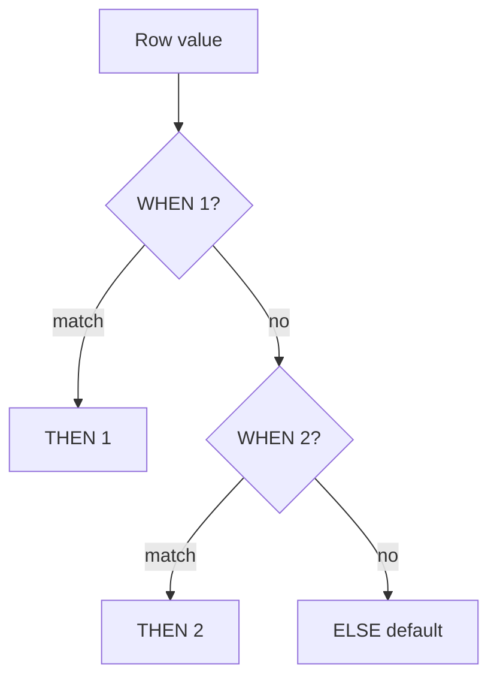

---

### 🛠️ Worked Example

**BAD:**

```sql
-- Multiple queries for each status category
SELECT COUNT(*) FROM orders
    WHERE status = 'pending';
SELECT COUNT(*) FROM orders
    WHERE status = 'shipped';
SELECT COUNT(*) FROM orders
    WHERE status = 'delivered';
-- 3 round-trips, 3 full scans
```

Why it's wrong: three queries scanning the same table
when a single query with CASE can produce all counts.

**GOOD:**

```sql
-- Single query with conditional aggregation
SELECT
    COUNT(*) FILTER (
        WHERE status = 'pending'
    ) AS pending,
    COUNT(*) FILTER (
        WHERE status = 'shipped'
    ) AS shipped,
    COUNT(*) FILTER (
        WHERE status = 'delivered'
    ) AS delivered
FROM orders;
-- Or with CASE for non-PostgreSQL:
SELECT
    SUM(CASE WHEN status = 'pending'
        THEN 1 ELSE 0 END) AS pending,
    SUM(CASE WHEN status = 'shipped'
        THEN 1 ELSE 0 END) AS shipped
FROM orders;
```

Why it's right: one scan, one query, all counts
computed simultaneously.

**Production pattern - conditional ORDER BY:**

```sql
-- Priority ordering: urgent first, then by date
SELECT id, status, placed_at
FROM orders
ORDER BY
    CASE status
        WHEN 'urgent' THEN 0
        WHEN 'pending' THEN 1
        ELSE 2
    END,
    placed_at ASC;
```

---

### ⚖️ Trade-offs

**Gain:** Eliminates multiple queries or application-side branching. Keeps logic close to the data. Works in SELECT, WHERE, ORDER BY, and inside aggregates.

**Cost:** Complex CASE expressions reduce query readability. CASE in WHERE can prevent index usage (the planner cannot index a computed expression without a functional index).

| Aspect      | CASE in SQL       | App-side if/else       |
| ----------- | ----------------- | ---------------------- |
| Round trips | 1 query           | Multiple or post-fetch |
| Index usage | May block indexes | N/A                    |
| Readability | Can get complex   | Familiar syntax        |
| Performance | Single scan       | Extra transfer         |

---

### ⚡ Decision Snap

**USE WHEN:**

- You need to transform values (status codes to labels) in the result set
- Conditional aggregation avoids multiple queries (SUM with CASE)
- Custom sort order requires conditional logic

**AVOID WHEN:**

- The conditional logic is complex enough to warrant a separate lookup table (normalize instead)
- CASE in WHERE is preventing index usage (refactor the predicate)

**PREFER Lookup Table WHEN:**

- The mappings change frequently and should not be hardcoded in SQL
- Multiple queries need the same status-to-label translations

---

### ⚠️ Top Traps

| #   | Misconception                                   | Reality                                                                                                            |
| --- | ----------------------------------------------- | ------------------------------------------------------------------------------------------------------------------ |
| 1   | CASE evaluates all WHEN branches                | It short-circuits: the first matching WHEN wins and remaining branches are skipped                                 |
| 2   | Omitting ELSE is harmless                       | Without ELSE, non-matching rows get NULL, which can silently break downstream logic                                |
| 3   | CASE can replace IF statements for control flow | CASE is an expression returning a value, not a control flow statement - it cannot execute different SQL statements |

---

### 🪜 Learning Ladder

**Prerequisites:**

- SQL-012 SELECT and FROM - Reading Data - CASE goes in the SELECT clause
- SQL-013 WHERE - Filtering Rows - CASE can appear in WHERE conditions

**THIS:** SQL-044 CASE Expressions and Conditional Logic

**Next steps:**

- SQL-031 Aggregate Functions - COUNT, SUM, AVG, MIN, MAX - CASE inside SUM for conditional aggregation
- SQL-055 Window Functions - ROW_NUMBER, RANK, DENSE_RANK - CASE in PARTITION BY for conditional windowing

---

### 💡 The Surprising Truth

CASE inside an aggregate function (SUM, COUNT) is the poor man's PIVOT. `SUM(CASE WHEN status='shipped' THEN 1 ELSE 0 END) AS shipped` turns rows into columns - a cross-tab report in a single query. This pattern was standard practice before databases added explicit PIVOT syntax, and it remains the most portable approach across all SQL dialects.

---

### 📇 Revision Card

1. CASE is an expression (returns a value), not a statement (does not branch execution) - it goes anywhere a scalar value can.
2. First WHEN match wins, remaining branches skipped - order your conditions from most specific to least.
3. Always include ELSE - omitting it silently returns NULL for unmatched rows.

---

---

# SQL-045 String Functions and Pattern Matching (LIKE)

**TL;DR** - String functions transform text in queries; LIKE and ILIKE match patterns using wildcards % and \_.

---

### 🔥 The Problem in One Paragraph

Your users table stores names in mixed case: "alice," "ALICE," "Alice." You need to search case-insensitively, extract domain names from email addresses, and clean up trailing whitespace that crept in from a CSV import. Without string functions, you would export all data to Python, clean it there, and reimport - a slow round-trip that does not help ad-hoc queries. You need the database to search, transform, and clean text data directly inside SQL. This is exactly why string functions and LIKE were created.

---

### 📘 Textbook Definition

**String functions** are built-in SQL functions that operate on text values: LENGTH, UPPER, LOWER, TRIM, SUBSTRING, REPLACE, CONCAT, and others. **LIKE** is a pattern matching operator using `%` (any sequence of characters) and `_` (any single character). **ILIKE** (PostgreSQL) performs case-insensitive matching. **SIMILAR TO** and `~` provide regex-based matching in PostgreSQL. String functions can appear in SELECT, WHERE, ORDER BY, and other clauses.

---

### 🧠 Mental Model

> String functions are a text editor embedded in SQL. UPPER/LOWER change case. TRIM removes margins. SUBSTRING cuts a section. REPLACE does find-and-replace. LIKE is the search bar with wildcards: `%` means "anything" and `_` means "one character."

- "Text editor" -> string functions
- "Search bar" -> LIKE pattern matching
- "`%`" -> wildcard for any number of characters
- "`_`" -> wildcard for exactly one character

**Where this analogy breaks down:** LIKE pattern matching is not full regex - for complex patterns you need `~` (PostgreSQL) or REGEXP (MySQL).

---

### ⚙️ How It Works

1. String functions execute per row, transforming or
   inspecting the text value in that column.
2. LIKE evaluates the pattern against the column value:
   `%` matches zero or more characters, `_` matches
   exactly one.
3. ILIKE (PostgreSQL) is case-insensitive LIKE.
4. Functions like LOWER() or UPPER() normalize case
   before comparison, enabling case-insensitive
   equality.
5. LIKE 'prefix%' can use a B-tree index (the planner
   converts it to a range scan). LIKE '%suffix' cannot
   (leading wildcard forces full scan).

```
LIKE patterns:
  'Al%'   matches 'Alice', 'Albert', 'Al'
  '%son'  matches 'Johnson', 'Mason'
  '_ob'   matches 'Bob', 'Rob' (exactly 3 chars)
  '%at%'  matches 'cat', 'batch', 'Saturday'

Common string functions:
  LENGTH('hello')           -> 5
  UPPER('hello')            -> 'HELLO'
  LOWER('HELLO')            -> 'hello'
  TRIM('  hi  ')            -> 'hi'
  SUBSTRING('hello' FROM 2 FOR 3) -> 'ell'
  REPLACE('foo', 'o', 'a')  -> 'faa'
  CONCAT('a', 'b', 'c')     -> 'abc'
```

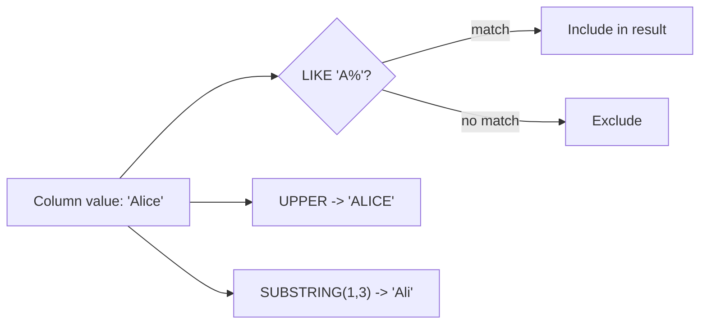

---

### 🛠️ Worked Example

**BAD:**

```sql
-- Case-sensitive search misses variations
SELECT * FROM users WHERE name = 'alice';
-- Misses 'Alice', 'ALICE', 'aLiCe'
-- Also: LIKE '%alice%' cannot use index
-- and scans every row
```

Why it's wrong: no case normalization, and a
leading-wildcard LIKE forces a full table scan.

**GOOD:**

```sql
-- Case-insensitive search with index support
SELECT * FROM users
WHERE LOWER(name) = LOWER('Alice');

-- Or PostgreSQL ILIKE with prefix:
SELECT * FROM users
WHERE name ILIKE 'ali%';

-- With functional index for speed:
CREATE INDEX idx_users_name_lower
    ON users (LOWER(name));
```

Why it's right: normalizes case, uses a functional
index for efficient lookups.

**Production pattern - extracting email domain:**

```sql
-- Extract domain from email addresses
SELECT
    email,
    SUBSTRING(email FROM '@(.+)$') AS domain
FROM users
ORDER BY domain;
-- PostgreSQL regex substring extraction
```

---

### ⚖️ Trade-offs

**Gain:** Text processing at the data source eliminates round-trips. LIKE with prefix patterns uses indexes. String functions enable data cleaning directly in SQL.

**Cost:** Functions in WHERE (e.g., LOWER(name)) prevent index usage unless you create a functional index. Leading-wildcard LIKE ('%term') always forces full scans. Complex text processing is better suited to application code.

| Aspect        | LIKE             | Regex (~)              | Full-text search |
| ------------- | ---------------- | ---------------------- | ---------------- |
| Complexity    | Simple wildcards | Full patterns          | Natural language |
| Index support | Prefix only      | pg_trgm extension      | GIN/tsvector     |
| Performance   | Fast for prefix  | Slow without extension | Fast with GIN    |

---

### ⚡ Decision Snap

**USE WHEN:**

- Pattern matching needs are simple (starts with, ends with, contains)
- Data cleaning can be done per-row with UPPER, TRIM, REPLACE
- Prefix LIKE can leverage B-tree indexes

**AVOID WHEN:**

- You need fuzzy matching or relevance ranking (use full-text search)
- The pattern requires complex regex and performance matters (use pg_trgm)

**PREFER Full-Text Search WHEN:**

- Users expect Google-style search with ranking
- The text column is large (articles, descriptions) and you need stemming

---

### ⚠️ Top Traps

| #   | Misconception                                | Reality                                                                                                                          |
| --- | -------------------------------------------- | -------------------------------------------------------------------------------------------------------------------------------- |
| 1   | LIKE '%term%' uses an index                  | Leading wildcard prevents B-tree usage; only 'prefix%' can use a B-tree index                                                    |
| 2   | UPPER(name) = 'ALICE' uses the index on name | Functions on columns bypass regular indexes; you need a functional index on UPPER(name)                                          |
| 3   | LIKE and = handle NULLs the same way         | Both return NULL (not false) when the column is NULL, but developers often forget that NULL LIKE '%anything%' is NULL, not false |

---

### 🪜 Learning Ladder

**Prerequisites:**

- SQL-013 WHERE - Filtering Rows - LIKE goes in WHERE clauses
- SQL-009 Data Types - Integers, Text, Dates, Booleans - string functions operate on TEXT/VARCHAR types

**THIS:** SQL-045 String Functions and Pattern Matching (LIKE)

**Next steps:**

- SQL-046 Date and Time Functions - similar function family for temporal data
- SQL-065 Implicit Conversions Kill Your Indexes - type mismatches affect string index usage

---

### 💡 The Surprising Truth

PostgreSQL's `text_pattern_ops` operator class lets a standard B-tree index support LIKE with prefix patterns even in non-C locales. Without it, `LIKE 'prefix%'` may not use the index if the database locale uses non-default collation rules. `CREATE INDEX idx ON tbl (col text_pattern_ops)` explicitly enables prefix pattern matching regardless of locale settings - a detail most developers never encounter until LIKE stops using their index in production.

---

### 📇 Revision Card

1. `%` matches any characters, `_` matches exactly one - LIKE 'prefix%' uses B-tree indexes, '%suffix' does not.
2. Functions on columns (LOWER, UPPER) bypass regular indexes - create a functional index to restore performance.
3. For anything beyond simple wildcards (fuzzy matching, ranking, stemming), switch to full-text search.

---

---

# SQL-046 Date and Time Functions

**TL;DR** - Date functions extract, format, and calculate temporal values; timezone handling is the hidden complexity.

---

### 🔥 The Problem in One Paragraph

You need a report of monthly revenue for the last quarter. Your orders have timestamps, but grouping by raw timestamp gives one group per microsecond - useless. You need to truncate timestamps to the month level. Then the CEO asks: "Show me orders placed on weekends." You need to extract the day of week from a timestamp. Then a customer in Tokyo reports that their order timestamp is wrong because the server stores UTC and the dashboard shows local time without converting. Date and time handling is full of these hidden traps. This is exactly why date and time functions were created.

---

### 📘 Textbook Definition

**Date and time functions** are built-in SQL functions that create, extract, transform, and calculate temporal values. Key functions include **DATE_TRUNC** (truncate to a precision like month or day), **EXTRACT** (pull out year, month, day, hour, etc.), **AGE** (difference between timestamps), **NOW/CURRENT_TIMESTAMP** (current time), and **interval arithmetic** (add/subtract time periods). PostgreSQL distinguishes between **TIMESTAMP** (no timezone) and **TIMESTAMPTZ** (with timezone) - a critical distinction for correct temporal data.

---

### 🧠 Mental Model

> Date functions are a Swiss Army knife for calendars. DATE_TRUNC snaps a date to the nearest month/day/hour boundary. EXTRACT pulls out a single component (year, month). Interval arithmetic moves forward or backward in time. The hidden blade is timezone conversion - it changes the meaning of every other operation.

- "Snapping to boundary" -> DATE_TRUNC
- "Pulling out a component" -> EXTRACT
- "Moving in time" -> interval arithmetic
- "Hidden blade" -> timezone handling

**Where this analogy breaks down:** Time zones, daylight saving transitions, and leap seconds add complexity that no simple analogy captures. The "hidden blade" can cut you.

---

### ⚙️ How It Works

1. **DATE_TRUNC('month', ts):** Zeros out everything
   below the specified precision. '2024-03-15 14:30'
   becomes '2024-03-01 00:00'.
2. **EXTRACT(DOW FROM ts):** Returns a component as a
   number. DOW = day of week (0=Sunday in PostgreSQL).
3. **Interval arithmetic:** ts + INTERVAL '3 months'
   adds time. AGE(ts1, ts2) returns the difference.
4. **AT TIME ZONE:** Converts TIMESTAMPTZ to a specific
   timezone for display.
5. **CURRENT_TIMESTAMP:** Returns the transaction start
   time (not the statement execution time).

```
Timestamp: 2024-03-15 14:30:00+00

DATE_TRUNC('month', ts)
  -> 2024-03-01 00:00:00+00

EXTRACT(MONTH FROM ts)
  -> 3

EXTRACT(DOW FROM ts)
  -> 5 (Friday)

ts + INTERVAL '7 days'
  -> 2024-03-22 14:30:00+00

ts AT TIME ZONE 'Asia/Tokyo'
  -> 2024-03-15 23:30:00
```

```mermaid
flowchart LR
  TS["2024-03-15 14:30:00+00"]
  TS --> DT["DATE_TRUNC month -> 2024-03-01"]
  TS --> EX["EXTRACT month -> 3"]
  TS --> INT["+ 7 days -> 2024-03-22"]
  TS --> TZ["AT TIME ZONE Tokyo -> 23:30"]
```

---

### 🛠️ Worked Example

**BAD:**

```sql
-- String manipulation for date filtering
SELECT * FROM orders
WHERE CAST(placed_at AS TEXT) LIKE '2024-03%';
-- Cannot use index, wrong semantics,
-- breaks across timezones
```

Why it's wrong: casting to text for date filtering is
slow (no index), fragile, and timezone-ignorant.

**GOOD:**

```sql
-- Proper range filter (index-friendly)
SELECT * FROM orders
WHERE placed_at >= '2024-03-01'
  AND placed_at < '2024-04-01';

-- Monthly revenue report
SELECT
    DATE_TRUNC('month', placed_at) AS month,
    SUM(total) AS revenue
FROM orders
WHERE placed_at >= '2024-01-01'
GROUP BY DATE_TRUNC('month', placed_at)
ORDER BY month;
```

Why it's right: range predicates use B-tree indexes.
DATE_TRUNC groups by month cleanly.

**Production pattern - timezone-safe reporting:**

```sql
-- Convert UTC to user timezone for display
SELECT
    id,
    placed_at AT TIME ZONE 'America/New_York'
        AS local_time
FROM orders
WHERE placed_at >= NOW() - INTERVAL '24 hours';
```

---

### ⚖️ Trade-offs

**Gain:** Temporal calculations at the database level avoid transferring raw timestamps to the application. DATE_TRUNC enables clean time-series grouping. Range predicates on timestamps use indexes.

**Cost:** Timezone handling adds complexity. Functions on timestamp columns (DATE_TRUNC in WHERE) prevent index usage unless you use range predicates. Daylight saving transitions create ambiguous or skipped hours.

| Aspect          | TIMESTAMP          | TIMESTAMPTZ            |
| --------------- | ------------------ | ---------------------- |
| Stores timezone | No                 | Yes (as UTC)           |
| AT TIME ZONE    | Adds timezone      | Converts timezone      |
| Use case        | Events in known TZ | Multi-timezone systems |
| Recommendation  | Rarely preferred   | Default choice         |

---

### ⚡ Decision Snap

**USE WHEN:**

- Reports need time-series grouping (daily, monthly, quarterly)
- You need to filter by date ranges efficiently
- Timezone conversion is required for multi-region users

**AVOID WHEN:**

- You only need the date component (use DATE type, not TIMESTAMP)
- Complex calendar logic (business days, holidays) is needed (handle in application code)

**PREFER TIMESTAMPTZ WHEN:**

- Your application serves users in multiple timezones
- You need unambiguous absolute points in time (almost always)

---

### ⚠️ Top Traps

| #   | Misconception                                    | Reality                                                                                                              |
| --- | ------------------------------------------------ | -------------------------------------------------------------------------------------------------------------------- |
| 1   | TIMESTAMP and TIMESTAMPTZ store data differently | PostgreSQL stores both as UTC microseconds internally; TIMESTAMPTZ just converts on input/output, TIMESTAMP does not |
| 2   | NOW() returns the current clock time             | NOW() returns the transaction start time; it is the same value for the entire transaction, not the statement time    |
| 3   | Adding months is straightforward                 | Adding 1 month to Jan 31 gives Feb 28 (or 29) - month arithmetic is not uniform and can surprise you                 |

---

### 🪜 Learning Ladder

**Prerequisites:**

- SQL-009 Data Types - Integers, Text, Dates, Booleans - understand temporal types
- SQL-032 GROUP BY and HAVING - DATE_TRUNC is used in GROUP BY for time-series

**THIS:** SQL-046 Date and Time Functions

**Next steps:**

- SQL-045 String Functions and Pattern Matching (LIKE) - complementary function family for text
- SQL-055 Window Functions - ROW_NUMBER, RANK, DENSE_RANK - time-series analysis with window frames

---

### 💡 The Surprising Truth

PostgreSQL's TIMESTAMPTZ does not store the timezone. It converts the input to UTC and stores only the UTC value. When you read it back, it converts from UTC to your session's timezone setting. This means two users in different timezones reading the same column see different display values - but the stored value is identical. Understanding this eliminates most timezone confusion: always store TIMESTAMPTZ, always display in the user's local timezone, and the database handles conversion automatically.

---

### 📇 Revision Card

1. Use range predicates (>= and <) for date filtering, not functions in WHERE - ranges use indexes.
2. Always use TIMESTAMPTZ for multi-timezone applications - it stores UTC and converts on display.
3. NOW() returns transaction start time, not wall clock time - it is constant within a transaction.

---

---

# SQL-047 Normalize-or-Denormalize Decision Guide

**TL;DR** - Choose normalization for write safety and evolving schemas; denormalize specific queries only after measuring the bottleneck.

---

### 🔥 The Problem in One Paragraph

A team debate erupts: "We should normalize everything for data integrity." The other side: "We should denormalize for performance - JOINs are expensive." Both sides are partially right, and both are dangerously wrong when applied as absolutes. Without a decision framework, teams either over-normalize (death by JOINs) or under-normalize (death by update anomalies). You need a systematic way to decide, per query and per table, when the write-safety of normalization outweighs the read-speed of denormalization. This is exactly why a decision guide was created.

---

### 📘 Textbook Definition

The **normalize-or-denormalize decision** is an engineering trade-off between write correctness (no redundant data, no update anomalies) and read performance (fewer JOINs, pre-computed aggregates). The decision is not global - it applies per table, per query pattern, and per workload profile. The standard approach is: normalize first, measure performance, then selectively denormalize specific bottlenecks with a maintenance strategy.

---

### 🧠 Mental Model

> Normalization is a clean filing system: one folder per fact. Denormalization is photocopying a popular document and pinning it on multiple bulletin boards. The decision is: how often is this document read (justifying copies) versus how often does it change (making copies dangerous)?

- "Read frequency" -> how many queries need this data (favors denormalization)
- "Write frequency" -> how often the source changes (favors normalization)
- "Photocopying cost" -> maintenance of redundant data

**Where this analogy breaks down:** The decision also depends on tolerance for stale data - some applications accept eventual consistency (denormalize aggressively), others require real-time accuracy (normalize strictly).

---

### ⚙️ How It Works

1. Start fully normalized (3NF). This is the default.
2. Identify slow read queries using EXPLAIN ANALYZE.
3. Determine if the bottleneck is JOINs or missing
   indexes. Fix indexes first - it is cheaper.
4. If JOINs remain the bottleneck, evaluate
   denormalization options: redundant column,
   materialized view, or summary table.
5. Choose the denormalization strategy with the lowest
   maintenance cost:
   - Materialized view (database-managed, refreshable)
   - Trigger-maintained column (automatic, per-write)
   - Application-maintained column (manual, error-prone)
6. Monitor for data drift between source and copy.

```
Decision flowchart:

  Is the query slow?
    NO  -> Keep normalized. Done.
    YES -> Is a missing index the cause?
      YES -> Add index. Done.
      NO  -> Is the JOIN the bottleneck?
        YES -> Denormalize with strategy:
               1. Materialized view (safest)
               2. Trigger-maintained column
               3. Application-maintained
        NO  -> Investigate other causes
```

```mermaid
flowchart TD
  Q["Query slow?"]
  Q -->|No| KEEP["Keep normalized"]
  Q -->|Yes| IDX{"Missing index?"}
  IDX -->|Yes| ADD["Add index"]
  IDX -->|No| JOIN{"JOIN bottleneck?"}
  JOIN -->|Yes| DEN["Denormalize"]
  JOIN -->|No| OTHER["Other optimization"]
  DEN --> MV["Materialized view"]
  DEN --> TR["Trigger column"]
  DEN --> AP["App-maintained"]
```

---

### 🛠️ Worked Example

**BAD:**

```sql
-- Premature denormalization without measurement
ALTER TABLE orders
    ADD COLUMN customer_name TEXT;
-- Copied from customers table "for speed"
-- No trigger, no refresh, no monitoring
-- customer_name goes stale silently
```

Why it's wrong: denormalized without proving the JOIN
is the bottleneck, and without a maintenance strategy.

**GOOD:**

```sql
-- Step 1: Measure the actual bottleneck
EXPLAIN ANALYZE
SELECT o.id, c.name, o.total
FROM orders o
JOIN customers c ON c.id = o.customer_id
WHERE o.placed_at >= '2024-01-01';
-- Result: Hash Join 15ms, Seq Scan orders 12ms
-- The JOIN itself is 3ms - not the bottleneck
-- Decision: keep normalized, fix index instead

-- Step 2: If JOIN IS the bottleneck on a hot path
CREATE MATERIALIZED VIEW order_summary AS
SELECT o.id, c.name, o.total, o.placed_at
FROM orders o
JOIN customers c ON c.id = o.customer_id;
-- Controlled denormalization with explicit refresh
```

Why it's right: measure first, denormalize only
the proven bottleneck, use managed strategy.

**Production pattern - decision criteria table:**

```
| Factor             | Normalize | Denormalize |
|--------------------|-----------|-------------|
| Write:read ratio   | > 1:10    | < 1:100     |
| Data volatility    | High      | Low         |
| Staleness tolerance| Zero      | Seconds/min |
| Schema evolution   | Frequent  | Rare        |
| Query complexity   | < 4 JOINs | > 6 JOINs   |
```

---

### ⚖️ Trade-offs

**Gain:** A structured decision process prevents both premature optimization and excessive purism. Each choice is justified by measurement.

**Cost:** The framework requires discipline - measuring before deciding, monitoring after denormalizing. Teams that skip measurement make the wrong choice in both directions.

| Aspect       | Always normalize | Always denormalize | Decision guide      |
| ------------ | ---------------- | ------------------ | ------------------- |
| Write safety | Guaranteed       | At risk            | Context-dependent   |
| Read speed   | JOIN cost        | Fast               | Optimized per query |
| Maintenance  | Low              | High               | Targeted            |

---

### ⚡ Decision Snap

**USE Normalization WHEN:**

- Data changes frequently and consistency is critical
- The schema is evolving and must remain flexible
- Query performance is acceptable with proper indexes

**USE Denormalization WHEN:**

- A specific query is proven slow via EXPLAIN ANALYZE
- The read:write ratio strongly favors reads
- A maintenance strategy (materialized view, trigger) is in place

**PREFER Materialized View WHEN:**

- You want denormalized reads with normalized writes
- Slight staleness (seconds to minutes) is acceptable

---

### ⚠️ Top Traps

| #   | Misconception                                        | Reality                                                                                                 |
| --- | ---------------------------------------------------- | ------------------------------------------------------------------------------------------------------- |
| 1   | "JOINs are slow" is a valid reason to denormalize    | JOINs on indexed columns are typically fast; measure before assuming the JOIN is the bottleneck         |
| 2   | Denormalization is a one-time task                   | It requires ongoing maintenance: triggers, refresh schedules, drift monitoring - the cost is continuous |
| 3   | You must choose one approach for the entire database | Normalize the core schema, denormalize specific hot-path queries - both coexist in production systems   |

---

### 🪜 Learning Ladder

**Prerequisites:**

- SQL-034 Normalization - 1NF, 2NF, 3NF - understand what you are preserving
- SQL-035 Denormalization - When and Why - understand what you are trading

**THIS:** SQL-047 Normalize-or-Denormalize Decision Guide

**Next steps:**

- SQL-042 EXPLAIN - Reading Your First Query Plan - the measurement step
- SQL-072 Materialized Views - the safest denormalization technique

---

### 💡 The Surprising Truth

Most "slow JOIN" complaints are actually caused by missing indexes on foreign key columns, not by the JOIN operation itself. Adding a B-tree index on the FK column typically reduces JOIN time from seconds to milliseconds, making denormalization unnecessary. The fix that takes 10 seconds (CREATE INDEX) should always be tried before the fix that takes a week (denormalization with maintenance infrastructure).

---

### 📇 Revision Card

1. Default to normalization. Denormalize only specific, measured bottlenecks with a maintenance strategy.
2. Before denormalizing, check for missing indexes on FK columns - this fixes most "slow JOIN" problems.
3. Materialized views are the safest denormalization: normalized source of truth, denormalized reads, explicit refresh.

---

---

# SQL-048 Online Store DB - Phase 2 (Joins and Reports)

**TL;DR** - Build reporting queries for the online store: multi-table JOINs, aggregations, and business metrics from Phase 1 schema.

---

### 🔥 The Problem in One Paragraph

In Phase 1 you built the online store schema: customers, products, orders, and order_items tables with proper keys and constraints. Now the business asks real questions. "What is total revenue per customer?" "Which products have never been ordered?" "Show me the top 5 customers by order count." "What is the average order value per month?" Each question requires combining data from multiple tables using JOINs and aggregations. These are the working-level queries every developer must write fluently. This is exactly why Phase 2 was created.

---

### 📘 Textbook Definition

**Phase 2** extends the online store project from schema design (CRUD) to multi-table querying. It exercises INNER JOIN, LEFT JOIN, aggregate functions (COUNT, SUM, AVG), GROUP BY with HAVING, subqueries, and conditional logic (CASE). The queries produce the kind of business reports that appear in real dashboards, API endpoints, and data exports.

---

### 🧠 Mental Model

> Phase 1 built the warehouse and stocked the shelves. Phase 2 is the first real inventory report: walking through the warehouse, cross-referencing purchase orders with stock on shelves, and producing a summary for the CEO. The schema is the structure; the queries are the questions.

- "Warehouse" -> the normalized schema from Phase 1
- "Walking through" -> multi-table JOINs
- "Summary for the CEO" -> aggregated reports

**Where this analogy breaks down:** Unlike a physical warehouse walk, SQL queries can answer questions across millions of rows in milliseconds.

---

### ⚙️ How It Works

1. Connect tables using INNER JOIN for related data
   (customers -> orders -> order_items -> products).
2. Use LEFT JOIN to find missing data (products with
   no orders, customers with no activity).
3. Aggregate with GROUP BY for summaries (revenue per
   customer, count per category).
4. Filter aggregated results with HAVING (customers
   with > 5 orders).
5. Use CASE for conditional reporting (status labels,
   tier classification).
6. Combine with ORDER BY and LIMIT for top-N reports.

```
Schema reminder (Phase 1):

customers          orders
+----+------+      +----+------+--------+
| id | name |      | id | c_id | placed |
+----+------+      +----+------+--------+
                        |
                   order_items
                   +----+------+------+-----+
                   | id | o_id | p_id | qty |
                   +----+------+------+-----+
                        |
                   products
                   +----+------+-------+
                   | id | name | price |
                   +----+------+-------+
```

```mermaid
erDiagram
  customers ||--o{ orders : places
  orders ||--|{ order_items : contains
  products ||--o{ order_items : "ordered as"
```

---

### 🛠️ Worked Example

**BAD:**

```python
# Application-side join and aggregation
customers = db.query("SELECT * FROM customers")
for c in customers:
    orders = db.query(
        f"SELECT * FROM orders "
        f"WHERE customer_id = {c['id']}"
    )
    total = sum(o['total'] for o in orders)
    print(f"{c['name']}: {total}")
# N+1 queries, no SQL injection protection
```

Why it's wrong: N+1 queries, no parameterization,
aggregation in Python instead of the database.

**GOOD:**

```sql
-- Revenue per customer (single query)
SELECT
    c.name,
    COUNT(DISTINCT o.id) AS orders,
    SUM(oi.qty * oi.unit_price) AS revenue
FROM customers c
INNER JOIN orders o
    ON o.customer_id = c.id
INNER JOIN order_items oi
    ON oi.order_id = o.id
GROUP BY c.id, c.name
HAVING SUM(oi.qty * oi.unit_price) > 100
ORDER BY revenue DESC
LIMIT 10;
```

Why it's right: single query, database-side
aggregation, parameterizable, indexable.

**Production pattern - finding products never ordered:**

```sql
-- Products with zero orders (LEFT JOIN + IS NULL)
SELECT p.id, p.name, p.price
FROM products p
LEFT JOIN order_items oi
    ON oi.product_id = p.id
WHERE oi.id IS NULL
ORDER BY p.name;

-- Monthly revenue trend
SELECT
    DATE_TRUNC('month', o.placed_at) AS month,
    SUM(oi.qty * oi.unit_price) AS revenue,
    COUNT(DISTINCT o.id) AS order_count
FROM orders o
INNER JOIN order_items oi
    ON oi.order_id = o.id
GROUP BY DATE_TRUNC('month', o.placed_at)
ORDER BY month;
```

---

### ⚖️ Trade-offs

**Gain:** Multi-table reports in single queries. Database-optimized aggregation. Queries are reusable for dashboards, APIs, and data exports.

**Cost:** Complex JOIN chains can be hard to debug. Incorrect JOIN conditions produce wrong aggregates silently (doubled counts from one-to-many). Always verify with small test data first.

| Aspect      | SQL reports            | App-side reports        |
| ----------- | ---------------------- | ----------------------- |
| Performance | Database-optimized     | Network + loop overhead |
| Correctness | Set-based, declarative | Procedural, error-prone |
| Reusability | Views, saved queries   | Code-dependent          |
| Debugging   | EXPLAIN ANALYZE        | Debugger + print        |

---

### ⚡ Decision Snap

**USE WHEN:**

- Business questions require data from multiple tables
- Dashboards need aggregated metrics (revenue, counts, averages)
- You need top-N, trend, or comparison reports

**AVOID WHEN:**

- The report requires complex business logic better expressed in application code
- Real-time streaming aggregation is needed (use a stream processor)

**PREFER Views WHEN:**

- The same multi-table query is used by multiple consumers
- You want to encapsulate complexity and present a simple interface

---

### ⚠️ Top Traps

| #   | Misconception                           | Reality                                                                                                                                       |
| --- | --------------------------------------- | --------------------------------------------------------------------------------------------------------------------------------------------- |
| 1   | COUNT(\*) after a JOIN counts customers | A one-to-many JOIN duplicates the parent row; use COUNT(DISTINCT o.id) to count orders, not duplicated customer rows                          |
| 2   | SUM is safe after any JOIN              | One-to-many JOINs multiply the parent's values; SUM of customer revenue is wrong if you JOIN through a one-to-many without grouping correctly |
| 3   | LEFT JOIN always shows all left rows    | Adding WHERE on a right-side column filters out NULL rows, converting the LEFT JOIN to INNER JOIN                                             |

---

### 🪜 Learning Ladder

**Prerequisites:**

- SQL-022 Online Store DB - Phase 1 (Schema and CRUD) - the schema this phase queries
- SQL-026 INNER JOIN - Matching Rows Across Tables - the primary join type used

**THIS:** SQL-048 Online Store DB - Phase 2 (Joins and Reports)

**Next steps:**

- SQL-081 Online Store DB - Phase 3 (Optimization) - indexes and performance tuning
- SQL-042 EXPLAIN - Reading Your First Query Plan - verify your Phase 2 queries are efficient

---

### 💡 The Surprising Truth

The most common bug in multi-table aggregation reports is not wrong JOINs - it is doubled aggregates from one-to-many multiplication. If a customer has 3 orders and each order has 5 items, joining customers -> orders -> order_items produces 15 rows per customer. SUM(order.total) now counts each order total 5 times (once per item). The fix: aggregate in a subquery or use DISTINCT.

---

### 📇 Revision Card

1. Multi-table reports need careful JOIN chains: always verify row counts at each join level to catch one-to-many multiplication.
2. LEFT JOIN + WHERE IS NULL = "find what is missing" - products never ordered, customers with no activity.
3. Use COUNT(DISTINCT) and aggregate in subqueries to avoid doubled counts from one-to-many JOINs.

---

---

# SQL-049 JOIN Practice Kata

**TL;DR** - Drill JOIN types through progressively harder exercises until pattern recognition becomes automatic.

---

### 🔥 The Problem in One Paragraph

You understand JOIN syntax, but when faced with a real query, you freeze: "Should this be INNER or LEFT? Do I need a self-join? Where does the ON condition go?" Reading about JOINs is like reading about swimming - you understand the theory but cannot do it under pressure. You need deliberate practice: a structured set of exercises that drill each JOIN type until selection and construction become instinctive. Interviews and production work demand fluency, not just understanding. This is exactly why a JOIN practice kata was created.

---

### 📘 Textbook Definition

A **kata** is a structured practice exercise borrowed from martial arts, applied here to SQL JOINs. Each kata targets a specific pattern (INNER JOIN, LEFT JOIN for missing data, self-join for hierarchies, multi-table chains) with increasing complexity. The goal is pattern recognition: given a business question, instantly identify the JOIN type and construct the query without hesitation.

---

### 🧠 Mental Model

> A kata is a drill sergeant's obstacle course. Each station is a different JOIN type. You run through the course repeatedly until your muscles (mental models) fire automatically. The goal is not to think about which JOIN to use - it is to know before you finish reading the question.

- "Obstacle course" -> structured exercise sequence
- "Stations" -> specific JOIN patterns
- "Muscle memory" -> instant pattern recognition

**Where this analogy breaks down:** Unlike physical exercises, SQL katas benefit from varying the schema and business domain to prevent over-fitting to one set of tables.

---

### ⚙️ How It Works

1. **Level 1:** Simple two-table INNER JOIN.
   "Show customers with their orders."
2. **Level 2:** LEFT JOIN for missing data.
   "Show all customers, including those with no orders."
3. **Level 3:** Multi-table chain.
   "Show order details with customer name and product
   name." (3-table JOIN)
4. **Level 4:** Self-join.
   "Show each employee and their manager's name."
5. **Level 5:** Combined patterns.
   "Revenue per customer per month, include customers
   with zero revenue, sorted by total descending."

```
Pattern recognition guide:

Question contains:    -> Use:
"show X with Y"      -> INNER JOIN
"all X, even without" -> LEFT JOIN
"from the same table" -> Self-join
"not in / missing"   -> LEFT JOIN + IS NULL
"every combination"  -> CROSS JOIN
"combine two lists"  -> UNION
```

```mermaid
flowchart TD
  Q["Business question"]
  Q --> HAS{"Both sides must exist?"}
  HAS -->|Yes| IJ["INNER JOIN"]
  HAS -->|No| WHICH{"Which side is optional?"}
  WHICH -->|Right| LJ["LEFT JOIN"]
  WHICH -->|Both| FOJ["FULL OUTER JOIN"]
  Q --> SAME{"Same table referenced twice?"}
  SAME -->|Yes| SJ["Self-join"]
```

---

### 🛠️ Worked Example

**BAD:**

```sql
-- Using subquery where JOIN is cleaner
SELECT * FROM customers
WHERE id IN (
    SELECT DISTINCT customer_id FROM orders
);
-- Works but harder to extend with more columns
-- from orders, and the planner may not
-- optimize as well
```

Why it's wrong: a JOIN is more readable and
extensible when you need columns from both tables.

**GOOD:**

```sql
-- Kata Level 3: three-table chain
-- "List each order with customer name and
--  product names"
SELECT
    c.name AS customer,
    o.id AS order_id,
    p.name AS product,
    oi.qty,
    oi.unit_price
FROM customers c
INNER JOIN orders o
    ON o.customer_id = c.id
INNER JOIN order_items oi
    ON oi.order_id = o.id
INNER JOIN products p
    ON p.id = oi.product_id
ORDER BY c.name, o.id;
```

Why it's right: clean chain from customer to product,
all columns accessible, readable with aliases.

**Production pattern - kata Level 5:**

```sql
-- Monthly revenue per customer, include zeros
SELECT
    c.name,
    DATE_TRUNC('month', o.placed_at) AS month,
    COALESCE(SUM(oi.qty * oi.unit_price), 0)
        AS revenue
FROM customers c
LEFT JOIN orders o
    ON o.customer_id = c.id
    AND o.placed_at >= '2024-01-01'
LEFT JOIN order_items oi
    ON oi.order_id = o.id
GROUP BY c.id, c.name,
    DATE_TRUNC('month', o.placed_at)
ORDER BY c.name, month;
```

---

### ⚖️ Trade-offs

**Gain:** Deliberate practice builds pattern recognition that transfers to interviews, code reviews, and production debugging. Kata exercises are reusable across different schemas.

**Cost:** Time investment. Exercises on toy schemas may not capture the complexity of production queries with 10+ tables and subqueries.

| Aspect                 | Kata practice         | Reading documentation |
| ---------------------- | --------------------- | --------------------- |
| Retention              | High (active recall)  | Low (passive)         |
| Pattern recognition    | Develops              | Does not develop      |
| Time investment        | 30-60 min per session | Varies                |
| Transfer to production | Direct                | Indirect              |

---

### ⚡ Decision Snap

**USE WHEN:**

- You are learning SQL and want to build fluency, not just understanding
- Preparing for SQL-heavy interviews
- Onboarding team members who know SQL syntax but lack pattern recognition

**AVOID WHEN:**

- You already write multi-table queries fluently in production
- The learning gap is in optimization, not in query construction

**PREFER Production Query Review WHEN:**

- You already have real queries to learn from
- The value is in understanding existing business logic, not synthetic exercises

---

### ⚠️ Top Traps

| #   | Misconception                               | Reality                                                                                                          |
| --- | ------------------------------------------- | ---------------------------------------------------------------------------------------------------------------- |
| 1   | Practicing on one schema is sufficient      | Vary the domain (e-commerce, HR, medical) to build transferable patterns, not schema-specific memory             |
| 2   | Getting the right answer means you are done | Time yourself - interview pressure requires producing correct queries in minutes, not hours                      |
| 3   | You should memorize JOIN syntax             | Memorize the patterns (when to use which type), not the syntax - syntax can be looked up, decision-making cannot |

---

### 🪜 Learning Ladder

**Prerequisites:**

- SQL-026 INNER JOIN - Matching Rows Across Tables - the first JOIN type to drill
- SQL-027 LEFT JOIN and RIGHT JOIN - the second most common pattern

**THIS:** SQL-049 JOIN Practice Kata

**Next steps:**

- SQL-048 Online Store DB - Phase 2 (Joins and Reports) - apply kata patterns to a project
- SQL-051 SQL Interview Essentials - Working Level - validate your fluency

---

### 💡 The Surprising Truth

The single most effective SQL kata is not writing queries - it is reading and explaining existing queries. When you encounter a 20-line production query with three JOINs, two subqueries, and a HAVING clause, the ability to trace the data flow and explain each line is a higher-order skill than writing it from scratch. Practice reading unfamiliar queries as much as writing new ones.

---

### 📇 Revision Card

1. Pattern recognition > syntax memorization: know which JOIN type to use before writing any SQL.
2. "Both sides must exist?" -> INNER. "One side optional?" -> LEFT. "Same table?" -> Self-join.
3. Practice reading production queries, not just writing toy exercises.

---

---

# SQL-050 SQL Working-Level Quick Recall Card

**TL;DR** - A compressed reference of every working-level SQL concept for rapid review before interviews or debugging sessions.

---

### 🔥 The Problem in One Paragraph

You have studied 27 SQL concepts across JOINs, aggregation, normalization, transactions, indexes, and functions. Before an interview or a debugging session, you need to review the key insight from each concept in minutes, not hours. Rereading 27 full articles is not feasible. You need a compressed format: one line per concept, three seconds per line, total review time under five minutes. This is exactly why a quick recall card was created.

---

### 📘 Textbook Definition

A **quick recall card** is a compressed learning artifact that captures the single most important insight from each keyword in a subtopic. It is designed for spaced repetition review: scan the card periodically to reinforce memory. Each line should trigger recall of the full concept. If a line does not trigger recall, it signals a gap that needs re-study.

---

### 🧠 Mental Model

> A recall card is a pilot's pre-flight checklist. Each item is one line that triggers a full procedure in the pilot's trained mind. You do not read the procedure - you verify that you remember it. If you hesitate on any line, you stop and review.

- "Checklist item" -> one-line concept summary
- "Full procedure" -> the complete keyword article
- "Hesitation" -> signal to re-study that concept

**Where this analogy breaks down:** A pilot's checklist is followed sequentially in the cockpit. A recall card is reviewed in any order for knowledge maintenance.

---

### ⚙️ How It Works

**JOINs:**

- INNER JOIN: only matching rows survive both sides
- LEFT JOIN: all left rows; right NULLed if no match
- FULL OUTER: all rows from both; NULLs fill gaps
- CROSS JOIN: every combination, M x N rows
- Self-join: same table, two aliases, use id < id

**Set Operations:**

- UNION deduplicates; UNION ALL does not
- EXCEPT = set difference; INTERSECT = set overlap

**Aggregation:**

- COUNT(\*) counts rows; COUNT(col) skips NULLs
- AVG divides by non-NULL count, not total rows
- GROUP BY partitions; HAVING filters groups
- WHERE runs before GROUP BY; HAVING runs after

**Subqueries:**

- Scalar = one value; table = derived table in FROM
- NOT IN breaks on NULLs; use NOT EXISTS instead

**Design:**

- 1NF = atomic; 2NF = no partial deps; 3NF = no
  transitive deps
- Denormalize only measured bottlenecks with strategy
- Decision: normalize by default, index first,
  denormalize specific hot paths

**Constraints:**

- CHECK passes on NULL; pair with NOT NULL
- DEFAULT only applies when column is omitted
- ER diagram before CREATE TABLE

**Transactions:**

- BEGIN/COMMIT/ROLLBACK = atomic unit of work
- ACID: Atomicity, Consistency (constraints),
  Isolation, Durability (WAL)

**Indexes:**

- B-tree: O(log N), equality + range + order
- PK auto-indexed; FK is NOT auto-indexed
- Index on every column = anti-pattern
- EXPLAIN ANALYZE to verify index usage

**Functions:**

- CASE: first WHEN wins; always include ELSE
- LIKE 'prefix%' uses index; '%suffix' does not
- TIMESTAMPTZ stores UTC; converts on display
- NOW() = transaction start time, not wall clock

```
Quick-scan checklist (30 seconds):

[x] JOIN type selection is automatic
[x] NULL behavior in aggregates is clear
[x] WHERE vs HAVING distinction is solid
[x] NOT IN vs NOT EXISTS trap remembered
[x] Normalize-first decision framework ready
[x] EXPLAIN ANALYZE is my first debug step
[x] ACID "C" means constraints, not CAP
```

```mermaid
mindmap
  root((SQL Working Level))
    JOINs
      INNER
      LEFT/RIGHT
      FULL OUTER
      CROSS
      Self
    Aggregation
      COUNT/SUM/AVG
      GROUP BY
      HAVING
    Design
      Normalization
      Denormalization
      ER Modeling
    Transactions
      BEGIN/COMMIT
      ACID
    Indexes
      B-tree
      EXPLAIN
      Anti-patterns
    Functions
      CASE
      String/LIKE
      Date/Time
```

---

### 🛠️ Worked Example

**BAD:**

```text
Study approach: reread all 27 articles
the night before an interview.
Time: 4-6 hours. Retention: low.
Pattern: cramming, not recall.
```

Why it's wrong: passive rereading has low retention.
Active recall with a compressed card is more effective.

**GOOD:**

```text
Study approach:
1. Read recall card (3 min)
2. Cover answers, quiz yourself per line
3. Mark lines you hesitated on
4. Re-study only those keywords (targeted)
5. Repeat next day (spaced repetition)
Time: 15 min/day. Retention: high.
```

Why it's right: active recall, spaced repetition,
and targeted re-study are evidence-based learning
methods.

**Production pattern - using recall during debugging:**

```text
Slow query debugging checklist:
1. EXPLAIN ANALYZE the query
2. Check for Seq Scan on large tables
3. Check for missing FK indexes
4. Check for implicit type conversions
5. Check for unnecessary indexes (write cost)
6. Verify statistics are fresh (ANALYZE table)
```

---

### ⚖️ Trade-offs

**Gain:** Rapid review in minutes instead of hours. Highlights gaps for targeted re-study. Portable format for spaced repetition.

**Cost:** Compression loses nuance. Each line is a trigger, not a complete explanation. Must be used alongside full articles, not as a replacement.

| Aspect        | Recall card            | Full article           |
| ------------- | ---------------------- | ---------------------- |
| Review time   | 3-5 minutes            | 10-15 min per keyword  |
| Depth         | Trigger only           | Full explanation       |
| Gap detection | Excellent              | Poor (passive reading) |
| Use case      | Review, interview prep | Initial learning       |

---

### ⚡ Decision Snap

**USE WHEN:**

- Reviewing before interviews, presentations, or debugging sessions
- Building a spaced repetition habit
- Identifying which concepts need re-study

**AVOID WHEN:**

- Learning a concept for the first time (use the full article)
- You need production-level detail (use the specific keyword)

**PREFER Full Article WHEN:**

- You hesitate on a recall card line - that signals a knowledge gap
- You need code examples, trade-off tables, or diagrams

---

### ⚠️ Top Traps

| #   | Misconception                         | Reality                                                                                                    |
| --- | ------------------------------------- | ---------------------------------------------------------------------------------------------------------- |
| 1   | Reading the card equals understanding | The card tests recall; if you cannot explain a line without looking, you need to re-study the full keyword |
| 2   | One review session is sufficient      | Spaced repetition (day 1, day 3, day 7, day 14) is required for long-term retention                        |
| 3   | Recall cards replace detailed study   | Cards are for maintenance, not initial learning - use them after you have studied the full content         |

---

### 🪜 Learning Ladder

**Prerequisites:**

- SQL-026 INNER JOIN - Matching Rows Across Tables - first of the working-level keywords
- SQL-032 GROUP BY and HAVING - core aggregation you must recall instantly

**THIS:** SQL-050 SQL Working-Level Quick Recall Card

**Next steps:**

- SQL-051 SQL Interview Essentials - Working Level - interview-specific preparation
- SQL-083 SQL Design-Level Knowledge Self-Assessment - next level of recall

---

### 💡 The Surprising Truth

Recall is not the same as recognition. You may recognize the right answer when you see it (multiple choice), but fail to produce it from memory (open-ended). Interviews and production debugging require production of knowledge, not recognition. The recall card trains production: cover the answer, state it from memory, then check. This single shift from passive reading to active recall dramatically improves retention in just a few sessions.

---

### 📇 Revision Card

1. One line per concept, three seconds per line - if you hesitate, that concept needs re-study.
2. Active recall beats passive rereading - cover the answer, state it, then check.
3. Spaced repetition (day 1, 3, 7, 14) turns short-term study into long-term knowledge.

---

---

# SQL-051 SQL Interview Essentials - Working Level

**TL;DR** - The core SQL skills interviewers test at the working level: JOINs, aggregation, subqueries, normalization, and query debugging.

---

### 🔥 The Problem in One Paragraph

You walk into an interview confident in your SQL skills. The interviewer asks: "Write a query to find the second-highest salary." You know it involves ORDER BY and LIMIT, but the edge cases (ties, NULLs) trip you up. Next: "Explain the difference between WHERE and HAVING." You know they are different but cannot articulate the execution order clearly. Then: "When would you denormalize?" You give a vague answer about performance instead of a structured decision framework. Working-level SQL interviews test specific patterns, and lacking fluency in any one of them is visible. This is exactly why interview preparation was created.

---

### 📘 Textbook Definition

**SQL interview essentials** at the working level cover the patterns that interviewers most frequently test: JOIN type selection, aggregate functions with GROUP BY/HAVING, subquery construction, normalization versus denormalization reasoning, index purpose and trade-offs, and basic query debugging using EXPLAIN. The interview tests fluency (can you write it quickly?), understanding (can you explain why?), and judgment (can you choose the right approach?).

---

### 🧠 Mental Model

> An SQL interview is a driving test. The examiner does not ask you to recite traffic laws - they put you behind the wheel and watch you navigate intersections (JOINs), parallel park (subqueries), and explain why you chose that route (decision framework). Fluency, not memorization, is what passes.

- "Intersections" -> JOIN type selection
- "Parallel parking" -> precise subquery construction
- "Route explanation" -> trade-off reasoning

**Where this analogy breaks down:** Unlike driving, SQL interviews often include whiteboard or screen-share coding where syntax matters - you cannot rely on autocomplete.

---

### ⚙️ How It Works

**Top interview patterns:**

1. **Second-highest / Nth value:**
   `ORDER BY col DESC LIMIT 1 OFFSET 1`
   or `DENSE_RANK() OVER (ORDER BY col DESC)`

2. **Find duplicates:**
   `GROUP BY col HAVING COUNT(*) > 1`

3. **Find missing data:**
   `LEFT JOIN ... WHERE right.id IS NULL`

4. **Conditional aggregation:**
   `SUM(CASE WHEN ... THEN 1 ELSE 0 END)`

5. **Self-join for row comparison:**
   `FROM t a JOIN t b ON a.id < b.id`

6. **WHERE vs HAVING:**
   WHERE filters rows before GROUP BY;
   HAVING filters groups after aggregation.

```
Interview question cheat sheet:

"Find X with no Y"     -> LEFT JOIN + IS NULL
"Second highest"        -> ORDER BY DESC OFFSET 1
"Duplicates"            -> GROUP BY + HAVING > 1
"Pivot / cross-tab"     -> CASE inside aggregate
"Hierarchy"             -> Self-join or recursive CTE
"Running total"         -> Window function (SUM OVER)
"Explain this plan"     -> Read EXPLAIN bottom-up
```

```mermaid
flowchart LR
  Q["Interview question"]
  Q --> MISS["Missing data?"]
  MISS -->|Yes| LJ["LEFT JOIN + IS NULL"]
  Q --> AGG["Aggregate with filter?"]
  AGG -->|Yes| GH["GROUP BY + HAVING"]
  Q --> RANK["Nth value?"]
  RANK -->|Yes| WF["Window function or OFFSET"]
  Q --> DUP["Duplicates?"]
  DUP -->|Yes| GB["GROUP BY + HAVING COUNT > 1"]
```

---

### 🛠️ Worked Example

**BAD:**

```sql
-- "Find second highest salary"
-- Wrong: fails on ties
SELECT MAX(salary) FROM employees
WHERE salary < (SELECT MAX(salary)
                FROM employees);
-- If two employees share the top salary,
-- this returns the correct value but the
-- approach breaks for "third highest"
```

Why it's wrong: nested MAX works for second but is
not generalizable and fails on NULL salaries.

**GOOD:**

```sql
-- Generalizable Nth-highest with DENSE_RANK
SELECT salary
FROM (
    SELECT salary,
        DENSE_RANK() OVER (
            ORDER BY salary DESC
        ) AS rnk
    FROM employees
    WHERE salary IS NOT NULL
) ranked
WHERE rnk = 2;
-- Handles ties: DENSE_RANK gives same rank
-- to equal values. Works for any N.
```

Why it's right: handles ties, NULLs, and generalizes
to any Nth value by changing rnk = N.

**Production pattern - interview "explain" question:**

```sql
-- "Why is this query slow?"
EXPLAIN ANALYZE
SELECT c.name, COUNT(*)
FROM customers c
INNER JOIN orders o ON o.customer_id = c.id
GROUP BY c.name;
-- Key things to say:
-- 1. Check if idx on orders.customer_id exists
-- 2. Check Seq Scan vs Index Scan
-- 3. Check estimated vs actual rows
-- 4. Suggest ANALYZE if stats are stale
```

---

### ⚖️ Trade-offs

**Gain:** Structured preparation covers the patterns most likely to appear. Fluency under time pressure separates candidates. Understanding the "why" behind each pattern enables follow-up answers.

**Cost:** Interview SQL is often unrealistic (whiteboard without IDE). Real production SQL involves ORMs, migrations, and tooling that interviews ignore.

| Aspect         | Interview SQL      | Production SQL        |
| -------------- | ------------------ | --------------------- |
| Environment    | Whiteboard, no IDE | IDE with autocomplete |
| Focus          | Pattern fluency    | Business logic, perf  |
| Error handling | Syntax from memory | Linter + compiler     |
| Optimization   | Explain verbally   | EXPLAIN ANALYZE       |

---

### ⚡ Decision Snap

**USE WHEN:**

- Preparing for technical interviews with SQL components
- You want to identify gaps in your working-level knowledge
- Reviewing before a live coding assessment

**AVOID WHEN:**

- You are preparing for a staff/principal-level interview (focus on architecture and trade-offs instead)
- The interview is purely about system design, not SQL queries

**PREFER Practice Kata WHEN:**

- You need hands-on practice, not just pattern review
- You want timed drills to build speed under pressure

---

### ⚠️ Top Traps

| #   | Misconception                            | Reality                                                                                                                    |
| --- | ---------------------------------------- | -------------------------------------------------------------------------------------------------------------------------- |
| 1   | Memorizing query solutions is sufficient | Interviewers ask follow-ups: "What if there are ties?" "What if the table has 100M rows?" Understanding beats memorization |
| 2   | SQL interviews only test query writing   | Many interviews test reasoning: "When would you use a subquery vs a JOIN?" "Why not index every column?"                   |
| 3   | Getting the right answer is enough       | Interviewers evaluate how you think: do you clarify requirements, handle edge cases, and explain trade-offs?               |

---

### 🪜 Learning Ladder

**Prerequisites:**

- SQL-049 JOIN Practice Kata - fluency through drilled practice
- SQL-050 SQL Working-Level Quick Recall Card - rapid concept review

**THIS:** SQL-051 SQL Interview Essentials - Working Level

**Next steps:**

- SQL-111 SQL Deep-Dive Interview Questions - advanced interview patterns
- SQL-080 Explain a Query Plan to Any Audience - the communication skill interviews test

---

### 💡 The Surprising Truth

The most differentiating interview skill is not writing the correct query - it is explaining your reasoning as you write. Candidates who say "I am using LEFT JOIN because I need customers with zero orders to appear" while writing score significantly higher than candidates who silently write the same correct query. The interviewer is evaluating your engineering judgment, not just your syntax knowledge. Think out loud.

---

### 📇 Revision Card

1. Six patterns cover most working-level SQL interview questions: missing data, Nth value, duplicates, pivot, hierarchy, running total.
2. Always handle edge cases out loud: NULLs, ties, empty tables, large datasets.
3. Think out loud - interviewers evaluate reasoning more than syntax.

---

---

# SQL-052 N+1 Query Anti-Pattern

**TL;DR** - The N+1 pattern fires one query per row in a loop instead of one query with a JOIN, multiplying latency and load.

---

### 🔥 The Problem in One Paragraph

Your web page lists 50 customers with their latest order. The code queries the customers table once (1 query), then for each customer, queries the orders table to find their latest order (50 queries). Total: 51 queries to render one page. Each query has a network round-trip to the database, connection overhead, and parse/plan cost. At 2ms per round-trip, 51 queries take 100ms - but a single JOIN query returning all 50 rows takes 3ms. As traffic scales, the 51-query version saturates the database connection pool and the page slows to a crawl. This is exactly why the N+1 pattern is an anti-pattern.

---

### 📘 Textbook Definition

The **N+1 query anti-pattern** occurs when application code executes one query to fetch a list of N parent entities, then executes N additional queries (one per parent) to fetch related child entities. The total query count is N+1, where N is the number of parent rows. The correct approach is a single query using a JOIN or a batch IN clause to fetch all related data at once.

---

### 🧠 Mental Model

> Imagine ordering food at a restaurant. The N+1 way: you order one item, wait for the waiter to bring it, then order the next item, wait again, repeat 50 times. Each trip to the kitchen takes time. The JOIN way: you order everything on one ticket, and the kitchen delivers it all at once. Same food, one trip.

- "One item at a time" -> one query per parent row
- "Kitchen trip" -> database round-trip
- "One ticket" -> single JOIN query

**Where this analogy breaks down:** Unlike a restaurant, the database also pays plan/parse cost per query, and the connection pool has a limited number of waiters (connections).

---

### ⚙️ How It Works

1. Application queries parent table: `SELECT * FROM
customers` -> returns N rows.
2. For each of the N rows, application queries child
   table: `SELECT * FROM orders WHERE customer_id = ?`.
3. Total queries: 1 + N.
4. Each query incurs: network round-trip + connection
   checkout + parse + plan + execute.
5. At scale, N+1 saturates the connection pool and
   creates database CPU pressure from parsing N
   identical queries.

```
N+1 pattern (51 queries for 50 customers):

App         DB
 |---Q1---->|  SELECT * FROM customers
 |<---50----|
 |---Q2---->|  SELECT * FROM orders WHERE c=1
 |<---rows--|
 |---Q3---->|  SELECT * FROM orders WHERE c=2
 |<---rows--|
 |  ... 48 more round trips ...
 |---Q51--->|  SELECT * FROM orders WHERE c=50
 |<---rows--|

Total: 51 round trips x 2ms = 102ms

JOIN pattern (1 query):

App         DB
 |---Q1---->|  SELECT c.*, o.*
 |          |  FROM customers c
 |          |  JOIN orders o ON ...
 |<---rows--|
Total: 1 round trip x 3ms = 3ms
```

```mermaid
sequenceDiagram
  participant App
  participant DB
  App->>DB: SELECT * FROM customers
  DB-->>App: 50 rows
  loop N times (50)
    App->>DB: SELECT * FROM orders WHERE c_id=N
    DB-->>App: rows
  end
  Note over App,DB: 51 round trips total
```

---

### 🛠️ Worked Example

**BAD:**

```python
# Classic N+1 in application code
customers = db.query(
    "SELECT * FROM customers LIMIT 50"
)
for c in customers:
    orders = db.query(
        "SELECT * FROM orders "
        "WHERE customer_id = %s "
        "ORDER BY placed_at DESC LIMIT 1",
        (c['id'],)
    )
    c['latest_order'] = orders[0] if orders else None
# 51 queries for 50 customers
```

Why it's wrong: 51 database round-trips. Connection
pool pressure. Linear growth with page size.

**GOOD:**

```sql
-- Single query with JOIN
SELECT
    c.id,
    c.name,
    o.id AS latest_order_id,
    o.total,
    o.placed_at
FROM customers c
LEFT JOIN LATERAL (
    SELECT id, total, placed_at
    FROM orders
    WHERE customer_id = c.id
    ORDER BY placed_at DESC
    LIMIT 1
) o ON true
LIMIT 50;
-- 1 query, 1 round trip, all data
```

Why it's right: single round-trip, the planner
optimizes the lateral subquery with indexes.

**Production pattern - batch IN clause (ORM-friendly):**

```python
# If JOIN is not possible (e.g., across services)
customers = db.query(
    "SELECT * FROM customers LIMIT 50"
)
ids = [c['id'] for c in customers]
orders = db.query(
    "SELECT DISTINCT ON (customer_id) * "
    "FROM orders "
    "WHERE customer_id = ANY(%s) "
    "ORDER BY customer_id, placed_at DESC",
    (ids,)
)
# 2 queries instead of 51
```

---

### ⚖️ Trade-offs

**Gain:** Replacing N+1 with a JOIN reduces query count from N+1 to 1, cutting latency by an order of magnitude. Database connection pool pressure drops dramatically.

**Cost:** JOIN result sets can be larger (duplicated parent columns). Complex JOINs may be harder to map back to object models in ORMs. LATERAL subqueries require PostgreSQL 9.3+.

| Aspect          | N+1 pattern      | Single JOIN   | Batch IN |
| --------------- | ---------------- | ------------- | -------- |
| Queries         | N+1              | 1             | 2        |
| Latency         | N x RTT          | 1 x RTT       | 2 x RTT  |
| Code complexity | Simple loop      | JOIN syntax   | Moderate |
| ORM support     | Default behavior | Eager loading | Manual   |

---

### ⚡ Decision Snap

**USE JOIN WHEN:**

- Parent and child data live in the same database
- The query is on a hot path (page load, API response)
- You need the combined data in a single result set

**AVOID N+1 WHEN:**

- Always. There is no valid use case for N+1 in production

**PREFER Batch IN WHEN:**

- A JOIN is not possible (cross-service, cross-database)
- The ORM does not support eager loading for this relationship

---

### ⚠️ Top Traps

| #   | Misconception                     | Reality                                                                                                                   |
| --- | --------------------------------- | ------------------------------------------------------------------------------------------------------------------------- |
| 1   | ORMs prevent N+1 automatically    | Most ORMs default to lazy loading, which IS the N+1 pattern; you must explicitly configure eager loading                  |
| 2   | N+1 is only a problem at scale    | Even at 50 rows, N+1 adds 100ms+ of latency that users notice; it is always a problem                                     |
| 3   | N+1 only affects read performance | N+1 write patterns exist too: updating rows in a loop instead of a batch UPDATE saturates the connection pool identically |

---

### 🪜 Learning Ladder

**Prerequisites:**

- SQL-026 INNER JOIN - Matching Rows Across Tables - the JOIN that replaces N+1
- SQL-027 LEFT JOIN and RIGHT JOIN - for preserving parents with no children

**THIS:** SQL-052 N+1 Query Anti-Pattern

**Next steps:**

- SQL-102 Connection Pooling - PgBouncer and HikariCP - N+1 is the top cause of pool exhaustion
- SQL-064 Query Performance Tuning Patterns - broader performance optimization

---

### 💡 The Surprising Truth

The N+1 problem is so pervasive that most ORM frameworks have built detection tools: Django's `django-debug-toolbar` shows query counts per page, Hibernate's `hibernate.generate_statistics` logs query counts, and Rails' `bullet` gem detects N+1 in development. If your framework has such a tool and you are not using it, you almost certainly have N+1 queries in production that you do not know about.

---

### 📇 Revision Card

1. N+1 = 1 query for parents + N queries for children = N+1 round trips. Fix: one JOIN or one batch IN.
2. ORMs default to lazy loading (N+1). Always configure eager loading for relationships displayed together.
3. N+1 is never acceptable in production - even 50 rows at 2ms/query adds 100ms of pure waste.
