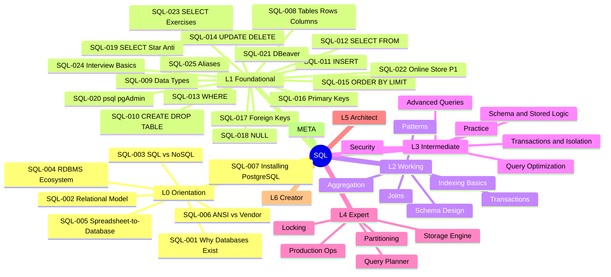

# SQL

```text
═══════════════════════════════════════════════════════
CATEGORY:        SQL
CODE:            SQL
ARCHETYPE:       LANGUAGE
MODE:            MODE_NEW
PROVENANCE:      user request via /learn: "sql"
TIER:            tier-2-data
FOLDER:          learn/sql/
LEVELS:          L0 + L1 + L2 + L3 + L4 + L5 + L6 + META
TOTAL:           142 keywords across 9 sub-topic files
GENERATED_FROM:  LEARN_KEYWORD_GENERATOR.md v1.0
═══════════════════════════════════════════════════════
```

Scope: the SQL language and relational database concepts -
from basic queries to storage engine internals, query planner
theory, and relational algebra. Covers ANSI SQL with
PostgreSQL as the primary dialect for examples. Vendor-specific
topics (MySQL, SQL Server, Oracle) appear in cross-references.
Hibernate/JPA integration is covered in `learn/hibernate/`.
Java JDBC access patterns are covered in `learn/java/`.

## Status

Stubs only. Each sub-topic file lists its keywords in YAML
frontmatter. Use `@learn-generate-entries` to fill content
per `LEARN_PROMPT.md` v1.0 (tri-template auto-routing).

## Sub-topic files

| File                                                                        | Keywords | Levels         | Status |
| --------------------------------------------------------------------------- | -------- | -------------- | ------ |
| [SQL - Foundations](SQL%20-%20Foundations.md)                               | 25       | L0 + L1        | stub   |
| [SQL - Working Queries](SQL%20-%20Working%20Queries.md)                     | 27       | L2             | stub   |
| [SQL - Design and Optimization](SQL%20-%20Design%20and%20Optimization.md)   | 32       | L3             | stub   |
| [SQL - Production and Internals Part 1](SQL%20-%20Production%20and%20Internals%20Part%201.md) | 10 | L4 | stub |
| [SQL - Production and Internals Part 2](SQL%20-%20Production%20and%20Internals%20Part%202.md) | 9 | L4 | stub |
| [SQL - Production and Internals Part 3](SQL%20-%20Production%20and%20Internals%20Part%203.md) | 9 | L4 | stub |
| [SQL - Architecture and META Part 1](SQL%20-%20Architecture%20and%20META%20Part%201.md) | 10 | L5 + L6 + META | stub |
| [SQL - Architecture and META Part 2](SQL%20-%20Architecture%20and%20META%20Part%202.md) | 10 | L5 + L6 + META | stub |
| [SQL - Architecture and META Part 3](SQL%20-%20Architecture%20and%20META%20Part%203.md) | 10 | L5 + L6 + META | stub |

## Keyword table

────────────────────────────────────────────────────
LEVEL 0 - ORIENTATION 🌱 (7 keywords)
────────────────────────────────────────────────────

| ID      | Keyword                                       | Lv  | Diff | template | Tags |
| ------- | --------------------------------------------- | --- | ---- | -------- | ---- |
| SQL-001 | Why Databases Exist                           | L0  | 🌱   | SIMPLE   |      |
| SQL-002 | The Relational Model - How Tables Think       | L0  | 🌱   | SIMPLE   |      |
| SQL-003 | SQL vs NoSQL - The Landscape                  | L0  | 🌱   | SIMPLE   | 🧭   |
| SQL-004 | RDBMS Ecosystem - Postgres, MySQL, SQL Server | L0  | 🌱   | SIMPLE   |      |
| SQL-005 | The Spreadsheet-to-Database Leap              | L0  | 🌱   | SIMPLE   |      |
| SQL-006 | ANSI SQL vs Vendor Dialects                   | L0  | 🌱   | SIMPLE   |      |
| SQL-007 | Installing PostgreSQL - First Database        | L0  | 🌱   | SIMPLE   | 🔧   |

────────────────────────────────────────────────────
LEVEL 1 - FOUNDATIONAL ★☆☆ (18 keywords)
────────────────────────────────────────────────────

| ID      | Keyword                                      | Lv  | Diff | template | Tags          |
| ------- | -------------------------------------------- | --- | ---- | -------- | ------------- |
| SQL-008 | Tables, Rows, and Columns                    | L1  | ★☆☆  | SIMPLE   |               |
| SQL-009 | Data Types - Integers, Text, Dates, Booleans | L1  | ★☆☆  | SIMPLE   |               |
| SQL-010 | CREATE TABLE and DROP TABLE                  | L1  | ★☆☆  | SIMPLE   |               |
| SQL-011 | INSERT - Adding Rows                         | L1  | ★☆☆  | SIMPLE   |               |
| SQL-012 | SELECT and FROM - Reading Data               | L1  | ★☆☆  | SIMPLE   |               |
| SQL-013 | WHERE - Filtering Rows                       | L1  | ★☆☆  | SIMPLE   |               |
| SQL-014 | UPDATE and DELETE - Modifying Data           | L1  | ★☆☆  | SIMPLE   |               |
| SQL-015 | ORDER BY and LIMIT                           | L1  | ★☆☆  | SIMPLE   |               |
| SQL-016 | Primary Keys and Uniqueness                  | L1  | ★☆☆  | SIMPLE   |               |
| SQL-017 | Foreign Keys and Relationships               | L1  | ★☆☆  | SIMPLE   |               |
| SQL-018 | NULL - The Three-Valued Logic Trap           | L1  | ★☆☆  | SIMPLE   | 💥            |
| SQL-019 | SELECT \* in Production Anti-Pattern         | L1  | ★☆☆  | SIMPLE   | ⚠️ anti-major |
| SQL-020 | psql and pgAdmin - First Tools               | L1  | ★☆☆  | SIMPLE   | 🔧            |
| SQL-021 | DBeaver - Universal Database Client          | L1  | ★☆☆  | SIMPLE   | 🔧            |
| SQL-022 | Online Store DB - Phase 1 (Schema and CRUD)  | L1  | ★☆☆  | SIMPLE   | 🔨 🏋️         |
| SQL-023 | Basic SELECT Exercises                       | L1  | ★☆☆  | SIMPLE   | 🏋️            |
| SQL-024 | Top 10 SQL Interview Questions - Basics      | L1  | ★☆☆  | SIMPLE   | 🎯            |
| SQL-025 | SQL Aliases and Expressions                  | L1  | ★☆☆  | SIMPLE   |               |

────────────────────────────────────────────────────
LEVEL 2 - WORKING ★★☆ (27 keywords)
────────────────────────────────────────────────────

| ID      | Keyword                                         | Lv  | Diff | template     | Tags             |
| ------- | ----------------------------------------------- | --- | ---- | ------------ | ---------------- |
| SQL-026 | INNER JOIN - Matching Rows Across Tables        | L2  | ★★☆  | INTERMEDIATE |                  |
| SQL-027 | LEFT JOIN and RIGHT JOIN                        | L2  | ★★☆  | INTERMEDIATE |                  |
| SQL-028 | FULL OUTER JOIN and CROSS JOIN                  | L2  | ★★☆  | INTERMEDIATE |                  |
| SQL-029 | Self-Joins - When a Table References Itself     | L2  | ★★☆  | INTERMEDIATE |                  |
| SQL-030 | UNION, INTERSECT, EXCEPT                        | L2  | ★★☆  | INTERMEDIATE |                  |
| SQL-031 | Aggregate Functions - COUNT, SUM, AVG, MIN, MAX | L2  | ★★☆  | INTERMEDIATE |                  |
| SQL-032 | GROUP BY and HAVING                             | L2  | ★★☆  | INTERMEDIATE |                  |
| SQL-033 | Subqueries - Scalar, Row, Table                 | L2  | ★★☆  | INTERMEDIATE |                  |
| SQL-034 | Normalization - 1NF, 2NF, 3NF                   | L2  | ★★☆  | INTERMEDIATE | 🎯               |
| SQL-035 | Denormalization - When and Why                  | L2  | ★★☆  | INTERMEDIATE | 🧭               |
| SQL-036 | CHECK, DEFAULT, and NOT NULL Constraints        | L2  | ★★☆  | INTERMEDIATE |                  |
| SQL-037 | Entity-Relationship Modeling Basics             | L2  | ★★☆  | INTERMEDIATE |                  |
| SQL-038 | Transactions - BEGIN, COMMIT, ROLLBACK          | L2  | ★★☆  | INTERMEDIATE |                  |
| SQL-039 | ACID Properties - What They Actually Mean       | L2  | ★★☆  | INTERMEDIATE | 🎯               |
| SQL-040 | Indexes - What They Are and Why They Matter     | L2  | ★★☆  | INTERMEDIATE |                  |
| SQL-041 | B-Tree Index Basics                             | L2  | ★★☆  | INTERMEDIATE |                  |
| SQL-042 | EXPLAIN - Reading Your First Query Plan         | L2  | ★★☆  | INTERMEDIATE | 🔧               |
| SQL-043 | Index on Every Column Anti-Pattern              | L2  | ★★☆  | INTERMEDIATE | ⚠️ anti-major    |
| SQL-044 | CASE Expressions and Conditional Logic          | L2  | ★★☆  | INTERMEDIATE |                  |
| SQL-045 | String Functions and Pattern Matching (LIKE)    | L2  | ★★☆  | INTERMEDIATE |                  |
| SQL-046 | Date and Time Functions                         | L2  | ★★☆  | INTERMEDIATE |                  |
| SQL-047 | Normalize-or-Denormalize Decision Guide         | L2  | ★★☆  | INTERMEDIATE | 🧭               |
| SQL-048 | Online Store DB - Phase 2 (Joins and Reports)   | L2  | ★★☆  | INTERMEDIATE | 🔨 🏋️            |
| SQL-049 | JOIN Practice Kata                              | L2  | ★★☆  | INTERMEDIATE | 🏋️               |
| SQL-050 | SQL Working-Level Quick Recall Card             | L2  | ★★☆  | INTERMEDIATE | 🔁               |
| SQL-051 | SQL Interview Essentials - Working Level        | L2  | ★★☆  | INTERMEDIATE | 🎯               |
| SQL-052 | N+1 Query Anti-Pattern                          | L2  | ★★☆  | INTERMEDIATE | ⚠️ anti-critical |

────────────────────────────────────────────────────
LEVEL 3 - INTERMEDIATE ★★☆+ (32 keywords)
────────────────────────────────────────────────────

| ID      | Keyword                                         | Lv  | Diff | template     | Tags             |
| ------- | ----------------------------------------------- | --- | ---- | ------------ | ---------------- |
| SQL-053 | Common Table Expressions (CTEs)                 | L3  | ★★☆  | INTERMEDIATE |                  |
| SQL-054 | Recursive CTEs - Hierarchical Data              | L3  | ★★☆  | INTERMEDIATE |                  |
| SQL-055 | Window Functions - ROW_NUMBER, RANK, DENSE_RANK | L3  | ★★☆  | INTERMEDIATE | 🎯               |
| SQL-056 | Window Functions - LAG, LEAD, NTILE             | L3  | ★★☆  | INTERMEDIATE |                  |
| SQL-057 | Window Frames - ROWS vs RANGE vs GROUPS         | L3  | ★★☆  | INTERMEDIATE |                  |
| SQL-058 | Correlated Subqueries and Lateral Joins         | L3  | ★★☆  | INTERMEDIATE |                  |
| SQL-059 | GROUPING SETS, CUBE, ROLLUP                     | L3  | ★★☆  | INTERMEDIATE |                  |
| SQL-060 | Execution Plans Deep Dive - EXPLAIN ANALYZE     | L3  | ★★☆  | INTERMEDIATE | 🔧               |
| SQL-061 | Index Types - B-Tree, Hash, GIN, GiST, BRIN     | L3  | ★★☆  | INTERMEDIATE |                  |
| SQL-062 | Composite Indexes and Column Order              | L3  | ★★☆  | INTERMEDIATE | 🎯               |
| SQL-063 | Covering Indexes (Index-Only Scans)             | L3  | ★★☆  | INTERMEDIATE |                  |
| SQL-064 | Query Performance Tuning Patterns               | L3  | ★★☆  | INTERMEDIATE | ⚡               |
| SQL-065 | Implicit Conversions Kill Your Indexes          | L3  | ★★☆  | INTERMEDIATE | 💥               |
| SQL-066 | Slow Query Log Analysis                         | L3  | ★★☆  | INTERMEDIATE | 🔧 📊            |
| SQL-067 | Transaction Isolation Levels                    | L3  | ★★☆  | INTERMEDIATE | 🎯               |
| SQL-068 | Read Phenomena - Dirty, Non-Repeatable, Phantom | L3  | ★★☆  | INTERMEDIATE |                  |
| SQL-069 | Optimistic vs Pessimistic Locking               | L3  | ★★☆  | INTERMEDIATE | 🧭               |
| SQL-070 | Long Transaction Anti-Pattern                   | L3  | ★★☆  | INTERMEDIATE | ⚠️ anti-critical |
| SQL-071 | Views - Logical Abstraction over Tables         | L3  | ★★☆  | INTERMEDIATE |                  |
| SQL-072 | Materialized Views                              | L3  | ★★☆  | INTERMEDIATE |                  |
| SQL-073 | Stored Procedures and Functions                 | L3  | ★★☆  | INTERMEDIATE |                  |
| SQL-074 | Triggers - Use Cases and Dangers                | L3  | ★★☆  | INTERMEDIATE | ⚠️ anti-major    |
| SQL-075 | Schema Migration Fundamentals                   | L3  | ★★☆  | INTERMEDIATE | 🔄               |
| SQL-076 | Flyway and Liquibase - Migration Tooling        | L3  | ★★☆  | INTERMEDIATE | 🔧 🔄            |
| SQL-077 | SQL Injection - Anatomy and Prevention          | L3  | ★★☆  | INTERMEDIATE | ⚠️ anti-critical |
| SQL-078 | GRANT, REVOKE, and Role-Based Access            | L3  | ★★☆  | INTERMEDIATE | 📋               |
| SQL-079 | Testing SQL - Unit, Integration, Fixtures       | L3  | ★★☆  | INTERMEDIATE | 🧪               |
| SQL-080 | Explain a Query Plan to Any Audience            | L3  | ★★☆  | INTERMEDIATE | 🎓               |
| SQL-081 | Online Store DB - Phase 3 (Optimization)        | L3  | ★★☆  | INTERMEDIATE | 🔨 🏋️            |
| SQL-082 | Window Functions Practice Kata                  | L3  | ★★☆  | INTERMEDIATE | 🏋️               |
| SQL-083 | SQL Design-Level Knowledge Self-Assessment      | L3  | ★★☆  | INTERMEDIATE | 🔁               |
| SQL-084 | SQL System Design Interview Patterns            | L3  | ★★☆  | INTERMEDIATE | 🎯               |

────────────────────────────────────────────────────
LEVEL 4 - EXPERT ★★★ (28 keywords)
────────────────────────────────────────────────────

| ID      | Keyword                                          | Lv  | Diff | template | Tags             |
| ------- | ------------------------------------------------ | --- | ---- | -------- | ---------------- |
| SQL-085 | MVCC Internals - How Concurrent Reads Work       | L4  | ★★★  | COMPLEX  | 🎯               |
| SQL-086 | Write-Ahead Log (WAL) - Crash Recovery Mechanism | L4  | ★★★  | COMPLEX  |                  |
| SQL-087 | Buffer Pool and Shared Memory Architecture       | L4  | ★★★  | COMPLEX  |                  |
| SQL-088 | Page Structure and Tuple Layout                  | L4  | ★★★  | COMPLEX  |                  |
| SQL-089 | VACUUM and Bloat Management (PostgreSQL)         | L4  | ★★★  | COMPLEX  |                  |
| SQL-090 | Row-Level vs Table-Level Locking                 | L4  | ★★★  | COMPLEX  |                  |
| SQL-091 | Lock Escalation and Contention                   | L4  | ★★★  | COMPLEX  |                  |
| SQL-092 | Deadlock Detection and Resolution                | L4  | ★★★  | COMPLEX  |                  |
| SQL-093 | Advisory Locks - Application-Level Coordination  | L4  | ★★★  | COMPLEX  |                  |
| SQL-094 | Query Planner and Cost-Based Optimization        | L4  | ★★★  | COMPLEX  |                  |
| SQL-095 | Statistics and Cardinality Estimation            | L4  | ★★★  | COMPLEX  |                  |
| SQL-096 | Join Algorithms - Nested Loop, Hash, Merge       | L4  | ★★★  | COMPLEX  | 🎯               |
| SQL-097 | Plan Regression and pg_stat_statements           | L4  | ★★★  | COMPLEX  | 🔧 📊            |
| SQL-098 | Table Partitioning - Range, List, Hash           | L4  | ★★★  | COMPLEX  |                  |
| SQL-099 | Partition Pruning and Query Routing              | L4  | ★★★  | COMPLEX  | ⚡               |
| SQL-100 | Logical Replication and Physical Replication     | L4  | ★★★  | COMPLEX  |                  |
| SQL-101 | Read Replicas - Scaling Reads                    | L4  | ★★★  | COMPLEX  |                  |
| SQL-102 | Connection Pooling - PgBouncer and HikariCP      | L4  | ★★★  | COMPLEX  | 🔧               |
| SQL-103 | Backup and Point-in-Time Recovery (PITR)         | L4  | ★★★  | COMPLEX  |                  |
| SQL-104 | Zero-Downtime Schema Migrations                  | L4  | ★★★  | COMPLEX  | 🔄               |
| SQL-105 | GitLab Database Incident (2017)                  | L4  | ★★★  | COMPLEX  | 🔴               |
| SQL-106 | GitHub MySQL Failover Incident (2018)            | L4  | ★★★  | COMPLEX  | 🔴               |
| SQL-107 | Unindexed Foreign Key Anti-Pattern               | L4  | ★★★  | COMPLEX  | ⚠️ anti-critical |
| SQL-108 | OFFSET Pagination at Scale Anti-Pattern          | L4  | ★★★  | COMPLEX  | ⚠️ anti-major    |
| SQL-109 | Online Store DB - Phase 4 (Internals and Tuning) | L4  | ★★★  | COMPLEX  | 🔨 🏋️            |
| SQL-110 | SQL Expert-Level Mastery Verification            | L4  | ★★★  | COMPLEX  | 🔁               |
| SQL-111 | SQL Deep-Dive Interview Questions                | L4  | ★★★  | COMPLEX  | 🎯               |
| SQL-112 | PCI-DSS and Data-at-Rest Encryption              | L4  | ★★★  | COMPLEX  | 📋               |

────────────────────────────────────────────────────
LEVEL 5 - ARCHITECT 🔥 (14 keywords)
────────────────────────────────────────────────────

| ID      | Keyword                                            | Lv  | Diff | template | Tags          |
| ------- | -------------------------------------------------- | --- | ---- | -------- | ------------- |
| SQL-113 | Sharding Strategies - Application vs Proxy         | L5  | 🔥   | COMPLEX  | 🧭            |
| SQL-114 | Multi-Database Topology Design                     | L5  | 🔥   | COMPLEX  |               |
| SQL-115 | Cross-Database Query Federation (FDW, Trino)       | L5  | 🔥   | COMPLEX  | 🔧            |
| SQL-116 | CQRS and Read/Write Separation Architecture        | L5  | 🔥   | COMPLEX  | 🧭            |
| SQL-117 | Database Version Migration Strategy at Scale       | L5  | 🔥   | COMPLEX  | 🔄            |
| SQL-118 | PostgreSQL to Cloud-Managed Migration              | L5  | 🔥   | COMPLEX  | 🔄            |
| SQL-119 | Connection Routing and Proxy Architecture          | L5  | 🔥   | COMPLEX  |               |
| SQL-120 | GDPR and Right-to-Erasure in SQL Systems           | L5  | 🔥   | COMPLEX  | 📋            |
| SQL-121 | Observability for Database Fleets                  | L5  | 🔥   | COMPLEX  | 📊            |
| SQL-122 | Database Capacity Planning and Growth Modeling     | L5  | 🔥   | COMPLEX  | ⚡            |
| SQL-123 | ORM Impedance Mismatch Anti-Pattern                | L5  | 🔥   | COMPLEX  | ⚠️ anti-major |
| SQL-124 | Online Store DB - Phase 5 (Multi-Region Strategy)  | L5  | 🔥   | COMPLEX  | 🔨            |
| SQL-125 | SQL Staff-Level Interview Scenarios                | L5  | 🔥   | COMPLEX  | 🎯            |
| SQL-126 | Teaching Transaction Isolation - Common Confusions | L5  | 🔥   | COMPLEX  | 🎓            |

────────────────────────────────────────────────────
LEVEL 6 - CREATOR 🔬 (10 keywords)
────────────────────────────────────────────────────

| ID      | Keyword                                           | Lv  | Diff | template | Tags |
| ------- | ------------------------------------------------- | --- | ---- | -------- | ---- |
| SQL-127 | Relational Algebra - The Theory Behind SQL        | L6  | 🔬   | COMPLEX  |      |
| SQL-128 | Codd's 12 Rules and Relational Completeness       | L6  | 🔬   | COMPLEX  |      |
| SQL-129 | SQL Standard Evolution - SQL-92 to SQL:2023       | L6  | 🔬   | COMPLEX  | 🔄   |
| SQL-130 | Query Optimization Theory - Selinger Optimizer    | L6  | 🔬   | COMPLEX  |      |
| SQL-131 | Isolation Formalism - Adya, Liskov, O'Neil (1999) | L6  | 🔬   | COMPLEX  |      |
| SQL-132 | LSM-Trees vs B-Trees - Storage Engine Design      | L6  | 🔬   | COMPLEX  | 🧭   |
| SQL-133 | Column-Store vs Row-Store Engine Design           | L6  | 🔬   | COMPLEX  |      |
| SQL-134 | Writing a SQL Parser from Scratch                 | L6  | 🔬   | COMPLEX  | 🏋️   |
| SQL-135 | The Volcano (Iterator) Execution Model            | L6  | 🔬   | COMPLEX  |      |
| SQL-136 | Vectorized vs Pipelined Query Execution           | L6  | 🔬   | COMPLEX  |      |

────────────────────────────────────────────────────
META - META-SKILLS 🧠 (6 keywords)
────────────────────────────────────────────────────

| ID      | Keyword                                             | Lv   | Diff | template | Tags |
| ------- | --------------------------------------------------- | ---- | ---- | -------- | ---- |
| SQL-137 | What OS Page Caches Teach Database Buffer Pools     | META | 🧠   | COMPLEX  |      |
| SQL-138 | What Compiler Optimization Teaches Query Planning   | META | 🧠   | COMPLEX  |      |
| SQL-139 | Set-Based Thinking vs Procedural Thinking           | META | 🧠   | COMPLEX  |      |
| SQL-140 | Data Gravity as System Design Constraint            | META | 🧠   | COMPLEX  |      |
| SQL-141 | Declarative vs Imperative - The SQL Paradigm Lesson | META | 🧠   | COMPLEX  |      |
| SQL-142 | Teaching SQL to Procedural Programmers              | META | 🧠   | COMPLEX  | 🎓   |

<!-- ROADMAP-TREE:START -->

## Roadmap

```text
ROADMAP TREE - SQL
===========================================================
L0 Orientation
 +-- SQL-001 Why Databases Exist
 +-- SQL-002 Relational Model
 +-- SQL-003 SQL vs NoSQL
 +-- SQL-004 RDBMS Ecosystem
 +-- SQL-005 Spreadsheet-to-Database
 +-- SQL-006 ANSI vs Vendor Dialects
 +-- SQL-007 Installing PostgreSQL
L1 Foundational
 +-- SQL-008 Tables, Rows, Columns
 +-- SQL-009 Data Types
 +-- SQL-010 CREATE/DROP TABLE
 +-- SQL-011 INSERT
 +-- SQL-012 SELECT and FROM
 +-- SQL-013 WHERE
 +-- SQL-014 UPDATE and DELETE
 +-- SQL-015 ORDER BY and LIMIT
 +-- SQL-016 Primary Keys
 +-- SQL-017 Foreign Keys
 +-- SQL-018 NULL Three-Valued Logic
 +-- SQL-019 SELECT * Anti-Pattern
 +-- SQL-020 psql and pgAdmin
 +-- SQL-021 DBeaver
 +-- SQL-022 Online Store Phase 1
 +-- SQL-023 SELECT Exercises
 +-- SQL-024 Interview Basics
 +-- SQL-025 Aliases and Expressions
L2 Working
 +-- CLUSTER: Joins
 |    +-- SQL-026 INNER JOIN
 |    +-- SQL-027 LEFT/RIGHT JOIN
 |    +-- SQL-028 FULL OUTER/CROSS JOIN
 |    +-- SQL-029 Self-Joins
 |    +-- SQL-030 Set Operations
 +-- CLUSTER: Aggregation
 |    +-- SQL-031 Aggregate Functions
 |    +-- SQL-032 GROUP BY/HAVING
 |    +-- SQL-033 Subqueries
 +-- CLUSTER: Schema Design
 |    +-- SQL-034 Normalization
 |    +-- SQL-035 Denormalization
 |    +-- SQL-036 Constraints
 |    +-- SQL-037 ER Modeling
 +-- CLUSTER: Transactions
 |    +-- SQL-038 BEGIN/COMMIT/ROLLBACK
 |    +-- SQL-039 ACID
 +-- CLUSTER: Indexing Basics
 |    +-- SQL-040 Indexes Intro
 |    +-- SQL-041 B-Tree Basics
 |    +-- SQL-042 EXPLAIN
 |    +-- SQL-043 Index-Everything Anti
 +-- CLUSTER: Patterns
      +-- SQL-044 CASE Expressions
      +-- SQL-045 String Functions
      +-- SQL-046 Date/Time Functions
      +-- SQL-047 Norm Decision Guide
      +-- SQL-048 Online Store Phase 2
      +-- SQL-049 JOIN Kata
      +-- SQL-050 Recall Card
      +-- SQL-051 Interview Working
      +-- SQL-052 N+1 Anti-Pattern
L3 Intermediate
 +-- SQL-053..SQL-084 (32 keywords)
L4 Expert
 +-- SQL-085..SQL-112 (28 keywords)
L5 Architect
 +-- SQL-113..SQL-126 (14 keywords)
L6 Creator
 +-- SQL-127..SQL-136 (10 keywords)
META
 +-- SQL-137..SQL-142 (6 keywords)
```



<!-- ROADMAP-TREE:END -->
